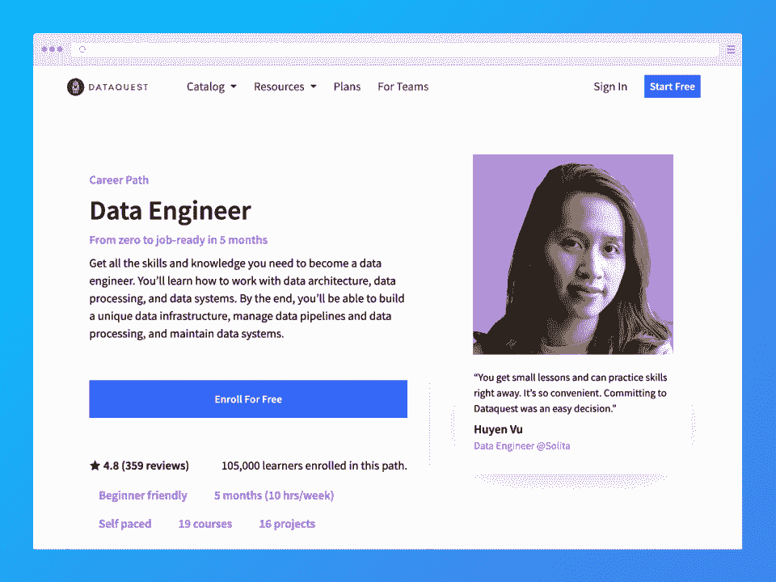
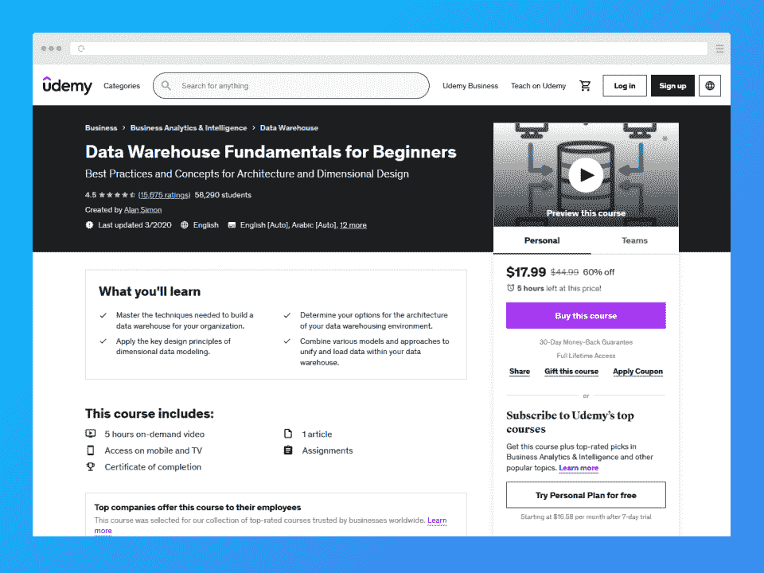
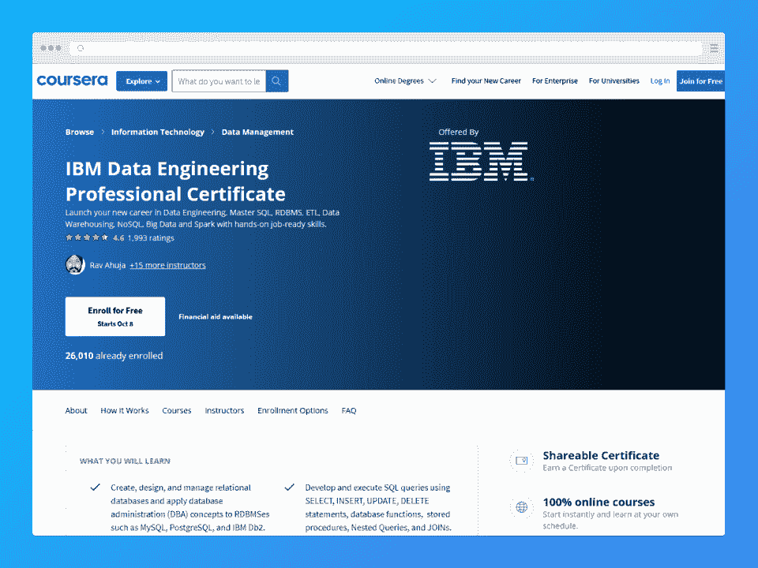
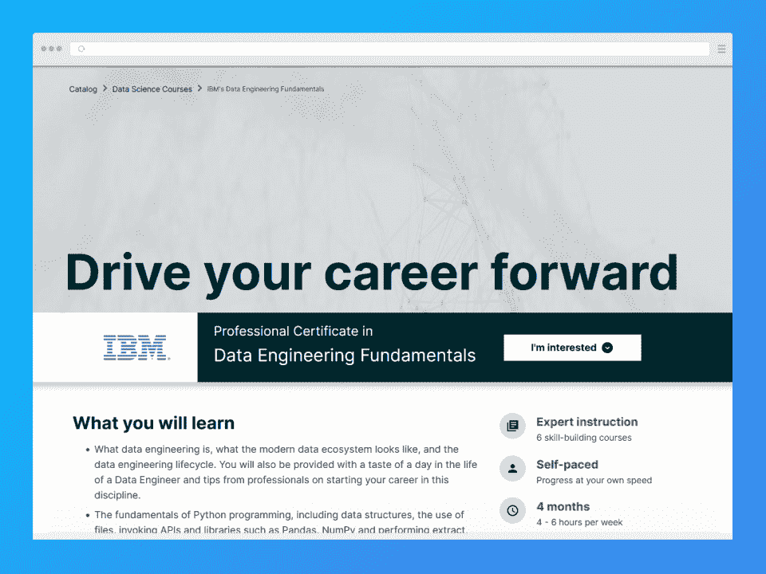
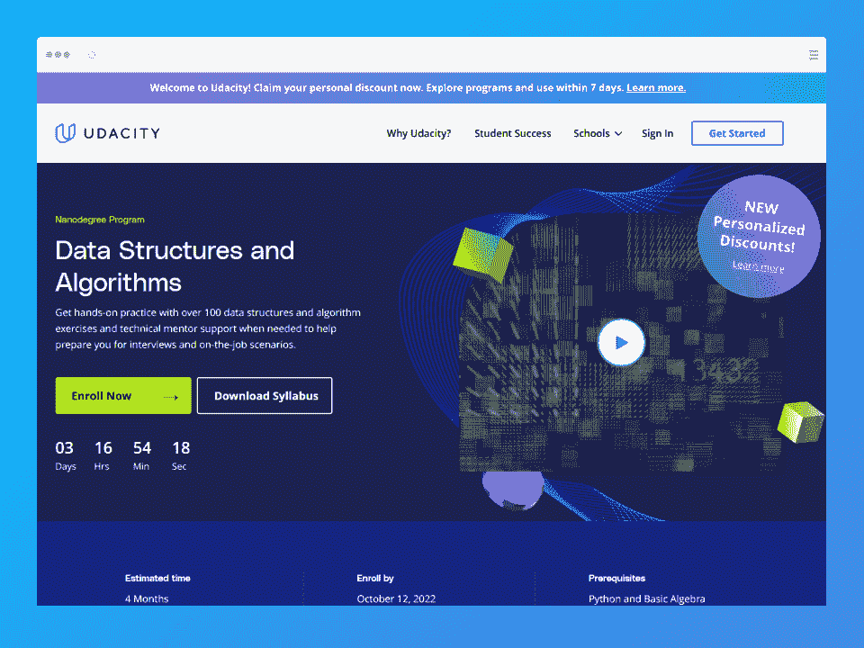
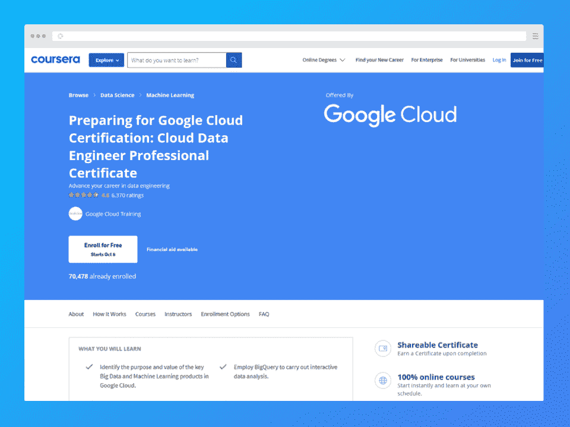
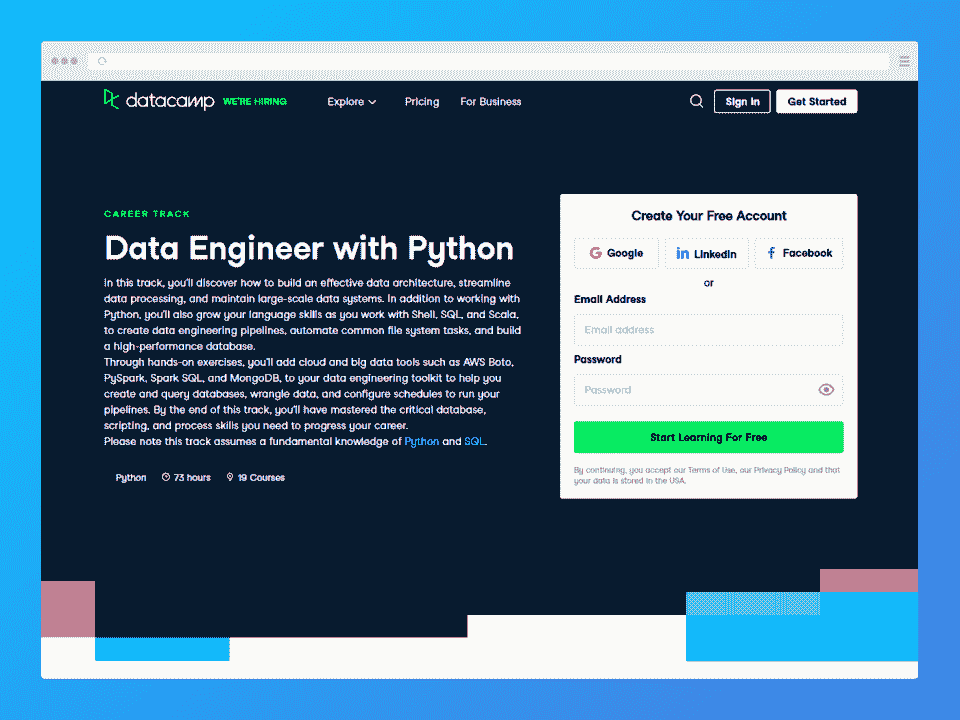
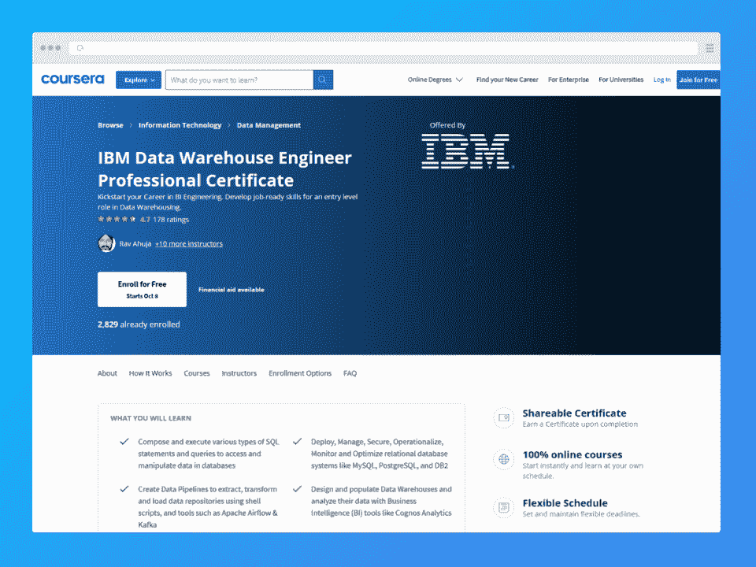
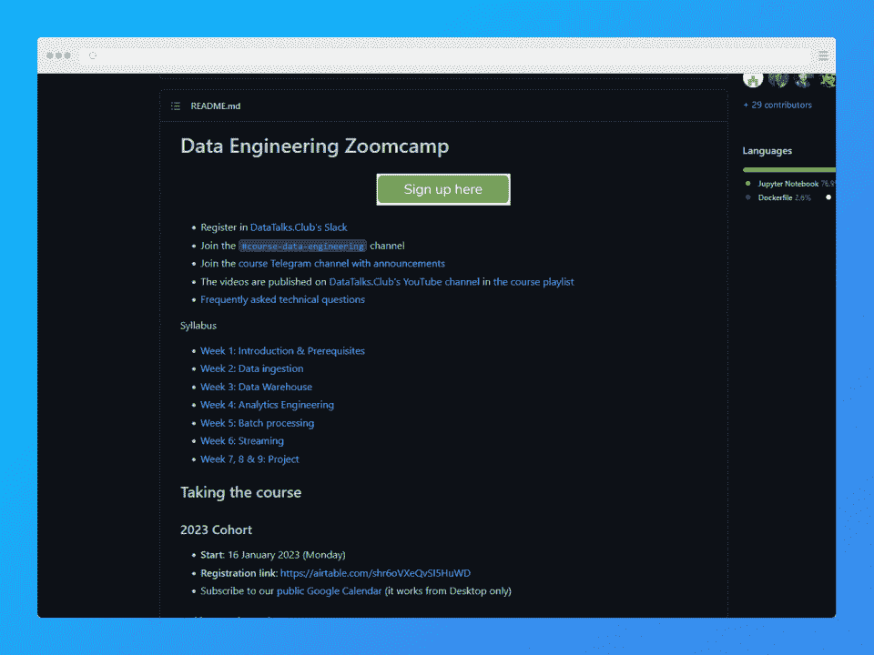

# 2023 年开启新职业的 10 门最佳数据工程课程

> 原文：<https://hackr.io/blog/best-data-engineering-courses>

可能有一天你会考虑一份新的职业。当你在寻找新的职业时，有两个考虑因素会浮现在你的脑海中:财务安全和工作安全。在当今的数字世界中，一些行业同时提供两种类型的安全性。其中之一涉及数据。

随着越来越多的企业和组织开始转向以数据为中心和驱动的战略，对数据专业人员的需求继续飙升。因此，越来越多的人考虑转行，成为数据分析师、科学家或工程师也就不足为奇了。

如果你也在考虑数据工程的潜在职业，你可能想知道你应该从哪里开始。如果你对这个领域完全陌生，不知道你需要什么样的技能才能被录用，这种情况可能尤其如此。

本文向您展示了一些最好的数据工程课程，以帮助您在通往新职业的道路上找到立足点。我们甚至讨论每个技能级别的选项，以帮助您找到更好的起点。请继续阅读，找出最适合你的数据工程在线课程！

## **2023 年顶级数据工程师课程**

数据工程的[领域发展迅速。由于供不应求，各公司都在努力寻找员工来填补他们团队中的职位。由于这个原因，数据工程专业人员在美国的平均收入往往达到六位数。除了高平均工资，数据工程师还可以享受工作保障的好处。](https://hackr.io/blog/what-is-data-engineering)

如果你准备开始数据工程师的职业生涯，你可以参加在线数据工程课程来帮助你开始。

1.  【Udacity】数据工程师纳米学位项目 *-* ***编辑推荐***
2.  [Dataquest]数据工程职业道路
3.  [Udemy]初学者的数据仓库基础
4.  [Coursera]IBM 数据工程专业证书
5.  IBM 颁发的数据工程基础专业证书
6.  数据结构和算法
7.  【Coursera】谷歌云数据工程师职业证书
8.  [DataCamp]数据工程师，Python 职业跟踪
9.  [Coursera]IBM 数据仓库工程专业证书
10.  数据工程 Zoomcamp

## **数据工程课程帮助你在 2023 年开始职业生涯**

[****](https://imp.i115008.net/154zWB)

**评级** : 4.8/5

**定价**:

*   如果按月计算，每月 399 美元
*   如果您预先付费，5 个月的访问费用为 1，695 美元
*   Udacity 还提供个性化折扣，让您节省更多成本

Udacity 是一个提供名为 Nanodegrees 的密集在线课程的平台。每一个完美定制的纳米学位都有助于你从头到尾了解某个特定领域的所有知识。例如，数据工程师纳米学位项目为你提供了在该领域开始找工作所需的知识和技能。

这个 Nanodegree 教学生使用一些最流行和行业领先的工具，如 Apache Airflow、Spark、Apache Cassandra 等。

**优点**

*   教授您行业领先的工具和重要的技能和知识，让您成为一名成功的数据工程师
*   以一个你可以放入文件夹的顶点项目结束
*   Udacity 是一个知名且受人尊敬的平台；通过他们的课程获得的证书被许多潜在雇主广泛认可
*   提供职业服务

**缺点**

*   绝对是价格更高的一方

#### 课程总结

| **平台** | Udacity |
| **课程持续时间** | 五个月，每周工作 5 至 10 小时 |
| **先决条件** | Python 和 SQL 的中级知识 |
| **认证** | 是 |
| **定价** | 399 美元/月逐月；5 个月的访问费用为 1，695 美元

*   查看 Udacity 的个性化折扣，获得更多潜在的成本节约
*   [****](https://www.dataquest.io/path/data-engineering/)

 |

**评级** : 4.6/5

**定价**:

有限免费永久计划允许您访问有限的资源和课程

*   保费计划起价为每月 49 美元，按月支付
*   年度会员更实惠，每年 399 美元
*   团队计划也可用
*   Dataquest 的数据工程职业道路将带你经历成为一名数据工程师所需的每一堂课。这个数据工程项目价格适中，但它的自定进度课程没有视频。你还需要 SQL 和 Python 的基础知识。

**优点**

每门课程都有指导性的项目来帮助学生实践他们所学的知识

*   课程结构合理，课程质量高
*   结束时获得结业证书
*   学习 Python
*   **缺点**

与其他平台相比，内容不多

*   课程是基于文本的；没有视频
*   课程总结

#### **平台**

| Dataquest | **课程持续时间** |
| 自定进度；21 门课程 | **先决条件** |
| 一些基本的 Python 和 SQL 知识 | **认证** |
| 有；竣工证明 | **定价** |
| 永久免费计划，或者 | 每月 49 美元，按月支付

*   每年 399 美元
*   [****](https://click.linksynergy.com/deeplink?id=jU79Zysihs4&mid=39197&murl=https%3A%2F%2Fwww.udemy.com%2Fcourse%2Fdata-warehouse-fundamentals-for-beginners%2F)
*   **评级** : 4.4/5

 |

**定价**:

特价时一次性购买 44.99 美元或 17.99 美元

30 天退款保证

*   如果您需要专门学习构建数据仓库，初学者的数据仓库基础是最好的数据工程课程之一。Udemy 的课程价格实惠，易于获取，您可以永久保留您购买的课程！
*   Udemy 的唯一缺点是，并非所有潜在雇主都承认在 Udemy 上获得的证书是有效的证书。这是因为*任何人*都可以在平台上创建课程，这意味着课程的质量并不总是好的。

**优点**

负担得起，尤其是如果你买了打折的课程

永远保持航向

*   非常适合初学者
*   容易接近和方便
*   **缺点**
*   因为任何人都可以在 Udemy 上创建课程，所以许多雇主不承认在这个平台上获得的证书

课程总结

*   **平台**

#### 乌德米

| **课程持续时间** | 自定进度；5h9m 视频点播，共 68 场讲座 |
| **先决条件** | 对 SQL 基础和关系数据库有基本的理解或知识 |
| **认证** | 有；竣工证明 |
| **定价** | 特价时一次性购买 44.99 美元或 17.99 美元 |
| 30 天退款保证 | [****](https://imp.i384100.net/qnPomb)

*   **评级** : 4.6/5
*   **定价**:

 |

那就 7 天免费试用

Coursera Plus 订阅每月 49 美元，按月支付，或每年 399 美元

年度选项附带 14 天退款保证

*   如果您想在完成数据工程课程后获得专业证书，这个 IBM 数据工程专业证书是一个很好的起点。这个项目将教会你从基础开始的一切，这样你就可以在毕业后开始找工作了。
*   这只是 Coursera 上众多数据工程项目中的一个，每个项目都是与 IBM 合作提供的。然而，这门课程需要最大的投入，因为如果你每周花四个小时学习，你将需要十五周才能完成。
*   **优点**

世界领先的技术公司之一 IBM 提供的课程

完成后获得专业证书

可通过 Coursera Plus 订阅获得

*   完成学业可以让你获得多达 12 个可转让的大学学分
*   **缺点**
*   这里更多的是关注 IBM 产品，所以如果你想要更全面的教育，你可能在这里得不到
*   需要 15 个月，每周 4 小时

课程总结

*   **平台**
*   Coursera + IBM

#### **课程持续时间**

| 15 个月，每周完成 4 小时 | **先决条件** |
| 不需要预先编程或数据工程知识/技能 | **认证** |
| 有；专业证书 | **定价** |
| 那就 7 天免费试用 | Coursera Plus 订阅每月支付 49 美元，或每年支付 399 美元(每年有 14 天退款保证) |
| [****](https://www.awin1.com/cread.php?awinmid=6798&awinaffid=428263&ued=https%3A%2F%2Fwww.edx.org%2Fprofessional-certificate%2Fibm-data-engineering-fundamentals) | **评级** : 4.7/5

*   **定价**:
*   全价$ 524；折扣后为 471.60 美元

 |

数据工程基础是与 IBM 合作提供的另一门课程，这次是在 edX 上。对于没有知识或经验的初学者来说，本课程是一个负担得起的高质量选择。

**优点**

世界领先的技术公司之一 IBM 提供的课程

*   完成后获得专业证书

总体价格合理

初学者的绝佳选择

*   **缺点**
*   更适合初学者，因为它更多地讨论基础知识，而不是深入的高级概念
*   课程总结
*   **平台**

edX + IBM

*   **课程持续时间**

#### 四个月，每周工作 4 至 6 小时；自定进度

| **先决条件** | 不需要预先的编程、数据科学或数据工程知识/技能 |
| **认证** | 是的，专业证书 |
| **定价** | 全价$ 524；折扣后为 471.60 美元 |
| [****](https://imp.i115008.net/n1mVWV) | **评级** : 4.7/5 |
| **定价**: | 如果按月计算，每月 399 美元 |

如果您预先付费，4 个月的访问费用为 1396 美元

Udacity 也有个性化折扣，这可能会让您节省更多的成本

数据结构和算法是 Udacity 提供的另一个纳米学位，估计需要四个月来学习。这个项目教你如何做，然后让你通过动手项目来实践你所学到的东西，你可以在以后将这些东西添加到你的投资组合中。

*   **优点**
*   Udacity 证书受到很多潜在雇主的尊重和接受
*   纳米学位非常深入，课程设计也很好

导师支持和职业服务

真实世界项目

*   **缺点**
*   在价格较高的一端
*   每周 10 小时需要更多的投入
*   课程总结

**平台**

*   Udacity
*   **课程持续时间**

#### 四个月，每周十小时

| **先决条件** | 基础代数和 Python 知识 |
| **认证** | 是 |
| **定价** | 399 美元/月逐月；4 个月的访问费用为 1，356 美元 |
| 查看 Udacity 的个性化折扣，获得更多潜在的成本节约 | [****](https://imp.i384100.net/WDVEgJ) |
| **评级** : 4.6/5 | **定价**:

*   那就 7 天免费试用
*   Coursera Plus 订阅每月 49 美元，按月支付，或每年 399 美元

 |

年度选项附带 14 天退款保证

谷歌云数据工程师专业证书有双重用途:它为你的谷歌云认证评估做准备，同时在你完成后给你一个专业证书。这个 Coursera 项目是与谷歌云培训一起提供的，如果你每周学习三个小时，需要五个月才能完成。然而，如果你每周花更多的时间学习，你可以完成得更快！

**优点**

*   完成后的专业证书
*   灵活的时间表
*   向谷歌云培训学习

使用 Qwiklabs 进行动手实验，获得额外的体验

**缺点**

*   这个数据工程课程更多的是针对中级用户
*   课程总结
*   **平台**
*   Coursera +谷歌云培训

**课程持续时间**

*   五个月，每周完成 3 小时

#### **先决条件**

| SQL 和类似语言的基本知识和技能，应用程序开发经验 | **认证** |
| 有；专业证书 | **定价** |
| 那就 7 天免费试用 | Coursera Plus 订阅每月 49 美元，按月支付或每年 399 美元(每年有 14 天退款保证) |
| [****](https://datacamp.pxf.io/MXrEon) | **评级** : 4.6/5 |
| **定价**:在学习层下，有四个计划— | 基本计划(永远免费)提供有限的访问权限

*   **优惠计划**第一个月(促销期间)起价 1 美元，此后每月 15 美元或每年 149 美元
*   **团队(2 个或更多用户)每年每个用户/月的费用为 25 美元**

 |

DataCamp 是数据专业界的知名平台。在这里获得的证书往往会被潜在雇主认可和接受，这要归功于众所周知的事实，即 DataCamp 的课程质量很高。这门自定进度的课程从头开始教授所有内容，并将课程分成小部分。不幸的是，没有顶石项目。

***想了解更多关于 DataCamp 的信息？查看我们的*** [***深度 2023 DataCamp 回顾***](https://hackr.io/blog/datacamp-review) ***。***

**优点**

*   许多潜在雇主都认可 DataCamp 的结业证书
*   DataCamp 的数据工程培训从基础开始

*   将课程分成小块

**缺点**

没有封顶项目来结束你的学习

不会教授您需要的所有方面，例如机器设置

*   课程总结
*   **平台**
*   数据营

**课程持续时间**

*   19 门课程，73 学时；自定进度
*   **先决条件**

#### 对 SQL 和 Python 有基本的了解

| **认证** | 有；竣工证明 |
| **定价** | 基本-永远免费 |
| 高级-每月支付 15 美元或每年 149 美元 | 团队(2 个用户或更多)-每年支付每个用户/月 25 美元 |
| 自定义企业定价 | [****](https://imp.i384100.net/BX4keJ) |
| **评级** : 4.6/5 | **定价**:

*   那就 7 天免费试用
*   Coursera Plus 订阅每月 49 美元，按月支付，或每年 399 美元
*   年度选项附带 14 天退款保证
*   IBM 数据仓库工程师职业证书是 Coursera 和 IBM 提供的另一门数据工程课程。学完这门课程后，你将获得专业证书。本课程是对上面列出的其他 IBM 课程的补充，因为本课程更侧重于数据仓库工程。如果你每周花三到四个小时学习，你可以在九个月内完成。

 |

**优点**

完成后的专业证书

灵活的时间表

*   世界领先的技术公司之一 IBM 提供的课程
*   可通过 Coursera Plus 订阅获得
*   **缺点**

这里更多的是关注 IBM 产品，所以如果你想要更全面的教育，你可能在这里得不到

课程总结

*   **平台**
*   Coursera + IBM
*   **课程持续时间**
*   九个月，每周工作 3 至 4 小时

**先决条件**

*   不需要以前的数据工程或编程技能

#### **认证**

| 有；专业证书 | **定价** |
| 那就 7 天免费试用 | Coursera Plus 订阅每月 49 美元，按月支付或每年 399 美元(每年有 14 天退款保证) |
| [****](https://github.com/DataTalksClub/data-engineering-zoomcamp) | **评级** : 4.5/5 |
| **定价**: | 100%免费；你所要做的就是[注册](https://airtable.com/shr6oVXeQvSI5HuWD) |
| [DataTalks.club](https://datatalks.club/) 是一个面向当前和未来数据专业人士的优秀社区。通过 DataTalks，你可以遇到志同道合的同行，与他们讨论数据、工程和机器学习。在同一个平台上，你还可以免费参加课程和每周活动，以及寻求职业建议。 | DataTalks.club 的数据工程 Zoomcamp 是完全免费的。如果你选择加入队列并以这种方式学习，你可以在九周内完成课程。每周涵盖一个与数据工程相关的不同主题。您也可以选择自定进度选项，因为所有课程材料都已经在 [GitHub 页面](https://github.com/DataTalksClub/data-engineering-zoomcamp)上提供。

*   如果你最后完成了项目，你甚至可以获得结业证书！
*   **优点**

 |

完全免费！

你可以选择参加为期九周的班级，也可以选择自定进度的学习方式

涵盖九周中每一周的各种主题

*   **缺点**

不适合绝对初学者，会需要一些编码知识

课程总结

**平台**

数据会谈.俱乐部

*   **课程持续时间**
*   九周
*   **先决条件**

必须熟悉命令行和编码，以及 SQL 基础知识；不需要以前的数据工程知识或经验

*   **认证**

#### 是，项目完成后

| **定价** | 百分之百免费 |
| **结论** | 毫无疑问，学习改变职业所需的知识和技能的最好方法之一就是参加一门课程。对于数据工程来说，情况确实如此。 |
| 如果你仔细选择你的课程，你可以找到一个最适合你需要的。确保你开始的课程适合你的技能和经验水平，以避免不知所措！别忘了看每个课程的时长和价格，确保你选的课程在你结束的时候会给你一个认证(如果你想要的话)！ | 我们希望这份最佳数据工程课程清单能帮助你找到适合你的选择。如果你认为我们错过了这个列表中的课程，请在下面的评论中告诉我们！ |
| 另外，如果你想建立自己的网站来展示你的数据工程组合，我们建议你使用 name cheap[购买你的域名](https://www.namecheap.com/?clickID=wUoTbQ3KtxyNR9L3K50RiSEKUkAx6n2NkXBZwI0&irgwc=1&utm_source=IR&utm_medium=Affiliate&utm_campaign=2890636&affnetwork=ir&ref=ir)和[虚拟主机服务](https://www.namecheap.com/hosting/shared/?clickID=wUoTbQ3KtxyNR9L3K50RiSEKUkAx6E09kXBZwI0&irgwc=1&utm_source=IR&utm_medium=Affiliate&utm_campaign=2890636&affnetwork=ir&ref=ir)。它们是业内最好的，而且超级实惠。 | **常见问题解答** |
| 1.数据工程哪个课程最好？ | 选择最适合你的数据工程课程是一项个人努力，需要你根据自己的需要考虑每个选项。考虑课程的价格、持续时间、难度等因素。别忘了看评论！ |

## 2.怎样才能成为一名数据工程师？

成为一名数据工程师并不像你想象的那样具有挑战性，但是你的起点将取决于你有多少经验和知识。参加上面列出的课程是在这个领域开始职业生涯的最好方式。或者，你也可以通过自学或获得学士学位来学习。

3.什么是数据工程课程？

一个数据工程在线课程将为你提供在这个需求旺盛且利润丰厚的领域开始新的职业生涯所需的知识和技能。课程的难度、持续时间和费用可能会有所不同，所以在你注册之前要考虑每一个因素。

4.数据工程是个好职业吗？

## 目前对数据工程师的需求越来越高，导致[人才缺口](https://www.hpe.com/us/en/insights/articles/closing-the-data-science-talent-gap-2203.html)。只要你证明自己的知识和技能，成为一名数据工程师可能会帮助你获得一份收入丰厚、工作稳定的职业。

#### 1\. Which course is the best for data engineering?

Selecting the best data engineering course for you is a personal endeavor that requires you to consider each option with regard to your needs. Consider factors like the course’s price, duration, difficulty, and more. Don’t forget to look at the reviews!

#### 2\. How can I become a data engineer?

Becoming a data engineer isn’t as challenging as you may think, but your starting point will depend on how much experience and knowledge you have. Enrolling in one of the courses listed above is the best way to start a career in this field. Alternatively, you can also learn through self-study or by earning a bachelor’s degree.

#### 3\. What are data engineering courses?

A data engineering online course will provide you with the knowledge and skills you need to start a new career in this highly in-demand and lucrative field. Courses can vary in difficulty, duration, and cost, so consider each factor before you enroll.

#### 4\. Is data engineering a good career?

There is currently an increasingly high demand for data engineers, leading to a [talent gap](https://www.hpe.com/us/en/insights/articles/closing-the-data-science-talent-gap-2203.html). Becoming a data engineer might help you land a lucrative career with plenty of job security as long as you prove your knowledge and skills.