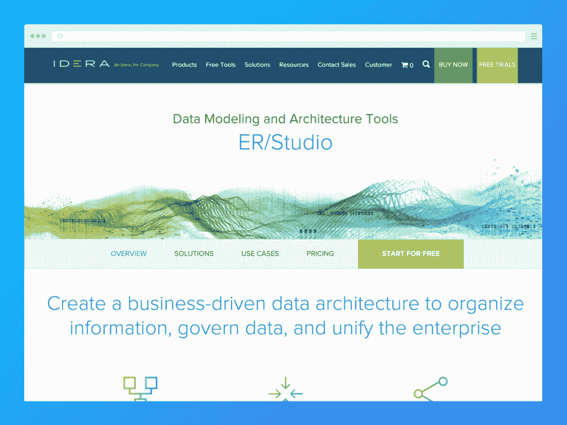
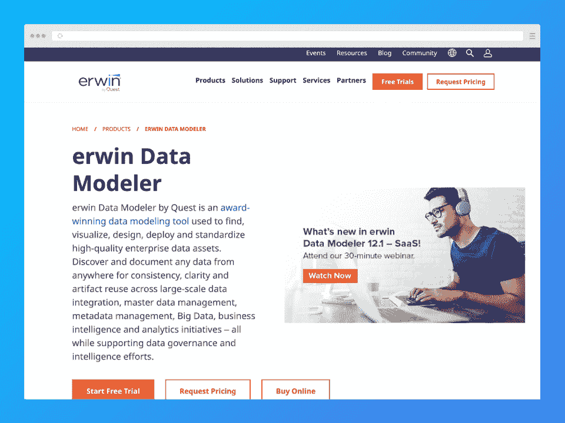
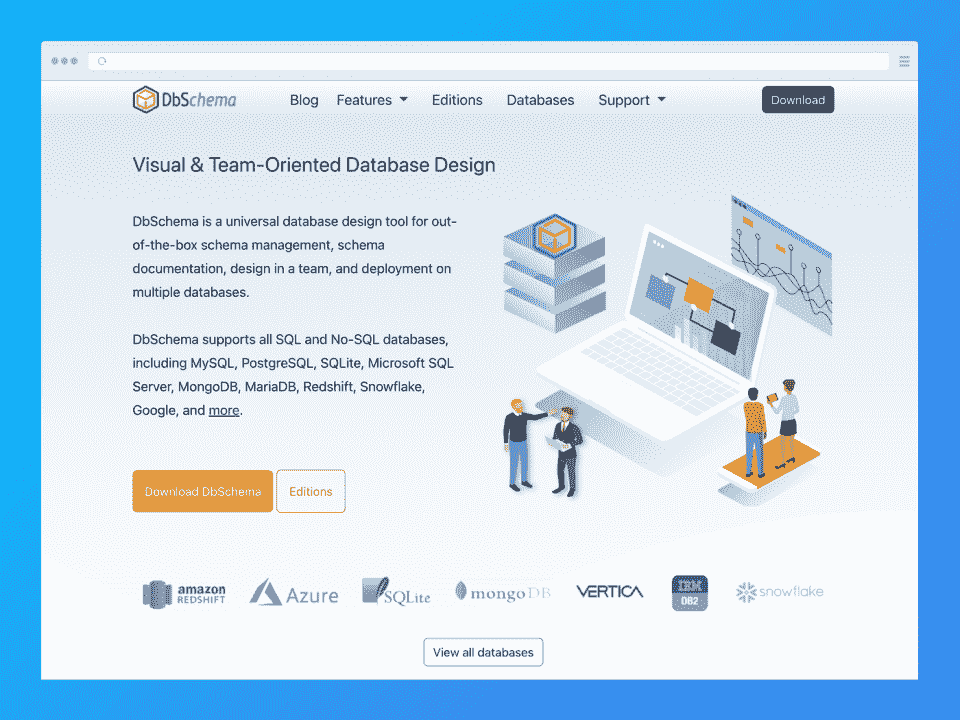
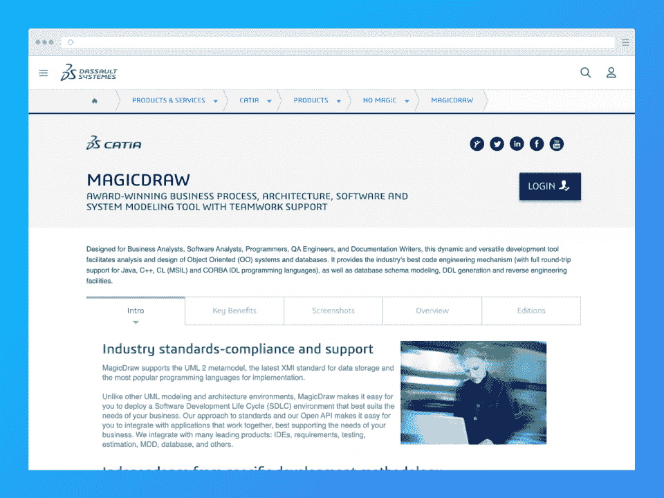
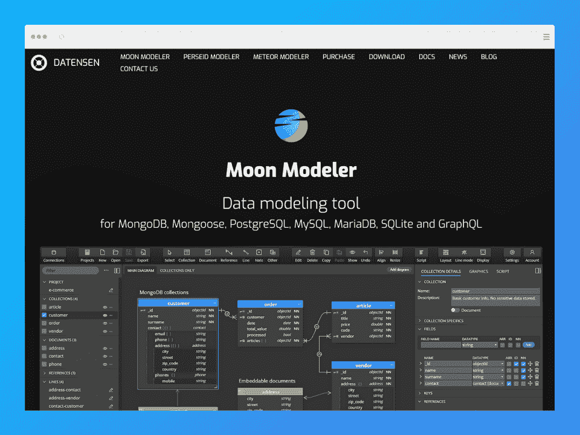
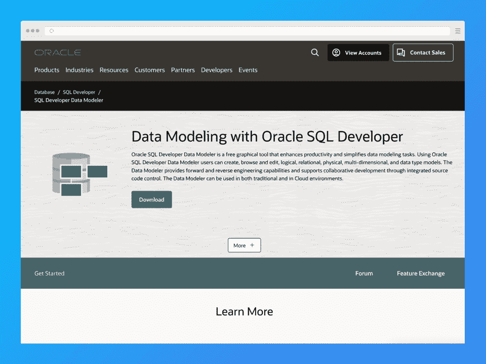
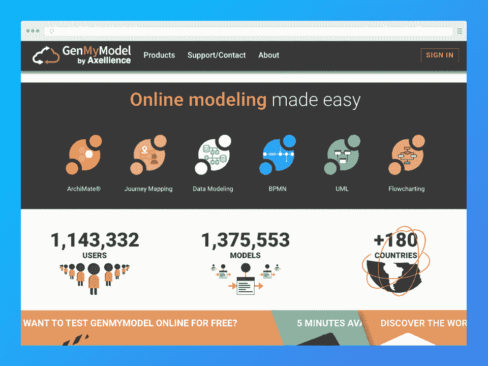
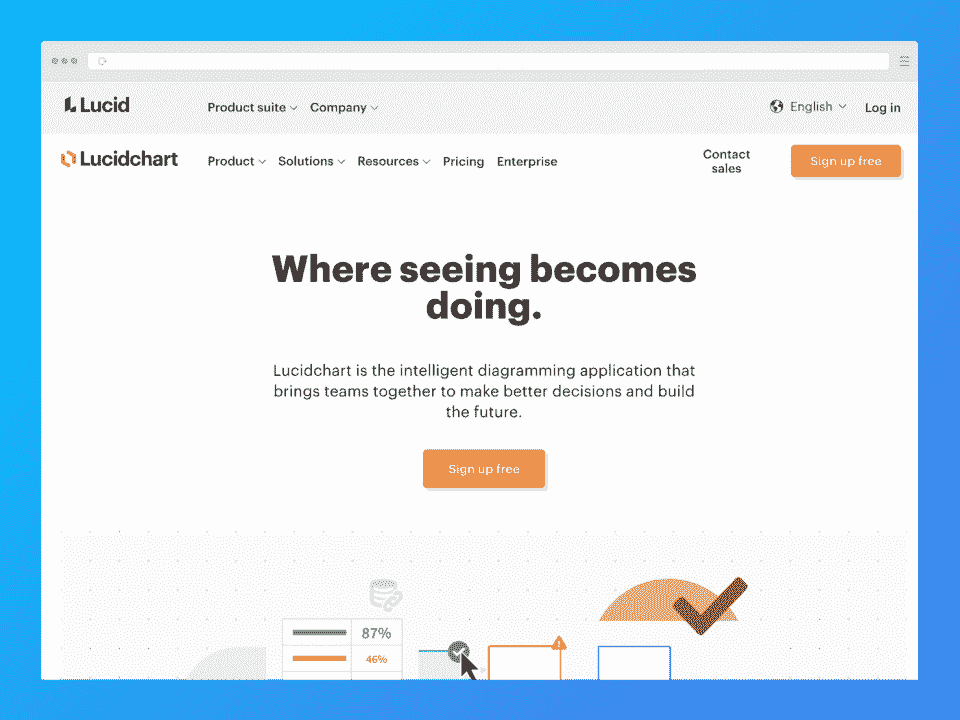

# 2023 年 8 大最佳数据建模工具[推荐]

> 原文：<https://hackr.io/blog/best-data-modeling-tools>

如果你是一名学习使用数据库的新开发人员，你需要在[数据建模](https://hackr.io/blog/what-is-data-modeling)方面有坚实的基础。一旦你正确地建立了你的数据结构，你的工作将会更加顺利。

糟糕的数据建模的后果？随着时间的推移，更多的时间花在摆弄数据结构上。在处理大型复杂项目时，这变成了一个更大的问题。

正确的数据建模可以节省大量时间，同时还能确保不会放错位置、使用不足或丢失数据。数据建模工具可以帮助您简化所有事情。但是它们到底是什么呢？请继续阅读，寻找答案！

*   ER/Studio
*   Erwin Data Modeler
*   db schema(db schema)

## **什么是数据建模？**

数据模型是数据对象和规范的可视化表示。它们通常被设计成 UML(统一建模语言)图。**数据建模**定义要收集的数据，并决定如何存储。

你甚至不需要数据建模软件——你可以用笔和纸或者像 UML 编辑器这样简单的东西来做数据建模。然而，可靠的工具可以帮助你创建 UML 图*和*并将它们直接集成到你的数据库中。

数据建模有三层:

*   **概念**，在这里你建立实体以及它们的属性和关系

*   **逻辑**，定义数据元素的结构并设置它们之间的关系

*   **物理数据**，您可以在这里描述特定于数据库的数据模型实现

一个**数据建模工具**让数据建模更加高效。这些工具本质上是帮助用户基于 UML 图创建数据库结构的软件应用程序。数据建模工具使你更容易形成完美的数据结构。它们帮助您创建图表、信息图、数据可视化、流程图等。

伟大的数据模型工具是直观的——即使对于不太懂技术的人来说也是如此。

虽然许多数据建模工具需要花钱，但你可以免费找到一个数据建模工具。许多人也有免费的永久计划，允许您使用许多功能。对于许多用户来说，一些数据建模工具的免费版本通常就足够了。

在根据您的需求决定合适的数据建模工具时，请考虑这些特性:

*   **用户界面**:你能轻松导航工具吗？否则，您将会在流程中增加更多的时间，并取消数据建模工具的最初目的。
*   **可扩展性**:您的组织或业务是否持续增长？您的数据库和数据建模工具应该跟上可伸缩性特性。
*   **可视化**:看看每个工具提供什么样的报告。
*   **活跃社区**:找到一个有良好支持的工具，这样你就可以找到任何问题的答案。
*   **定制**:变化是不断的，尤其是对于持续增长的数据。
*   协作:你和团队紧密合作吗？一些数据库建模工具更有助于独立工作，而另一些则在团队中茁壮成长。
*   **价格**:不要注册一个你长期买不起的工具。

[****](https://www.idera.com/er-studio-enterprise-architecture-solutions)

#### **主要特征**

**定价:**每用户(工作站)起价 1，470.40 美元

**基于云/桌面:**桌面

**操作系统:** Windows

**为图:**为图

**提供免费版本:✗**

**逆向工程:**

**正向工程:**

如果您正在寻找一个健壮的物理和逻辑建模工具，ER/Studio 是首选。这个数据架构工具是市场上运行时间最长的工具之一。当你身临其境时，你会感受到 ER/Studio 几十年来为改进其产品所做的工作。然而，您可能仍然会注意到，该工具很难跟上最近出现的新技术。

ER/Studio 有一点就是*不*便宜。每个用户或工作站的起价超过 1400 美元。

**[了解更多关于 ER/工作室](https://www.idera.com/er-studio-enterprise-architecture-solutions)**

[****](https://www.erwin.com/products/erwin-data-modeler/)

#### **主要特征**

**定价:**每用户销售 12 个月订阅量；标准版起价为每台 3，085 美元，工作组版起价为每台 4，880 美元

**基于云/桌面:**桌面

**操作系统:** Windows、Linux、macOS

**为图:**为图

**提供免费版本:✗**

**逆向工程:**

**正向工程:**

**同步:**

和 ER/Studio 一样，erwin Data Modeler 已经存在了相当长的时间——30 年了！这个数据建模工具在部署和标准化企业资产之前查找、可视化和设计数据。我们特别喜欢用它来做比较。此外，该工具确保与 [PostgreSQL 和 MySQL](https://hackr.io/blog/postgresql-vs-mysql) 数据库的持续集成，广告开发人员可以通过该工具的多个版本满足不同的需求。

**[了解更多关于欧文数据建模师](https://www.erwin.com/products/erwin-data-modeler/)**

[****](https://dbschema.com/)

#### **主要特征**

**定价:**学术用途每用户 98 美元，个人开发者和管理员每用户 196 美元，商业许可 294 美元；一次购买三个或三个以上的许可证，可获得 15%的折扣

**基于云/桌面:**桌面

**操作系统:** Windows、Linux、macOS

**为图:**为图

**提供免费版本:**仅限免费试用

**逆向工程:**

**前沿工程:✗**

DBSchema 支持 NoSQL、SQL 甚至云数据库。作为一个可视化的数据库工具，DBSchema 允许你更有效地设计和管理你的数据。这个工具包括一些特性，比如随机数据的内置生成器，以及对 Mercurial、CVS、SVN 和 GIT 的支持。DBSchema 的一个优点是它可以接收频繁的更新和错误修复。然而，一些客户抱怨不可靠。我们的份额？低廉的价格让它物有所值。

**[了解更多关于 DbSchema 的信息](https://dbschema.com/)**

[****](https://www.3ds.com/products-services/catia/products/no-magic/magicdraw/)

#### **主要特征**

**定价:**联系 MagicDraw

**基于云/桌面:**桌面

**操作系统:** Windows、Linux、macOS

**为图:**为图

**提供免费版本:**仅限免费试用

**逆向工程:**

**正向工程:**

MagicDraw 是为软件分析师、业务分析师、QA 工程师、程序员、文档作者等设计的数据建模工具。MagicDraw 提供 24/7 全天候支持，无论您是否已经购买该服务。此外，它具有可伸缩性和可移植性，并提供软件保障合同，允许您支付低至 23%的服务器费用或 33%的客户端许可证价格，以获得一年(或两年，取决于您的协议)的 MagicDraw 最新版本的新功能和错误修复。

**[了解更多关于 MagicDraw](https://www.3ds.com/products-services/catia/products/no-magic/magicdraw/)**

[****](https://www.datensen.com/mongodb-design-tool.html)

#### **主要特征**

**定价:**基础 EDU 版 49 美元，基础版 99 美元，专业版 124 美元；每用户永久许可证，12 个月免费更新

**基于云/桌面:**桌面

**操作系统:** Windows、Linux、macOS

**为图:**为图

**提供免费版本:**免费试用到期后会变成免费版本

**逆向工程:**

**正向工程:**

**同步:**

Moon Modeler 现在是它的第四个版本，一个有很多新特性的更新，比如数据模型的交互式 HTML 报告。除了 Moon Modeler 圆滑的用户界面和设计，这个工具实际上允许您更快地绘制数据模型。最好的部分是免费版——只需安装试用版。一旦到期，你将获得免费的数据建模工具(月球建模免费版)。

**[了解更多关于月球建模器](https://www.datensen.com/mongodb-design-tool.html)**

[****](https://www.oracle.com/database/sqldeveloper/technologies/sql-data-modeler/)

#### **主要特征**

**定价:**不适用

**基于云/桌面:**两者皆有

**操作系统:** Windows、Linux、macOS

**为图:**为图

**可用的免费版本:**

**逆向工程:**

**正向工程:**

**同步:✗**

Oracle SQL Developer Data Modeler 通过简化各种数据建模任务提高了用户的工作效率。您可以在桌面或云上创建、编辑和浏览关系、逻辑、多维、物理，当然还有数据类型模型。这个工具甚至支持协作——它几乎拥有您需要的一切。

这不是最直观或用户友好的工具，所以你需要克服学习曲线。幸运的是，Oracle 有大量的文档可以帮助你开始，比如这个关于[导航图](https://www.youtube.com/watch?v=jlcFAASXG7Y)的视频。

**[了解更多关于 Oracle SQL Developer 数据建模师](https://www.oracle.com/database/sqldeveloper/technologies/sql-data-modeler/)**

[****](https://www.genmymodel.com/)

#### **主要特征**

**定价:**联系 GenMyModel 了解定价

**基于云/桌面:**云

**操作系统:** Windows、Linux、macOS

**为图:**为图

**可用的免费版本:**

**逆向工程:✗**

**正向工程:**

GenMyModel 是另一个提供免费版本的工具。然而，他们也有付费选项，你可以免费试用。这个工具是云原生的，使用一个集中的存储库，允许您搜索、浏览和保存(协作地)模型和工件。它很容易使用，所以不用花很长时间就能学会。

GenMyModel 是一个绘图和建模工具包，帮助用户确保在各种视图和第三方工具上保持一致。它还具有很强的可扩展性，因此可以与您一起成长。

**[了解更多关于 GenMyModel](https://www.genmymodel.com/)**

[****](https://www.lucidchart.com/pages/)

#### **主要特征**

**定价:**免费层，个人层每月起价 7.95 美元，团队层每月起价 9 美元，企业层(请联系 Lucidchart 获取报价)

**基于云/桌面:**云

**操作系统:**任何具有互联网连接的浏览器

**为图:**为图

**可用的免费版本:**

Lucidchart 是全球许多公司的首选工具，包括谷歌、亚马逊、Atlassian、考克斯等科技巨头。它本质上是一个图表生成器，但使它与众不同的是它更强的数据保护和更复杂的流程。您还可以链接到 SQL，在您的数据库管理系统中使用 Lucidchart 上的画布。

Lucidchart 有一个免费的永久层，但不幸的是，它非常有限——如果你需要任何复杂的功能，你需要支付订阅计划。

如果你不确定如何开始使用这个工具，Lucidchart 提供了大量的文档，包括这个[入门指南](https://www.lucidchart.com/blog/getting-started-in-lucidchart)。您可以随时试用免费版本，直到您更好地理解该工具的功能！

**[了解更多关于 lucid chart](https://www.lucidchart.com/pages/)**

## **结论**

数据建模工具对于数据结构化非常有用，在你成为一名[数据工程师](https://hackr.io/blog/how-to-become-a-data-engineer)的职业生涯中更是如此。

我们希望这篇关于 8 个最佳数据建模工具的文章能够帮助你用完美的工具加速你的数据结构化过程。但是不要止步于此——通过参加课程或教程来进一步探索多维建模工具！

**[取数据结构化教程](https://hackr.io/tutorials/learn-data-structures-algorithms)**