# 2023 年 16 本最佳数据结构和算法书籍

> 原文：<https://hackr.io/blog/best-data-structures-and-algorithms-books>

无论你是一名学生，即将有一个面试，或者你很好奇，数据结构和算法书籍是学习计算机科学这个有用领域的一个极好的方式。

一般来说，数据结构和算法允许软件工程师以更有效的方式存储和处理数据。当大规模处理数据时，这是必不可少的，因为正确的算法或数据结构可以节省大量内存和时间(是的，我们在谈论 Big-O！).

对于大多数科技公司来说，数据结构和算法也已经成为面试阶段的一个关键部分，尤其是 FAANG。作为这些令人垂涎的角色的潜在候选人，合适的书籍可以帮助你做好准备，并在这个过程中脱颖而出。

在本文中，我们将涵盖 16 本最佳数据结构和算法书籍，你必须在 2023 年阅读，以学习这些基本的编程技能。所以，如果你准备好寻找数据结构和算法的最佳书籍，让我们开始吧！

| **特色数据结构与算法书籍【编辑推荐】** |
|  | **标题:**数据结构和算法变得简单:数据结构和算法难题**作者:** Narasimha Karumanchi**出版商:** CareerMonk 出版公司**第 426 页:**[检查价格](https://geni.us/wSD54z) |  |  |
| **标题:**算法简介 | 作者:托马斯·h·科尔曼，查尔斯·e·莱瑟森，罗纳德·L·李维斯特，克利福德·斯坦出版社:麻省理工学院出版社**第 1292 页:**[检查价格](https://geni.us/AxQWr) |  | 标题:搜索算法:程序员和其他好奇者的图解指南 |
|   | **作者:** Aditya Bhargava**发布者:**曼宁**第 256 页:**[检查价格](https://geni.us/DRCEB2g)**考虑从事数据科学工作？结账:** | **[最好的数据科学书籍](https://hackr.io/blog/data-science-books)** | **2023 年 16 本最佳数据结构与算法书籍** |

[**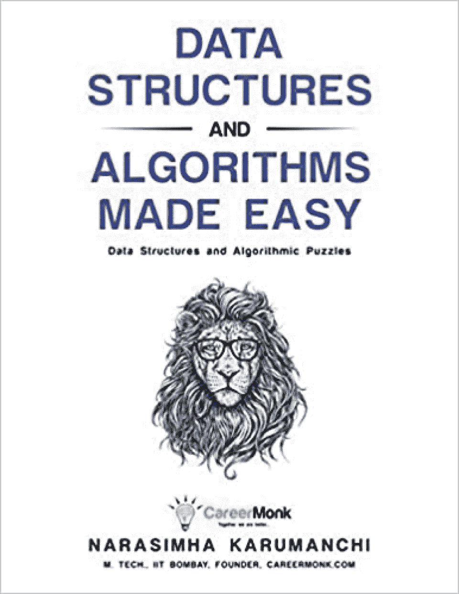**](https://geni.us/wSD54z)

[检查价格](https://geni.us/wSD54z)

## **作者:** Narasimha Karumanchi

**出版商:** CareerMonk 出版公司

**第 426 页:**

**我们为什么选择这本书**

这本算法和数据结构的书涵盖了数据结构的基础知识，它还教读者如何编写自己的算法解决方案。

涵盖的一些主题包括算法设计技术、字符串算法、散列、优先级队列、堆等等。本书的代码示例是用 C 语言编写的，这对于算法教学来说是相当标准的。

**特性**

例子是用 C 编程语言写的

要求熟悉基础数学

面试准备的好材料

*   [****](https://geni.us/AxQWr)
*   [检查价格](https://geni.us/AxQWr)
*   作者:托马斯·h·科尔曼，查尔斯·e·莱瑟森，罗纳德·L·李维斯特，克利福德·斯坦

出版社:麻省理工学院出版社

**第 1292 页:**

**我们为什么选择这本书**

超过 1200 页，这是关于算法的最全面的书籍之一，涵盖了创建算法的理论和实践。主题包括堆排序、快速排序、图形算法、NP 完全性和字符串匹配。

为了让事情容易理解，例子是用伪代码写的，这是理想的，因为算法本质上是用你选择的语言写的指令。

**特性**

计算机科学(CS)学生的理想教科书

包括许多带有解答的练习

不适合完全的初学者

*   伴随着麻省理工学院的[在线讲座](https://ocw.mit.edu/courses/6-046j-introduction-to-algorithms-sma-5503-fall-2005/)
*   [****](https://geni.us/DRCEB2g)
*   [检查价格](https://geni.us/DRCEB2g)
*   **作者:** Aditya Bhargava

**发布者:**曼宁

**第 256 页:**

**我们为什么选择这本书**

作为算法的最佳书籍之一，这本书使用日常生活场景来解释常见的算法问题。您将学习 Dijkstra 的算法、k 近邻、广度优先搜索等。

拥有 400 多张图片，是视觉学习者的绝佳选择。与大多数算法书籍相比，它非常容易阅读，而且相对较短，这意味着它无疑是初学者的最佳算法书籍。

**特性**

例子附有插图

初学者的绝佳选择

基于 Python 的代码示例

*   适合非程序员
*   [**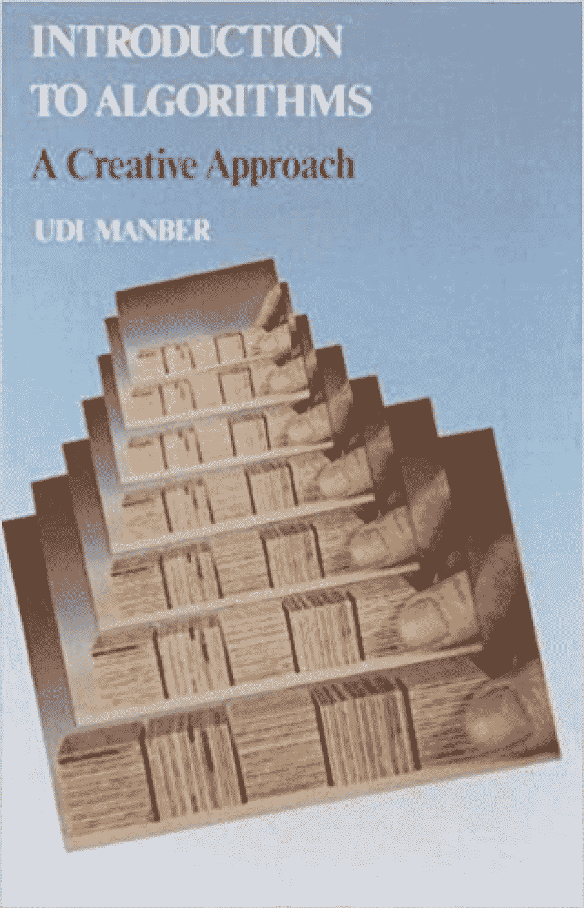**](https://geni.us/FXcdC)
*   [检查价格](https://geni.us/FXcdC)
*   **作者:**乌迪·曼伯

出版商:艾迪生-卫斯理

**第 478 页:**

**我们为什么选择这本书**

这本全面的教科书涵盖了广泛的主题，如搜索算法，排序，和图形算法，使其成为最好的算法书籍之一。

它还解释了 Big-O 符号、代数和数字算法、归约和并行算法。您还将涉及算法设计的创造性方面。

**特性**

每章后的练习

CS 学生的绝佳资源

组织良好且易于遵循

*   [**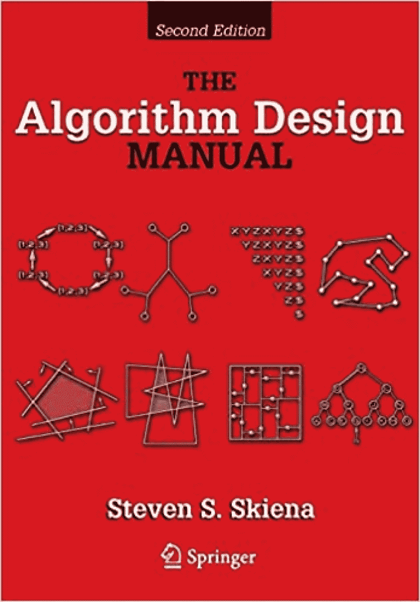**](https://geni.us/RAiOi)
*   [检查价格](https://geni.us/RAiOi)
*   **作者:**史蒂文·斯基亚纳

**出版商:**施普林格

**第 748 页:**

**我们为什么选择这本书**

这是最好的算法书籍之一。由两部分组成，第一部分教您如何设计和分析算法，而第二部分包含常见算法问题的实现。

在这本书里，你将会涉及到二分搜索法、加权图算法、传递闭包和归约、范围搜索等等。这本书还检查了现代算法，如计算几何，多线程算法和图论。

**特性**

CS 学生的绝佳参考资料

实际实施的例子

是中级和高级学习者的理想选择

*   C/C++中的代码示例
*   [**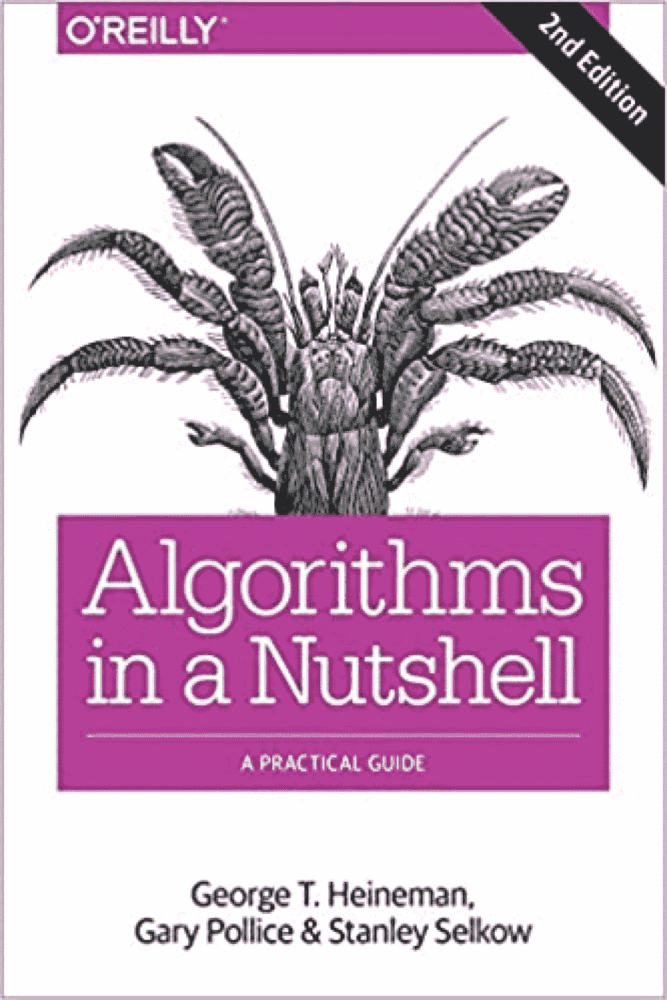**](https://geni.us/VxBny)
*   [检查价格](https://geni.us/VxBny)
*   作者:乔治·t·海涅曼，加里·波里斯，斯坦利·塞尔科

**出版商:**奥莱利媒体

**第 390 页:**

**我们为什么选择这本书**

这本书带领读者踏上了像顺序搜索，二分搜索法和散列算法的发展之旅。它还涵盖了一些高级主题，如 Jarvis March 和 RSA 算法。

独特的是，本书中的代码示例以各种编程语言提供，包括 Java、C、C++和 Python。您还可以获得每种语言的所有实现细节。

**特性**

有许多有用的图表

包括各种语言，例如伪代码

初学者和 CS 学生的理想选择

*   [**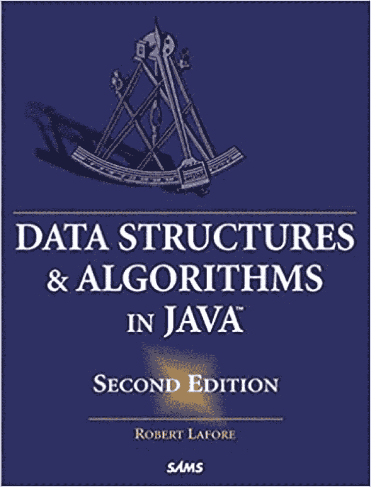**](https://geni.us/0MTF)
*   [检查价格](https://geni.us/0MTF)
*   **作者:**罗伯特·拉弗尔

**出版商:**萨姆斯出版公司

**页数:** 800

**我们为什么选择这本书**

这本书提供了清晰的解释和大量的 Java 代码示例，因此得名！如果你已经在学习用 Java 编程，并且正在寻找最好的也涵盖算法的数据结构书籍，这可能是适合你的。

您将涉及数组和字符串等基本主题，以及堆排序和合并排序等排序算法。这本书还研究了有用的数据结构，如哈希表、2-3-4 树等等。

**特性**

假设具备 Java 知识

包括许多图表

每章之后的测验和实验

*   亚马逊畅销书《数据结构与算法》
*   [**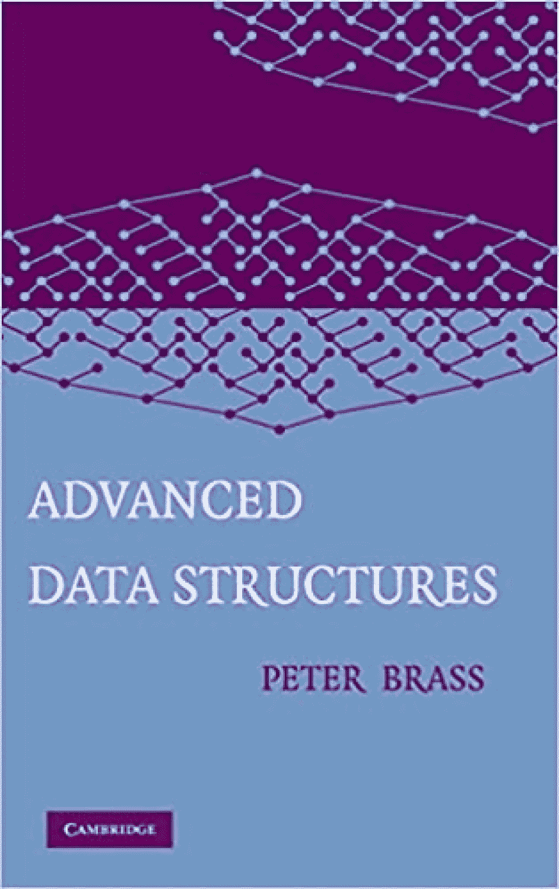**](https://geni.us/OUMl)
*   [检查价格](https://geni.us/OUMl)
*   **作者:**彼得·布拉斯

**出版社:**哥伦比亚大学出版社

**第 474 页:**

**我们为什么选择这本书**

这本书深入解释了高级数据结构，包括搜索树、堆、哈希表、联合查找结构和动态化。

作者假定熟悉基本的数据结构概念，所以如果读者已经对数据结构有了基本的了解，他们会发现这本书更有帮助。如果你觉得这符合你的技能水平，这可能是关于数据结构的最好的书。

**特性**

C 中的代码示例

500 多篇参考文献

适合高级学习者

*   [**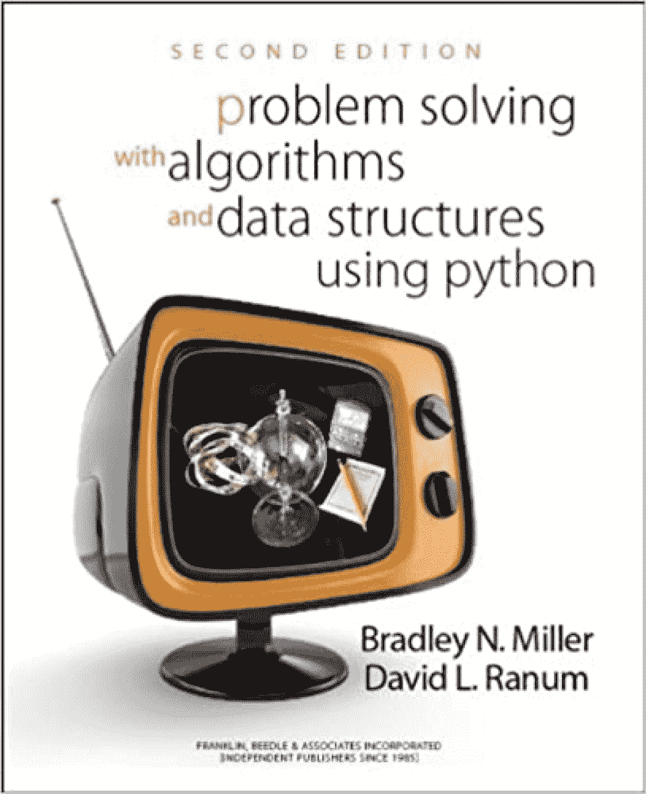**](https://geni.us/Ymf3YUj)
*   [检查价格](https://geni.us/Ymf3YUj)
*   **作者:**布拉德利·n·米勒，大卫·拉纳姆

**出版商:**富兰克林·比德尔&联合公司

**第 438 页:**

**我们为什么选择这本书**

这本 [Python 的书](https://hackr.io/blog/best-python-books-for-beginners-and-advanced-programmers)可能是 Python 用户最好的关于算法和数据结构的书。这也是学习计算机科学这些重要组成部分的一个很好的方式，因为它使用了初学者友好的解释和练习。

这本书最好的部分之一是作者花时间清楚地解释了一些最重要的算法，如二分搜索法，合并排序等。

您还将了解基本的数据结构，如堆栈和队列、链表和树，包括各种相关方法的时间和空间复杂性。

**特性**

初学者的绝佳选择

python 中的算法实现

包括测试你知识的练习

*   [**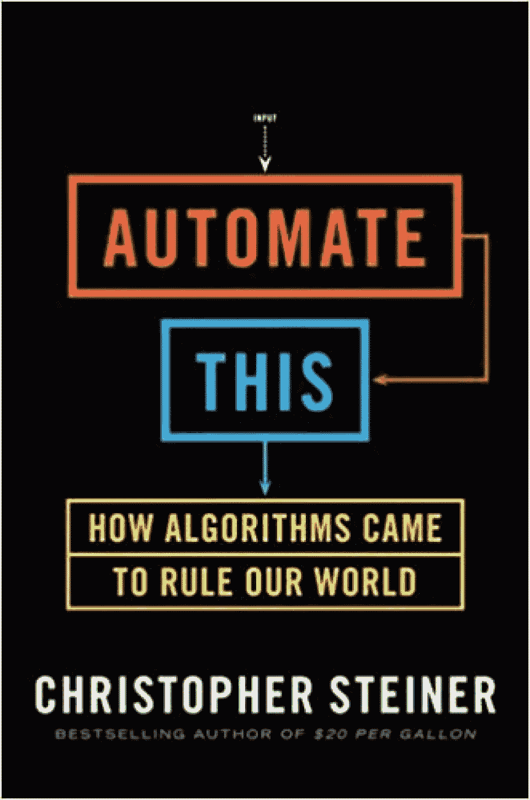**](https://geni.us/yqJV)
*   [检查价格](https://geni.us/yqJV)
*   **作者:**克里斯托弗·斯坦纳

**出版商:**作品集

**第 256 页:**

**我们为什么选择这本书**

这本独特的书比我们列表中的其他书技术性更低，因为它旨在揭开算法的神秘面纱。它还提供了算法如何成为现代社会的一部分的历史概述。

如果你对技术和算法如何在我们与技术的互动中发挥关键作用的历史感兴趣，这是一个可靠的选择。

**特性**

初学者的理想选择

适合非程序员

对算法未来的评论

*   [**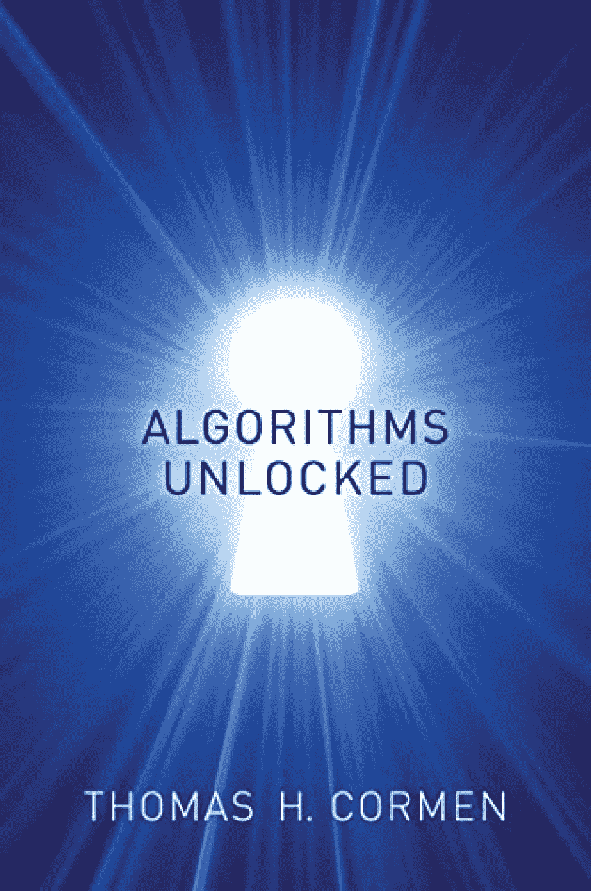**](https://geni.us/LrmSw)
*   [检查价格](https://geni.us/LrmSw)
*   **作者:**托马斯·h·科尔曼

出版社:麻省理工学院出版社

**第 240 页:**

**我们为什么选择这本书**

这是一本学习算法基础的好书，包括它们如何在现代世界中工作。

作为一本相对较短的读物，这本书在理论和技术细节之间取得了平衡。它还涵盖了密码学、数据压缩和最短路径算法的基础，如 Dijkstra 算法和 Bellman-Ford 算法。

**特性**

非常适合初学者和非程序员

关于数据压缩的课程

关于加密的章节

*   [**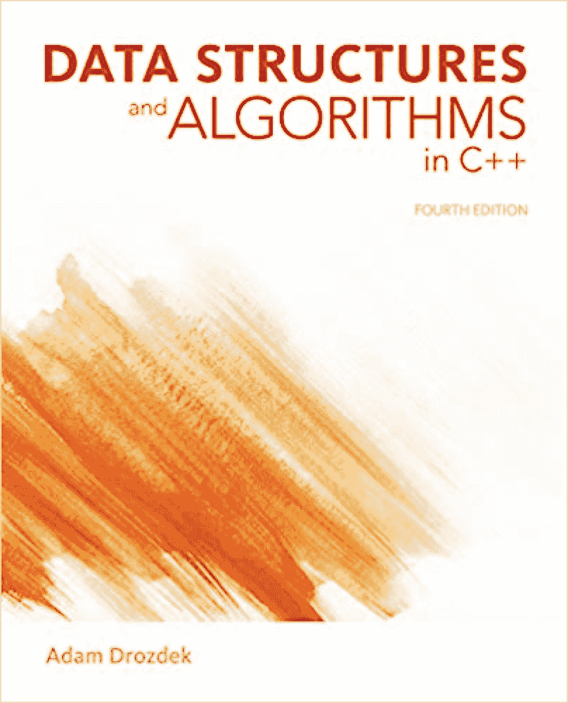**](https://geni.us/5xOkE)
*   [检查价格](https://geni.us/5xOkE)
*   **作者:**亚当·德罗兹德克

**发布者:**森格学习

**第 784 页:**

**我们为什么选择这本书**

对于希望提高对这些基本编程技能的理解的初级和中级 C++程序员来说，这可能是关于数据结构和算法的最佳书籍。

期望学习字符串匹配算法，如 Boyer-Moore 和 Knuth-Morris-Pratt 算法，以及流行的排序算法，如 shell 排序、radix 排序等等。您还将了解重要的数据结构，如树、链表、堆栈和队列。

**特性**

大量 C++代码示例

各种案例研究

理论和实践测验问题

*   [**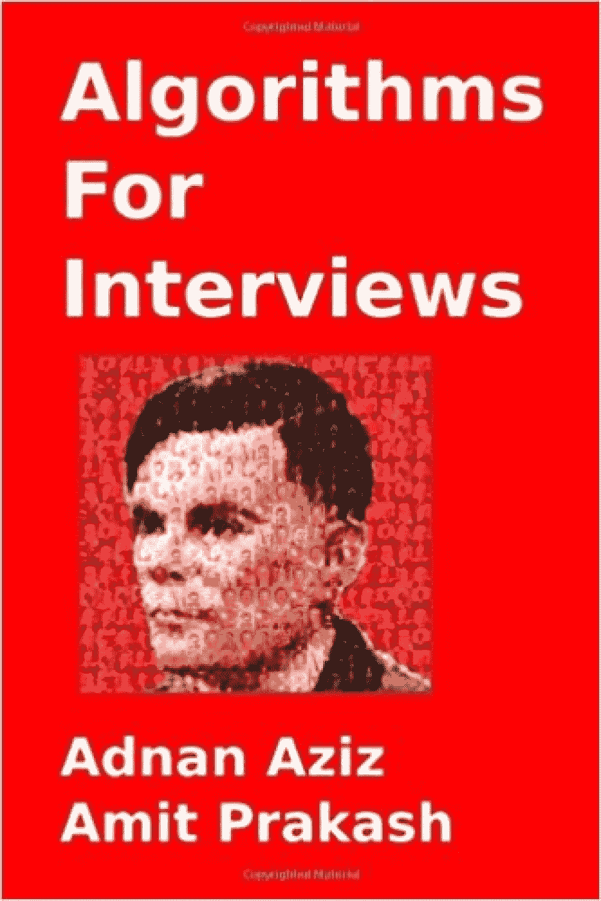**](https://geni.us/NPPMb7e)
*   [检查价格](https://geni.us/NPPMb7e)
*   **作者:**阿德南·阿齐兹，阿米特·普拉卡什

**发布者:**打造空间独立发布平台

**第 222 页:**

**我们为什么选择这本书**

这本书是特别制作的，通过帮助你复习他们的算法知识来帮助软件工程师准备面试。

它涵盖了重要的主题，如二分搜索法，图搜索，等等，以及排序算法，如最小距离排序。您还将涉及高级主题，如元算法、棘手问题和并行计算。

**特性**

174 算法设计问题及解决方案

面试技巧和提示

系统设计部分

*   [**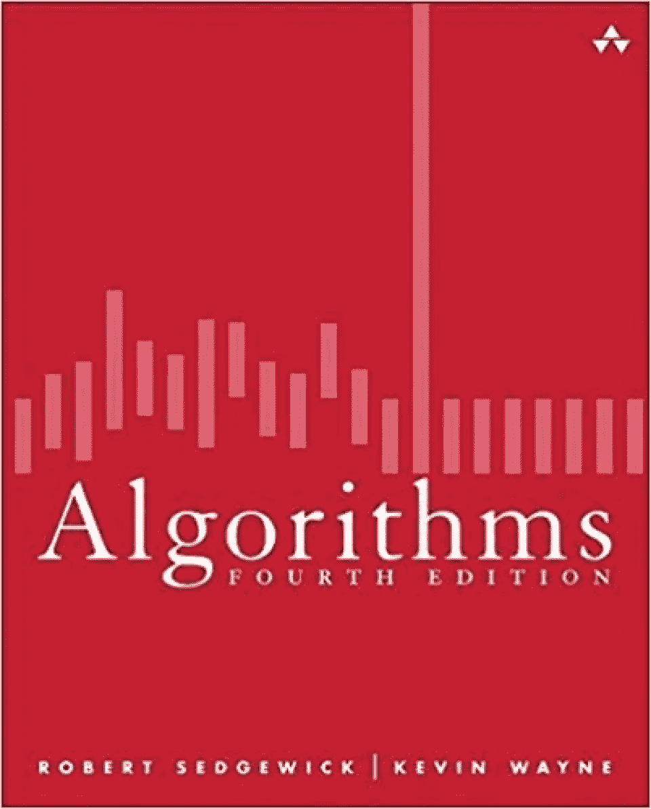**](https://geni.us/8y9E4)
*   [检查价格](https://geni.us/8y9E4)
*   **作者:**罗伯特·塞奇威克，凯文·韦恩

出版商:艾迪生-卫斯理专业公司

**第 976 页:**

**我们为什么选择这本书**

如果你正在寻找最好的算法书籍，这是最受计算机科学学生欢迎的书籍之一。

像任何好的算法书一样，它涵盖了合并排序、快速排序和其他排序算法，以及图形处理和搜索算法。还有关于简化、后缀数组、难处理性和数据压缩的章节

**特性**

有一个配套网站

Java 中的代码示例

包括许多练习(带答案)

*   [**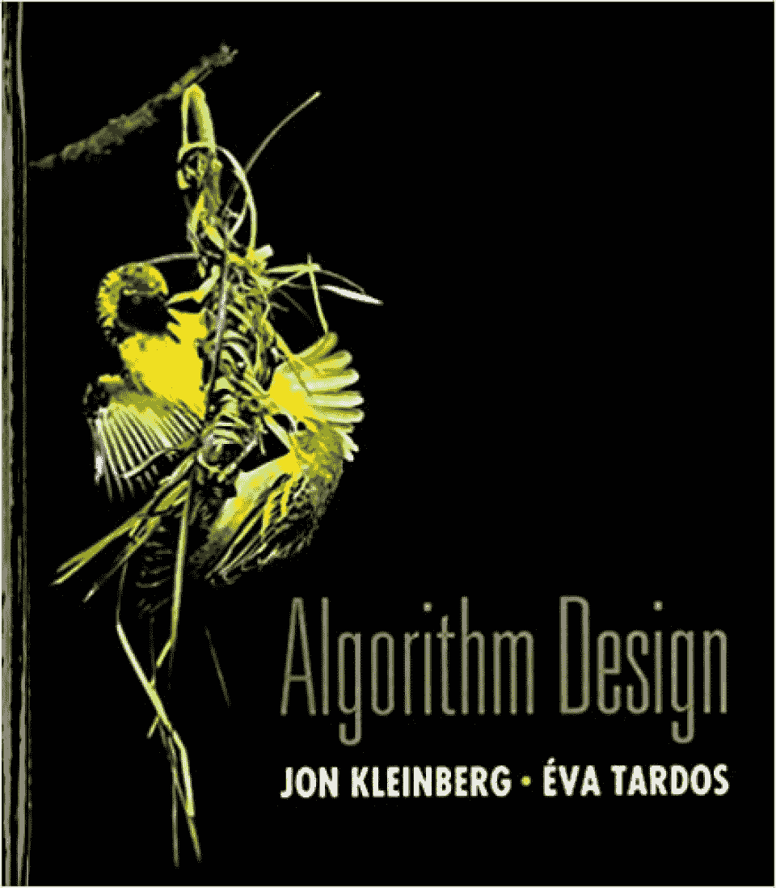**](https://geni.us/eLCI)
*   [检查价格](https://geni.us/eLCI)
*   **作者:**乔恩·克莱因伯格，埃娃·塔尔多斯

出版商:培生

**第 864 页:**

**我们为什么选择这本书**

这通常被推荐作为大学生的教科书，因为它为算法设计和分析的原理和权衡提供了坚实的基础。

期望学习算法分析的基础知识和高级主题，如贪婪算法、动态规划、图算法、随机化算法等。

**特性**

说明关键概念的案例研究

测试你知识的练习

NP-完全理论部分

*   [**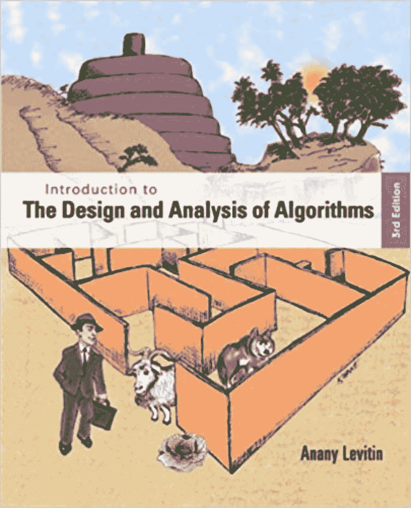**](https://geni.us/4bbFTGA)
*   [检查价格](https://geni.us/4bbFTGA)
*   **作者:** Anany Levitin

出版商:培生

**页数:** 600

**我们为什么选择这本书**

这本教科书采用解谜的方法来教授算法，这是一种从概念上理解算法如何工作的奇妙方式。

它也相对全面，因为它涵盖了算法效率、算法能力的限制以及空间和时间复杂性之间的权衡等主题。您还将深入了解解决算法问题的归约-征服、分而治之和转换-征服技术。

**特性**

算法教学中的解谜法

清晰的解释和例子

附有详细解答的练习

*   **结论**
*   数据结构和算法是计算机科学的基石，作为一名程序员，对这些概念有一个坚实的理解是很重要的。了解哪种数据结构或算法最适合常见问题，可以帮助您用更有效的解决方案创建更好的代码。
*   本文涵盖了 2023 年你需要阅读的 16 本最佳数据结构和算法书籍，以了解这一基本学科。我们也很小心地为初学者、高级学习者甚至非程序员准备了书籍，所以在我们的列表中肯定有你想要的。

## **想提高你的编程技能吗？退房:**

**[最好的编程书籍](https://hackr.io/blog/best-programming-books)**

**常见问题解答**

**1。我为什么要学习数据结构和算法？**

如果你想从事与编程有关的职业，学习数据结构和算法是必不可少的，因为它将帮助你编写高效和优化的代码。这个领域也已经成为大多数科技公司技术面试的一个关键组成部分，所以这是为这些场景做准备的一个很好的方式。

## **2。我如何学习数据结构和算法？**

### 最好的方法是从一本初学者的书开始，这将帮助你快速掌握基础知识。我们在本文中列出的大部分书籍都是初学者友好的，所以这些都将是一个很好的开始。

Learning data structures and algorithms is essential if you want to pursue a career involving programming, as it will help you write code that is efficient and optimized. This area has also become a key component of technical interviews for most tech companies, so it’s a great way to be prepared for these scenarios.

### **2\. How Do I Study Data Structure and Algorithms?**

The best way is to start with a book for beginners, which will help you get up to speed with the basics. Most of the books we’ve listed in this article are beginner-friendly, so any of these will be a great start.