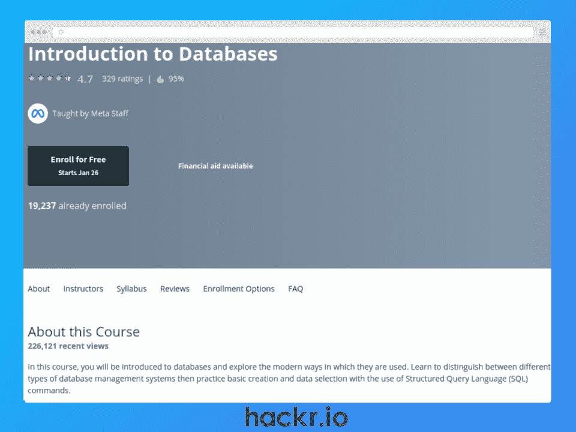
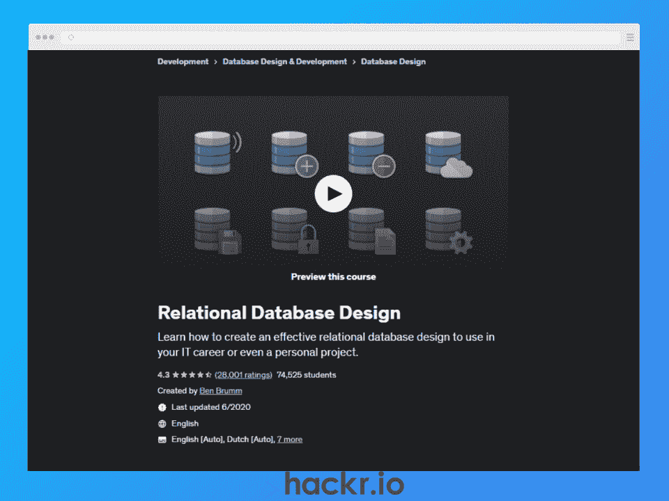
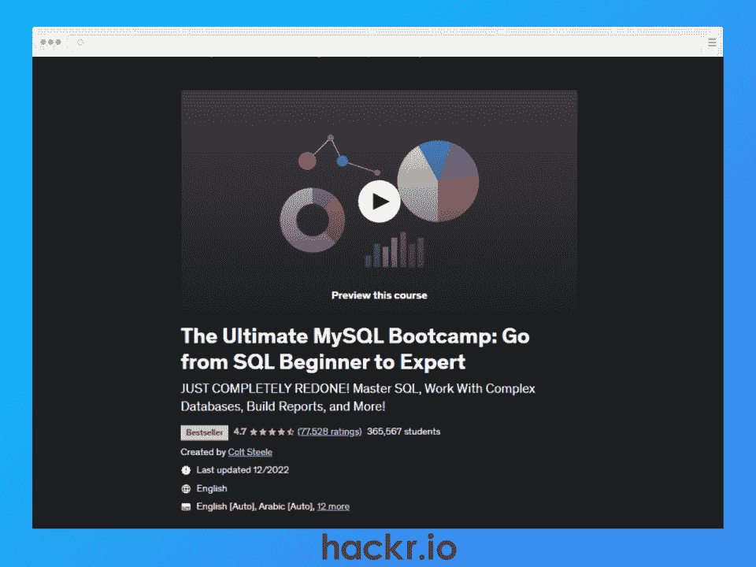
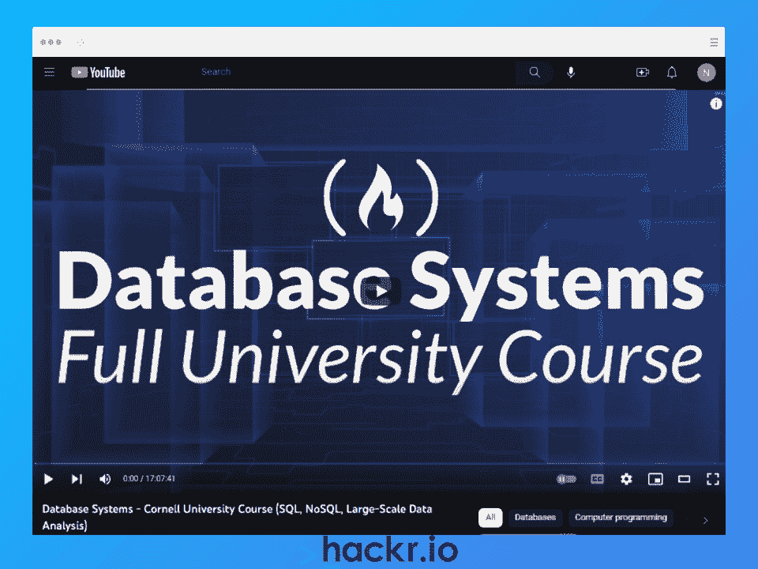
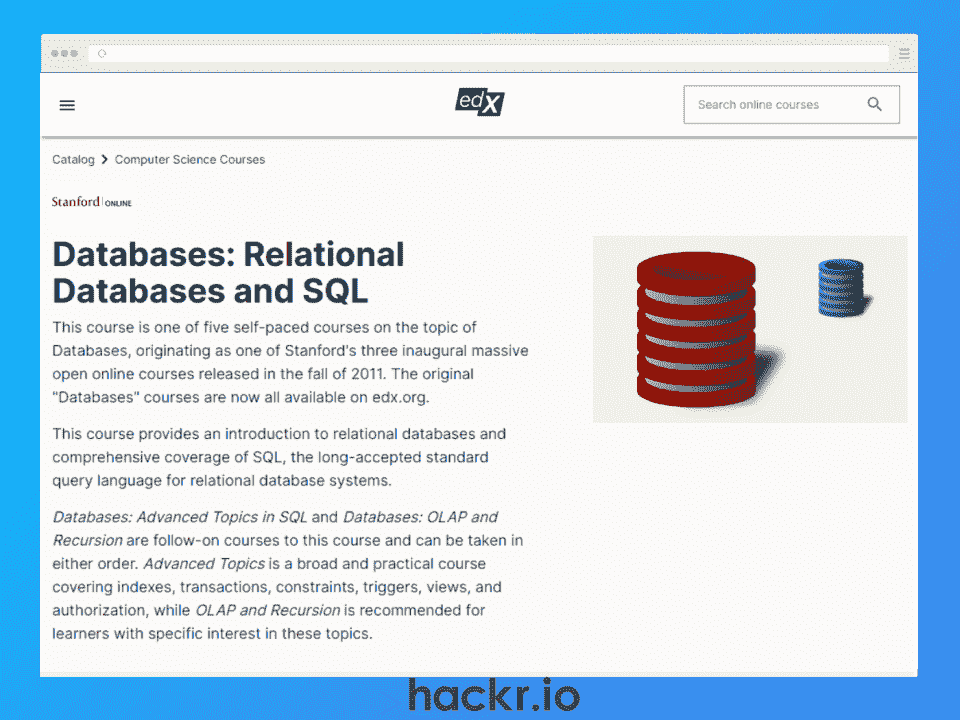
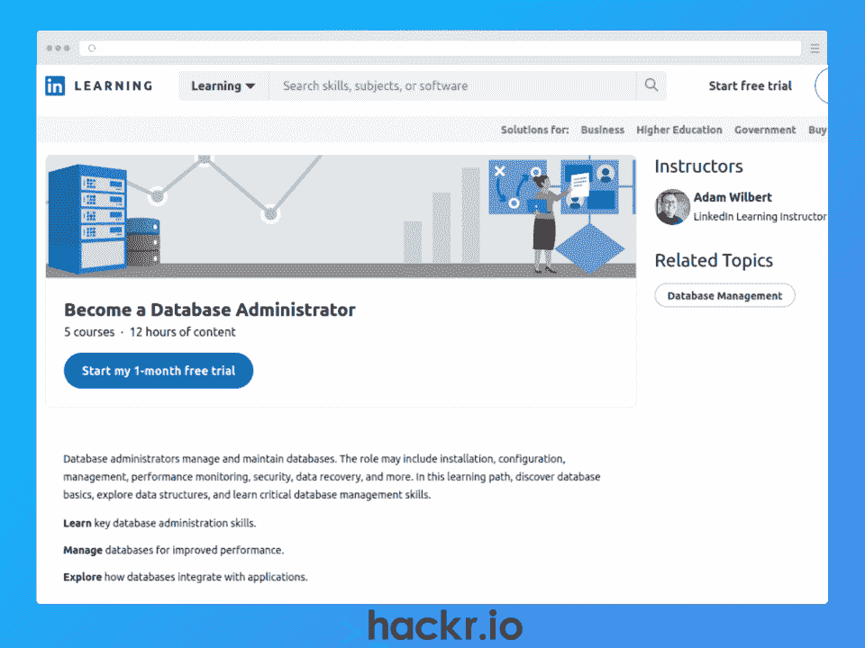
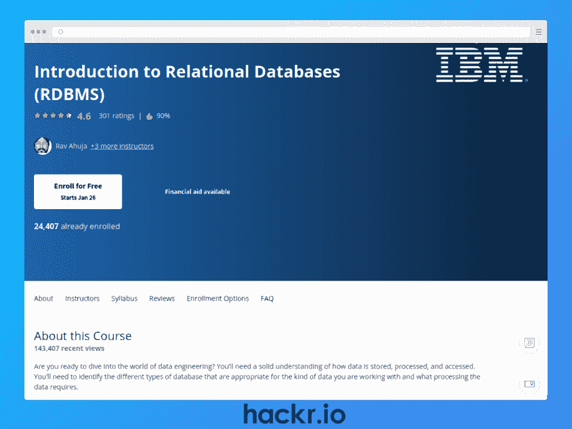
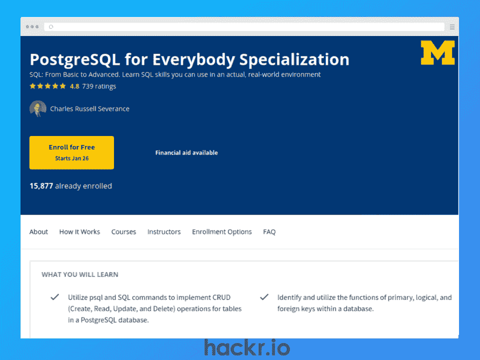
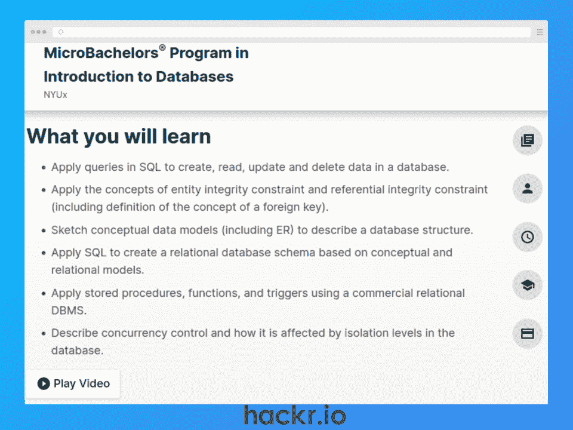
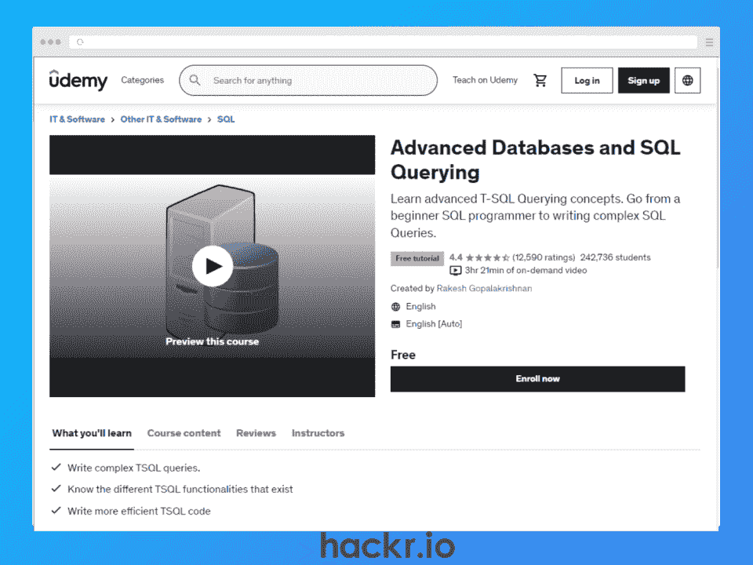

# 2023 年 10 大最佳数据库在线课程【免费+付费】

> 原文：<https://hackr.io/blog/best-database-courses>

现在，数据比以往任何时候都更加成为几乎所有行业中各种规模的组织最有价值的资源之一。当需要选择处理数据的最佳方式时，简单的数据库仍然是存储、访问和操作数据的最可靠和值得信赖的方法之一。

考虑到这一点，对数据驱动型角色的需求继续飙升也就不足为奇了。因此，无论您是对数据库管理、数据工程、数据科学、全栈开发感兴趣，还是对许多其他与数据相关的角色感兴趣，现在都是将数据库技能添加到简历中的最佳时机。

为了帮助你学习这些有价值的技能，我们在网上找到了 2023 年 10 大最佳数据库课程。对于完全的初学者和更有经验的开发人员或工程师，有免费和付费的选项，在我们的列表中肯定有你想要的。

**特色数据库课程【编辑推荐】**

## **挑选最佳数据库在线课程**

为了选择最好的数据库课程，我们考虑了几个因素。

*   **课程材料:**这个结构好，是最新的吗？
*   **指导老师:**他们有专业或教学经验吗？
*   **支持:**能接入导师吗？他们的社区支持吗？
*   **认证:**简历有结业证书吗？

## **十大最佳数据库课程**

**想增加 SQL 技能吗？查看** [**最好的 SQL 课程**](https://hackr.io/blog/best-sql-courses)

[****](https://imp.i384100.net/c/2890636/1347618/14726?u=https%3A%2F%2Fwww.coursera.org%2Flearn%2Fintroduction-to-databases&partnerpropertyid=2722169)

**[了解更多](https://imp.i384100.net/c/2890636/1347618/14726?u=https%3A%2F%2Fwww.coursera.org%2Flearn%2Fintroduction-to-databases&partnerpropertyid=2722169)**

**我们为什么选择本课程**

如果您是数据库新手，这个在线数据库课程是理想的选择，因为它提供了数据建模、SQL 和数据库设计的介绍。

在 Meta(以前的 FaceBook)的业界公认的指导下，您将学习如何使用 SQL 操作数据库，了解 SQL 的替代方案，甚至设计 RDBMS。甚至还有一个关于 MySQL 的部分。

**优点**

*   涵盖基本和高级概念，如可扩展性和性能
*   在虚拟环境中亲身体验真实世界的数据集
*   与其他学生的互动

**缺点**

*   没有导师的直接支持

**关键信息**

**先决条件:**无

**教官:**元参谋

**等级:**初学者

**免费或付费:**付费

**时长:** 27 小时(视频内容)

**证书:**是

**[了解更多](https://click.linksynergy.com/deeplink?id=jU79Zysihs4&mid=39197&murl=https%3A%2F%2Fwww.udemy.com%2Fcourse%2Frelational-database-design%2F)**

**我们为什么选择本课程**

这个短期课程是关系数据库管理系统和数据库设计的理想入门。

在不到两个小时的时间里，您将学习实体关系图(ERD)、规范化、表关系，以及如何从头开始设计复杂的数据库。

**优点**

*   快速从头开始学习数据库设计的短期课程
*   涵盖 ERD、正常化和关系

**缺点**

*   简短的课程，所以你可能需要补充学习

**关键信息**

**先决条件:**无

教练:本·布鲁姆

**等级:**初学者

**免费或付费:**付费

**证书:**是

**时长:** 1.5 小时(视频内容)

**[了解更多](https://click.linksynergy.com/deeplink?id=jU79Zysihs4&mid=39197&murl=https%3A%2F%2Fwww.udemy.com%2Fcourse%2Fthe-ultimate-mysql-bootcamp-go-from-sql-beginner-to-expert%2F)**

**我们为什么选择本课程**

作为初学者最好的数据库课程之一，您可以学习 SQL 以及如何使用非常流行的 MySQL RDBMS。

在深入研究数据类型、CRUD 操作、函数、数据库关系等等之前，先了解一下 SQL、MySQL 和 PostgreSQL 之间的区别。

**优点**

*   学习 SQL 的综合材料，包括最佳实践
*   涵盖连接、窗口函数、视图等基本主题
*   包括练习和挑战

**缺点**

*   有些话题对初学者来说可能很有挑战性

**关键信息**

**先决条件:**无

**指导老师:**柯尔特·斯蒂尔

**等级:**初学者

**免费或付费:**付费

**证书:**是

**时长:** 36.5 小时(视频内容)

**想让您的 SQL 技能更上一层楼吗？查看** [**最好的 SQL 书籍**](https://hackr.io/blog/best-sql-books)

**[了解更多](https://www.youtube.com/watch?v=4cWkVbC2bNE)**

**我们为什么选择本课程**

如果你正在寻找免费的数据库课程，教你如何从头开始查询数据库，这个数据库培训是一个很好的选择。

您将从学习 SQL 基础知识开始，允许您在数据库中存储和索引数据。然后，您将讨论关系数据处理、事务、数据库设计，以及 NoSQL 的非关系数据库的美丽新世界。

**优点**

*   世界著名的康奈尔大学的完全免费课程
*   涵盖 SQL 基础知识
*   NoSQL 和非关系数据库部分

**缺点**

*   像大学课堂一样用幻灯片授课，所以没有互动或动手练习

**关键信息**

**先决条件:**无

教练:伊曼纽尔·特鲁默

**等级:**初学者

**免费或付费:**免费

**证书:**是

**时长:** 17 小时(视频内容)

**[了解更多](https://edx.sjv.io/c/2890636/1598007/17728?u=https%3A%2F%2Fwww.edx.org%2Fcourse%2Fdatabases-5-sql)**

**我们为什么选择本课程**

斯坦福大学的这门入门课程是学习关系数据库和 SQL 的好方法。您不仅将学习关系数据库和关系数据库管理系统(RDBMS)中的关系模型，还将从 SQL 的一系列课程中受益。

**优点**

*   学习关系数据库的基础
*   SQL 综合课程
*   包括测验和评估
*   由斯坦福大学教授

**缺点**

*   详细但介绍性的内容，所以你可能需要补充学习

**关键信息**

先决条件:计算机科学基础知识

讲师:詹妮弗·维多姆

**等级:**初学者

**免费或付费:**付费

**证书:**是

**持续时间:** 20 小时

**想在 2023 年提升你的简历吗？查看** [**最佳 SQL 认证**](https://hackr.io/blog/sql-certifications)

**[了解更多](http://linkedin-learning.pxf.io/yRaY9b)**

**我们为什么选择本课程**

如果您对学习数据库管理感兴趣，您需要了解 SQL、数据库配置、管理、性能、安全性等等。

该学习路径包括 5 门在线数据库课程，通过子课程向您传授 SQL、数据结构、数据库设计以及关键数据库管理的大部分技能。它还包括一个顶点课程，重点是 RDBMS 与现代 web 应用程序的集成。

**优点**

*   超过 5 个子课程的综合材料
*   学习 SQL 和数据库基础知识，如索引和键
*   涵盖性能、安全性和可用性

**缺点**

*   大量内容需要消化，因此需要适当的时间投入

**关键信息**

**先决条件:**无

教练:亚当·威尔伯特

**等级:**初学者

**免费或付费:**付费

**证书:**是

**持续时间:**12 小时 28 分

**[了解更多](https://imp.i384100.net/c/2890636/1347618/14726?u=https%3A%2F%2Fwww.coursera.org%2Flearn%2Fintroduction-to-relational-databases&partnerpropertyid=2722169)**

**我们为什么选择本课程**

如果您对学习数据库以从事数据工程感兴趣，这是一个很好的选择。您将学习如何存储、处理、操作和访问数据，还将学习为正确的项目选择正确类型的数据库。

通过使用实际数据集的实践方法，您将了解关系数据模型，并获得 MySQL、PostgreSQL 和 IBM DB2 等流行系统的基本 RDBMS 概念。这最终会形成一个项目，你可以用它在网上和你的简历上展示你的技能和数据库证书。

**优点**

*   了解 MySQL、PostgreSQL 和 IBM DB2
*   使用图形用户界面和 SQL 处理数据库
*   添加到您的投资组合中的顶点项目

**缺点**

*   交互式实验室软件出现了一些问题

**关键信息**

**先决条件:**无

导师:拉夫·阿胡佳、桑迪普·萨哈·乔伊、林·乔伊纳和罗斯·马尔科姆

**等级:**初级到中级

**免费或付费:**付费

**证书:**是

**持续时间:**大约。19 个小时

**[了解更多](https://imp.i384100.net/c/2890636/1347618/14726?u=https%3A%2F%2Fwww.coursera.org%2Fspecializations%2Fpostgresql-for-everybody%23instructors&partnerpropertyid=2722169)**

**我们为什么选择本课程**

如果你对数据挖掘或应用程序开发感兴趣，Coursera 的这款产品非常适合你。由四个子课程组成，你将专注于数据库设计的 PostgreSQL，数据库架构，以及数据库设计的 SQL 和 NoSQL 范例之间的差异。

期望学习如何创建表、设计数据模型、编写高级 SQL 查询、使用正则表达式等等。你也可以获得分级作业来巩固你的理解。

**优点**

*   综合课程材料
*   分级作业的实践方法
*   学习 SQL、数据库设计和 NoSQL 弹性搜索
*   经验丰富的讲师是大学教授

**缺点**

*   大量内容，因此需要大量时间投入

**关键信息**

**先决条件:**Python 基础知识

**教官:**查尔斯·拉塞尔遣散

**等级:**中级

**免费或付费:**付费

**证书:**是

**时长:** 64 小时(视频内容)

**[了解更多](https://edx.sjv.io/c/2890636/1598007/17728?u=https%3A%2F%2Fwww.edx.org%2Fmicrobachelors%2Fnyux-introduction-to-databases)**

**我们为什么选择本课程**

该计划是了解关系数据库的全面方式，无论它们是在内部、在云中还是链接到嵌入式应用程序。以 MySQL 和 MariaDB 为重点，您将接触到 SQL、CRUD、主键和外键、实体关系图(ERD)、存储过程、数据库设计等等。

额外的收获是，大部分课程内容与 MySQL 数据库开发人员考试重叠，如果你想在以后把它添加到你的简历中，这可以给你一个良好的开端。

**优点**

*   使用 MySQL 和 MariaDB 进行 SQL 实践学习
*   涵盖了 CRUD、ERD、存储过程等等
*   大学学分&与甲骨文的 MySQL 考试重叠

**缺点**

*   球场即将退役

**关键信息**

先决条件:计算机科学基础知识

**指导老师:**阿斯彭·奥姆斯特德

**等级:**中级

**免费或付费:**付费

**证书:**是

**持续时间:** 128 小时(4 个月每周 8 小时)

**[了解更多](https://click.linksynergy.com/deeplink?id=jU79Zysihs4&mid=39197&murl=https%3A%2F%2Fwww.udemy.com%2Fcourse%2Fadvanced-tsql-querying-using-sql-2014%2F)**

**我们为什么选择本课程**

如果您已经熟悉 SQL server 或 T-SQL，那么 Udemy 的这个免费课程可能非常适合您。

作为一门高级数据库课程，您将学习到一些高级概念，如动态查询、触发器、存储过程、用户定义函数(UDF)、视图等。您还可以访问 T-SQL 脚本和作业来帮助巩固您的学习。

**优点**

*   完全免费的课程
*   涵盖一系列高级 T-SQL 主题
*   练习你所学的作业

**缺点**

*   你的简历没有证书

**关键信息**

**指导老师:** [拉克什·戈帕拉克里希南](https://click.linksynergy.com/deeplink?id=jU79Zysihs4&mid=39197&murl=https%3A%2F%2Fwww.udemy.com%2Fuser%2F54a6020bb2e0e%2F)

**等级:**高级

**必备:** SQL Server & T-SQL 知识

**免费或付费:**免费

**证书:**否

**时长:** 3 小时 20m(视频内容)

## **结论**

无论您在现代技术世界中扮演什么角色，您都很可能发现自己处于需要与数据库进行交互的情况。作为存储、访问和操作有价值数据的最流行的方式之一，将数据库技能添加到您的工具包中可能是提升您当前角色或帮助您获得新角色的最佳方式之一。

为了帮助你踏上学习之旅，本文列出了 2023 年 10 门最佳数据库在线课程。通过各种提供商提供的在线数据库课程，我们能够为初学者和更有经验的开发人员提供选择。

**想在简历中加入更多数据技能？查看我们关于** [**如何学习 SQL**](https://hackr.io/blog/how-to-learn-sql) 的文章

## **常见问题解答**

#### **1。哪个数据库课程最好？**

没有单一的最佳在线数据库课程，因为它取决于您当前的技能和数据库知识、职业目标、投入学习的时间等等。

然而，如果你是初学者，你应该看看 Coursera 的[数据库介绍](https://imp.i384100.net/c/2890636/1347618/14726?u=https%3A%2F%2Fwww.coursera.org%2Flearn%2Fintroduction-to-databases&partnerpropertyid=2722169)或者 Udemy 的[终极 MySQL Bootcamp](https://click.linksynergy.com/deeplink?id=jU79Zysihs4&mid=39197&murl=https%3A%2F%2Fwww.udemy.com%2Fcourse%2Fthe-ultimate-mysql-bootcamp-go-from-sql-beginner-to-expert%2F) 。如果你是一个更有经验的数据库用户，也许可以看看 Coursera 上的 [PostgreSQL for Everybody](https://imp.i384100.net/c/2890636/1347618/14726?u=https%3A%2F%2Fwww.coursera.org%2Fspecializations%2Fpostgresql-for-everybody%23instructors&partnerpropertyid=2722169) 。

#### **2。什么是数据库课程？**

数据库课程是教学单元，为学生提供 SQL 和关系数据库设计基础的实践介绍。

根据课程重点的不同，这些课程可能采用普通的 SQL 方法，也可能侧重于特定的 RDBMS，如 MySQL 或 PostgreSQL。通常这些课程还会包括一个证书，你可以把它添加到你的简历中来展示你所获得的技能。