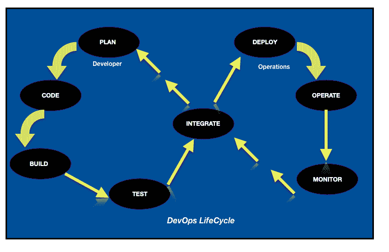
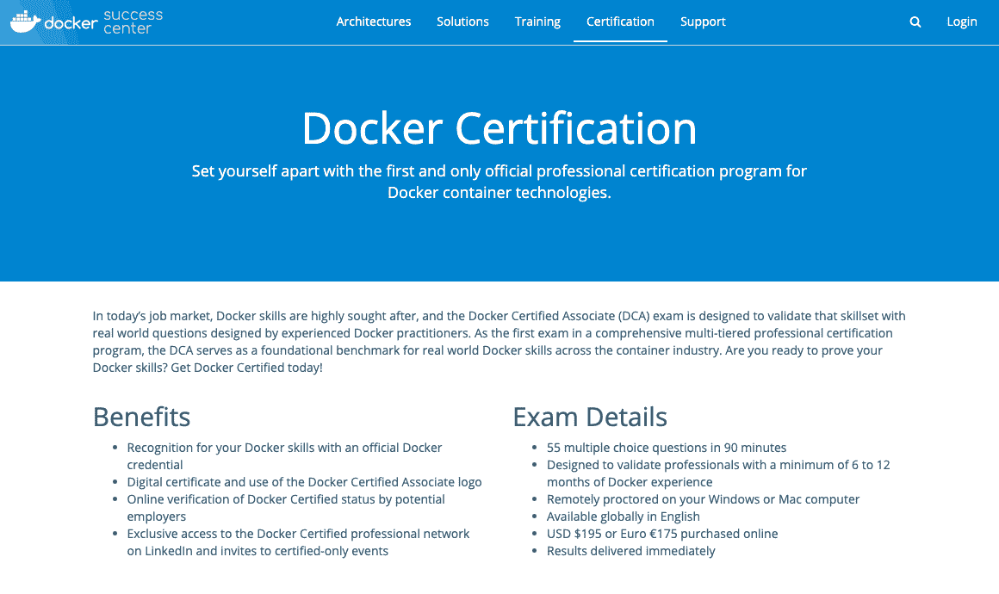
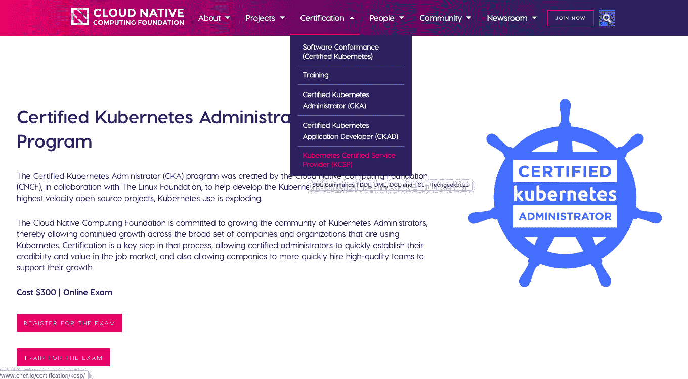
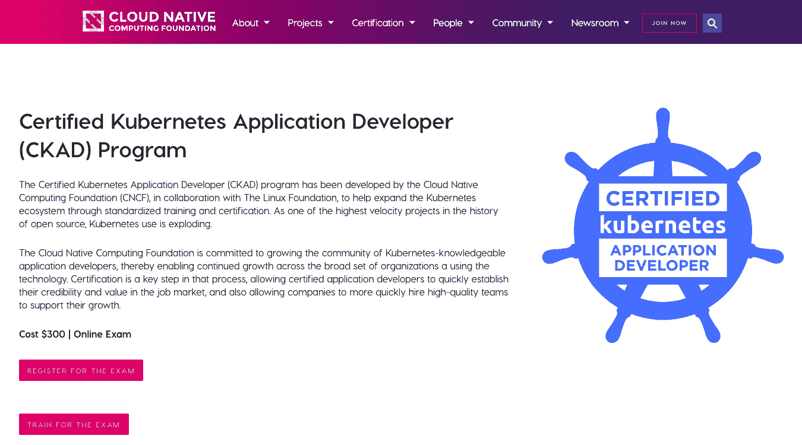
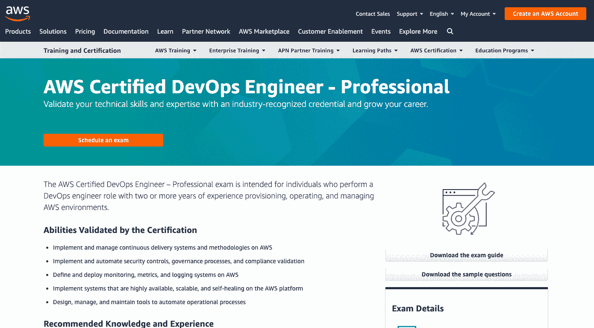
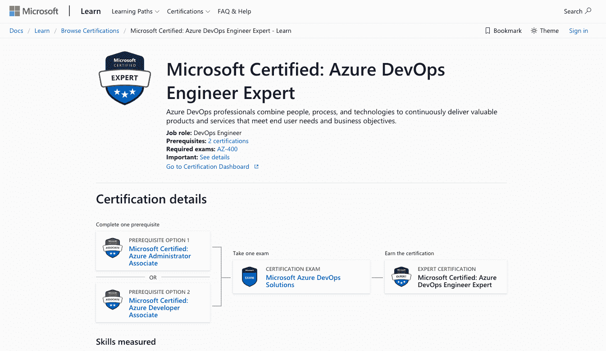
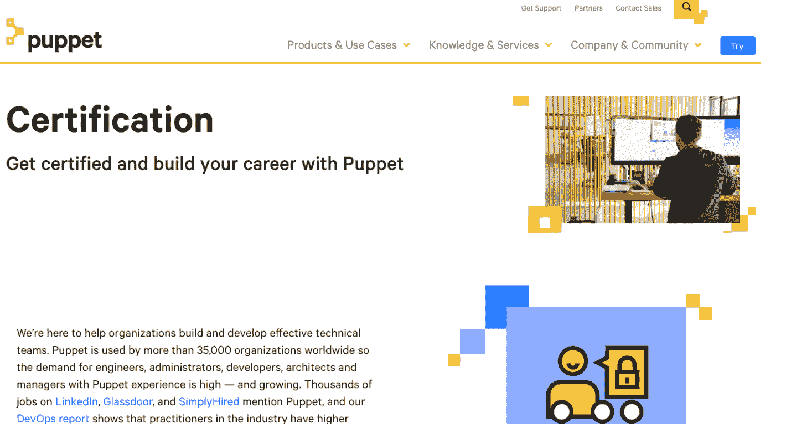
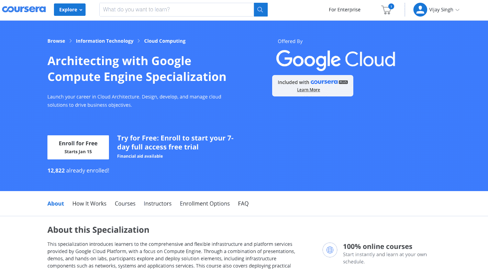
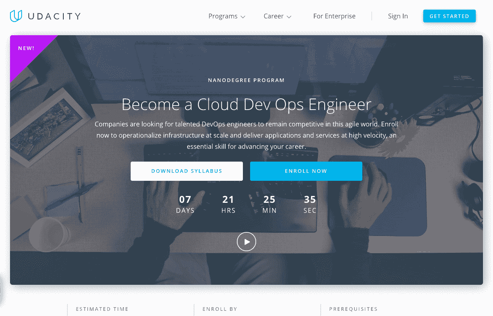
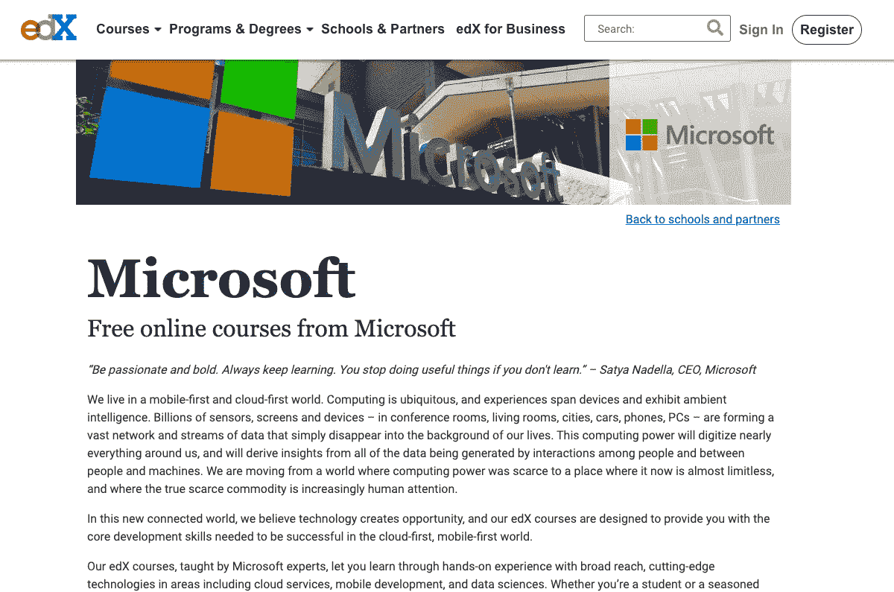

# 10 个最佳 DevOps 认证培训项目[排名]

> 原文：<https://hackr.io/blog/best-devops-certification>

## DevOps 是什么？

DevOps 被认为是开发人员和运营人员的联合体。DevOps 有几个阶段和一套工具来自动化每个阶段。

让我们的 DevOps 生命周期工程。

开发人员首先制定计划，决定要使用的模块和算法。然后再编写程序，像 Git 一样在存储库中启动。存储库保存原始代码和代码的版本，这被称为版本控制。然后在构建阶段获取代码并使其可执行。像 Gradle 和 Maven 这样的工具可以解决这个问题。在部署之前，使用流行的自动化测试工具(如 selenium)测试产品是否有 bug。一旦产品通过测试， [DevOps 工程师](https://hackr.io/blog/how-to-become-a-devops-engineer)就会部署它。然后，部署产品被持续配置到期望的状态。Ansible、Puppet 和 Docker 是自动化这些阶段的一些工具。

每个产品的工作要求都受到持续监控。Nagios 工具自动化了这个阶段。然后，反馈被反馈到规划阶段。DeOps 生命周期的核心是集成阶段。Jenkins 等工具负责发送构建和测试的代码。如果代码通过了测试，它将被发送进行部署。这叫做持续集成。

### DevOps 认证为什么重要？

DevOps 认证是一种认可的证书，展示了成为一名成功的 DevOps 专业人员所需的特定竞争技能和主题。通过各种评估、教育课程或绩效评估获得，并证明候选人符合严格的标准。

DevOps 职位一直是薪酬最高的职位之一，因此获得认证会增加找到好工作的机会。该认证还使您准备好在跨职能团队成员的团队中工作，包括 QA、开发人员、运营工程师和业务分析师。

## **10 大最佳 DevOps 认证**

现在，让我们来看看最佳 DevOps 认证和 DevOps 认证费用的列表，这将促进候选人的职业生涯。

[****](https://success.docker.com/certification)

Docker Certified Associate (DCA ),专为具有一些 Docker、DevOps 工具相关工作经验的 Docker 从业者设计，用于验证由经验丰富的 Docker 从业者设计的具有真实世界问题的技能组合。

先决条件:至少 6 个月的码头从业经验

#### 关于考试

费用:195 美元
时长:90 分钟
问题类型:55 MCQs

#### 考试大纲

*   管弦乐编曲
*   安全性
*   建立工作关系网
*   安装和配置
*   图像创建
*   管理
*   登记处
*   储存；储备
*   卷

#### 定期集市

*   正式码头工人证书对码头工人技能的认可
*   使用 Docker Certified Associate 标志和数字证书。
*   潜在雇主对 Docker 认证状态的在线验证
*   独家访问 LinkedIn 上的 Docker 认证专家网络，并受邀参加认证活动

如果你打算参加这个认证，这里有一个很好的课程可以帮助你做好准备:[Docker Certified Associate 2023](https://click.linksynergy.com/deeplink?id=jU79Zysihs4&mid=39197&murl=https://www.udemy.com/course/docker-certified-associate/)

### **2 .库柏认证〔t1〕**

Kubernetes 是一个开源的容器管理系统，是云本地计算基金会(CNCF)和 Linux 基金会的一个合作项目，它可以自动大规模部署和管理多容器应用程序。Kubernetes 是顶级的 DevOps 工具之一，它使 DevOps 团队能够跟上软件开发的需求，使其成为 DevOps 认证领域的重要参与者。

[Kubernetes 认证管理员(CKA)](https://www.cncf.io/certification/cka/) 和[Kubernetes 认证应用程序开发员(CKAD)](https://www.cncf.io/certification/ckad/) 是可以选择的两个认证选项。

[****](https://www.cncf.io/certification/cka/)

CKA 项目评估 Kubernetes 管理员应该具备的技能、知识和熟练程度。在线考试包括一系列基于表现的问题，考生必须在 3 小时内通过命令行解决这些问题。在这个项目中，用户在实际操作的命令行环境中展示了他们的能力。Kubernetes 认证管理员(CKA)项目旨在确保 cka 具备履行 Kubernetes 管理员职责的知识、技能和能力。

##### 关于考试

费用:$300
时长:3 小时
题型:解题

##### 考试大纲

*   应用生命周期管理 8%
*   安装、配置和验证 12%
*   核心概念 19%
*   网络 11%
*   计划 5%
*   安全性 12%
*   集群维护 11%
*   记录/监控 5%
*   存储 7%
*   故障排除 10%

[带模拟考试的 Kubernetes 认证管理员](https://click.linksynergy.com/deeplink?id=jU79Zysihs4&mid=39197&murl=https://www.udemy.com/course/certified-kubernetes-administrator-with-practice-tests/)是准备 CKA 认证的绝佳课程。

该认证面向执行 Kubernetes 生态系统核心实践的专业人员。测试候选人在为 Kubernetes 设计、构建、展示和配置原生云应用程序方面的熟练程度。认证是这一过程中的首要步骤，它使认证应用程序开发人员能够迅速在就业市场上建立自己的信誉和价值，也使公司能够更快地雇用高质量的团队来支持他们的发展。

候选人还必须了解云原生应用概念的应用技术、符合 OCI 标准的容器运行时和基础设施、[编程语言](https://hackr.io/blog/best-programming-languages-to-learn)，如 Go、Python 或 Java。

该考试证明候选人的经验、技能、应用专业知识以及对 Kubernetes 环境的熟悉程度。

##### 关于考试

费用:$300
时长:2 小时
题型:解题

##### 考试大纲

*   核心概念:13%
*   配置:18%
*   多容器容器:10%
*   可观察性-18%
*   吊舱设计-20%
*   服务和网络:13%
*   状态持续率:8%

[Kubernetes Certified Application Developer with Tests](https://click.linksynergy.com/deeplink?id=jU79Zysihs4&mid=39197&murl=https://www.udemy.com/course/certified-kubernetes-application-developer/)是一门强烈推荐的课程，用于准备 CKAD 认证。

### [****](https://aws.amazon.com/certification/certified-devops-engineer-professional/)

对于在 AWS 云中履行各种角色和职责的专业人员，有几种 AWS 认证。AWS DevOps 工程师专业认证考试测试考生在 AWS 平台上操作和管理分布式系统和应用程序的技术技能和专业知识。

该考试要求考生对开发和运营的流程和方法有很好的理解。他还必须在管理操作系统和构建自动化基础设施方面获得一些重要的经验。为准备 AWS DevOps 工程师专业考试，必须提供文档、书籍、白皮书、在线课程、练习测试和论坛。该考试提供英语、日语、韩语和中文版本。
关于考试:

费用:$300
时长:170 分钟
题型:40-65 MCQs

#### 考试大纲

*   SDLC 自动化
*   作为代码的配置管理和基础设施
*   高可用性、灾难恢复和容错
*   事故和事件响应
*   监控和记录
*   策略和标准自动化

下面是这个认证的一些 mack 考试: [AWS 认证 DevOps 工程师专业实践考试](https://click.linksynergy.com/deeplink?id=jU79Zysihs4&mid=39197&murl=https://www.udemy.com/course/aws-certified-devops-engineer-professional-practice-exams-amazon/)

[****](https://docs.microsoft.com/en-us/learn/certifications/devops-engineer)

微软 Azure，类似于 AWS 和谷歌云平台的云计算服务。它提供各种各样的服务，包括 web 服务器、电子邮件服务器、数据库、文件存储服务器、虚拟机、用户目录等等。合并 Azure 和 DevOps 简化并加快了整个 DevOps 流程，提供了更快、更可靠的部署。因此，该认证位于最佳 DevOps 认证列表中，因为作为 DevOps 工程师的 Azure 专业人员渴望获得该认证。

在几个 [Azure 认证](https://hackr.io/blog/microsoft-azure-certification-guide)中，Azure DevOps 工程师专家认证专门验证 Azure DevOps 专业人员的技能和专业知识。理想情况下，这些 Azure 专业人员将已经作为 DevOps 工程师工作，通过使用 Azure 技术为版本控制、构建、发布、合规性、测试和基础设施代码设计和实现 DevOps 最佳实践。

#### 关于考试

先决条件:Azure 管理员助理和 Azure 开发者助理
费用:$165
时长:170 分钟
题型:40-60 MCQs

#### 考试大纲

*   设计开发运维战略
*   实施 DevOps 开发流程
*   连续累计
*   连续交货
*   应用基础设施
*   依赖性管理
*   连续反馈

你可以在这里注册。

[****](https://puppet.com/learning-training/certification/)

全球超过 35，000 个组织使用 Puppet，206-系统管理使用 Puppet 考试；因此，对具有木偶经验的工程师、开发人员、管理员、经理和架构师的需求是显著的。 [Puppet 认证专家](https://puppet.com/learning-training/certification/)测试有才华的候选人对 Puppet IT 自动化软件的宏观知识。

通过考试后，考生将被允许使用 Puppet 操作系统基础设施。候选人可以学习数据分离和外部数据源等模块。木偶语言风格指南可以成为你准备木偶文档和公认的实践的圣经。

理想的候选人必须:

*   知道使用 Forge 来查找和应用模块
*   熟悉核心 Puppet 平台组件和 Puppet 代码的故障排除策略。
*   了解分类策略，通过这些策略他们可以设置类变量和参数。
*   理解模块测试实践，模块结构，配置文件和角色的安排和设计。

#### 关于考试

先决条件:无
费用:$200
时长:90 分钟
题型:60 MCQs

#### 考试大纲

*   资源抽象，
*   幂等性，
*   傀儡事实，
*   傀儡代理生命周期
*   以下方面的实际操作知识:

木偶语言，

*   Hiera 的数据服务能力，
    *   Puppet 数据库数据的应用，
    *   在 Puppet 代码中定义依赖关系的技巧。
    *   你可以在这里注册。

[****](https://coursera.pxf.io/kj1OQn)

要熟悉云计算及其基础设施，你需要向前迈出一步。该专业向学习者介绍了谷歌云平台提供的全面、灵活的平台和支持服务，重点是计算引擎。它有助于理解谷歌云平台提供的全球性和弹性基础设施和平台服务。该认证面向云解决方案架构师和 DevOps 工程师，任何有兴趣将现有系统和基础设施与 GCP 集成并创建新解决方案的人都可以参加该课程。通过大量的动手实验、练习和讲座，这套在线教程提供了探索和了解云平台各种组件(如网络、应用服务等)的机会。

本课程涵盖部署实用解决方案，包括安全互连网络、客户提供的加密密钥、安全和访问管理、配额和计费以及资源监控。云解决方案架构师、DevOps 工程师或使用计算引擎的个人通常会选择这门课程。

本课程涵盖所有基础设施组件和 GCP 基础知识，并提供大量练习来巩固知识和澄清疑问。每个主题都有一个适当的动手实验。

**关于课程**

#### 先决条件:无
Coursera 上有该课程。
费用:免费 7 天。【可获得的经济援助】
期限:弹性

你可以在这里注册。

著名的 DevOps 从业者 James Wickett 和 Ernest Mueller 为此课程做出了贡献。聚焦于文化、自动化、测量和共享的核心价值(CAMS)概述了 DevOps 运动。该课程涵盖了组织过渡到 DevOps 所采用的各种工具和方法，包括精益和敏捷项目管理原则，以及像 SDLC、ITSM、ITIL 这样的老派原则如何适应 DevOps。

对 DevOps 基础设施自动化、连续交付和可靠性工程三个主要原则的讨论结束了本课程。它还提供了一些额外的资源，并简要介绍了随着组织从云计算过渡到无服务器架构的未来。

关于课程:

#### 先决条件:无
课程在 [LinkedIn](https://www.linkedin.com/learning/devops-foundations)
上提供费用:1652 卢比
时长:3 小时

你可以在这里注册。

开始云计算开发工程师的职业生涯需要具备 [Linux 命令行经验和基本的面向对象编程的先决条件。本课程介绍了如何大规模运营基础架构，以及如何高速交付服务和应用。您从云计算、计算机能力、安全性、网络、消息传递和管理服务的基础开始。构建 CI/CD 管道，使用 Kubernetes 大规模运营微服务，以及其他重要主题。](https://hackr.io/blog/linux-cheat-sheet)

**关于课程:**

#### 先决条件:中级 JavaScript
课程在 [Udacity](https://imp.i115008.net/KeJZ57)
费用:Rs 79996 持续时间:4 个月

你可以在这里注册[。](https://imp.i115008.net/KeJZ57)

[****](https://click.linksynergy.com/deeplink?id=jU79Zysihs4&mid=39197&murl=https://www.udemy.com/course/learn-devops-infrastructure-automation-with-terraform/)

据预测，自动化将在未来技术中发挥至关重要的作用。如果您想在这种情况下占上风，本课程是正确的起点。它教你用 Terraform 自动化你的基础设施。从基础开始，最终走向复杂的主题。获得实践经验的机会，这有助于巩固你的概念。

对所需工具的配置和使用进行了清晰的说明和解释。讲座根据相关技术的发展定期更新。有许多代码示例可用于自动化您的基础设施。

**关于课程**

#### 先决条件:无
课程在 udemy 上提供。
费用:700 卢比 时长:7 小时

你可以在这里注册[。](https://click.linksynergy.com/deeplink?id=jU79Zysihs4&mid=39197&murl=https://www.udemy.com/course/learn-devops-infrastructure-automation-with-terraform/)

[****](https://www.edx.org/school/microsoft)

该计划在持续集成和部署的帮助下，对不断变化的市场条件做出反应。它教授如何监控应用程序、反馈循环以及确保客户满意度。这个项目分为八门课程，带你向前一步成为这个领域的专家。

该认证由微软创建，可在 edX 上获得，旨在帮助您学习任何工作场所的 DevOps 文化技能。

讲座以完美的节奏详尽地涵盖了每个概念。整个课程被分成适当的部分，这使得学生容易理解。了解数据库集成、配置管理、架构应用等主题。在认证结束时有一个期末项目，它将允许您应用在整个课程中学到的知识。

关于课程:

#### 前提:无
课程在 [edX](https://www.edx.org/school/microsoft)
费用:免费 时长:16-30 小时

你可以在这里注册[。](https://www.edx.org/school/microsoft)

结论

## 学习 DevOps 可能会让人不知所措，因此，我们为您提供了最佳 DevOps 认证的最终列表。无论您拥有什么样的工具或平台，选择您可以选择的对应 DevOps 认证并不困难。对于您渴望获得认证的 DevOps 工具，获得重要的实时实践经验至关重要。实践学习，获得认证，拥有光明的 DevOps 事业。

有更多 DevOps 认证建议吗？下面评论！！

你也可以向我们的读者朋友推荐一些 DevOps 社区。谢谢！

**人也在读:**

**People are also reading:**