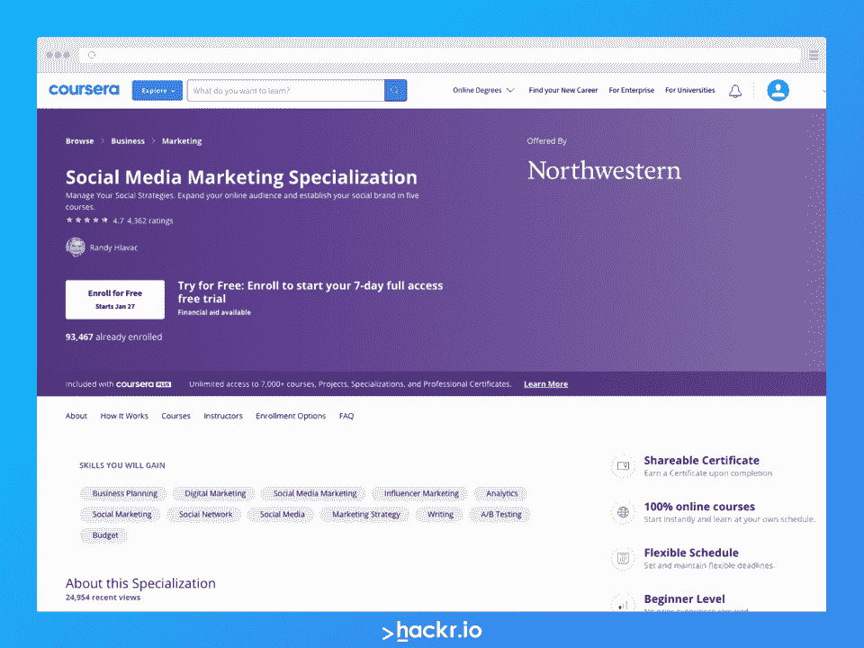
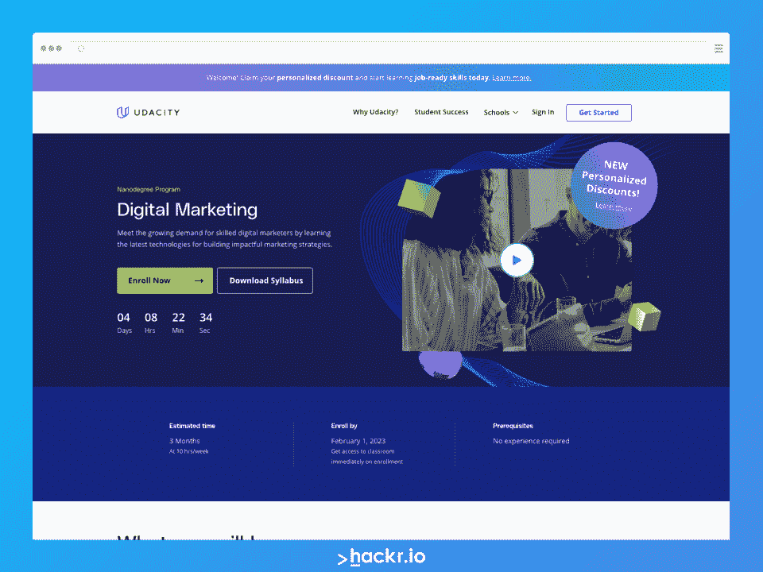
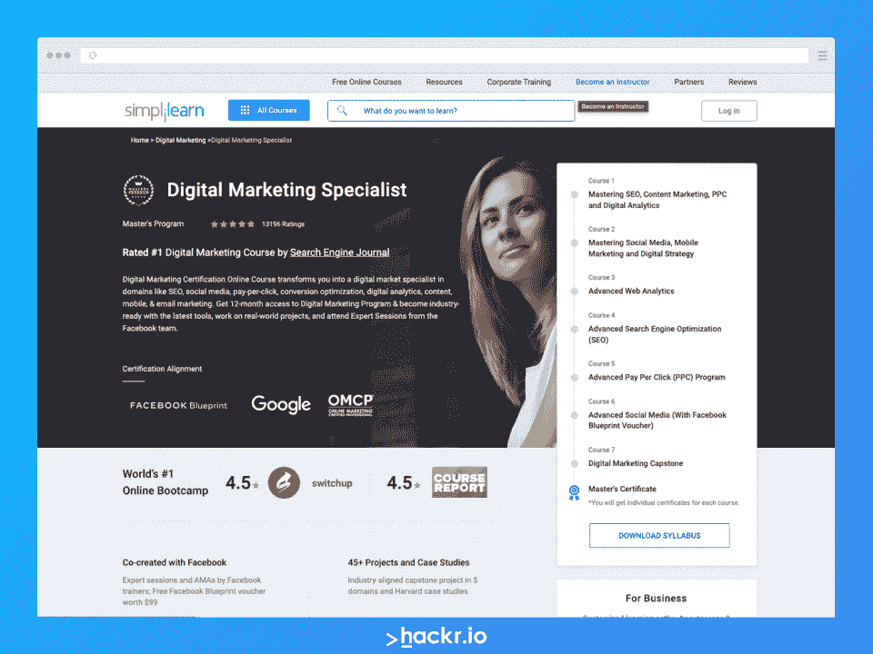
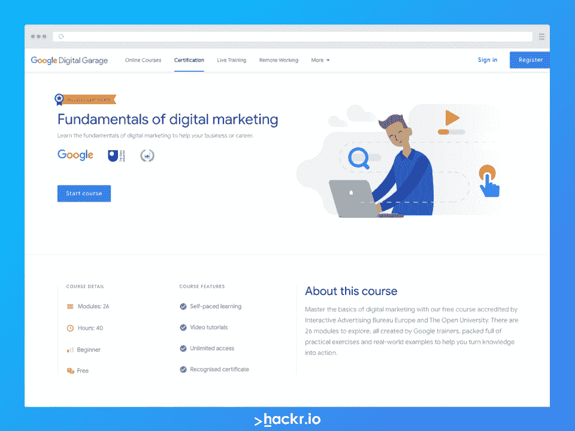
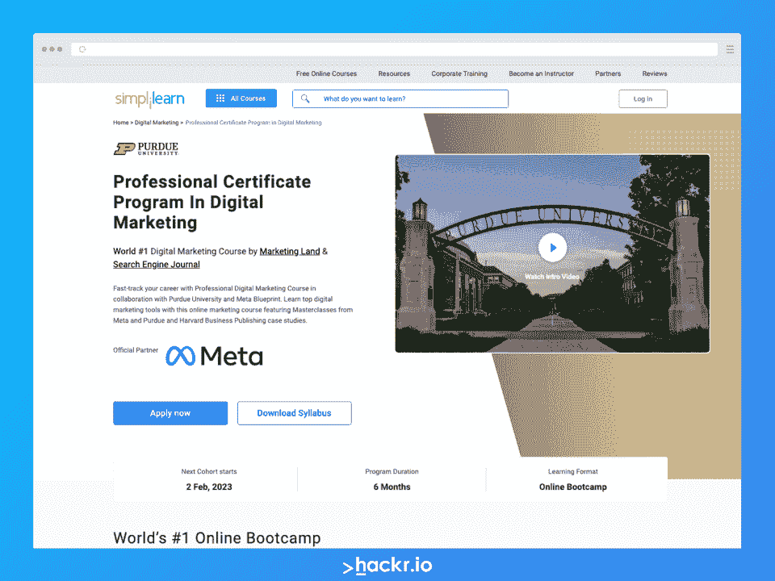
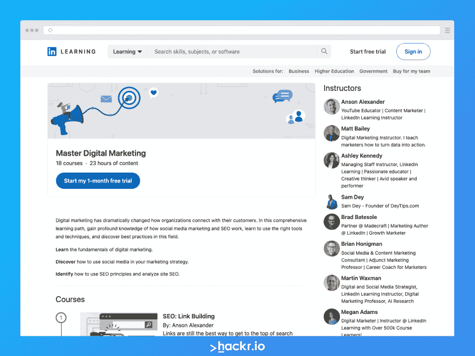
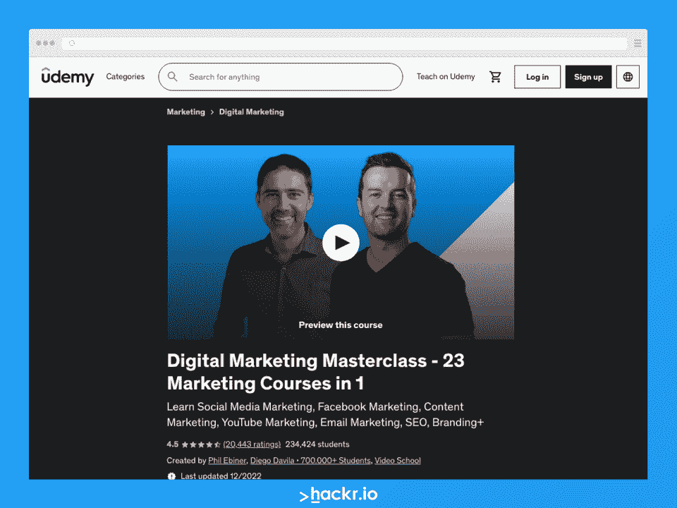
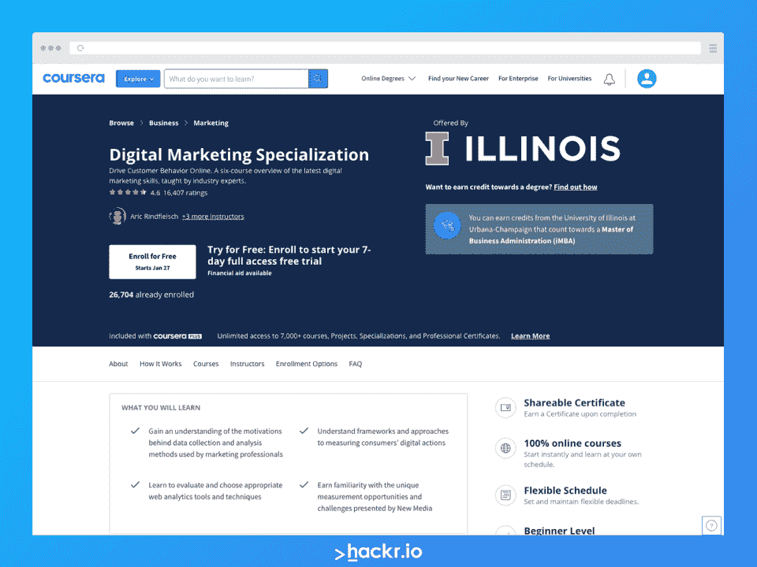
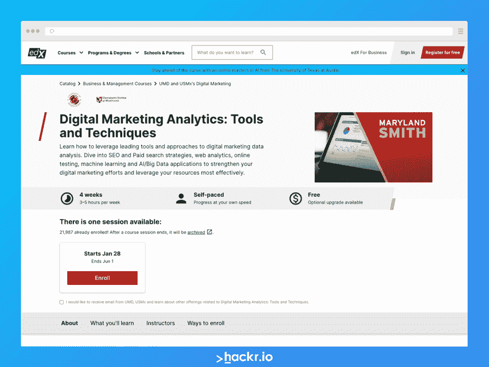

# 2023 年最佳在线数字营销课程【前 10 名】

> 原文：<https://hackr.io/blog/best-digital-marketing-courses>

**顶级数字营销课程-编辑推荐:**

如今，数字营销是一个受欢迎的领域，每年都有大量的职位空缺。而且很有道理！毕竟，品牌现在越来越意识到在线存在的必要性。

数字营销或在线营销总体上是指使用在线和数字技术来推广品牌、业务、产品或服务。但是在数字营销中，有许多细分市场可以进入——社交媒体营销、电子邮件营销、 [SEO](https://hackr.io/blog/what-is-seo) (搜索引擎优化)等等。如果你想成为一名数字营销者，你会想选择一些利基市场成为专家。

但是你到底如何开始学习更多关于数字营销的知识呢？最简单也是最好的方法之一就是注册最适合你需求的数字营销课程。

在本指南中，我们列出了十个最佳在线营销课程供您参考。我们精心策划了这个列表，包括各种难度、价格范围和持续时间的课程，以确保您有丰富的选择。

## **最佳数字营销课程:2023 年十大竞争者**

| **课程** | **描述** | **证书** | **关键信息** |
| [【谷歌数字车库】](https://learndigital.withgoogle.com/digitalgarage/course/digital-marketing)[**数字营销基础**](https://learndigital.withgoogle.com/digitalgarage/course/digital-marketing) | 最佳免费初学者证书课程 | ✔ | 

*   **讲师/课程创建者**:谷歌
*   **等级**:初学者
*   **免费或付费**:免费
*   **时长** : 40 小时，26 个自定进度模块

 |
| [【简单学习】](https://www.simplilearn.com/pgp-digital-marketing-certification-program)[**数字营销专业证书课程**](https://www.simplilearn.com/pgp-digital-marketing-certification-program) | 最佳认证预备课程 | ✔ | 

*   **导师/课程创建者**:普渡大学；官方合作伙伴 Meta
*   **等级**:初级到中级

*   **免费或付费**:付费
*   **证书**:是

*   *   还会收到元蓝图认证考试的优惠券
*   **期限**:六个月

 |
| [【外翻】T1](https://click.linksynergy.com/deeplink?id=jU79Zysihs4&mid=39197&murl=https%3A%2F%2Fwww.udemy.com%2Fcourse%2Fsocial-media-marketing-ads)[**社交媒体营销精通 2023 &#124; 10+平台广告**](https://click.linksynergy.com/deeplink?id=jU79Zysihs4&mid=39197&murl=https%3A%2F%2Fwww.udemy.com%2Fcourse%2Fsocial-media-marketing-ads) | 最适合初露头角的社交媒体营销人员 | ✔ | 

*   **讲师/课程创建者**:课程羡慕
*   **等级**:初学者+

*   **证书**:是
*   **时长** : 10.5 小时的视频点播

 |
| [【领英学习】](https://linkedin-learning.pxf.io/e436oZ)[**数字营销大师**](https://linkedin-learning.pxf.io/e436oZ) | 初学者的最佳学习路径 | ✔ | 

*   **讲师/课程创建者**:各种创建者，此处见
*   **等级**:初学者+

*   **免费或付费**:付费
*   **证书**:是
*   **时长** : 23 小时内容点播

 |
| [【Coursera】](https://imp.i384100.net/c/2890636/1347618/14726?u=https%3A%2F%2Fwww.coursera.org%2Fspecializations%2Fsocial-media-marketing&partnerpropertyid=2722169)[**社交媒体营销专业化**](https://imp.i384100.net/c/2890636/1347618/14726?u=https%3A%2F%2Fwww.coursera.org%2Fspecializations%2Fsocial-media-marketing&partnerpropertyid=2722169) | 最适合想成为社交媒体营销人员的学生 | ✔ | 

*   **导师/课程创建者**:兰迪·赫拉瓦茨；西北大学/Coursera
*   **等级**:初学者

*   **免费或付费**:付费；可获得的财政援助
*   **证书**:是
*   **持续时间**:大约。7 个月，每周学习 2 小时

 |
| [ [Udacity](https://imp.i115008.net/c/2890636/788202/11298?u=https%3A%2F%2Fwww.udacity.com%2Fcourse%2Fdigital-marketing-nanodegree--nd018&partnerpropertyid=2722169)[**数字营销纳米学位项目**](https://imp.i115008.net/c/2890636/788202/11298?u=https%3A%2F%2Fwww.udacity.com%2Fcourse%2Fdigital-marketing-nanodegree--nd018&partnerpropertyid=2722169) | 最佳数字营销课程 | ✔ | 

*   **指导老师/课程创建者**:各种指导老师，此处见
*   **等级**:初学者+

*   **免费或付费**:付费
*   **证书**:是
*   持续时间:三个月，每周学习十小时

 |
| [【外翻】T1](https://click.linksynergy.com/deeplink?id=jU79Zysihs4&mid=39197&murl=https%3A%2F%2Fwww.udemy.com%2Fcourse%2Fdigital-marketing-masterclass%2F)[**数字营销大师班- 23 期营销课程 1**](https://click.linksynergy.com/deeplink?id=jU79Zysihs4&mid=39197&murl=https%3A%2F%2Fwww.udemy.com%2Fcourse%2Fdigital-marketing-masterclass%2F) | 面向数字营销人员的最佳一体化课程 | ✔ | 

*   **讲师/课程创建者** : Phil Ebiner，Diego Davila，视频学校
*   **等级**:初学者

*   **免费或付费**:付费
*   **证书**:是
*   **时长** : 42.5 小时的视频点播

 |
| [【Coursera】](https://imp.i384100.net/c/2890636/1347618/14726?u=https%3A%2F%2Fwww.coursera.org%2Fspecializations%2Fdigital-marketing&partnerpropertyid=2722169)[**数字营销专业化**](https://imp.i384100.net/c/2890636/1347618/14726?u=https%3A%2F%2Fwww.coursera.org%2Fspecializations%2Fdigital-marketing&partnerpropertyid=2722169) | 最适合为未来的 MBA 课程获得学分 | ✔ | 

*   **讲师/课程创建者**:伊利诺伊大学王高分校林弗雷什、凯文·哈特曼、迈克·姚、Vishal Sachdev
*   **等级**:初学者

*   **免费或付费**:付费
*   **证书**:是
*   **持续时间**:大约 8 个月，每周学习 5 小时

 |
| [【简单学习】](https://www.simplilearn.com/advanced-digital-marketing-certification-training-course)[**数字营销专员硕士项目**](https://www.simplilearn.com/advanced-digital-marketing-certification-training-course) | 最佳数字营销训练营 | ✔ | 

*   **讲师/课程创建者** : Simplilearn，与脸书共同创建
*   **等级**:中级到高级

*   **免费或付费**:付费
*   **证书**:是
*   **时长**:自定步调；注册将授予您一年的访问权限

 |
| [【edX】](https://www.awin1.com/cread.php?awinmid=6798&awinaffid=428263&ued=https%3A%2F%2Fwww.edx.org%2Fcourse%2Fdigital-marketing-analytics-tools-and-techniques%3Findex%3Dproduct)[**数字营销分析:工具和技巧**](https://www.awin1.com/cread.php?awinmid=6798&awinaffid=428263&ued=https%3A%2F%2Fwww.edx.org%2Fcourse%2Fdigital-marketing-analytics-tools-and-techniques%3Findex%3Dproduct) | 学习 SEO、PPC 和数字营销分析的绝佳课程 | ✔ | 

*   **授课老师/课程创建者**:马里兰大学系统，马里兰大学；迈克尔·特鲁索夫，马立业
*   **等级**:初学者

*   **免费或付费**:免费审核或付费审核通过的赛道，获取证书
*   **证书**:是，仅针对付费认证赛道——免费审计赛道不提供证书
*   **持续时间**:四周，每周学习三到五个小时；学生自定进程的

 |

[****](https://learndigital.withgoogle.com/digitalgarage/course/digital-marketing)

**[了解更多](https://learndigital.withgoogle.com/digitalgarage/course/digital-marketing)**

**关键信息**

*   **讲师/课程创建者:**谷歌

*   **持续时间:** 40 小时，26 个自定进度模块

*   **要求:**一台计算机和一个工作的互联网连接

为什么要参加这个课程？

很难与免费争论——谷歌数字车库的这门课程免费向你提供高质量的教育，帮助你改变职业生涯(或促进你目前的职业生涯！).本互动课程涵盖了超过 26 个自定进度模块的数字营销基础知识。在课程结束时，你将获得一个认可的证书，可以放在你的简历和 LinkedIn 个人资料中。

**我们为什么选择本课程**

我们把它包括在内，因为它是对初学者来说最好的数字营销课程之一。事实上，它来自谷歌，并在完成后提供了一个公认的证书，这也增加了它作为一个免费程序已经疯狂的价值！

**优点**

*   百分之百免费
*   认可的简历完成证书
*   自定进度
*   期末考试

**缺点**

[****](https://www.simplilearn.com/pgp-digital-marketing-certification-program)

**[了解更多](https://www.simplilearn.com/pgp-digital-marketing-certification-program)**

**关键信息**

*   **指导老师/课程创建者:**普渡大学；官方合作伙伴 Meta

*   **等级:**初级到中级

*   *   还会收到元蓝图认证考试的优惠券

*   申请入学的人必须在该领域有两年的经验或任何学士学位
*   营销背景是有益的，但不是必需的

为什么要参加这个课程？

数字营销专业证书课程是由普渡大学和 Meta 合作的 Simplilearn 训练营。加入这个为期六个月的训练营将获得一份结业证书和一张凭证，以便日后参加[元蓝图认证考试](https://www.simplilearn.com/pgp-digital-marketing-certification-program#what-certificate-will-i-receive-after-completion-of-this-professional-digital-marketing-course-in-india:~:text=Meta%20Blueprint%20certification%3F-,Meta%20Blueprint,-is%20one%20of)。通过这次认证考试，您将获得数字营销领域世界上最好、最受欢迎的专业认证之一。

**我们为什么选择本课程**

这个紧张的训练营不仅是数字营销中最好的课程之一，而且也为你以后的元蓝图认证评估做好了准备。这是一项昂贵的投资，但可以获得回报，因为它为你未来在该领域的职业生涯做好了准备。

**优点**

*   认证准备
*   涵盖基础知识并深入更高级的主题
*   加强的

**缺点**

[****](https://click.linksynergy.com/deeplink?id=jU79Zysihs4&mid=39197&murl=https%3A%2F%2Fwww.udemy.com%2Fcourse%2Fsocial-media-marketing-ads)

**[了解更多](https://click.linksynergy.com/deeplink?id=jU79Zysihs4&mid=39197&murl=https%3A%2F%2Fwww.udemy.com%2Fcourse%2Fsocial-media-marketing-ads)**

**关键信息**

*   **讲师/课程创建者:**课程羡慕

*   **时长:** 10.5 小时的视频点播

*   一台电脑和互联网连接，你可能还想要一个可以处理各种社交媒体平台的移动设备
*   学习的欲望

为什么要参加这个课程？

无论你的背景如何，参加这个以社交媒体营销为重点的课程都可以帮助你实现你的数字营销目标。这门课程正在角逐最佳在线营销课程——尤其是如果你想学习如何在十个不同的社交媒体平台上营销的话。

**我们为什么选择本课程**

这门课程相对容易，可以自定进度，让你在空闲时间学习。最后你会获得结业证书，但最重要的是你将能够在你选择的平台上开始实施营销策略。

**优点**

*   负担得起的
*   教你如何在各种社交媒体平台上营销
*   自定进度

**缺点**

*   Udemy 证书并不总是被雇主认可的
*   社交媒体营销是一个快速变化的领域，因此需要经常接受继续教育

[****](https://linkedin-learning.pxf.io/e436oZ)

**[了解更多](https://linkedin-learning.pxf.io/e436oZ)**

**关键信息**

*   **授课老师/课程创建者:**各种创建者，见[此处](https://linkedin-learning.pxf.io/e436oZ)

*   **时长:** 23 小时内容点播

*   **要求:**一台可以上网的电脑

为什么要参加这个课程？

这个 LinkedIn 学习课程实际上不是一门课程，而是一个包含各种课程的学习路径，可以帮助你掌握数字营销。注册将帮助你学习基础知识，为你的成功做准备。

**我们为什么选择本课程**

我们包含了这个学习路径，以帮助您从头开始，学习数字营销、社交媒体营销、搜索引擎优化和各种其他数字营销工具的基础知识。你甚至会学到更多关于增强现实市场营销的知识！

**优点**

*   相对实惠的 LinkedIn 学习订阅
*   获得证书
*   涵盖独特的主题，如增强现实营销

**缺点**

*   这条路上的一些球场可能需要一些更新

[****](https://imp.i384100.net/c/2890636/1347618/14726?u=https%3A%2F%2Fwww.coursera.org%2Fspecializations%2Fsocial-media-marketing&partnerpropertyid=2722169)

**[了解更多](https://imp.i384100.net/c/2890636/1347618/14726?u=https%3A%2F%2Fwww.coursera.org%2Fspecializations%2Fsocial-media-marketing&partnerpropertyid=2722169)**

**关键信息**

*   **导师/课程创建者:**兰迪·赫拉瓦茨；西北大学/Coursera

*   **免费还是付费:**付费；可获得的财政援助

*   **持续时间:**大约 7 个月，每周学习 2 小时

为什么要参加这个课程？

这门初级课程是 Coursera 目录中的优质产品。这是一个数字营销专业，旨在帮助学员在课程结束时成为专业的社交媒体营销人员。除了学习社交媒体营销(SMM)的基础知识，学生还必须完成一个顶点项目，以进一步巩固他们所学的知识。

**我们为什么选择本课程**

随着社交媒体(以及 SMM)的快速发展，你需要不断更新，以确保你的策略保持相关。该专业化每季度更新一次，因此您可以随时重新访问它。课程也是西北大学开设的，保证质量。

**优点**

*   具有认可证书的高质量课程
*   教导学生如何建立社会品牌
*   每季度更新一次，以确保内容是最新的

**缺点**

*   需要 Coursera Plus 订阅

[****](https://imp.i115008.net/c/2890636/788202/11298?u=https%3A%2F%2Fwww.udacity.com%2Fcourse%2Fdigital-marketing-nanodegree--nd018&partnerpropertyid=2722169)

**[了解更多](https://imp.i115008.net/c/2890636/788202/11298?u=https%3A%2F%2Fwww.udacity.com%2Fcourse%2Fdigital-marketing-nanodegree--nd018&partnerpropertyid=2722169)**

**关键信息**

*   **指导老师/课程创建者:**各种指导老师，在这里看

*   持续时间:三个月，每周学习十小时

*   **要求:**不需要之前的经验；建议具备基本的计算机/互联网知识

为什么要参加这个课程？

这个纳米学位课程涵盖了数字营销的基础知识，并允许学生选择专业选修课。项目中的每门课程都以一个实践项目结束。学生向最优秀的人学习，并获得更多的好处，如职业服务和技术指导支持。

**我们为什么选择本课程**

在我们看来，Udacity 的数字营销纳米学位课程是数字营销整体的最佳课程。这个项目很密集，但是完成后，学生将获得一个业内高度认可的证书。Udacity 以其提供的教育质量而闻名，这个项目也不例外。

**优点**

*   精品课程
*   获得大多数雇主认可的证书
*   每门课程的项目，以提高你的学习
*   提供各种选修课

**缺点**

*   昂贵的
*   密集，可能需要更多的关注和时间投入

[****](https://click.linksynergy.com/deeplink?id=jU79Zysihs4&mid=39197&murl=https%3A%2F%2Fwww.udemy.com%2Fcourse%2Fdigital-marketing-masterclass%2F)

**[了解更多](https://click.linksynergy.com/deeplink?id=jU79Zysihs4&mid=39197&murl=https%3A%2F%2Fwww.udemy.com%2Fcourse%2Fdigital-marketing-masterclass%2F)**

**关键信息**

*   **讲师/课程创建者:** Phil Ebiner，Diego Davila，视频学校

*   **时长:** 42.5 小时的视频点播

*   **要求:**无市场营销经验要求；准备并愿意学习和采取行动

为什么要参加这个课程？

如果你想涉足在线或数字营销的世界，这个大师班可以教你这个行业的基础知识。在更深更复杂的话题上你不会学到太多东西，但是以它的价格，很难争论价值！

**我们为什么选择本课程**

Udemy 上的课程往往价格适中，这个大师班也不例外。虽然它提供了一些基本的信息，一些视频包含过时的信息，但学生可以以令人难以置信的价格轻松建立数字营销的基础。

**优点**

*   非常实惠
*   几乎涵盖了成功所需的一切
*   定期更新

**缺点**

*   最适合初学者
*   有些人抱怨一些科目已经过时

[****](https://imp.i384100.net/c/2890636/1347618/14726?u=https%3A%2F%2Fwww.coursera.org%2Fspecializations%2Fdigital-marketing&partnerpropertyid=2722169)

**[了解更多](https://imp.i384100.net/c/2890636/1347618/14726?u=https%3A%2F%2Fwww.coursera.org%2Fspecializations%2Fdigital-marketing&partnerpropertyid=2722169)**

**关键信息**

*   **讲师/课程创建者:**伊利诺伊大学王高分校林弗雷什、凯文·哈特曼、迈克·姚、Vishal Sachdev

*   **持续时间:**大约 8 个月，每周学习 5 小时

*   **要求:**计算机或移动设备和互联网连接

为什么要参加这个课程？

如果你想更多地了解数字营销和数据，因为它与这种营销形式有关，包括分析，那么 Coursera 上的这个专业是一个很好的选择。如果你想以后在伊利诺伊大学厄巴纳-香槟分校获得 MBA 学位，这也是最好的数字营销在线课程。

**我们为什么选择本课程**

这个课程是 100%在线的，比上面列出的其他 Coursera 专业课程更密集一点。然而，对于那些想成为数字营销人员同时又在攻读未来学位的人来说，这是一个绝佳的选择。

**优点**

*   获得伊利诺伊大学香槟分校的工商管理硕士学位
*   高质量的项目为学生未来的职业生涯做准备
*   获得认可的证书

**缺点**

*   紧张得多，对那些不能投入额外时间学习的人来说不是最好的

[****](https://www.simplilearn.com/advanced-digital-marketing-certification-training-course)

**[了解更多](https://www.simplilearn.com/advanced-digital-marketing-certification-training-course)**

**关键信息**

*   **讲师/课程创建者:** Simplilearn，与脸书共同创建

*   **等级:**中级到高级

*   **时长:**自定步调；注册将授予您一年的访问权限

*   **要求:**电脑或移动设备与互联网连接；高中文凭或本科学位

为什么要参加这个课程？

这个 Simplilearn 硕士课程不是硕士学位，它是一个密集的训练营，旨在为你将来从事数字营销做准备。参加这个训练营将为你参加一些最受欢迎的专业数字营销认证考试做好一切准备。除了包括的课程，还有一些选修课可以帮助你更好地为你的职业生涯做准备。

**我们为什么选择本课程**

对我们来说，对于那些想在毕业后做好职业准备的人来说，这个训练营是最佳在线数字营销课程的重要竞争对手。完成后你就获得了业内雇主认可的证书。

**优点**

*   密集，教你一切你需要学习成为一个数字营销专家
*   选修课允许你选择你的专业
*   自定进度，你有一年的时间完成你的计划
*   专业认证准备
*   硕士证书和每门课程的证书

**缺点**

*   昂贵的
*   对于一些日程繁忙的学习者来说，可能需要太多的投入

[****](https://www.awin1.com/cread.php?awinmid=6798&awinaffid=428263&ued=https%3A%2F%2Fwww.edx.org%2Fcourse%2Fdigital-marketing-analytics-tools-and-techniques%3Findex%3Dproduct)

**[了解更多](https://www.awin1.com/cread.php?awinmid=6798&awinaffid=428263&ued=https%3A%2F%2Fwww.edx.org%2Fcourse%2Fdigital-marketing-analytics-tools-and-techniques%3Findex%3Dproduct)**

**关键信息**

*   **授课老师/课程创建者:**马里兰大学系统，马里兰大学；迈克尔·特鲁索夫，马立业

*   **免费或付费:**免费或付费审核已验证的跟踪以获得证书

*   **证书:**是，仅针对付费认证课程—免费审核课程不提供证书

*   **持续时间:**四周，每周学习三到五个小时；学生自定进程的

*   **要求:**具有互联网连接的计算机或移动设备

为什么要参加这个课程？

本课程将教授学生如何利用领先的行业工具，包括分析数字营销数据的各种方法。参加这个课程将帮助你学习搜索引擎优化策略和成功的付费搜索(点击付费)策略。

**我们为什么选择本课程**

我们包括了这个自定进度的课程，因为它对于那些想学习更多关于 SEO 和 PPC 策略的人来说是一个极好的选择。许多学习者没有意识到的另一件事是，数字营销通常涉及大量数据，这将需要分析——你可以在这里了解更多信息。

本课程通过认证途径提供，您将获得结业证书。然而，你也可以通过审计跟踪免费学习项目中的一切，尽管这意味着你将不再获得证书或能够参加分级考试和作业。另一件需要记住的事情是，审核方向限制了您学习本课程的时间，因此您需要加快速度！

**优点**

*   可供审计，所以你可以免费学习一切
*   自定进度，尽管比其他项目更紧张
*   马里兰大学和马里兰大学系统的高质量课程

**缺点**

*   不会教给你所有关于数字营销的知识，所以你也需要注册其他课程

## **我们如何选择最佳在线数字营销课程**

当我们开始整理这个在线数字营销课程列表时，我们考虑了各种因素。第一个也是最重要的一个考虑是，每门课程必须清晰易懂。他们应该能够以简洁的方式呈现信息，开门见山，而不是绕着一系列令人费解的问题来混淆整个体验。

我们查看了每门课程的平台，以确保质量。并非所有的课程平台都是平等创建的，这就是为什么我们只收录了来自受尊敬平台的课程。课程作者也被认为是确保你参加的数字营销课程是由该领域的权威人士制作的。

我们也寻找能提供结业证书或专业证书的课程。尽管雇主可能不会平等地承认所有的证书，你仍然可以在简历中加入它们。

我们考虑的一些其他因素是成本、难度、持续时间，以及一些其他因素，如测试和巩固知识的练习或测验。

## **在线营销课程的成功秘诀**

参加数字营销的在线课程是为你在这个行业的未来职业生涯做准备的好方法。课程通常以一种清晰流畅的方式呈现课程和信息。最好的在线数字营销课程都有计划的教学大纲，以最有意义的方式安排讲座和活动，帮助学习者按时间顺序掌握一切。

你可以做几件事来增加你从课程中获得最大价值的机会。这里只是其中的几个。

### **考虑课程成本**

在线数字营销课程有各种价格区间，其中许多课程比其他课程便宜。例如，你可以在 Udemy 甚至 LinkedIn Learning 这样的平台上找到一次性购买不到 20 美元的课程。然而，根据平台的不同，你最终可能要支付 500 美元以上。

如果你在网上寻求数字营销培训，你能做的最好的事情之一就是缩小你的选择范围，选择符合你预算的课程。你也可以通过在 Coursera 这样的平台上获得一些经济资助的机会来扩大你的预算。

也问问你自己——你现在的雇主会为你的在线课程买单吗？这个选择并不总是对每个人都有意义，但是如果你有一个提供一定教育福利的雇主，你可能会考虑利用它！

### **确保你已经准备好所有的要求**

如果说数字营销课程有什么好处的话，那就是你注册时不需要任何疯狂的技术规范。与编程或设计课程不同，数字营销课程通常只要求你有一台足够强大的计算机，可以访问互联网，并且可能有一个移动设备(如电话)，允许你安装和使用一些当今流行的社交媒体应用程序。

跟随你的课程通常足以教会你开始成为一名数字营销人员所需要知道的东西。然而，额外学习一点也可能对你有好处。你可以做一些事情来补充你的知识:

*   关注其他数字营销者和这方面的权威。通常，这些可信的专业人士会免费提供有价值的建议。有些甚至会提供免费阅读，或者提示你可以从阅读中受益的其他课程和资源。
*   了解数字营销的最新和最大趋势。你可以通过加入论坛，订阅 YouTubers，以及如我们之前所说的，关注这方面的权威来做到这一点。
*   看书！有各种数字营销书籍可供不同层次的学习。有些非常适合初学者，而有些则更适合有经验的学习者。不管怎样，只要你在阅读最近发行或更新的书籍，你应该能够收集到对你未来职业有帮助的新信息！
*   当你学习网络营销课程时，你可能会考虑学习更多关于文案的知识——至少如果它还没有包含在你的课程中的话。作为一名数字营销人员，你很可能会与文案一起工作，或者自己做一些文案，这就是为什么知道它如何工作和做什么对你非常有益。

### **记笔记**

当你在网上学习数字营销课程时，你可能想像在课堂上一样做笔记。记笔记是一个很好的方法，当你需要快速回忆某件事情时，它可以作为一个参考。制作数字笔记本身很棒，但你可能会从在纸上手工书写中受益更多——正如一些研究显示的那样,[在纸上书写的行为](https://www.sciencedaily.com/releases/2021/03/210319080820.htm)可以导致更强的大脑活动和更好的信息记忆。

### **练习**

如果你的课程有这些，做练习来确保你进一步巩固你的学习是一个好主意。然而，你也可以自己练习。你也可以接受较小的工作或较低报酬的职位，以便尽早积累经验。

## **结论**

参加最好的数字营销课程可以帮助你快速学习，让你快速开始新的职业生涯。无论您过去是否有一些经验，或者是从零开始，都有一个完美的课程或班级供您选择。

我们希望我们的推荐列表能够帮助您找到满足您需求的完美课程。你觉得我们漏掉了一个应该在这个列表上的吗？请在评论中告诉我们！

你准备好开始找这个领域的工作了吗？查看一些 [**顶级数字营销面试问答**](https://hackr.io/blog/top-digital-marketing-interview-questions-and-answers) **帮你准备求职！**

## **常见问题解答**

#### **1。新手用哪种数字营销最好？**

有几种类型的数字营销，其中一些比另一些更容易上手。如果你以前从未做过任何数字营销，那么开始学习内容营销、社交媒体营销和电子邮件营销就没那么难了。SEO 或[搜索引擎优化](https://hackr.io/blog/best-seo-courses)也可能更容易掌握。

#### **2。数字营销哪门课程最好？**

有这么多精彩的课程可供选择，很难找出其中最好的一个。我们上面的精选列表包含了 10 个最好的。选择适合你的预算和学习水平的课程，以获得最佳效果。

#### **3。哪个数字营销工资最高？**

根据你进入的数字营销领域和你的资历，你可以获得丰厚的薪水。首席增长官和营销副总裁每年可获得超过 30 万美元的收入。

#### **4。有免费的网络营销课程吗？**

网上有很多免费的网络营销课程。在 Coursera 上免费查看像 Udemy 或审计课程这样的平台。你不会获得证书，但你至少会学到东西！警惕那些试图向你推销课程的“大师”，通常他们的免费内容只是引导你未来购买的一种方式。