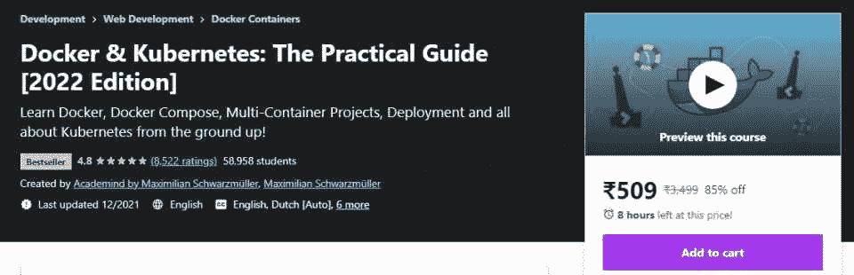
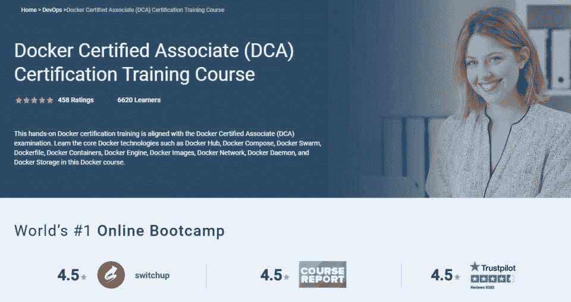
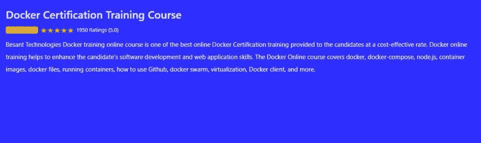
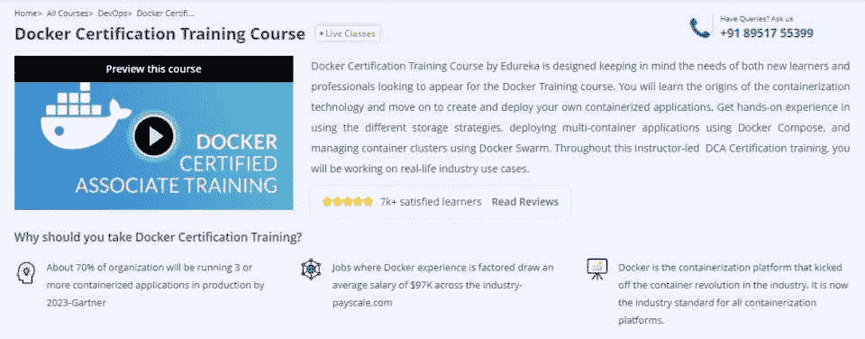
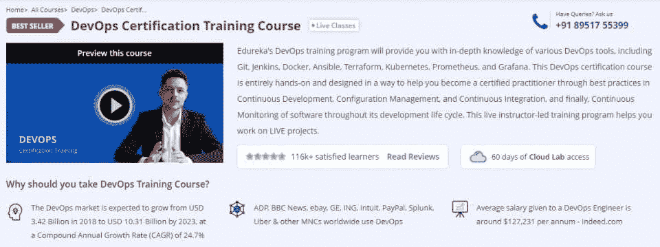
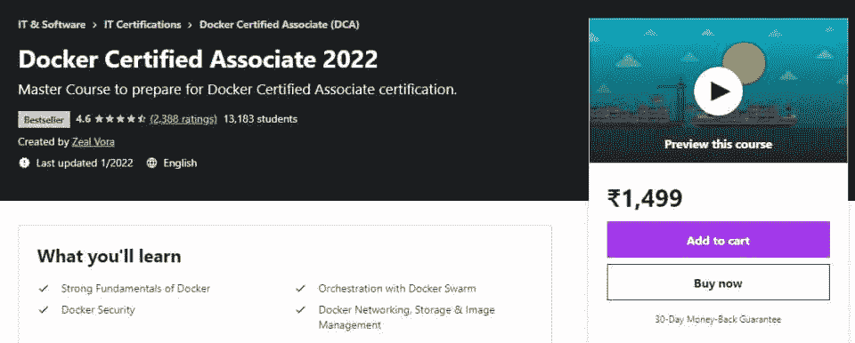
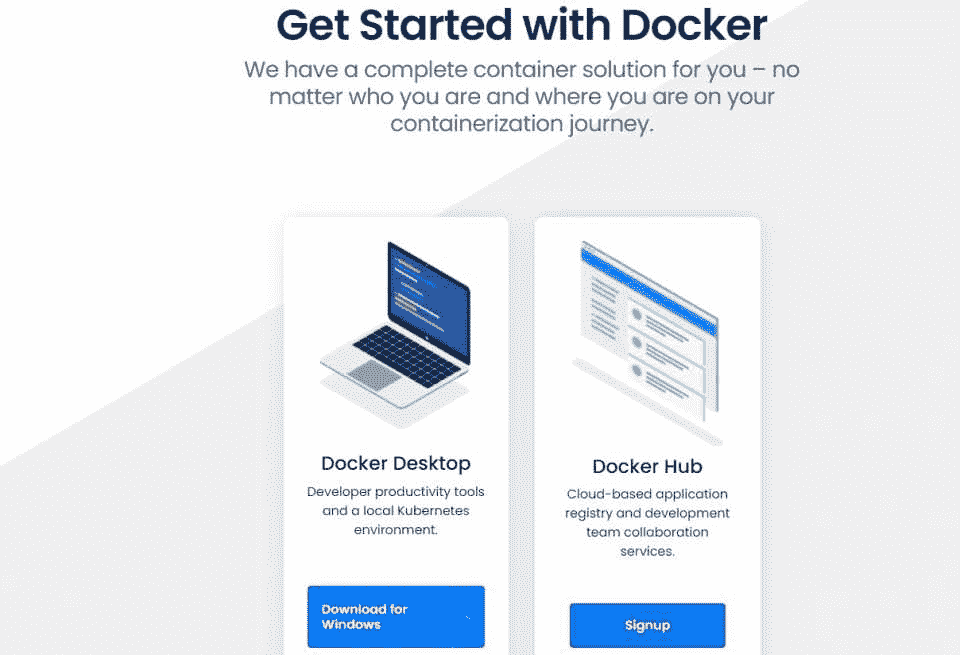
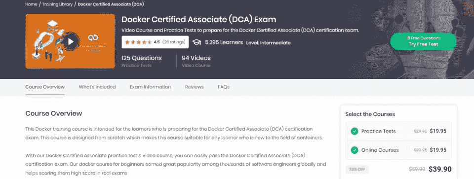

# 2023 年 10 大最佳码头工人认证[更新]

> 原文：<https://hackr.io/blog/best-docker-certifications>

Docker 认证在 IT 企业界备受追捧。该认证专为在业务运营中使用 Docker 企业版(EE)平台的企业而设计。因此，具备使用 Docker 的知识和技能的候选人是有价值的。

这些候选人有更好的机会找到好的角色，并增加他们的薪酬。我们在这里调查你能得到的最好的 Docker 认证，以及一些关于 Docker 的一般性问题。

## **Docker 是什么？【定义】**

Docker 专门用于构建和部署更快、更容易处理的新应用程序。通过这种方式，Docker 为开发人员提供了一个平台，他们可以使用 Docker 容器来包装软件，并在构建新应用程序时使用标准化单元来运行、编码和应用系统工具。Docker 容器支持 Linux 和 Windows，Docker 工具和 API 可用于制作高响应性和有用的 web 应用程序。

## 什么是 Docker 认证？

Docker 认证验证您执行与 Docker 平台相关的任务和职责的能力。后者是一个帮助部署包的容器化平台。有了 Docker 证书，你将向雇主展示你有能力有效地管理 Docker。Docker 认证费用大概是 250 美元。

## **10 大最佳码头工人认证课程**

这些 Docker 认证都附有提供在线课程的学院名称。请记住，Docker 认证助理考试费用因平台而异。

[****](https://cloudacademy.com/learning-paths/docker-certified-associate-dca-exam-preparation-1-1393/)

| **考试信息** | **详情** |
| **价格** | $249 |
| **先决条件** | 初级和中级码头工人知识 |
| **审判** | 7 天免费试用 |
| **总长** | 近似的 18 小时 |
| **难度等级** | 先进的 |
| **视频** | 48 |
| **动手学习** | 16 |
| **测验/考试** | 1 |

这个 Docker 认证助理计划是专为已经掌握 Docker 容器基本知识的学生设计的。课程和认证流程的先决条件包括至少 6 个月的 Docker 经验；1 年云提供商工作经验；以及容器安全、Linux 和配置管理工具的相关经验。

课程包括安装、维护和操作 Docker 平台，将传统应用程序迁移到容器，配置 Docker 引擎和故障排除，Docker 环境，以及维护和配置等。

[查看认证](https://cloudacademy.com/learning-paths/docker-certified-associate-dca-exam-preparation-1-1393/)

[****](https://click.linksynergy.com/deeplink?id=jU79Zysihs4&mid=39197&murl=https%3A%2F%2Fwww.udemy.com%2Fcourse%2Fdocker-kubernetes-the-practical-guide%2F)

| **考试信息** | **详情** |
| **价格** | $46 |
| **先决条件** | 基本的 IT 知识 |
| **审判** | 不适用的 |
| **总长** | 近似的 23.5 小时 |
| **难度等级** | 中间的 |
| **视频** | 259 |
| **动手学习** | 多重任务 |
| **测验/考试** | 1 |

Docker 和 Kubernetes:实用指南认证是由 Udemy 上的知名讲师 Maximillian Schwarzmuller 创建的。你需要基本的网络开发知识。该课程评价很高，涵盖了 Docker 的各个方面，如 Docker 图像和容器、数据管理、网络、多容器应用程序、Docker 编写等。

[查看课程](https://click.linksynergy.com/deeplink?id=jU79Zysihs4&mid=39197&murl=https%3A%2F%2Fwww.udemy.com%2Fcourse%2Fdocker-kubernetes-the-practical-guide%2F)

[****](https://www.simplilearn.com/docker-certified-associate-dca-certification-training-course)

| **考试信息** | **详情** |
| **价格** | $249 |
| **先决条件** | 基本的 IT 知识 |
| **审判** | 7 天免费试用 |
| **总长** | 近似的 19 个小时 |
| **难度等级** | 中间的 |
| **视频** | 65 |
| **动手学习** | 12 |
| **测验/考试** | 1 |

Simplilearn 提供的 Docker 认证助理课程是由一所专业学院提供的最佳认证课程之一。学生将了解 Docker Hub、Docker Swarm、Docker Network 和各种其他相关功能。这是一个 100%退款保证课程，讲师提供 24 小时的培训，包括 3 个课程结束项目和 2 个课程结束评估。

定期进行额外的电子书和最终知识检查。Docker 课程的特点是获得行业认可的认证。课程内容包括 Docker 简介、Docker 认证培训、Docker 预读、Docker 撰写、Docker 可信注册和安全性。

[查看课程](https://www.simplilearn.com/docker-certified-associate-dca-certification-training-course)

[****](https://www.besanttechnologies.com/docker-training-course)

| **考试信息** | **详情** |
| **价格** | $199 |
| **先决条件** | 基本的 IT 知识 |
| **审判** | 7 天免费试用 |
| **总长** | 30 小时 |
| **难度等级** | 中间的 |
| **视频** | 60 |
| **动手学习** | 14 |
| **测验/考试** | 1 |

这个 Docker 认证培训课程是一个全面的在线学习课程和认证过程，帮助学生了解软件开发的过程，获得 web 应用技能。本课程介绍了 Docker。Docker-compose，Docker 文件，运行容器，学习使用 Github，Node.js，虚拟化，Docker Swarm。

[查看课程](https://www.besanttechnologies.com/docker-training-course)

[****](https://www.edureka.co/docker-training)

| **考试信息** | **详情** |
| **价格** | $189 |
| **先决条件** | 基本的 IT 知识 |
| **审判** | 7 天免费试用 |
| **总长** | 近似的 18 小时 |
| **难度等级** | 中间的 |
| **视频** | 18 |
| **动手学习** | 8 |
| **测验/考试** | 1 |

这一 Docker 培训和认证来自 Edureka，一个长期以来一直提供优质教育的知名且高度可靠的品牌。

本课程提供端到端的学习体验。该认证确保他们拥有处理 Docker 的所有能力和技能。Docker 培训和认证课程的内容包括 Docker Hub、Docker Swarm、Docker Compose、Docker file、Docker Containers、Docker Engine、Docker Network、Docker Daemon 等等。

本课程值得注意的一个特点是向学生提供了真实的案例研究，以便他们能够更好地理解实际结果。

[查看课程](https://www.edureka.co/docker-training)

[****](https://www.edureka.co/docker-training)

| **考试信息** | **详情** |
| **价格** | $229 |
| **先决条件** | 基本的 IT 知识 |
| **审判** | 7 天免费试用 |
| **总长** | 近似的 21.5 小时 |
| **难度等级** | 中间的 |
| **视频** | 65 |
| **动手学习** | 12 |
| **测验/考试** | 1 |

DevOps 认证确定了应用各种 DevOps 工具的能力，也是证明你的 Docker 证书的另一种方式。您将获得使用各种 DevOps 工具以及 Docker、Git、Jenkins、Ansible、Puppet、Kubernetes 和 Nagios 的技能。课程包括了解 DevOps 的工作原理、DevOps 工程师技能、市场趋势和 DevOps 生态系统。

[查看课程](https://www.edureka.co/docker-training)

[****](https://click.linksynergy.com/deeplink?id=jU79Zysihs4&mid=39197&murl=https%3A%2F%2Fwww.udemy.com%2Fcourse%2Fdocker-certified-associate%2F)

| **考试信息** | **详情** |
| **价格** | $22 |
| **先决条件** | 基本的 IT 知识 |
| **审判** | 不适用的 |
| **总长** | 近似的 14 小时 |
| **难度等级** | 新手 |
| **视频** | 22 |
| **动手学习** | 8 |
| **测验/考试** | 1 |

Udemy 的 Docker Certified Associate 2023 课程很好地教授了 Docker、安全性、编排和 Docker 网络的基础知识。这是一个 14.5 小时的点播视频课程，价格相当合理。也有 29 篇文章和终身访问提供给学生。本课程介绍了 docker、使用 Docker 文件构建映像、了解 docker swarm、使用 Docker 合成文件创建应用程序堆栈以及 Docker 命令的基础知识。

[查看课程](https://click.linksynergy.com/deeplink?id=jU79Zysihs4&mid=39197&murl=https%3A%2F%2Fwww.udemy.com%2Fcourse%2Fdocker-certified-associate%2F)

[****](https://www.docker.com/get-started/)

| **考试信息** | **详情** |
| **价格** | $11.99 |
| **先决条件** | 基本的 IT 知识 |
| **审判** | 不适用的 |
| **总长** | 近似的 7 小时 |
| **难度等级** | 新手 |
| **视频** | 17 |
| **动手学习** | 4 |
| **测验/考试** | 1 |

Docker for Developers 认证是一个完整的容器课程，学生可以在通过考试后申请成为 Docker 中的开发人员。该课程是专门设计的，通过支持多语言开发来帮助学生成为开发人员。课程内容包括 Docker 介绍、Docker-compose、Docker 文件、运行容器、学习使用 Github、Node.js、虚拟化、Docker Swarm。

[查看课程](https://www.docker.com/get-started/)

[****](https://www.whizlabs.com/docker-certified-associate/)

| **考试信息** | **详情** |
| **价格** | $9 |
| **先决条件** | 基本的 IT 知识 |
| **审判** | 不适用的 |
| **总长** | 近似的 9 小时 |
| **难度等级** | 新手 |
| **视频** | 19 |
| **动手学习** | 3 |
| **测验/考试** | 1 |

Whizlabs 的 Docker Certified Associate 认证是一门 6 小时的视频培训课程。该课程提供退款保证和终身学习机会。课程内容包括 Docker 简介、Docker CE on Linux、Docker 映像、Docker 网络、Docker Compose、Docker 可信注册表和安全性。

[查看课程](https://www.whizlabs.com/docker-certified-associate/)

[****](https://click.linksynergy.com/deeplink?id=jU79Zysihs4&mid=39197&murl=https%3A%2F%2Fwww.udemy.com%2Fcourse%2Flearn-docker%2F)

| **考试信息** | **详情** |
| **价格** | $9 |
| **先决条件** | 基本的 IT 知识 |
| **审判** | 不适用的 |
| **总长** | 近似的 4 小时 |
| **难度等级** | 新手 |
| **视频** | 12 个短视频 |
| **动手学习** | 2 |
| **测验/考试** | 1 |

docker for the Absolute Beginner-Hands-On devo PS 是由 Udemy 推出的一项认证，提供强大的实践体验。本课程涵盖了 Docker 基础知识、使用 Docker 文件构建映像、使用 Docker 合成文件创建应用程序堆栈、基本 Docker 命令和 Docker Swarm。

[查看课程](https://click.linksynergy.com/deeplink?id=jU79Zysihs4&mid=39197&murl=https%3A%2F%2Fwww.udemy.com%2Fcourse%2Flearn-docker%2F)

## 11.奖励课程

[Docker & Kubernetes:实用指南【2023 版】](https://click.linksynergy.com/deeplink?id=jU79Zysihs4&mid=39197&murl=https%3A%2F%2Fwww.udemy.com%2Fcourse%2Fdocker-kubernetes-the-practical-guide%2F)

## **立即开始您的 Docker 认证课程**

Docker 被各大科技公司广泛使用，他们总是需要一名员工能够利用它的所有功能和优势来创建一个对客户友好并且证明对公司和客户都非常有益的 [web 应用程序](https://hackr.io/blog/web-application-architecture-definition-models-types-and-more#what-is-web-application-architecture)。Docker 认证告诉潜在雇主，你对平台有很强的理解。

如果你喜欢其他类型的学习材料，可以看看一些[最佳码头课程](https://hackr.io/tutorials/learn-docker?ref=blog-post)。祝你好运！

## **常见问题解答**

#### **1。获得 Docker 认证有什么好处？**

Docker 认证将向潜在雇主展示你拥有在 Docker 上部署应用程序的技术知识、技能和经验。它能让你从其他候选人中脱颖而出。

#### **2。码头工人证书的有效期有多长？**

码头工人证书有效期为 2 年。过了这段时间后，你必须重新申请。

#### **3。哪个 Docker 认证最好？**

没有一个 Docker 认证是最好的。我们建议你只需选择一个知名供应商的 Docker 认证，就像这里列出的那些。

#### **4。Docker 认证有多难？**

考取 Docker 认证并不是特别难。只要你努力学习和练习，通过 Docker 认证考试应该没有问题。

#### **5。我该如何准备 Docker 认证？**

你可以通过理论学习和安装 Docker 以及以动手的方式学习如何使用它来准备考试。这应该会让你对它的工作原理有一个全面的了解。

#### **6。Docker 认证有多大用处？**

码头工人证书向雇主证明你有能力在平台上执行任务，它总是要求更高的薪水。这也有助于你从其他候选人中脱颖而出，甚至有助于你获得加薪。

**人也在读:**