# 从初学者到高级的 14 门最佳 Docker 在线课程[2023]

> 原文：<https://hackr.io/blog/best-docker-courses>

完成[码头工人](https://www.docker.com/)课程是在 [DevOps](https://hackr.io/blog/what-is-devops) 提升你职业生涯的最快、最简单的方法之一。Docker 是一个用于集装箱化的行业标准平台，广泛应用于许多行业。对于希望在任何环境中构建、管理和分发容器的开发人员来说，Docker 是必不可少的。

Docker 经常与 Kubernetes 一起用于部署和编排，它并不完全是一个具有挑战性的学习解决方案——但是如果你想在真实的生产环境中信任自己，你需要掌握它。一个在线码头工人培训课程可以帮助很大。

## **选择正确的码头工人课程**

在你选择在线码头工人培训课程之前，有几件事需要考虑:

*   你是初级、中级还是高级用户？
*   需要学习 Docker 还是同时学习 Docker 和 Kubernetes？
*   你最终想获得 Docker 认证吗？

有些 docker 课程是为认证路径设计的，或者提供自己的证书，有些则不是。如果你是一个想同时使用 Docker 和 Kubernetes 的高级用户，参加 Docker Kubernetes 联合在线课程可能是一个更好的主意。

考虑到这一点，我们为所有经验水平选择了最好的在线码头工人培训课程。

[**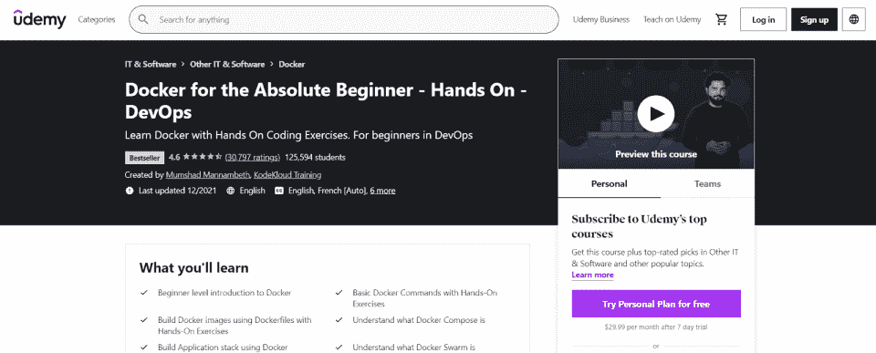**](https://click.linksynergy.com/deeplink?id=SeYHzlfZEmI&mid=39197&murl=https%3A%2F%2Fwww.udemy.com%2Fcourse%2Flearn-docker%2F)

如果你以前从未使用过 Docker，这是最适合你的课程。*Docker for the Absolute 初学者* 带你了解 Docker 是什么，如何使用它来改进 DevOps，以及如何在现实应用中使用它。您将看到演示如何设置 Docker，如何熟练使用 Docker 命令，以及如何创建自己的 Docker 文件。

**课程规格:**

*   等级:初学者
*   费用:129.99 美元(有促销活动)
*   长度:自定步调
*   包含:4.5 小时的视频，17 篇文章，1 个可下载资源
*   Certificate of Completion: Yes

    [转到课程](https://click.linksynergy.com/deeplink?id=SeYHzlfZEmI&mid=39197&murl=https%3A%2F%2Fwww.udemy.com%2Fcourse%2Flearn-docker%2F)

[**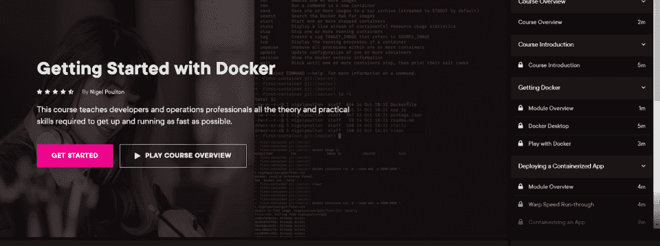**](https://pluralsight.pxf.io/mgr44q)

通过这些初学者课程，DevOps 专业人员可以了解 Docker 做什么，如何使用它，以及如何有效地优化它。在这个 PluralSight 课程中，用户将了解容器化的基本原理，如何构建 Swarm 集群，以及如何使用 Docker 堆栈进行生产级部署。尽管如此，这个初级课程还是传授了实用的专家级知识。

**课程规格:**

*   等级:初学者
*   费用:免费试用，每年 299 美元(PluralSight 库)。
*   长度:自定步调
*   包含:1 小时 26 分钟的素材
*   Certificate of Completion: No

    [转到课程](https://pluralsight.pxf.io/mgr44q)

[**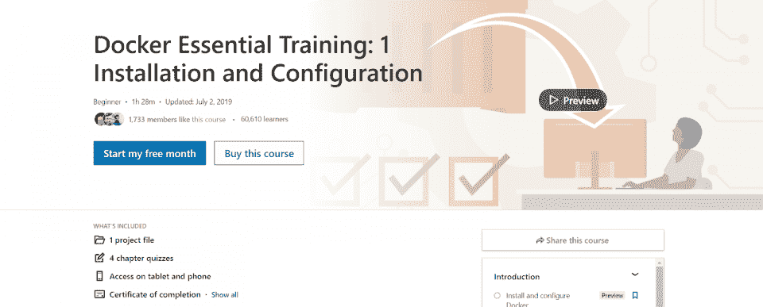**](https://linkedin-learning.pxf.io/LPo00L)

在 *Docker 基础培训* 中，开发者将学习如何在多种环境下安装和配置 Docker，包括 AWS。想要获得 Docker 认证助理证书的人可以从这里开始学习，这里有 Docker 安装、设置和 Docker Enterprise 功能。这门初级课程涵盖了开发人员在开始使用该平台时需要了解的所有 Docker 基础知识。

**课程规格:**

*   等级:初学者
*   费用:29.99 美元
*   长度:自定步调
*   包含:1 个项目文件，4 个章节测验
*   Certificate of Completion: Yes

    [转到课程](https://linkedin-learning.pxf.io/LPo00L)

[**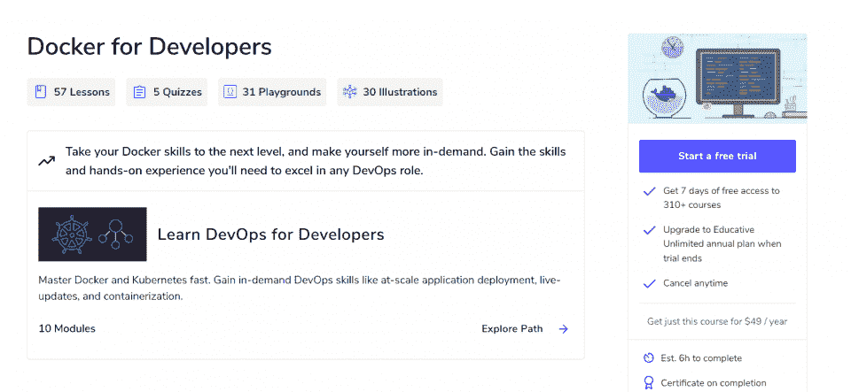**](https://www.educative.io/courses/docker-for-developers)

本课程是为对 Docker 及其理念有所了解的开发人员设计的，涵盖了使用 Docker 容器化来部署、运行和优化应用程序。开发人员将学习如何最好地实现 Docker 解决方案，如何创建图像，以及如何利用不同的开发配置文件。

本课程面向中级用户，深入探讨 Docker 在现实场景中的用法。开发人员可以通过“操场”模拟 Docker 环境，并在其中练习构建，这使得本课程特别有用。

**课程规格:**

*   级别:中级
*   费用:49 美元/年
*   长度:自定步调
*   包含:57 课，5 次测验，31 个操场，30 幅插图
*   Certificate of Completion: Yes

    [转到课程](https://www.educative.io/courses/docker-for-developers)

[**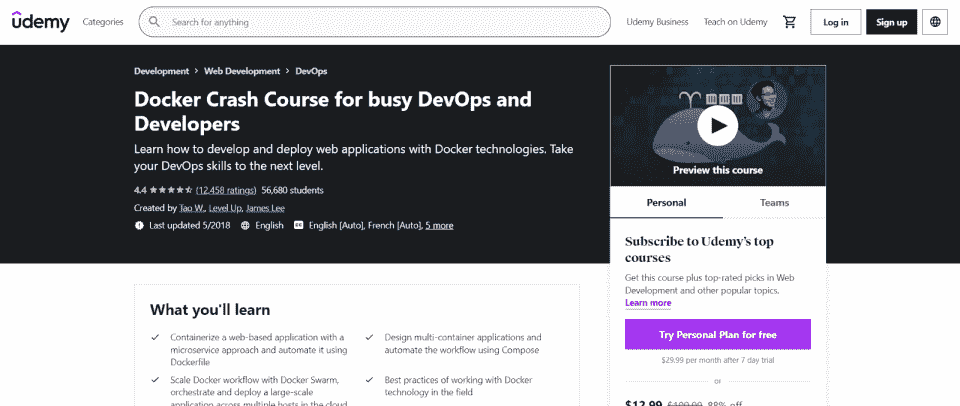**](https://click.linksynergy.com/deeplink?id=jU79Zysihs4&mid=39197&murl=https%3A%2F%2Fwww.udemy.com%2Fcourse%2Fdocker-tutorial-for-devops-run-docker-containers%2F)

想快速学会 Docker？如果你是一个高级开发人员，只是想尽快了解更多关于 Docker 的知识，这个速成班非常适合你。 *Docker 速成班* 包括创建容器化应用程序、扩展 Docker 工作流、使用 Docker 的最佳实践以及深入了解 Docker 技术。纳斯达克、大众汽车、Dropbox、网飞和 Eventbrite 的员工使用该课程。

**课程规格:**

*   级别:中级
*   费用:109.99 美元
*   长度:自定步调
*   包含:7 节，49 节课，3 小时内容
*   Certificate of Completion: Yes

    [转到课程](https://click.linksynergy.com/deeplink?id=jU79Zysihs4&mid=39197&murl=https%3A%2F%2Fwww.udemy.com%2Fcourse%2Fdocker-tutorial-for-devops-run-docker-containers%2F)

[**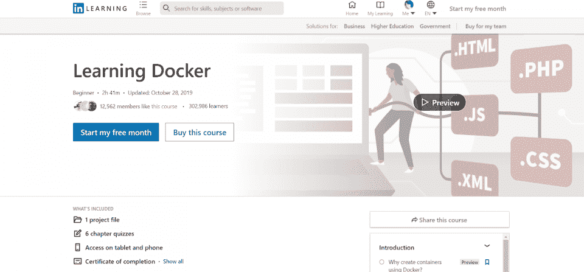**](https://linkedin-learning.pxf.io/QOzYYM)

这一详细的 Docker 课程带领学生了解集装箱化和 Docker 系统的来龙去脉，包括集装箱化的重要性、Docker 文件的使用、Docker 容器的联网以及数据和基础设施的管理。

通过本课程，开发人员将学习如何在 Docker 中构建和部署他们自己的容器，以及如何在保持性能和安全性的同时将容器联网和链接以提高优化。

**课程规格:**

*   级别:中级
*   费用:29.99 美元
*   长度:自定步调
*   包含:1 个项目文件，6 个章节测验
*   Certificate of Completion: Yes

    [转到课程](https://linkedin-learning.pxf.io/QOzYYM)

[**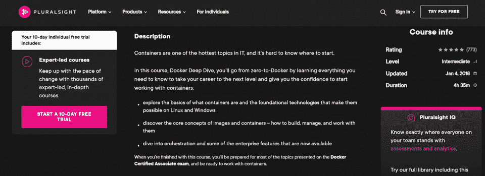**](https://pluralsight.pxf.io/9WxVV0)

在 *Docker 深潜* 中，开发者从对 Docker 一无所知，到完全了解他们需要了解的一切。尽管只需要中级开发知识，但这是一门更高级的 Docker 课程，包括容器化的基础知识、核心概念、编排和企业特性。

本课旨在帮助您完成 Docker 认证助理考试，这是一项入门级认证，有助于促进您的职业发展。

**课程规格:**

*   级别:中级
*   费用:免费试用，每年 299 美元(PluralSight 库)。
*   长度:自定步调
*   包含:4 小时的素材
*   Certificate of Completion: No

    [转到课程](https://pluralsight.pxf.io/9WxVV0)

[**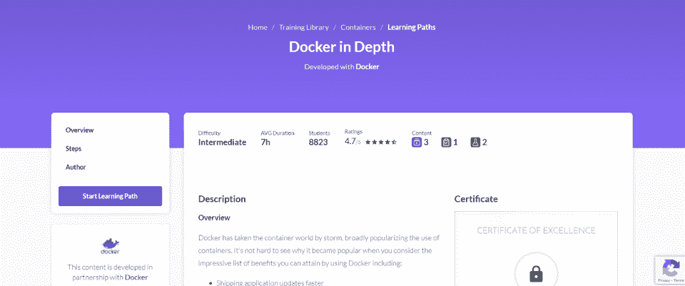**](https://cloudacademy.com/learning-paths/cloud-academy-docker-in-depth-129/)

与 Docker 合作开发了中级课程 *深度 Docker*。本课程涵盖了使用 Docker 的好处，何时使用 Docker，以及如何使用 Docker Compose 和 Docker Swarm 管理和编排应用程序。

本课程包括动手实验和一次深入的期末考试，还将介绍与生产环境相关的 Amazon Web Services。

**课程规格:**

*   级别:中级
*   费用:每月 39 美元
*   长度:自定步调
*   包含:7 小时的内容
*   Certificate of Completion: Yes

    [转到课程](https://cloudacademy.com/learning-paths/cloud-academy-docker-in-depth-129/)

[**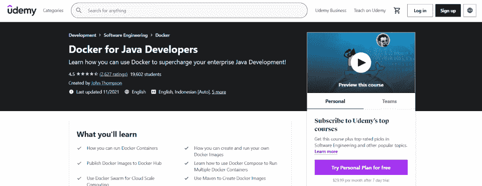**](https://click.linksynergy.com/deeplink?id=SeYHzlfZEmI&mid=39197&murl=https%3A%2F%2Fwww.udemy.com%2Fcourse%2Fdocker-for-java-developers%2F)

如果你是一名 Java 开发人员，你可能对 Docker 容器化更感兴趣，特别是针对 Java 开发。本激光聚焦课程基于创建 Docker 映像和使用 Docker swarm 进行基于 Java 的云计算。

您将学习如何运行多个 Docker 容器，如何创建 Docker 映像，以及如何创建自己的 Docker swarm 集群，所有这些都着眼于 Java 开发。

**课程规格:**

*   级别:中级
*   费用:99.99 美元
*   长度:自定步调
*   包含:10.5 小时视频，16 个可下载资源，3 篇文章
*   Certificate of Completion: Yes

    [转到课程](https://click.linksynergy.com/deeplink?id=SeYHzlfZEmI&mid=39197&murl=https%3A%2F%2Fwww.udemy.com%2Fcourse%2Fdocker-for-java-developers%2F)

[**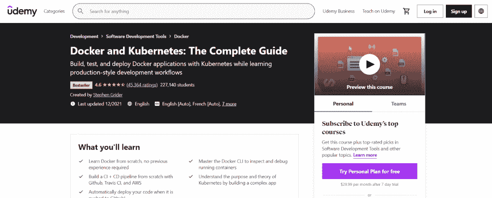**](https://click.linksynergy.com/deeplink?id=SeYHzlfZEmI&mid=39197&murl=https%3A%2F%2Fwww.udemy.com%2Fcourse%2Fdocker-and-kubernetes-the-complete-guide%2F)

在野外，Docker 和 Kubernetes 通常是形影不离的。这个结合了 Docker 和 Kubernetes 的课程让你从零开始学习 Docker，并使用 Kubernetes 构建一个复杂的应用程序。本课程将使您更容易使用 Kubernetes 构建、测试和部署 Docker 应用程序，从而为实际的 DevOps 应用程序做好准备。如果你需要学习 Kubernetes，这是一个很好的解决方案。

**课程规格:**

*   等级:高级
*   费用:99.99 美元
*   长度:自定步调
*   包含:19 节，326 讲，22 小时 14 分钟的内容
*   Certificate of Completion: Yes

    [转到课程](https://click.linksynergy.com/deeplink?id=SeYHzlfZEmI&mid=39197&murl=https%3A%2F%2Fwww.udemy.com%2Fcourse%2Fdocker-and-kubernetes-the-complete-guide%2F)

[****](https://click.linksynergy.com/deeplink?id=SeYHzlfZEmI&mid=39197&murl=https%3A%2F%2Fwww.udemy.com%2Fcourse%2Fdocker-kubernetes-the-practical-guide%2F)

另一门高级 Docker 课程，*Docker&Kubernetes*涵盖了你需要了解的关于 Docker 和 Kubernetes 技术的一切。您将学习在多个系统上安装 Docker，管理持久数据，部署 Docker 应用程序，容器化网络和服务，以及通过 Kubernetes 和通过 Docker 手动部署应用程序。

**课程规格:**

*   等级:高级
*   费用:109.99 美元
*   长度:自定步调
*   包含:16 节，259 讲，23 小时 38 分钟的内容
*   结业证书:是   [转课程](https://click.linksynergy.com/deeplink?id=SeYHzlfZEmI&mid=39197&murl=https%3A%2F%2Fwww.udemy.com%2Fcourse%2Fdocker-kubernetes-the-practical-guide%2F) 

[**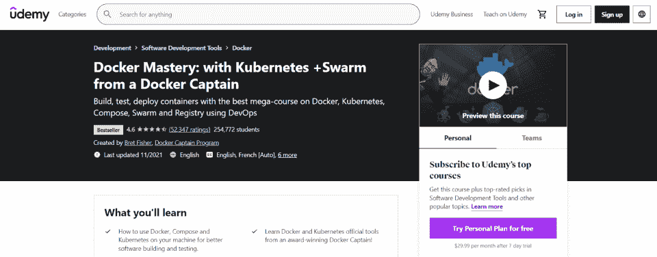**](https://click.linksynergy.com/deeplink?id=SeYHzlfZEmI&mid=39197&murl=https%3A%2F%2Fwww.udemy.com%2Fcourse%2Fdocker-mastery%2F)

如果你真的想知道关于 Docker 的一切，你需要这个高级课程。本课程旨在向您提供关于 Docker、Kubernetes、Compose、Swarm 和 Registry 的所有信息。一个增强的、深入的 DevOps 课程，*Docker Mastery*还包括一个实时聊天组，一个每周一次的实时 Q & A，以及来自 Docker 船长的专家、实践建议。这非常适合那些想要通过认证过程的人或者只是想尽可能掌握 Docker 的人。

**课程规格:**

*   等级:高级
*   费用:84.99 美元
*   长度:自定步调
*   包含:22 节，176 讲，19 小时 36 分钟的内容
*   Certificate of Completion: Yes

    [转到课程](https://click.linksynergy.com/deeplink?id=SeYHzlfZEmI&mid=39197&murl=https%3A%2F%2Fwww.udemy.com%2Fcourse%2Fdocker-mastery%2F)

[**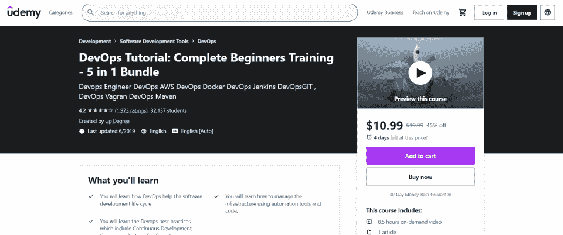**](https://click.linksynergy.com/deeplink?id=SeYHzlfZEmI&mid=39197&murl=https%3A%2F%2Fwww.udemy.com%2Fcourse%2Fdevops-docker-complete-guide-hands-on-with-practical%2F)

如果你真的想进阶的话， *DevOps 教程:完整的初学者训练* 不仅仅包括 Docker，而是所有你在使用 Docker 时会被期望知道的辅助技术。这包括 AWS、Jenkins、Vagran 等等。您将了解 DevOps 流程、持续开发、持续测试以及持续管理和交付。您还将了解如何使用 Docker 和其他解决方案来管理、自动化和控制您的部署。本课程是面向高级用户的高级概述。

**课程规格:**

*   等级:高级
*   费用:19.99 美元
*   长度:自定步调
*   包含:14 节，62 讲，8 小时 20 分钟的内容
*   Certificate of Completion: Yes

    [转到课程](https://click.linksynergy.com/deeplink?id=SeYHzlfZEmI&mid=39197&murl=https%3A%2F%2Fwww.udemy.com%2Fcourse%2Fdevops-docker-complete-guide-hands-on-with-practical%2F)

[**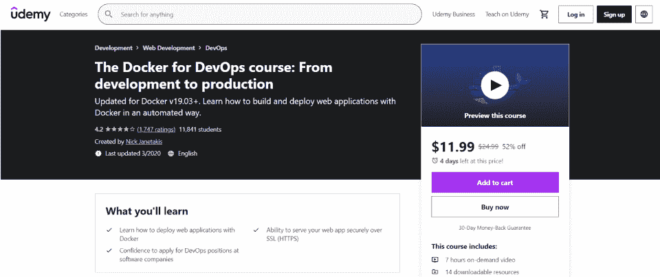**](https://click.linksynerghttps//click.linksynergy.com/deeplink?id=SeYHzlfZEmI&mid=39197&murl=https%3A%2F%2Fwww.udemy.com%2Fcourse%2Fdevops-docker-complete-guide-hands-on-with-practical%2F)

本 DevOps 课程专为 web 开发人员设计，教您如何通过 Docker 部署 web 应用程序，以及如何通过 SSL 安全地提供 web 应用程序。这是面向高级专业 web 应用程序开发人员的，旨在帮助您朝着 DevOps 职位的方向发展。课程包括创建一个 Dockerized Flask 应用程序，创建一个 Dockerized Rails 应用程序，以及启动一个临时服务器。

**课程规格:**

*   等级:高级
*   费用:24.99 美元
*   长度:自定步调
*   包含:14 节，95 讲，7 小时 52 分钟的内容
*   Certificate of Completion: Yes

    [转到课程](https://click.linksynerghttps//click.linksynergy.com/deeplink?id=SeYHzlfZEmI&mid=39197&murl=https%3A%2F%2Fwww.udemy.com%2Fcourse%2Fdevops-docker-complete-guide-hands-on-with-practical%2F)

## **最佳码头工人课程入门**

如果你有兴趣通过 DevOps 拓展你的技能，现在正是时候。参加 Docker Kubernetes 在线课程，了解有关容器化、流程编排以及在真实生产环境中部署应用程序的更多信息。你可以从初级 Docker 在线课程开始，最终获得 Docker 技能认证——改善你的简历和赚钱能力。

除了报一个 Docker 培训班，可以考虑在网上看一些 [Docker 教程](https://hackr.io/tutorials/learn-docker) 和过 [Docker 面试问答](https://hackr.io/blog/docker-interview-questions) 。这些都可以帮助你准备在现实世界中使用你的 Docker 知识。

[10 项最佳码头工人认证](https://hackr.io/blog/best-docker-certifications)

除了报一个 Docker 培训班，可以考虑在网上看一些 [Docker 教程](https://hackr.io/tutorials/learn-docker) 和过 [Docker 面试问答](https://hackr.io/blog/docker-interview-questions) 。这些都可以帮助你准备在现实世界中使用你的 Docker 知识。