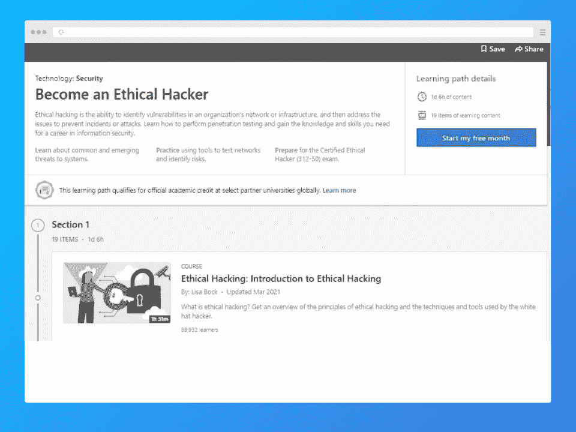
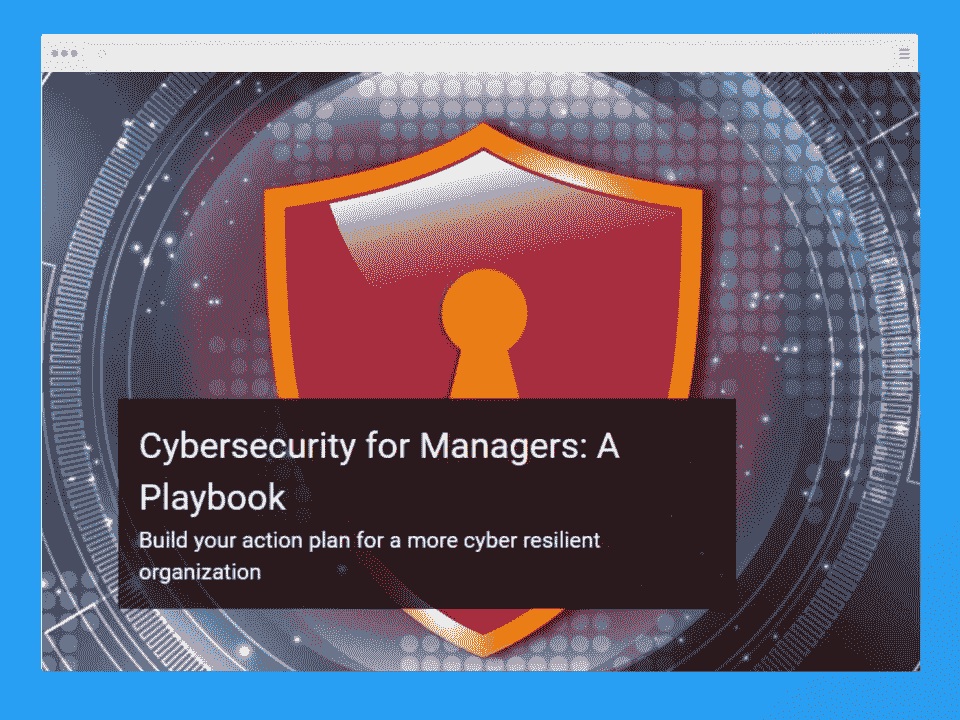
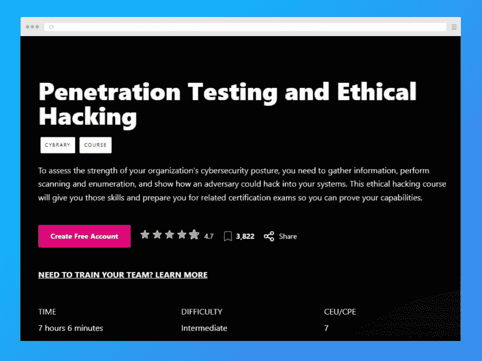
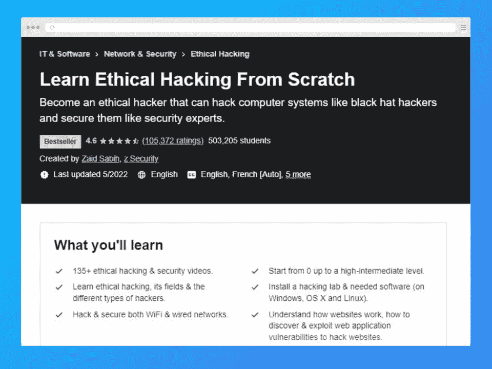
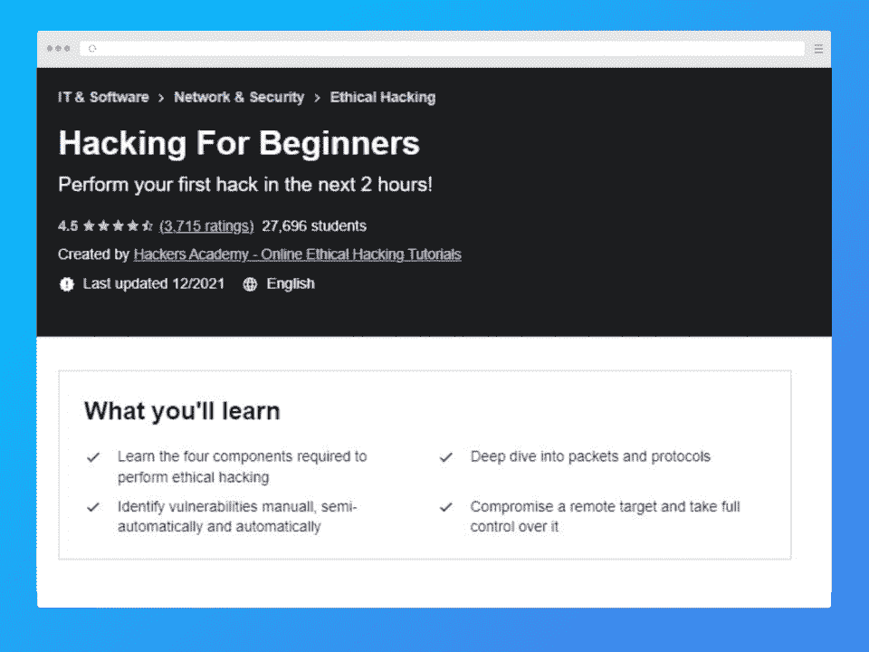
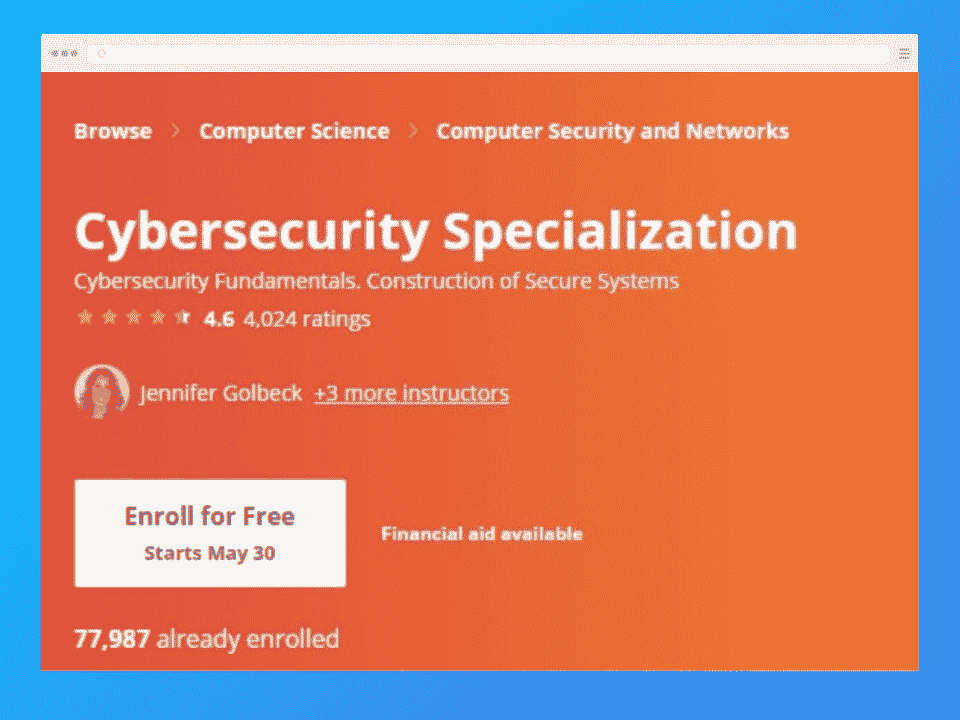
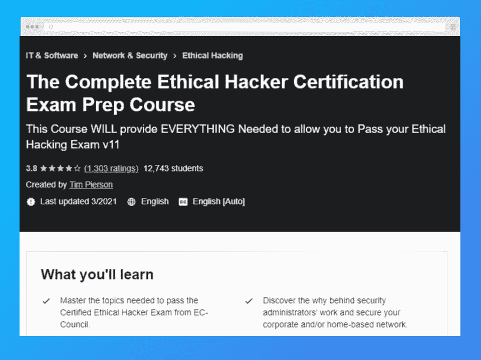
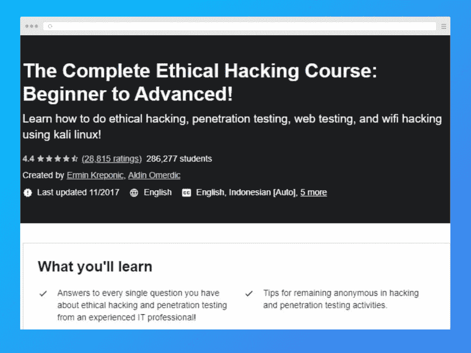
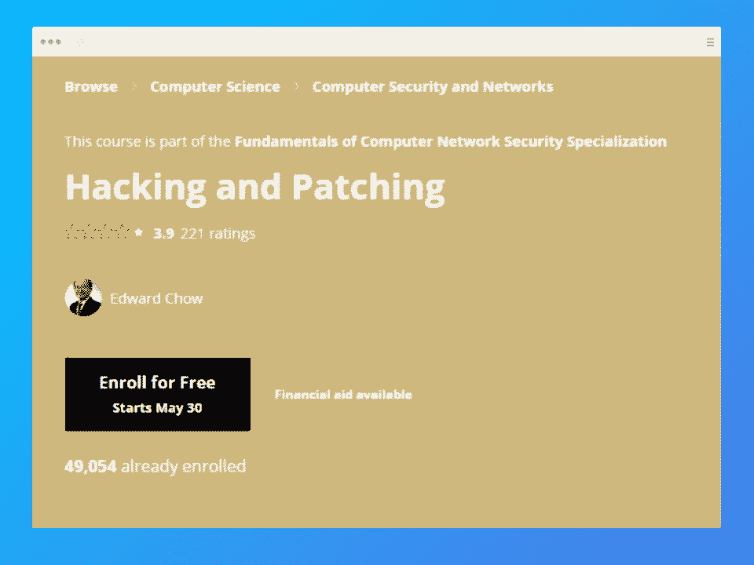

# 2023 年十大最佳道德黑客课程

> 原文：<https://hackr.io/blog/best-ethical-hacking-courses>

道德黑客似乎是一个矛盾的术语，但它不是真的。它也可以被描述为网络安全，差不多就是这样。随着我们一头扎进一个由计算机和互联网主宰的世界，这个领域正在快速发展。

在这里，我们涵盖了最好的道德黑客课程，供您在该领域开始。这些课程适合初学者，应该能为你的网络安全职业打下基础。

在我们开始详细描述这些课程之前，让我们先来看看最佳道德黑客课程的总结版。

## **最佳在线道德黑客课程**

## **2023 年一门伦理的黑客课程值得吗？**

道德黑客是一个发展非常迅速的职业，因为我们越来越依赖计算机和互联网。一份 2021 年网络安全报告显示，56%的组织将有针对性的网络钓鱼攻击视为当前最大的网络安全威胁。

许多这样的组织会很乐意花钱请一个有技能的专业人员来帮助他们提升他们的安全系统。2020 年，安全支出总额超过 1230 亿美元，预计未来几年还会增长。

## **2023 年十大道德黑客在线课程**

[****](https://linkedin-learning.pxf.io/YgN39J?subId3=blog%2Fbest-ethical-hack_amcid-UMqelABN7JUJiexO2zeAP)

| **课程信息** | **课程大纲** |
| **先决条件:**无**难度:**初级-高级**持续时间:** 26 小时**费用:**25 美元 | Kali Linux

*   列举
*   扫描网络
*   会话劫持
*   系统面临的常见威胁
*   风险辨认
*   对策实施
*   侦察和足迹
*   这个 LinkedIn 道德黑客课程既适合新手，也适合更有经验的专业人士。注册后，你将有机会在马尔科姆·肖尔、丽莎·布洛克、斯科特·辛普森和詹姆斯·威廉森等行业专家的帮助下提高黑客技能。

 |

如果您想获得识别公司基础设施和网络中漏洞的能力，那么这种专业化将被证明是一个理想的选择。此外，您还将了解解决问题和消除攻击和事故可能性的最佳方法。

**[在此报名](https://linkedin-learning.pxf.io/YgN39J?subId3=blog%2Fbest-ethical-hack_amcid-2IbJMB3VMA7QQZgM2rqxJ)**

[****](https://executive-ed.mit.edu/cybersecurity/index.php)

**课程信息**

| **课程大纲** | **先决条件:**无 |
| **难度:**中级-高级**持续时间:** 6 周，每周 5-6 小时费用:2800 美元 | 网络安全风险管理

*   隐私和安全补偿的实际影响
*   网络安全管理方法
*   构建稳健商业环境的决策
*   与首席技术官和 CISO 进行知情会谈的词汇和语言
*   麻省理工学院推出的这一网络安全课程是专门为决策者和高管开设的。它附带了一个简单的剧本，以便管理人员可以为业务运营的安全性创建一个高端网络安全框架。

 |

学生还可以获得特定的防御技术，帮助他们构建符合行业标准的高级网络安全框架。它有点贵，但它来自世界上最好的机构之一。

**[在此报名](https://executive-ed.mit.edu/cybersecurity/index.php)**

[****](https://www.cybrary.it/course/ethical-hacking/)

**课程信息**

| **课程大纲** | **先决条件:**无 |
| **难度:**中级**持续时间:** 7 小时**费用:** $39 包月情报收集 | 扫描和计数

*   攻击和剥削
*   漏洞识别和分析
*   报告
*   PenTest 规划
*   拒绝服务
*   嗅探流量
*   恶意软件识别和分析
*   扫描/枚举
*   剥削
*   侦察
*   会话劫持
*   利用后黑客攻击
*   这个道德黑客课程让你有机会从一个备受瞩目的道德黑客 Leo Dregier 那里学到东西。从介绍到高级主题，该认证包括大约 19 个模块。
*   您将了解一些基本的攻击机制和测试方法。本课程应该让你很好地理解如何进行测试以及如何加强安全性，从而为任何考试做好准备。

 |

**[在此报名](https://www.cybrary.it/course/ethical-hacking/)**

[****](https://www.awin1.com/cread.php?awinmid=6798&awinaffid=428263&ued=https%3A%2F%2Fwww.edx.org%2Fcourse%2Fcyber-security-basics-a-hands-on-approach)

**课程信息**

**课程大纲**

| **先决条件:**无 | **难度:**中级 |
| **持续时间:** 6 周，每周 5-7 小时**费用:**免费逆向工程网络安全格局 | 网络安全攻击——管理和监控

*   恶意软件和高级持续威胁
*   计算机取证
*   漏洞笔测试和管理
*   由卡洛斯三世大学的教授设计，如果你想在网络安全方面有一个强有力的立足点，这个网络安全学习计划是很好的。您将了解普遍的网络安全威胁以及应对这些威胁的最佳方法。
*   涵盖了与该主题相关的主要和基本问题，包括网络安全状况以及如何管理和监控攻击。网络取证和漏洞笔式测试和管理也是课程的重点。
*   **[在此报名](https://www.awin1.com/cread.php?awinmid=6798&awinaffid=428263&ued=https%3A%2F%2Fwww.edx.org%2Fcourse%2Fcyber-security-basics-a-hands-on-approach)**

 |

[****](https://click.linksynergy.com/deeplink?id=Qouy7GhEEFU&mid=39197&murl=https%3A%2F%2Fwww.udemy.com%2Fcourse%2Flearn-ethical-hacking-from-scratch%2F&u1=blog%2Fbest-ethical-hacking-courses_amcid-lZAg6s2qmFbx36UMo2erQ)

**课程信息**

**课程大纲**

**必备:**基础 IT 知识

| **难度:**初学者 | **持续时间:** 14.5 小时 |
| **费用:**45 美元网络渗透测试获得访问权限后期开发 | Web 应用渗透测试

*   Kali Linux 的安装和使用
*   Linux 基础知识
*   恶意软件分析
*   发现并修复 XSS 攻击
*   发现 ARP 和 MITM 欺骗漏洞
*   网络黑客和渗透测试
*   这个关于网络安全的综合性 Udemy 课程非常适合新手，因为它涵盖了渗透测试、访问和其他类似主题的基础知识。该课程实际关注这一主题，并让你深入了解与网络连接的设备之间的交互
*   您将学习的其他内容包括目标系统的弱点和利用它们进行黑客攻击的实用解决方案，以及如何建立一个测试实验室。
*   **[在此报名](https://click.linksynergy.com/deeplink?id=Qouy7GhEEFU&mid=39197&murl=https%3A%2F%2Fwww.udemy.com%2Fcourse%2Flearn-ethical-hacking-from-scratch%2F&u1=blog%2Fbest-ethical-hacking-courses_amcid-ZpozsqIseNAseUrBxopM2)**
*   [****](https://click.linksynergy.com/deeplink?id=Qouy7GhEEFU&mid=39197&murl=https%3A%2F%2Fwww.udemy.com%2Fcourse%2Fhacking-for-beginners%2F&u1=blog%2Fbest-ethical-hacking-courses_amcid-gNQIEllOm2rzVNFNmqzI6)

 |

**课程信息**

**课程大纲**

**必备:**基础 IT 知识

**难度:**初学者

| **持续时间:** 5 小时 | **费用:**45 美元 |
| IP 地址域名服务器(Domain Name Server)为黑客实践建立一个实验室端口扫描 | 了解黑客漏洞

*   利用目标的弱点
*   这个 Udemy 黑客课程很受新手欢迎。它教授绝对的基础知识，是这个列表中对初学者更友好的课程之一。
*   您将学习的内容包括 IP 地址、DNS、端口扫描和了解黑客漏洞。在两个小时内，你将得到你的动手尝试，虽然如果你想要更先进的技术，你将不得不寻找其他地方。
*   **[在此报名](https://click.linksynergy.com/deeplink?id=Qouy7GhEEFU&mid=39197&murl=https%3A%2F%2Fwww.udemy.com%2Fcourse%2Fhacking-for-beginners%2F&u1=blog%2Fbest-ethical-hacking-courses_amcid-sJml6gYlUbUosFFQEVopM)**
*   [****](https://coursera.pxf.io/gbeONO?subId3=blog%2Fbest-ethical-hack_amcid-FzI2AN22rU7qox7Ei7eqB)
*   **课程信息**

 |

**课程大纲**

**必备:**基础 IT 知识

**难度:**中级

**持续时间:** 8 个月，每周 2 小时

| **费用:**免费 | 软件测试 |
| 可用性密码系统网络安全渗透测试 | 用户界面

*   隐私
*   缓冲区溢出
*   模糊测试
*   数论
*   SQL 注入
*   公钥密码学
*   Coursera 网络安全专业涵盖了与构建安全系统和利用密码术的交互相关的几个关键方面。这包括软件、硬件和人机界面主题。
*   这门课程用大量的例子来说明概念。它侧重于实践经验，尤其是在处理相关技术和工具方面。理想情况下，该学习计划旨在帮助学生培养以安全为导向的理解和思维。
*   **[在此报名](https://coursera.pxf.io/gbeONO?subId3=blog%2Fbest-ethical-hack_amcid-xpMI2FENlspEoAgEQAUlP)**
*   [****](https://click.linksynergy.com/deeplink?id=Qouy7GhEEFU&mid=39197&murl=https%3A%2F%2Fwww.udemy.com%2Fcourse%2Fthe-complete-ceh-exam-prep-course-become-an-ethical-hacker%2F&u1=blog%2Fbest-ethical-hacking-courses_amcid-UpVYE2xFMUNBPpMmVQ6s2)
*   **课程信息**
*   **课程大纲**

 |

**必备:**基础 IT 知识；

服务台或系统管理工作；

入侵检测系统、防火墙和抗病毒软件的基本知识

**难度:**中级-高级

| **持续时间:** 16.5 小时 | **费用:**45 美元 |
| 渗透测试背后的技术和商业物流威胁识别互联网足迹密码学简介恶意软件防护停止 SQL 注入的对策实现 | 入侵检测系统和入侵防御系统

*   Web 应用防火墙
*   这个 Udemy 道德黑客课程提供了一个坚实的基础。它涵盖了掌握该主题和通过道德黑客认证考试所需的所有主题。
*   它提供了道德黑客的实践经验和网络防御的理论知识。主要议题包括安全漏洞、网络安全以及为各种全球网络开发定制的保护解决方案。
*   **[在此报名](https://click.linksynergy.com/deeplink?id=Qouy7GhEEFU&mid=39197&murl=https%3A%2F%2Fwww.udemy.com%2Fcourse%2Fthe-complete-ceh-exam-prep-course-become-an-ethical-hacker%2F&u1=blog%2Fbest-ethical-hacking-courses_amcid-QbO63BqFxmBY6YA2izixU)**
*   [****](https://click.linksynergy.com/deeplink?id=Qouy7GhEEFU&mid=39197&murl=https%3A%2F%2Fwww.udemy.com%2Fcourse%2Fpenetration-testing%2F&u1=blog%2Fbest-ethical-hacking-courses_amcid-IBJ6EMsErQ6UYAUVloFzQ)
*   **课程信息**
*   **课程大纲**
*   **先决条件:**初级-高级

 |

**难度:**初级-高级

**持续时间:** 24.5 小时

**费用:**45 美元

构建虚拟黑客环境

| 破解 Linux 密码 | Kali Linux 安装 |
| Linux 基础知识Tor、Nmap、VPN、代理链和 Macchanger破解 wifi 密码拒绝服务攻击 | SQL 注入

*   SLL 地带
*   道德黑客的 Udemy 专业通过实际任务教授学生渗透测试。您将从资深 IT 专家艾露敏·克雷波尼克那里了解核心主题。
*   该计划为保护网络免受数据丢失和攻击者的攻击提供了详细的见解。本专业有实践练习、点播视频、补充资源，让学习更轻松。
*   **[在此报名](https://click.linksynergy.com/deeplink?id=Qouy7GhEEFU&mid=39197&murl=https%3A%2F%2Fwww.udemy.com%2Fcourse%2Fpenetration-testing%2F&u1=blog%2Fbest-ethical-hacking-courses_amcid-eBsAFNpsQrEiNP76BxrPM)**
*   [****](https://coursera.pxf.io/XxvmZ4?subId3=blog%2Fbest-ethical-hack_amcid-MNVrYe6ZIJ6VUB3O3sVJ3)
*   **课程信息**
*   **课程大纲**
*   **必备:**网络系统安全基础知识
*   **难度:**中级

 |

**持续时间:** 17 小时

**费用:**免费

注入 Web 应用程序–攻击和防御

入侵 SQL 数据库

| 使用注入 SQL 漏洞修补 Web 应用程序 | 记忆防御和攻击 |
| 渗透测试科罗拉多大学的这个黑客和补丁课程非常适合学习使用命令注入攻击 web 应用程序。它还涵盖了内存防御、攻击和渗透测试。该课程将向您介绍安全设计模式，它可以帮助您防御注入漏洞。这是一门相当全面的课程，特别适合那些想要超越初学者概念的人。**[在此报名](https://coursera.pxf.io/XxvmZ4?subId3=blog%2Fbest-ethical-hack_amcid-FB2g7ZIqqU2ZzNAgrzAbE)** | **结论**

*   今天，几乎每一个高知名度的组织都会请来职业黑客来测试和分析他们网络的安全性。越来越多的公司开始投入大量资金来加强其软件和硬件系统的安全性。
*   道德黑客认证是充分利用这种日益增长的需求的理想方式。考虑一下这里列出的道德黑客课程，你可能会开始一个利润丰厚的职业生涯。
*   **常见问题解答**
*   **1。道德黑客学哪门课最好？**
*   没有单一的最佳黑客课程。很大程度上取决于你已经掌握了多少知识，你想学习的特定主题，以及课程的质量。在很大程度上，这里列出的所有课程都是开始学习道德黑客的好地方。

 |

**2。初学者可以学习道德黑客吗？**

是的，初学者可以学习道德黑客。这个列表上的很多课程对初学者来说都非常好，不需要太多的前提知识。最佳道德黑客课程将带你了解入门所需的一切。

**3。道德黑客合法吗？**

## 是的，道德黑客是合法的。虽然这个术语表面上可能有恶意的含义，但它实际上只是用来描述一组网络安全实践，以改善安全系统。可以把它想象成使用“黑客”技术和知识来提高安全性。

**人也在读:**

Certification in ethical hacking is an ideal way to make the most of this increasing demand**.** Consider one of the ethical hacking courses listed here, and you might be at the start of a lucrative career.

## **Frequently Asked Questions**

#### **1\. Which course is best for ethical hacking?**

There is no single best hacking course. A lot depends on how much knowledge you already have, the particular topics you would like to study, and the quality of the course. For the most part, all the courses listed here are good places to start learning ethical hacking.

#### **2\. Can a beginner learn ethical hacking?**

Yes, a beginner can learn ethical hacking. Many of the courses on this list are very good for beginners and don’t require much prerequisite knowledge. The best ethical hacker course will take you through everything you need to know to get started. 

#### **3\. Is ethical hacking legal?**

Yes, ethical hacking is legal. While the term might have malicious connotations on the face of it, it really is just used to describe a set of cyber security practices to improve security systems. Think of it as using “hacking” techniques and knowledge to improve security.

**People are also reading:**