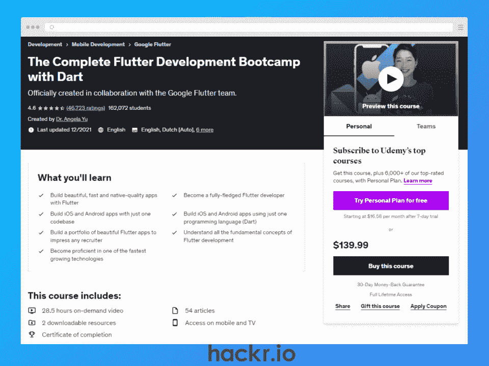
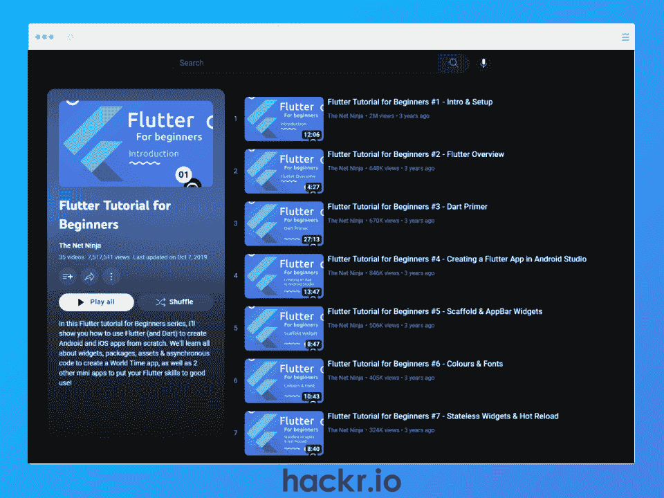
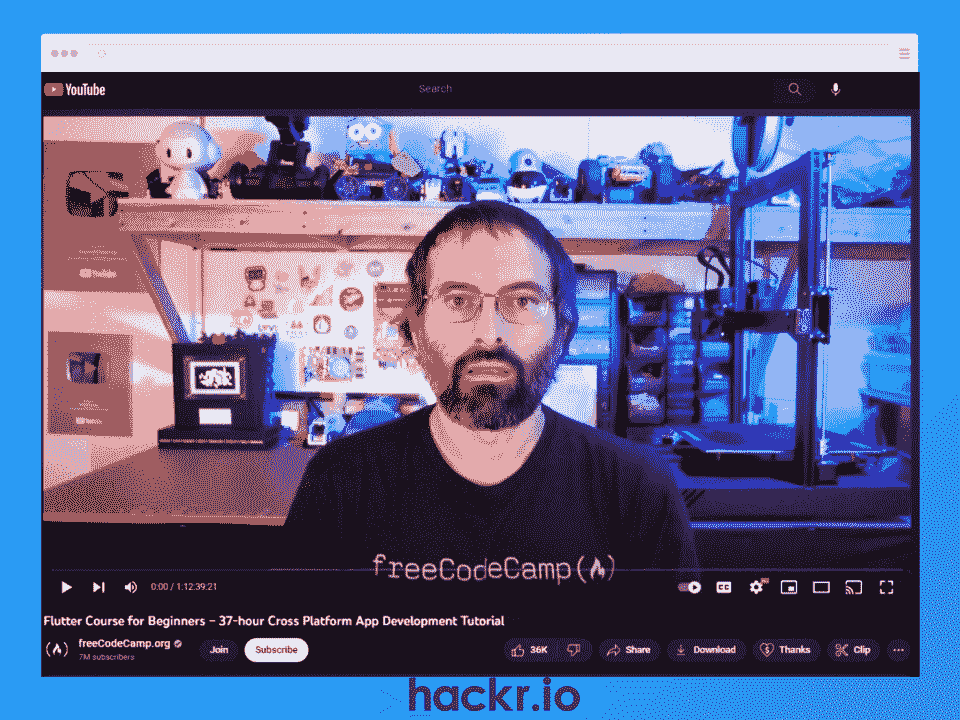
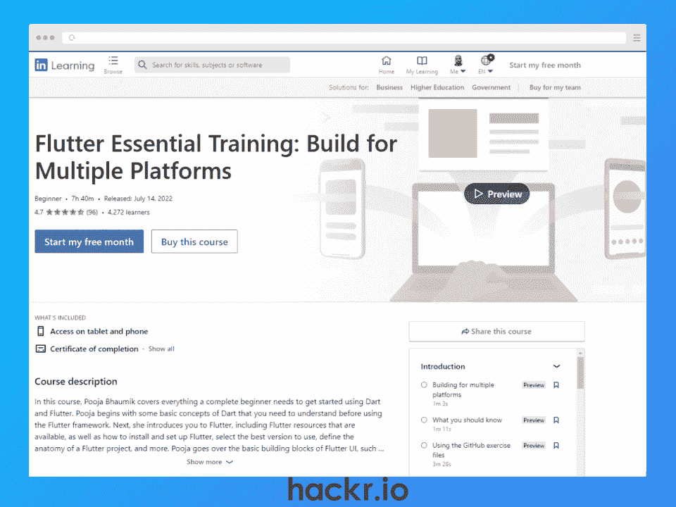
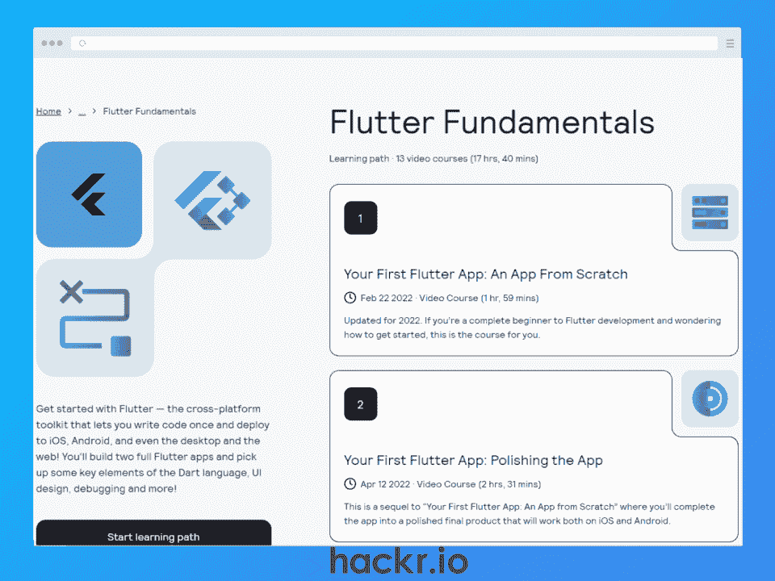
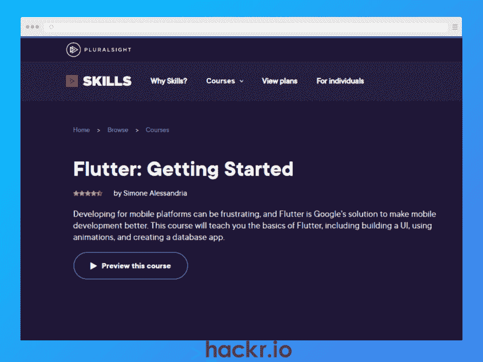
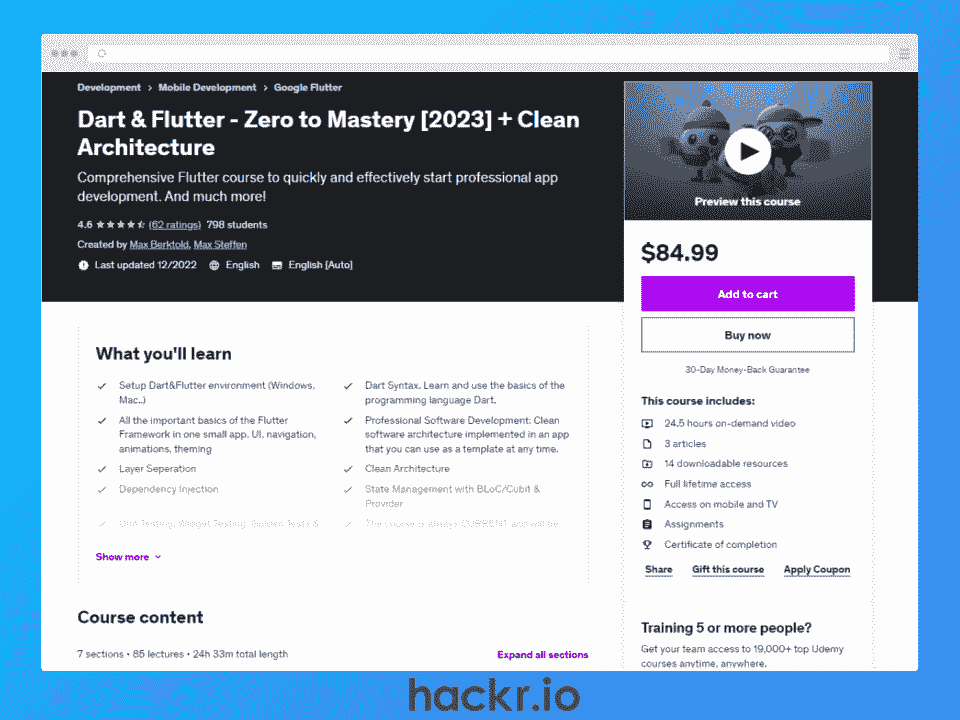
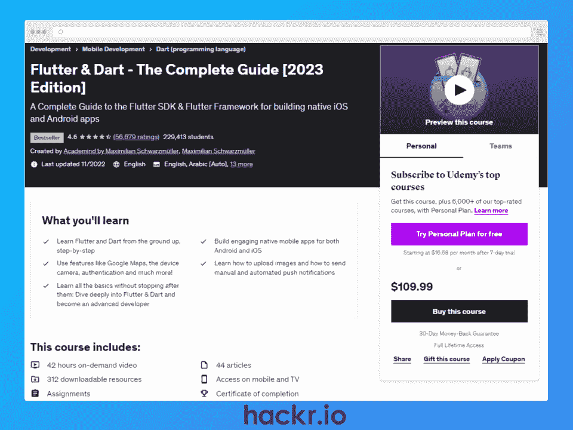
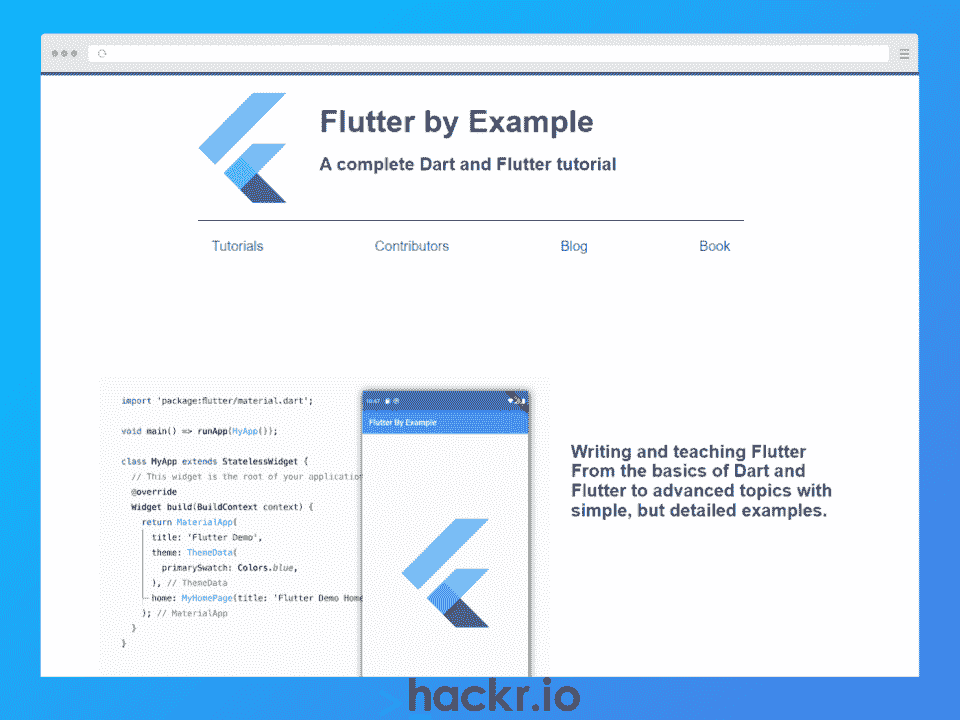
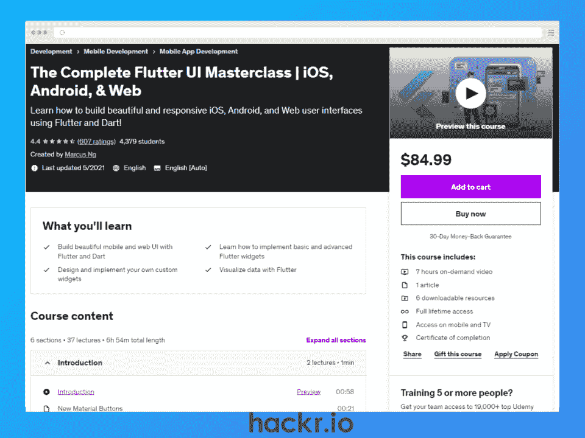

# 颤振在线课程

> 原文：<https://hackr.io/blog/best-flutter-courses>

Flutter 是 Google 的一个免费开源软件开发包(SDK ),用于构建跨平台的应用程序。Flutter 允许开发人员使用单个代码库为不同平台构建应用程序，无需为不同平台维护多个代码库。

但是到底什么是 Flutter，为什么它在开发者中越来越受欢迎？本文将回答这些问题，并涵盖 2023 年在线的 10 个最佳颤振课程。

**特色颤振课程【编辑推荐】**

## **什么是颤振？**

Flutter 于 2017 年 5 月由谷歌发布，最初是为[移动应用开发](https://hackr.io/blog/how-to-become-a-mobile-app-developer)设计的，以与 [React Native](https://hackr.io/blog/react-native-vs-flutter) 等成熟框架竞争。

2023 年，Flutter 可以用于 Android、iOS、macOS、Windows 和 Linux 的移动、web 和桌面应用程序开发。

许多开发人员更喜欢使用 Flutter 来构建他们的应用程序的用户界面(UI ),因为它速度快、性能好、高度可定制。但是你为什么要[学习 Flutter](https://hackr.io/blog/how-to-learn-flutter) ？让我们来看看一些关键特性。

*   **跨平台:**使用单一代码库在多个设备上部署应用程序，而本地应用程序开发需要针对移动、web 和桌面版本的不同代码库
*   **强大的 UI 引擎:**使用 Google 的开源图形库 Skia，为所有设备上的用户创建快速、可定制且一致的 UI
*   **开发者体验:**热重装预览更改，DevTools 允许监控和调试，Visual Studio 代码、Android Studios 和 IntelliJ 的扩展允许在没有终端的情况下运行命令
*   **热门&大型社区:**年度开发者活动，如 [Flutter Forward](https://flutter.dev/events/flutter-forward) 和 [Flutter Festival](https://www.flutterfestival.com/) **，**充满活力的社区，在 [Meetup](https://www.meetup.com/pro/flutter/) 上有+69K 成员，在 [Twitter 上有+215K 关注者](https://twitter.com/FlutterDev)

## **选择最佳颤振在线课程**

为了选择最佳颤振航向，我们采用了下列标准。

*   **创造者可信度:**他们在教授编程方面的经验如何？学生积极评价的比例是多少？
*   **内容:**课程有多全面？演示的风格有多吸引人？对于一个 Flutter 开发者来说，这些主题与现实世界的挑战相关吗？
*   **社区:**有多少人参加了该课程或目前正在注册？如果你卡住了，很容易联系到其他同学吗？

## **10 大最佳颤振在线课程**

**我们为什么选择本课程**

Angela Yu 和 Google Flutter 团队的合作，这个带认证的 Flutter 课程的结构就像一个现实生活中的编码训练营。

您将学习状态管理、小部件和部署应用程序等概念，并且您将构建一个 Flutter 应用程序组合，向招聘人员和潜在雇主展示。

**优点**

*   构建 iOs 和 Android 应用
*   学习飞镖语言
*   来自+160，000 名学生的平均评分为 4.6/5

**缺点**

*   对于真正的初学者来说，这可能是有经验的开发人员的一点基础

**关键信息**

*   **平台:** Udemy
*   **课程导师:**余安琪
*   **等级:**初学者
*   **持续时间:** 28.5 小时
*   价格: $84.99
*   **证书:**是
*   **注册学生:** +160K

[了解更多信息](https://click.linksynergy.com/deeplink?id=jU79Zysihs4&mid=39197&murl=https%3A%2F%2Fwww.udemy.com%2Fcourse%2Fflutter-bootcamp-with-dart%2F)

**我们为什么选择本课程**

这是网上最受欢迎的颤振课程之一，共有 35 个视频，观看次数超过 700 万次。

通过学习一系列重要的概念，如地图、路线、flutter 包和错误处理，您将能够使用您新获得的技能来构建一个世界时间应用程序，作为一个顶点项目。

**优点**

*   编程概念的全面概述
*   学习飞镖语言
*   GitHub 文件访问使跟踪和调试变得容易

**缺点**

**关键信息**

*   **平台:** YouTube
*   **课程讲师:**肖恩·佩林(网络忍者)
*   **等级:**初学者
*   **持续时间:** ~5 小时
*   **价格:**免费
*   **证书:**无
*   **视图:** 7.1M

[了解更多信息](https://www.youtube.com/playlist?list=PL4cUxeGkcC9jLYyp2Aoh6hcWuxFDX6PBJ)

**我们为什么选择本课程**

由 Vandad Nahavandipoor(谷歌开发专家)开发的这个免费的 Flutter 课程是针对绝对的初学者的。

这个 Flutter 培训教你用 Dart 语言建立一个开发者账户和编程基础。然后，您将学习使用 Visual Studio 代码，以及如何使用 Firebase 管理应用程序的后端。

**优点**

*   面向纯初学者的全面、循序渐进的信息
*   学习 Dart 语言和 VS 代码基础知识
*   涵盖错误处理和身份验证等高级主题

**缺点**

*   面向有经验的开发人员的大量介绍性内容

**关键信息**

*   **平台:** YouTube
*   **课程讲师:** Vandad Nahavandipoor
*   **等级:**初学者
*   **持续时间:** 37 小时
*   **价格:**免费
*   **证书:**无
*   **视图:** 1.3M

[了解更多信息](https://www.youtube.com/watch?v=VPvVD8t02U8)

**我们为什么选择本课程**

这是由谷歌开发专家 Pooja Bhaumik 创建的，是一个结构良好的交互式颤振课程。

在继续学习 Flutter 框架、Flutter UI 小部件、Flutter 中的交互性、同步/异步编程等等之前，您将从 Dart 编程的基础开始。

**优点**

*   综合互动课程
*   学习 Dart 语言和 Flutter 应用程序构建模块
*   定期更新和离线访问课程材料

**缺点**

*   需要 LinkedIn 学习订阅(每月 29.99 美元)

**关键信息**

*   **平台:**领英学习
*   **课程讲师:** Pooja Bhaumik
*   **等级:**初学者
*   **时长:** 7 小时 40 分钟
*   价格: $29.99(每月)
*   **证书:**是
*   **报名学生:** +4K

[了解更多信息](http://linkedin-learning.pxf.io/e4oxG1)

**我们为什么选择本课程**

这是一个手把手的 Flutter 教程，教你 Dart，Flutter，状态管理，调试的基础知识，以及如何使用 Flutter UI 小部件。这个面向初学者的 Flutter 课程还包括一个模块，引导您了解使用 Visual Studio 代码的最佳方式。

**优点**

*   学习 Dart 基础知识
*   专门用于调试技能的完整模块
*   为你的投资组合构建两个 Flutter 应用

**缺点**

*   没有结业证书

**关键信息**

*   **平台:** Kodeco
*   课程讲师:布莱恩·莫克利
*   **等级:**初学者
*   **时长:** 17 小时 40 分钟
*   价格: $19.99(每月)
*   **证书:**无

[了解更多信息](https://www.kodeco.com/flutter/paths/flutter-fundamentals)

**我们为什么选择本课程**

如果您正在寻找 Flutter SDK 的快速介绍，这是一个可靠的选择。在构建包含交互性和动画的 UI 之前，您首先要学习如何用 Flutter 构建一个基本的“Hello World”应用程序。

**优点**

*   少于 3 小时的短期课程
*   绝对初学者的理想选择

**缺点**

*   对于有经验的开发人员来说，这可能是一点入门知识

**关键信息**

*   **平台:** PluralSight
*   **课程讲师:** Simone Alessandria
*   **等级:**初学者
*   **时长:** 2 小时 45 分钟
*   价格: $19(每月)
*   **证书:**是

[了解更多信息](https://pluralsight.pxf.io/Jr3Ya2)

**我们为什么选择本课程**

最初是用德语录制的，是 Udemy 上评价最高的德语课程，创作者用英语重新录制了这个全面而又介绍性的课程。

这个 Flutter 课程包括设置你的 Flutter 环境、UI 小部件、路由、干净的架构、测试等主题。

**优点**

*   学习清洁建筑
*   定期更新的内容
*   有英语和德语版本

**缺点**

*   很好的介绍，但没有深入到颤振

**关键信息**

*   **平台:** Udemy
*   课程讲师:马克斯·伯克托尔，马克斯·斯特芬
*   **等级:**初学者
*   **持续时间:** 24.5 小时
*   价格: $84.99
*   **证书:**是
*   注册学生: 590 人

[了解更多信息](https://click.linksynergy.com/deeplink?id=jU79Zysihs4&mid=39197&murl=https%3A%2F%2Fwww.udemy.com%2Fcourse%2Fflutter-made-easy-zero-to-mastery%2F)

**我们为什么选择本课程**

这是一个完整的颤振软件开发工具包(SDK)指南。讲师提供 Dart 和 Flutter 的深入教学，包括 HTTP 请求、用户验证、创建推送通知等课程。您还将学习将您的应用程序发布到 Apple App Store 和 Google Play。

**优点**

*   综合课程、可下载资源和作业
*   现实世界的项目；餐饮应用、购物应用和旅行应用
*   +226K 学生的平均评分为 4.6/5

**缺点**

*   基础编程知识是先决条件

**关键信息**

*   **平台:** Udemy
*   **课程讲师:**马克西米利安·施瓦兹米勒
*   **等级:**中级
*   **持续时间:** 42 小时
*   价格: $84.99
*   **证书:**是
*   **注册学生:** +226K

[了解更多信息](https://click.linksynergy.com/deeplink?id=jU79Zysihs4&mid=39197&murl=https%3A%2F%2Fwww.udemy.com%2Fcourse%2Flearn-flutter-dart-to-build-ios-android-apps%2F)

**我们为什么选择本课程**

作为最好的颤振教程之一，这个结构良好，基于文本的课程分为两部分。

第一部分重点介绍 Dart 编程语言，包括如何安装和使用 Dart，然后学习如何使用 Dart 进行面向对象编程(OOP)。

第二部分通过构建一个购物车应用程序来教你如何使用 Flutter。涵盖的主题包括状态管理、自定义动画和砖数据处理。

**优点**

*   结构化和详细的课程
*   学习 Dart 编程基础和 OOP
*   使用 Flutter 应用程序的应用学习示例

**缺点**

*   本课程最后一次更新是在 2020 年

**关键信息**

*   **平台:**颤振举例
*   **课程导师:**埃里克风车
*   **等级:**中级
*   **价格:**免费
*   **证书:**无

[了解更多信息](https://flutterbyexample.com/)

**我们为什么选择本课程**

Marcus Ng 的这个简短的 Flutter 课程是为当前的 Flutter 开发人员设计的，这些开发人员希望提高他们的 web 和移动应用程序 UI 设计技能。您将学习如何在您的应用程序中使用 Flutter 小部件，以及如何设计和创建您自己的自定义小部件。

**优点**

*   提高您的网络和移动用户界面技能
*   为送餐、预算和社交媒体构建应用程序

**缺点**

*   了解部件选择所需的知识

**关键信息**

*   **平台:** Udemy
*   **课程讲师:**吴建豪
*   **等级:**高级
*   **持续时间:** ~7 小时
*   价格: $84.99
*   **证书:**是
*   **报名学生:** +4.3K

[了解更多信息](https://click.linksynergy.com/deeplink?id=jU79Zysihs4&mid=39197&murl=https%3A%2F%2Fwww.udemy.com%2Fcourse%2Fthe-complete-flutter-ui-masterclass%2F)

## **结论**

由 Google 开发的 Flutter 是一个免费的开源 SDK，它越来越受到开发人员的欢迎，因为它可以用单一代码库构建高性能、跨平台的应用程序。

借助谷歌开源图形库 Skia 的额外优势，Flutter 开发人员可以在所有设备上创建快速、可定制、一致的 ui 和 UX(用户体验)。

这篇文章列出了 2023 年在线提供的 10 个最佳颤振课程。这包括所有技能水平的课程，从完全没有编程经验的初学者到想要提高现有技能的高级开发人员。

因此，如果你想在 2023 年学习 Flutter，我们已经为你准备好了。

## **常见问题解答**

#### **1。哪个颤振课程最好？**

这取决于你目前的经验水平、职业目标和喜欢的学习方式。如果你是一个完全的初学者，考虑一下 Angela Yu 的完整的颤振开发训练营。否则，更高级的开发者可能会选择[Flutter and Dart——完全指南。](https://click.linksynergy.com/deeplink?id=jU79Zysihs4&mid=39197&murl=https%3A%2F%2Fwww.udemy.com%2Fcourse%2Flearn-flutter-dart-to-build-ios-android-apps%2F)

#### **2。什么是颤振课程？**

Flutter 课程是一种资源，它提供课程来教你如何用 Flutter 构建应用程序。课程可能是视频、文本或两者的结合。

#### **3。Flutter 难学吗？**

Flutter 是一个初学者友好的框架，Google 在提供优秀的文档方面做得很好。如果你是 Flutter 新手，可以试试我们在这篇文章中列出的初学者课程。

#### **4。颤振有需求吗？**

由于支持使用单一代码库在不同平台上构建和部署应用程序，对 Flutter 开发人员的需求正在增加。根据开发者生态系统调查的 [JetBrains state，Flutter 是最受欢迎的跨平台框架。](https://www.jetbrains.com/lp/devecosystem-2021/miscellaneous/#Which%20cross-platform%20mobile%20frameworks%20do%20you%20use)