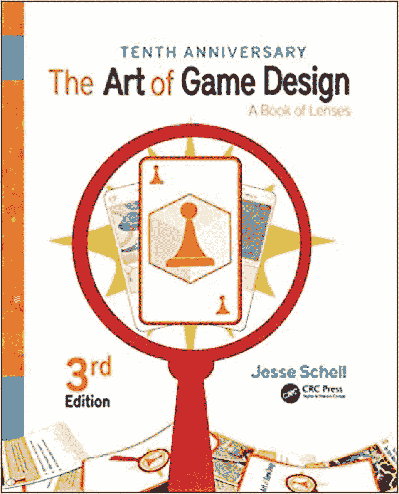
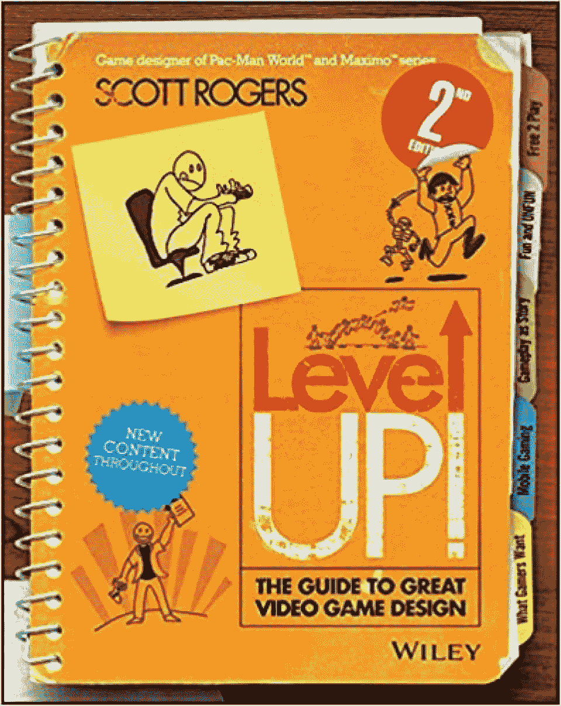
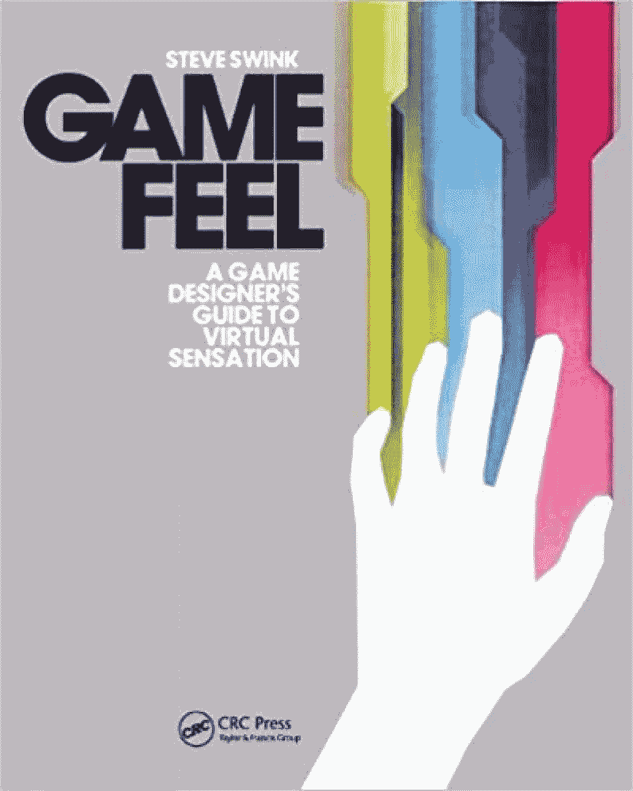
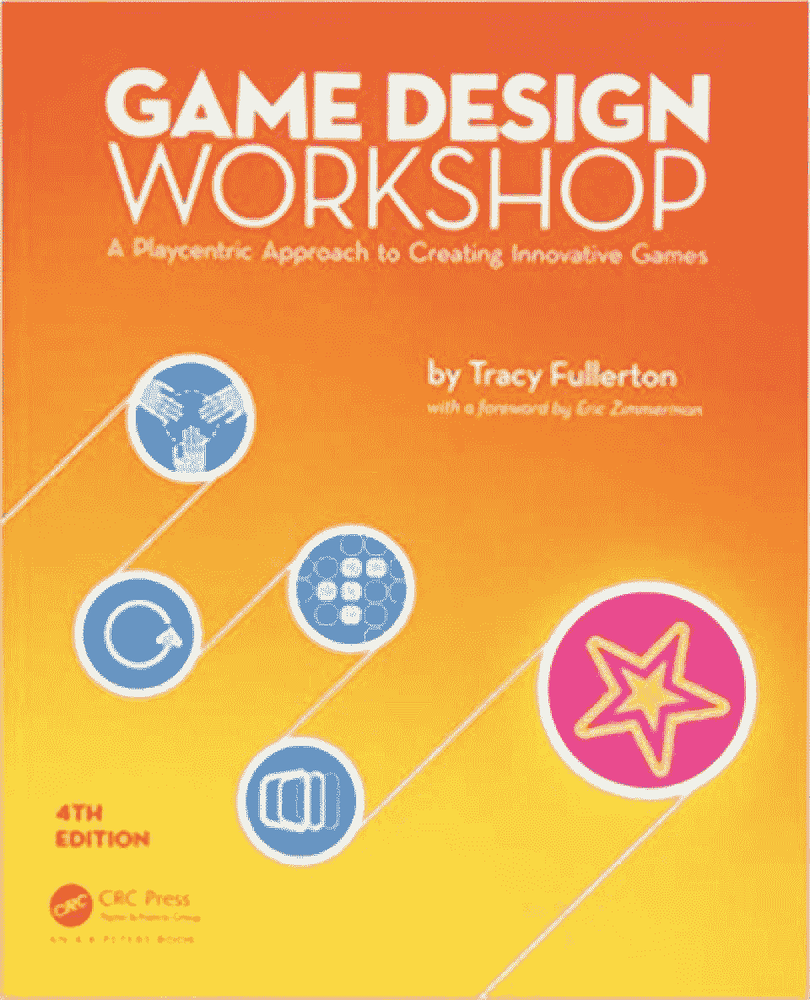
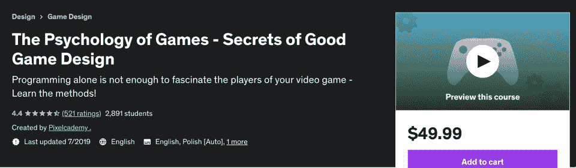
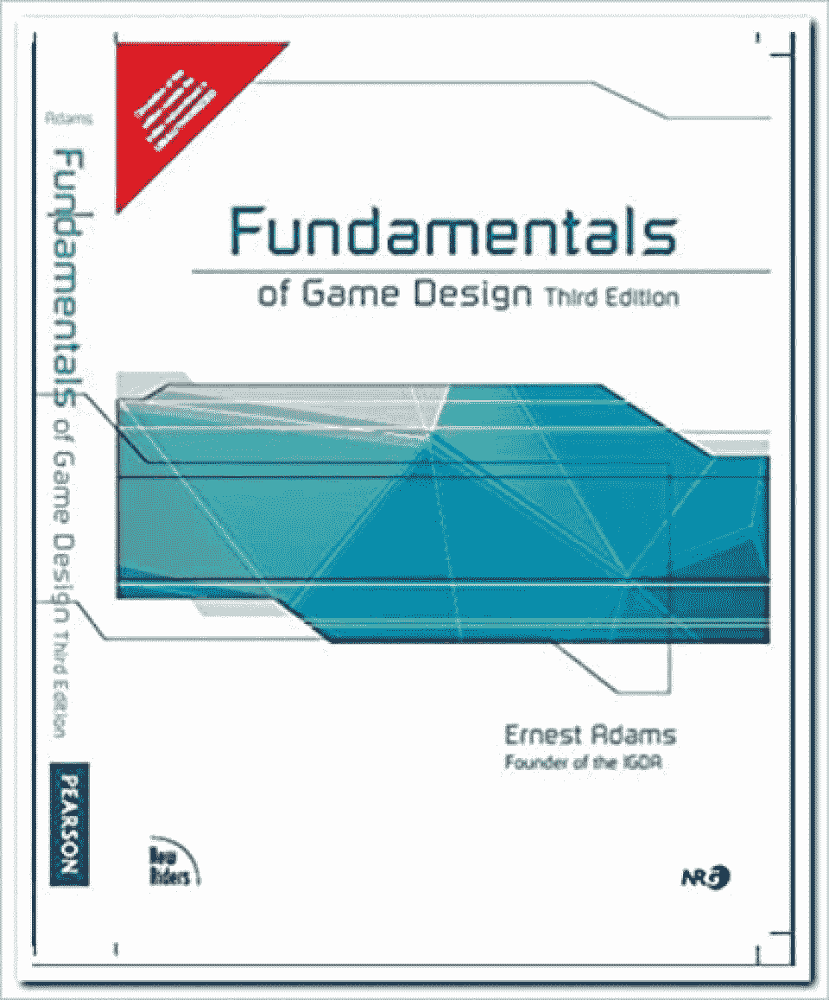
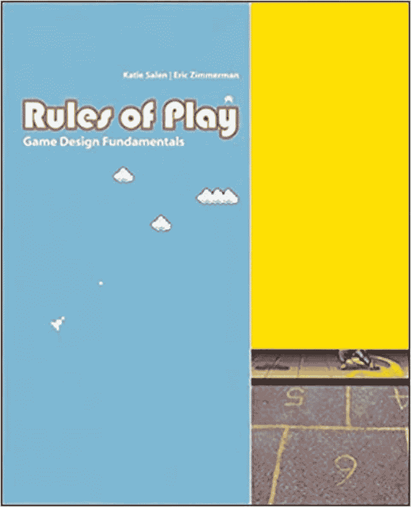
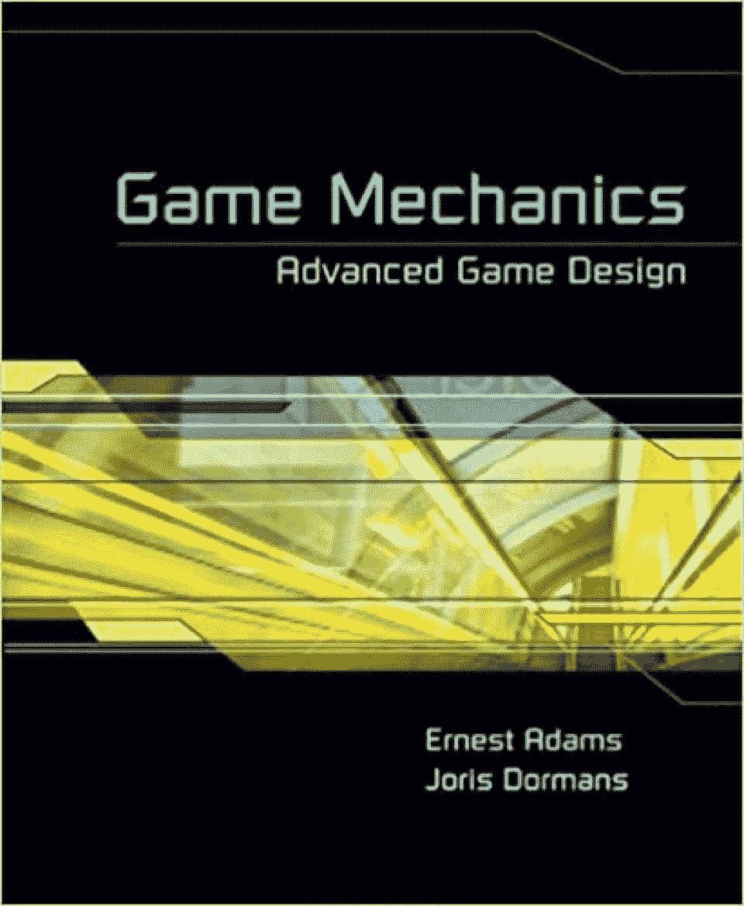
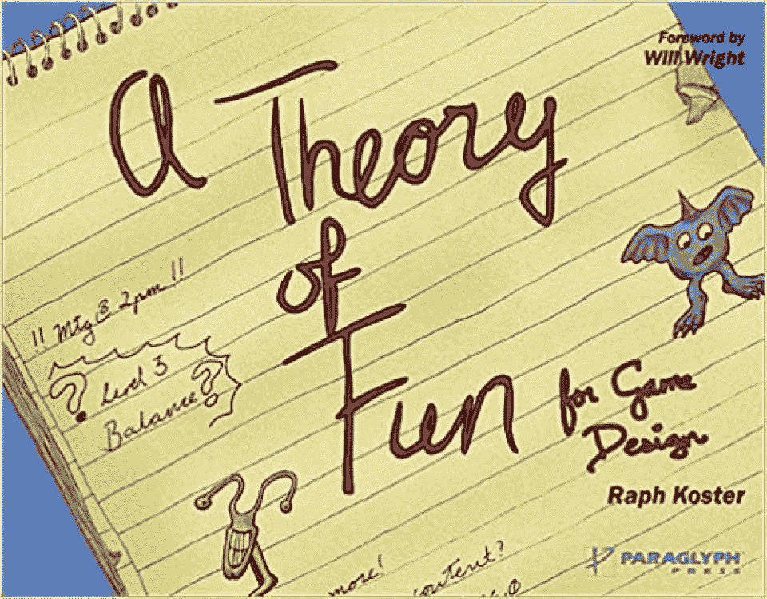
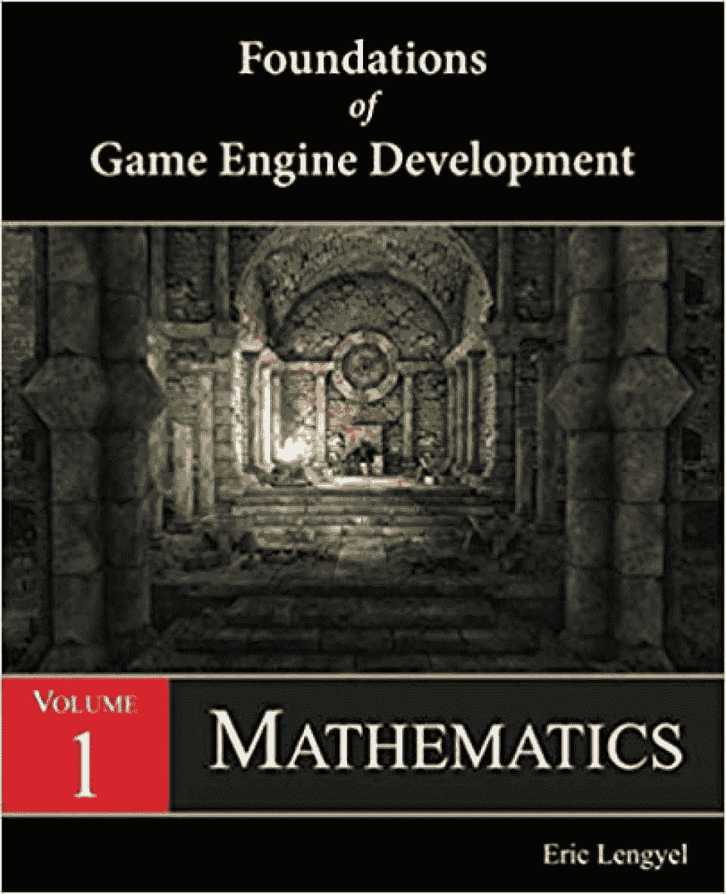

# 2023 年最值得阅读的 10 本电子游戏设计书籍[更新]

> 原文：<https://hackr.io/blog/best-game-design-books>

## **简介**

今天，游戏已经成为一种正当的职业并产生巨大的利润，而不仅仅是为了娱乐和消遣。

通过这篇文章，我们将了解将开启你的游戏生涯并帮助你成为专业游戏设计师的书籍。如果你想尝试编写游戏代码，请阅读我们关于如何编写游戏代码的文章。

## **为什么需要游戏设计书籍？**

有些游戏玩起来很有趣；然后是那些真正创造性地挑战你，娱乐性和知识性的，还有一些不是那么好的。是什么让有些游戏太好而有些只是一般？

构建一个好的游戏需要很多努力——图形、感觉、艺术、美学、概念等等。许多玩游戏的人开始好奇这些游戏是如何开发的，以及从头开始构建一个全新的游戏需要什么。这导致了游戏设计在 21 世纪初成为一门学科。

这些书中有许多是学术书籍，被大学和学院用作教科书和参考资料。无论你是在职业生涯的开始还是中期，以下 10 本游戏设计书籍都将帮助你丰富知识，构建富有创意和魅力的游戏。

这些书涵盖了基本的概念，并讲述了为什么一些游戏比其他游戏更受欢迎的区别，以及什么构成了一个引人入胜的游戏:玩，提示，技巧和策略，以建立一个用户喜欢玩的游戏。

## **十大游戏设计书籍**

我们根据初级、中级和高级水平来安排书籍。

### **入门书籍**

评分:4.8/5
等级:初级

这是学习游戏设计基础的最佳书籍之一。作者给出了不同的游戏设计视角来理解棋盘游戏、纸牌游戏、竞技游戏、视频游戏等背后的策略。这本书遵循实用的方法，你可以边读边工作。

**特性:**

*   这本书很好地平衡了游戏设计的理论和实践。
*   其方法组织良好，涵盖了游戏设计的各个方面，而不仅仅是纯粹的学术材料。
*   整本书中有很多头脑风暴的技巧。
*   一步一步的方法帮助你观察游戏中的错误，让你迭代和即兴发挥。
*   难度和挑战水平不断上升，通过每一个章节，你会彻底享受它。

你可以在这里买到这本书。

等级:4.7/5
等级:初级到中级

一本循序渐进、面向过程的书帮助读者熟悉游戏设计概念，并开始构建他们自己的游戏，这对用户来说具有挑战性和吸引力。这本书有助于选择你的类型和理解核心的游戏设计元素，如目标，规则，动作，游戏空间，球员和对象。您还将学习如何使用原型进行游戏测试设计。

**特性:**

*   这本书帮助你像专业设计师一样思考，理解游戏设计的实用元素。
*   如果你是一个初学者，游戏、设计和玩将是你游戏生涯的一个良好开端。如果你有一些经验，这本书将大大增强你的知识，并提供一个新的视角和其他方面，如目标，挑战，战略，机会，决定，讲故事等。
*   结构良好的书，其中第一部分侧重于核心概念，第二部分解释了过程和设计价值，第三部分致力于实践，并帮助你集思广益，原型，游戏测试和评估你的游戏。
*   它还涵盖了游戏设计的最佳实践和遵循的原则。

你可以在这里买到这本书。

评分:4.6/5
等级:初级

如果你不仅喜欢玩游戏，而且了解如何创建游戏，这可能是你的第一本书。这本书对年轻人和成年人都很棒。它可以是随意的阅读——比如游戏世界的介绍，或者关于基本游戏设计概念、设计文档和实践技巧的良好入门学习。

**特性:**

*   这是一本浅显的入门读物，可以唤醒你的好奇心，提高你对游戏及其背后的科学的兴趣。
*   对初学者非常有用，在某些情况下对中级游戏设计者也很有用，因为它包含了许多实用的技巧和常见问题的解决方案。
*   伟大的插图与作者的个人故事和幽默，增加了书中的乐趣。
*   对于那些想在游戏中加入艺术元素如关卡设计、形式等的人来说，这是一本非常需要的书。

你可以在这里买到这本书。

等级:4.5/5
等级:初级到中级

正如书名所示，这本书向你介绍了给游戏设计增加感觉的概念。这本书是为希望在游戏中加入正确的感觉和参与的初级到中级游戏设计者而写的。一款游戏的成功取决于它的感觉以及它如何与玩家建立联系，这本书对此进行了详细的解释。

**特性:**

*   对声音、隐喻、感知和感觉的作用进行了非常详细和透彻的解释。
*   读者还可以使用现成的工具来摆弄调色板，更改设置，并通过网站了解更多信息。
*   如果你以前从未开发过游戏，这将是更好地理解游戏设计的一个很好的开始。
*   作者不填鸭式地喂你；他提供了大量的信息，并留下了一些开放性的问题供你思考。

你可以在这里买到这本书。

 评分:4.5/5
等级:初级到中级

作为初学者，这是一本你必须放在书架上的书。它涵盖了所有关于游戏理论，原型，概念化，测试，调整，迭代，并使你的游戏完美。这是一个成功的尝试，创造了一本书，不太技术性，但提供了新手编写自己的游戏所需的每个细节。这本书给了一个坚实的基础，并作为职业游戏生涯的垫脚石。

**特性:**

*   一步一步的方法，从业界顶级游戏设计师的见解和技巧。
*   没有赘言，作者非常干脆，但详细的解释。
*   第一部分涵盖了游戏设计的基本概念和元素，在第二部分，你将实际设计一个游戏。第三部分讲述了你将如何成为一名职业游戏设计师。
*   专注于以游戏为中心的设计和迭代过程，涵盖了专业游戏设计的最新技术、观点和想法。

你可以在这里买到这本书。

推荐课程

### 

 评分:4.5/5
等级:中级

这本书是同一作者的游戏力学书的入门书。如果你打算把游戏设计作为你的职业，这是一个伟大的文本和参考。它讨论了一切，从游戏开发概念，介绍游戏机制，界面，平衡，运动捕捉游戏，等等。

**特性:**

这本书不太专业，但详细涵盖了所有基本概念。

*   写作风格非常吸引人，结构严谨
*   作者遵循一种非常科学的方法来描述问题和解决问题，而不啰嗦。
*   这本书指导你一步一步地从选择一个流派，富有表现力的游戏，角色发展，讲故事，用户体验，游戏机制和关卡设计原则。
*   作者还介绍了一些在线游戏的常见设计问题。
*   你可以在这里买到这本书。

 评分:4.4/5
等级:中级到高级

一个同类的书，游戏规则，是第一本书，试图为游戏设计建立一个适当的框架，这是缺失的。它为所有游戏类型提供了一个统一的模型，对于游戏设计者、开发者和专业人士来说是一本很好的教科书或参考指南。它内容详尽，方法明确而有意义。

**特性:**

作者涵盖了游戏设计、框架和设计原则的深入知识，并讨论了许多技术、设计问题和游戏设计的其他方面。

*   结构良好的书，有很多见解和鼓舞人心的内容，特别是关于游戏的期望，游戏文化和策略。
*   紧张和技术，有时干巴巴的阅读，适合那些正在寻找专业的游戏设计，并完全了解游戏。
*   读完这本书后，你将能够创建游戏，并用大量的交互元素来创建它们，将用户群、审美、文化、词汇和情商牢记在心。
*   你可以在这里买到这本书。

 评分:4.2/5
等级:中级到高级

游戏机制是一本关于如何创建复杂游戏的机制，以及如何使用新颖的原型技术来开发和模拟游戏的详尽书籍。这是一本纯粹的技术书籍，涵盖了许多概念和例子，以建立一个强大的基础，并帮助您建立游戏，无论你选择什么类型。

**特性:**

对于专业人士和那些有一些游戏理论和设计经验的人来说，这是一本好书。

*   非常详细，深入涵盖每个概念，需要大量的时间和精力来理解和处理每个概念。
*   这是唯一一本详细介绍游戏机制的书。(包括机制和设计模式)并解释为什么拥有好的机制是重要的。
*   这本书是很好的学术读物，也是指南和参考。
*   这本书从基本定义开始，所以你可以跳过这些页面，但这本书的真正力量始于第 5 章，阴谋诡计。
*   你可以在这里买到这本书。

 等级:4.1/5
等级:中级

这本书有许多插图和例子，作者的风格幽默风趣。他在标题中提到的“乐趣”是恰当的，因为你将探索乐趣的不同定义——解决问题、学习和理解不同的游戏设计视角。虽然这是一本很短的书，但作者涵盖了许多不寻常的事实和项目。

**特性:**

这本书不会涵盖基本的基本概念，但它有助于建立一个游戏设计生涯。

*   非常吸引人的书，作者关注的是如何让你的游戏对更多的观众有吸引力、有趣和挑战性。
*   没有长篇大论，没有长篇大论，所有的东西都是以个人经历写成的，因此非常有关联，而且图画增加了阅读的重量。
*   如果你正在寻找一本关于概念的详细的书，这本书是不够的；它是你购买的任何其他学术书籍的必备补充。
*   非常好的类比来解释大脑如何工作，以及不同的人在各种情况下如何反应。
*   你可以在这里买到这本书。

**高级水平书籍**

##  评分:4.8/5
等级:高级

这是游戏引擎开发系列的第一本书，涵盖了游戏设计所需的数学知识。这本书从代数、几何和变换等基本概念开始，然后彻底解释了更高级的概念，如向量、矩阵、高等代数、射影几何等。这本书很有趣，从非常基础的概念提高到非常高级的概念。

**特性:**

代码示例是用 C++编写的，但是不管你懂不懂 C++，你都能理解它们。

*   数学概念是从游戏的角度涵盖的，不包含常规的例子——虽然学习是特定于游戏开发的。
*   作者遵循一种非常简单，易于理解的语言和一种组织良好的学习方法。
*   每章末尾都有大量的练习题。
*   在开始阅读本书之前，您应该熟悉微积分、三角学以及浮点数的处理。
*   [第二卷:渲染](https://www.amazon.com/Foundations-Game-Engine-Development-Rendering/dp/0985811757/)是一本同样令人惊叹的书，涵盖了现代游戏引擎中的实时渲染。
*   你可以在这里买到这本书。

**结论**

## 如果你不知道从哪里开始，从 LevelUp 或者游戏设计工作坊开始；这两本书对初学者来说都很棒。游戏、设计和玩耍是很好的书籍，可以加深你的知识，进入游戏设计的下一个层次。像《游戏规则》和《游戏力学》这样的高级书籍将帮助你更深入地钻研游戏设计，塑造你作为专业游戏设计师的职业生涯。试试 Hackr.io 整理的这些[课程，补充自己的学习。让我们知道你今天想玩哪本书！](https://hackr.io/tutorials/learn-game-design)

喜欢与该领域的专家一起开始基于视频的课程吗？《模拟城市》、《模拟人生》和《孢子》的传奇设计师威尔·莱特在大师班教授一门游戏理论课。除此之外，我们还在 Udemy 上找到了这个 85 小时的初学者到专家的[游戏设计与编码课程](https://click.linksynergy.com/deeplink?id=jU79Zysihs4&mid=39197&murl=https%3A%2F%2Fwww.udemy.com%2Fcourse%2Fbecome-a-game-designer%2F)。

**人也在读:**

**People are also reading:**