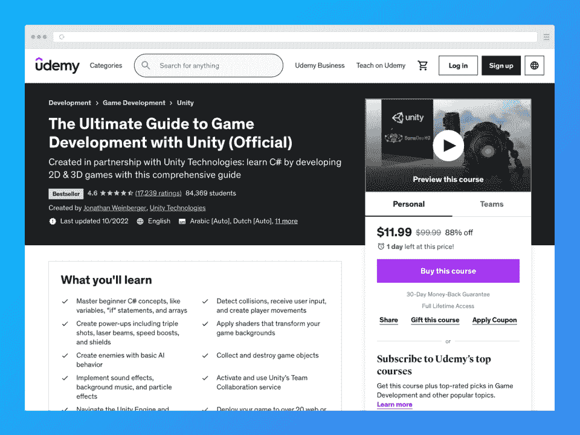
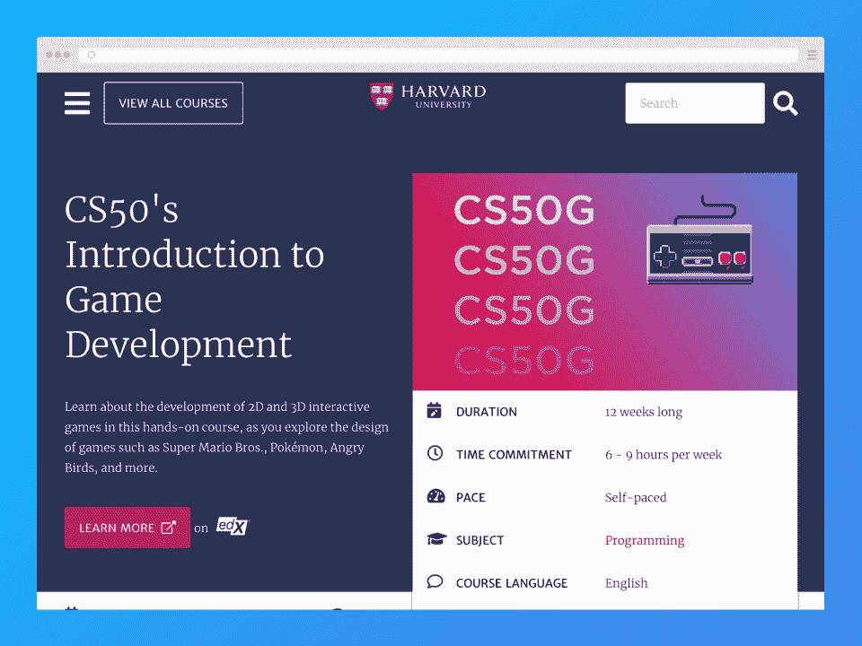
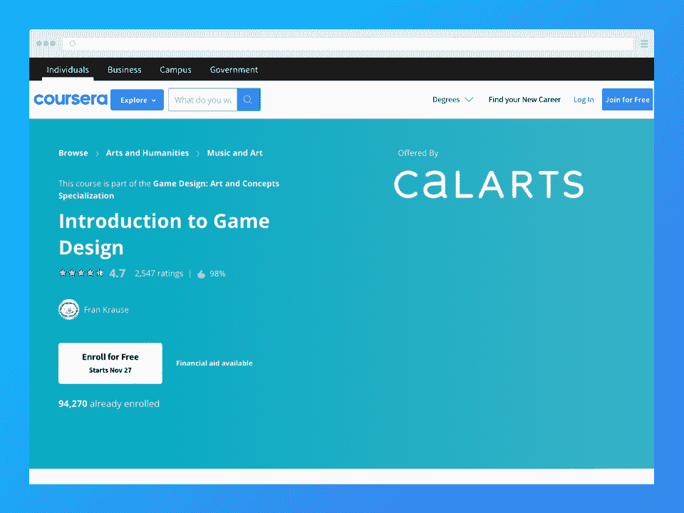
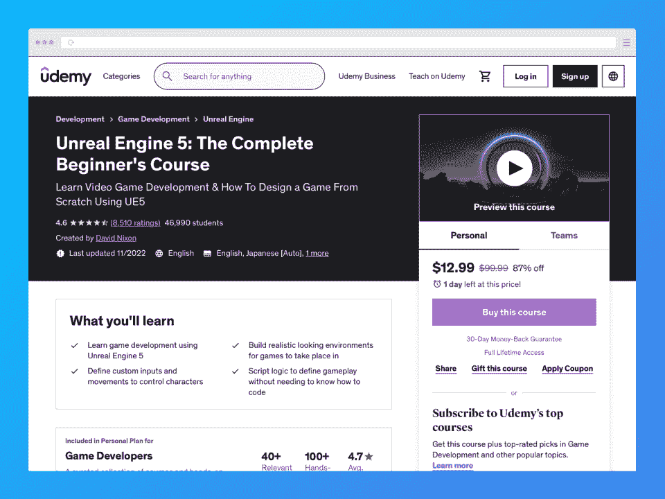
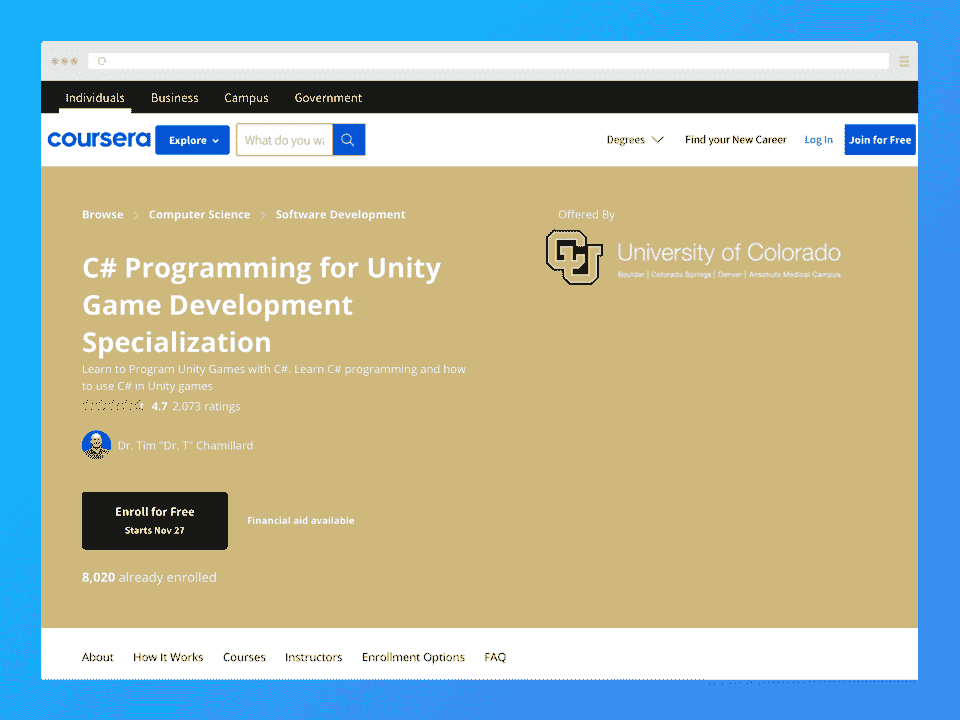
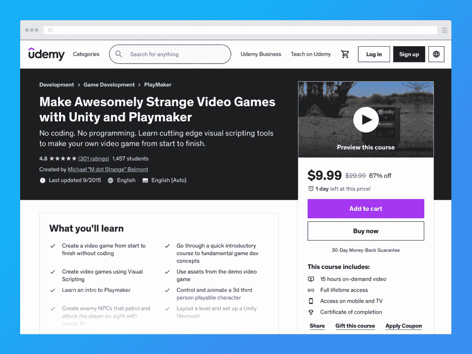
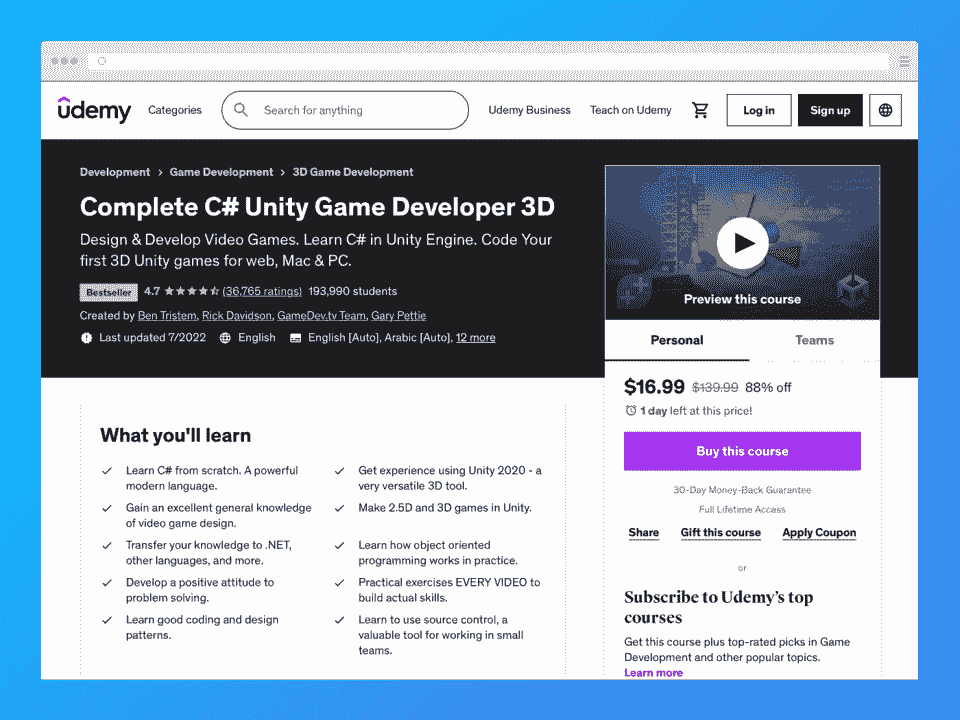
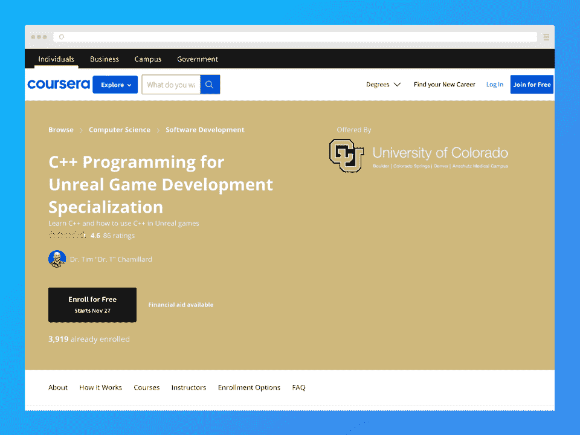

# 2023 年 8 门最佳游戏设计课程上线

> 原文：<https://hackr.io/blog/best-game-design-courses>

电子游戏太棒了。随着时间的推移，越来越多令人难忘的游戏出现，越来越多的人渴望成为游戏设计师和开发者是可以理解的。如果你想创作视频游戏，参加游戏设计课程可以帮助你找到你的起点。

这篇文章列出了八个最好的在线游戏设计课程。我们也谈论游戏设计和你为什么想要学习它。准备好了吗？让我们开始吧！

## **什么是游戏设计？**

游戏设计涉及到与创建视频游戏相关的一切，包括后来的发布。这是一个跨学科的领域，从其他行业如计算机科学，创意写作，编程，平面设计，艺术，心理学，音频设计，等等。

游戏设计师通常负责构思视频游戏，然后将它们融入生活的每一步。他们可以是从事独立项目的独立开发者，比如星谷的 ConcernedApe。他们也可以是团队或游戏开发工作室的一部分，如 Rockstar、暴雪、Bethesda 等。

作为一名游戏设计师和开发者，你的职责可能包括:

*   人物、谜题和关卡设计
*   游戏艺术和动画
*   项目管理
*   使用各种编程语言编码
*   使用虚幻引擎 5 或 Unity 等游戏引擎

## **为什么要学游戏设计？**

如果你一直有一个游戏的想法在你的脑海里游来游去，那么这是学习游戏设计的最佳时机。游戏设计师课程可以帮助你最终开始从事你一直想创建的激情项目。你可以开始制作独立游戏，或者最终建立一个足够好的作品集，在你梦想的游戏工作室工作。

为大型游戏工作室工作意味着从底层做起——通常是作为一名 QA 测试员。然后，随着你的发展，你可能会成为一名优秀的游戏开发者。或者，你可以从事游戏开发中更有创造性的方面(如果你喜欢的话)。

请注意，学习游戏设计可能需要你有一些其他领域的背景，可能是创意或技术。如果你没有这样的背景，那就没什么好担心的。即使你没有学位，你也可以学习设计游戏(通过自学、视频游戏设计师课程、传统教育等等)。

## **最佳游戏设计课程比较**

[****](https://click.linksynergy.com/deeplink?id=jU79Zysihs4&mid=39197&murl=https%3A%2F%2Fwww.udemy.com%2Fcourse%2Fthe-ultimate-guide-to-game-development-with-unity%2F)

**关键信息**

*   **讲师**:乔纳森·温伯格和 Unity 技术公司

*   **价格**:全价 99.99 美元；特价 11.99 美元
*   **认证**:是
*   **时长**:36 小时 14 分钟的视频点播

**我们为什么选择本课程**

如果你是一个初学者，想学习如何使用 Unity 游戏引擎设计视频游戏，为什么不从官方来源学习呢？这门课程是由乔纳森·温伯格和 Unity Technologies 创建的，如果你想学习 Unity，这是最好的课程之一。

**优点**

*   Unity Technologies 的官方课程
*   几乎包括你在 Unity 中开始游戏开发所需要学习的一切
*   大量视频点播

**缺点**

*   “临时演员”部分似乎是随意拼凑的
*   新旧内容都包括在内，可能会让一些学生感到困惑

[立即注册](https://click.linksynergy.com/deeplink?id=jU79Zysihs4&mid=39197&murl=https%3A%2F%2Fwww.udemy.com%2Fcourse%2Fthe-ultimate-guide-to-game-development-with-unity%2F)

[****](https://edx.sjv.io/c/2890636/1598007/17728?u=https%3A%2F%2Fwww.edx.org%2Fcourse%2Fcs50s-introduction-to-game-development&partnerpropertyid=2722169)

**关键信息**

*   指导老师:大卫·j·马兰，科尔顿·奥格登

*   **价格**:免费审核，认证证书 199 美元
*   **认证**:是
*   **时长** : 12 周学习 6-9 小时

**我们为什么选择本课程**

我们包括了这个在线游戏设计课程，因为，嗯，它是哈佛大学的。光是这个名字就能赢得声望，但更好的是你可以免费旁听*的课程。这个程序可以教你 2D 和 3D 游戏开发，所以你可以进入你的项目。*

**优点**

*   哈佛大学
*   免费审计
*   入门课程，但需要中级知识

**缺点**

*   如果你想要证书的话会很贵

[立即注册](https://edx.sjv.io/c/2890636/1598007/17728?u=https%3A%2F%2Fwww.edx.org%2Fcourse%2Fcs50s-introduction-to-game-development&partnerpropertyid=2722169)

[****](https://imp.i384100.net/5b9YxL)

**关键信息**

*   **导师**:弗兰·克劳斯；CalArts

*   价格:如果你订阅了 Coursera Plus，那么是免费的——每月 59 美元或每年 399 美元；提供 7 天免费试用
*   **认证**:是
*   **持续时间** : 6 小时

**我们为什么选择本课程**

如果你不确定是否要从事游戏设计，这个入门课程可以帮助你做出决定。这门入门课程是 Coursera 上[游戏设计:艺术和概念专业化](https://imp.i384100.net/P034nY)的一部分。我们把这门课加到了列表中，因为它是对游戏设计世界的一次短暂而精彩的窥视，足以激发你的创造力。

**优点**

*   只有六个小时
*   非常适合初学者
*   高度评价
*   更大专业化的一部分

**缺点**

*   不涉及技术方面的东西

[立即注册](https://imp.i384100.net/5b9YxL)

[****](https://click.linksynergy.com/deeplink?id=jU79Zysihs4&mid=39197&murl=https%3A%2F%2Fwww.udemy.com%2Fcourse%2Funreal-engine-5-the-complete-beginners-course%2F)

**关键信息**

*   **价格**:全价 99.99 美元；特价 12.99 美元
*   **认证**:是
*   **时长**:10 小时 6 分钟的视频点播

**我们为什么选择本课程**

如果你想学习如何使用虚幻引擎 5 游戏引擎创建游戏，本课程将从头到尾带你了解你所知道的一切。我们将本课程包括在内，因为我们相信循序渐进的方法可以帮助您有效地学习。

**优点**

*   非常适合初学者
*   采用循序渐进的方法
*   了解使用虚幻引擎 5 所需的一切

**缺点**

*   可以用更多的例子来帮助学习者更有效地掌握概念

[立即注册](https://click.linksynergy.com/deeplink?id=jU79Zysihs4&mid=39197&murl=https%3A%2F%2Fwww.udemy.com%2Fcourse%2Funreal-engine-5-the-complete-beginners-course%2F)

[****](https://imp.i384100.net/3P064v)

**关键信息**

*   **导师**:蒂姆·查米拉德博士；科罗拉多大学

*   价格:如果你订阅了 Coursera Plus，那么是免费的——每月 59 美元或每年 399 美元；7 天免费试用
*   **认证**:是
*   **持续时间** : 5 个月，每周 7 小时

**我们为什么选择本课程**

对于那些想学习如何用 C#编程语言使用 Unity 的人来说，本课程是一个极好的选择。如果你想按照自己的进度进行，并创建应用学习项目来巩固你所学的知识，请选择此选项。本课程还包括一个顶点项目，以确保您理解涵盖的所有课程。

**优点**

*   非常适合初学者
*   还教你 C#
*   学习时间超过五个月(每周 7 小时)

**缺点**

*   涵盖游戏设计的技术层面多于创意层面

[立即注册](https://imp.i384100.net/3P064v)

[****](https://click.linksynergy.com/deeplink?id=jU79Zysihs4&mid=39197&murl=https%3A%2F%2Fwww.udemy.com%2Fcourse%2Fcant-code-who-cares-make-games-anyway%2F)

**关键信息**

*   教练:迈克尔·贝尔蒙特

*   **价格**:29.99 美元全价；特价 9.99 美元
*   **认证**:是
*   **时长**:15 小时 7 米的视频点播

**我们为什么选择本课程**

假设你有一个视频游戏的想法，你想现在就把它变成游戏，但是你不知道 T2 如何给游戏编码。这是不是意味着你运气不好？

不一定！

我们把这门课列入这个列表，是因为它是游戏设计的最好课程之一，让你不用写一行代码就能学会如何制作游戏。在你完全投入之前，你也许可以体验一下设计游戏的滋味。

**优点**

*   教你不用知道如何编码就能制作视频游戏
*   有趣又刺激
*   价格实惠，内容丰富
*   高度评价

**缺点**

*   有人抱怨课程作者对询问反应迟钝
*   可以更多地介绍 Playmaker 集成

[立即注册](https://click.linksynergy.com/deeplink?id=jU79Zysihs4&mid=39197&murl=https%3A%2F%2Fwww.udemy.com%2Fcourse%2Fcant-code-who-cares-make-games-anyway%2F)

[****](https://click.linksynergy.com/deeplink?id=jU79Zysihs4&mid=39197&murl=https%3A%2F%2Fwww.udemy.com%2Fcourse%2Funitycourse2%2F)

**关键信息**

*   讲师:里克·戴维森，本·特里斯特姆，加里·佩蒂，GameDev.tv

*   **价格**:139.99 美元全价；特价 16.99 美元
*   **认证**:是
*   **时长**:视频点播 30 小时 34 分钟

**我们为什么选择本课程**

如果你想学习如何使用 Unity 制作视频游戏，这是最好的游戏设计在线课程之一。这个程序将从头开始教你 C#，向你展示游戏设计的各个方面，然后用实践练习来帮助你吸收你所学的知识。

到最后，你应该可以用 Unity 做一个 2.5D 或者 3D 的游戏了。如果 2D 更符合你的风格，你很幸运——有一款 [2D 版](https://click.linksynergy.com/deeplink?id=jU79Zysihs4&mid=39197&murl=https%3A%2F%2Fwww.udemy.com%2Fcourse%2Funitycourse%2F)可供你尝试！

**优点**

*   大量的内容需要学习
*   打折时的惊人价值
*   不仅仅涵盖了事物的技术层面
*   巩固你的学习的实践练习

**缺点**

*   一些关于课程内容有点过时的小抱怨

[立即注册](https://click.linksynergy.com/deeplink?id=jU79Zysihs4&mid=39197&murl=https%3A%2F%2Fwww.udemy.com%2Fcourse%2Funitycourse2%2F)

[****](https://imp.i384100.net/qnbZoy)

**关键信息**

*   **导师**:蒂姆·查米拉德博士；科罗拉多大学

*   价格:如果你订阅了 Coursera Plus，那么是免费的——每月 59 美元或每年 399 美元；7 天免费试用
*   **认证**:是
*   **持续时间** : 4 个月，每周 5 小时

**我们为什么选择本课程**

这个课程就像上面的另一个版本一样，可以教你如何用 C#编写代码和用 Unity 创建游戏。然而，主要的区别在于，本课程是推荐给中级学习者的。然而，由于它的质量和实用方法，我们将它包括在内。

**优点**

*   完全灵活
*   学习 C++和虚幻引擎 5

**缺点**

*   更多面向中级学习者

[立即注册](https://imp.i384100.net/qnbZoy)

### **其他值得注意的提及**

[【Udemy】游戏心理学——优秀游戏设计的秘密](https://click.linksynergy.com/deeplink?id=jU79Zysihs4&mid=39197&murl=https%3A%2F%2Fwww.udemy.com%2Fcourse%2Fthe-psychology-of-games-secrets-of-good-game-design%2F)

[【Udemy】游戏写作:通过视频游戏设计讲故事](https://click.linksynergy.com/deeplink?id=jU79Zysihs4&mid=39197&murl=https%3A%2F%2Fwww.udemy.com%2Fcourse%2Fgame-worlds-storytelling%2F)

[【大师班】威尔·莱特教授游戏设计与理论](https://masterclass.pxf.io/c/2890636/1357434/16021)

## **我们如何选择这份名单上的游戏设计课程【排名标准】**

这份清单上的课程没有任何特定的顺序。相反，我们确保每件物品对你都有价值。

为了整理这份最佳游戏设计师课程的名单，我们首先考虑了无数的课程，直到我们编制了最初的名单。我们仔细查看了清单上的每一项，确保它们提供了足够好的价值，并符合我们建立的所有标准。

我们根据以下标准评判课程:

*   费用
*   评级
*   你是否能获得证书
*   课程范围和材料
*   价值

我们还确保包括涵盖游戏设计各个方面的课程。

值得一提的是，这个列表中的一些课程是相辅相成的。例如，无论你选择 Unity 还是 Unreal Engine，你都可以在 Coursera 上报名参加游戏设计:艺术和概念专业化课程。

为了进一步确保这个名单上的游戏设计工作室提供巨大的价值，我们联系了一些游戏设计者和开发者来征求他们的意见。

## **结论**

不管你想学习如何制作视频游戏的原因是什么，最好的学习方法之一就是参加游戏设计课程。课程通常比传统的大学教育更容易获得，因为它们负担得起且灵活。通过注册其他与游戏设计相关的课程来补充你的学习，你可以马上开始你的梦想项目。

**对报读游戏设计课程不满意？**

**[给自己的学习轮转增加几本游戏设计书籍。](https://hackr.io/blog/best-game-design-books)**

如果你想用自己的网站开发一款游戏，我们发现域名和虚拟主机在 NameCheap 上有[折扣。](https://www.namecheap.com/promos/?clickID=wUoTbQ3KtxyNR9L3K50RiSEKUkAx6nztkXBZwI0&irgwc=1&utm_source=IR&utm_medium=Affiliate&utm_campaign=2890636&affnetwork=ir&ref=ir)

## **常见问题解答**

#### **1。游戏设计师学哪门课程最好？**

很难确定哪些游戏设计师课程是最好的，尤其是考虑到每个人独特的品味、技能水平和兴趣。我们已经编辑了一份上面的最佳建议列表来帮助你选择你的起点。

#### **2。游戏设计是职业吗？**

肯定可以！有些人开始设计游戏是为了好玩，因为他们有一个想探索的想法，或者因为这是他们一直想实现的梦想。许多开发者选择全职、独立或作为小型独立工作室的一部分继续创作游戏。其他人试图在大型游戏工作室找到工作，他们希望在那里推进自己的职业生涯。

#### **3。我该如何学习游戏设计？**

如果你一直想从事电子游戏，你可能会很高兴知道完全有可能自己学会。最好的方法是参加一两门游戏设计课程。记住，在学习更复杂的课程之前，先从适合你水平的难度开始！