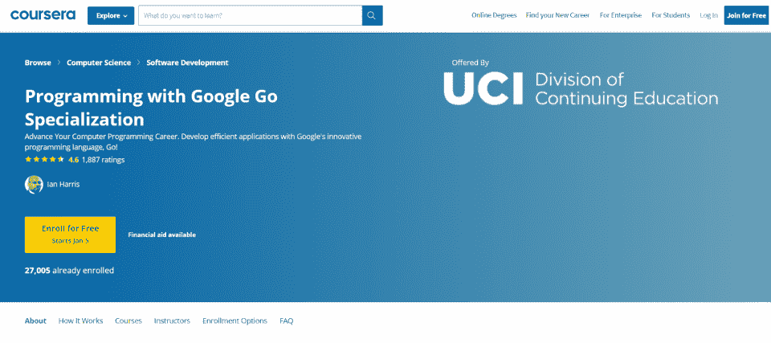
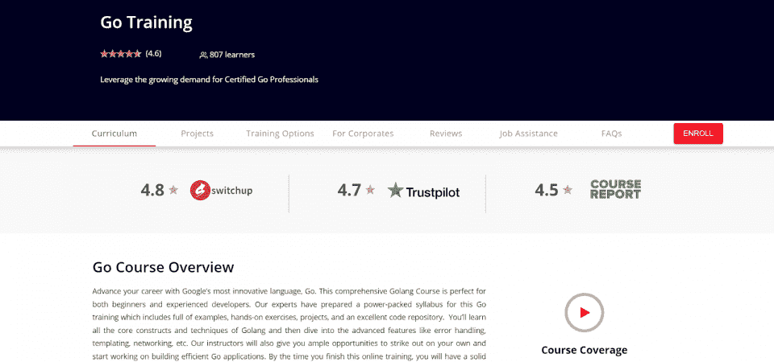

# 最佳 Golang 认证课程:学习 Go 所需了解的一切

> 原文：<https://hackr.io/blog/best-golang-certification-courses>

在你学习了 Go 编程语言 之后，下一步就是获得 Golang 认证。

自 2009 年以来， [Go](https://go.dev/) 一直是轻量级微服务渲染最流行的语言之一。如果你正在开发控制器、物联网设备、[API](https://hackr.io/blog/what-is-api-testing)或其他小型微服务应用，Go 可能是你的完美语言。

| 

```
Go:  package main  import “fmt”  func main() {   fmt.Println(“Hello, world!”)   }
```

 | 

```
C:   #include <stdio.h>  int main() {   printf(“Hello, World!”);   return 0;  }
```

 |

Go 基于 C 语言，但具有许多生活质量特性和下一代改进。正如 C 对于轻量级开发来说是完美的一样，Go 的 *和* 对于轻量级开发来说也是伟大的——其优点是更易于使用。

让我们来看看如何获得 Golang 认证并证明你的技能。

## **是 Go 语言还是 Golang？**

这种语言的正确名称是“Go”那么，为什么大家都叫它“Golang？”

围棋的域名曾经是*【Golang.com】*，由此引入了短语“Golang”此外，在谷歌(或任何其他搜索引擎)上搜索“Go”这个词很有挑战性。

这两个问题导致开发人员交替使用“Go”和“Golang”。如果你没有通过搜索“Go”找到你需要的结果，你可以尝试“Golang”，反之亦然。但是 Go 和 Golang 指的是同一种语言。“去”才是正确的名字。

## **什么是 Golang 认证？**

有 [无 *官方* 认证路径](https://developers.google.com/certification) 为 Go 编程语言。谷歌确实提供了多种开发者认证，但迄今为止他们还没有为 Go 做一个。如果你想获得该语言的认证，你必须通过第三方认证程序。

下面是两个比较热门的认证: *编程配合 Google Go* 和 *Go 训练。*

[****](https://coursera.pxf.io/yRPqLv)

通过 Coursera，加州大学欧文分校提供*Google Go 专业化编程。* 这个专精包括三门课程:

*   *入门 G*
*   *Go 中的函数、方法和接口*
*   *Go 中的并发*

完成课程后，您将获得可共享的专业和课程证书。本课程是自定进度的，包括分级测验和分级编程作业。

[****](https://mindmajix.com/go-training)

MindMajix 提供全面的 Go 认证流程，包括 45 小时的课程、45 小时的实验和以认证为导向的课程。实时项目用例、一对一指导和灵活的时间表完善了这个训练营。课程包括:

*   类型和变量
*   套餐
*   功能
*   数组和切片
*   可变函数
*   结构
*   并发
*   还有更多……

本课程集新兵训练营和认证于一体，所以你最终将获得 Go 认证。您将在课程中学习证书所需的所有内容。

## **为什么要获得 Golang 认证？**

Go 是一种通用语言，有许多用例。在很大程度上，只要 C 能起作用，Go 也能起作用，但是 Go 更容易使用。对于用 C 难以管理的项目，比如 web 应用程序，可以使用 Go。

Go 语言的用例包括:

*   云应用。
*   网页开发。
*   数据库实现。
*   分布式网络服务。
*   公用事业。
*   物联网设备。

作为一种基于 C 的通用语言，Go 几乎可以用于任何类型的开发。但是当您想要一种开销更小的语言时，它就显得非常出色。与 C 不同，它更容易用于 web 应用程序。

那么，你为什么要获得 Go 认证呢？Go 认证向潜在雇主表明你知道这门语言的复杂性。这也有助于你在开始进入 Go 编程职业之前测试自己。

## **为什么** ***不应该*** **你获得 Golang 认证？**

同时，有一些原因你可能 *而不是* 想要一个 Go 认证。因为没有官方的 Go 认证程序，所以需要依赖第三方的解决方案。这些第三方证书在经验水平和能力方面会有很大的差异。

不仅第三方证书可能很容易获得(因此不太值得)，而且他们中的许多人在雇主那里没有任何真正的信誉或地位。雇主可以看到思科认证，知道思科担保它。对于随机的第三方认证，他们没有这样的保证。有些是非常合格的，由大学提供，而另一些则是补救性的。在选择适合您需求的 Golang 课程之前，请务必做好调查。

所有这些都是说，虽然获得 Golang 认证可能是你的正确答案，但潜在雇主可能并不总是高度重视它。重要的是要确保你所上的课教会了你需要知道的东西。同样重要的是，要确保你不仅仅依赖于证书，而且你理解这门语言。大多数工作都需要你参加编程测试。

## **围棋编程的职业前景**

根据 Zip Recruiter 的数据，普通围棋程序员的年薪大约是 100，157 美元[。一个 Go 程序员的工资可能会根据地点的不同而有很大的差异，但它是一种受欢迎的语言，有着令人印象深刻的薪酬待遇。这个工资和 Java、C、Python 程序员的工资非常相似。](https://www.ziprecruiter.com/Salaries/Go-Programmer-Salary)

Go 也不在最受欢迎的语言之列(如 Java、C 或 Python)，这意味着就业竞争也明显减少。而 go 是 [十大语言之一](https://hackr.io/blog/best-programming-languages-to-learn)[对于专业开发者来说，其市场份额只有 7%](https://blog.jetbrains.com/go/2021/02/03/the-state-of-go/) 左右。

从受欢迎程度来看，Go 社区在持续增长。但是 Go 通常不是程序员最先学习的语言之一。今天大部分程序员都会从[JavaScript](https://hackr.io/blog/how-to-learn-javascript)，[Python](https://hackr.io/blog/how-to-learn-python)，Java，或者 PHP 开始；这增加了这些语言的程序员数量。

Go 继续增长是因为它的快速和轻量级。随着性能和可扩展性变得越来越重要，Go 成为基础设施工具和物联网设备等编程组件的绝佳选择。对于大规模的企业级部署来说尤其如此。

## **如何学习围棋语言:6 大资源**

那么，在通过认证程序之前，如何学习 Go 语言呢？我们已经了解了网上提供的[最佳高尔夫课程](https://medium.com/hackr-io/learn-golang-best-go-tutorials-for-beginners-deb6cab45867)资料和最佳高尔夫教程选项[](https://hackr.io/tutorials/learn-golang)。这里有六个选项可以让你学习更多关于 Go 的知识，其中一些选项最后还附带了可共享的证书。

在 *掌握围棋编程* 中，学员将学习如何使用围棋，编写围棋编程的单元测试和基准，用代码处理不同的数据格式。这是一门非常全面的课程，这个测试首先假设你对 Go 语言有一定程度的熟悉。从那里，学生将能够开发微服务的通信层，创建自己的用户界面，并与数据库进行交互。

是一系列可供学生复习的示例代码，而不是带着学生浏览课程和讲座。已经是有经验的程序员的学生将通过浏览这些例子来学习他们需要知道的关于 Go 语言和语法的所有知识，这些例子从简单开始，并迅速变得更高级。

git books 上的开源书籍， *用 Golang 构建 Web 应用程序* 带学生了解使用 Go 的基础知识。从 Go 环境的安装和配置开始，即使是非程序员也很容易理解。因为这是一本书而不是一门完整的课程，你必须有点自我激励。

应用围棋提供两门课程: *大师围棋(基础)* 和 *并发深潜。* 这些课程是针对高级用户的；在学习这些课程之前，你应该对围棋有一个比较扎实的了解。这些课程包括 100 多课和练习以及一个社区论坛，在那里你可以与其他围棋程序员互动并获得帮助。

Gophercises 是一系列免费的编码练习，帮助你开发一个投资组合。Gophercises 非常适合那些理解 Go 的基本语法和理论，但又想认真开始编程的人。这将帮助你真正锻炼你的编程肌肉，更深入地学习围棋，并创建一个作品集。

专为那些特别想用 Go 进行 web 开发的人设计，*Web Development w/Google 的 Go* 将带你了解用 Go 语言创建 Web 应用程序的基础知识。Go 对于创建轻量级 web 应用程序和移动应用程序来说是非常棒的，尤其是这门课程是由一位经验丰富的计算机科学专业人士教授的。

在这一点上，需要注意的是，由于没有官方认证课程，这些课程都没有涵盖“认证所需的内容”相反，其中一些提供了可共享的证书，而另一些则没有。Udemy 课程和 Coursera 课程提供认证，但这些认证只有在课程强大时才有价值。

## **向 Golang 认证迈出下一步**

[****](https://coursera.pxf.io/yRPqLv)

你通往围棋认证的道路始于参加 Golang 课程。Golang 课程和 Golang 培训课程将帮助您为认证过程做好准备。但是因为没有官方的 Golang 认证，你需要决定如何展示你的技能。

一种选择是参加由 [Coursera](https://coursera.pxf.io/mgJObq) 、LinkedIn Learning 或 Udemy 提供的第三方认证课程。这些认证课程的一个优势是，它们会教你所需的技能，并在你完成课程后颁发证书。你不需要参加多门课程和辅导课，然后通过冗长的考试。

另一种选择是在网上学习围棋，并在此基础上开发一套围棋程序。拥有一个充满 Go 编程样本的强大 Github 帐户可能比 Golang 认证更适合你。不管怎样，参加一个 [在线编程课程](https://hackr.io/tutorials/learn-golang) 是一个很好的开始。