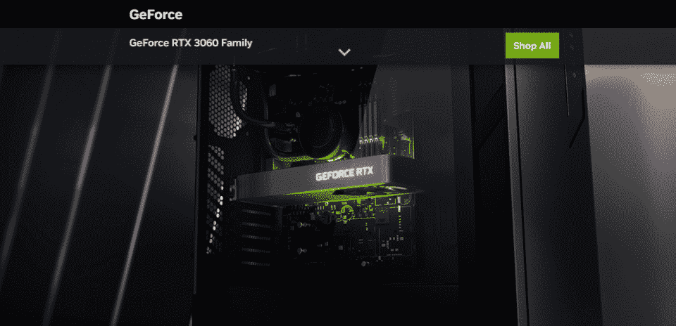
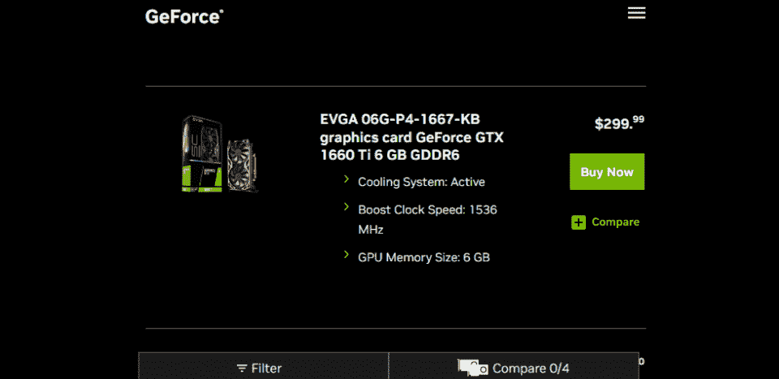
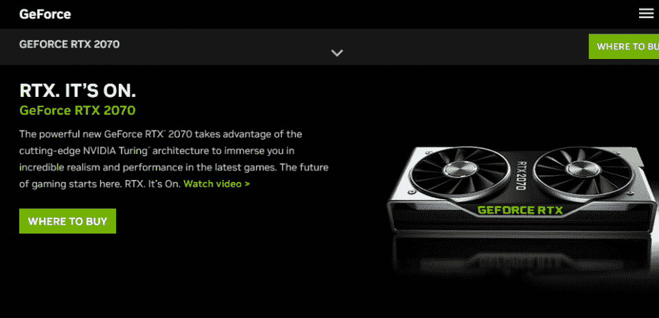
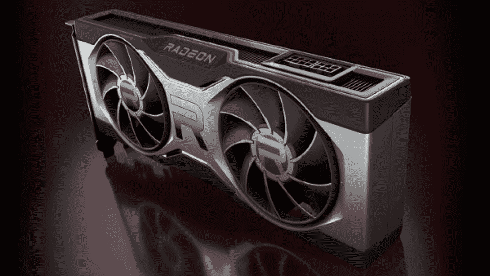
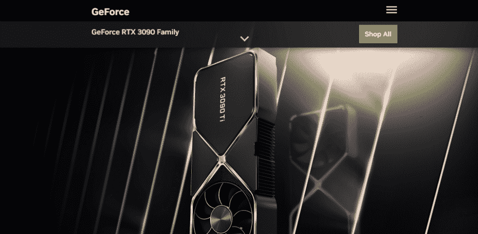
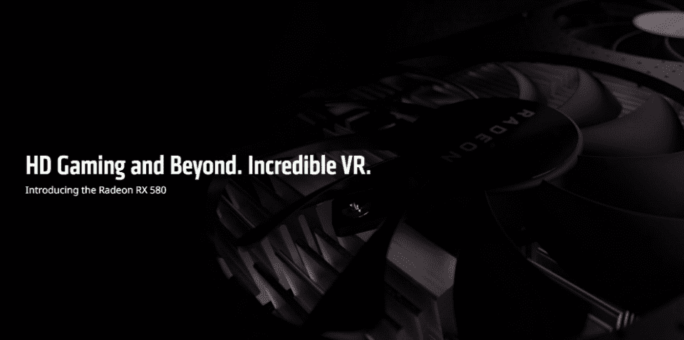
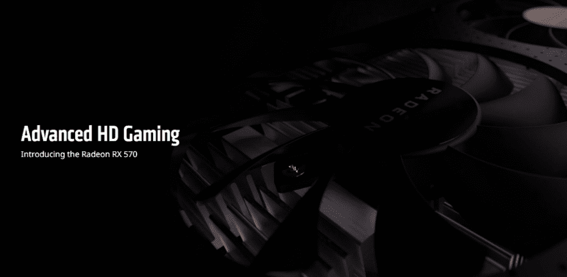
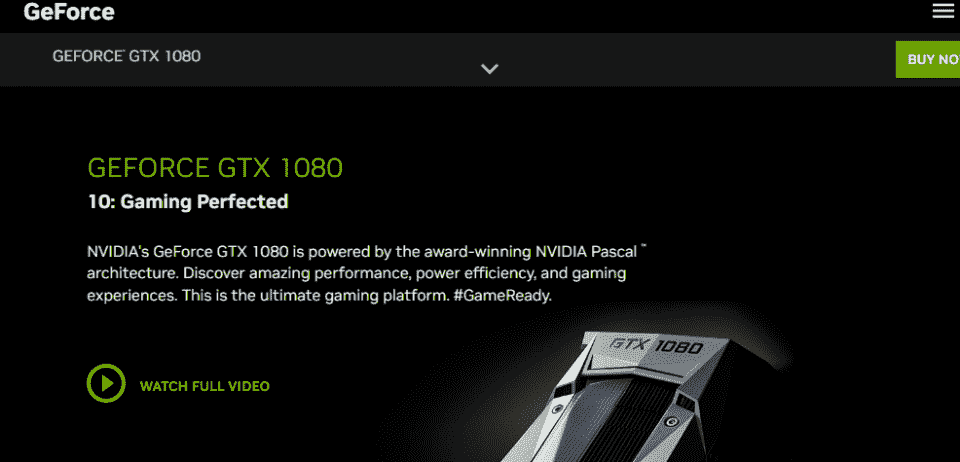
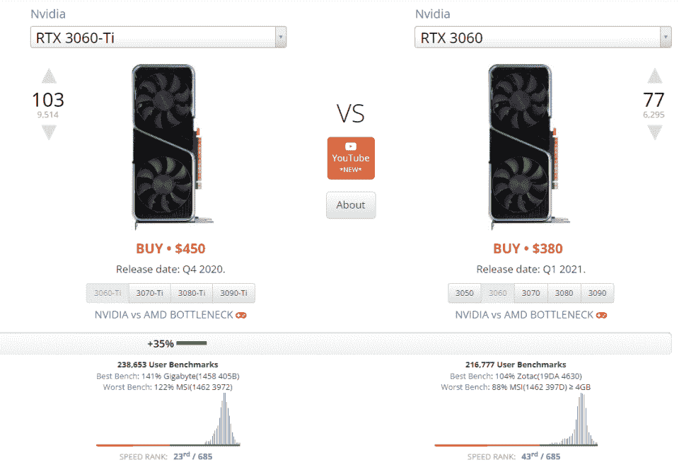

# 最佳采矿 GPU:用于加密采矿的 8 大显卡[2023]

> 原文：<https://hackr.io/blog/best-gpu-for-mining>

如果你想挖掘密码，你需要一个挖掘图形处理器。但是并不是所有的显卡都是一样的。最好的矿用显卡可能不是最贵的(*或*最便宜)。最好的采矿卡可能也不是最快的。最适合采矿的 GPU 就是这样——最快解决采矿问题的 GPU。

今天，我们将深入探讨是什么让 GPU 非常适合挖掘，哪些 GPU 是最好的，以及如何开始挖掘加密。

注意:暂时不要建造以太坊矿车。即使是最好的 GPU 来挖掘 2023 也不会帮助你获得不是(或不再是)工作证明的硬币。比特币(BTC)和 Dogecoin (DOGE)是两种你可以挖掘的硬币。以前，你可以开采以太坊，但现在不行了。

## **为什么挖矿需要 GPU？**

在挖掘加密货币的早期，我们实际上依靠的是处理能力。我们使用 CPU 来解决“发现”代币的数学问题。但是后来我们意识到 CPU 不擅长那种类型的数学。即使是廉价的采矿 GPU 也超过了昂贵的 CPU，因为 GPU 对于那种繁重的算法提升来说是*意味着*。

今天，没有人使用处理器来采矿，而是一直使用显卡。但是矿用显卡有几百种可以选择。直到最近？很难找到用于采矿的 GPU，因为它们卖得太快了。

## **最适合采矿的 3 个 GPU 是什么？**

最适合采矿的 GPU 有:

这些卡片产生价值:它们不贵，我很快就能买到，而且(有时)很容易买到。

NVIDIA GeForce RTX 3060 TI 是最好的全能卡，以具有成本效益的建议零售价快速挖掘。NVIDIA GeForce GTX 1660 SUPER 是最好的预算卡，在许多领域都可以买到。而 NVIDIA GeForce RTC 2070 只是一个价格低廉的固卡。

考虑一款便宜的 GPU 做矿用？或者你正在寻找金钱可以买到的最好的采矿 GPU？继续读！

## **概述:最适合采矿的 GPUs】**

我们挑选了一些顶级的[显卡](https://www.businessinsider.com/guides/tech/what-is-a-graphics-card)进行挖掘。但是请记住，有时候最好的矿用显卡是“打折的”或者“免费的”除了能源，GPU 将*创造价值。如果它能转换比你支付的电费更多的钱，这是一笔好交易。*

当你回顾这些数字时，请注意 crypto 在 2023 年已经崩溃了*。“挖掘 BTC”会让你在大多数卡上每天赚到几分钱——但这个想法是，如果你赚到足够多的这些钱，有一天，这些钱会变成美元。*

## **2023 年最适合采矿的 8 款 GPUs】**

[****](https://www.nvidia.com/en-us/geforce/graphics-cards/30-series/rtx-3060-3060ti/)

最佳全能选手

*   **英伟达核心:**4864 个
*   **基本内存:** 8 GB
*   **存储器类型:** GDDR6 RAM
*   **PCI 类型:** PCI Express 4.0

RTX 3060 TI 击败了大多数其他显卡，而且它真的不贵。专为游戏打造的 RTX 3060 TI 使用 GDDR6 RAM 和 PCI Express 4.0 显卡。这是一种快如闪电的卡，不仅仅用于采矿。

✅是一个伟大的高性能通用显卡。

✅体面的入门级价格二手市场。

❌仍然比真正的“预算”卡贵。

[在这里买。](https://amzn.to/3PAjmKA)

[****](https://www.nvidia.com/en-us/geforce/graphics-cards/16-series/)

**最佳预算卡**

*   **核心:** 1，408
*   **基本内存:** 6 GB
*   **存储器类型:** GDDR6 RAM
*   **PCI 类型:** PCI Express 3.0

GTX 1660 超级跑车的价格接近 200 美元。虽然它并不完全强大，但它的低成本使它非常适合创建一个由多个 GPU 组成的平台。GTX 1660 超级卡比上一代 16 系列卡快 50%。

✅是一张能快速解决问题的廉价卡。

✅通常可用。

❌并没有真正出现在新的市场上。

[在这里买。](https://amzn.to/3G0VGM6)

[****](https://www.nvidia.com/en-us/geforce/news/nvidia-geforce-rtx-2060-super-rtx-2070-super-out-now/)

**最佳中档卡**

*   **核心:**2304
*   **基本内存:** 8 GB
*   **存储器类型:** GDDR6 RAM
*   **PCI 类型:** PCI Express 3.0

就金钱而言，GeForce RTX 2070 的性能并不令人兴奋。但它在可用性上弥补了这一点。这是一张相对可靠的卡片，能产生相当不错的结果——如果能打折出售就更好了。

✅是一款性能稳定的中档卡。

❌不是最划算的卡——没有比 3060 更好的了。

[在这里买。](https://amzn.to/3G5UgQJ)

[****](https://www.amd.com/en/products/graphics/amd-radeon-rx-6700-xt)

**不是最好的，也不是最差的**

*   **核心:**2560
*   **基本内存:** 12 GB
*   **存储器类型:** GDDR6 RAM
*   **PCI 类型:** PCI Express 4.0

当我们达到列表中的“4”时，我们开始接近更好的牌。AMD 镭龙有点太贵了，无法成为我们前三名的真正竞争者，其性能值得“哼”但是镭龙贺卡更容易销售——所以“meh”可以变成“eh？”

✅性能稳定，为中级卡。

✅可能比其他卡更容易使用。

❌没有令人惊讶的表现。

[在这里买。](https://amzn.to/3hzCQ5x)

[****](https://www.nvidia.com/en-us/geforce/graphics-cards/30-series/rtx-3090-3090ti/)

**对于那些有钱花不完的人**

*   **核心:** 10，496
*   **基本内存:** 24 GB
*   **内存类型:** GDDR6X RAM
*   **PCI 类型:** PCI Express 4.0

GeForce RTX 3090 是一款昂贵的显卡。它挖矿的速度是大多数其他卡的两倍，但它的价格也是其他卡的三倍。因此，如果你有折扣或者你升级了你的计算机，它是一个很好的卡，但它不是你的服务器场的一个很好的选择。

✅可能是你能买到的最好的卡片之一。

✅肯定会快速生产出大量的密码。

❌:它仍然很贵，成本效益不存在。

[在这里买。](https://amzn.to/3WrLamr)

[****](https://www.amd.com/en/products/graphics/radeon-rx-580)

**低成本冠军**

*   **核心:**2304
*   **基本内存:** 8 GB
*   **存储器类型:** GDDR5 RAM
*   **PCI 类型:** PCI Express 3.0

镭龙往往会在较低层次大放异彩。这种卡的价值比不上这张列表中更便宜的卡，但是镭龙卡(尤其是经济型卡)更容易买到。有时候不是你想要的卡少，而是你能拿到的卡多。

✅超级实惠，性能体面。

✅体面的入门级价格二手市场。

❌注意制造商和规格——这真的很重要。

[在这里买。](https://amzn.to/3hJeCpg)

[****](https://www.amd.com/en/products/graphics/radeon-rx-570)

被它的兄弟超过

*   **核心数:**2048
*   **基本内存:** 4 GB
*   **存储器类型:** GDDR5 RAM
*   **PCI 类型:** PCI Express 3.0

RX 570 一点也不比 RX 580 好。这既不划算也不快速。如果是你身边已经有的东西，那就很划算了。很扎实，但是就是跟不上其他的。

✅仍然相当实惠，性能也不错。

❌没有 RX 650 好，如果这是一个选项。

❌注意制造商和规格——这对预算卡更重要。

[在这里买。](https://amzn.to/3FHS1l9)

[****](https://www.nvidia.com/en-ph/geforce/products/10series/geforce-gtx-1080/)

**速度快，但价格过高**

*   **核心:**2560
*   **基本内存:** 8 GB
*   **内存类型:** GDDR5X RAM
*   **PCI 类型:** PCI Express 3.0

最后，我们有 GeForce RTX 1080。就速度而言，这是一张很棒的牌。如果你有一大堆打折商品，那就去买吧。问题是建议零售价确实很高；你需要找到这些转售。

✅是一张非常可靠的牌，通常很容易拿到。

❌:除非你能买到便宜的东西，否则就没有成本价值。

[在这里买。](https://amzn.to/3uZKCsz)

## **那么，是什么造就了一个优秀的采矿用 GPU 呢？**

正如你在上面看到的，一个性能和成本的*组合*为采矿制造了一个好的 GPU。

不幸的是，随着开采难度的增加，性能不断下降，成本也不断波动。我们大概知道哪些卡最适合采矿，但我们通常通过测试来收集这些信息。一旦我们知道哪些卡适合采矿，就要尽可能便宜地购买这些卡。

**想了解更多关于采矿的知识？查看本课程**

[了解如何构建加密货币挖掘计算机](https://click.linksynergy.com/deeplink?id=jU79Zysihs4&mid=39197&murl=https%3A%2F%2Fwww.udemy.com%2Fcourse%2Flearn-how-to-build-an-ethereum-mining-computer%2F)

## **如何选择矿用显卡**

现在我们已经讨论了简单的东西，让我们讨论一些选择显卡时的其他问题。

显卡就像汽车。它们有不同的修剪水平。假设你想要一台英伟达 GeForce RTX 3060 TI。英伟达是制造这种芯片的公司。GeForce RTX 是芯片的品牌和型号。TI 是一个微调级别——RTX 3060 不会像 3060 TI 那样有同样的性能。

来自 [UserBenchmark](https://gpu.userbenchmark.com/Compare/Nvidia-RTX-3060-Ti-vs-Nvidia-RTX-3060/4090vs4105) 的比较显示了 TI 版本比非 TI 版本的表现有多显著。

但是等等——还有更多。

当您选择显卡时，您也选择了:

*   **制造商。**没错；NVIDIA 或 RADEON 制造芯片，不一定是卡。当你购买 RTX 3060 TI，你可以从微星，技嘉，或 Zotac 购买的东西。一些制造商有铃铛和哨子(如额外的冷却)——其他人没有。这很重要。
*   **记忆。**这些制造商可能会生产 4GB、8GB 或 16GB 的 3060 TI。板载内存的大小对性能也很重要。大多数卡都有默认设置。一个 3060 TI 通常会配备至少 8 GB。但是你可以看到一个便宜的，然后意识到它只有 6GB。

因此，不幸的是，由于这些“微调级别”，选择正确的挖掘 GPU *甚至*并不总是容易的，如果你确切知道你想要哪个芯片的话。

## **如何找到便宜的显卡**

需求经济学意味着，曾几何时，即使是 400 美元的显卡在经销商市场上也能卖到 1200 美元。密码越贵，显卡就越贵。但随着加密市场的疲软，这种情况正在改变。BTC 的价值越低，显卡价格就越容易下跌——因为 BTC 是目前开采的主要货币。

随着 ETH 从工作证明转向利益证明，显卡大幅下降。寻找廉价显卡的最好地方是二手卖家:亚马逊和易贝上的二手显卡。挖矿不需要新显卡，只要能用就行。人们一直在更换显卡，以获得一流的游戏技术。

## **购买用于采矿的 GPU 的替代方案**

你可能已经注意到，即使在我们的图表上，用于采矿的最佳 GPU 也并不真正有利可图。但这可能会有点误导。

是什么让采矿如此昂贵？

*   首先，费用是基于美国的电费，现在电费很高。如果你运行的是太阳能、风能或其他可持续能源系统(很多 GPU 采矿场都是)，那就是不同的场景了。
*   第二，它是基于 GPU 的 MSRP，这真的是唯一的静态价格进行比较。但是你可以便宜地买到二手的。
*   第三，对 BTC 来说，采矿现在很贵(我们正在比较)。但如果你认为替代硬币会涨价，那么它们往往更容易被开采。
*   最后，BTC 崩溃了。在撰写本文时，它还不到 2 万美元，远远低于 6 万美元的高点。这很重要。

很多人就是因为上面的原因才不用自己的 GPU 去挖掘的。相反，他们已经开始在云实例或托管服务器上进行挖掘。他们不需要预先购买一堆采矿设备，也不需要把它们放在家里(或者支付电费)。

## **结论:挖矿用的最好的 GPU 是什么？**

这些是 2023 年最好的加密采矿卡。但是最好的加密挖掘 GPU 会随着价格的波动而不断变化。我们基于传统的 MSRPs 商店出售的价格。但是供应/需求很重要:许多“最适合采矿的 GPU”很难得到。

因此，你可以购买最好的 GPU 进行挖掘，并立即开始挖掘比特币——或替代比特币。但这些快速的财务收益并不是区块链的全部好处，现在你知道如何开始采矿，请在下面找到更多关于区块链的信息:

## **常见问题解答**

#### **1。挖矿最有效的 GPU 是什么？**

简而言之，对于挖掘最有效的 GPU 就是能够最快解决挖掘问题的 GPU 也是性价比最高的解决方案。截至 2022 年 9 月，最适合采矿的 GPU 可能是英伟达 GeForce RTX 3060 Ti。有更强大的卡，但它们非常昂贵。矿业本质上是一项金融事业。

#### **2。挖矿需要什么 GPU？**

至少相当于 GTX 1070 应该用于采矿，但关于 GPU 的有趣的事情是，由于工作是“完成”的方式，你不能总是预测哪个卡将是伟大的采矿。2000 美元的卡可能没问题，500 美元的卡可能会令人惊讶，这取决于卡本身内部的引擎——例如，具有光线跟踪功能的卡往往非常强大。

#### **3。ETH 挖矿用哪个 GPU 最好？**

很遗憾，你不能再开采以太坊了。以太坊在 2022 年 9 月 15 日从工作证明切换到股权证明。

#### **4。挖矿会破坏 GPU 吗？**

挖矿绝对会毁掉一个 GPU。这相当于全天候运行一个非常耗费资源的游戏。大多数 GPU 可以在电脑中使用长达十年，即使它在这么长时间后没有运行顶级游戏。一个 GPU 通常不会持续采矿超过几年。但是你可以在这段时间里赚很多钱。

#### **5。一个挖矿 GPU 能用多久？**

一个挖矿 GPU 能用多久取决于几个因素。最重要的是，这是一个挑战——比特币很难开采，但一些替代币却不是。其次，还有热量和环境。暴露在大量热量和灰尘中的采矿 GPU 可能会在一周内损坏。最后，还有 GPU 本身:有些比其他的更难。一个好的 GPU 至少要用三年。

#### **6。我应该用多少个 GPU 来挖矿？**

那真的取决于你。有些人在一个数据中心内制造了一个由数千个 GPU 组成的机架。其他人有一个、两个或一打。如果你在挖掘比特币，你将需要数百个 GPUs 难度增加了。

#### **7。如何优化显卡挖矿？**

今天的大多数显卡都带有内置的 BIOS 系统，允许超频。除了显卡本身超频，就是环境；这就是为什么许多矿工更喜欢露天安装在鸡蛋箱里，而不是花哨的箱子里。