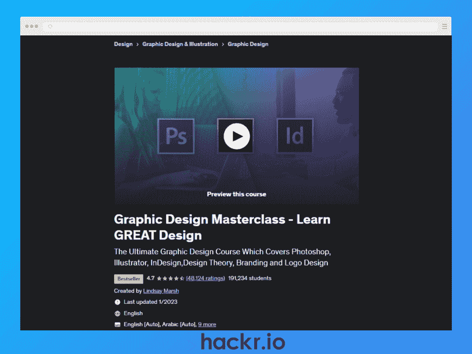
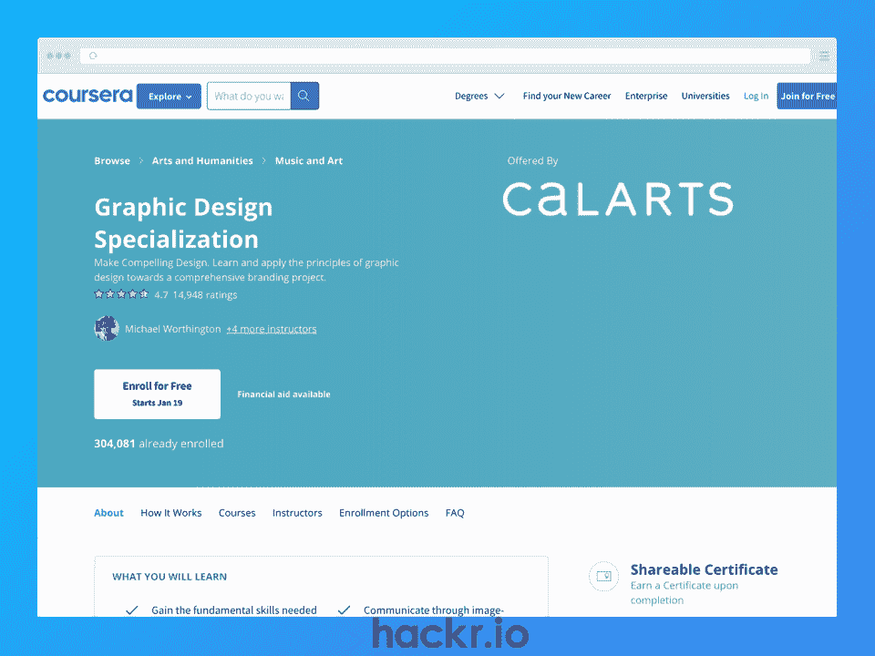
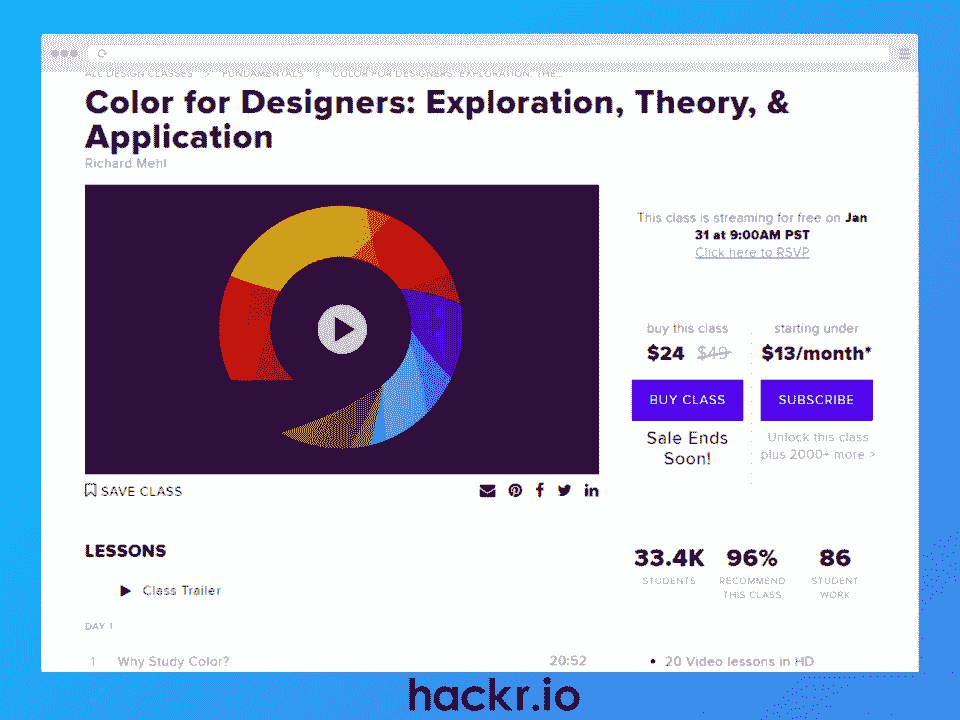
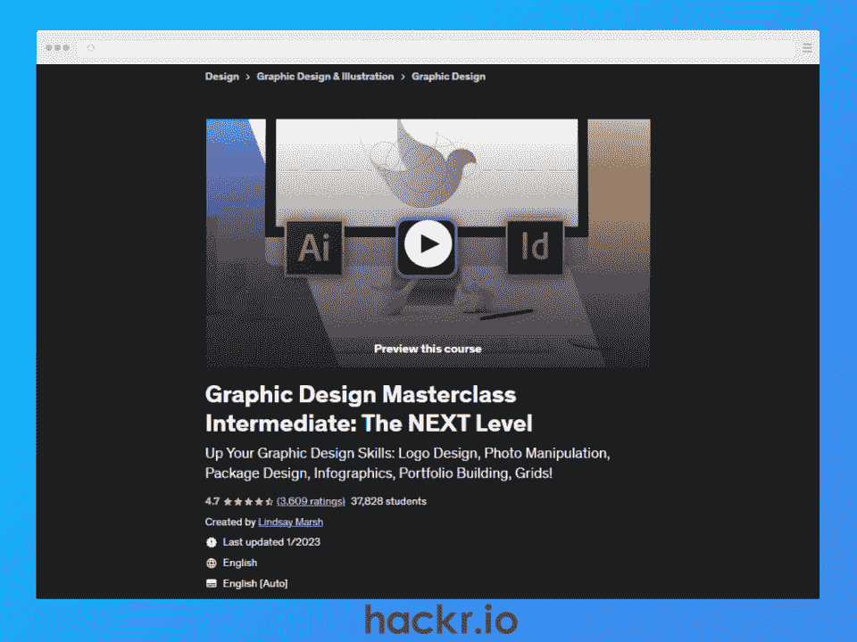
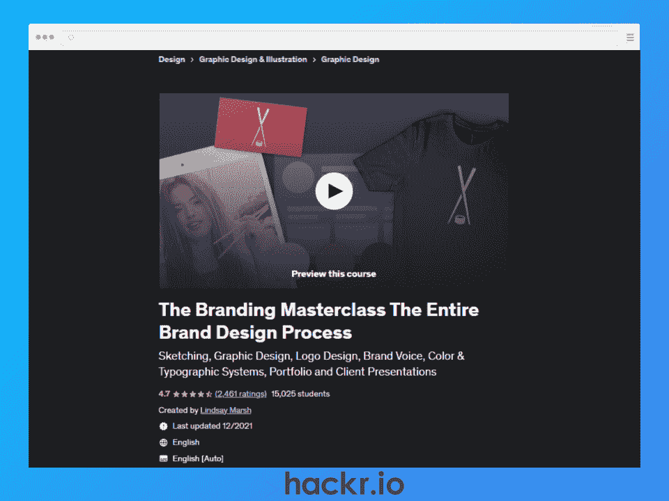
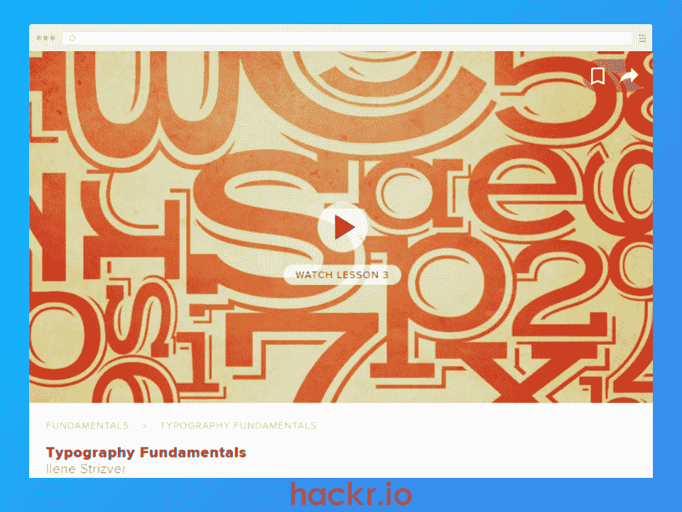
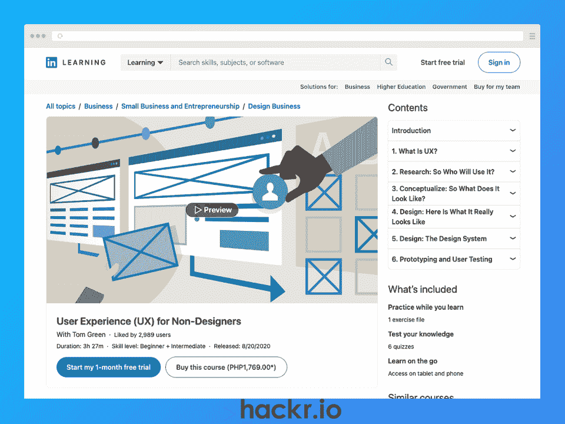

# 2023 年要上的 8 门最佳平面设计课程

> 原文：<https://hackr.io/blog/best-graphic-design-courses>

**我们最喜欢的:**

如果你一直在考虑转型或开始平面设计师的职业生涯，有很多方法可以做到这一点。你可以选择一个最好的(也是传统的)方法，参加一个四年的课程来获得设计学士学位。然而，这种方法并不总是每个人的最佳选择，因为它并不总是可行的。如果你不能完成一个完整的四年学位项目，你能做什么？

你可以尝试做的一件事是阅读[平面设计书籍](https://hackr.io/blog/graphic-design-books)，它们通常会包含你需要知道的关于设计基础的所有信息。他们可能也有教程和指南，教你如何使用一些最流行的图形设计应用和软件。然而，如果你喜欢用不同的方式学习，你可以尝试平面设计课程。

最好的平面设计在线课程将包括你需要开始的一切。课程是以一种允许线性学习的方式策划和创建的。在线图形设计课程通常会有视频教程来演示课程，让你更容易跟上。他们还会有一些项目，你可以跟着做，以便更容易地学习。

如果你准备好尝试一两门平面设计课程，我们在下面列出了最好的课程。所以让我们开始吧！

## **最佳在线平面设计课程:我们的精选课程**

如果你问的是“我在哪里可以学习平面设计？”你可以在下面找到一些最好的地方。

[了解更多信息](https://click.linksynergy.com/deeplink?id=jU79Zysihs4&mid=39197&murl=https%3A%2F%2Fwww.udemy.com%2Fcourse%2Fgraphic-design-masterclass-everything-you-need-to-know)

**关键信息**:

*   **时长:** 29 小时点播视频；学生自定进程的

*   **难度:**初学者

*   访问 Adobe Photoshop、InDesign 和 Illustrator 等设计软件。您也可以使用 Affinity Photo、Designer 或 Publisher

*   如果使用 Adobe 产品，作者建议使用 CS6+版本或当前的 Creative Cloud(订阅)版本，以便更好地跟进

**我们为什么选择本课程**

如果你正在寻找最好的在线平面设计课程，林赛·马什的平面设计大师班-学习伟大的设计无疑是首选。这门课程是 Udemy 上最受欢迎的课程之一，至少在平面设计类别中是如此。凭借近 200，000 名过去的注册者和 4.7/5 颗星的稳定评级，作家 Lindsay Marsh 创建了一个热门课程，教授平面设计的基础知识。

在本课程中，你将能够了解设计的基本原理和元素，如排版、布局、色彩理论等。该课程还涉及到像标志设计，照片优化，品牌等主题。因为本课程是为初学者设计的，所以它也讲述了如何使用你的设计软件做某些事情。

如果你已经知道了基本原理，那么这个课程可能不适合你。这样的话，你可以试试林赛·马什的另一门课程:平面设计大师班中级:更上一层楼。

值得一提的是，作者 Lindsay Marsh 为她的课程发布了每月折扣券(针对那些以前至少注册过一个课程的人)，这将使你以更实惠的价格购买。在你购买之前，你可能想看看这些优惠券或 Udemy 的定期促销活动。

**优点**

*   涵盖了所有你需要知道的平面设计基础知识
*   也教你更多关于平面设计师的知识，包括在这个行业工作的一些细节
*   销售相对频繁，作者每月发放优惠券

*   不断更新新信息、项目等。确保内容是最新的

*   作者林赛·马什亲力亲为

**缺点**

*   不要太深入，主要涵盖基础知识，所以如果你已经有一定的知识，你可能想去中级课程
*   不打折时价格昂贵
*   需要使用图形设计软件

[了解更多信息](https://imp.i384100.net/3PBvEK)

**关键信息**:

*   **作者:**加州艺术学院

*   **持续时间:** 6 个月，每周 3 小时
*   **难度:**初学者
*   **证书:**是

*   电脑和互联网连接
*   访问 Adobe 的创意套件(至少具备一些初级知识),如 Photoshop、InDesign 和 Illustrator
*   一些艺术材料

**我们为什么选择本课程**

Coursera 上 CalArts 提供的平面设计专业正在争夺最佳初学者在线平面设计课程。这个专业涵盖设计基础，排版，以及更多，包括平面设计历史和品牌。在你的课程结束时，你可以开始设计生涯，有一些投资组合项目和结业证书！

**优点**

*   向 CalArts 经验丰富的教师学习
*   有趣的课程和项目有助于巩固你的学习
*   自定进度，如果你愿意，你可以走得更快
*   免费审计

**缺点**

*   迎合初学者；更有经验的学习者可能想去别处看看
*   Coursera 订阅不是最实惠的

[了解更多信息](https://www.creativelive.com/class/color-designers-exploration-theory-application-richard-mehl)

**关键信息**:

*   **时长:** 8 小时 14 分钟的点播视频
*   **难度:**所有等级

*   使用计算机和互联网连接
*   访问图形设计软件

**我们为什么选择本课程**

如果你正在寻找特定主题的平面设计在线课程，色彩设计师:探索，理论和应用是一个很好的选择。本课程涵盖了你需要知道的一切，以更好地理解色彩术语和含义，以便你能有效地将其应用到你的设计中。

这门课有超过八小时的视频点播，让你按照自己的进度学习。你也可以在任何需要的时候复习你学过的东西！

**优点**

*   包括你需要知道的关于色彩理论、术语和含义的一切
*   难以置信的深入
*   通过实践经验和项目学习
*   课程作者已经在视觉艺术学院教了十多年书

**缺点**

[了解更多信息](https://click.linksynergy.com/deeplink?id=jU79Zysihs4&mid=39197&murl=https%3A%2F%2Fwww.udemy.com%2Fcourse%2Fgraphic-design-masterclass-the-next-level%2F)

**关键信息**:

*   **时长:** 17 小时的点播视频
*   **难度:**中级
*   **证书:**是

*   平面设计的基本工作知识
*   了解 Adobe Photoshop、InDesign 和 Illustrator 等设计软件(或者 Affinity Photo、Designer 或 Publisher)
*   如果使用 Adobe 产品，建议至少使用 CS6 版本；Creative Cloud 版本更好(可通过订阅获得)

**我们为什么选择本课程**

如果你已经完成了一门基础课程，或者如果你已经有所了解，你可能想跳过一些基础课程，直接进入林赛·马什的平面设计大师班中级课程:下一级。本课程继承了她的基础大师课留下的内容，涵盖了对中级学习者有益的主题。如果你正在为中间用户寻找最好的平面设计课程，这当然是其中之一！

正如我们之前提到的，Lindsay Marsh 每月提供优惠券，帮助您以更优惠的价格购买她的课程，前提是您之前已经注册了她的课程。这个课程也经常打折，所以你可以多一点耐心来节省一些钱。

**优点**

*   从初级大师班停止的地方开始，涵盖非常适合中级设计师的主题
*   不断更新新的信息，以确保最新和最大的信息
*   使用项目和实践学习使每一课更容易理解
*   销售相对频繁，作者提供了每月优惠券，你可以用它来省钱

**缺点**

*   有人抱怨有些主题有点偏基础(或者重复了基础课程)

[了解更多信息](https://click.linksynergy.com/deeplink?id=jU79Zysihs4&mid=39197&murl=https%3A%2F%2Fwww.udemy.com%2Fcourse%2Fthe-branding-masterclass-the-entire-brand-design-process%2F)

**关键信息**:

*   **时长:** 8.5 小时的点播视频
*   **难度:**初级-中级
*   **证书:**是

*   访问光栅照片编辑和矢量编辑程序(Adobe Photoshop 或 Affinity PhotoAdobe Illustrator 或 Affinity 设计师)
*   上述应用的基本知识

**我们为什么选择本课程**

是的，这是 Lindsay Marsh 的另一门课程！

品牌大师班为那些想进入平面设计领域的人提供平面设计培训。每一个组织、公司、企业和品牌都需要一个强大的、设计良好的身份，才能在竞争的海洋中脱颖而出，令人难忘。本课程将教你入门所需的一切，从头到尾涵盖整个过程。

Lindsay Marsh 将教你从规划草图到客户演示的品牌化过程。你将学习如何问你的客户正确的问题，这样你就可以制定一个计划，并确定你的客户的目标客户和更多。

如果您以前注册过 Lindsay Marsh 的课程，您可以在您的电子邮件收件箱中收到她的每月折扣券。等待这些优惠券或大减价来节省一点现金可能对你有好处。

**优点**

*   涵盖从开始到结束的整个品牌推广过程
*   经常更新新信息以保持最新
*   林赛·马什以通俗易懂的方式讨论了主题和课程

**缺点**

*   最适合初级到中级设计师，不适合更有知识的专业人士

[了解更多信息](https://www.creativelive.com/class/typography-fundamentals-ilene-strizver)

**关键信息**:

*   **时长:** 6 小时视频点播
*   **难度:**初级到所有级别
*   **证书:**否

*   访问图形设计软件

**我们为什么选择本课程**

如果你想成为一名成功的平面设计师，你需要很强的知识和对排版基础的理解。你最终可能会了解到，字体设计是设计的支柱之一，老实说，这比选择字体搭配要复杂得多。如果你想提高你的平面设计技能，最好的在线课程可以帮助你。

Ilene Strizver 的《印刷术基础》就是这样一门课程，涵盖了 6 个小时的内容，包括印刷术的注意事项。您还将了解更多可用的字体类型，以及如何以最佳方式将它们搭配在一起。

**优点**

*   提供六小时的内容，涵盖十三课
*   课程以有趣和吸引人的方式教授
*   负担得起的
*   附带学习材料

**缺点**

*   最适合初学者到中间用户

[了解更多信息](https://linkedin-learning.pxf.io/BXNvy1)

**关键信息**:

*   **时长:** 3.5 小时的点播视频
*   **难度等级:**初级到中级
*   **证书:**是

*   使用计算机和互联网连接

**我们为什么选择本课程**

虽然面向非设计人员的用户体验(UX)不一定能提供很多实际项目，但是你需要通过六次测验才能完成这门课程。在这个 LinkedIn 学习课程中，你会学到 UX 设计的基础。作者汤姆·格林以这样一种方式框定了这些课程，使得新手和非设计师都很容易学习。

**优点**

*   大量的深入学习
*   帮助巩固你的学习的测验
*   非常适合初学者
*   包括结业证书

**缺点**

*   没有实际的练习

[了解更多信息](https://skillshare.eqcm.net/n1q5E6)

**关键信息**:

*   **时长:** 32 分钟的点播视频
*   **难度:**中级
*   **证书:**否

*   访问矢量图形设计程序，如 Adobe Illustrator 或 Affinity Designer

**我们为什么选择本课程**

标志设计是平面设计师的一部分。如果你想在这个行业取得成功，你需要知道如何从头到尾设计一个标志。一些设计师选择标志设计作为他们的利基，而另一些设计师将标志设计技能保留在他们的设计师工具箱中，而没有专业化。无论你属于哪一类，这个 30 分钟的快速课程都是学习的好方法！

**优点**

*   简明扼要
*   向您展示了一个示例，但也为您设置了未来要做的事情
*   非常适合初学者和忙碌的学习者

**缺点**

## **我们如何评选出最佳平面设计在线课程**

当我们整理这个平面设计课程的列表时，我们考虑了一些因素，以确保我们只包括最好的。

首先，我们考虑课程在哪个平台上。我们选择在值得信赖、可靠的平台上发布和托管的课程，这些平台以其课程质量而闻名。接下来，我们考虑课程作者，以确保他们是这方面的权威，并有提供课程的可信度。我们还查看了平面设计课程的价格，以确保我们提供适合任何预算的选项。

我们仔细查看了每门课程，并检查了每门课程的教学大纲或课程计划，以确保所涵盖的主题可以帮助您作为一名平面设计师有一个良好的开端。最后，我们查看评论，看看以前的学生对这些项目的看法。

一旦我们考虑了上述所有因素(还有一些因素，比如课程是否提供结业证书)，我们就想出了最佳平面设计在线课程的推荐名单。

## **结论**

有许多不同的方法来学习平面设计，其中许多你可以在你的空闲时间，在你自己舒适的家里做。除了 YouTube 上的书籍和教程，你还可以参加自定进度的平面设计课程，这些课程可以教会你开始设计师生涯所需的一切。只要记得选择适合你水平的课程(或者如果你想挑战的话，稍微高一点！).

我们希望我们推荐的在线最佳平面设计课程能够帮助你找到一门可以尝试的课程。祝你好运！

如果你也在寻找专门的 Photoshop 课程来帮助你掌握行业标准的软件，看看这个[最佳在线 Photoshop 课程](https://hackr.io/blog/best-photoshop-courses)的列表。

## **常见问题解答**

#### **1。平面设计需要什么资质？**

尽管一些雇主要求应聘者拥有学士学位，但你完全有可能在没有学士学位的情况下找到一份设计师的工作。如果你想成为一名设计师，这里有一些你需要的东西:

*   平面设计的基础，包括色彩理论，排版等。
*   如何使用一些最流行的设计软件，如 Adobe Photoshop、Affinity Designer 等
*   一个很棒的作品集，展示了你的一些最好的作品，有时也展示了你以前的设计经验
*   具有创造性思维，了解其他设计和艺术技巧，并愿意继续学习

一些雇主或客户也希望你知道如何做 3D，动画等。

#### **2。我可以自学平面设计吗？**

绝对的！如果你决心学习并想知道如何成为一名平面设计师，自学是完全可能的。你可以在网上搜索所有关于设计基础的信息，阅读设计书籍，报名参加 T2 UI 和 UX 设计课程，等等。