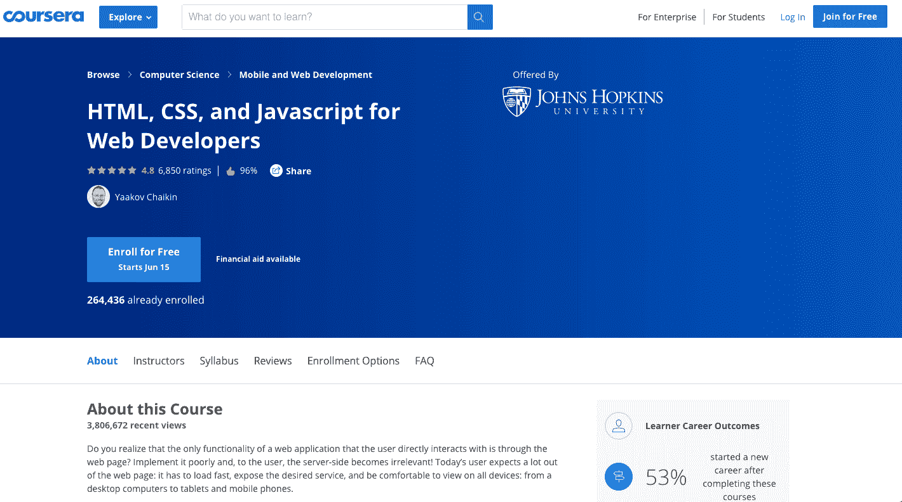
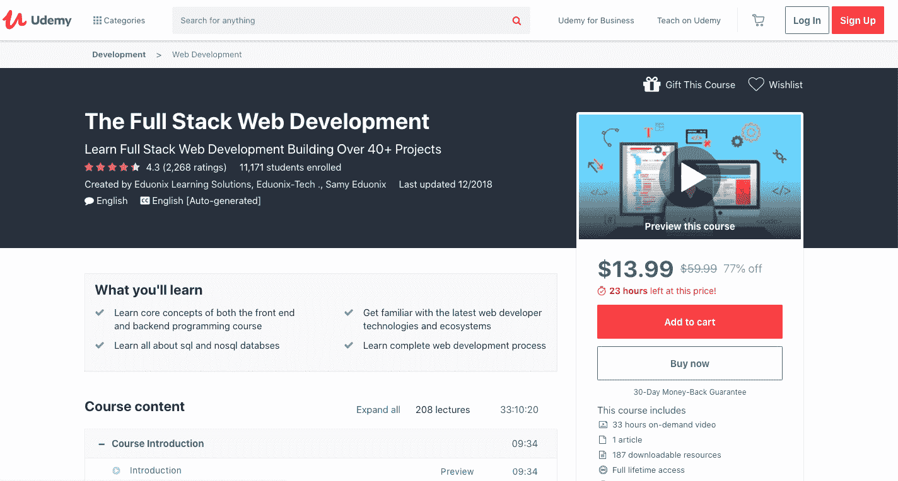
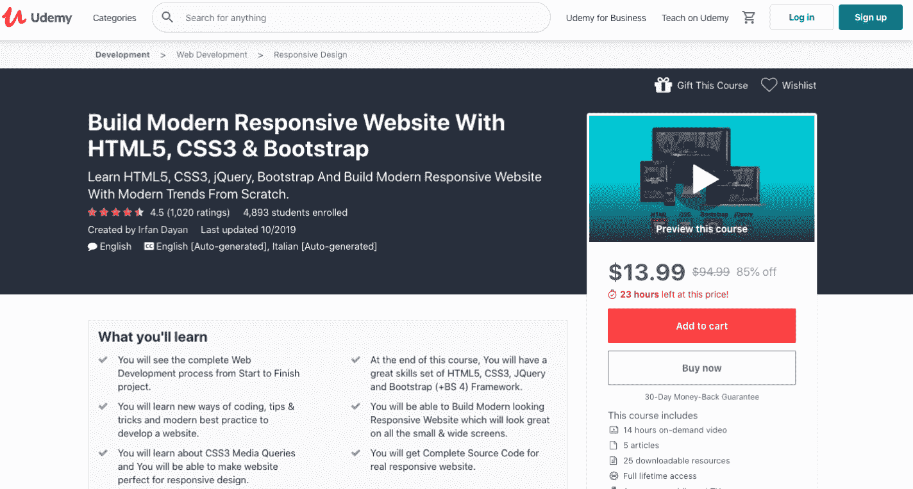

# 2023 年 Web 开发 10 大最佳 HTML 课程[更新]

> 原文：<https://hackr.io/blog/best-html-courses>

我们的网站开发者团队和全球专家已经编辑了以下 2023 年在线最佳 HTML 课程列表。这些包括免费和付费的学习资源，适合初学者、中级和专家水平。

## 最佳 HTML 课程

最好的 HTML 课程如下。

Coursera 为初学者提供了评价很高的 HTML 课程，该课程由约翰·霍普斯金大学的兼职教授 Yaakov Chaikin 教授。他是研究生计算机科学的教授，精通软件开发生命周期的不同阶段。他因解释软件开发过程中遵循的需求、架构和实现过程而闻名。Coursera 为 web 开发者提供 HTML CSS JavaScript 的 HTML 课程。所有相关的工具都在这个证书下教授，包括学习如何使用 HTML 和 CSS 实现现代网页，排列和重新排列代码页，并相应地自动调整大小。我们的网页开发团队认为 Coursera 课程是 2023 年最适合你的课程。

课程的特点:

1.  你将学习编码的网页，不需要任何捏和缩放。
2.  提供 JavaScript 的介绍模块
3.  参加这个项目不需要任何编程语言的知识
4.  您将能够在五周的学习时间内完成课程，并且每天投入最多 2 小时的专门学习时间。
5.  曾在约翰·霍普金斯大学任教的著名讲师的支持。

[在此注册](https://coursera.pxf.io/WDvygZ)

Udemy 提供了一门 HTML 课程，在这门课程中，你将学习网页设计、网站的专业建设、大型项目的代码创建以及其他各种各样的知识。本课程由 Jonas Schmedtmann 主持，他是一位经验丰富的杰出的 web 开发人员、设计人员和教师。他在 Udemy 获得了最高的评分和评论，拥有工程学硕士学位，对教学充满热情。本课程将通过提供点播视频、文章和其他补充资料，让你掌握最好的知识。

课程的特点:

1.  你将学习设计和编码大型项目。
2.  有吸引力和响应性的网站的专业建设将成为可能。
3.  测试和尝试从零开始建立一个专业网站的方法。
4.  了解 jQuery 效果，如粘性导航、动画和滚动效果。
5.  你可以利用免费的电子书携带重要的课程材料。
6.  全职访问 11.5 小时的点播视频、7 个补充资源和 11 篇文章，通过多种方式增加您的知识和技能

[在此注册](https://click.linksynergy.com/deeplink?id=Qouy7GhEEFU&mid=39197&murl=https://www.udemy.com/course/design-and-develop-a-killer-website-with-html5-and-css3/)

Udemy 为中级和专家级学生推出了另一门课程。本课程由 Andrei Neagoie 主持，他精通 HTML5、CSS3、Node、JavaScript 和各种其他语言。Andrei Neagoie 以擅长教授代码和完成 web 开发人员课程而闻名，该课程采用易于理解的语言和友好的学习环境。他是一名高级软件开发人员，在硅谷和多伦多工作。“零到精通”是一门 26 小时的综合课程，要求学生每天投入 3 小时学习、练习代码和应用 web 开发程序。本课程将有助于填补其他在线课程中观察到的不提供完整教育的空白。

本课程的特点包括:

1.  你将获得 26 小时的视频点播、64 种补充资源和 75 篇与课程材料相关的文章。
2.  很好的解释和全面的覆盖了学习过程中 HTML 的每个方面
3.  接收教程，为成为一名 web 开发人员打下坚实的基础。
4.  除了 HTML，你还将学习 HTML5，高级 HTML，CSS，CSS3，Bootstrap 3，JavaScript 和 DOM 操作。
5.  还将提供后端基础课程，如 NPM、NPM 脚本和 Git。

[在此注册](https://click.linksynergy.com/deeplink?id=Qouy7GhEEFU&mid=39197&murl=https://www.udemy.com/course/the-complete-web-developer-zero-to-mastery/)

Coursera 提供了另一门提供网络开发基础的课程，旨在教授设计和创建有吸引力和响应性的网站。Charles Severance 是一名副教授和博士讲师，他讲授了课程的重要部分。本课程增加了特别的部分，提到了 HTML5 的介绍，CSS3 的介绍，以及与 JavaScript 的交互。本课程旨在向学生介绍 HTML 和其他语言的知识，这些知识构成了下一阶段的内容，包括 HTML5、CSS3 和 JavaScript。

本课程的各种特点如下。

1.  它支持点对点的学习过程。
2.  课程中会讨论每一个部分，并且会优先处理问题。
3.  您可以选择在课程的任何时间注册整个证书。
4.  它得到了密歇根大学的支持。
5.  顶点项目提供给学生，以发展他们的创造力和使用 HTML 的专业知识。

[在此注册](https://coursera.pxf.io/BXVnBW)

Udemy 又推出了另一门关于 HTML 和 CSS 的真实世界编码课程。本课程由布拉德·希夫主持，他是一位著名的 web 开发人员，也是一位经验丰富的专业人士。他的学生在财富 100 强公司工作，被认为是他们领域的佼佼者。布拉德·希夫也是一名网页设计师和前端开发人员，这使他具备丰富的知识和技能，可以向学生提供深入的知识。本课程由 HTML 和 CSS 基础课程组成。除此之外，还将传授有关 Sass 的知识。该课程最为成功，已有 15，000 多名学生参加，并被评为最佳课程。

本课程的特点如下:

1.  该培训师已经教授了 35，000 多名学生，并获得了与会者的最高评分。
2.  它提供了 9 个小时的承诺需求视频教程。
3.  不需要有任何计算机语言或编程的知识
4.  易于理解和愉快的教学方式是这个项目的主要特点。
5.  这门课程从零开始提供学习帮助。

[在此注册](https://click.linksynergy.com/deeplink?id=Qouy7GhEEFU&mid=39197&murl=https://www.udemy.com/course/web-design-for-beginners-real-world-coding-in-html-css/)

Coursera 和杜克大学一起开发了一门编程基础课程，同时提供 HTML 和 CSS 认证 T4。编程基础是由苏珊 H 罗杰，谁是目前的实践计算机科学教授和罗伯特·杜瓦尔，谁是计算机科学讲师授课。其他各种知名的学院也是这个项目的一部分。这个程序包含了 HTML 的所有基础知识，包括函数、循环、条件语句等等。该项目旨在培养参与者解决问题的能力，并使[成为一名职业程序员](https://hackr.io/blog/how-to-become-a-web-developer)。与会者将学习利用 HTML、CSS 和 JavaScript 构建有吸引力和响应性的网页的最佳方法。想在计算机编程领域重新开始的人会发现这门课程对他们来说是个理想的开始。

该计划的主要特点:

1.  你将学会创建一个具有段落、图像和链接的交互式的、有吸引力的网页。
2.  学习使用 CSS IDs 和类的方法。
3.  深入了解如何使用 Alert、onClick、OnChange 等功能以及 image canvas 等输入功能。
4.  对初学者来说，这是一个轻松而良好的开端
5.  通过阅读材料、文章和视频链接，提供了亲切友好、信息量丰富的教学。

[在此注册](https://coursera.pxf.io/rnqab5)

对于那些不确定自己能否掌握计算机语言知识和技能的人，Lynda 提供了一个免费的教程，帮助新来者免费获得成千上万的视频、课程材料和文章。然而，如果你需要更多的帮助和辅导，你可以额外付费。这样，你可以免费学习和练习 HTML，如果需要额外的辅导，你也可以自己选择。

该计划的特点:

1.  获取成千上万的课程材料和文章。
2.  整个课程是免费的。
3.  可以以最低的成本请求额外的帮助。
4.  你也可以选择继续学习其他语言，比如 CSS、HTML5、CSS3、JavaScript 等等。
5.  所有人都可以免费订阅。

[在此注册](https://linkedin-learning.pxf.io/ORb3rQ)

 Udemy 推出了[全栈 Web Developer 课程](https://hackr.io/blog/best-web-development-courses)，在过去的许多年里一直很成功。本课程由一位训练有素、经验丰富的 Web 开发人员和教育家“Kalob Taulein”教授，他自 1999 年以来一直从事这一领域的工作。本课程涵盖了大部分课程材料，包括 HTML、HTML5、CSS、CSS3、PHP、jQuery 和 JavaScript。参加者从零开始接受培训和教育。教师的能力表现在使概念清晰并能被与会者高度理解。这是一个 21 小时的课程，迄今已有 70，000 多名专业人员参加。这是最受欢迎的节目之一。

该计划的主要特点:

1.  你将增加你在 HTML、HTML5、CSS、CSS3、PHP、MySQL 和 JavaScript 方面的知识和技能，这些都是就业行业的高需求。
2.  将教授服务器代码执行和保存数据。
3.  讨论和重点将放在 HTML 基础、HTML 高级和 HTML5 的学习上。
4.  将有关于 CSS、CSS Advanced 和 CSS5 的专题讲座。
5.  你的学习过程将由 21 小时的视频、14 个补充资料和 5 篇文章支持。

[在此注册](https://click.linksynergy.com/deeplink?id=Qouy7GhEEFU&mid=39197&murl=https://www.udemy.com/course/the-full-stack-web-development/)

 Udemy 推出了现代响应式网站课程，用于教授 HTML、HTML5、CSS、CSS3 和 Bootstrap。本课程将帮助参加者建立一个现代化的响应网站，从而轻松进入就业市场，找到他们梦想的工作。该课程由 Irfan Dayan 主持，他是一名 web 开发人员，也是 JavaScript、HTML、HTML5、 [CSS 和 CSS3](https://hackr.io/blog/difference-between-css-css2-and-css3) 方面的专家。Irfan Dayan 通过在线教学媒介教授了超过 10 万名学生，并分享了编程和开发各个领域的知识。

课程的主要特点:

1.  你将能够创建一个大、小屏幕的现代响应网站。
2.  学习新的编码风格来开发一个有吸引力和有用的网站。
3.  深入了解 Bootstrap 和 jQuery。
4.  获得 13 小时的视频点播、24 个补充资源和 6 篇文章。
5.  培训师的实践课程和专业知识将有助于轻松掌握学习过程。

[在此注册](https://click.linksynergy.com/deeplink?id=Qouy7GhEEFU&mid=39197&murl=https://www.udemy.com/course/build-modern-responsive-website-with-html5-css3-bootstrap/)

伦敦大学为创建响应性网站和设计专业化推出了首个在线课程。本课程由计算系讲师 Matthew Yee-King 博士、计算系高级讲师 Marco 博士和 Kate Devlin 博士主持。他们是经验丰富的专业教师，总共教过 50 多万名学生。本课程提供对 HTML、JavaScript 和 CSS 的学习支持。与会者被引导获得关于创建网页、控制布局和样式的深入知识，目的是使网页支持交互性。除此之外，使用 Bootstrap 通过 CSS 库添加知识和技能，以便可以在 HTML 中创建更有创意的布局。

该课程的特点包括如下。

1.  被伦敦大学认可。
2.  作业和测验有助于提高学习的速度。
3.  传达了关于 JavaScript 变量和函数的深入知识。
4.  您将学习使用 JavaScript 操作网页内容。
5.  教员定期提供帮助。

[在此注册](https://www.classcentral.com/course/website-development-18920)

## 结论

上述是我们的专家小组选出的最好的 HTML 课程，这些课程被认为有助于参与者获得他们所需的新知识和技能，以获得 HTML 和其他语言的专业知识。这些课程都是在线的，提供了在任何时间上课的便利。

如果你想利用你的 HTML 技能建立自己的网站，我们建议你使用 name cheap[购买你的域名](https://www.namecheap.com/?clickID=wUoTbQ3KtxyNR9L3K50RiSEKUkAx6n2NkXBZwI0&irgwc=1&utm_source=IR&utm_medium=Affiliate&utm_campaign=2890636&affnetwork=ir&ref=ir)和[虚拟主机服务](https://www.namecheap.com/hosting/shared/?clickID=wUoTbQ3KtxyNR9L3K50RiSEKUkAx6E09kXBZwI0&irgwc=1&utm_source=IR&utm_medium=Affiliate&utm_campaign=2890636&affnetwork=ir&ref=ir)。它们是业内最好的，而且超级实惠。

你还有什么想和我们社区分享的课程吗？请在下面的评论中告诉我们！

**人也在读:**