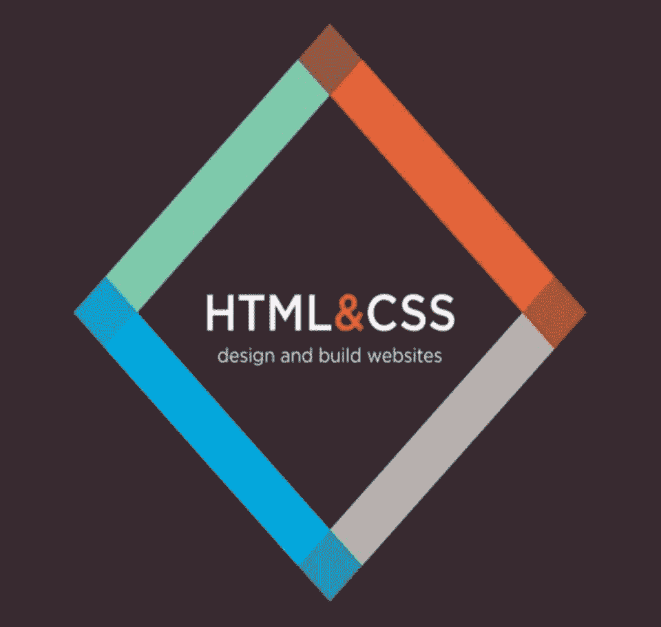
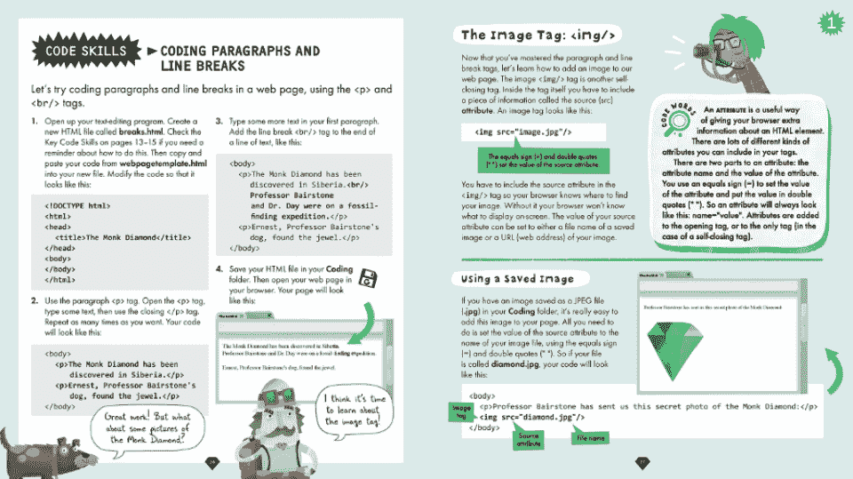
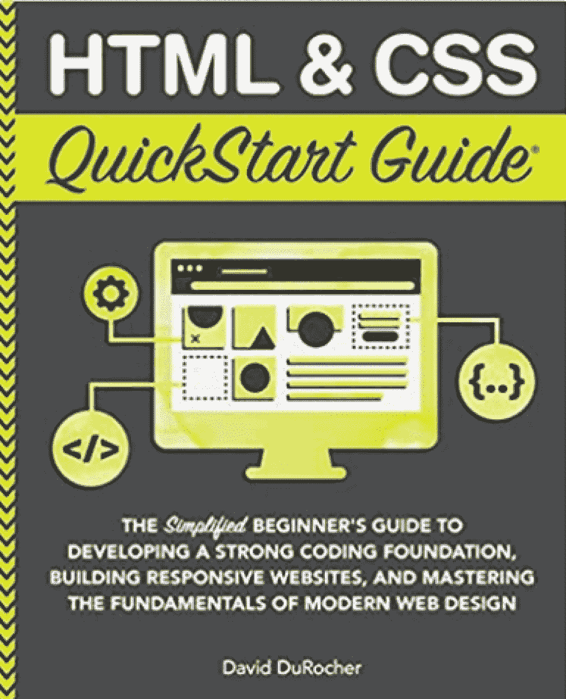
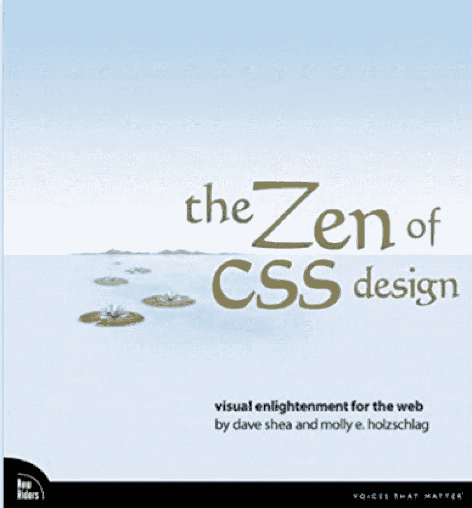
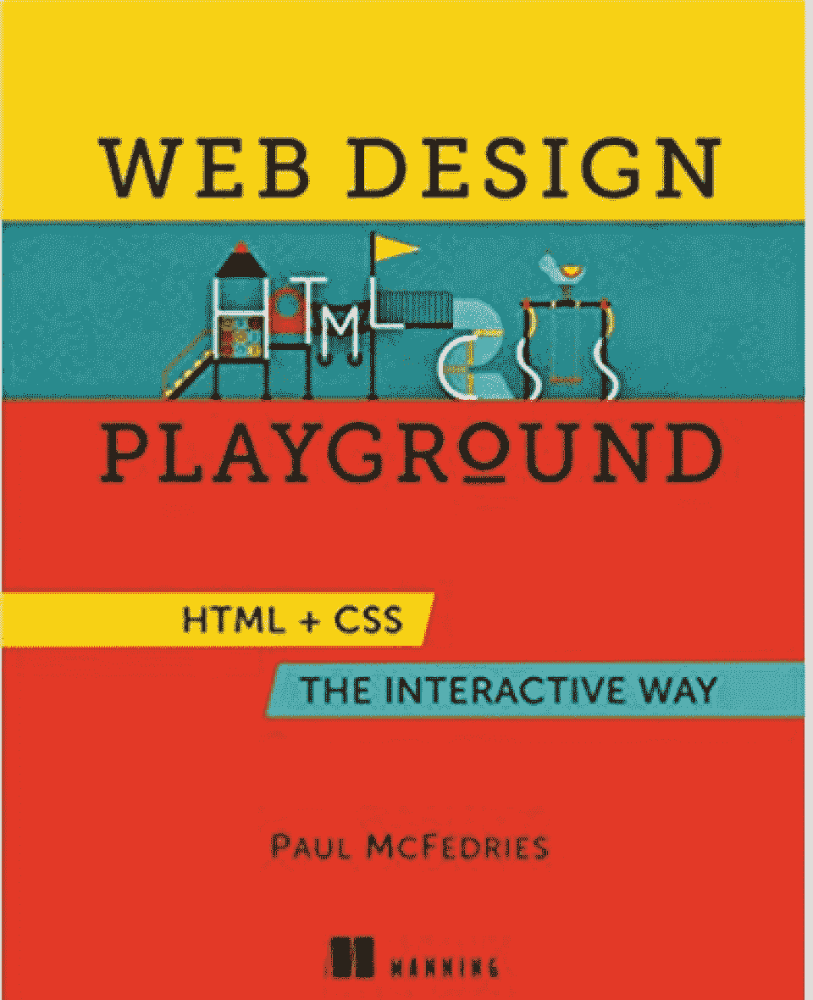
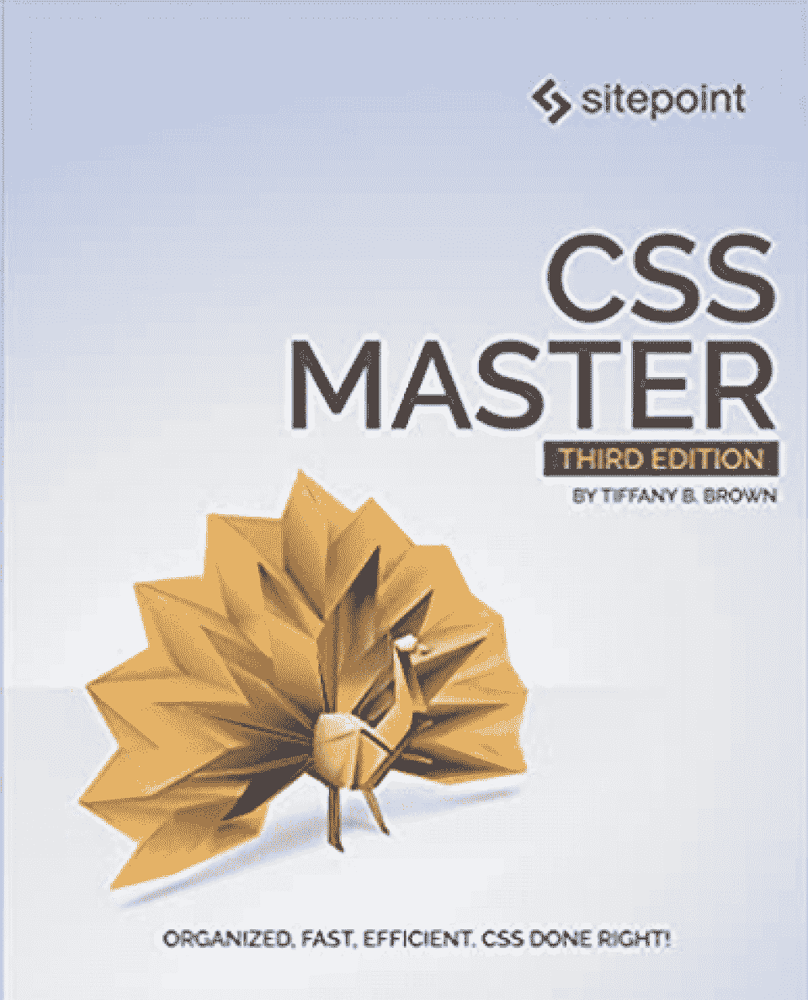
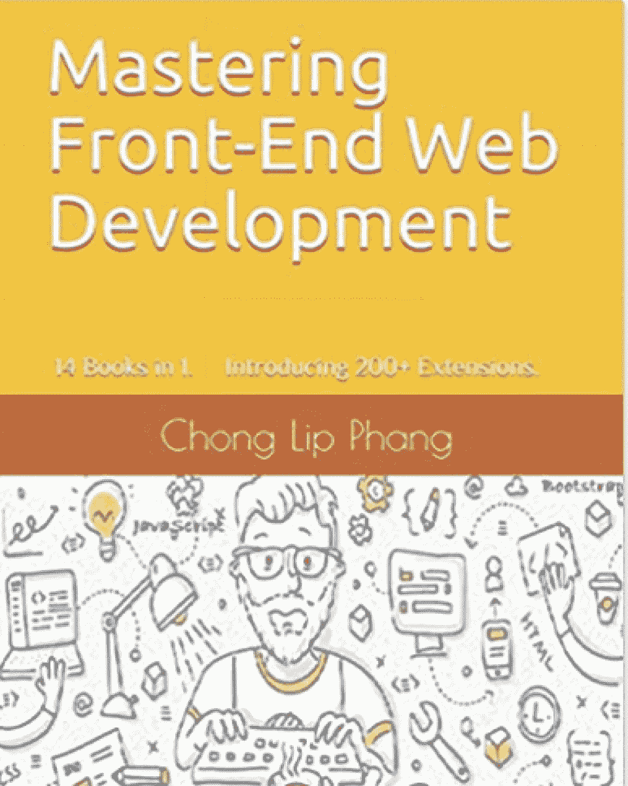
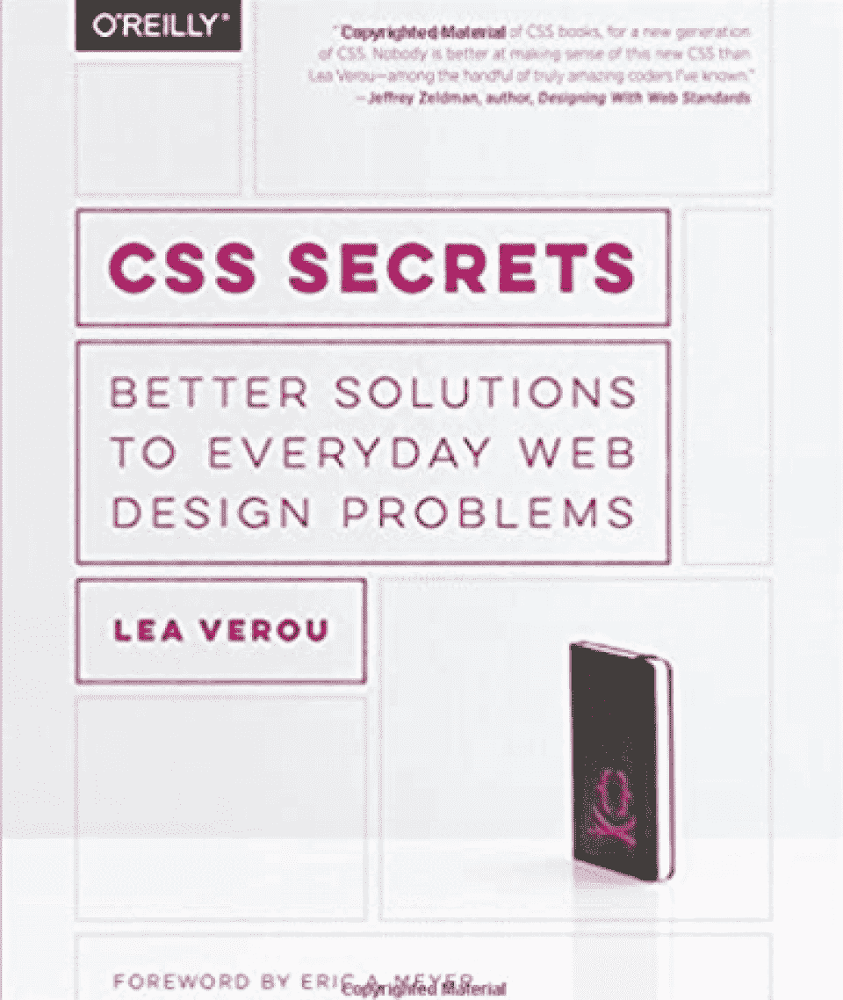
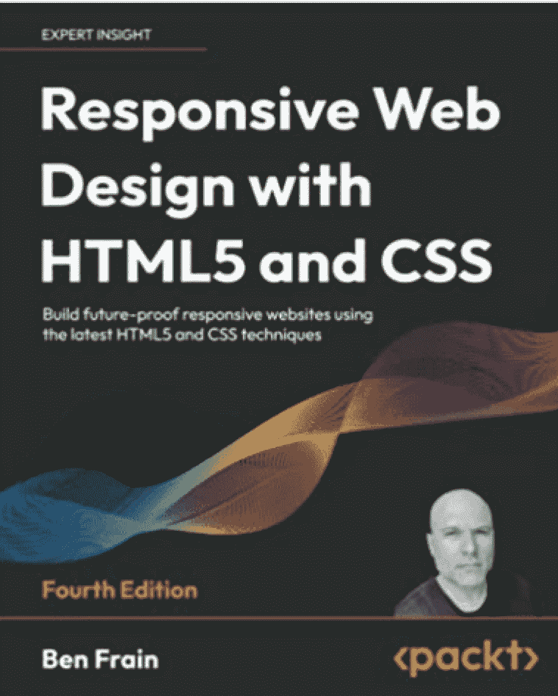
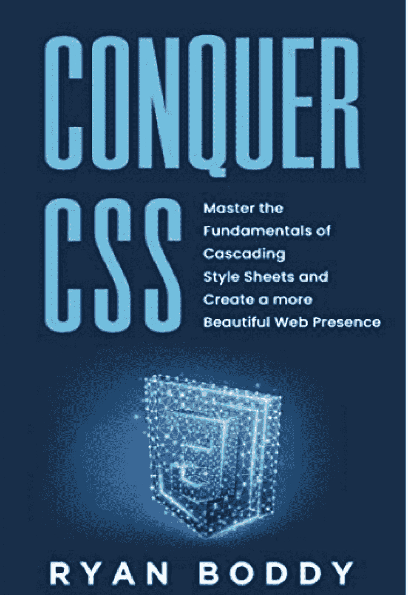

# 初学者和专业人士的 10 本最佳 HTML/CSS 书籍[2023]

> 原文：<https://hackr.io/blog/best-html-css-books-for-beginners>

你是计算机科学一年级的学生吗？入门级 web 程序员？或者，您可能是一名经验丰富的前端开发人员，希望提高自己的技能。

HTML 书籍对于任何有兴趣提高编程水平的人来说都是极好的资源。无论你在学校需要帮助解决编码问题，还是想在参加[课程](https://hackr.io/blog/best-html-courses)之前先尝试一下，一本 HTML 编程书籍都可以给你提供急需的帮助。

但是市场上有这么多 HTML/CSS 书籍，如何挑选最有信誉的呢？快速浏览亚马逊会看到一堆正面和负面的评论，让你质疑你的潜在购买。

我们已经帮你完成了繁重的工作，并且收集了今年最好的 HTML 和 CSS 书籍。让我们开始吧！

## **是什么造就了最好的 HTML 和 CSS 书籍？**

在我们进入书籍本身之前，让我们探索一下我们用来将书籍列入我们的列表的标准。

HTML 和 CSS 的最佳书籍与平庸书籍的区别是什么？

以下是我们需要注意的一些事情:

*   相关性:任何 2011 年的书都是不相关的，除非它们定期更新新版本。[编码](https://www.forbes.com/sites/forbestechcouncil/2021/01/13/14-tech-leaders-share-how-they-get-into-the-coding-groove/?sh=6de9798fc1d0)世界每年都在变化，所以我们只寻找最近出版或至少更新的书籍。

*   **交互性:**书籍不同于 HTML 或 [CSS 教程](https://hackr.io/tutorials/learn-css)，课程或证书。然而，有些书在文本中注入了一定程度的互动性。你可能会注意到一些练习编码的实验，甚至是辅助的在线资源来帮助你练习。

*   **评论:**我们评估读者评论，以了解不同层次的编码人员如何体验每本书。当然，一些负面评论并不能否定某本书的优秀。也许对一个开发者来说最好的 CSS 书籍对另一个开发者来说不一样。视觉学习、体验和偏好都在准确描述书籍体验的评论中发挥作用。

*   **作者凭据和经验:**我们看每个作者的编码经验。你会发现我们列表中的一些 HTML 书籍并不是由畅销书作者写的。但是如果他们有多年在大学或在线课程中教授 HTML 或 CSS 的经验呢？或者他们是否曾在一家知名公司担任高级开发人员？这对读者来说很有价值。

*   例子和图片:如果文本一页一页地写下去，即使是最好的 HTML 和 CSS 书籍也会变得很枯燥。我们寻找那些以一口大小的篇幅传递信息，并附有大量例子和图片的书籍。

那么，给定所有这些标准，哪本书最适合 HTML 呢？这取决于你，但我们已经编制了一些选项。

## 初学者最佳 HTML 书籍

[****](https://www.amazon.com/HTML-CSS-Design-Build-Websites/dp/1118008189 "HTML & CSS: Design and Build Websites")

作者 John Duckett 从事过各方面的 web 开发工作，从初创公司到像 Nike 和 Diesel 这样的全球巨头。所以，他给 HTML & CSS 带来了丰富的知识:设计和构建网站。此外，印刷的例子和丰富多彩的图形使它比通常冗长、无聊的编码书读起来更快。

这本书对任何开始学习 HTML 和 CSS 的人来说都是理想的。“你可以学习如何从头开始创建一个基本的网站，并在 PC 和 Mac 上编码，”Stavros Zavrakas 说，他是一名拥有十多年经验的全栈网络开发人员，也是软件公司 Orthogonality 的创始人。

Zavrakas 认为这是关于 HTML 和 CSS 初学者的最佳书籍，并且在他早年的编码生涯中多次引用过。

*   **主题:**网页设计和结构，排版和布局，实用编码练习
*   **评分:** 5/5
*   价格: $15.79

[拿到这里。](https://www.amazon.com/HTML-CSS-Design-Build-Websites/dp/1118008189)

[****](https://www.amazon.com/Get-Coding-Learn-JavaScript-Website/dp/076369276X/ref=sr_1_13?crid=23S9TAE0WVP37&keywords=html+book&qid=1664303649&qu=eyJxc2MiOiIyLjQ2IiwicXNhIjoiMi4zNiIsInFzcCI6IjEuOTIifQ%3D%3D&s=books&sprefix=html+boo%2Cstripbooks%2C64&sr=1-13)

这是一本初学者友好的 HTML 书，最适合儿童和青少年。如果你是一名高中毕业生，打算在大学里进行 web 开发，那就去编程吧！提供无压力、基于故事的编码体验。有了插图和超级易访问的布局，信息被直观地分成容易消费的部分。

感觉自己像个无业游民？这本书是给你的！你将阅读并完成“任务”,这些任务让你比以前更了解一个编码方面。另外，你将能够[创建一个基本的网站](https://hackr.io/blog/how-to-create-a-website-using-html)。

我们的建议？用这个来尝试一下，但是不要依赖它作为一个全面的 HTML 教程。

*   主题: HTML 基础知识，网页项目
*   **评级:** 4/5
*   价格: $11.59

[拿到这里。](https://www.amazon.com/Get-Coding-Learn-JavaScript-Website/dp/076369276X/ref=sr_1_13?crid=23S9TAE0WVP37&keywords=html+book&qid=1664303649&qu=eyJxc2MiOiIyLjQ2IiwicXNhIjoiMi4zNiIsInFzcCI6IjEuOTIifQ%3D%3D&s=books&sprefix=html+boo%2Cstripbooks%2C64&sr=1-13)

[****](https://www.amazon.com/HTML-CSS-QuickStart-Guide-Fundamentals/dp/1636100007/ref=asc_df_1636100007/?tag=googleshopc0c-20&linkCode=df0&hvadid=459570636679&hvpos=&hvnetw=g&hvrand=9181253231048880533&hvpone=&hvptwo=&hvqmt=&hvdev=c&hvdvcmdl=&hvlocint=&hvlocphy=9000360&hvtargid=pla-1155539739827&psc=1)

作者兼 web 开发人员 David DuRocher 涵盖了初学者所需的所有知识:设计、结构、标签、格式、工作流、调试等等。他甚至包括了一整章关于 Git 的内容——每个程序员都使用的 DevOps 源代码管理工具。

初学者和有经验的程序员推荐这本书，并称赞它包含了真实世界的例子，如 HTML 片段。在深入研究之前，不要忘记下载一个强大的文本或[代码编辑器](https://hackr.io/blog/best-css-editor)。

亚马逊上的一位评论者将这本书描述为非线性学习者的理想之选，允许你跳来跳去，从头到尾尝试新事物。唯一的缺点是电子书版本需要注册电子邮件才能访问内容。虽然作者有着良好的背景，但强制性的信息抓取很容易让人产生厌恶的感觉。

*   **主题:**样式、标签、元素、格式化、调试、Git
*   **评级:** 4.5/5
*   价格: $25.19

[拿到这里。](https://www.amazon.com/HTML-CSS-QuickStart-Guide-Fundamentals/dp/1636100007/ref=asc_df_1636100007/?tag=googleshopc0c-20&linkCode=df0&hvadid=459570636679&hvpos=&hvnetw=g&hvrand=9181253231048880533&hvpone=&hvptwo=&hvqmt=&hvdev=c&hvdvcmdl=&hvlocint=&hvlocphy=9000360&hvtargid=pla-1155539739827&psc=1)

[****](https://www.amazon.com/Zen-CSS-Design-Visual-Enlightenment/dp/0321303474/ref=zg_bs_379357011_sccl_12/133-1764205-1035324?pd_rd_i=0321303474&psc=1#customerReviews)

对设计情有独钟？你会喜欢这个 CSS 艺术的集合——带有技术解释和布局原则的成功例子——在 CSS 设计的禅中。合著者 Molly Holzschlag 是网页设计界的知名人物，已经写了大约 20 本书。

探索色彩，灯光，布局，图像，以及来自才华横溢的 CSS 编码更多。我们的份额？这是视觉学习者的最佳 CSS 书籍。记住，这不是一本如何使用 CSS 的书；相反，它是 CSS 设计的一个展示，在这里您可以观察到其他示例性的编码示例。

*   主题:图像、布局、重建、排版、CSS
*   **评级:** 4/5
*   价格: $29.95

[拿到这里。](https://www.amazon.com/Zen-CSS-Design-Visual-Enlightenment/dp/0321303474/ref=zg_bs_379357011_sccl_12/133-1764205-1035324?pd_rd_i=0321303474&psc=1#customerReviews)

[****](https://www.amazon.com/Web-Design-Playground-HTML-Interactive/dp/1617294403/ref=sr_1_1?crid=2SD4XL0PSWHC1&keywords=web+design+playground&qid=1664448616&qu=eyJxc2MiOiIwLjY1IiwicXNhIjoiMC40NSIsInFzcCI6IjAuNTkifQ%3D%3D&s=books&sprefix=web+design+playground%2Cstripbooks-intl-ship%2C84&sr=1-1)

这本书适合初学者和中级编码人员。它从 HTML 和 CSS 基础开始，但前进到 ID 和上下文选择器、高级排版、配色方案和 HTML5 等主题。

此外，它是真正的互动。这本书包括一个有用的网络补充工具，你可以在那里学习教程和练习你的代码！我们注意到的唯一缺点是一些评论指出缺少文本、印刷质量差和缺少例子。

*   **主题:**标签、文本元素、图像和媒体、高级 CSS 选择器和[框架](https://hackr.io/blog/best-css-frameworks)，作品集创作
*   **评级:** 4/5
*   **价格:**30.90 美元

[拿到这里。](https://www.amazon.com/Web-Design-Playground-HTML-Interactive/dp/1617294403/ref=sr_1_1?crid=2SD4XL0PSWHC1&keywords=web+design+playground&qid=1664448616&qu=eyJxc2MiOiIwLjY1IiwicXNhIjoiMC40NSIsInFzcCI6IjAuNTkifQ%3D%3D&s=books&sprefix=web+design+playground%2Cstripbooks-intl-ship%2C84&sr=1-1)

[****](https://www.amazon.com/CSS-Master-Tiffany-B-Brown/dp/1925836428/ref=cm_cr_arp_d_pl_foot_top?ie=UTF8)

如果你已经精通 CSS，这本书将帮助你更深入地研究盒子模型和层叠——并利用它们创建令人难以置信的应用程序。这本书涵盖了 CSS 和 SVG 图形，过滤器和动画，以及复杂的布局技巧。

前端开发者会磨练自己的手艺，后端开发者可以无缝的探索前端的东西。我们也感谢作者致力于经常更新这本书以捕捉新的 CSS 发展。

*   主题: CSS 组织，网格和多栏布局，高级效果，如过渡，自定义属性，CSS 和 SVG 图形，
*   **评级:** 4.5/5
*   价格: $24.94

[拿到这里。](https://www.amazon.com/CSS-Master-Tiffany-B-Brown/dp/1925836428/ref=cm_cr_arp_d_pl_foot_top?ie=UTF8)

## **高级程序员最佳 HTML 编程书籍**

[****](https://www.amazon.ca/Mastering-Front-End-Web-Development-Introducing/dp/B08NS9J6RY)

作者 Chong Lip Phang 拥有十多年撰写 web 开发书籍的经验，这本书展示了自己出版的作品——权威奖励。他涵盖了广泛的标记语言，但关于 HTML 5.2 和 CSS 3 的详细章节对有经验的 web 开发人员来说尤其有见地。

他还展示了关于当今 web APIs 的广泛知识和研究，包括 200 多个 web 扩展。然而，由于缺乏指数，Phang 失去了一分。

*   主题:HTML 5.2，CSS 3，网络扩展，API

[拿到这里。](https://www.amazon.ca/Mastering-Front-End-Web-Development-Introducing/dp/B08NS9J6RY)

[****](https://www.amazon.com/CSS-Secrets-Solutions-Everyday-Problems/dp/1449372635/ref=d_pd_sbs_sccl_2_11/133-1764205-1035324?pd_rd_w=gewHG&content-id=amzn1.sym.3676f086-9496-4fd7-8490-77cf7f43f846&pf_rd_p=3676f086-9496-4fd7-8490-77cf7f43f846&pf_rd_r=YKHC23RXKZYT4MR8NBMZ&pd_rd_wg=41B1j&pd_rd_r=ba087157-b620-403c-b6d7-09f979dfacbe&pd_rd_i=1449372635&psc=1#customerReviews)

如果你已经是一个经验丰富的 web 开发人员，这本书涵盖了你在工作中会遇到的棘手问题。这是一篇高级文章，有专门的章节来解决常见的错误。读者称赞作者 Lea Verou 像微风一样带他们通过技术交流的能力。

Verou 来自希腊莱斯沃斯，在麻省理工学院计算机系任教。Sci 和 AI 部门。

我们也喜欢 *CSS 秘密*的布局。文本不会漫无边际，而是由有用的侧边栏、例子和引人入胜的颜色分隔开来。

*   **主题:**背景和边框、文本混合、全屏 API、阴影和着色、玻璃和边角效果、逐帧动画等等
*   **评分:** 5/5
*   价格: $21.99

[拿到这里。](https://www.amazon.com/CSS-Secrets-Solutions-Everyday-Problems/dp/1449372635/ref=d_pd_sbs_sccl_2_11/133-1764205-1035324?pd_rd_w=gewHG&content-id=amzn1.sym.3676f086-9496-4fd7-8490-77cf7f43f846&pf_rd_p=3676f086-9496-4fd7-8490-77cf7f43f846&pf_rd_r=YKHC23RXKZYT4MR8NBMZ&pd_rd_wg=41B1j&pd_rd_r=ba087157-b620-403c-b6d7-09f979dfacbe&pd_rd_i=1449372635&psc=1#customerReviews)

[****](https://www.amazon.com/Responsive-Web-Design-HTML5-CSS/dp/180324271X/ref=sr_1_2?crid=1GRVLN5WL9UW7)

Beta365 技术负责人 Ben Frain 自 1996 年以来一直是一名 web 开发人员——对于我们列表中的高级 HTML 书籍来说，这是一个相当不错的背景。

这本书非常适合具有高级 CSS 和 HTML 背景的人，因为它探索了最新的发展，如网格和子网格布局，宽色域颜色等。

Frain 今年更新了第 4 版，评论者称赞了作者易懂的写作、丰富的例子和 Flexbox 章节。

*   **主题:**可访问性一致性、媒体查询、流体布局、CSS 选择器和颜色函数、阴影、渐变、滤镜、图层、截断、前沿新功能
*   **评分:** 5/5
*   价格: $44.99

[拿到这里。](https://www.amazon.com/Responsive-Web-Design-HTML5-CSS/dp/180324271X/ref=sr_1_2?crid=1GRVLN5WL9UW7)

## **奖励 HTML 和 CSS 书籍**

[****](https://www.amazon.com/Conquer-CSS-Fundamentals-Cascading-Beautiful-ebook/dp/B0B2MMG3C2/ref=sr_1_6?crid=3PJ849RQ0XBLL&keywords=html+and+css+history&qid=1664455730&qu=eyJxc2MiOiIxLjYzIiwicXNhIjoiMC4wMCIsInFzcCI6IjAuMDAifQ%3D%3D&s=books&sprefix=html+and+css+histor%2Cstripbooks-intl-ship%2C78&sr=1-6#customerReviews)

渴望一个负担得起的，休闲的 CSS 阅读？我们将这本额外的 CSS 书籍加入我们的列表，因为它是一种流畅的、令人愉快的阅读体验。此外，评论者将它描述为一个在常规 CSS 任务中支持他们的简单参考。

*   主题: CSS 组织、响应单元、前处理器和后处理器
*   **评级:** 4/5
*   价格: $9.99

[拿到这里。](https://www.amazon.com/Conquer-CSS-Fundamentals-Cascading-Beautiful-ebook/dp/B0B2MMG3C2/ref=sr_1_6?crid=3PJ849RQ0XBLL&keywords=html+and+css+history&qid=1664455730&qu=eyJxc2MiOiIxLjYzIiwicXNhIjoiMC4wMCIsInFzcCI6IjAuMDAifQ%3D%3D&s=books&sprefix=html+and+css+histor%2Cstripbooks-intl-ship%2C78&sr=1-6#customerReviews)

## **结论**

HTML 书籍提供了来自著名成功程序员的无尽知识。它们是轻松阅读、解决问题的有用资源，也是针对较难的 HTML 和 CSS 查询的专家建议。

但是书本不足以传授你的编程知识。将它们与课程、[认证](https://hackr.io/blog/html-certifications)和项目结合起来，磨练你的技能。从我们的列表中挑选一本书，作为技能培养 HTML 项目的参考！

**[用 HTML 项目练习你的技能](https://hackr.io/blog/html-projects)**

如果你想利用你的 HTML 技能来建立自己的网站，我们建议你使用 name cheap[购买域名](https://www.namecheap.com/?clickID=wUoTbQ3KtxyNR9L3K50RiSEKUkAx6n2NkXBZwI0&irgwc=1&utm_source=IR&utm_medium=Affiliate&utm_campaign=2890636&affnetwork=ir&ref=ir)和[虚拟主机服务](https://www.namecheap.com/hosting/shared/?clickID=wUoTbQ3KtxyNR9L3K50RiSEKUkAx6E09kXBZwI0&irgwc=1&utm_source=IR&utm_medium=Affiliate&utm_campaign=2890636&affnetwork=ir&ref=ir)。它们是业内最好的，而且超级实惠。

## **常见问题解答**

#### **1。可以用 HTML 写书吗？**

当然，你可以用 HTML 写一本书，但是你需要先进的知识和经验。考虑从较小的项目开始，比如登录页面或调查表格。

#### **2。哪本书最适合学习 HTML？**

再好的书也不足以掌握 HTML。然而，约翰·达克特的 *HTML & CSS:设计和建立网站*对许多读者和有经验的开发者来说是一个很好的起点。

#### **3。可以自学 HTML 吗？**

你绝对可以在线自学 HTML！但你不必依赖任何一种方法来做到这一点。自己尝试 HTML 项目，阅读 HTML 书籍，并通过课程或认证获得灵活的指导。

许多 HTML 书籍的读者更喜欢书籍提供的结构，因为在网上查找所有信息可能会感到乏味。