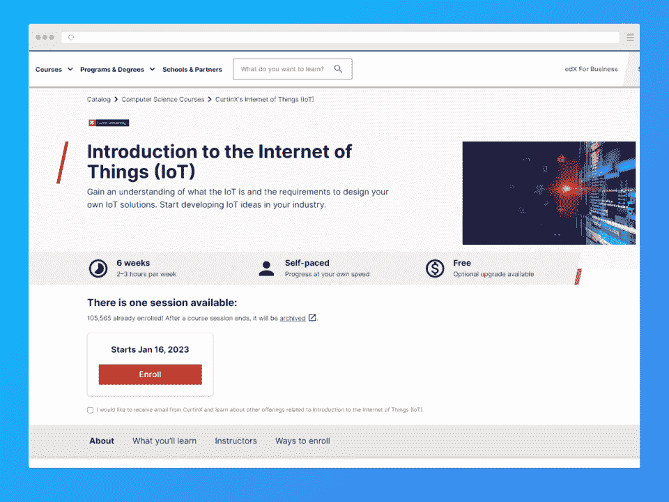
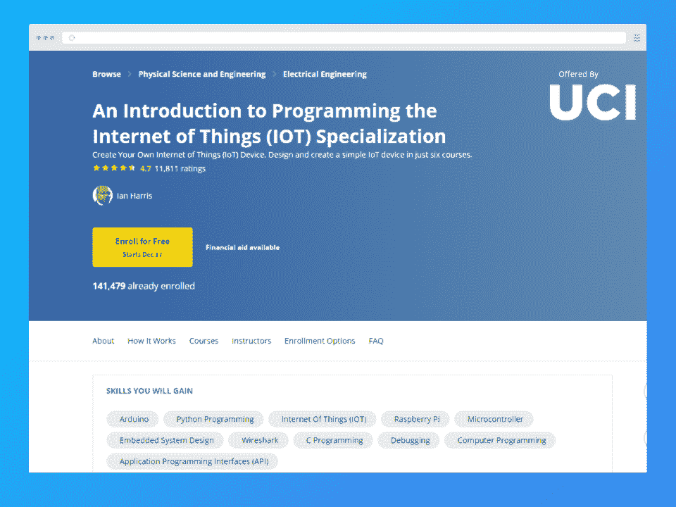
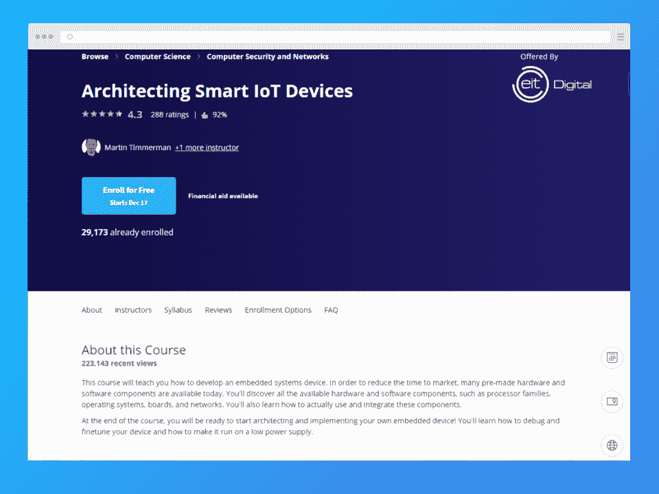
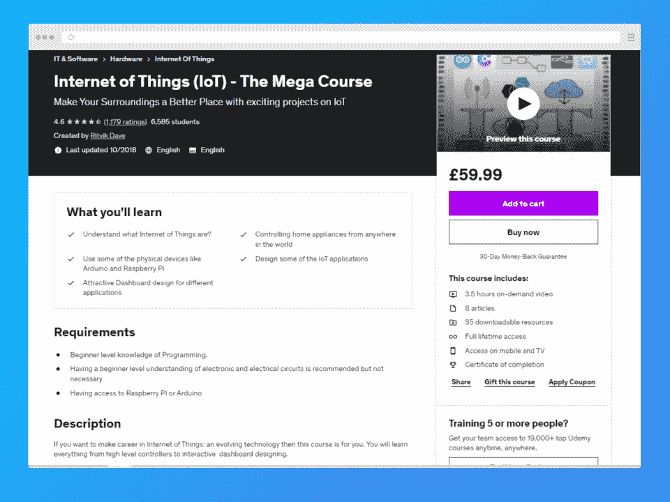

# 物联网课程在线 2023 年【排名】

> 原文：<https://hackr.io/blog/best-iot-courses>

[物联网](https://www.techtarget.com/iotagenda/definition/Internet-of-Things-IoT)描述了设备相互“交谈”,以监控和分析模式和行为——无需人类。你会对我们每天经历的与物联网相关的事情感到惊讶。准备好学习物联网概念了吗？继续读。

用 E-ZPass 开过收费站吗？或者你可能已经要求 Alexa 或谷歌提高或降低你的空调。这些只是物联网融入我们日常生活的几个例子。

此外，职业潜力是广泛和专门的。意思？家庆！雇主寻找的不是软件工程师，而是专门的物联网软件工程师——小众开发者也是如此。

物联网( [IoT](https://hackr.io/blog/what-is-iot) )一直在扩张，在商业领域变得更加有利可图。你想加入吗？幸运的是，你不需要很多时间或金钱来做到这一点。我们将为初学者和高级专业人员提供最佳物联网课程综述，帮助您接触物联网。

## **五大物联网课程:对照表**

[****](https://www.awin1.com/cread.php?awinmid=6798&awinaffid=428263&ued=https%3A%2F%2Fwww.edx.org%2Fcourse%2Fintroduction-to-the-internet-of-things-iot)

完全的初学者，到前面来！如果你对物联网一无所知，从这里开始。该物联网认证提供了您理解物联网基础知识以及如何开始编程和创建解决方案所需的基本知识。本课程将向您介绍物联网的组成、工作原理以及如何为我们周围的世界增加价值。时间不多了？你所需要的是连续六周每周 2-3 小时。

*   导师:阿亚恩·默里，西亚瓦什·卡克萨，任逸飞

*   **价格:**免费，认证证书收费 149 美元

*   **Pro:** 自由选项；非常适合初学者

*   **Con:** 访问时间受限；免费版没有分数

[在此查看更多](https://www.awin1.com/cread.php?awinmid=6798&awinaffid=428263&ued=https%3A%2F%2Fwww.edx.org%2Fcourse%2Fintroduction-to-the-internet-of-things-iot)

[****](https://imp.i384100.net/P03MAX)

仍在初级训练中，但对 Arduino touch 很好奇？这个初学者课程帮助你了解树莓 Pi 平台和 Arduino 环境。在课程结束时，你将完成一个顶点项目，这将允许你把你的新技能测试！

本课程时间稍长，预计每周三小时，持续六个月。抵抗运动？你将学习如何创建一个基于微控制器的系统，你可以向潜在的雇主炫耀。

*   加州大学欧文分校的伊恩·哈里斯

*   **价格:**免费(带订阅)

*   **Pro:** 同行和导师反馈；个性化指导

*   **反对:**没有论坛

[在此查看更多](https://imp.i384100.net/P03MAX)

[****](https://click.linksynergy.com/deeplink?id=jU79Zysihs4&mid=39197&murl=https%3A%2F%2Fwww.udemy.com%2Fcourse%2Fcomplete-guide-to-build-iot-things-from-scratch-to-market%2F%3FranMID%3D39197%26ranEAID%3DJVFxdTr9V80%26ranSiteID%3DJVFxdTr9V80-XJDu5CPCyfFVOkI.Sqg4IQ%26LSNPUBID%3DJVFxdTr9V80%26utm_source%3Daff-campaign%26utm_medium%3Dudemyads)

这是最短的物联网在线课程之一，仅 6.5 小时。如果你不能集中注意力，这个压缩课程不适合你。但是对于那些跟得上的人来说？你会享受到一顿美餐。

享受创建项目的乐趣，如智能灯和设备、带电子邮件通知的运动探测器以及老年人恐慌报警器。

*   **价格:**$ 84.99；30 天退款保证

*   **先决条件:**电子和基本编码背景

*   **Pro:** 可下载的资源和终身课程材料

*   **弊:**无免费版；所需经验

[在此查看更多](https://click.linksynergy.com/deeplink?id=jU79Zysihs4&mid=39197&murl=https%3A%2F%2Fwww.udemy.com%2Fcourse%2Fcomplete-guide-to-build-iot-things-from-scratch-to-market%2F%3FranMID%3D39197%26ranEAID%3DJVFxdTr9V80%26ranSiteID%3DJVFxdTr9V80-XJDu5CPCyfFVOkI.Sqg4IQ%26LSNPUBID%3DJVFxdTr9V80%26utm_source%3Daff-campaign%26utm_medium%3Dudemyads)

[****](https://imp.i384100.net/oeEkPn)

在这个 34 小时的物联网培训项目中，您将考察连接到物联网的预制硬件和软件。您将了解每个系统，如何使用它们，以及如何使它们相互通信。

虽然这门课程是中级的，但它的技术含量让人感觉势不可挡。不过，如果你在开始编程和做出自己的设计之前，正在寻找更多关于物联网的理论信息，这是一门很好的课程。

*   布鲁塞尔皇家军事学院的马丁·蒂默曼和安特卫普大学的马腾·维恩

*   **价格:**证书课程免费，或 49 美元

*   **先决条件(如果有):**物联网和编程知识

*   **Pro:** 物联网上的详细课程；嵌入式系统；丰富的资源

*   反对意见:大量阅读材料

[在此查看更多](https://imp.i384100.net/oeEkPn)

[****](https://click.linksynergy.com/deeplink?id=jU79Zysihs4&mid=39197&murl=https%3A%2F%2Fwww.udemy.com%2Fcourse%2Finternet-of-things-the-mega-course%2F%3FranMID%3D39197%26ranEAID%3DJVFxdTr9V80%26ranSiteID%3DJVFxdTr9V80-StXnxkw1.iNqhqBHG0wQCA%26LSNPUBID%3DJVFxdTr9V80%26utm_source%3Daff-campaign%26utm_medium%3Dudemyads)

如果你已经是一个计算机编程和电子呆子，但想把你的知识付诸实践，这个程序是给你的！这个 3.5 小时的物联网培训将向您介绍物联网、Arduino 和 Raspberry Pi。您还将学习如何通过四个动手项目将您的技能应用到本文中:气象站、水位电子邮件通知器、水位指示器和智能灯泡。

*   **价格:**:89.99 美元，保证 30 天退款

*   **难度:**中级/高级

*   **先决条件(如果有的话):**编程、电子和电路的初级知识；访问 Raspberry Pi 或 Arduino

*   项目创作与简历和未来的工作配合得很好

*   要求有物联网、编码和电子方面的背景

[在此查看更多](https://click.linksynergy.com/deeplink?id=jU79Zysihs4&mid=39197&murl=https%3A%2F%2Fwww.udemy.com%2Fcourse%2Finternet-of-things-the-mega-course%2F%3FranMID%3D39197%26ranEAID%3DJVFxdTr9V80%26ranSiteID%3DJVFxdTr9V80-StXnxkw1.iNqhqBHG0wQCA%26LSNPUBID%3DJVFxdTr9V80%26utm_source%3Daff-campaign%26utm_medium%3Dudemyads)

## **排名标准**

有这么多物联网课程，我们是如何选择这五门课程的呢？我们将可访问性视为首要考虑因素，并受到以下因素的鼓励:

1.  价格:我们选择的课程要么是免费的，要么是每门课不到 100 美元——这是一个无与伦比的价格，尤其是对刚刚开始学习的学生或正忙于转行的专业人士来说。
2.  **评论:**这些[物联网认证](https://hackr.io/blog/best-iot-certifications)已经经过数百甚至数千用户的测试。另外，如果课程没有达到 4/5 星以上，它就没有上榜！
3.  灵活性:这份清单上的课程时长从几个小时到六个月不等——非常适合任何想要平衡学校生活的人。

## **结论**

物联网是一项不断发展的技术，它已经慢慢接近我们的心灵和家庭。

如果你对商业、编码、电子或医疗保健感兴趣，你可能会通过参加物联网课程将你的热情提升到一个新的水平。如果你仍然需要创造性的能量来设想你的下一个项目？

**[探索物联网应用](https://hackr.io/blog/top-10-iot-applications)**

## **常见问题解答**

### **1。物联网课程需要多长时间？**

一门物联网课程需要的时间取决于课程设置和你的进度。有些课程可能需要六个月或更长时间，而其他课程总共只有几个小时。

### **2。IoT 是个好职业吗？**

物联网行业发展迅速。技术专家不断将它整合到几乎所有可以想象的电器中，从汽车到烤面包机。物联网是一个很好的途径，学习物联网可能是你开始高薪职业生涯的最佳方式之一！

### **3。IoT 选哪个课程最好？**

这更取决于你的物联网知识水平、对编码的熟悉程度以及对电子产品的熟悉程度。对于完全新手，建议[通过 edX 了解物联网(IoT)](https://www.awin1.com/cread.php?awinmid=6798&awinaffid=428263&ued=https%3A%2F%2Fwww.edx.org%2Fcourse%2Fintroduction-to-the-internet-of-things-iot) 。如果您希望培养和实施您的物联网技能？Udemy 的[物联网(IoT)——大型球场](https://click.linksynergy.com/deeplink?id=jU79Zysihs4&mid=39197&murl=https%3A%2F%2Fwww.udemy.com%2Fcourse%2Finternet-of-things-the-mega-course%2F%3FranMID%3D39197%26ranEAID%3DJVFxdTr9V80%26ranSiteID%3DJVFxdTr9V80-StXnxkw1.iNqhqBHG0wQCA%26LSNPUBID%3DJVFxdTr9V80%26utm_source%3Daff-campaign%26utm_medium%3Dudemyads)是一个安全的赌注。