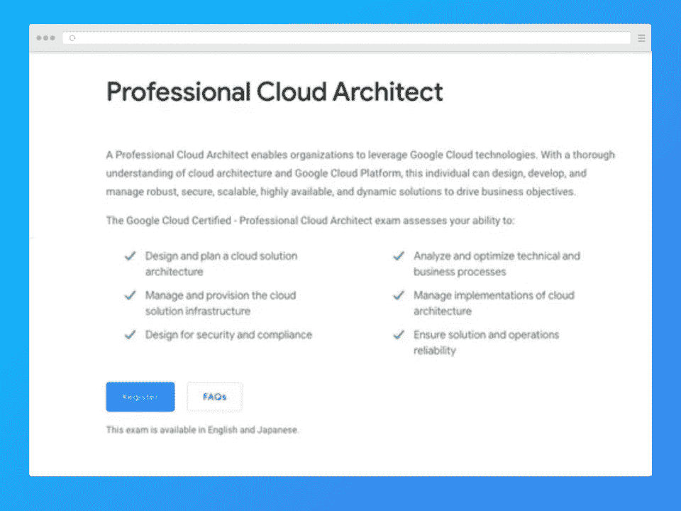
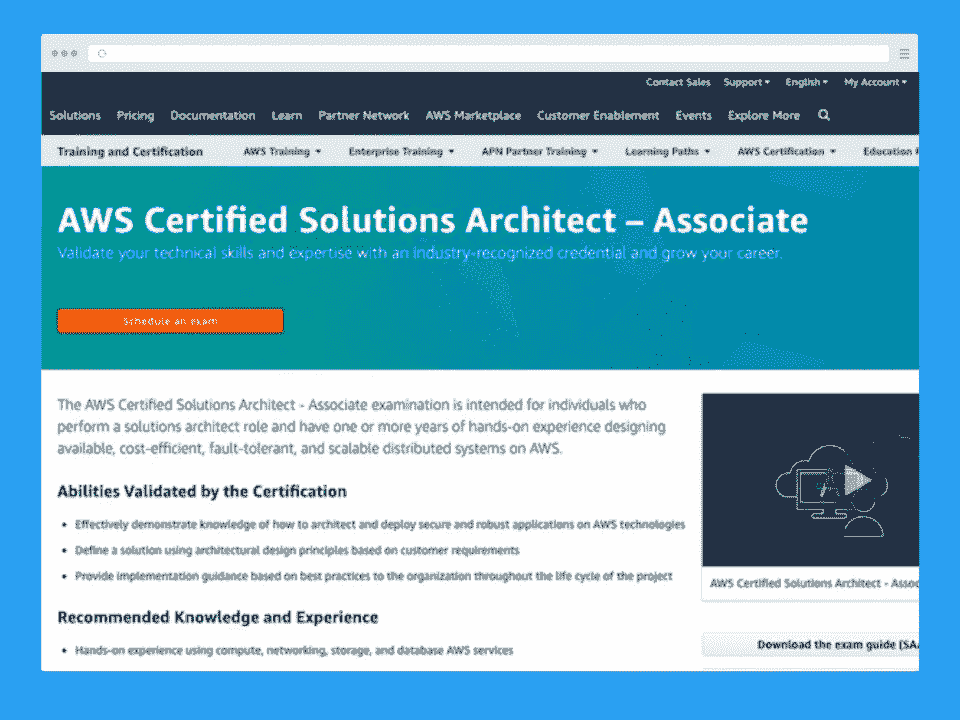
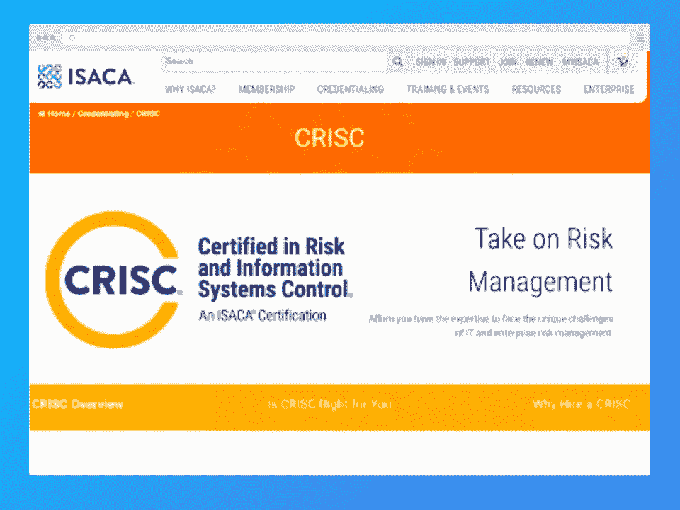
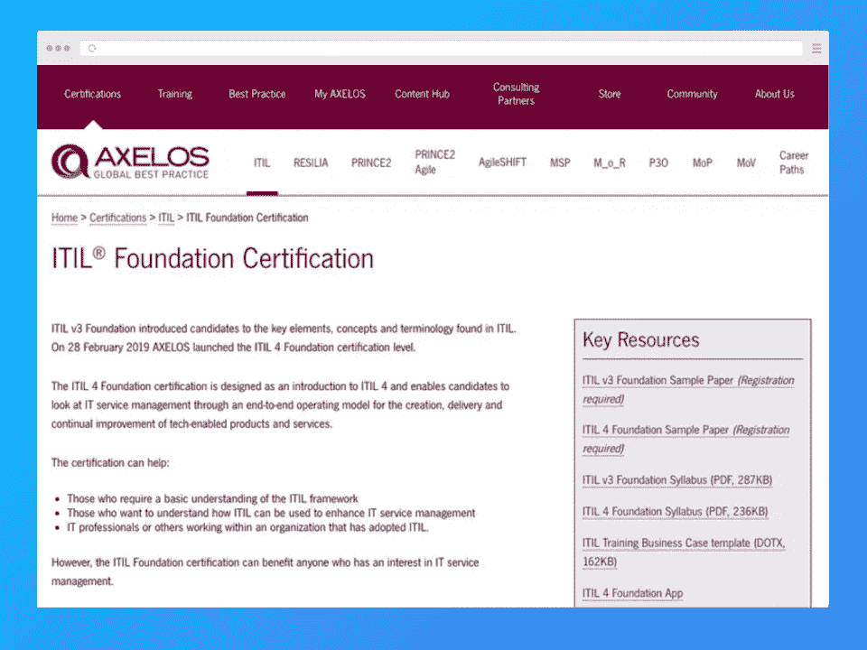
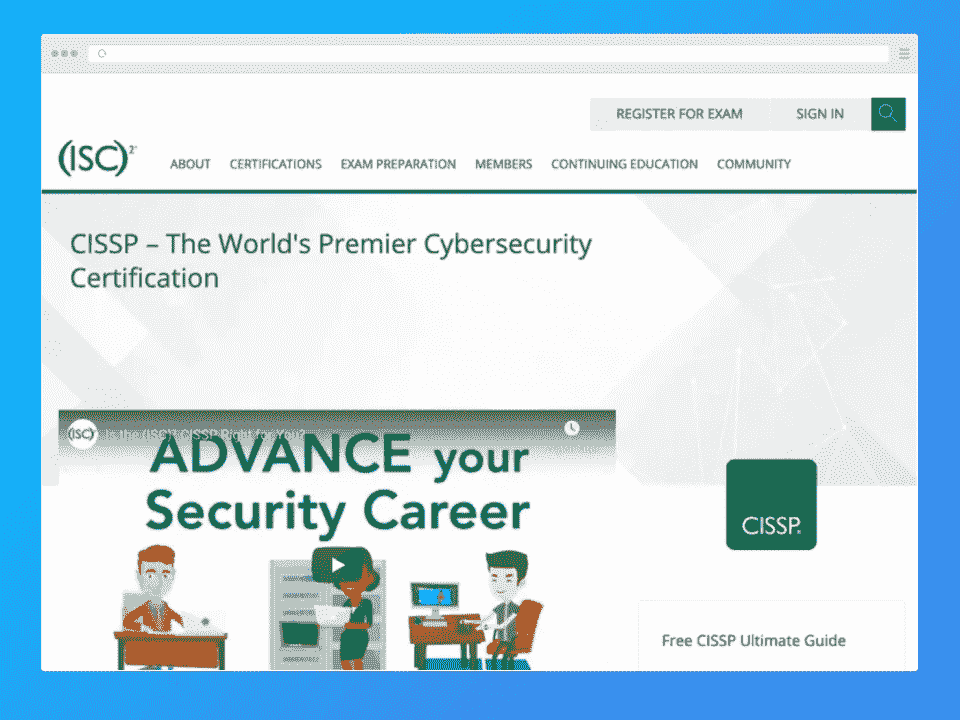
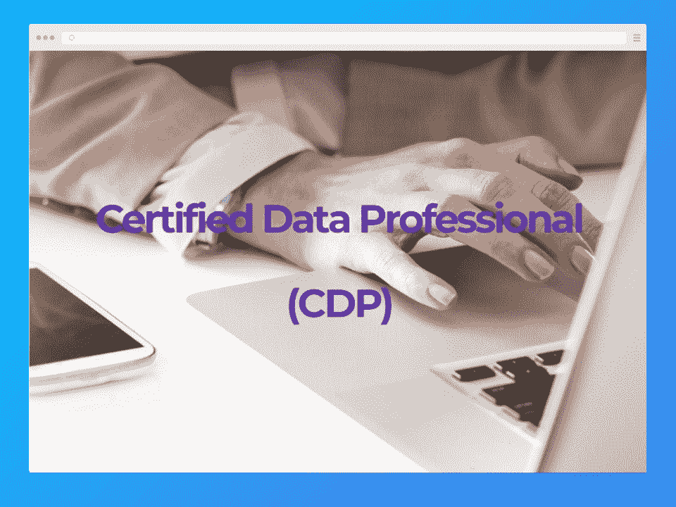
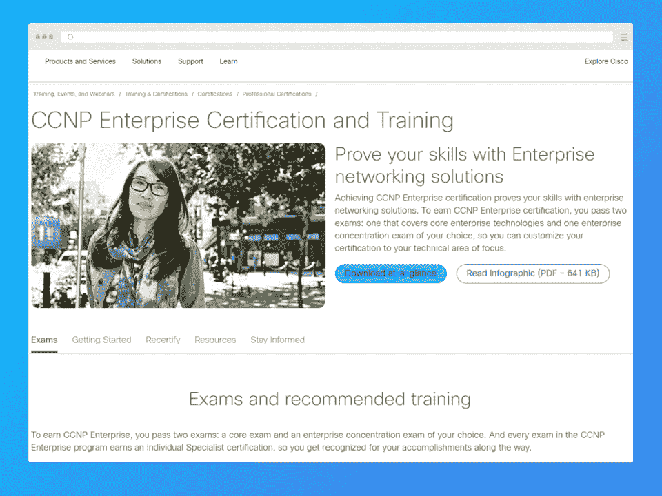
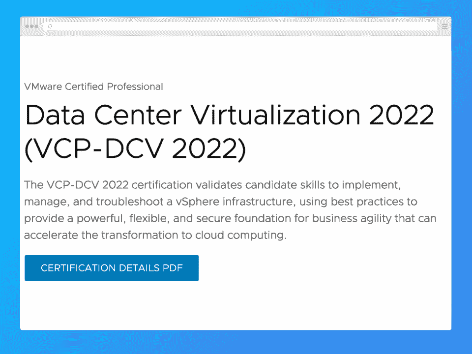

# 从初学者到专家的十大最佳 IT 认证

> 原文：<https://hackr.io/blog/best-it-certifications>

IT 认证可以改善你的职业选择，尤其是如果你刚开始工作或者想换公司的话。与能力和技能相似但未经认证的候选人相比，拥有认证会给你带来很多优势。这也是向你现在或潜在的雇主证明你在某个领域的精通程度的一种方式，让你可以争取到更高的薪水。当然，认证有助于展示你对最新技术趋势和技能的兴趣。

认证 IT 专业人员的工资是业内最高的。他们在职业生涯中从富有挑战性的项目中获得了巨大的曝光率。例如，PMP 证书持有者的平均收入约为 143，493 美元；在 CISSP 认证后从事相关工作至少支付 141，452 美元，谷歌认证的专业云架构师大约支付 175，761 美元，等等。

但是到底什么是最好的 IT 认证呢？在这篇文章中，我们包括了最好的，无论他们是初学者，中级或高级专业人员。

## **我们 2023 年的顶级 IT 认证**

我们的评估显示，今年最热门的 IT 认证是云服务和网络安全认证。这些领域似乎是最受欢迎的，提供的薪水最高。

## IT 认证的费用是多少？

说到 it 认证，涉及的主要成本通常是评估或考试的价格**。价格从 150 美元到近 1000 美元不等，通常是每次尝试*。***

 ***准备认证**也要花钱，这取决于你是否选择付费预科课程和考试。幸运的是，如果你需要降低成本，通常有免费的选择。

根据认证的要求，您可能需要具备某些资格或证书才能参加评估。在某些情况下(如 PMP 认证)，你甚至可能需要有学士学位。这些成本可以计入您的认证总成本。然而，大多数时候，IT 认证需要经验和先验知识。这些成本不一定是金钱上的，但可能会占用你大量的时间。

在某些情况下，保持你的认证也是要花钱的。例如，CISSP 认证要求你每年支付 125 美元。

## 经过认证的 IT 专业人士收入多少？

认证 IT 专业人员的收入远远高于非认证 IT 专业人员。根据环球知识的数据，前 15 名收入最高的首席执行官的平均工资都超过了 11 万美元。

你的实际收入取决于几个因素，比如你的所在地、职位以及你感兴趣的领域的需求程度。

## **我们如何选择最佳 IT 认证**

选择最好的 IT 认证并非易事。最初，我们只是简单地看了看收入最高的竞争者。毕竟，高工资通常意味着一个高需求的领域和更多的职业机会。虽然我们在这个列表中包括了一些收入最高的认证，但我们也包括了每个行业中最受欢迎的一些认证。我们还尽最大努力将其他领域的认证(如项目管理)和基础认证(如下面的 ITIL 证书)包括在内。

## **2023 年 10 大最佳 IT 认证**

这里列出了最好的信息技术认证。

[****](https://cloud.google.com/certification/cloud-architect)

当今需求最大的 IT 认证之一是谷歌认证专业云架构师。它也是报酬最高的 It 认证之一。根据[Talent.com](https://www.talent.com/salary?job=google+cloud+architect)的数据，认证专家的平均年薪(在 163 份调查薪水中)是**153，650 美元**，加州的年薪高达 178，000 美元或更多。想要另一个激励吗？看看 Venture Beat 的[这篇文章](https://venturebeat.com/2022/06/23/report-workers-with-google-cloud-certificates-earn-65-higher-raises/)称，谷歌认证的个人获得高达 65%的加薪。另一篇文章称，在简历中添加谷歌认证的个人将获得高达 12，000-13，000 美元的加薪。

Google 提供了很多云认证，比如准云工程师、云数据工程师、云网络工程师等。只要你有资格，你可以参加任何认证。然而，由于云架构师是 IT 行业中薪酬最高的认证之一，因此这一特定认证可能是一个值得考虑的认证。专业的云架构师将能够为企业设计、开发和维护健壮、安全、可扩展和动态的解决方案。考试将对您进行以下评估:

*   规划和设计云解决方案架构的能力
*   确保稳健可靠的解决方案和操作
*   遵守合规和安全措施
*   优化业务和技术流程

但是，你为什么会选择这个考试而不是亚马逊的 AWS 认证解决方案架构师(助理)——特别是当 AWS 以 32%的市场份额赢得大多数市场份额时？嗯，谷歌云的市场份额正在稳步上升，增加了对认证专业人士的需求，他们随后会因其资格获得丰厚的报酬。

作为顶级 IT 认证之一，谷歌认证专业云架构师是一个你不应该错过的，如果你打算在该领域工作。这是负担得起的，只有 200 美元以上的税。然而，它需要三年的 it 经验和至少一年或一年以上的 GCP 解决方案经验。如果你想在考试前接受一些培训，你可以直接去谷歌。

#### **考试详情**

| **考试时长** | 2 小时 |
| **报名费** | 200 美元+税 |
| **语言** | 英语和日语 |
| **格式** | MCQs，多个答案 |
| **方法** | 在线；中心(测试中心) |
| **先决条件** | 3 年以上的 IT 经验和 1 年以上的 GCP 解决方案经验 |

**我们喜欢的:**

*   最受欢迎的 IT 认证之一
*   高工资，中位数超过 15 万美元
*   负担得起的考试，提供在线测试选项

**我们不喜欢的:**

*   证书的有效期只有两年，你必须每两年重新认证一次
*   尽管 GCP 的市场份额不断上升，但与 AWS 相比仍然相形见绌

**[点击这里报名](https://cloud.google.com/certification/cloud-architect)**

[****](https://aws.amazon.com/certification/certified-solutions-architect-associate/)

AWS 认证解决方案架构师助理认证是您目前可以获得的最佳 IT 认证之一。如果不是因为认证专家的工资略低于谷歌云认证的工资，我们会很乐意给它“总体最佳”的评级。根据 [PayScale](https://www.payscale.com/research/US/Certification=AWS_(Amazon_Web_Services)_Certified_Solutions_Architect_-_Associate/Salary) 的数据，获得认证的个人平均年薪为 118，000 美元，尽管解决方案架构师(131，540 美元)和高级解决方案架构师(149，175 美元)职位的专业人士的年薪更高。这些工资数字实际上可能更接近 140，000 美元到 150，000 美元的平均范围，这取决于位置。

这是一个助理级别的计划，以验证您的技术技能，这反过来可以帮助您发展您的职业生涯。助理认证考试验证以下内容:

*   基于 AWS 技术构建安全的应用程序。
*   使用架构设计原则来定义解决方案。
*   在项目的整个生命周期中，使用最佳实践为组织提供实施指导。

那些想在获得认证之前接受一些培训的人可以直接从亚马逊网络服务获得。亚马逊建议专业人士至少有一年或一年以上设计 AWS 系统的经验。除了其他专业培训资源外，它还提供了样题、考试指南和练习考试。

#### **考试详情**

| **考试形式** | MCQ，多重答案 |
| **考试类型** | 关联(条目) |
| **检查模式** | 在线；检测中心 |
| **持续时间** | 一百三十分钟 |
| **成本** | 150$ |
| **语言** | 英语、日语、韩语、中文(简体) |
| **先决条件** | 至少一年 AWS 实践经验；参见下面推荐的诀窍 |

**推荐诀窍:**

*   使用计算、网络、存储和数据库 AWS 服务、AWS 部署和管理服务。
*   确定基于 AWS 的应用程序的技术需求，反之亦然。
*   了解在 AWS 平台上构建安全可靠的应用程序的最佳实践
*   基于 [AWS 云](https://imp.i115008.net/Ry1Q3R?subId3=tutorials%2Flearn-amazon_amcid-Ol2INoresimilVbi6NUos)构建的基本架构原则、AWS 全球基础设施、AWS 相关网络技术、AWS 安全工具和功能及其与传统服务的关系

**我们喜欢的:**

*   AWS 目前占据云市场的主导地位
*   平均工资肯定是高的
*   认证价格实惠
*   在线测试是可用的

**我们不喜欢的:**

*   需要大量的经验和知识才能通过

还有[其他 AWS 认证](https://aws.amazon.com/certification/certification-prep/)，你可以选择最适合你职位或者目标的。

**[点击这里报名](https://aws.amazon.com/certification/certified-solutions-architect-associate/)**

[****](https://www.pmi.org/certifications/types/project-management-pmp)

如果项目管理更符合你的风格，PMI(项目管理协会)项目管理专业认证是不会错的。该认证关注项目管理的三种主要方法，即敏捷、瀑布(预测生命周期)和混合方法。

PMP 是全球许多组织公认的认证。它可以帮助你加速你作为项目经理的职业生涯。这一认证为你打开了在不同领域和行业工作的大门，以及相对于其他人的显著工资优势。PMI 指出，在美国，PMP 认证的个人平均工资约为 121，000 美元，第 75 百分位的工资高达 154，200 美元。

对培训感兴趣的人可以直接去 PMI，那里有大量的培训资源。如果你想保持你的认证，你将被要求在三年内获得[60 PDU](https://www.pmi.org/certifications/certification-resources/maintain/requirements)(专业发展单位)，这是一个重复的周期。

#### **考试详情**

| **考试形式** | MCQ (200 个问题) |
| **持续时间** | 4 小时 |
| **价格** | 405 美元(会员)；555 美元(非会员) |
| **先决条件** | 

*   中学学位(高中文凭、大专文凭或全球同等学历)
*   7500 小时领导和指导项目
*   35 小时的项目管理教育或
*   CAPM 认证

运筹学

*   四年制学位
*   4500 小时领导和指导项目
*   35 小时的项目管理教育或
*   CAPM 认证

 |
| **有效期** | 3 年 |

**我们喜欢的:**

*   在线测试是可用的
*   良好的平均工资
*   大量可用的培训资源

**我们不喜欢的:**

*   相对昂贵的考试费用
*   要求有丰富经验的学士学位或二级学位，甚至更多的经验

**[点击这里报名](https://www.pmi.org/certifications/types/project-management-pmp)**

### **4。**[**CRISC**](https://www.isaca.org/credentialing/crisc)**——IT 安全专业人士最佳认证之一**

[****](https://www.isaca.org/credentialing/crisc)

CRISC 是风险与信息系统控制认证的简称。CRISC，由 ISACA 提供的认证，在世界范围内被接受，可以让你立即得到认可，给你的职业生涯一个促进。该认证在 4 个核心 IT 领域对您进行测试——IT 风险识别、风险应对和缓解、IT 风险评估、风险和控制监控以及报告。如果您是业务分析师、项目经理、风险、合规或控制专家，该认证无疑将使您受益。

CRISC 认证最大的好处之一就是高薪。这篇[文章](https://resources.infosecinstitute.com/certification/value-certification-average-crisc-salary/)分享了 2021 年证书持有者的平均年薪为 132，266 美元。这些数字可能高达 16 万美元以上，尤其是如果你住在加州的一些城市。薪水也可以取决于你的角色，高级 IT 审计员的平均收入为 90702 美元，CISOs(首席信息安全官)的平均收入为 180853 美元。

感兴趣的各方可以访问 ISACA 获取培训材料。有在线复习课程、学习指南电子书，甚至有教师指导的培训来帮助你准备。

#### **考试详情**

| **持续时间** | 240 分钟 |
| **考试价格** | 575 美元(会员)，760 美元(非会员) |
| **类型** | MCQ；150 个问题 |
| **及格分数** | 800 人中的 450 人(56.25%) |
| **语言** | 英语 |
| **先决条件** | 无；对于考试，建议通过书籍和练习材料进行彻底的准备 |

**我们喜欢的:**

*   有大量的准备材料和指南
*   网络安全是需求最大的 IT 领域之一
*   平均工资很高

**我们不喜欢的:**

*   认证很贵
*   你必须每年更新你的证书(收费)
*   要获得证书，你必须支付 50 美元
*   需要继续教育

要保持您的 CRISC 认证，您必须每年至少获得 20 个 CPE 小时，在三年周期内获得 120 个 CPE 小时，每年支付 45 美元。45 美元的费用是针对 ISACA 成员的——非成员必须每年支付 85 美元。

**[点击这里报名](https://www.isaca.org/credentialing/crisc)**

[****](https://www.scrum.org/professional-scrum-master-i-certification)

Scrum 是大多数项目遵循的重要方法。scrum 框架中的认证可以让你在关键项目中获得正确的角色，并有助于提升你简历的价值。为了通过考试，你可以参加所需的 scrum master 培训。或者，如果你有动手经验，可以直接参加考试。

根据 GlassDoor 的数据，Scrum Masters 在美国的平均年收入为 99492 美元。尽管这一领域的薪水不是最高的，但仍然相当不错——尤其是如果你考虑到根据你的职位和额外资格，这个数字可能会更高。

#### **考试详情**

| **持续时间** | 60 分钟 |
| **及格分数** | 85% |
| **价格** | $150 |
| **格式** | MCQ，多个答案，对/错 |
| **语言** | 英语 |
| **先决条件** | 没有人 |
| **推荐学习** | 据 Scrum.org 介绍，推荐[申请职业 Scrum](https://www.scrum.org/courses/applying-professional-scrum-training) (2 天课程)或[职业 Scrum Master](https://www.scrum.org/courses/professional-scrum-master-training) 课程 |

**我们喜欢的:**

*   考试既便宜又相对较短
*   有大量的学习材料，也提供预备课程
*   提供模拟测试

**我们不喜欢的:**

*   评估可能相当具有挑战性，需要准备

**[点击这里报名](https://www.scrum.org/professional-scrum-master-i-certification)**

[****](https://www.axelos.com/certifications/itil-certifications/itil-foundation)

ITIL 是全球最受欢迎的 IT 服务管理框架之一。ITIL 的目标是鼓励业务转型和提高效率，以实现可预测的服务水平。ITIL 的认证意味着个人已经掌握了 IT 服务管理的最佳实践。ITIL 的概念是供应商中立的，因此任何人都很容易学习。有不同级别的认证——ITIL 基金会、ITIL 中级、ITIL 从业者和 ITIL 专家。基础水平是认证的第一个水平，其细节在下面给出。

作为阶梯上的第一级，ITIL 基金会认证是初学者最好的 IT 认证之一。至少根据 [Global Knowledge 的说法，这是业内最受欢迎的证书之一。](https://www.globalknowledge.com/ca-en/resources/resource-library/articles/top-paying-certifications/)所有 ITIL 证书均由 Axelos 提供。

根据 [PayScale](https://www.payscale.com/research/US/Certification=Information_Technology_Infrastructure_Library_(ITIL)_Foundation/Salary) ，认证个人年收入中值为 101，000 美元。这一工资可以根据个人的职位而变化，更高或 C 级员工的年薪高达 186，249 美元。

#### **考试详情**

| **格式** | MCQ |
| **问题数量** | 40 |
| **及格分数** | 26/40 (65%) |
| **先决条件** | 没有人 |
| **持续时间** | 60 分钟 |
| **价格** | $495 |
| **语言** | 英语 |

**我们喜欢的:**

*   相对较高的平均工资
*   在线测试是可用的
*   提供培训
*   认证永久有效

**我们不喜欢的:**

*   相当昂贵的考试

**[点击这里报名](https://www.axelos.com/certifications/itil-certifications/itil-foundation)**

[****](https://www.isc2.org/Certifications/CISSP)

CISSP 是信息安全领域的顶级认证。它是由国际非营利组织 ISC 提供的，目前是 LinkedIn 上顶级的信息安全认证之一。该认证使您能够:

*   定义组织安全的设计、体系结构和管理
*   发展 CISSP CBK 推荐的八个领域的工作知识
*   了解访问控制系统、安全性和软件方法论
*   能够优化安全操作

随着信息安全行业的发展，对该领域专业人员的需求也在增加。难怪这项认证是信息技术领域最受欢迎的认证之一。Simplilearn 表示，拥有该证书的专业人士的平均年薪为 125，470 美元。

#### **考试详情**

| **格式** | 250 MCQ 和高级创新题 |
| **持续时间** | 6 小时 |
| **及格分数** | 700/1000 |
| **先决条件** | 

*   至少在 CISSP 常识书(CBK)的两个领域有 5 年的全职工作经验
*   4 年制大学教育学位或相当于(ISC)2 认可清单中的 CISSP 地区证书

 |
| **检查模式** | 在线(皮尔逊中心)；查看[培生 VUE 网站](https://wsr.pearsonvue.com/testtaker/profile/create/SignUp/ISC2)了解位置和其他详情 |
| **成本** | $749 |
| **训练** | CISSP 培训项目或带证明材料的学习 |
| **语言** | 英语 |

对于非英语考试，进行线性和固定形式的考试，有 250 个问题，持续时间为 6 小时。它有法语、巴西葡萄牙语、德语、西班牙语、简体中文、日语和韩语版本。

**我们喜欢的:**

*   高平均工资
*   可用的准备材料很多
*   非常抢手

**我们不喜欢的:**

*   昂贵的考试
*   需要广泛的教育和经验
*   没有在线测试
*   需要每年支付 125 美元的维护费

**[点击这里报名](https://www.isc2.org/Certifications/CISSP)**

[****](https://www.iccp.org/certified-data-professional-cdp.html)

由 ICCP 提供的 CDP 测试数据专业人员的专业能力和知识。数据专业人员可以专注于任何领域，如业务分析、数据分析和设计、数据治理、数据集成和互操作性、数据管理、数据和信息质量、数据管理、数据仓库、IT 管理等。，并参加专业认证。CDP 认证有许多级别——基础、助理/从业者、精通、主要和执行管理。

#### **考试详情**

| **级别** | 行业经验 | 考试详情 |
| **基础** | 无(入门级) | 两次考试，每次 60 分钟，50%的及格分数。费用:250 美元，488 美元，598 美元，750 美元 |
| **从业者** | 两年多 | 3 次考试，每次 90 分钟，50%及格分数费用:750 美元，897 美元 |
| **主人** | 4 年多 | 3 次考试，每次 90 分钟，70%的及格分数费用:750 美元，897 美元 |
| **本金** | 5 年以上 | 三次考试，每次 90 分钟，70%的及格分数，为期两天的指导研讨会费用:1497 美元 |
| **执行** | 5 年以上 | 书面评估，70%的及格分数，为期 4 天的研讨会费用:4500 美元 |

请注意，认证费用因参加考试的次数、希望获得的证书以及获得的学习材料等因素而异。

**我们喜欢的:**

*   提供 5 个认证级别
*   展示您在数据领域价值的绝佳方式

**我们不喜欢的:**

*   每一级认证都需要付费
*   认证很贵

**[点击这里报名](https://www.iccp.org/certified-data-professional-cdp.html)**

[****](https://www.cisco.com/c/en/us/training-events/training-certifications/certifications/professional/ccnp-enterprise.html)

CCNP 认证证明您在企业网络解决方案方面的技能。它包括两个考试-核心考试和企业集中考试，您可以选择这些考试，以便获得您指定技术领域的认证。这是全球公认的高价值认证，您可以获得核心和技术考试的个人(思科)专业认证。认证有效期为三年。

#### **考试详情**

**核心考试**需要进行以下内容:

***350-401 ENCOR:实施思科企业网络核心技术***

**先决条件:**无

**考试时长:** 120 分钟

费用:400 美元

**集中考试**可以选择以下考试之一，每门考试时长 90 分钟。除了推荐的培训课程之外，以下内容都不需要任何先决条件:

***300-410 ENARSI:实施思科企业高级路由和服务***

成本:300 美元

**培训课程:**实施思科企业高级路由和服务

***300-415 ENSDWI:实施思科 SD-WAN 解决方案***

费用:300 美元

**培训课程:**实施思科 SD-WAN 解决方案

***300-420 ENSLD:设计思科企业网络***

费用:300 美元

**培训课程:**设计思科企业网络

***300-425 ENWLSD:设计思科企业无线网络***

费用:300 美元

**培训课程:**设计思科企业无线网络

***00-430 ENWLSI:实施思科企业无线网络***

费用:300 美元

**培训课程:**实施思科企业无线网络

**我们喜欢的:**

*   高平均工资
*   各种认证领域可供选择—选择您的专业

**我们不喜欢的:**

*   需要丰富的经验
*   每个认证领域都需要额外付费

**[点击这里报名](https://www.cisco.com/c/en/us/training-events/training-certifications/certifications/professional/ccnp-enterprise.html)**

[****](https://www.vmware.com/learning/certification/vcp-dcv.html)

该认证(VCP-DCV 2022)旨在帮助验证候选人在实施、故障排除和管理 vSphere 基础架构方面的专业技能。它还可以帮助专业人员开发最佳实践中的技能和知识，为业务敏捷性提供强大、安全和灵活的基础，这可能会加速向云计算的转变。

根据 [PayScale](https://www.payscale.com/research/US/Certification=VMware_Certified_Professional_(VCP)/Salary) 的数据，获得认证的个人平均年收入约为 99，000 美元。然而，根据[全球知识](https://www.globalknowledge.com/us-en/resources/resource-library/articles/6-reasons-you-should-consider-earning-your-vmware-certified-professional-data-center-virtualization-certification/)，这个数字可能高达每年 132，000 美元——或者更多。

如果您想了解更多关于该认证以及如何获得该认证的信息，请查看全球知识[页面](https://www.globalknowledge.com/us-en/resources/resource-library/articles/6-reasons-you-should-consider-earning-your-vmware-certified-professional-data-center-virtualization-certification/)。

#### **考试详情**

| **格式** | 70 个多项选择/多项回答问题 |
| **持续时间** | 一百三十分钟 |
| **及格分数** | 300 |
| **成本** | $250 |
| **语言** | 英语 |

**我们喜欢的:**

*   高平均工资
*   认证是永久性的；无需支付维护费用
*   您可以每年将您的认证升级到最新版本(即 2021 年-> 2022 年、2022 年-> 2023 年，以此类推)，并永远保留这些认证

**我们不喜欢的:**

*   许多先决条件，但它们将取决于你目前的证书和经验(更多信息[在这里](https://www.vmware.com/learning/certification/vcp-dcv.html#:~:text=CERTIFICATION%20DETAILS%20PDF-,Certification%20Paths,-Path%20if%20you)

**[点击这里报名](https://www.vmware.com/learning/certification/vcp-dcv.html)**

**结论**

## 你可以通过这些认证来提升你的 IT 职业生涯；然而，还有很多。证书可以给你的简历增加必要的推动力，也可以帮助你比别人更快地爬上职业阶梯。你可以根据你想从事的职业选择参加任何认证，例如，如果你想进入项目管理角色，你可以参加认证 scrum master 或 PMP 认证。同样，如果你想进入核心的 IT 和风险管理岗位，你可以申请 ITIL、CRISC 或 CISSP 的认证。

我们希望这份 2023 年最佳 IT 认证清单能够给你启发，帮助你找到前进的方向。你喜欢哪些认证，为什么？与我们分享！

推荐课程

### [IT 基础知识——您需要了解的一切信息](https://click.linksynergy.com/deeplink?id=jU79Zysihs4&mid=39197&murl=https%3A%2F%2Fwww.udemy.com%2Fcourse%2Fit-fundamentals-everything-you-need-to-know-about-it%2F)

**常见问题解答**

## **哪个认证最适合 IT 行业？**

### 最好的认证将取决于你的兴趣领域和职业目标。如果你只是追求报酬最高的认证，你可以考虑谷歌认证专业云架构师、AWS 认证解决方案架构师、风险和信息系统控制认证(CRISC)或认证信息系统安全专家(CISSP)。如果项目管理更适合你，试试项目管理专家或认证 Scrum Master。

IT 部门最需要哪些认证？

### 根据《全球知识》的这份[榜单](https://www.globalknowledge.com/us-en/resources/resource-library/articles/top-paying-certifications/)，一些收入最高的 IT 行业是数据和信息/网络安全。事实上，一些最受欢迎的认证是那些领域内的认证，如谷歌的云架构师认证或 AWS 的解决方案架构师助理认证。安全专家将受益于 CRISC 或 CISSP。

我应该先获得哪个 IT 认证？

### IT 领域最广泛持有的证书之一是 ITIL 基金会认证。就平均年收入而言，证书持有者的收入相对较高。认证考试并不是最便宜的，但是好消息是一旦你通过了，你将永远保留你的认证。

最容易获得的 IT 证书是什么？

### 作为最普遍获得的认证之一(也是对初学者最好的认证之一)，ITIL 基础认证也是最容易的认证之一。没有太多的先决条件，这可以让你的收入更容易一些。

我能通过认证找到一份 IT 工作吗？

### 绝对的！你不仅可以找到一份有 IT 认证的工作，而且有可能比没有认证的同等职位挣得更多。关于 2021 年 IT 认证价值的 Pearson-Vue [报告](https://home.pearsonvue.com/voc/2021-report)显示，55%获得加薪的专业人士在获得认证后的三个月内获得了加薪。7%的受访者加薪 50%以上，9%的人加薪 31-50%，13%的人加薪 21-30%，23%的人加薪 11-20%，22%的人加薪不到 5%。

哪些证书会让你赚得最多？

### Global Knowledge 的这个[列表](https://www.globalknowledge.com/us-en/resources/resource-library/articles/top-paying-certifications/)显示，收入最高的五个证书是谷歌认证专业数据工程师、谷歌认证专业云架构师、AWS 认证解决方案架构师助理、CRISC 和 CISSP。每项认证的专业人士平均年薪超过 15 万美元。

**人也在读:**

**People are also reading:***