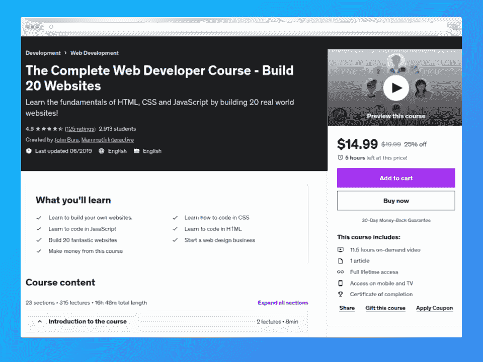
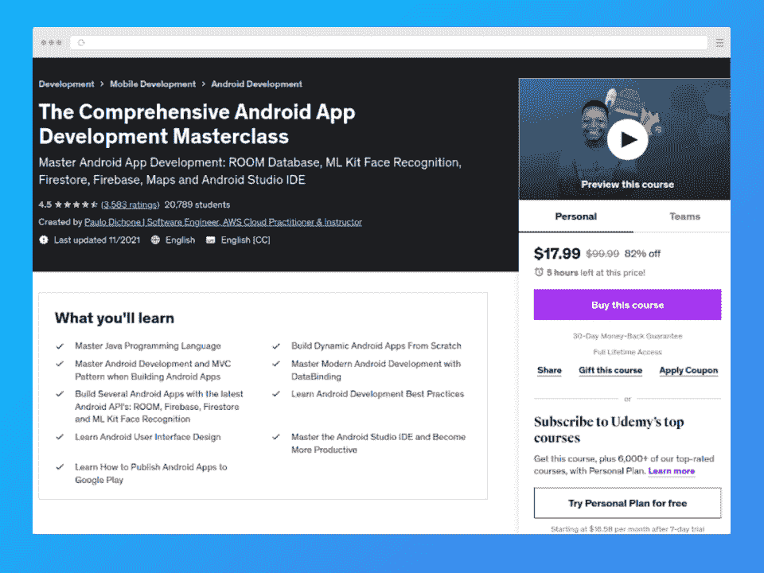
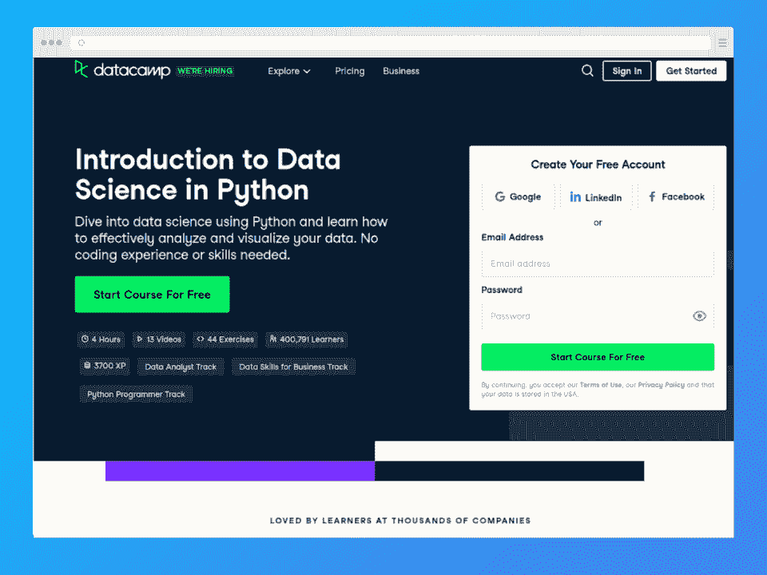
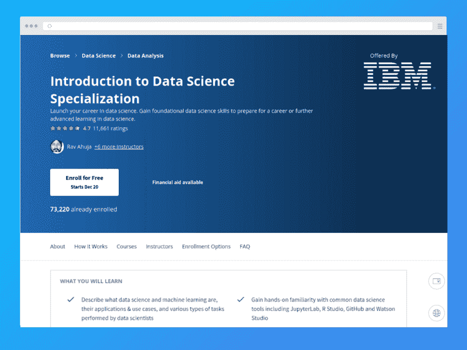
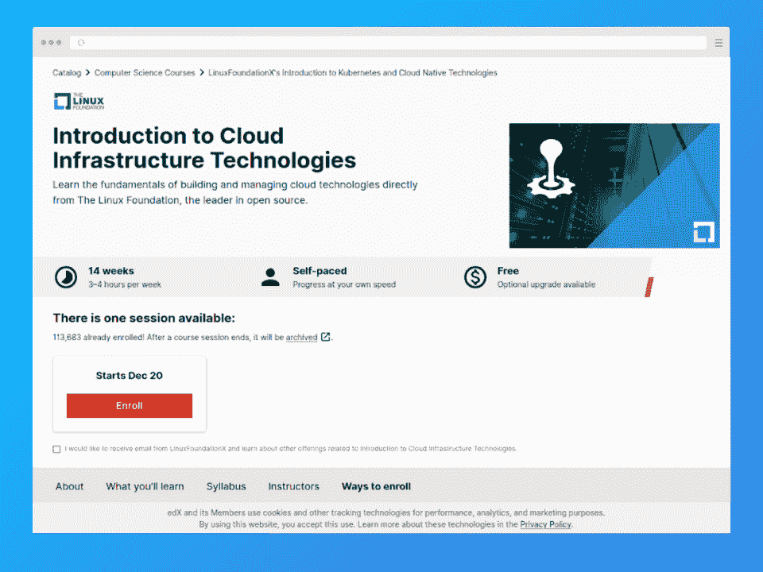
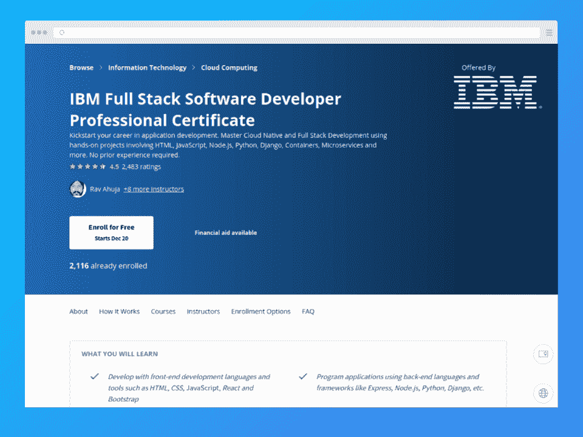
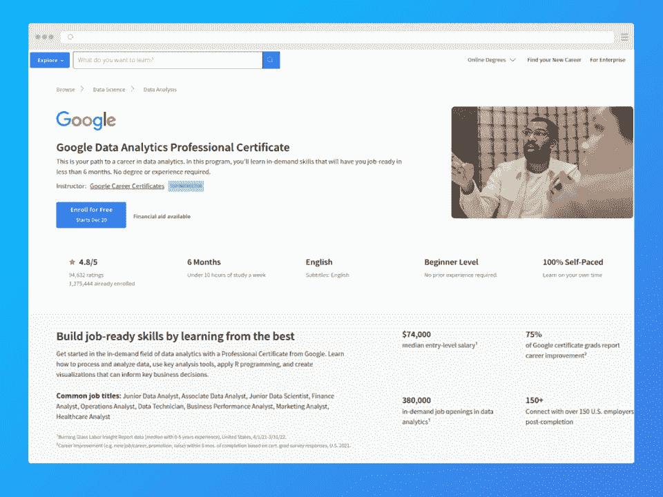
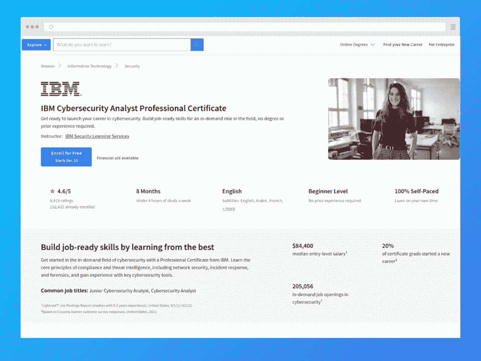
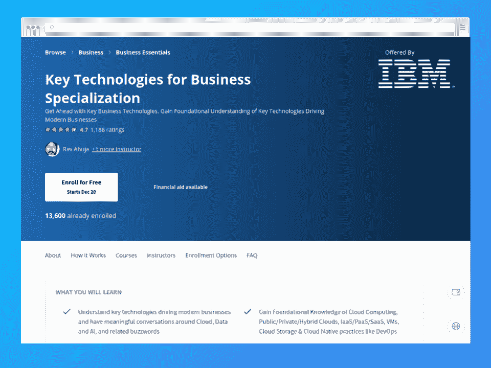
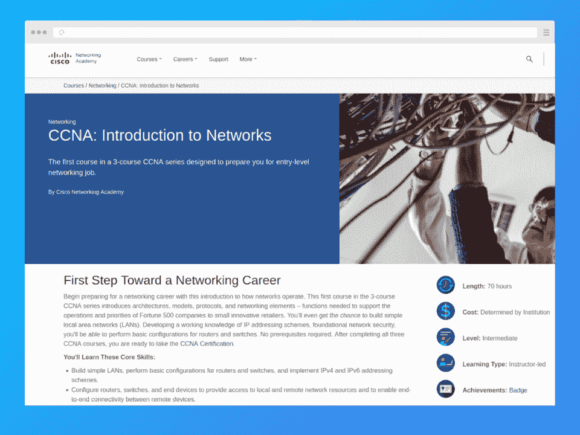

# 2023 年最适合初学者的 10 门 IT 课程| Hackr.io

> 原文：<https://hackr.io/blog/best-it-courses>

无论你是刚毕业的学生，还是想进入 it 领域的新领域，都很难知道哪门初级 IT 课程是最好的选择。

为了帮助您做出选择，我们将范围缩小到一些最受欢迎的专业领域中 10 个最适合初学者的 it 课程。这包括 web 开发、移动应用程序开发、编程、数据科学、网络安全、云和网络。

这些 IT 课程都是为初学者设计的，所以你只需要一台电脑和学习的意愿。当你在你选择的领域寻找一份新工作时，大多数学校还会提供一份证书来增强你的简历。

**顶级精选 IT 初学者课程【编辑推荐】** 

## **选择最佳在线 IT 课程的标准**

1.  **需求:**需求较大的 IT 领域各门课程的内容和重点
2.  **提供商:**优质内容的声誉，来自行业领导者的认证证书
3.  **课程材料:**足够详细的课程、项目和测验/考试
4.  **讲师:**必须在该领域拥有丰富的经验和知识
5.  **灵活性:**自定进度，几乎不需要出差

## **最适合初学者的在线 IT 课程**

| **课程** | **特性** | **价格** |
| [【Udemy】完整的 Web 开发者课程——建立 20 个网站](https://click.linksynergy.com/deeplink?id=jU79Zysihs4&mid=39197&murl=https%3A%2F%2Fwww.udemy.com%2Fcourse%2Fthe-complete-web-developer-course-build-20-websites%2F) | 基于项目，学习 HTML、CSS 和 JavaScript | $14.99 |
| [【Udemy】全面的安卓应用开发大师班](https://click.linksynergy.com/deeplink?id=jU79Zysihs4&mid=39197&murl=https%3A%2F%2Fwww.udemy.com%2Fcourse%2Fandroid-development-java-android-studio-masterclass%2F) | 基于项目，学习 Java，Android 活动，布局等 | $17.99 |
| [【Data camp】Python 中的数据科学介绍](http://datacamp.pxf.io/gbzRZO) | 学习 Python 基础知识、数据科学基础知识 | 每月 39 美元或每年 149 美元 |
| [【Coursera】数据科学专业介绍](https://imp.i384100.net/n1O40o) | 学习 R、Python、Jupyter、SQL、应用数据科学技能 | Coursera Plus 每月 59 美元或每年 399 美元 |
| [【edX】云基础设施技术简介](https://www.awin1.com/cread.php?awinmid=6798&awinaffid=428263&ued=https%3A%2F%2Fwww.edx.org%2Fcourse%2Fintroduction-to-cloud-infrastructure-technologies) | 虚拟化、IaaS、PaaS、容器、开发运维、CI/CD 等 | 149 美元(无证书免费) |
| [【Coursera】IBM 全栈软件开发者职业证书](http://imp.i384100.net/9W1V50) | 学习 HTML、CSS、JavaScript、Python、SQL、React、Express、Node.js、Django、Cloud 等等 | Coursera Plus 每月 59 美元或每年 399 美元 |
| [【Coursera】谷歌数据分析专业证书](https://imp.i384100.net/DVEWXj) | 通过 SQL、R 和 Tableau 进行数据清理、分析和可视化 | Coursera Plus 每月 59 美元或每年 399 美元 |
| [ [Coursera] IBM 网络安全分析师职业证书](https://imp.i384100.net/x9DjoA) | Windows、Linux 和 macOS 安全性、服务器管理、合规性、TCP/IP 和 OSI 模型 | Coursera Plus 每月 59 美元或每年 399 美元 |
| [【Coursera】业务专业化的关键技术](https://imp.i384100.net/kjn4nz) | 云模型和趋势、人工智能概念、数据科学和商业影响 | Coursera Plus 每月 59 美元或每年 399 美元 |
| [ [思科网络学院]网络简介](https://www.netacad.com/courses/networking/ccna-introduction-networks) | 网络架构、协议、交换机/路由器、IPv4 和 IPv6、局域网等 | 依赖于提供者 |

[****](https://click.linksynergy.com/deeplink?id=jU79Zysihs4&mid=39197&murl=https%3A%2F%2Fwww.udemy.com%2Fcourse%2Fthe-complete-web-developer-course-build-20-websites%2F)

**关键信息**

教练:约翰·布拉

**等级:**初学者

**先决条件:**基本电脑技能

价格: $14.99

**证书:**是

**时长:** 11h 30m(视频内容)

**我们为什么选择本课程**

这是一个友好而有趣的在线 IT 课程，适合初学者学习 web 开发，包括 HTML、CSS 和 JavaScript 框架等基础知识。通过超过 11 个小时的视频教程和基于项目的方法，您将构建现实世界的 web 应用程序，并将其添加到您的投资组合中。这是最好的 Udemy 课程之一。

**特性**

*   基于项目的学习
*   学习 HTML、CSS 和 JavaScript
*   建立 20 个网站

**优点**

*   全天候终身访问在线内容和课程材料
*   知识渊博且经验丰富的讲师
*   支持性在线社区
*   现实世界场景的实用技能

**缺点**

*   课程对一些人来说可能太简单了
*   主要是静态网站与动态 JavaScript

[了解更多信息](https://click.linksynergy.com/deeplink?id=jU79Zysihs4&mid=39197&murl=https%3A%2F%2Fwww.udemy.com%2Fcourse%2Fthe-complete-web-developer-course-build-20-websites%2F)

[****](https://click.linksynergy.com/deeplink?id=jU79Zysihs4&mid=39197&murl=https%3A%2F%2Fwww.udemy.com%2Fcourse%2Fandroid-development-java-android-studio-masterclass%2F)

**关键信息**

教练:保罗·迪乔内

**等级:**初学者

**必备:**基本编程技能

价格: $17.99

**证书:**是

**时长:**49 小时 30 分钟(视频内容)

**我们为什么选择本课程**

线索就在这里的名字里！作为一门全面的 IT 在线课程，你将使用 Java 从头开始构建 Android 应用程序。您还将学习 UI 设计、ML-Kit 人脸识别和 Firestore 实时数据库等高级 Android APIs，以及如何将您的应用程序上传到 Google Play 商店。

**特性**

*   基于项目的学习
*   学习 Java，包括面向对象和数据结构
*   了解 Android 活动、布局和项目结构
*   实现模型-视图-控制器架构(MVC)

**优点**

*   全天候终身访问在线内容和课程材料
*   综合课程
*   实践练习和真实技能

**缺点**

*   对于没有编码技能的人来说，更难理解
*   最低限度的教师支持

[了解更多信息](https://click.linksynergy.com/deeplink?id=jU79Zysihs4&mid=39197&murl=https%3A%2F%2Fwww.udemy.com%2Fcourse%2Fandroid-development-java-android-studio-masterclass%2F)

**关键信息**

指导老师:希拉里·格林-勒曼

**等级:**初学者

**先决条件:**计算机基础&数学技能

**价格:**每月 39 美元或每年 149 美元

**证书:**是

**时长:** 4h(视频、练习、&小测验)

**我们为什么选择本课程**

对于编码或数据科学的新手来说，这是一个坚实的起点。您将从 Python 基础开始，包括语法、函数、数据类型和库。然后，您将准备好使用 pandas 来操作数据，并使用 matplotlib 来生成图表和绘图。本课程包括 DataCamp Python 程序员和数据分析师课程。

**特性**

*   学习 Python 基础知识，包括语法、函数、数据类型和库
*   学习数据科学基础知识
*   用熊猫操纵数据帧
*   使用 matplotlib 生成不同的图形和绘图

**优点**

*   Python 和数据科学的初学者友好课程
*   互动视频教程和测验
*   补充参考材料和数据集

**缺点**

*   有经验的程序员的一点基础
*   缺少现场实验或一对一指导

[了解更多信息](http://datacamp.pxf.io/gbzRZO)

**关键信息**

教练: Rav Ahuja

**等级:**初学者

**先决条件:**计算机基础&数学技能

价格:【Coursera Plus 每月 59 美元或每年 399 美元

**证书:**是

**时长:**75 小时(视频、练习、&测验)

**我们为什么选择本课程**

如果你是一名有抱负的数据科学家，Coursera 的这一课程使用四门 IT 在线课程(子课程)来教你核心数据科学概念和工具、数据可视化、探索性数据分析和机器学习。您还将使用真实世界的数据集，并获得探索和分析数据的实践经验。在采取下一步并寻找[最佳 IT 认证](https://hackr.io/blog/best-it-certifications)之前，这是获得行业认可证书的好方法。

**特性**

*   学习 R、Python、Jupyter 和 SQL
*   使用 GitHub & Watson Studio
*   学会像数据科学家一样思考
*   应用数据科学技能和技术

**优点**

*   由 IBM 专业人员授课，并颁发 IBM 结业徽章/证书
*   文件夹的应用学习项目
*   学习和应用行业公认的技能

**缺点**

*   自定进度且规模庞大的课程可能难以自我管理
*   随着您的进步，可能需要更新/学习新的统计概念

[了解更多信息](https://imp.i384100.net/n1O40o)

**关键信息**

**指导老师:**克里斯·波科尔尼&奇普·查尔德斯

**等级:**初学者

**先决条件:**基本电脑技能

**价格:** $149(无证书免费)

**证书:**是

**时长:**42 小时-56 小时(视频、练习、&考试)

**我们为什么选择本课程**

对于任何对 DevOps 或云网络感兴趣的人来说，这是一个强有力的介绍。由 Linux 基金会的讲师授课，您将获得云计算基础知识、虚拟化、平台即服务(PaaS)、容器等方面的一些最好的 IT 在线培训。如果你想要一个证书，选择付费版本进入分级考试。

**特性:**

*   虚拟化、基础架构即服务(IaaS)和平台即服务(PaaS)
*   容器技术(Docker、Kubernetes 等。)&编排
*   软件定义的存储(SDS)和软件定义的网络(SDN)
*   DevOps、CI/CD 和物联网(IoT)
*   云计算和无服务器计算

**优点**

*   灵活的学习形式、互动教程和测验
*   学生反馈、建议和支持论坛
*   补充参考材料和案例研究
*   付费版终身访问

**缺点**

*   缺乏动手实验室工作

[了解更多信息](https://www.awin1.com/cread.php?awinmid=6798&awinaffid=428263&ued=https%3A%2F%2Fwww.edx.org%2Fcourse%2Fintroduction-to-cloud-infrastructure-technologies)

**关键信息**

教练: Rav Ahuja

**等级:**初级到中级

**先决条件:**基本计算机技能(编码背景有帮助)

价格:【Coursera Plus 每月 59 美元或每年 399 美元

**证书:**是

持续时间:156 小时(视频、练习、&测验)

**我们为什么选择本课程**

如果你渴望成为一名全栈开发人员，那么你会知道你需要大量的补充技能！通过 10 个子课程，您将获得一些最好的在线 IT 培训，以使用各种前端和后端语言、框架和云原生方法来构建全栈应用程序，Coursera 的这一产品是实现这一目标的绝佳方式。

**特性**

*   学习 HTML、CSS、JavaScript、Python、SQL 和 Git (GitHub)
*   使用 React、Express、Node.js 和 Django 构建应用程序
*   精益云工具、容器、微服务和无服务器基础设施

**优点**

*   由 IBM 专业人员授课，并颁发 IBM 结业徽章/证书
*   你的作品集的测验和“顶点”项目
*   学习和应用行业公认的技能

**缺点**

*   大量内容需要消化，实现收益的长期承诺

[了解更多信息](http://imp.i384100.net/9W1V50)

**关键信息**

**导师:**谷歌

**等级:**初学者

**先决条件:**计算机基础技能&高中数学

价格:【Coursera Plus 每月 59 美元或每年 399 美元

**证书:**是

持续时间:~200 小时(视频、练习、&测验)

**我们为什么选择本课程**

如果你想从事数据分析方面的职业，谷歌的这一综合课程旨在让你在短短 6 个月内就能找到工作！这一信息技术在线课程涵盖了收集和分析数据、交流发现和做出循证决策的最佳实践。您还将学习可视化数据的工具和技术，以及如何将技能应用于现实世界的数据。

**特性**

*   通过 SQL 和 R 介绍数据分析、清理和分析
*   数据可视化和 Tableau 仪表板

**优点**

*   由谷歌专家授课，并获得谷歌职业证书
*   你的作品集的测验和应用学习项目
*   学习和应用行业公认的技能

**缺点**

*   使用 R 而不是 Python，这在数据分析中是常见的
*   随着您的进步，可能需要更新/学习新的统计概念

[了解更多信息](https://imp.i384100.net/DVEWXj)

**关键信息**

**讲师:** IBM

**等级:**初学者

**先决条件:**基本电脑技能

价格:【Coursera Plus 每月 59 美元或每年 399 美元

**证书:**是

**时长:~**110 小时(视频、练习、&小测验)

**我们为什么选择本课程**

如果你对网络安全职业感兴趣，这个 Coursera 项目是获得网络安全、事件响应、取证以及基本网络安全工具和技术培训的绝佳途径。您还将了解合规性和威胁情报等重要主题，这些在这个不断发展的领域中至关重要。

**特性**

*   Windows、Linux 和 macOS 安全基础知识
*   服务器和客户端系统管理
*   行业标准和合规框架
*   TCP/IP 和 OSI 模型

**优点**

*   由 IBM 专业人员授课，并获得 IBM 证书
*   测验和补充材料
*   学习和应用行业公认的技能

**缺点**

*   音频和视频质量参差不齐

[了解更多信息](https://imp.i384100.net/x9DjoA)

**关键信息**

教练: Rav Ahuja

**等级:**初学者

**先决条件:**基本电脑技能

价格:【Coursera Plus 每月 59 美元或每年 399 美元

**证书:**是

**时长:~**35 小时(视频、练习、&小测验)

**我们为什么选择本课程**

如果你是一名经理或高管，对数据科学、人工智能(AI)和云计算如何积极影响你的业务感兴趣，那么这个 Coursera 项目就是为你准备的。它涵盖了每一个的基础，重点是它们如何推动业务增长。

**特性**

*   云计算模型、组件、趋势和最佳实践
*   人工智能概念、术语和伦理问题
*   数据科学主题、使用案例和业务影响

**优点**

*   由 IBM 专业人员授课，并获得 IBM 证书
*   涵盖高层次的关键概念

**缺点**

*   主要是理论，所以不适合工程师或开发人员

[了解更多信息](https://imp.i384100.net/kjn4nz)

**关键信息**

**讲师:**取决于供应商

**等级:**中级

**先决条件:**无

**价格:**取决于供应商

**证书:**否(数字徽章)

**持续时间:**70 小时(视频&练习)

**我们为什么选择本课程**

如果你是一个有抱负的网络工程师，并着眼于 CCNA 的地位，这是一个很好的切入点，因为它是 CCNA 轨道上的三个思科课程之一。你将学习网络架构，模型，协议，IP 地址，网络安全，路由器/交换机配置，甚至建立简单的局域网。

与列表中的一些课程不同，这是一门需要实际动手实验的在线信息技术课程，所以你需要在你所在的地区找到一所当地的思科学院。

**特性**

*   网络架构、协议和元素
*   配置交换机/路由器，并实施 IPv4 和 IPv6 寻址
*   构建简单的局域网，并在真实的实验室中解决实际问题
*   了解网络安全的最佳实践
*   在线评估

**优点**

*   综合内容
*   不断更新以反映最新的行业变化
*   经验丰富、知识渊博的讲师

**缺点**

*   对网络新人的挑战
*   庞大的课程在短时间内可能令人望而生畏

[了解更多信息](https://www.netacad.com/courses/networking/ccna-introduction-networks)

## **信息技术课程的成功秘诀**

*   保持有条理&专注:每天留出特定的时间用于学习，制定详细的学习计划，并运用自律
*   **利用可用资源**:利用你提供的所有课程，无论是视频讲座、书面材料、动手实验还是其他工具
*   **实践:**在现实世界中应用你所学，无论是通过编码挑战、与同学一起动手项目，还是完成评估
*   **提问:**如果不明白如何前进，联系导师或同学寻求帮助

## **结论**

由于 IT 行业有如此多的需求，对于初学者来说，从各种信息技术在线课程中进行选择是一项挑战。本文已经为您做了调查，涵盖了 web 开发、移动应用程序开发、编程、数据科学、网络安全、云和网络方面的 10 门最佳 IT 课程。

这些面向初学者的 IT 课程有一系列价格点和时间承诺，可以帮助您学习开始职业生涯所需的基本技能。大多数还包括一个应用学习项目和一个证书，可以增强你的简历和投资组合。

喜欢你所看到的，并想发现更多的课程？结账:

**[20 门最佳计算机科学课程](https://hackr.io/blog/best-computer-science-courses-online)**

## **常见问题解答**

#### **1。哪个 IT 课程最适合初学者？**

这个要看你最感兴趣的领域。本文涵盖了一些最受欢迎的 IT 领域，因此如果您正在考虑学习编程、数据科学、网络或网络安全的基础，请查看我们上面列出的初学者课程。

#### **2。什么是 IT 培训课程？**

IT 培训课程是一种学习计划，旨在培养您在特定 IT 领域的技术技能和知识。这些可以是在线的，在教室里的，或者是两者结合的混合体。它们通常允许学生通过项目或评估实践新技能并获得实践经验。

#### **3。其中最容易的课程是什么？**

这取决于你的背景和你想专注的专业。对初学者来说，不需要先前知识的入门课程通常是不错的选择。例如 Udemy 的完整 Web 开发人员课程、DataCamp 的 Python 数据科学入门以及 Coursera 的数据科学专业化入门。

#### **4。我能在网上自学信息技术技能吗？**

是的，这是可能的。我们建议您寻找免费的 IT 课程、教程和在线社区，它们可以帮助您学习编程、网络、网络安全、web 开发、数据库管理等基础知识。

#### **5。有免费的在线信息技术课程吗？**

是的，网上有许多免费的 IT 课程，这些课程是学习关键科目、开发新技术技能和建立个人档案的好方法。许多付费提供商，如 Coursera、DataCamp 和 edX，也为我们上面列出的课程提供免费选项。这些通常伴随着课程材料的减少，并且不产生证书。

#### **6。网上信息技术课程一般多长时间？**

这可以有很大的不同。有的课程需要 5-6 个小时，有的需要 6-12 个月+200 个小时的学习。