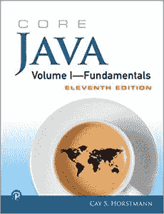
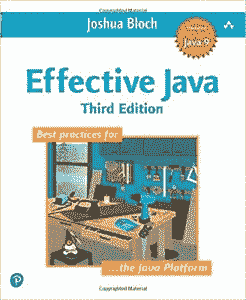
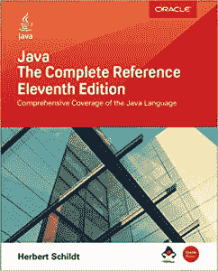
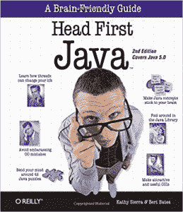
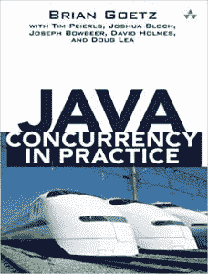
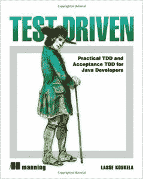
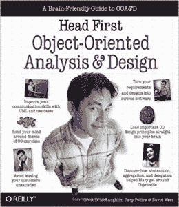
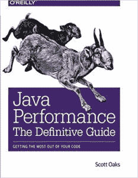
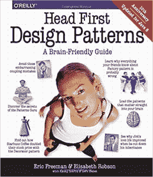
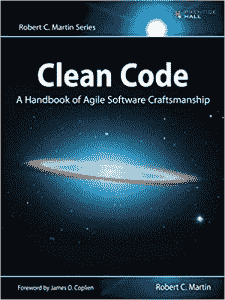

# 2023 年面向初学者和高级程序员的 10 本最佳 Java 书籍

> 原文：<https://hackr.io/blog/best-java-books-for-beginners-and-advanced-programmers>

书籍弥补了第一种学习模式。将它们与文章、教程和视频结合起来，你就获得了学习 Java 的绝佳诀窍。 作为 Java 之一的 [领先的编程语言](https://hackr.io/blog/best-programming-languages-to-learn) ，不乏关于高级、通用编程语言的书籍。其中一些提供了各种 Java 概念的概述，另一些则深入到特定的 Java 主题。

## 初学者和高级程序员的 10 本最佳 Java 书籍

在这里，我们收集了 11 本优秀的 Java 书籍来帮助你学习 Java。

**作者**–凯西·霍斯特曼
**最新版**–第 11 版
**出版商**–徒弟堂

《核心 Java 第一卷——基础》是一本 Java 参考书(Java 的最佳书籍),它详细解释了核心 Java 的各种特性，包括异常处理、接口和 lambda 表达式。这本书的显著亮点包括简单的语言、简明和详细的例子。 最新版的核心 Java 第一卷——基础知识全面更新，涵盖了 Java SE 9、10 & 11。这本书帮助 Java 程序员培养了编写高度健壮和可维护代码的能力。

你可以在这里买到这本书。

**作者****–**约书亚·布洛赫
**最新版—**第三版
**出版商****–**艾迪森·卫斯理

每一个 Java 程序员和 Java 爱好者的必备书籍，《有效的 Java》是其他 Java 书籍或 学习材料 的绝佳补充读物。这本书提供了 78 个最佳实践来让代码变得更好。Effective Java 将所有提到的最佳实践分成 11 个不同的部分，如并发性、泛型和方法，以便读者更容易掌握。这本书为任何技能水平的 Java 程序员提供了一些东西。 Effective Java 由 Joshua Bloch 编写，他也是许多关键 Java 类和 API 的作者，包括 java.lang 和 Java Collection framework。本书最新版本的上下文是围绕 Java 7、8 和 9 构建的。

你可以在这里买到这本书。

**作者****–**赫伯特·席尔德
**最新版****–**第八版
**出版商****–**麦格劳-希尔教育

如果你是一名经验丰富的 Java 程序员，想提高你的 Java 知识，不要被书名《Java:初学者指南》所迷惑。事实上，这是学习 Java 最全面的书籍之一。 任何具备基本编程知识的人都可以很容易地从《Java:初学者指南》中受益。这本 Java 书涵盖了与核心 Java 相关的所有概念。 最新版的《Java:初学者指南》进行了全面修订，纳入了 Java 11 SE。这本书提供了几个动手练习，并在每章的结尾有一个测验部分，让读者自我评估他们的学习。

你可以在这里买到这本书。

**作者****–**赫伯特·席尔德
**最新版—**第 11 版
**出版商****–**麦格劳·希尔教育

Java -完全参考是一本超过 1000 页的方便的 Java 参考书。它包含了你需要掌握的 Java 的方方面面。 除了检查 Java API 库的基本部分，Java -完整参考还涵盖了基本编程原则、Java 语言语法和关键字。这本书充满了关于更好地学习 Java 的讨论和恰当的例子。

你可以在这里买到这本书。

**作者****—**卡西塞拉&伯特贝茨
**最新版—**第二版
**出版商****—**什罗夫/奥赖利

Head First Java 最重要的卖点是它的简单性和与 Java 编程概念相关的超级有效的现实类比。也是学习 java，从 Java 开发开始学习之旅的最佳书籍。Head First Java 涵盖了几乎所有的 [OOPS 概念](https://hackr.io/blog/oops-concepts-in-java-with-examples)，并引人入胜地解释了它们。 尽管一些读者声称这是一本过时的书，因为它没有涉及 Java 5.0 以外的内容，Head First Java 仍然出现在众多 Java 老手的书架上。因此，它是每个 Java 追求者和开发者的必备书籍。

你可以在这里买到这本书。

Head First Java 涵盖的一些重要主题包括常见的 OO 错误、使用 RMI 和网络套接字的分布式编程以及线程。此外，这本书涵盖了 42 个令人费解的难题，将确保更好地理解 Java。

**作者****–**布莱恩·戈茨与蒂姆·佩尔斯、约书亚·布洛赫、约瑟夫·鲍比尔、大卫·福尔摩斯、道格·李
**最新版—**第一版
**出版商****–**艾迪森-韦斯利专业版

《Java Concurrency in Practice》是最好的 Java 编程书籍之一，有助于加深对并发和多线程的理解。不要被这本书对 Java 5.0 的覆盖所迷惑，因为它对任何热心的 Java 开发人员来说仍然是相关的和必要的。 在实践中，Java 并发性的唯一问题是，有些部分一开始可能很难理解。然而，你需要理解这本书涵盖的主题，即并发和多线程，本身就很棘手。因此，你以后会意识到通读这本书的艰巨任务是值得努力的。

你可以在这里买到这本书。

**作者****—**拉塞·科斯克拉
**最新版—**第一版
**出版商****—**曼宁出版社

《测试驱动》是一本学习如何编写独特的自动化测试程序的优秀书籍。这是那些优先考虑代码质量以及掌握编写单元、集成和自动化测试技巧的 Java 开发人员的必备书籍。 测试驱动:TDD 和验收 TDD 为 Java 开发人员提供了测试驱动 Java 代码的实践例子。此外，本书涵盖了验收测试驱动的开发、Fit 框架和测试 Java EE 组件——JSP、Servlets 和 Spring 控制器。

你可以在这里买到这本书。

**作者****–**布雷特·d·麦克劳林、加里·波里斯&大卫·韦斯特 **最新版—**第一版
**出版商****–**什罗夫/奥赖利

《Head First》是用 Java 编程语言编写的最好的系列丛书之一。该系列中的另一个亮点是 Head First 面向对象分析设计。它是 Head First Java 三部曲的一部分，另外两部是 Head First Java 和 Head First 设计模式。 头先面向对象分析设计详细介绍了面向对象编程和设计中使用的不同技术。列表包括接口的编码以及 [如何封装](https://softwareengineering.stackexchange.com/questions/337413/what-does-it-mean-when-one-says-encapsulate-what-varies) 的变化。Head First OOAD 是一本了解如何更好地编写 Java 代码的优秀书籍。

你可以在这里买到这本书。

**作者****–**斯科特奥克斯
**最新版—**第一版
**出版商****–**什罗夫/奥莱利

垃圾收集、JVM 和性能调优是 Java 编程语言最有利的方面。Java 性能:明确的指南以简单而有效的方式涵盖了所有这三个 Java 主题。 Java 性能:这份明确的指南教导读者如何最大化 Java 线程和同步性能特性，提高 Java 驱动的数据库应用程序性能，解决 Java EE 和 Java SE APIs 中的性能问题，等等。

你可以在这里买到这本书。

**作者****–**埃里克·弗里曼&伊丽莎白·罗布森与凯西·塞拉&伯特·贝茨
**最新版——**十周年版
**出版商****–**什罗夫/奥赖利

对于编写完美的 Java 应用程序来说，很好地掌握面向对象和设计模式是必不可少的。Head First Design Patterns 是理解 Java 编程语言的主要书籍之一。 Head First Design Patterns 提供了几个关于 Java 的常见问题的答案，包括为什么复合比继承更好，以及如何在不搅动已经尝试和测试过的代码的情况下改变类的运行时行为。

你可以在这里买到这本书。

针对 Java 8 更新的 Head First 设计模式的最新版本。与其他基于文本的书籍不同，Head First 设计模式标榜视觉上丰富的格式，使学习更快、更有效。

**作者**–罗伯特·塞西尔·马丁，又名鲍勃大叔 **最新版**–第一版
**出版商**–培生教育

顾名思义,《干净的代码》是一本经典的 Java 编程书籍，向读者传授编写更好代码的知识。把干净的代码分成三段。第一部分涵盖了编写干净代码的模式、实践和原则。第二部分描述了几个递增复杂性的案例研究。它们中的每一个都是清理代码的练习。 “干净代码”的第三个也是最后一个部分是一个单独的章节，它包含了在创建前一部分中包含的案例研究时收集的一系列启发法。

你可以在这里买到这本书。

学习和开始使用 Java 很容易。然而，编写高效的 Java 代码需要对 OOP 原理有深入的了解。干净代码有助于构建关于 Java 编程语言的知识。

## **其他**

这里有另外 11 本 Java 编程书籍，它们将进一步完善你对 Java 的理解和知识:

*   **核心 Java** 作者凯·s·霍斯特曼和加里·科内尔
*   Heinz Kabutz 博士为 Java 8 开发的极致 Java 并发性能
*   Java:如何编程:早期对象 作者 Paul J. Deitel 和 Harvey M. Deitel
*   艾伦·迈克罗夫特和马里奥·富斯科的
*   **Java 简括:桌面快速参考** 作者大卫·弗拉纳根
*   **一天学会 Java，学好它** 作者 Jamie Chan
*   比尔·乔伊、吉拉德·布拉查、小盖伊·l·斯蒂尔和詹姆斯·高斯林的《Java 语言规范》
*   《思考 Java:如何像计算机科学家一样思考》 艾伦·b·唐尼著
*   **用 Java 思考** 布鲁斯·埃凯尔
*   **Sams 在 21 天内自学 Java**作者 Rogers Cadenhead
*   **春天在行动**

## **结论**

因此，这总结了 11 本最佳 Java 编程书籍和另外 11 本 Java 书籍。你认为哪本或哪几本 Java 编程书最好？请通过下面的评论让我们知道。

书籍固然很好，但有时在线课程也能启动你的旅程。如果你正在学习 Java，那么 udemy 的 [Java 编程大师班](https://click.linksynergy.com/deeplink?id=jU79Zysihs4&mid=39197&murl=https://www.udemy.com/course/java-the-complete-java-developer-course/)是学习 Java 的一个很好的在线课程。

快乐的 Java 学习。万事如意！

**人也在读:**