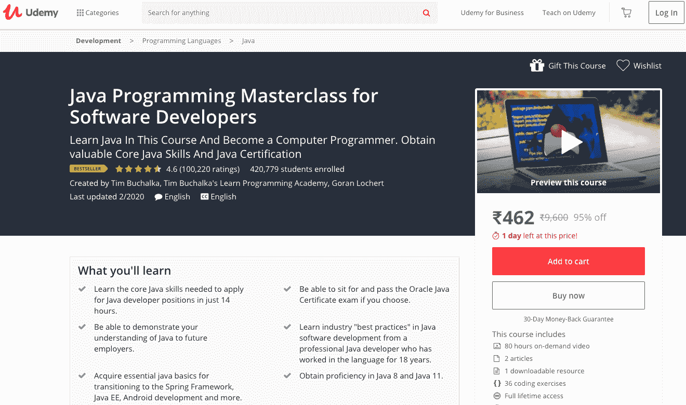
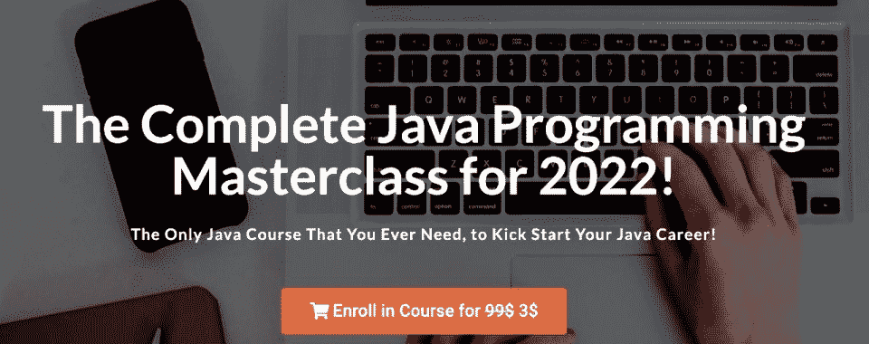
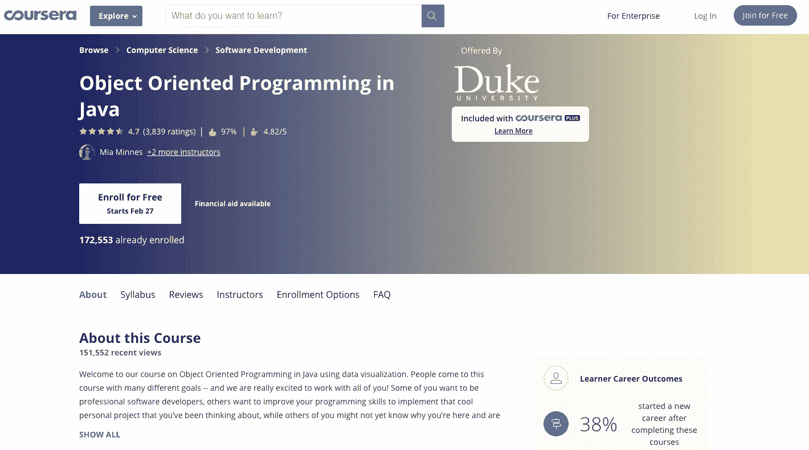
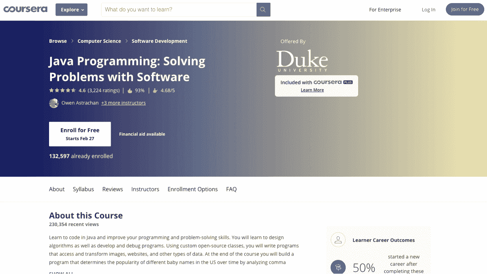
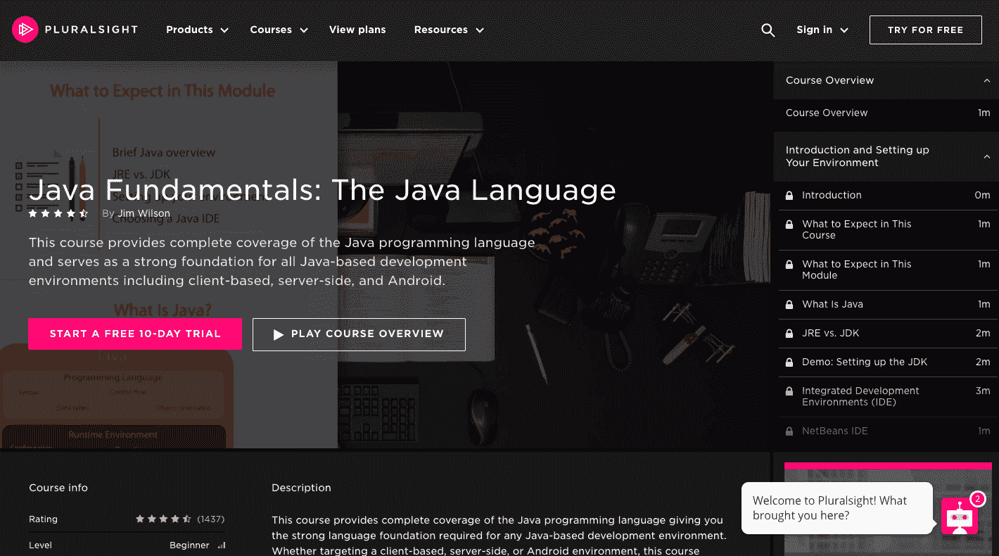
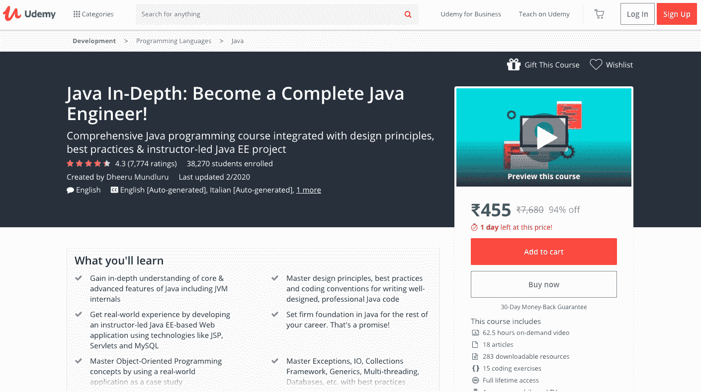

# 最佳 Java 在线课程[Java 开发者推荐]

> 原文：<https://hackr.io/blog/best-java-courses>

在您学习 Java 语言的过程中，可能会遇到几门 Java 课程。我们的专家团队仔细分析了各种在线机构提供的课程，以找出最佳的 Java 课程。

## 最佳 Java 课程

此外，我们查看了与会者的评论，以找出最适合您的 Java 课程。

完整的 Java 大师班是最受欢迎的课程，迄今已有超过 210，000 名学生注册。Udemy 提供课程，课程由 Time Buchalka 教授，他是一位享誉全球的 Java 开发人员和教师。本课程已经取得了 4.6 分的成绩，这反映了教师知识分享的质量。该课程在网络平台上排名第一，有超过 4 万个赞和分享。本课程还观察了从 Java 8 到 Have 9 的更新，使它们对参与者有益。

课程的特点:

1.  这个全面的课程附带了一个 72 小时的视频，其中包含了 Java 开发人员应该了解的所有重要信息。
2.  向学生传授关于多线程、Java 集合、OOP、数据结构、核心 Java 基础知识、网络、Java 8 以及 Jave 9 变化等概念的深入知识。
3.  这门课程提供了数以千计的文章和阅读材料。
4.  召开定期会议是为了消除与会者的疑问。
5.  教学从零开始，教授 Eclipse 和 Maven 等工具，这对理解 Java 开发至关重要。

[在此注册](https://click.linksynergy.com/deeplink?id=jU79Zysihs4&mid=39197&murl=https%3A%2F%2Fwww.udemy.com%2Fcourse%2Fjava-the-complete-java-developer-course%2F)

从初级到高级的课程，专为清除 Java 编码面试和认证而设计。本课程是网上最受认可的 Java 课程之一，有大量好评，对于任何 Java 初学者，如果想成为软件开发人员或能够通过编码面试，都是理想的选择。

作者是 Java、Spring 和相关技术的主要指导者和顾问之一。他拥有丰富的行业经验，并以能够用真实世界的例子来解释非常复杂的概念，从而使讲座易于理解而闻名。

*   通过大量的测验、作业、编码难题、面试问题等边做边学。
*   专为工作、面试和认证而设计。
*   初学者友好的开始，但在稍后阶段进入更深入和更复杂的主题。
*   一个完整而全面的课程，更新了最新的功能。
*   清晰简洁的讲座。没有不必要的课程长度拉伸。
*   有很多人顺利通过 Java 编码面试和认证考试的成功故事。
*   能够与其他学习者互动，提出问题，并获得解决方案。
*   30 天全额退款政策——即使在观看了整个课程之后！

[在此注册](https://karpadoschool.teachable.com/a/aff_dndxllz7/external?affcode=536712_u7jrjvko)

Coursera 专门为中级到专家级的参与者推出了这一新课程。这个程序是为那些有 Python、C、JavaScript 等编程语言经验的软件开发人员设计的。[面向对象的 Java 编程](https://hackr.io/blog/oops-concepts-in-java-with-examples)专业化通过面向对象的设计知识分享给与会者，帮助解决复杂的问题。除此之外，还介绍了两个 Java 开发环境 BlueJ 和 Eclipse，这将帮助与会者获得图形用户界面的知识，以便他们可以轻松地设计能够处理大数据的程序。

课程的特点:

1.  本课程提供了关于 Java 编程语言的深入知识。
2.  它可以作为 Java 专家的课程复习和知识升级。
3.  提供点播视频、文章和阅读材料。
4.  经验丰富、和蔼可亲的教师给与会者授课。
5.  您将了解使用图形用户界面或 GUI 创建新程序的方法，以及设计具有大量数据的程序的方法。

[在此注册](https://coursera.pxf.io/vn9POO)

Coursera 推出了名为“用软件解决问题”的课程，旨在提供学习 Java 编程的教育，以便将编程和解决问题的技能添加到参与者中。这个程序非常适合希望提高自己用 Java 语言解决问题的技能的专家级和中级参与者。此外，该计划旨在提供设计算法的知识，并相应地开发和调试程序。

课程的特点:

1.  它为与会者提供了一个定制的开源类工具。
2.  本课程将指导使用 Java 访问和转换图像、网站和其他数据。
3.  该计划将帮助您获得知识，在分析 CSV 文件或逗号分隔值文件。
4.  如果你以最好的方式完成了课程的所有方面，就可以获得证书。
5.  投资银行家、移动应用程序开发人员和其他人对此课程有很高的需求。

[在此注册](https://coursera.pxf.io/MXvAW3)

Pluralsight 为初学者推出了最好的 Java 课程之一，旨在传授从基础到核心概念的 Java 语言知识。Jim Wilson 是一名软件工程师，在这一领域拥有三十多年的经验，他在课堂上向与会者传授了宝贵的知识。本课程涵盖了 Java 的基础知识、类、文件、错误处理、数据类型、对象和其他核心 Java 概念。除此之外，本课程还提供了关于 Java 编程语言和服务器的详细信息。这将有助于与会者获得获得工作和应用服务器端和客户端开发所需的大多数信息。

该课程的主要特点如下。

1.  Pluralsight 会员资格每月仅需 29 美元。
2.  提供获取 500 多门课程知识的途径。
3.  以 199 美元的价格加入 Pluralsight 的年度会员可以获得低成本的好处。
4.  你将访问巨大的数据库、文章和视频，增加技能和分享经验。
5.  学院提供高水平的专业知识，为与会者提供高质量的教育。

[在此注册](https://pluralsight.pxf.io/Eayd62)

Udemy 推出了另一个专门面向完全初学者的 Java 编程课程。本课程教授 Java9 中引入的 JShell 等工具的使用。因此，学生获得了使用在后期非常有用的工具编写 Java 程序的知识。教学风格非常友好，对完全初学者来说更容易。循序渐进的方法用于向学生讲授 Java 的详细知识。所有重要的概念，如 Java 基础知识、Java 集合、面向对象编程、文件处理、异常处理、函数式编程网络和多线程都将教授给学员。

该课程的特点包括:

1.  这是关于 Java 9 的最新工具和信息的最新课程。
2.  这是一个初始阶段的免费课程，参与者可以在评估他们的表现、学习能力和通过课程分享的知识后，很容易地决定继续学习课程。
3.  注册有助于终身免费访问与 Java 课程相关的所有章节和阅读材料。
4.  这门课程被认为是从其高度专业和才华横溢的教员那里学习 Java 的最谦卑的方式。
5.  教师在解决问题和理解疑问方面提供帮助。

[在此注册](https://click.linksynergy.com/deeplink?id=Qouy7GhEEFU&mid=39197&murl=https://www.udemy.com/course/java-programming-tutorial-for-beginners/)

Java 深入是 Udemy 框架下的一门全新课程，从零开始，到 Java 语言的专家水平。参与者获得个性化的教学经验和真实的例子，指导他们获得 Java 语言的最佳知识和技能，成为 Java 工程师。教师经验丰富，知识渊博，这使得学生更容易学习和理解 Java 语言。我们试图对这门课程进行详细而全面的研究。涵盖了 Java 语言的所有主题，包括数据结构、线程、网络、集合和方法。

课程的主要特点:

1.  这是第一种提供从零开始到专家水平的教育帮助的课程。
2.  本课程将帮助你成为一名完整的 Java 工程师。
3.  该课程提供关于核心语言功能的知识。
4.  它提供了关于最佳实践和设计原则的深入知识。
5.  作为课程的一部分，我们提供了各种各样的项目来增强 Java 语言的知识和技能。

[在此注册](https://click.linksynergy.com/deeplink?id=Qouy7GhEEFU&mid=39197&murl=https://www.udemy.com/course/java-in-depth-become-a-complete-java-engineer/)

## 结论

以上是 6 门最好的 Java 课程，你可以根据自己的情况选择，抓住从零开始到专业水平学习 Java 语言的入场券。这些课程在网上提供，可以根据价格、课程材料、时间和其他因素进行比较。这样，你就可以选择一门划算的课程，并提供你想学的像样的课程材料和内容。你可以在你舒适的家里学习这些课程，无论是白天还是晚上，只要你觉得舒服就行。这是一个学习更多知识和实现更好职业发展的机会。

你还有什么想和我们社区分享的课程吗？请在下面的评论中告诉我们！

**人也在读:**