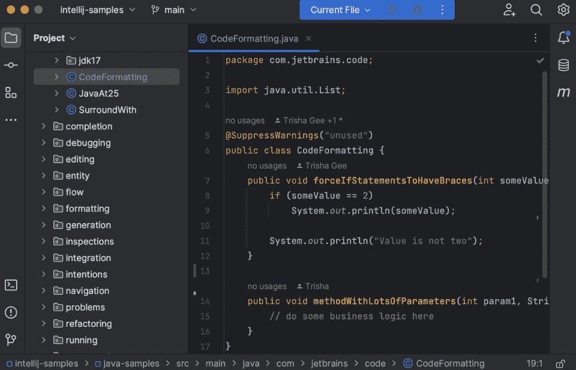
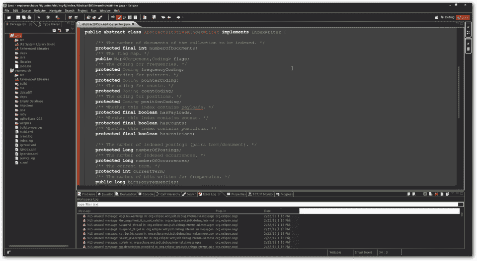
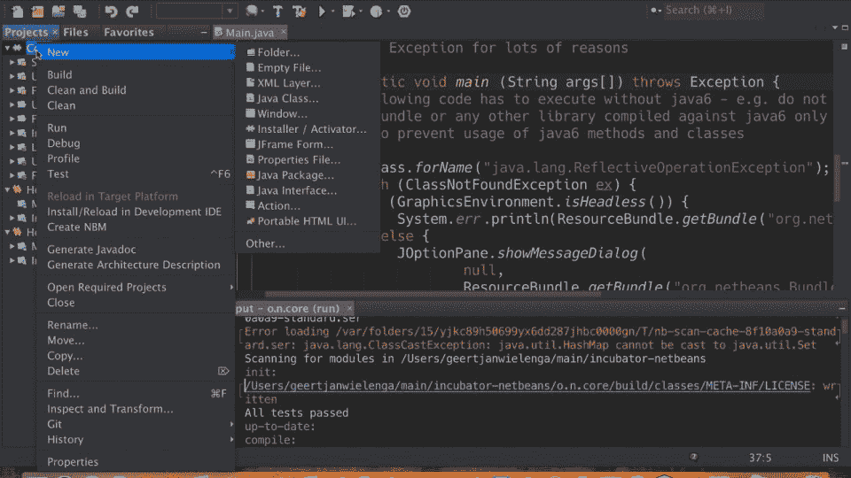
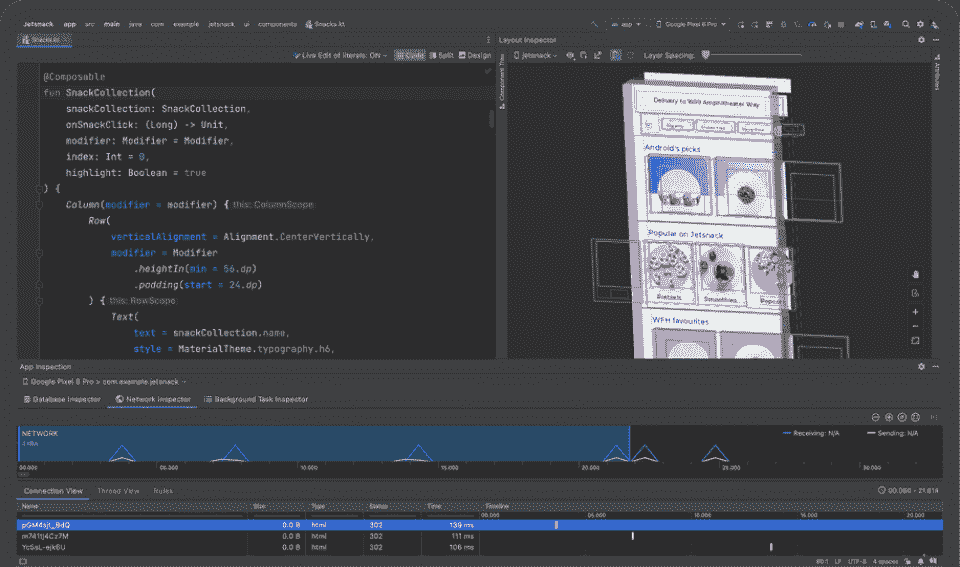
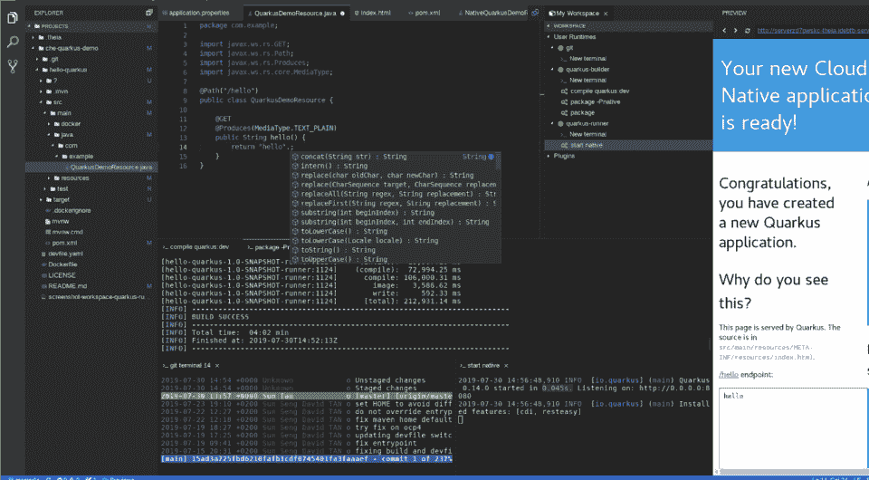
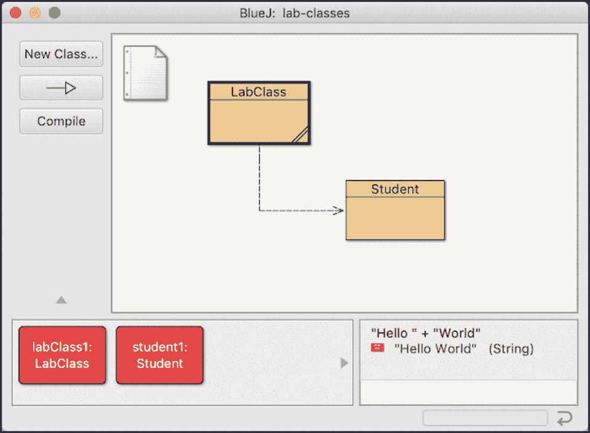
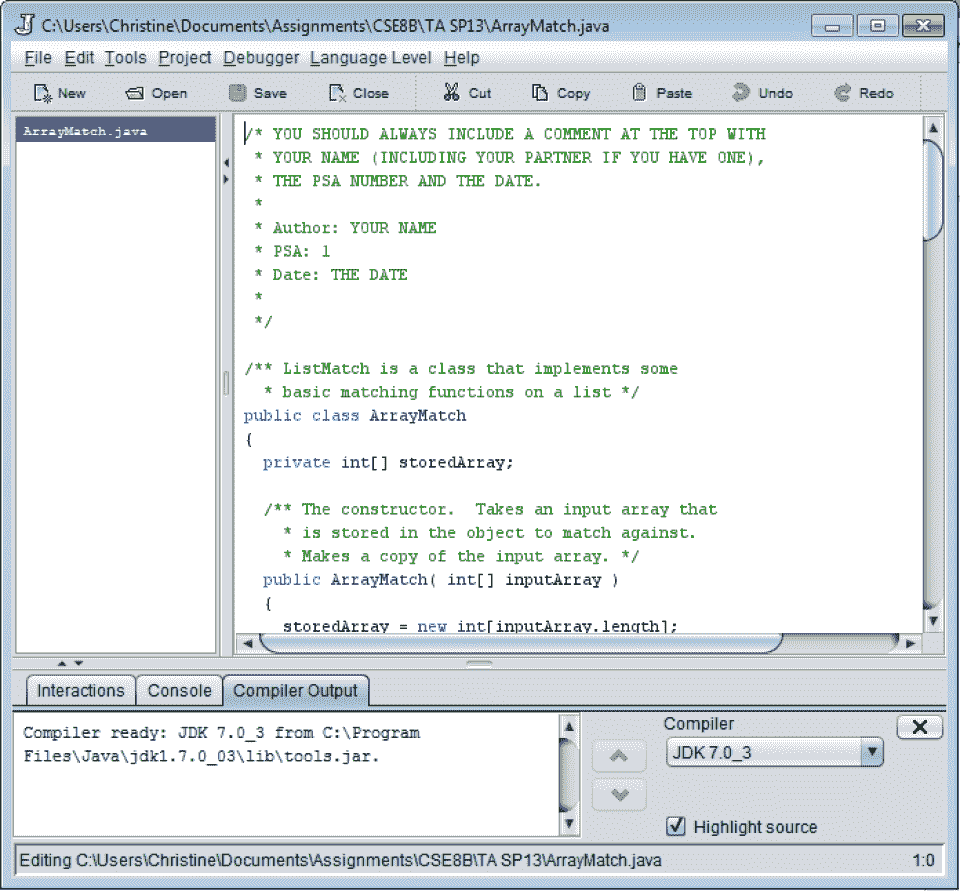
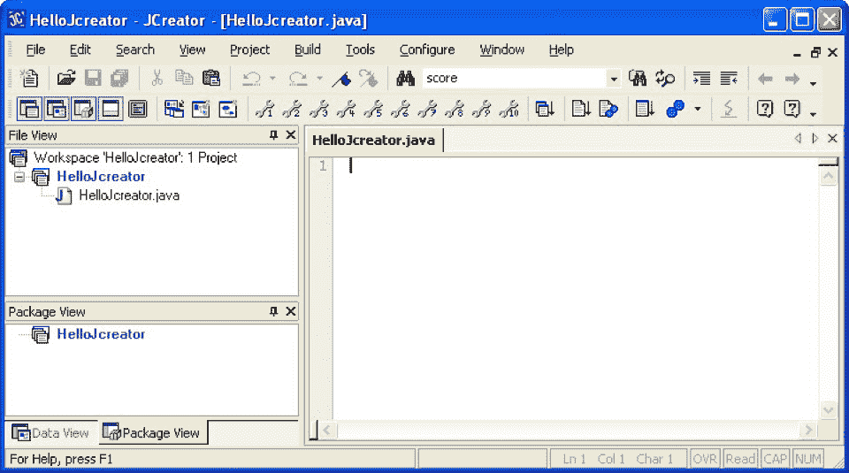

# 2023 年 10 大最佳 Java IDE |最佳 Java IDE 终极指南

> 原文：<https://hackr.io/blog/best-java-ides>

在最新的栈溢出开发者调查中排名第六，Java 仍然是创建健壮和安全的桌面、企业、移动和网络应用最流行的编程语言之一。

就 Java 开发而言，最好的 Java IDE(集成开发环境)可以是一个惊人的工具，通过将核心开发任务(如编辑代码、构建可执行文件和调试)组合在一个应用程序中来提高生产率。

也就是说，如果没有可靠的 Java IDE 比较，很难知道哪个 Java IDE 是最好的。无论您是 Java 初学者、移动应用程序开发人员还是经验丰富的 Java 工程师，我们都能满足您的需求。请继续阅读，我们将深入了解 2023 年十大最佳 Java IDEs！

**兴奋的找到一个 IDE，却又想学 Java？检查一下**

**[Java 编程大师班](https://click.linksynergy.com/deeplink?id=jU79Zysihs4&mid=39197&murl=https%3A%2F%2Fwww.udemy.com%2Fcourse%2Fjava-the-complete-java-developer-course%2F)**

## **十大最佳 Java ide**

****

**[了解更多](https://www.jetbrains.com/idea/)**

来自 JetBrains 的 IntelliJ IDEA 无疑是 2023 年最流行的 Java IDEs 之一，已经存在了 20 多年。不要被误认为是最好的 Java 代码编辑器，这是一个成熟的专业开发环境。

你有两种口味可以选择，免费社区版和付费终极版。这两者都包括调试器、对 Git、Maven、Ant、VirtualEnv 等的支持。

这个 Java IDE 最棒的一点是它的上下文感知洞察力。通过虚拟映射您的项目，它可以检测错误，建议代码变体，进行重构，等等。就像有了编码助手一样！

如果你参与企业级 Java 开发，终极版是个不错的选择，它支持像 Jakarta EE 或 Spring 这样的 Java 框架。它还支持超过 25 种语言，如 PHP、Go、JavaScript 等。您甚至可以使用 React、Angular、Node、Vue 等框架来帮助进行全栈开发。

如果您正在寻找一个支持 JavaFX 并提供 Rust、Kotlin 和 Python 支持的 Java IDE，那么 Community Edition 是一个可靠的选择，如果您是一个多语言开发人员，这将非常方便。

**主要特性:**

*   适用于 Linux、Mac 和 Windows
*   免费或付费选项
*   付费版支持 25 种以上的语言
*   上下文感知建议
*   支持 Java 19

****

**[了解更多](https://eclipseide.org/)**

Eclipse IDE for Java developers 是我们列表中的另一个成熟的 Java IDE，它继续受到 Java 开发人员的欢迎。

作为一个开源的免费 Java IDE，你可以选择桌面或云版本来适应你的开发风格。如果您计划在旅途中编码，云版本尤其有用！

您还可以访问一个插件开发环境，在这里您可以构建自己的特性或“混合”其他插件来定制您的 IDE。这在 Java IDEs 中是非常独特的。

最重要的是，如果你想快速完成，Eclipse Marketplace 上有大量的插件可以帮助你定制 IDE。

尽管我们关注的是它的 Java 功能，但是 Eclipse 也支持许多流行的语言，比如 PHP、C++、JavaScript 等等。如果你是一个经常使用多种语言的开发人员，那就太棒了。

**主要特征**

*   适用于 Linux、Mac 和 Windows
*   各种各样的插件，或者您可以构建自己的插件
*   支持 PHP、C++和 JavaScript 等流行语言
*   免费和开源
*   支持 Java 19

****

**[了解更多](https://netbeans.apache.org/)**

Apache NetBeans 不仅说起来有趣，而且它是一个优秀的开源 Java IDE，在 Java 开发社区中备受推崇。

这并不奇怪，因为它已经有超过 25 年的历史了。你甚至可以通过提交拉取请求或标记你可能发现的任何问题来困在 GitHub 上。

有了这个 Java IDE，您可以利用语法突出显示、简单的代码重构和一系列向导来帮助您快速轻松地用 Java 创建应用程序。甚至有一个插件门户来帮助您定制您的开发环境，并且它支持 Apache Ant 项目系统。

另一个很棒的特性是支持 JavaScript、PHP、HTML 等等，这使得它成为多语言开发人员的可靠选择。它也适用于所有常见的平台，因此无论您是 Windows 用户、Linux 爱好者，还是正在考虑为 Mac 选择最佳 Java IDE，您都可以使用它。

**主要特征**

*   适用于 Linux、Mac 和 Windows
*   快速创建 Java 应用程序的向导
*   支持 Apache Ant 项目系统
*   支持 JavaScript、PHP、HTML 等
*   支持 Java 19

**想了解更多 Java 的使用场合？结账**

**[最好的 Java 应用](https://hackr.io/blog/java-application)**

****

**[了解更多](https://developer.android.com/studio)**

如果你需要一个用于 Android 的 Java IDE，Android Studio 是一个显而易见的选择。它甚至是 Android 应用程序开发的官方 IDE，这是相当大的认可，更不用说它在所有语言的 IDE 中排名前五。

Android Studio 使用 IntelliJ IDEA 的 Java 代码编辑器和开发工具构建，包括一系列 Android 应用程序特定的功能，如快速仿真器、代码模板、GitHub 集成、针对性能和版本问题的 linter、对 GCP (Google 云平台)的集成支持，以及无需重启即可将更改应用到应用程序的能力。

它还提供了对多个 apk(Android Package Kit)、Gradle 构建系统、各种级别的代码完成和一个非常强大的调试器的支持。简单地说，这里有你用 Java 开发专业 Android 应用所需的一切。

**主要特征**

*   适用于 Linux、Mac、Windows 和 ChromeOS
*   Android 应用程序开发的官方 IDE
*   包括仿真器、代码模板、GitHub 集成等等
*   支持多个 apk 和 Gradle 构建系统
*   支持 Java 11

****

**[了解更多](https://www.android-ide.com/)**

移动 Java 开发人员的另一个选择，AIDE 在我们的列表中是独一无二的，因为它是可以直接安装在移动 android 设备上的 Java IDE。

你甚至可以使用其他流行的语言，如 C，C++，JavaScript 和 HTML/CSS。总而言之，这是在 Android 设备上构建 Android 应用程序的一种非常好的方式。

有免费和付费两种选择，在移动设备上编码时，有一些事情要记住，无论是你手机硬件的优势，还是快速输入可能很棘手的事实。它也仍然绑定在 Java 7 上，所以不如 Android Studio 最新。

除此之外，如果你感兴趣，你可以加入已经从 Play Store 下载了 AIDE 的 200 多万开发人员，利用面向新开发人员的交互式课程、web 开发支持、Dropbox 和 Git 集成、重构和智能代码完成(有助于复杂的键入！).

**主要特征**

*   Android 设备的移动 IDE
*   支持 C/C++、JavaScript 和 HTML/CSS
*   交互式课程、代码重构和智能完成
*   支持 Java 7

****

**[了解更多](https://codenvy.com/)**

你正在寻找一个在线 Java IDE 吗？作为一个基于云的 Java IDE，Codenvy 使用虚拟工作空间，让开发人员无需在他们的机器上安装本地软件就可以参与项目。

如果您计划在旅途中编码或者需要在远程分布式编码环境中工作，这个 Java web IDE 是非常棒的。

构建自开源 Eclipse Che 项目，您可以充分利用有用的特性，比如容器化的工作区、与 Git 集成的版本控制、vim & emacs 键绑定等等。

您还可以获得标准的语法突出显示、代码补全和重构特性，这些都是现代 Java IDE 所期望的。

与我们列表中的其他 Java IDEs 不同，Codenvy 本质上是一个 SaaS(软件即服务)产品，面向需要在云环境中贡献和共享工作空间的现代开发人员。

根据您的需要，您可以选择免费版本或按月付费的版本。通常，付费选项适合拥有多个开发人员的大型团队。

Codenvy 还支持一系列编程语言，如 PHP、Python、JavaScript 等，如果您发现自己戴着许多语言“帽子”,这就太棒了。

**主要特征**

*   基于云的集成开发环境
*   免费或付费选项
*   虚拟工作区
*   容器化的工作空间和版本控制
*   支持 Java 17

****

**[了解更多](https://www.bluej.org/)**

作为对初学者最友好的 Java IDEs 之一，BlueJ 有点过时，但仍然是 Java 初学者的可靠选择。

这个免费的开源 Java IDE 从教育的角度出发，因为它使用了一种独特的面向对象编程的可视化方法。如果你在大学学过 Java，你可能会听说过 BlueJ。

如今，BlueJ 倾向于用于开发较小的 Java 应用程序或 Java 初学者，因为它使用比 IntelliJ 或 Eclipse 等专业工具更小、功能更少的 UI。甚至有一个免费的教科书，你可以用来学习 BlueJ，进一步突出其教育根源！

这个 IDE 只用于 Java 开发，所以不支持其他语言，而且它不提供自动完成功能，这实际上是一个好主意，因为它可以帮助您学习代码。

总的来说，如果您想使用集成的 UML(统一建模语言)图来可视化 Java 类如何连接和交互，这是一个很好的选择。

它甚至使用范围着色来增强您对 Java 的理解。最后，如果您喜欢便携式 Java IDE，您可以从 USB 驱动器运行 BlueJ。

**主要特征**

*   适用于 Linux、Mac 和 Windows
*   学习面向对象的交互式方法
*   使用 UML 图和范围着色
*   免费和开源
*   通过 USB 提供便携式选项
*   支持 Java 17

****

**[了解更多](https://www.greenfoot.org/door)**

继续 Java IDEs 面向学生和初学者的主题，Greenfoot 是想学习 OOP 的 Java 新手的另一个绝佳选择。

与 BlueJ 非常相似，这个 Java IDE 提供了一个可视化的交互式开发环境，这意味着您可以通过“演员”来演示您的代码正在做什么，从而用有用的视觉效果来强化核心编程概念。

尽管它是一个面向初学者的 Java IDE，但它提供了您所期望的所有特性，包括项目管理、语法突出显示和代码完成。

更高级的 Java 开发人员可能会发现 UI 太简单，甚至太好玩，但是对于完全的新手来说，这是一个以有趣的方式学习 Java 的好方法。此外，在学习我们列表中的一些更专业的选项之前，您可以将它作为 Java IDEs 世界的入门。

另一个好处是 Greenfoot 网站上包含了 Java 教程，您可以用它来增强您的学习。如果你是一个想在你自己的教学大纲中使用这个 Java IDE 的老师，甚至有一个供老师分享想法和想法的社区。

**主要特征**

*   适用于 Linux、Mac 和 Windows
*   初学者友好的交互式用户界面
*   完全免费的 Java IDE
*   Java 初学者教程
*   支持 Java 8

****

**[了解更多](http://www.drjava.org/)**

DrJava 是另一个简单、轻量级、交互式 Java IDE 的例子，最初是为想学习 Java 的学生设计的。而且很像 BlueJ 或者 Greenfoot，完全免费。

如果您是 Java 和一般编程的新手，DrJava 是一个可靠的选择，因为您将从交互式代码执行中受益，这可以真正帮助您掌握编程概念。

高级用户也会喜欢标准特性，比如语法高亮、调试器和用 JUnit 测试。

作为较早的 Java IDEs 之一，您将不得不使用 Java 8，这可能会排除一些最新的特性。然而，它是学习 Java 的一个很好的敲门砖，有一个整洁的 UI。另外，当您对自己的 Java 技能更有信心时，您可以随时过渡到更专业的选项，如 IntelliJ 或 Eclipse。

**主要特征**

*   适用于 Linux、Mac 和 Windows
*   完全自由
*   交互式代码执行
*   初学者友好的用户界面
*   支持 Java 8

****

**[了解更多](https://jcreator.en.softonic.com/download)**

JCreator 是另一个简单的 Java IDE，由于其简单的 UI，对于想要学习 Java 的初学者来说非常好。在这个阶段，它是较老的 Java IDEs 之一，只支持 Java 8，这意味着它不允许您使用 Java 中最新最棒的特性。

尽管如此，这是编写 Java 的一种可靠但基本的方法，同时利用了一些有用的特性，如语法突出显示、代码折叠、可定制的 UI 和一系列重要主题的向导，如面向对象的类或接口。它甚至提供项目模板来提高生产率。

这是一个只适用于 Windows 的 Java IDE，所以 Linux 和 Mac 用户必须看看我们列表中的其他 Java IDE。鉴于它的旧版本，我们只推荐免费版本。如果你准备花钱买一个 IDE，可以看看更新的 Java IDEs，比如 IntelliJ。

**主要特征**

*   适用于 Windows
*   免费或付费选项(我们推荐免费版本)
*   简单且可定制的用户界面
*   向导和项目模板
*   支持 Java 8

## **结论**

这就是 2023 年可以帮助您提高生产力和增强 Java 开发体验的 10 个最佳 Java IDEs。

如果你是一个完全的 Java 初学者，我们推荐你去看看交互式的、有趣的 BlueJ 或 Greenfoot，因为这些初学者友好的 ide 是学习 Java 和 OOP 的好方法。

如果您是一名经验丰富的 Java 开发人员，那么使用 IntelliJ IDEA、Eclipse 或 Apache NetBeans 是不会出错的。同样，如果你是一名移动开发人员，如果你喜欢在移动设备上开发的声音，你可以选择 Android Studio 或 AIDE。

如果您想要一个用于 Java 编程的在线 IDE，Eclipse IDE 或 Codenvy 提供了基于云的选项。对于具有非杂乱 UI 的超简单 ide，有 DrJava 或 JCreator，这对 Java 语言新手来说也是很好的选择。

因此，无论您是一名希望学习 Java 语言的 Java 初学者、移动应用程序开发人员还是企业级 Java 工程师，我们的列表中都有适合您的内容。

想要试用您的新 IDE 吗？结账

**[最佳 Java 项目](https://hackr.io/blog/java-projects)**

## **常见问题解答**

#### **1。哪个是最好的 Java IDE？**

这取决于您对 Java IDE 的需求。如果你正在学习 Java 或者是编程新手，BlueJ 或 Greenfoot 对于初学者来说是很好的交互式 Java IDEs。

同样，如果您更有经验，IntelliJ IDEA、Eclipse 或 Apache NetBeans 也是不错的选择。看看我们列表中的每个 Java IDE 总有一款是最适合你的。

#### **2。IDE 在 Java 里是什么意思？**

Java IDE(Integrated Development Environment)是一种编码工具，它可以通过各种功能(如调试、代码完成、重构、语法突出显示等)帮助您提高工作效率。

#### **3。哪个免费的 Java IDE 最好？**

如果你是一个有经验的开发人员，你应该尝试一下 IntelliJ IDEA、Eclipse 和 Apache NetBeans 的免费版本，看看你会选择哪一个。

如果你是一名移动开发人员，使用 Android Studio 不会出错，如果你是 Java 和编程的新手，可以考虑 BlueJ 或 Greenfoot，因为它们都在教育环境中使用。

#### **4。什么是 Java IDE 和 JDK？**

Java IDE(集成开发环境)是一种编码工具，可以通过调试、代码完成、重构、语法突出显示等功能帮助您提高工作效率。

JDK (Java 开发工具包)是一个跨平台的软件开发环境，它捆绑了开发工具、Java 库、Java 运行时环境(JRE)和 Java 虚拟机(JVM)。

**人也在读:**