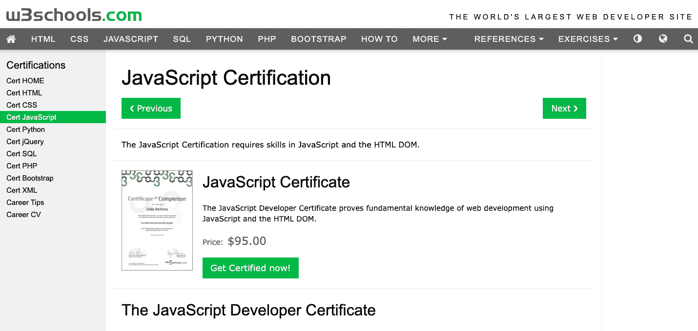
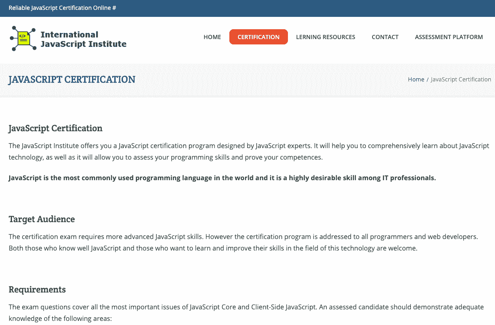
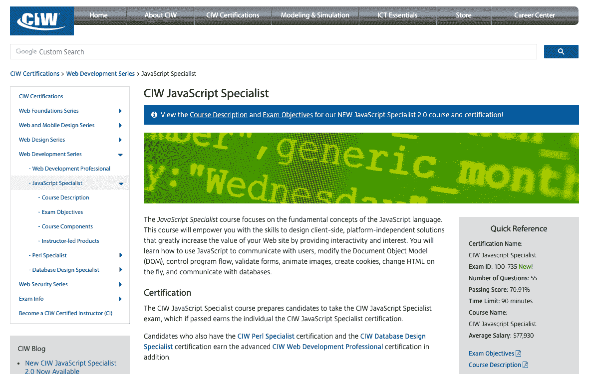
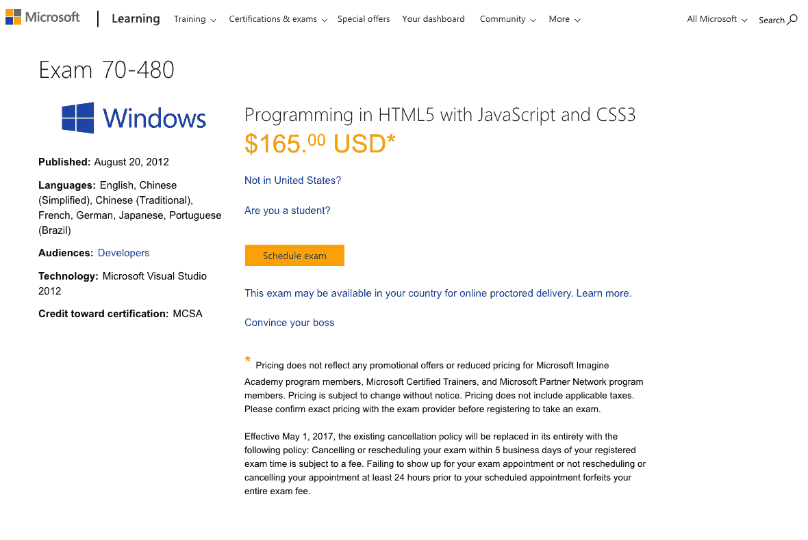

# 2023 年 5 个最佳 JavaScript 认证[更新]

> 原文：<https://hackr.io/blog/best-javascript-certification>

JavaScript 是流行的网络编程语言。它的用途非常广泛，从创建 cookies 和检测浏览器到改进网页设计、验证表单等等。

掌握 JavaScript 和相关技术，比如 DOM 和 HTML，可以让人们开发和维护交互丰富的动态网页。所有流行的网络浏览器都支持 JavaScript，包括 Chrome、Edge、Firefox、Internet Explorer 和 Safari。

JavaScript 不仅是最常用的编程语言和 web 技术之一，也是 It 行业非常需要的技能。因此，选择 JavaScript 无疑是一个好的选择。

**P.S.** -刚刚开始学习 JavaScript 还是仍打算迈出第一步？知道[如何快速学习 JavaScript】！](https://hackr.io/blog/how-to-learn-javascript)

## **5 个最佳 JavaScript 认证**

有人说证书在编程中没那么重要。只有两条路可以绕过它；你要么做，要么不做。

然而，许多人会证明的是，拥有顶级证书让你从同龄人中脱颖而出，从而拥有更好的工作机会，更高的工资，并对自己的技能更有信心。

为了帮助你选择最合适的 JavaScript 认证，我们在这里挑选了 5 个最好的 JavaScript 认证:

[****](https://www.w3schools.com/cert/cert_javascript.asp)

水平-初学者
平台 W3Schools

学习 web 技术的流行平台 W3Schools 为有兴趣获得 JS 技能认证的考生提供 JavaScript 开发人员证书。除了 JavaScript 方面的专业知识，该证书还评估和验证候选人操作 HTML [DOM](https://en.wikipedia.org/wiki/Document_Object_Model) 的能力。

JavaScript 开发人员证书考试中出现的所有问题都基于:

但是，您可以浏览其他 JavaScript 学习材料，如书籍、在线课程和网络研讨会，为认证考试做准备，并增强您的 JavaScript 知识。

为了防止在考试时使用任何不公平的手段/作弊，考生可以自行选择一名监督员。她可以是老师，老板，也可以是有经验的 JavaScript 程序员。主管的姓名和头衔将印在证书上。

尽管 W3Schools 的 JavaScript 认证的通过率是 75%,但成功获得 95%或以上分数的候选人将会在他们的证书上增加一个优秀学位标记。

#### **考试详情**

名称–JavaScript 开发者证书
代码–不适用
时长–70 分钟
语言–英语
通过率–75%
先决条件–无
价格–95 美元
题型–多项选择，是非题
总题数–70

你可以在这里注册。

[****](https://www.javascriptinstitute.org/javascript-certification/)

水平-中级/高级
平台-国际 JavaScript 协会(IJSI)

另一个顶级的 JavaScript 认证是由国际 JavaScript 协会认证的 JavaScript 开发人员。认证计划不仅评估候选人使用 JS 的能力，还提供了学习流行的 web 编程语言的高级概念的机会。

JavaScript 认证对于专业 JavaScript 开发人员以及那些希望提高 JS 技能的人来说是有价值的。在简历中加入 IJSI 认证的 JavaScript 开发人员证书将有助于 JS 开发人员获得更高的工资、更好的工作职位和行业认可。

认证 JavaScript 开发人员考试涵盖了核心和客户端 JavaScript 的重要主题。IJSI 认证的候选人精通:

*   编程的一般原则
*   JavaScript 基础知识，如语法、控制结构、数据类型、表达式和运算符
*   JavaScript 数组、函数和索引集合
*   web 浏览器中的 JS、DOM、浏览器对象模型、AJAX、事件处理和图形
*   基于原型的面向对象编程、类和对象
*   JavaScript Web APIs

为了确保评估的可信度，JS 认证考试完全由 IJSI 监考人通过视频电话进行监控。

#### **考试详情**

姓名-认证 JavaScript 开发人员
代码-CJSD
时长-90 分钟
语言-英语
通过率-70%
先决条件-无
价格-€70
题型-单项选择、多项选择、自由文本(开放式答案)
总题数-70

你可以在这里注册。

### 推荐 JavaScript 课程

【JavaScript 全教程 2023:从零到专家！

[****](https://www.microsoft.com/en-us/learning/exam-98-382.aspx)

水平-初学者
平台-微软

Microsoft Technology Associate(MTA)认证证明候选人具备在特定技术领域开始工作的基本知识和必要技能，从编程到数据库管理和安全。

考生可以通过考试 98-382 来验证他们的 JavaScript 技能，并获得 MTA 认证。除了 JavaScript，考生还可以在一系列考试中进行选择，以获得 MTA 证书并验证他们的技能。这些考试是:

*   考试 98-349: Windows 操作系统基础
*   考试 98-361:软件开发基础
*   考试 98-364:数据库基础
*   考试 98-365: Windows 服务器管理基础
*   考试 98-366:网络基础
*   考试 98-367:安全基础
*   考试 98-368:移动和设备基础
*   考试 98-375: HTML5 应用程序开发基础
*   考试 98-381:Python 编程入门
*   考试 98-383:HTML 和 CSS 编程入门
*   考试 98-388:Java 编程入门

候选人可以自由获得他们喜欢的 MTA 认证。是的，考生通过的每一门考试都可以获得 MTA 认证。考试 98-382 评估应试者使用 ECMAScript v5 的能力，特别是 JavaScript 的能力。

MTA:考试 98-382 认证个人可以:

*   阅读、理解和编写 JavaScript 程序
*   对 JS 数据类型、函数、关键字、方法、操作符和变量有很好的了解
*   实施和分析决策和循环
*   与 DOM 和 HTML 表单交互

#### **考试详情**

名称–使用 JavaScript
代码编程简介–考试 98-382
时长–45 分钟
语言–中文(简体)、中文(繁体)、英语、法语、德语、日语、韩语、葡萄牙语(巴西)和西班牙语
通过率–不适用
先决条件–无
价格–127 美元
问题类型–不适用
问题总数–39

你可以在这里注册。

[****](https://www.ciwcertified.com/ciw-certifications/web-development-series/javascript-specialist)

一级-中级
平台-CIW

CIW 代表认证互联网网络专业人员。自 90 年代中期以来，它是美国供应商中立认证的领先提供商之一。通过 CIW 认证的领域包括网页设计、开发、数据库、网络、管理和安全。

CIW JavaScript 专家认证的目标是对设计客户端、独立于平台的解决方案感兴趣的候选人，这些解决方案可以增强客户的交互性和兴趣。CIW JavaScript 专家认证确保持有者可以:

*   与用户交流
*   修改文档对象模型
*   控制程序流程
*   验证表单
*   动画图像
*   创建 cookies
*   更改 HTML
*   与数据库通信

CIW JavaScript 专家课程的第一部分侧重于基本的 JS 原则和技术，特别是标准的编程实践，处理数据和变量，以及使用事件、函数和方法。

之后，候选人将学习中级 JS 编程技术，例如:

*   使用程序流的控制结构
*   操作 JS DOM
*   部署语言对象
*   创建和使用表达式和自定义对象

JavaScript 认证还关注用于调试和纠正 JS 代码的工具和技术，以及 JS 的扩展，如 [JavaScript 框架](https://hackr.io/blog/best-javascript-frameworks)和库，使用 AJAX 的高级交互式 web 应用程序，以及 web APIs。JS 认证非常适合于:

1.  软件开发人员
2.  网页设计师
3.  Web 开发人员
4.  UI/UX 设计师
5.  全栈开发人员

#### **考试详情**

姓名–CIW JavaScript 专员
代码–1d 0-735
时长–90 分钟
语言–英语
通过率–70.91%
先决条件:

*   对互联网的熟悉程度
*   阅读和编写网页
*   网络结构
*   熟悉 HTML
*   CIW 网络基金会助理认证/同等知识

价格–150 美元
问题类型–不适用
问题总数–55

你可以在这里注册。

[****](https://www.microsoft.com/en-us/learning/exam-70-480.aspx)

中级平台-微软

严格来说，这并不适合(想要成为)JavaScript 开发人员，也适合那些对 HTML 和 CSS 技术感兴趣的人。通过考试 70-480:使用 JavaScript 在 HTML5 中编程以及以下两个考试之一:

*   考试 70-483:C 语言编程
*   考试 70-486:开发 ASP.NET MVC Web 应用程序

为候选人赢得 [MCSA:网络应用认证](https://www.microsoft.com/en-us/learning/mcsa-web-applications-certification.aspx)，证明候选人在实现现代网络应用方面的能力和专业知识。这是承担网站开发人员或网站管理员角色的理想认证。

你可以在这里注册。

## 准备 JavaScript 认证的 5 门最佳课程

准备好准备 JavaScript 认证考试(或者希望[学习 JavaScript](https://hackr.io/tutorials/learn-javascript?ref=blog-post) )？有几种方法可以做到这一点，包括阅读书籍，观看视频教程，参加网络研讨会，以及参加在线课程。

以下是我们挑选的五门排名最高的 JavaScript 课程，希望对您的 JavaScript 认证准备过程有所帮助:

持续时间- 5 周/33+小时
级别-中级
平台- Coursera

约翰霍普金斯大学通过 coursera 为 Web 开发人员提供 HTML、CSS 和 Javascript 课程。由于该课程除了 JS 之外还详细介绍了 CSS 和 HTML，所以它非常适合有兴趣进入或进入 web 开发领域的人。本课程涵盖:

1.  JavaScript 简介
2.  使用 CSS 和 HTML 实现网页
3.  如何编写自动调整、自动排列网页元素的代码
4.  构建一个全功能的 web 应用程序，利用 AJAX 向用户公开服务器端的功能和数据

实际上，面向 Web 开发人员的 HTML、CSS 和 Javascript 课程是约翰霍普金斯大学提供的 Ruby on Rails Web 开发专业的第四门课程(共 6 门)。

尽管如此，那些准备通过 JavaScript 认证的人也可以参加这个课程，因为 JavaScript 认证要求初级到中级的使用流行脚本语言的能力。除了英语，JavaScript 课程也有韩语版本。

JavaScript 课程以总计近 800 分钟的视频讲座为特色，还有 20 多篇阅读材料和 47 次测验。Yaakov Chaikin 是怀汀工程学院的计算机科学毕业生和兼职教授，他是课程的讲师。

#### **涵盖的主题**

*   设置开发环境:操作系统、Github 和浏览器同步
*   HTML5 简介
*   HTML 内容模型
*   HTML 标签的剖析
*   HTML 字符实体引用
*   CSS3 简介
*   CSS 规则的剖析
*   元素、类和 ID 选择器
*   样式放置
*   自举网格系统
*   JavaScript 简介
*   公共语言结构
*   定义变量、函数和范围
*   处理默认值
*   数组和闭包
*   函数构造函数、原型和“this”关键字
*   DOM 操作
*   处理事件
*   AJAX 基础知识
*   正在处理 JSON

你可以在这里注册。

持续时间–7 小时 21 分钟(灵活)
级别–初级
平台–Udemy

JavaScript 2019: JavaScript ES6 认证课程不仅让你在 JavaScript 认证考试中表现优异，还能让你获得 JavaScript 专家认证。整个课程运行 7 分钟，贯穿 37 个视频讲座 21 分钟。

学生可以在他们选择的任何操作系统上受益，即 Linux、macOS 和 Windows。从 JavaScript 课程开始的唯一要求是很好地掌握 HTML 的[基础知识](https://hackr.io/blog/html-cheat-sheet)。本课程旨在:

1.  任何准备 JavaScript 认证考试的人
2.  那些希望开始编码生涯的人
3.  希望开始使用 JavaScript 开发应用程序的学生

框架电视公司(Framework Television Inc .)是一家新的后有线技术电视网，资深程序员和编程教师马克·拉索夫(Mark Lassoff)是 JavaScript 2019: JavaScript ES6 认证课程的创始人，该课程提供积极的社区支持，帮助注册学生在遇到困难时获得即时帮助。

该课程还提供了 15 种可下载资源，以改善学习体验。JavaScript 课程包括使用 JavaScript 开发七个应用程序，帮助学生实际学习他们在课堂上学到的概念。

#### **涵盖的主题**

*   ES6 语法和用法
*   为 web 应用程序集成 JS 和 HTML5
*   数组
*   班级
*   解构
*   功能
*   如果这然后那
*   循环迭代
*   地图和集合
*   多行字符串和字符串模板
*   经营者
*   承诺
*   变量

你可以在这里注册。

持续时间- 4 周/21-22 小时
级别-初级
平台- Coursera

另一个准备 JavaScript 认证的最好的课程，也是涉及 CSS 和 HTML 的课程，如 MCSA 考试 70-480，是 Coursera 提供的 JavaScript、HTML 和 CSS 编程基础课程。

由杜克大学提供的基于 JavaScript 的课程是 Java 编程和软件工程基础专业的五门课程中的第一门。该课程包括学习基本的编程概念和像程序员一样解决问题的方法。

四位经验丰富的讲师讲授整个课程:

1.  Susan H. Rodger -实践/计算机科学教授
2.  罗伯特·杜瓦尔-讲师/计算机科学
3.  Owen Astrachan -实践/计算机科学教授
4.  Andrew D. Hilton -实践/电气和计算机工程副教授

JavaScript、HTML 和 CSS 的编程基础课程在结束时涉及一个迷你项目，包括创建一个上传图像和应用图像过滤器的网页。完成本课程的任何人都将能够:

*   使用编程解决问题时运用批判性思维
*   使用 CSS IDs 和类将样式添加到网页
*   使用 JavaScript 增加/增强网页的交互性
*   使用 JavaScript 程序，特别强调函数、循环和条件语句
*   编写创建网页的 HTML 代码

本课程共有 12 个小测验，让注册学生评估他们对课程中详细介绍的概念的吸收程度。此外，它有 29 个阅读，使学习过程更加舒适和有效。

#### **涵盖的主题**

*   HTML、CSS 和 JavaScript 的基础
*   交互式更改页面
*   CSS 中的颜色和名称
*   图像转换(彩色到灰度)
*   图像和存储
*   输入和事件
*   开发算法
*   duck earn 程序环境
*   格式化文本
*   HTML5 画布
*   解决编程问题的七个步骤

你可以在这里注册。

总题数- 160 (4 套)
关卡-所有关卡
平台- Udemy

MCSA 70-480 - 4 真实模拟练习集是为那些有兴趣参加 70-480:用 JavaScript 和 CSS 考试编程 HMTL5 的人设计的。

由购物中心学院创建的练习集有四个不同的系列，每个系列有 60 个问题。添加到练习集中的所有问题都基于 MCSA 考试 70-480 的考试目标。每个练习集属于微软认证考试相关大纲的四个领域:

1.  实现和操作文档结构和对象
2.  实施程序流程
3.  访问和保护数据
4.  在应用程序中使用 CSS3

要从这个 Udemy JavaScript 课程中受益，你需要对 HTML5、JavaScript 和 CSS3 有一个基本的了解。

你可以在这里注册。

总问题- 239
级-中级
平台- Udemy

对于那些准备 CIW JavaScript 专家认证的人来说，Udemy 的 CIW JavaScript 专家实践考试是必去的选择。

由经验丰富的软件工程师和培训师德里克·布鲁创建，所有的练习题分为四组，足以涵盖 CIW JavaScript 专家证书考试的整个大纲。

CIW JavaScript 专家实践考试是进一步或复查 CIW 认证准备工作的理想选择。

好了，这就是准备 JavaScript 认证的最佳课程。需要更多最好的 JavaScript 课程？试试这些[十个最好的在线 JavaScript 课程](https://hackr.io/blog/best-javascript-courses)。

你可以在这里注册。

## **结论**

这总结了我们的顶级 JavaScript 认证列表。希望您能找到最符合您要求的 JavaScript 认证。

虽然编程经验是不可替代的，但拥有一个证书肯定能帮助你在竞争中脱颖而出，并对你的技能组合能完成的事情有更多的信心。

想进一步探索 JavaScript 吗？考虑看看这些 [JavaScript 博客文章](https://hackr.io/blog/category/javascript)。

**人也在读:**