# 2023 年 15 门最佳 JavaScript 在线课程【免费+付费】

> 原文：<https://hackr.io/blog/best-javascript-courses>

JavaScript 在 90 年代中期首次被引入，以使网站具有交互性，目前超过 98%的网站的客户端使用 JavaScript。如果你在网站上点击、拖动或移动某个东西，这很有可能要归功于 JavaScript。

以对初学者友好而闻名，学习 JavaScript 通常不需要预先的编程知识。当你考虑到大量流行的[框架](https://hackr.io/blog/best-javascript-frameworks)和库，如 React、Angular 和 Vue，难怪 [JavaScript 在最近的 StackOverflow 开发者调查中排名第一](https://survey.stackoverflow.co/2022/#technology-most-popular-technologies)。

如果你准备好学习 JavaScript，但不知道从哪里开始，我们会支持你。我们已经在网上找到了 2023 年 15 门最好的 JavaScript 课程，所以无论你是一个完全的初学者还是一个想要增加技能的有经验的开发人员，请继续阅读！

**特色 JavaScript 课程【编辑推荐】**

## **在线选择最佳 JavaScript 课程**

为了帮助你挑选最好的在线 JavaScript 在线课程，我们精心挑选了 15 门最好的在线课程，包括你可以期望学到的内容以及每门课程的优缺点。当我们整理清单时，我们考虑了几个因素。

1.  **创作者可信度:**他们作为编程老师有多少经验？学生积极评价的比例是多少？
2.  **内容:**课程的全面性和参与性如何？作为一名 JavaScript 开发人员，这些话题与你将面临的现实挑战相关吗？
3.  **社区:**有多少人参加了该课程或目前正在注册？如果你需要帮助，找到它有多容易？

## **15 门最佳 JavaScript 在线课程**

想要你的简历脱颖而出吗？考虑添加

**[最佳 JavaScript 认证](https://hackr.io/blog/best-javascript-certification)**

**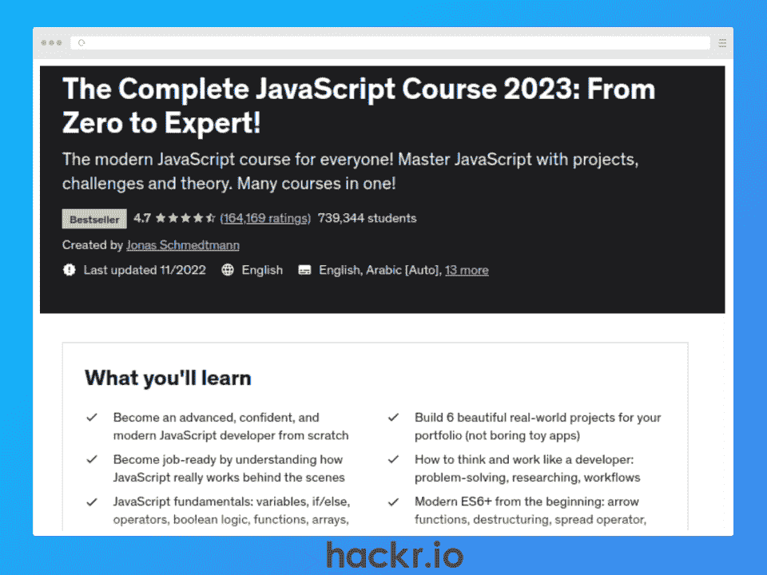
**

**[了解更多](https://click.linksynergy.com/deeplink?id=jU79Zysihs4&mid=39197&murl=https%3A%2F%2Fwww.udemy.com%2Fcourse%2Fthe-complete-javascript-course%2F)**

**我们为什么选择本课程**

作为 Udemy 上最好的 JavaScript 课程，这是初学者的绝佳选择，因为它涵盖了 JavaScript、数据结构、DOM、OOP 和异步编码的基础知识。您还将构建一个地理定位应用程序和一个食谱应用程序来实践您所学的内容。

作为奖励，它还包括一个小时的 HTML/CSS 速成班，以及如何使用 NPM (JavaScript 包管理器)和 Git 的额外学习材料。

**优点**

*   定期更新和下载的课程内容
*   还要学习 HTML、CSS 和 Git
*   适合完全初学者

**缺点**

*   不是一门快速入门课程，所以需要时间投入

**关键信息**

**平台:** Udemy

**课程讲师:**乔纳斯·谢特曼

**等级:**初学者

**时长:** 69 小时(视频内容)

**免费或付费:**付费

**证书:**是

**注册学生:** +700K

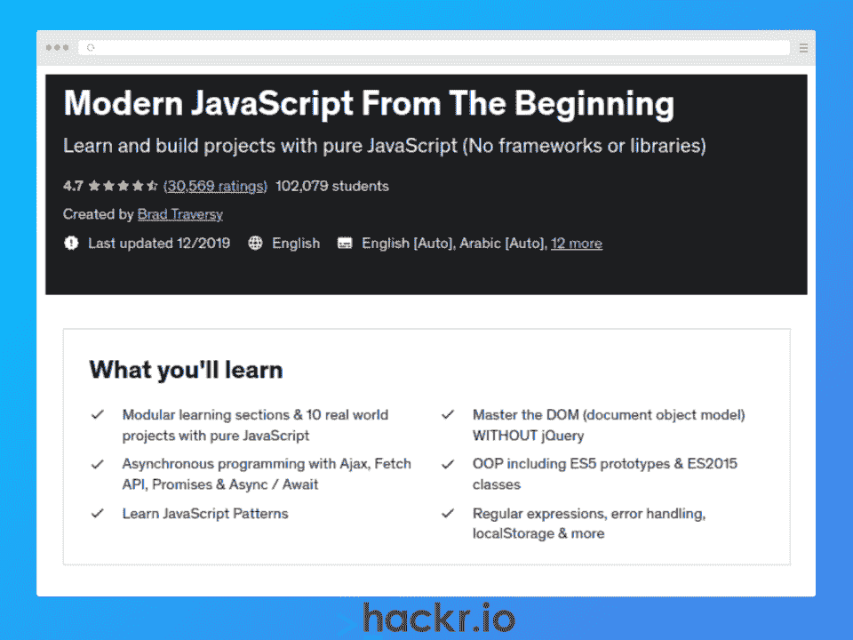

**[了解更多](https://click.linksynergy.com/deeplink?id=jU79Zysihs4&mid=39197&murl=https%3A%2F%2Fwww.udemy.com%2Fcourse%2Fmodern-javascript-from-the-beginning%2F)**

**我们为什么选择本课程**

如果你想学习纯 JavaScript，不需要任何框架或库，这是最好的 JavaScript 教程之一。

作为顶级 JavaScript 在线课程之一，它涵盖了基本的 JavaScript 概念，如数据类型、变量和函数。您还将学习高级主题，如 DOM 操作、OOP、异步编码和 JavaScript 模式。在你得到理论后，你将通过 10 个独特的项目把它付诸实践。

**优点**

*   访问 GitHub repo 以跟进
*   JavaScript 模式一节
*   为你的投资组合建立 10 个项目

**缺点**

*   需要基本的 HTML 和 CSS 知识

**关键信息**

**平台:** Udemy

课程讲师:布拉德·特拉弗斯

**等级:**初学者

**时长:** 21.5 小时(视频内容)

**免费或付费:**付费

**证书:**是

**注册学生:** +100k

**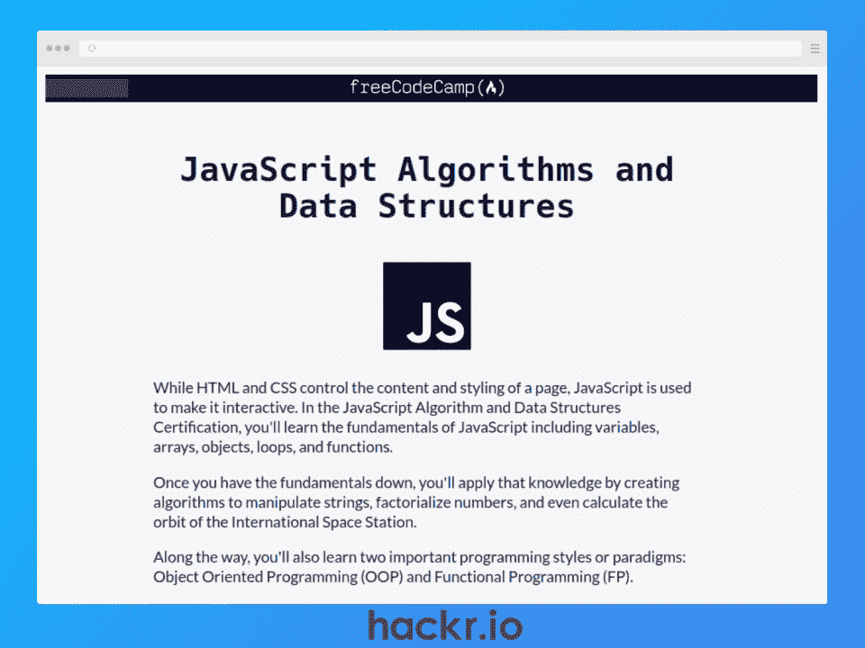
**

**[了解更多](https://www.freecodecamp.org/learn/javascript-algorithms-and-data-structures/)**

**我们为什么选择本课程**

作为最受欢迎的 JavaScript 在线课程之一，这个学习路径有一个真正全面的课程，需要大约 300 个小时才能完成。使用 100%基于文本的内容，您将了解 ES6 语法、正则表达式、调试、数据结构等等。

在课程结束时，你可以建立五个项目来测试你的知识，并添加到你的文件夹中。任何成功构建所有五个项目的学生都将获得 FreeCodeCamp 颁发的证书。

**优点**

*   完全免费！
*   从初级到中级主题的详细内容
*   为您的投资组合构建 5 款应用

**缺点**

*   100%基于文本，因此可能不适合视觉学习者

**关键信息**

**平台:** FreeCodeCamp

**课程讲师:**不适用

**等级:**初学者

**持续时间:** 300 小时(基于文本的内容)

**免费或付费:**免费

**证书:**是

**注册学生:**不适用

**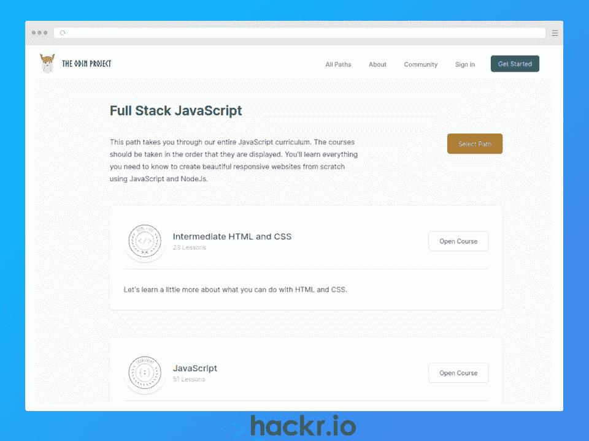
**

**[了解更多](https://www.theodinproject.com/paths/full-stack-javascript)**

**我们为什么选择本课程**

这个开源培训课程提供了互联网上一些最好的学习资源，它也是一个*全栈*项目。

因此，你不仅要学习普通的 JavaScript，还要学习前端的 HTML/CSS 和 React，后端的 Node.js 和 Express。您还将学习 NoSQL 和 MongoDB 的数据库管理。

**优点**

*   定期更新课程内容
*   包括基于视频和文本的混合资源
*   活跃的不和谐社区寻求支持

**缺点**

*   没有结业证书

**关键信息**

平台:奥丁计划

**课程讲师:**不适用

**等级:**初学者

**持续时间:** 4-6 个月(视频&文字内容)

**免费付费:**免费

**证书:**否

**注册学生:**不适用

**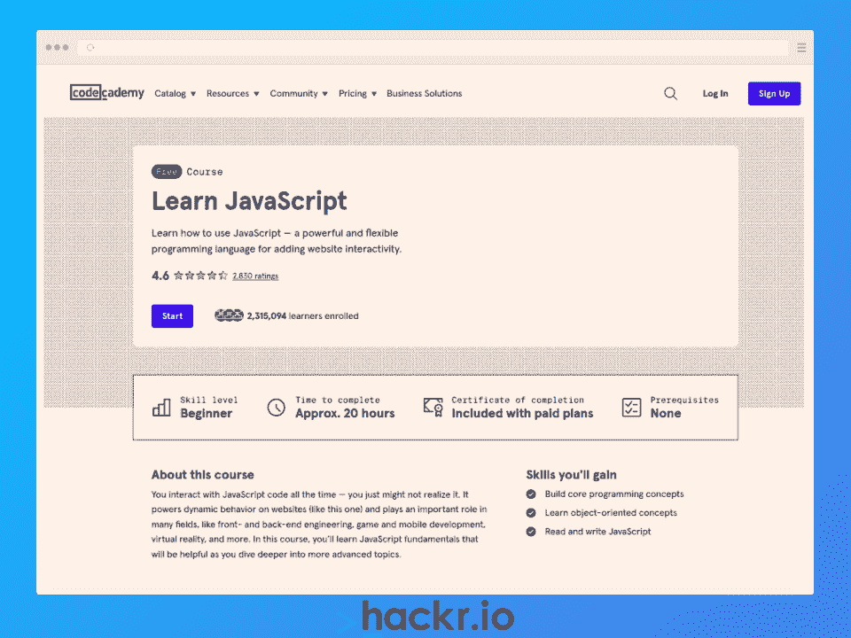
**

**[了解更多](https://www.pjtra.com/t/TUJGR0lLR0JHRklKSkdCR0ZISk1N?url=https://www.codecademy.com/learn/introduction-to-javascript)**

**我们为什么选择本课程**

本课程将帮助您快速掌握 JavaScript 的基础知识，包括条件、函数、迭代器、数组、面向对象编程(OOP)等等。

每个课程部分还包括一个项目，在这个项目中，你可以应用你所学的概念来构建一个应用程序，这是构建你的投资组合的一个很好的方式。

**优点**

*   包括 8 个测验来测试你的知识
*   基于视频和文本的课程的平衡组合
*   构建应用程序添加到您的投资组合中

**缺点**

*   如果你熟悉 JavaScript，这可能太简单了
*   没有 DOM 操作的课程

**关键信息**

**平台:**代码学院

**课程讲师:**林更新

**等级:**初学者

**时长:** 20 小时(视频&文字内容)

**免费已付:**已付

**证书:**是

**报名学生:** +2M

**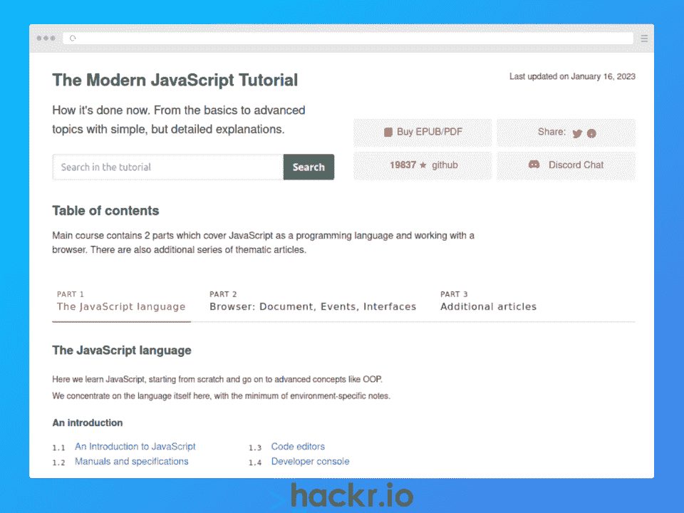
**

**[了解更多](https://javascript.info/)**

**我们为什么选择本课程**

如果您喜欢基于文本的方法，这个用户友好的 JavaScript 资源可能是您最好的 JavaScript 教程，因为它包含了丰富的 JavaScript 基础知识，重点是用浏览器编码。您还将了解代码质量、错误处理、异步 JavaScript、网络请求等等。

课程内容由背后的开源社区不断更新，所以有了 GitHub 上的+19K stars，你知道你可以信任课程材料。

**优点**

*   使用搜索功能轻松导航到特定主题
*   用 Mocha 学习自动化测试
*   有多种语言版本

**缺点**

*   不适合那些喜欢通过视频学习的人

**关键信息**

**平台:** JavaScript.info

**课程讲师:**不适用

**等级:**初学者

**持续时间:**自定进度

**免费或付费:**免费

**证书:**无

**注册学生:**不适用

**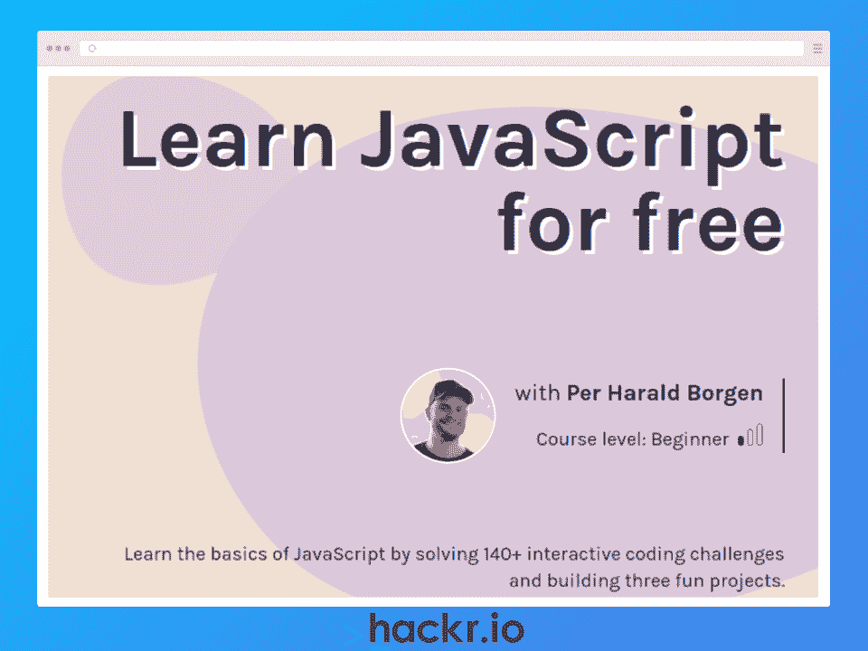
**

**[了解更多](https://scrimba.com/learn/learnjavascript)**

**我们为什么选择本课程**

这是 Scrimba 上前端开发人员道路的一部分，如果你喜欢在学习时动手，这是最好的 JS 课程之一。

您将学习 JavaScript、DOM 的基础知识，如何使用本地存储，并且您可以跟随 140 个交互式编码挑战。您还可以构建三个 JavaScript 项目来帮助巩固您的知识，同时向您的作品集添加内容来展示您的技能。

**优点**

*   非常适合通过“构建材料”来学习
*   创建应用程序以添加到您的作品集
*   Scrimba 有一个活跃的不和谐社区

**缺点**

*   需要基本的 HTML 和 CSS 知识

**关键信息**

**平台:** Scrimba

**课程讲师:** Per Harald Borgen

**等级:**初学者

**时长:** 7.75 小时(视频内容)

**免费或付费:**免费&付费选项

**证书:**无

**注册学生:** +100K

**[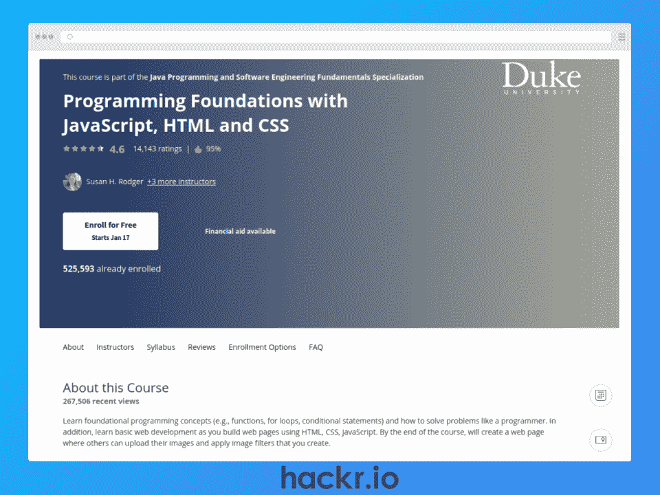](https://imp.i384100.net/QO3z0P)** 

**[了解更多](https://imp.i384100.net/c/2890636/1347618/14726?u=https%3A%2F%2Fwww.coursera.org%2Flearn%2Fduke-programming-web&partnerpropertyid=2722169)**

**我们为什么选择本课程**

如果你正在寻找 JavaScript 的 web 开发培训课程，这是一个很好的起点。你不仅要学习算法和一般的编程概念，还要从杜克大学的四位教授那里学习用 JavaScript、HTML 和 CSS 来构建网页。

这门 JavaScript 课程涵盖了最基本的 web 开发主题，包括函数、循环和条件语句。在课程结束时，您还可以通过创建一个带有图像滤镜应用程序的网站来将您的知识付诸实践，这是您的作品集的理想之选。

**优点**

*   计算思维的伟大入门
*   向杜克大学教授学习
*   结合 JavaScript、HTML 和 CSS 进行前端开发

**缺点**

*   如果你已经知道 JavaScript，可能太基础了

**关键信息**

**平台:** Coursera

课程讲师:苏珊·罗杰，罗伯特·杜瓦尔，欧文·阿斯特拉昌，安德鲁·希尔顿

**等级:**初学者

**时长:** 33 小时(视频内容)

**免费或付费:**付费

**证书:**是

**注册学生:** +500k

**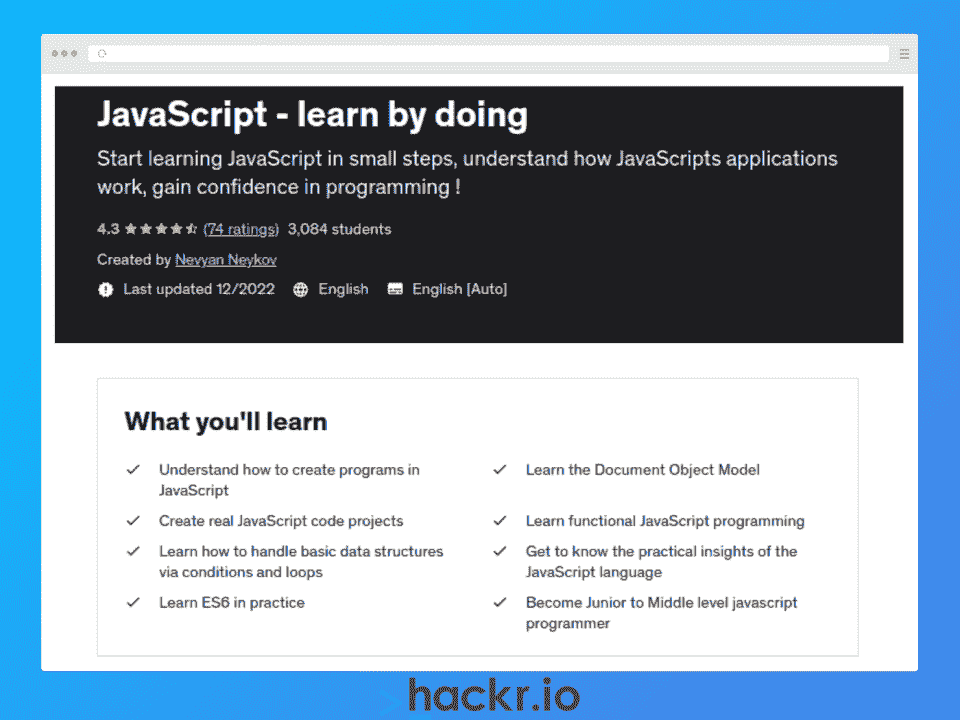
**

**[了解更多](https://click.linksynergy.com/deeplink?id=jU79Zysihs4&mid=39197&murl=https%3A%2F%2Fwww.udemy.com%2Fcourse%2Fjavascript-for-beginners-with-examples%2F)**

**我们为什么选择本课程**

这门 JavaScript 课程将带您了解这门语言的基础知识，包括数据类型、数据结构、条件、函数、ES6 语法和 DOM。这也是一门实践课程，这意味着你将获得大量实践经验来提高你的编码技能。

您将学习如何为各种项目创建 JavaScript 动画，这些项目可以添加到您的投资组合中，包括旋转滑块、弹出表单和购物车。学习 JavaScript 动画是创建具有改进用户体验的交互式网站的好方法(UX)。

**优点**

*   要添加到您的投资组合中的项目
*   Git 和 GitHub 的奖金部分
*   关于用 JavaScript 解决面试问题的课程

**缺点**

*   不适用于高级学习者

**关键信息**

**平台:** Udemy

**课程讲师:** Nevyan Neyko

**等级:**初学者

**时长:** 6 小时(视频内容)

**免费或付费:**付费

**证书:**是

**注册学生:** +3k

**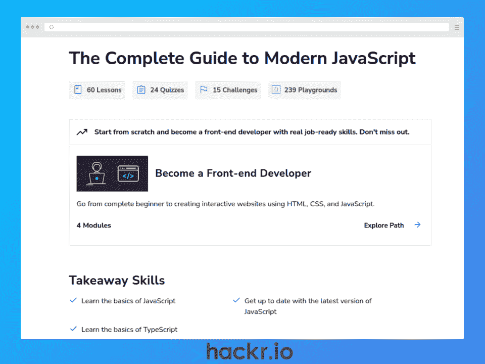
**

**[了解更多](https://click.linksynergy.com/deeplink?id=jU79Zysihs4&mid=47764&murl=https://www.educative.io/courses/complete-guide-to-modern-javascript)**

**我们为什么选择本课程**

JavaScript 是一种不断发展的语言。每年都有新的更新加入，使它更加动态和强大。如果您想学习现代 JavaScript 语法，这一基于文本的课程提供了一些最好的在线 JavaScript 培训，包括从 ES2016 到 ES2022 引入的新功能部分。

在本课程中，您还将学习 TypeScript 的基础知识，这将使您在申请 JavaScript 工作时成为更理想的候选人。

**优点**

*   如果你喜欢基于文本的学习，这是一个很好的选择
*   通过内置评估测试您的技能
*   通过基于云的 IDE 解决编码难题

**缺点**

*   基于文本的内容可能对视觉学习者没有吸引力

**关键信息**

平台:教育性

课程讲师:阿尔贝托·蒙塔莱斯

**等级:**初学者

**持续时间:** 6 小时(基于文本的内容)

**免费或付费:**付费

**证书:**是

**注册学生:**不适用

[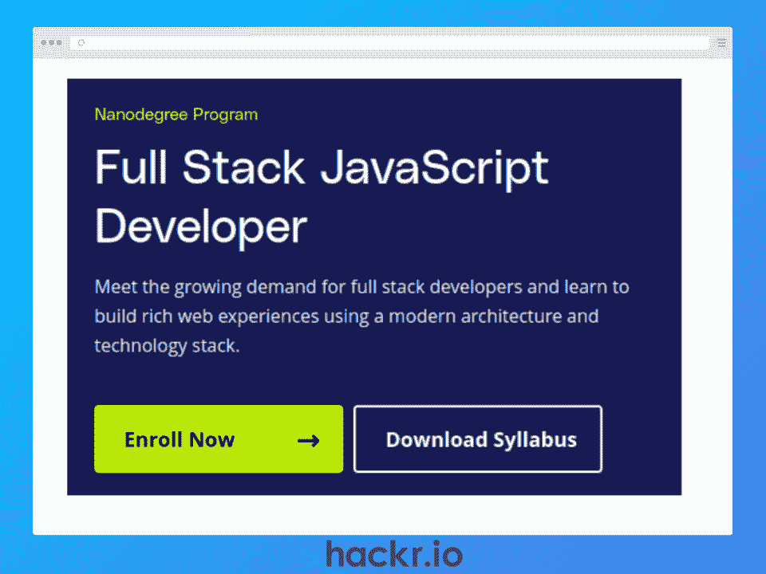](https://imp.i115008.net/zaAMY6)

**[了解更多](https://imp.i115008.net/c/2890636/788199/11298?u=https%3A%2F%2Fwww.udacity.com%2Fcourse%2Ffull-stack-javascript-developer-nanodegree--nd0067&partnerpropertyid=2722169)**

**我们为什么选择本课程**

如果成为一名全栈 JavaScript 开发人员听起来像是一份理想的工作，那么这可能是你学习 JavaScript 的最好地方。由 4 个子课程组成，首先学习 Node.js 的后端开发，然后继续学习 PostgreSQL 和 Express 来构建您的后端。

然后，您将学习如何使用 Angular 框架构建前端应用程序，这将允许您通过构建一个电子商务应用程序来整合所有的全栈开发知识。

**优点**

*   在每门课程后构建应用程序来巩固你的知识
*   由经验丰富的软件工程师进行代码审查
*   职业教练帮助你获得下一份开发工作

**缺点**

*   Udacity pro 会员相当贵

**关键信息**

**平台:** Udacity

指导老师:雷切尔·曼宁，艾丽莎·霍普，安德鲁·王，纪尧姆·b·拉维奥莱特

**等级:**中级

**时长:** 160 小时(视频内容)

**免费或付费:**付费

**证书:**是

**注册学生:**不适用

**[了解更多](https://javascript30.com/)**

**我们为什么选择本课程**

你可以看[最好的 JavaScript 书籍](https://hackr.io/blog/javascript-books)，上最好的在线 JavaScript 课程，但是不练是不会有提高的。最好的方法就是建立项目。对于项目来说，这可能是 JavaScript 的最佳课程。

在本课程中，您将使用普通 JavaScript(没有库、框架或编译器)构建 30 个项目，包括一个视频播放器、倒计时时钟和语音识别应用程序。这些可以成为你投资组合的一个极好的补充，帮助你在申请 JavaScript 开发工作时脱颖而出。

**优点**

*   完全免费！
*   访问项目解决方案以与您的代码进行比较

**缺点**

*   假设有 HTML、CSS 和基本的 JavaScript 知识

**关键信息**

**平台:** JavaScript30

**课程讲师:**韦斯·博斯

**难度:**中级

**时长:** 30 天(视频内容)

**免费付费:**免费

**证书:**无

**注册学生:**不适用

想要将项目添加到您的投资组合中吗？结账

**[15 个最好的 JavaScript 项目](https://hackr.io/blog/javascript-projects)**

**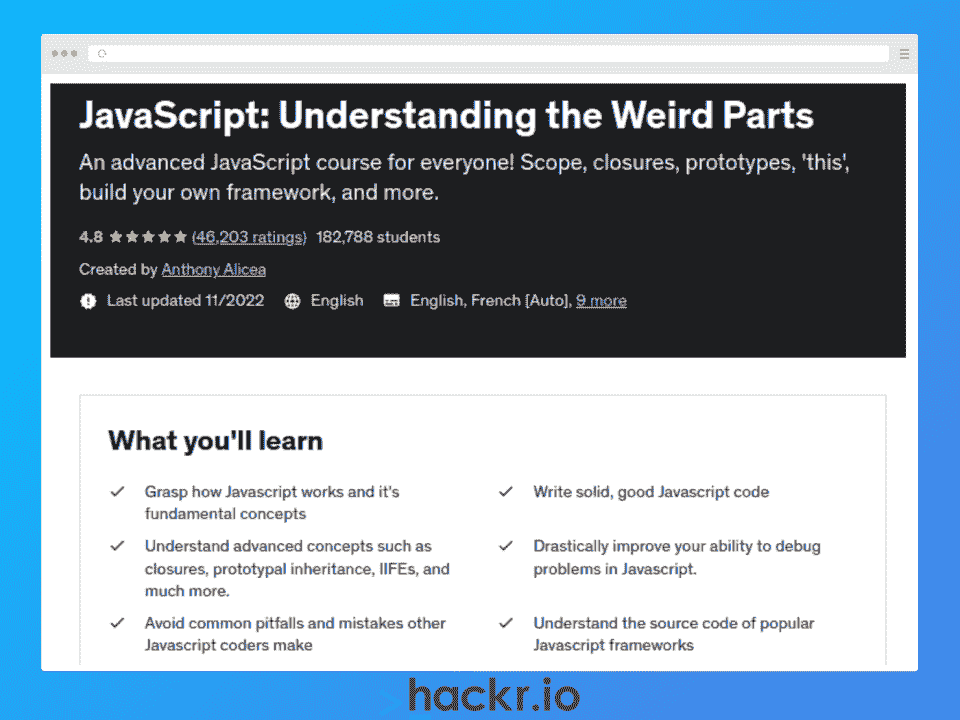
**

**[了解更多](https://click.linksynergy.com/deeplink?id=jU79Zysihs4&mid=39197&murl=https%3A%2F%2Fwww.udemy.com%2Fcourse%2Funderstand-javascript%2F)**

**我们为什么选择本课程**

线索就在这个 JavaScript 课程的名字里！因此，如果你想深入 JavaScript 的古怪部分，这是通过提高代码质量和调试技能来学习 JavaScript 的最佳课程。

这个中级 JavaScript 课程涵盖了闭包、原型继承和立即调用的函数表达式。另一个好处是，您将检查流行的 JQuery 和下划线框架的源代码，以了解 JavaScript 如何“在幕后”工作。

**优点**

*   学习构建自己的 JavaScript 框架
*   涵盖一系列高级主题，如范围链和 ES6 特性

**缺点**

*   慢速可能不适合较快的学习者

**关键信息**

**平台:** Udemy

课程讲师:安东尼·阿里西亚

**等级:**中级

**时长:** 12 小时(视频内容)

**免费或付费:**付费

**证书:**是

**注册学生:** +180K

**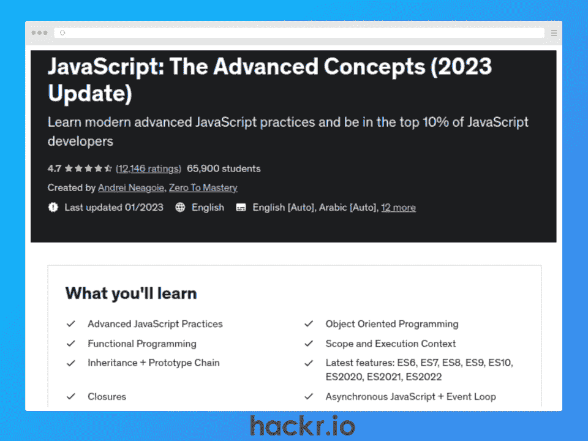
**

**[了解更多](https://click.linksynergy.com/link?id=jU79Zysihs4&offerid=980864.6459816582&bids=980864.6459816582&type=2&murl=https://www.udemy.com/course/advanced-javascript-concepts/)**

**我们为什么选择本课程**

如果您正在寻找高级 JavaScript 课程，那么这是通过详细且解释清楚的视频课程深入探究高级 JavaScript 主题的理想选择。

期望学习 JavaScript 最佳实践、最新特性、函数式和面向对象编程，以及一系列高级概念，如内存泄漏、执行上下文、异步编程、垃圾收集等等。

**优点**

*   丰富、详细且全面的课程
*   包括一个基础部分来回顾基础知识
*   “零到精通”的活跃不和谐社区

**缺点**

*   包括对于有经验的开发人员来说过于简单的主题

**关键信息**

**平台:** Udemy

**课程讲师:** Andrei Neagoie(从零到精通)

**等级:**高级

**时长:** 25 小时(视频内容)

**免费或付费:**付费

**证书:**是

**报名学生:** +65K

**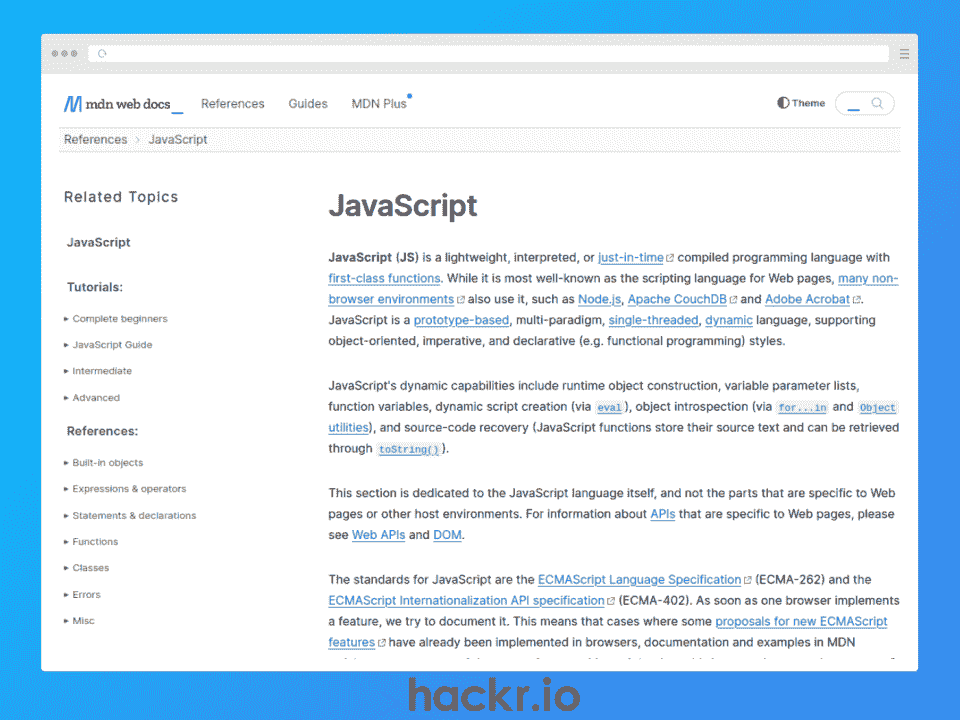
**

**[了解更多](https://developer.mozilla.org/en-US/docs/Web/JavaScript)**

**我们为什么选择本课程**

Mozilla Developer Network (MDN)文档自 2005 年以来就一直存在，是在线学习 JavaScript 的历史最悠久的互联网资源之一，包括关于 JavaScript 工具、框架和最佳实践的文章。

无论你是通过哪门课程或哪门教程来学习 JavaScript，如果你想对任何一个 JavaScript 主题进行深入的解释，这个资源都可以作为参考。

**优点**

*   优秀的参考资源
*   有多种语言版本
*   定期更新以反映新兴趋势

**缺点**

*   100%基于文本&主要是一个参考工具

**关键信息**

**平台:** MDN

**课程讲师:**不适用

**级别:**所有级别

**持续时间:**不适用

**免费或付费:**免费或付费选项

**证书:**无

**注册学生:**不适用

## **结论**

JavaScript 目前为互联网上几乎每一个网站的客户端提供支持，并且由于它是一种初学者友好的通用语言，拥有蓬勃发展的框架和库生态系统，所以它的受欢迎程度持续增长。

这篇文章列出了 2023 年 15 门最好的 JavaScript 在线课程，为想要扩展技能的新手或有经验的 JavaScript 开发人员提供了一系列选择。因此，如果你想在 2023 年学习 JavaScript，我们会满足你。

**准备好学习 JavaScript 了吗？在**上查看我们的指南

[如何学习 JavaScript](https://hackr.io/blog/how-to-learn-javascript)

## **常见问题解答**

#### **1。学习 JavaScript 最好的免费课程是什么？**

这取决于你喜欢的学习方式和你的预算。本文包括一系列免费和付费的在线课程，有基于文本和视频的内容，可以帮助您找到 javascript 的最佳教程。

#### **2。2023 年的 JavaScript 值得学吗？**

是的。JavaScript 越来越受欢迎，在 2023 年仍然是最受欢迎的编程语言。

#### **3。2 个月能学会 JavaScript 吗？**

如果你是有经验的程序员，2 个月就能学会 JavaScript。然而，如果你是一个完全的初学者，这可能需要更长的时间，因为你需要在线课程来学习像程序员一样思考，以及学习 JavaScript 语言。