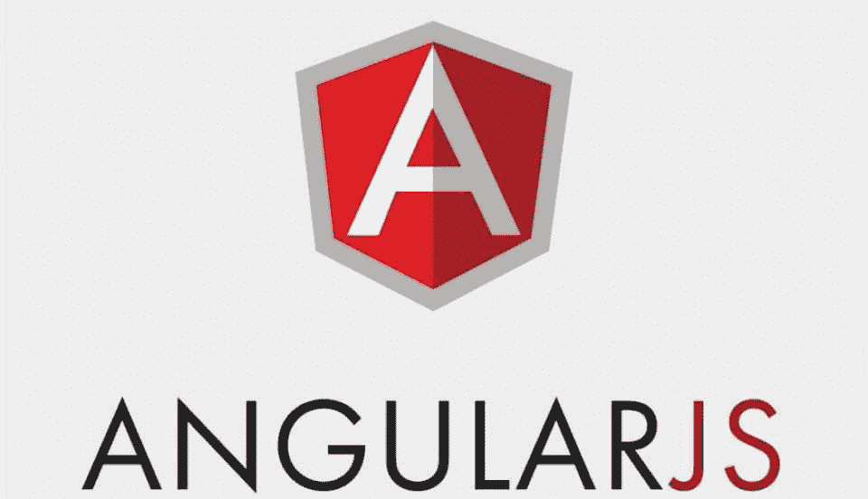
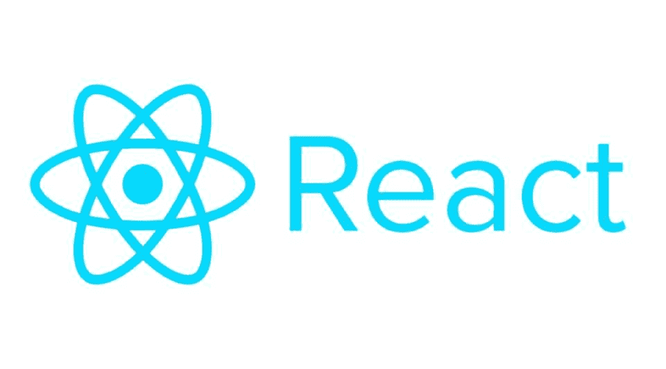
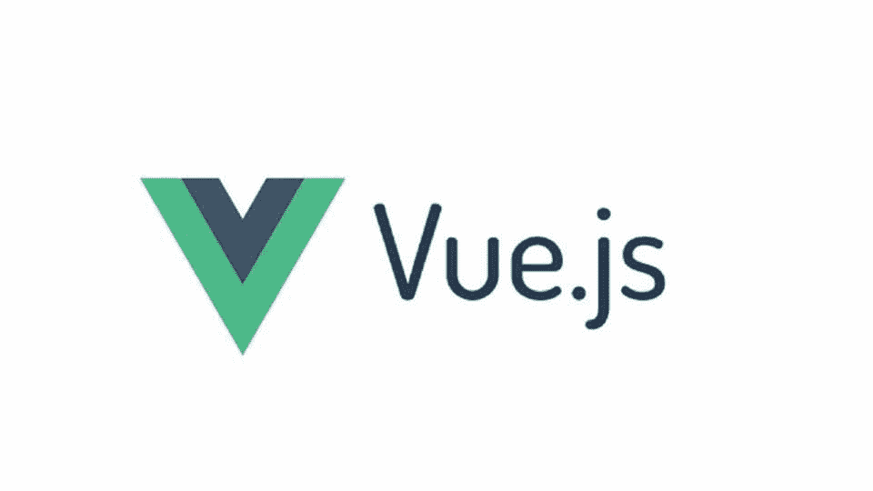
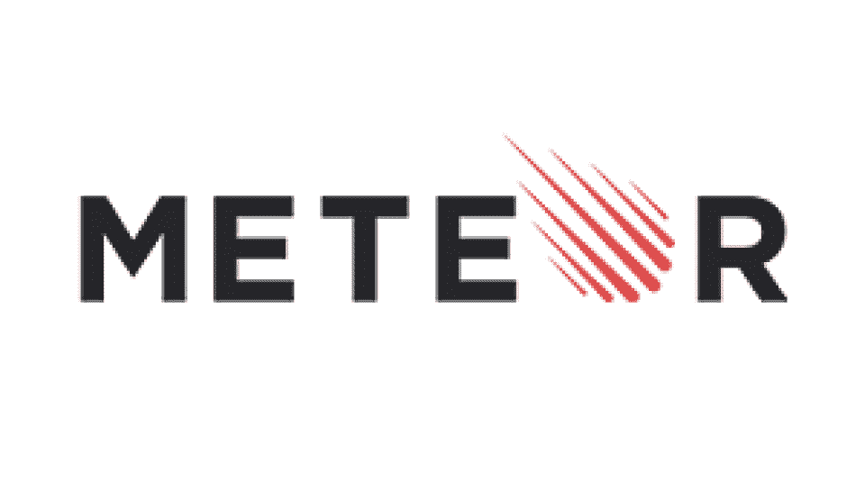
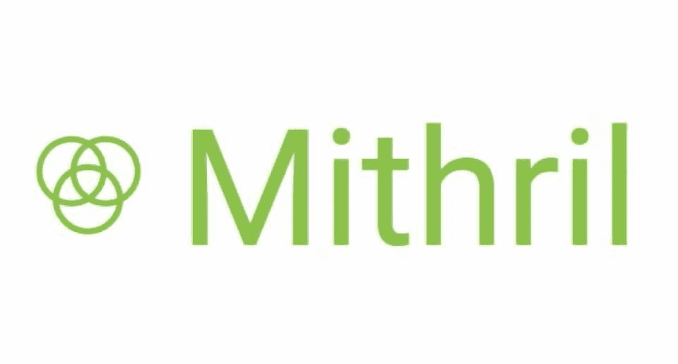
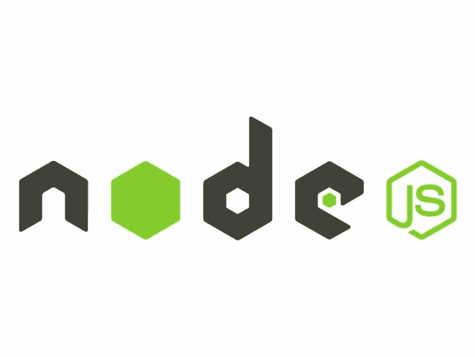
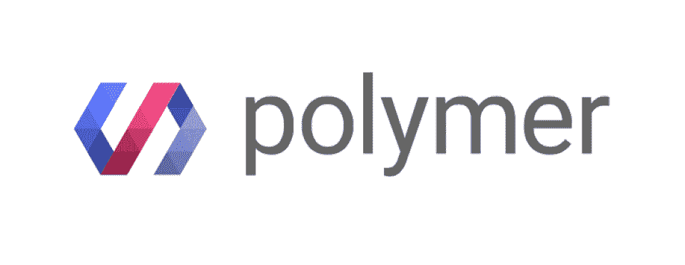
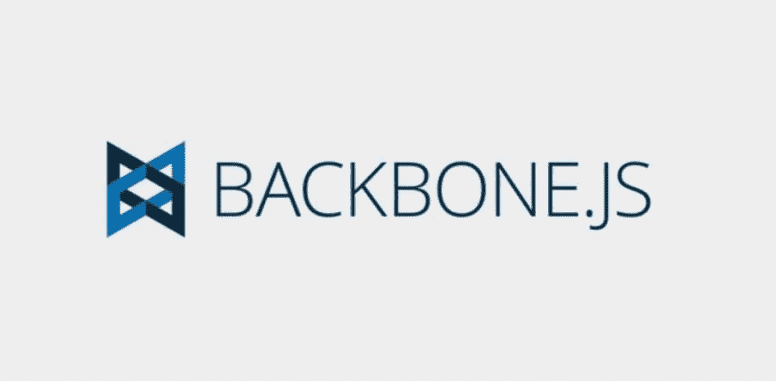

# 2023 年使用的 10 个最佳 JavaScript 框架[推荐]

> 原文：<https://hackr.io/blog/best-javascript-frameworks>

JavaScript 是一种多范例语言，支持事件驱动、函数式、面向对象和基于原型的编程风格。JavaScript 最初仅用于客户端，但在最近，它也被用作服务器端编程语言。

因此， [JavaScript](https://hackr.io/blog/what-is-javascript) 被许多人认为是网络语言。它绝不是 web 上唯一的语言，但是它非常流行，已经有了很多可用的框架。

在这里，我们讨论了将在 2023 年使用的各种 JavaScript 框架，它们的特性，优缺点，以及其他一些东西。但是首先，让我们谈谈什么是 JavaScript 框架，以及一些与该语言及其框架相关的高级问题。

## 什么是 JavaScript 框架，它有什么作用？

web 开发框架是一个抽象概念，其中提供通用功能的软件可以被用户编写的代码选择性地修改。JavaScript 框架是用 JavaScript 编写的应用程序框架，程序员可以在其中操纵函数并方便地使用它们。

框架更适合网页设计，因此大多数网站开发者都喜欢它们。框架使得使用 JavaScript 更加容易和流畅，提供了使应用程序响应设备的可能性。

## **十大 JavaScript 框架**

****

| **优点** | **缺点** |
| 开放源码

*   单页应用程序
*   更容易的 DOM 操作
*   双向装订
*   非常可测试
*   可能的性能问题

 | 对于更大的场景会变得复杂

*   一些功能对于新手来说可能难以理解
*   Angular 是最强大、最高效的 JavaScript 框架之一，是一个开源框架，用于[开发单页面应用程序(SPA)](https://hackr.io/blog/why-should-you-learn-angular#angular-supports-single-page-applications) 。它将 HTML 扩展到应用程序中，并解释属性来执行数据绑定。
*   **特性**

 |

**渐进式网络应用:**拥有现代化的网络平台功能，可提供高性能、离线和零步骤安装的类似应用的体验。

**桌面:**跨 Mac、Windows 和 Linux 的桌面安装应用程序可以使用与 web 相同的角度方法创建，并能够访问本地操作系统 API。

*   **代码生成:** Angular 将模板转化为针对 JavaScript 虚拟机高度优化的代码，提供了手写代码的优势。
*   **代码分割:**使用新的组件路由器，angular 应用程序加载速度很快，提供自动代码分割。
*   **模板:**用简单而强大的模板语法创建 UI 视图。
*   Angular CLI: 命令行工具允许您快速开始构建，添加组件和测试，然后立即部署。
*   **动画:**通过 Angular 直观的 API，用很少的代码创建高性能、复杂的编舞和动画时间线。
*   **可访问性:**使用支持 ARIA 的组件、开发人员指南和内置测试基础设施创建可访问的应用程序。
*   [立即尝试](https://angular.io/)
*   ****

**优点**

**缺点**

| 简单易学 | 可重用组件 |
| 虚拟 DOM

*   搜索引擎友好
*   文档可能是一个问题
*   JSX 是一把双刃剑
*   由脸书创建的 React 框架很快就广受欢迎。它用于开发和操作具有高输入流量的网页的动态用户界面。它利用了虚拟 DOM，因此与任何应用程序的集成都更加简单。

 | **特性:**

*   **声明式:**为网站和移动应用程序创建交互式动态 UI。声明性视图使得代码可读并且易于调试。
*   **虚拟 DOM:** 对于每个 DOM 对象，都有一个对应的“虚拟 DOM 对象”。它创建原始 DOM 的虚拟副本，并且是 DOM 对象的表示。

 |

**事件处理:** React 创建了完全兼容的 W3C 对象模型事件系统。它还为本地事件提供了跨浏览器的接口。

JSX: JSX 是一种非常类似于 HTML 的标记语法。JSX 使 React 组件的语法与注入网页的 HTML 几乎相同，从而使编写 React 组件变得更加容易。

*   **性能:** React 使用单向数据绑定和一个叫做 Flux controls 的应用架构。ReactJS 通过 Flux 控制应用程序工作流来帮助用户更新视图。
*   **React Native:** React Native 是 React 的自定义渲染器；它使用本地组件而不是像 React 这样的 web 组件作为构建块。
*   **基于组件:**一切都是网页的组件，分成小组件创建视图(或 ui)。ReactJS 中的组件用于定义应用程序中的可视化和交互。
*   [立即尝试](https://reactjs.org/)
*   推荐 JavaScript 课程
*   【JavaScript 全教程 2023:从零到专家！
*   ****

**优点**

### **缺点**

轻量级选手

快的

| 大量文档 | 反应式双向绑定 |
| 相对较少的组件

*   缺乏对大型项目的支持
*   超柔韧性
*   虽然是在 2016 年开发的，但这个 JavaScript 框架已经进入了市场，并通过提供大量功能证明了它的价值。其双重整合模式是打造高端 SPA 最具吸引力的特色之一。它是跨平台开发的可靠平台。
*   **特性**

 | 虚拟 DOM: Vue.js 利用了一个虚拟 DOM，它是主要 DOM 元素的克隆。

*   **数据绑定:**这个特性方便了对 HTML 属性的操作或赋值。
*   **CSS 过渡和动画:** Vue 有几种方法可以在添加、更新或从 DOM 中删除 HTML 元素时应用过渡。
*   **Template:** Vue 提供基于 HTML 的模板，将 DOM 与 Vue.js 实例数据绑定在一起。模板被编译成虚拟 DOM 渲染函数。

 |

**复杂度:** Vue.js 在 API 和设计上更简单。web 开发人员可以在一天内构建简单的应用程序。

[立即尝试](https://vuejs.org/)

*   ****
*   **优点**
*   **缺点**
*   人类 CLI
*   附加组件的良好选择

广泛的文档和良好的社区参与

可能很难学

| 非常固执己见的框架 | 不适合较小的项目 |
| Ember.js 于 2015 年问世，此后凭借其广泛的应用领域而广受欢迎。Ember.js 的特性支持双向数据绑定，这使得它成为处理复杂用户界面的可靠平台。LinkedIn、网飞和 Nordstrom 等热门网站都使用 Ember.js 作为自己的网站。

*   **特性:**
*   易于使用:创建易于维护的可用 web 应用程序。
*   **HTML 和 CSS 特性:**它提供了以 HTML 和 CSS 为核心的开发模式。

 | 实例初始化器: Ember 为类提供实例初始化器

*   **Routes:** Ember.js 提供的路由是用于管理 URL 的核心特性。
*   **调试:** Ember.js 有 Ember Inspector 工具，用于调试 Ember 应用程序。
*   如果应用程序的内容发生变化，Ember.js 使用模板来帮助自动更新模型。

 |

[立即尝试](https://www.emberjs.com/)

****

*   **优点**
*   **缺点**
*   提供多种便利
*   加快开发速度
*   简单易学
*   活跃社区

不再那么受欢迎了

| 如果使用多个预构建的包，它们可能会相互冲突 | Meteor 有几种不同的用途，涵盖了软件开发的重要部分。用途包括后端开发、数据库管理、业务逻辑和前端渲染。 |
| **特性:**

*   **全栈解决方案:** Meteor 被证明是开发和部署 web 应用程序的全栈解决方案。特性包括生产服务器上的自动 CSS、反应式模板和 JS 缩小。
*   **开发生态系统:** Meteor.js 是一个开源的同构开发生态系统(IDevE)。它有助于从头开始构建实时 web 应用程序，因为它包含所有必要的前端和后端组件..
*   **同构 JavaScript 代码:**相同的代码可以用在前端、后端、移动和 web 应用上。它使开发人员无需安装和配置不同的模块管理器、库、驱动程序、API 等等。
*   **前端解决方案:** Meteor 提供了一个前端开发框架，Blaze.js，它提供了一些有用的特性。它还集成了流行的现代前端框架，如 Backbone.js，以产生更好的结果。

 | **数据库集成:** Meteor.js 支持任何带有 Node.js 驱动的数据库。常用的是 MongoDB。

*   [立即尝试](https://www.meteor.com/)
*   ****

 |

**优点**

**缺点**

*   轻量级选手
*   良好的性能
*   良好的模板引擎
*   简单易学
*   一般来说，其他框架有更多的特性

没有广泛使用

Mithril 是一个客户端 JavaScript 框架，主要用于开发单页面应用程序。由于没有从基类派生的函数，框架的实现更加简单。它很小(< 8kb gzip)，很快，并且提供开箱即用的路由和 XHR 实用程序。

| **特性:** | 代码大小: Mithril 大约是 7.8 kB 的 gzipped，不依赖于其他库。 |
| 架构: Mithril 不提供基类来扩展。当实现核心 MVC 模式时，没有隐藏的性能成本。

*   小型 API: Mithril 提供了一个紧密的 API，因此，没有必要为每个场景构建功能。
*   **声明性:** Mithril 是声明性的，降低了代码的复杂性。
*   [立即尝试](https://mithril.js.org/)
*   ****

 | **优点**

*   **缺点**
*   高性能

 |

简单易学

#### 可攀登的

*   活跃社区
*   维护代码可能很困难
*   有许多未经测试或质量差的工具
*   严重依赖回调
*   Node.js 是一个服务器端 JavaScript 运行时环境，可以跨平台工作，并且是开源的。该框架能够通过其事件驱动的架构来驱动异步 I/O。它在 JavaScript 运行时环境中工作，并显示了 JAVA 的类似属性，如线程、打包和形成循环。

**特性:**

| **快:**node . js 的库在代码执行方面很快，因为它是建立在谷歌 Chrome 的 V8 JavaScript 引擎上的。 | **异步和事件驱动的 I/O:** 所有的 API 都是异步的，这意味着它的服务器不会等待 API 返回数据。 |
| **单线程:** Node.js 与事件循环一起，遵循单线程模型。

*   **高可伸缩:** Node.js 遵循一种事件机制，使得服务器能够以非阻塞的方式做出响应，这使得它具有可伸缩性。
*   **无缓冲:**在上传音频和视频文件时，Node.js 显著减少了处理时间。它不缓冲任何数据，应用程序以块的形式获取数据。
*   **开源:**作为开源的，Node.js 社区已经提出了几个惊人的模型，可以用来为 Node.js 应用程序添加更多的功能。
*   [立即尝试](https://nodejs.org/en/)

 | ****

*   **优点**
*   **缺点**
*   适用于单页应用程序

 |

可重用组件

充分利用储物元素

*   移动设备性能相对较慢

*   用聚合物开发更大的应用可能是困难的

*   Polymer 是 Google 开发的一个开源 JavaScript 库，可以创建一个网站的元素而不会变得太复杂。它还支持单向和双向数据绑定，这使它的应用领域更加广泛。

*   **特性:**

*   **Polyfills:** Polymer 采用 Polyfills 创建定制和可重复使用的元素。

**可重用性:** Polymer 用于在 web 文档和应用程序中创建可重用的小部件。

**适用于移动应用:** Polymer 使用 Google material design 开发移动应用，用于快速轻松地开发移动应用。

| **灵活性:**定制元素分布在网络上，允许用户在 HTML 导入的帮助下使用这些元素。 | [立即尝试](https://www.polymer-project.org/) |
| ****

*   **优点**
*   **缺点**
*   约定胜于配置

 | 语法可读性很强

*   大量文档
*   可能很难学

 |

不再那么受欢迎了

尽管 Aurelia 框架不像以前那样普遍，但它对于开发更加健壮的网站非常有用。这个 JS 框架可以出于多种目的扩展 HTML，包括数据绑定。它的现代架构保证了 toll 的目的是同时用于解释客户端和服务器端。

*   **特性:**
*   **组件**:组件是 Aurelia 框架的构建块，由 JavaScript 视图-模型对和 HTML 视图组成。
*   Web 标准:它是最干净的现代框架之一。它完全专注于 web 标准，没有不必要的抽象。
*   可扩展:该框架提供了一种与其他工具集成的简单方法。

商业支持:该框架提供商业和企业支持。

[立即尝试](https://aurelia.io/)

| **** | **优点** |
| **缺点**

*   灵活的
*   轻巧快速
*   易于集成

 | 有点固执己见

*   调试可能是一个问题
*   非常容易学习，Backbone 用于创建单页面应用程序。该框架的开发使用了所有服务器端功能必须通过 API 的思想，这有助于用更少的代码实现复杂的功能。

 |

**特性:**

**便利性:**提供模型、视图、事件、路由器、集合等构建块，用于组装客户端 web 应用。

*   **易于使用的库:**这是一个简单的库，有助于分离业务和用户界面逻辑。
*   许多扩展: Backbone 有一个免费的开源库，包含 100 多个可用的扩展。
*   **依赖:** Backbone 对 jQuery 有软依赖，对下划线. js 有硬依赖。
*   **有组织的开发:** Backbone 让你以一种结构良好、有组织的格式创建客户端 web 应用程序或移动应用程序。

[立即尝试](http://backbonejs.org/)

**那么哪个是最好的 JavaScript 框架呢？**

| 说到 web 开发，Javascript 仍然是占主导地位的语言。但是所有不同的 JavaScript 框架都有各自的用途和优缺点。所以在考虑选择一个的时候要记住这一点。 | 在为您的应用程序选择框架之前，请仔细研究您的项目需求，因为每个框架都有您在开发过程中可能需要的独特功能。除了特性之外，还要考虑学习曲线、复杂性、兼容性文档和社区支持。 |
| 我们希望我们推荐的 Javascript 框架列表能帮助你为你的项目选择最完美的框架。如果你想学习这门语言，可以看看我们的[最佳 JavaScript 课程](https://hackr.io/blog/best-javascript-courses)文章。

*   我们的 JavaScript 框架列表到此结束。你最喜欢哪一个？
*   **常见问题解答**
*   **1。哪个框架最适合 JavaScript？**

 | 开发者对这个问题会有自己的看法，就像任何这样的开放式问题一样，JavaScript 没有单一的最佳框架。它们各有各的优点和用途。然而，React 无疑是最受欢迎的 JavaScript 框架。React 是一个函数式编程框架，它提供了几个特性，包括快速制作漂亮 ui 的能力。

*   **2。JavaScript 中有哪些不同的框架？**
*   JS 框架有很多种，包括:

 |

反应

有角的

*   vue . j
*   Ember.js
*   流星
*   秘银
*   节点. js

聚合物

## 蛹

骨干网. js

他们有自己特定的一套特征，在某些事情上，他们都比对手做得更好。在我们上面的指南中，每个框架下描述的特性将帮助你决定哪一个可能是最适合你的 JS 框架。

**3。最快的 JS 框架是什么？**

Vue.js 是目前最快的 js 框架。Vue 由一名前 Google 工程师开发，是一个轻量级框架，其架构专注于声明性呈现和组件组合。

## **4。JavaScript 中有多少框架？**

#### 至少，有超过 20 个 JS 框架为开发人员社区所熟知，但是您可能只会坚持使用其中的一两个。精通一个 JS 框架比成为万事通更重要——这就是你真正需要的。

**5。jQuery 是框架吗？**

#### jQuery 不是一个 JavaScript 框架。相反，它是一个 JavaScript 库，使得特性的实现更加容易。具体来说，它使处理 HTML DOM 树遍历和操作、事件处理、CSS 动画和 Ajax 变得更加容易。

**6。JavaScript 框架和 JavaScript 库有什么区别？**

*   JavaScript 框架和 [JavaScript 库](https://hackr.io/blog/top-javascript-libraries)的基本区别在于，前者帮助你设计应用，后者提供执行任务的功能。框架决定整体设计，而功能让你选择细节。
*   人们也在阅读:
*   Vue.js
*   Ember.js
*   Meteor
*   Mithril
*   Node.js
*   Polymer
*   Aurelia
*   Backbone.js

They have their own specific set of features and they each do certain things better than their counterparts. The features described under each framework in our guide above will help you decide on which might be the best JS framework for you.

#### **3\. What is the Fastest JS Framework?**

Vue.js is the fastest JS framework available. Developed by a former Google Engineer, Vue is a lightweight framework that has an architecture focused on declarative rendering and component composition.

#### **4\. How Many Frameworks are in JavaScript?**

At the very least, there are over 20 JS frameworks that are well-known to the developer community, but chances are you’ll only stick to one or two. It’s more important to get good at one JS framework as opposed to becoming a jack of all trades - and it’s all you need really.

#### **5\. Is jQuery a Framework?**

jQuery is not a JavaScript framework. Rather, it is a JavaScript library that makes the implementation of the features much easier. Specifically, it makes it easier to handle HTML DOM tree traversal and manipulation, event handling, CSS animation, and Ajax.

#### **6\. What is the Difference Between a JavaScript Framework and a JavaScript Library?**

The basic difference between a JavaScript framework and a [JavaScript library](https://hackr.io/blog/top-javascript-libraries) is that the former helps you design an application, and the latter offers functions that perform tasks. A framework dictates the overall design, while a function lets you choose the details.

### People are also Reading: