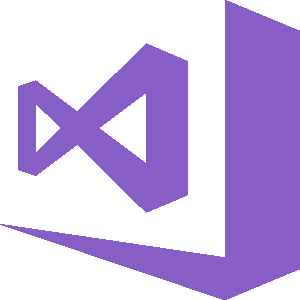
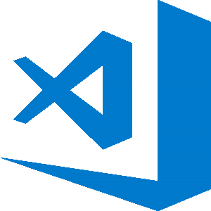

# 10 个最好用的 JavaScript IDE 和源代码编辑器[更新]

> 原文：<https://hackr.io/blog/best-javascript-ide-source-code-editors>

JavaScript 是流行的网络编程语言。它与 CSS 和 HTML 配合得非常好，可以开发强大的前端应用程序。随着 NodeJS 的引入，高级解释编程语言将其触角延伸到了后端开发。

它导致了多种多样的 JavaScript 框架、ide 和源代码编辑器的发展。IDE 比代码编辑器更受青睐，因为它能够调试代码并支持 ALM(应用程序生命周期管理)系统。尽管如此，源代码编辑器和 ide 之间的区别在现代已经变得模糊了。

## 最佳 JavaScript IDE 和源代码编辑器

虽然基本功能是相同的，但是每种 JS IDE 和源代码编辑器都有一些不同的优点和缺点。以下是我们挑选的 14 个最好的 JavaScript IDEs 和源代码编辑器，将在 2023 年使用:

### **1\. Atom**

***初始发布*–**2014 年 2 月
***类型*–**源代码编辑(开源)

Atom 是用于 JavaScript 开发的最流行的源代码编辑器之一。现代代码编辑器是灵活的，高度可定制的。Atom 是一个跨平台工具，易于安装，速度显著提高，并且完全免费使用。

Atom 的基础是 Electron，这是一个非常流行的使用 JavaScript 构建跨平台桌面应用程序的框架。智能代码完成是 Atom 固有的功能，它还拥有一个直观的文件系统浏览器。还有几个 UI 和语法主题可用。

Atom 的功能可以通过添加包来扩展，比如自动关闭 HTML 标签、Minimap 和 Linter。Atom 有一个内置的包管理器，可以简化可用包的搜索和优先安装。

### **2。AWS Cloud9**

***初始发布*–**2010
***类型*–**云 IDE(专有)

AWS Cloud9 完全用 JavaScript 编写，并在后端使用 NodeJS，可能是开发 JS 应用程序的最佳在线 ide 之一。此外，它还支持 C、C++、Go、Node.js、Perl、PHP、Python 和 Ruby 项目的开发。

任何想使用 AWS Cloud9 的人都必须有一个 AWS 账户。在线 IDE 附带了一个内置的终端，它支持 npm 和基本的 Unix 命令。代码完成、实时语言分析和同步编辑是它的一些显著特性。

AWS Cloud9 附带了 JS 的变量/函数名重构和语法高亮。通过 js 美化和 CSSLint 可以重新格式化代码。还提供可定制的按键绑定，包括 Emacs、Sublime Text 和 Vim 的预置。

AWS Cloud9 的功能可以通过使用插件来扩展。此外，有多种主题可供选择。除了提供调试器之外，IDE 还提供了选项卡式文件管理。

AWS Cloud9 有一个内置的图像编辑器，并为几个版本控制系统提供支持，包括 BitBucket、GitHub 和 Mercurial。IDE 支持部署到各种平台，如 Google App Engine、Heroku、Joyent 和 Microsoft Azure。

### **3。括号**

***初始发布*–**2014 年 11 月
***类型*–**源代码编辑(开源)

由 Adobe Systems 创建，括号是一个新的前端开发工具，在 MIT 许可下可用。它作为 JS 开发人员的主要工具选择不断上升。为 JavaScript 提供内置支持的源代码编辑器速度快、重量轻。

括号支持的最有趣的功能之一是实时预览。它允许通过自动打开一个新的 Chrome 窗口来实时查看代码的变化。JSLint 特性负责在使用括号保存 JS 文件时对其进行验证。

和它同时代的产品一样，括号带有自动代码完成特性。然而，它比竞争对手提供的要快得多。为了调试使用括号构建的 JS 应用程序，Theseus 扩展就在那里。它可以和谷歌 Chrome 以及 NodeJS 一起使用。

可以通过安装扩展来增强支架的能力。括号为搜索和添加扩展提供了清晰的界面。添加到括号中的一些有用的扩展是自动前缀、代码折叠、降价预览、智能突出显示和代码片段。

### **4。Codeanywhere**

*I **初始发布*****–**2013 年 5 月
***类型*–**云 IDE(免费/高级)

Codeanywhere 是用 JavaScript 编写的基于云的跨平台 IDE。它允许开发者直接从网络浏览器编写、编辑和运行[网络开发项目](https://hackr.io/blog/best-web-development-projects)。除了 JavaScript 之外，在线 IDE 还支持 70 多种编程语言。

Codeanywhere 提供的编辑器基于 [CodeMirror](https://en.wikipedia.org/wiki/CodeMirror) ，并利用 OpenVZ 容器作为开发环境，称为 DevBoxes。除了允许用户在 DevBoxes 中运行代码，IDE 还支持通过 FTP 或 SSH 连接自己的虚拟机。

Codeanywhere 自带一个内置的终端，支持基本的 Unix 命令和 npm。它有一个内置的调试器，提供选项卡式文件管理，并支持部署到 Heroku。

可以使用 Codeanywhere 连接到 Dropbox、Google Drive 和 OneDrive。cloud IDE 提供了对 Bitbucket、Git 和 GitHub 代码库的支持。

### 推荐 JavaScript 课程

【JavaScript 全教程 2023:从零到专家！

### **5。日食**

***初始版本*–**2001 年 11 月
***类型*–**Java 专用 IDE(开源)

最初受 IBM VisualAge 的影响，Eclipse 是三大 Java IDEs 之一。它带有一个可扩展的插件系统。为了将 Eclipse 用于 JavaScript 开发以及其他编程语言，需要安装特定的插件。

Eclipse 是第一批在 GNU 类路径下运行的 ide 之一。集成开发环境提供了性能、健壮性和稳定性的显著组合。设置 Oomph 项目允许自动化和复制相同的工作空间。

自从 Eclipse Mars 以来，人们一直在努力使 Eclipse 对 JS 更加友好。这从 JSDT (JavaScript 开发工具)中的性能增强可以明显看出。Eclipse 支持新的 Docker UI，支持使用 Docker CLI 构建 Docker 映像和容器。

几乎所有 Eclipse 的下载包都集成了 Git。Eclipse 支持的惊人特性之一是自动错误报告。该功能允许 IDE 自动将发现的错误发送到 eclipse.org。

经过处理后，这些 bug 被转换成 Bugzilla 条目。因此，它允许通过众包而不是依靠几个人或一个小社区来排除故障。

### 推荐课程

【JavaScript 全教程 2023:从零到专家！

### **6。IntelliJ IDEA**

***初始版本*–J**2001 年 1 月
***类型*–**Java 专用 IDE(免费版/商业版)

IntelliJ IDEA 主要关注最大化开发人员的生产力，是最受欢迎的 ide 之一。除了支持除 Java 和 JS 之外的许多编程语言之外，IDE 支持的人体工程学设计还提供了易用性。

IntelliJ IDEA 最令人惊奇的特性之一是它能够自动添加与上下文相关的工具。集成开发环境为 JavaScript 开发提供了许多智能代码辅助功能。

IntelliJ IDEA 能够自动执行重复的编程任务，以减少开发时间。IDE 提供了高级代码完成、内置的静态代码分析器和集成的版本控制。

### 7 .**。NetBeans**

***初始版本*–**1997 年
***类型*–**Java 专用 IDE

除了在 Java 开发中的广泛使用，NetBeans 还能够提供支持 JavaScript 的强大集成开发环境功能。多平台 IDE 支持使用模块(或模块化软件组件)进行应用程序开发。

安装 NetBeans 和使用 NetBeans 构建应用程序之间的时间间隔较短。智能代码完成、从语法和语义上突出显示代码、对 Git、Mercurial 和 Subversion 的内置支持是 IDE 的一些主要亮点。

修改 NetBeans 工作区非常容易。您可以在应用程序框架中拖动和重新定位选项卡，或者自定义工具栏中的按钮，以适应您的应用程序开发风格。您也可以设置自己的键盘快捷键。

### **8。PhpStorm**

***初始发布*–**2009
***类型*–**PHP 专用 IDE(商业)

PhpStorm 是构建在 IntelliJ IDEA 平台之上的跨平台 IDE。尽管它是专门为 PHP 开发而开发的，但它有一些很棒的特性可以用作 JavaScript IDE。

和 IntelliJ 的想法一样，PhpStorm 的功能可以通过插件来扩展。除了自动化重构、错误预防、语法突出显示和动态代码分析之外，PhpStorm 还支持零配置调试。

为了提高代码质量，PhpStorm 附带了数百个代码检查。这些在编写代码时验证代码，并提供快速修复以提高代码质量。同时按 Alt 和 Enter 将显示每个检查可用的各种选项。

PhpStorm 附带了用于测试和分析的内置工具。它提供了一个统一的 UI，以便与众多流行的版本控制系统一起工作，包括 Git、Mercurial 和 Perforce。此外，IDE 提供了在项目中处理数据库和 SQL 的工具。

### **9。SourceLair**

***初始发布*–**2011 年 1 月
***类型*–**基于 Web 的在线 IDE (30 天免费试用/商用)

SourceLair 是用领先的 [Python 框架](https://hackr.io/blog/python-frameworks)Django 编写的，是一个在线 IDE。对于创建的每个项目，SourceLair 都提供了一个隔离的开发环境。每个开发环境都是按照典型的需求构建的，并带有几个工具。

SourceLair 最有趣的特性之一是，所有项目都有一个专用的开发服务器，可以公开访问。这意味着，只需与客户和同事共享项目的公共 URL，就可以与他们共享项目。

如果您正在处理一个使用单独数据库服务器的项目，那么您只需点击几下就可以将它添加到项目中。SourceLair 编辑器支持自动缩进、代码折叠、智能自动完成和语法突出显示等功能。

SourceLair 为 JSHint 支持的 JavaScript 提供了实时错误报告(也为 Pylint 支持的 Python 提供了实时错误报告)。在线 IDE 带有一个全功能的 Linux 终端和一个健壮的键盘控制布局。

SourceLair 其他值得注意的亮点包括 browsersync、拖放支持、Git 集成、内置 pip 和 npm 支持、单击应用程序部署到 Heroku、拆分视图和升华文本键绑定。

### 10。崇高的文字

***初始发布*–**2008 年 1 月
***类型*–**源代码编辑

Sublime Text 的最新版本是 SBT3，它将该工具从源代码编辑器转变为伪 IDE。Sublime Text 是跨平台的，并且提供了高度的定制化。

崇高的文本标榜整洁的界面和显著的速度提升。增强的窗格管理、转到定义和转到符号是一些现成的功能。为了启用 ES6 和 [ReactJS](https://hackr.io/tutorials/learn-react) 代码的语法高亮，Babel 插件是可用的。

任何使用 Sublime Text 进行 JS 开发的人都必须使用的一些重要插件是 DocBlockr、JSFormat、侧边栏增强和 SublimeLinter。

## 多几个 IDE

### **1。Vim**

***初始发布*–**1991
***类型*–**文本编辑器(开源/慈善软件)

根据[Stack Overflow developer survey 2018](https://insights.stackoverflow.com/survey/2018/)，Vim 是所有受访者第五大最受欢迎的开发环境，也是系统管理员和 DevOps 人员的首选。Vim 是 Vi 改进的缩写。

Vim 被设计成一个独立的应用程序，既可以通过 GUI 使用，也可以直接从 CLI 使用。虽然最初是为 Amiga 发布的，但这个免费的开源文本编辑器现在可以在各种平台上使用。

Vim 最令人满意的方面之一是它高度可定制。可以通过可用的插件，用 vimscript 或 VimL 编写。源代码编辑器还允许定义个性化的键映射，称为宏。

Vim 有一个全面的集成帮助系统、有限的类似 IDE 的特性、鼠标交互支持，以及通过 FTP、HTTP 和 SSH 网络协议编辑归档文件的能力。它还提供了选项卡式窗口、拼写检查、语法高亮和持久化撤销/重做历史。

### **2。Visual Studio**

***初始版本*–**1997 年 2 月
***类型*–**通用 IDE

另一个领先的 JavaScript 开发 IDE 是 Visual Studio。集成开发环境主要用于为 Windows 平台开发计算机程序。IDE 能够生成托管代码和本机代码。

Visual Studio 提供了对 JavaScript 的内置支持。Visual Studio 的代码编辑器标榜智能感知。它提供了代码完成和代码重构特性。内置的调试器既可以在机器级别运行，也可以在源代码级别运行。

类设计器、代码探查器、数据库架构设计器、窗体设计器和 web 设计器是 Visual Studio 的内置工具。为了进一步扩展它的功能，许多插件都是现成的。最新版本 Visual Studio 2019 预计将于近期登陆。

### **3。Visual Studio 代码**

***初始发布*–**2015 年 4 月
***类型*–**源代码编辑

根据 JS 的[州进行的 2018 年调查，Visual Studio 代码是使用最广泛的 JS 文本编辑器，在 2 万名调查参与者中有超过 1.4 万名用户。基于电子平台，Visual Studio 代码是微软专门为 web 开发而创建的。](https://2018.stateofjs.com/other-tools/)

令人惊讶的是，Visual Studio 代码是一种非典型的微软产品，它可以在 Linux 和 MacOS 系统上运行。除了 JavaScript 之外，到目前为止，Visual Studio 代码还支持 30 多种编程语言，包括 C#、HTML5、PHP 和 Ruby。

与 Visual Studio 一样，Visual Studio 代码附带了智能感知功能。它通过列出代码建议、提示和参数描述来帮助开发人员。为了调试基于 JS 和 NodeJS 的应用程序，源代码编辑器附带了一流的调试器。

开发人员可以在调试模式下启动应用程序，也可以在运行时手动添加调试器。Visual Studio 代码的内置调试器的显著功能包括调用堆栈、设置断点和监视变量。

Visual Studio 代码提供了一个称为 Peek 的有用功能。它允许扩展内联弹出菜单中任何函数的定义。源代码编辑器吹嘘的另一个有用的特性是 TaskRunner。它允许创建和配置任务来使用 Grunt、Gulp 或 MSBuild。

除了监视对文件所做的所有更改，Visual Studio 代码还允许运行 commit、publish、pull、push 和 rebase 等命令，这要归功于内置的 Git 支持。使用内置的 CLI 可以浏览当前项目或目录。

### **4。网络风暴**

***初始版本*–**2010
***类型*–**CSS、HTML 和 JavaScript 专用 IDE(商业)

WebStorm 由 JetBrains(IntelliJ IDEA 和 PhpStorm 的幕后推手)提供，是 JavaScript 开发中最常用的集成开发环境之一。被誉为“最聪明的 JavaScript IDE”的 WebStorm 装载了过多的特性。

WebStorm 支持代码完成、错误识别和重构。由于内置的调试器，JS 开发人员甚至不用退出 IDE 就能评估代码。内置的测试工具生成一个最容易阅读的错误报告。

可能 WebStorm 区别于竞争对手的最显著的特征是 spy-js 特性。它跟踪代码是为了防止以后可能造成大破坏的行为。

**结论**

没有哪一个 JS 源代码编辑器或 IDE 是万能的一站式解决方案。相反，他们每个人都有自己的优势和劣势。因此，在选择一个之前，你需要准确地强调你所有的需求。希望上面的列表能帮助你做出一个有利的决定。

希望提高您的 JavaScript 技能吗？考虑看看社区推荐的一些[最佳 JS 教程](https://hackr.io/tutorials/learn-javascript?ref=blog-post)。

**人也在读:**