# 14 2023 年 DevOps 工程师最佳 Kubernetes 课程[排名]

> 原文：<https://hackr.io/blog/best-kubernetes-course>

如果你正在学习大规模集装箱化，你需要一门 Kubernetes 课程。

Kubernetes 是当今领先的编排平台，这使得它成为 [DevOps](https://hackr.io/blog/what-is-devops) 的任何人或想要进入 DevOps 的人的必备技能。如果您目前正在学习容器化、企业级解决方案和可伸缩性，那么您需要了解 Kubernetes。

幸运的是，Kubernetes 是一个相当容易学习的解决方案——大多数高级开发人员将能够在几个晚上内学会 Kubernetes 的基础知识，尽管可能需要更长的时间才能掌握。

我们列出了最好的在线 Kubernetes 课程，从初级到高级都有。

## 哪个 Kubernetes 课程适合你？

总的来说，有几种类型的 Kubernetes 课程可供选择。哪种 Kubernetes 课程最适合你，取决于你在职业生涯中的位置以及你的职业目标是什么。有:

*   初级课程，给你如何从头开始使用 Kubernetes 的基础知识。
*   Kubernetes 和 Docker 课程，涵盖了容器化和编排。
*   Kubernetes 认证课程——Kubernetes 认证课程将主要关注通过认证所需的知识。
*   高级或利基 Kubernetes 课程，可能包括认证 Kubernetes 安全专家课程或 AWS Kubernetes 课程。

没有放之四海而皆准的“最佳库伯内特课程”如果你需要学习 Docker，你需要 Docker 和 Kubernetes 课程。如果你已经知道 Kubernetes，但需要更深入地了解安全性，你需要一个 Kubernetes 安全课程。

以下是网上提供的最佳课程——取决于你的需求和专业。

[**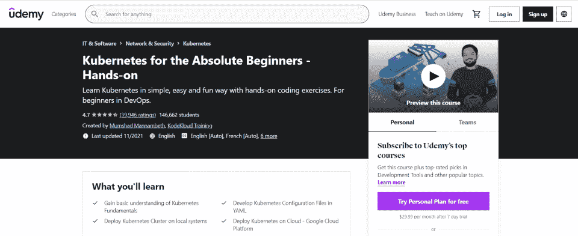**](https://click.linksynergy.com/deeplink?id=SeYHzlfZEmI&mid=39197&murl=https%3A%2F%2Fwww.udemy.com%2Fcourse%2Flearn-kubernetes%2F)

*Kubernetes for the Absolute 初学者*从一个从未接触过 Kubernetes 的人的角度，涵盖了你需要知道的关于 Kubernetes 的所有基础知识。

在本课中，您将学习如何在云上部署 Kubernetes，如何配置它，如何通过它部署应用程序，如何设置副本集，以及如何通过 Kubernetes 管理服务和部署。

**课程规格:**

*   级别:初学者
*   价格:124.99 美元(有促销活动)
*   包含:

*   5.5 小时的点播视频
*   1 个可下载资源
*   14 篇文章
*   37 个编码练习

*   Certificate of Completion: Yes

    [参加课程](https://click.linksynergy.com/deeplink?id=SeYHzlfZEmI&mid=39197&murl=https%3A%2F%2Fwww.udemy.com%2Fcourse%2Flearn-kubernetes%2F)

[**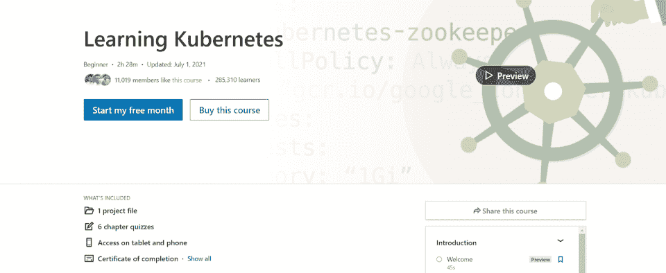**](https://linkedin-learning.pxf.io/Gjobmr)

这个简单的课程向开发人员介绍了 Kubernetes 环境，首先引导他们使用 Minikube 完成安装和运行的过程。从那里，开发人员将能够部署一个示例应用程序，用 Kubernetes 仪表板管理它，并管理更高级的数据库和 API。

涵盖的主题包括 cron 作业、运行作业、生产部署、名称空间、监控和日志记录，以及身份验证和授权安全特性。

**课程规格:**

*   级别:初级
*   费用:39.99 美元
*   包含:

*   33 个视频
*   1 个项目文件
*   6 章测验

*   Certificate of Completion: Yes

    [参加课程](https://linkedin-learning.pxf.io/Gjobmr)

[**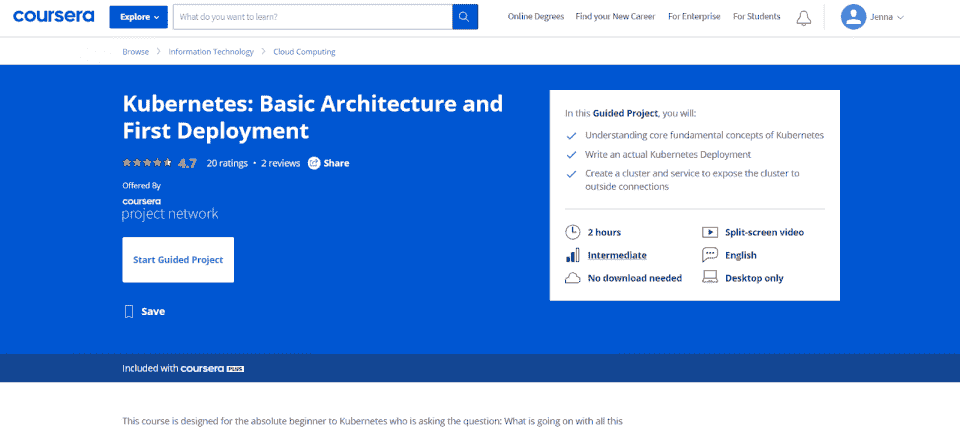**](https://coursera.pxf.io/doPOWQ)

Coursera 专为 Kubernetes 的“绝对初学者”设计，它提供了一个独特的“引导式项目”，引导用户完成创建真实世界的 Kubernetes 部署的过程。用户将能够创建一个群集和一个服务来将群集公开给外部连接。在这个包括分屏视频的 2 小时课程中，用户将学习 Kubernetes 是什么，如何使用节点、单元和对象，以及如何编写他们的第一个部署。

**课程规格:**

*   级别:初学者
*   费用:39 美元/月(Coursera 图书馆)
*   包含:

*   2 小时的内容
*   1 指导项目

*   Certificate of Completion: No

    [参加课程](https://coursera.pxf.io/doPOWQ)

在*Kubernetes 实用指南*中，已经精通 DevOps 的开发人员能够学习 Kubernetes 的基础知识和集群的主要组件。学生将学习如何运行 pods，如何管理副本集，如何在服务之间通信，以及如何部署版本。他们还将学习入口和入口控制器、卷、配置图、密码、名称空间和资源管理的基础知识。

**课程规格:**

*   级别:中级
*   费用:49 美元/年
*   包含:

*   10 个模块
*   20 小时的视频
*   175 课
*   14 次测验
*   860 个代码片段
*   76 幅插图

*   结业证书:是

[**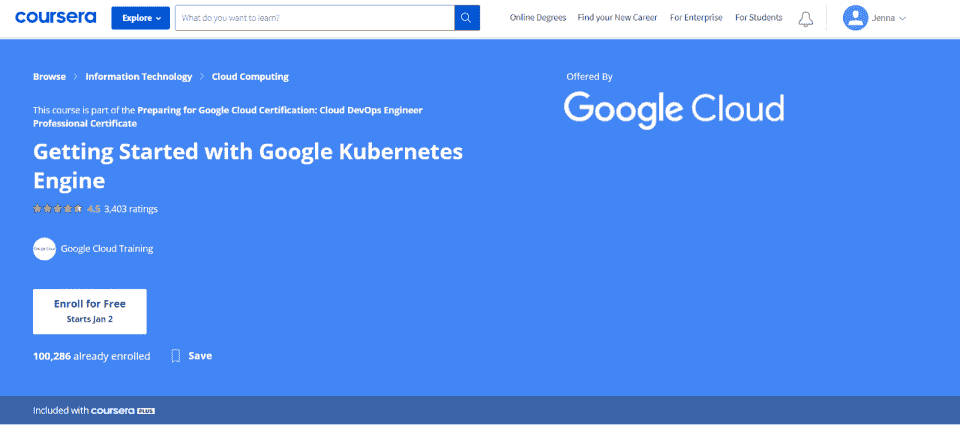**](https://coursera.pxf.io/rnqao3)

部分*准备谷歌云认证:云 DevOps 工程师专业证书*路径，这个 Coursera 课程可以单独进行，也可以与学习路径课程一起进行。学生将学习如何使用 Google 云计算平台，如何在容器注册表中存储容器图像，如何使用 Kubernetes，以及如何管理 Kubernetes 工作负载。

**课程规格:**

*   级别:中级
*   费用:39 美元/月(使用 Coursera 库)
*   包含:
*   Certificate of Completion: Yes

    [参加课程](https://coursera.pxf.io/rnqao3)

Google Cloud 通过 Coursera 提供的另一门课程,*Google Kubernetes 引擎专业化设计*是一门高级课程，旨在帮助您了解 Google 云计算平台之间的差异，了解 Kubernetes 的组件和架构等。

该专业包括一个应用学习项目和动手实验室，帮助个人更多地了解谷歌计算引擎、谷歌应用引擎、谷歌云平台和云计算。

**课程规格:**

*   级别:初学者
*   费用:39 美元/月(Coursera 图书馆)
*   包含:

*   两个月的课程
*   总共 4 门课程

*   Certificate of Completion: Yes

    [参加课程](https://coursera.pxf.io/kj1OGd)

**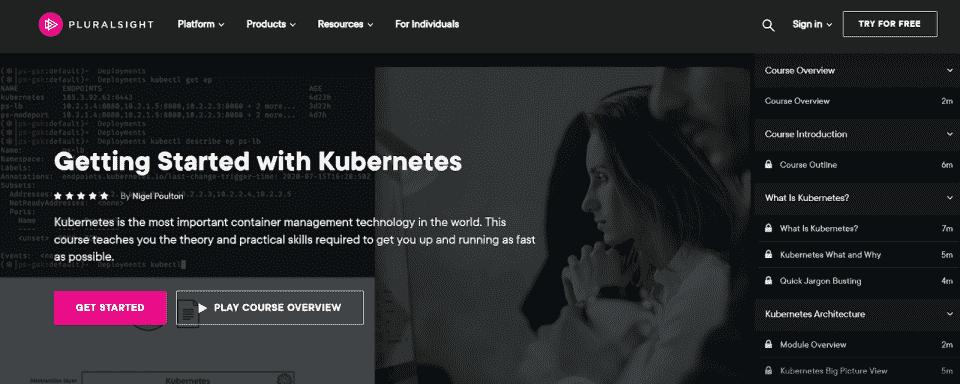**

【Kubernetes 入门主要是让你尽快入门。如果你已经是一个知识渊博、才华横溢的 DevOps 专业人士，只是想学习更多关于大规模集装箱化的知识，*Kubernetes*入门将尽可能快速有效地带你到达你需要的地方。它包括如何工作、如何安装、如何部署以及如何管理服务和安全性的整体视图。

**课程规格:**

*   级别:中级
*   费用:免费试用，每年 299 美元(PluralSight 库)。
*   包含:
*   竣工证书:否

[**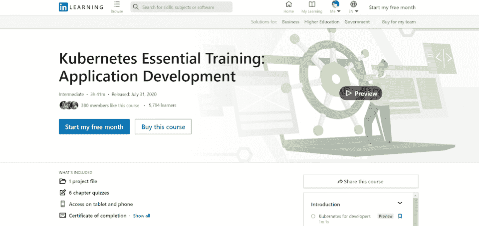**](https://linkedin-learning.pxf.io/n1j4Xo)

对于 *Kubernetes 基础培训*课程，你最好对 Kubernetes 有所了解。本课程旨在通过向您展示如何在现实世界的场景中开发 Kubernetes，将这些知识“从理论到实践”地进行。

学完本课程后，您应该能够运行集群、容器和单元，知道如何执行命令，并且能够在 Kubernetes 仪表板以及命令行上查看信息。编排、工作负载管理和自动化都将在这个综合课程中涉及。

**课程规格:**

*   级别:中级
*   价格:29.99 美元
*   包含:

*   41 个视频
*   1 个项目文件
*   6 章测验

*   Certificate of Completion: Yes

    [参加课程](https://linkedin-learning.pxf.io/n1j4Xo)

[**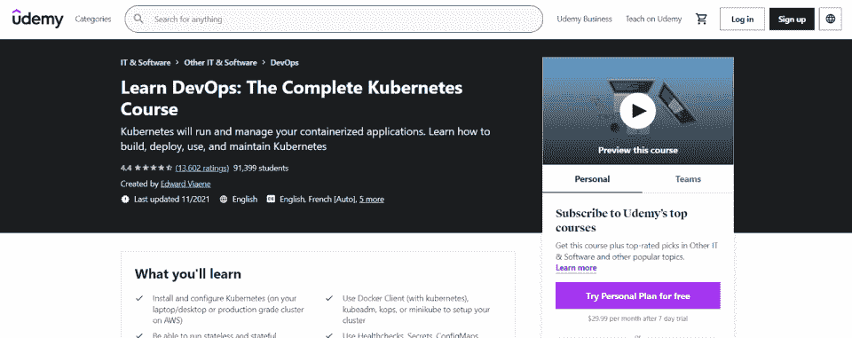**](https://click.linksynergy.com/deeplink?id=SeYHzlfZEmI&mid=39197&murl=https%3A%2F%2Fwww.udemy.com%2Fcourse%2Flearn-devops-the-complete-kubernetes-course%2F)

对于那些想要发展他们的 DevOps 技能的人来说,*学习 DevOps:完整的 Kubernetes 课程*课程计划将涵盖很多领域。本课程包括能够运行无状态和有状态应用程序、使用有状态集、使用卷、使用 Helm 打包应用程序、使用 Docker 客户端，以及能够使用指标扩展应用程序。完成本课程后，DevOps 工程师将对 Kubernetes、Docker 和 Jenkins 有更多了解，并将能够使用 Istio 通过 Kubernetes 部署服务网格。

**课程规格:**

*   级别:高级
*   价格:39.99 美元(有促销活动)
*   包含:

*   14 小时的视频
*   1 个可下载资源
*   1 篇文章
*   2 次模拟测试

*   Certificate of Completion: Yes

    [参加课程](https://click.linksynergy.com/deeplink?id=SeYHzlfZEmI&mid=39197&murl=https%3A%2F%2Fwww.udemy.com%2Fcourse%2Flearn-devops-the-complete-kubernetes-course%2F)

[**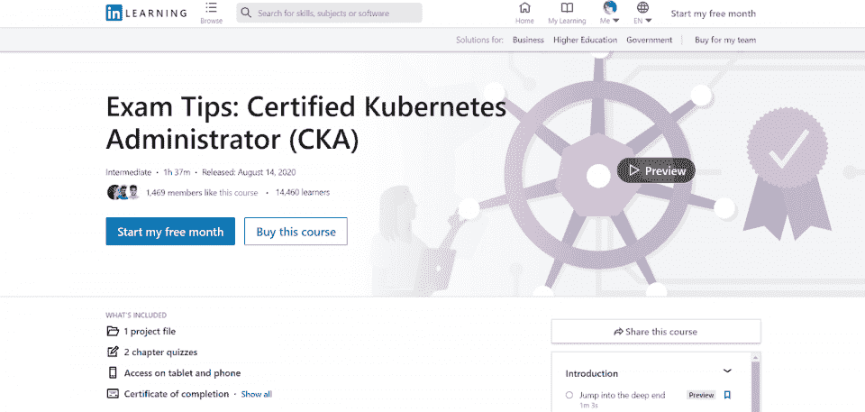**](https://linkedin-learning.pxf.io/jWDRev)

想真正增加你对 Kubernetes 的了解吗？你可能想参加认证 Kubernetes 管理员考试。但在此之前，你需要为此而学习。这个 LinkedIn 学习课程为你提供了成为 CKA 所需要知道的一切，涵盖了全程测试的 10 个领域。这包括应用程序生命周期管理、安装和配置系统、验证系统以及网络和调度的核心概念。

**课程规格:**

*   级别:高级
*   价格:34.99 美元
*   包含:

*   17 个视频
*   1 个项目文件
*   2 章测验

*   Certificate of Completion: Yes

    [参加课程](https://linkedin-learning.pxf.io/jWDRev)

[**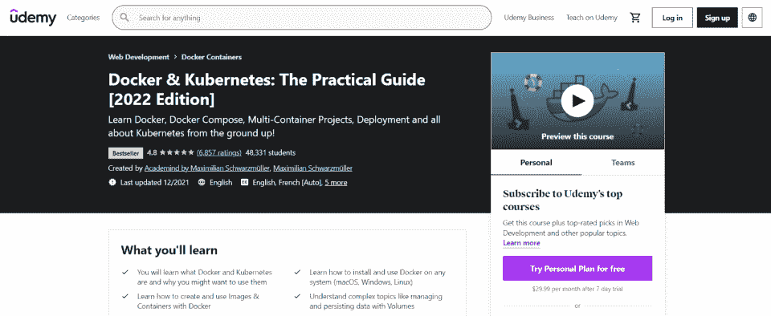**](https://click.linksynergy.com/deeplink?id=SeYHzlfZEmI&mid=39197&murl=https%3A%2F%2Fwww.udemy.com%2Fcourse%2Fdocker-kubernetes-the-practical-guide%2F)

在 *Docker & Kubernetes:实用指南*中，DevOps 专业人员可以了解更多关于 Docker 和 Kubernetes 的信息，何时使用它们，以及如何一起使用它们。本课包括如何通过 Docker 平台创建映像和容器，如何通过 Kubernetes(或通过 Docker 本身)部署这些应用程序，以及如何安装 Docker 和 Kubernetes 并配置解决方案。这本实用的指南向学生介绍了他们需要了解的关于 Kubernetes 和 Docker 基础知识的一切。

**课程规格:**

*   级别:高级
*   成本:109.99 美元
*   包含:

*   16 个部分
*   259 场讲座
*   23 小时 38 分钟的内容

*   Certificate of Completion: Yes

    [参加课程](https://click.linksynergy.com/deeplink?id=SeYHzlfZEmI&mid=39197&murl=https%3A%2F%2Fwww.udemy.com%2Fcourse%2Fdocker-kubernetes-the-practical-guide%2F)

[**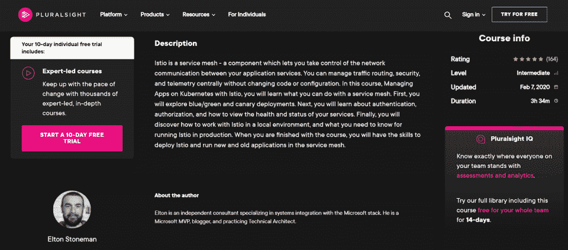**](https://pluralsight.pxf.io/5bmk59)

一旦您了解了 Kubernetes，您需要知道如何完成其他高级和特定的任务——比如开发一个服务网格。在使用 Istio 管理 Kubernetes 上的应用中，您将学习如何通过分布式服务网格架构管理多个软件组件之间的通信。本课要求您首先对 Docker 和 Kubernetes 有所了解，但它对于希望部署和管理大型企业环境的 DevOps 专业人员来说非常有价值。

**课程规格:**

*   级别:高级
*   费用:299.99 美元(PluralSight 库)
*   包含:

*   3 小时 34 分钟的内容
*   5 个模块
*   互动演示

*   Certificate of Completion: No

    [参加课程](https://pluralsight.pxf.io/5bmk59)

[**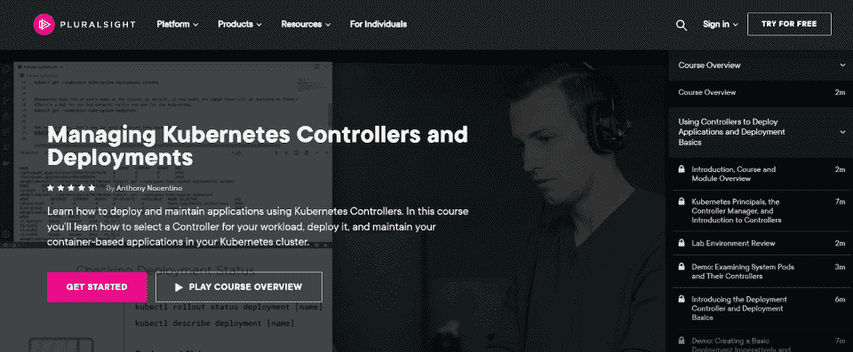**](https://pluralsight.pxf.io/kjQ4On)

高级管理课程*管理 Kubernetes 控制器和部署*向管理员展示了他们如何更有效地使用控制器。用户将能够创建自我修复的应用程序，了解更多有关 Kubernetes 的关键功能(部署、DaemonSets、StatefulSets、Jobs 和 CronJobs)，如何选择正确的控制器类型，以及如何在整个集群中维护和部署基于容器的应用程序。

**课程规格:**

*   级别:中级
*   费用:299.99 美元(PluralSight 库)
*   包含:

*   2 小时 48 分钟的内容
*   4 个部分

*   Certificate of Completion: No

    [参加课程](https://pluralsight.pxf.io/kjQ4On)

[**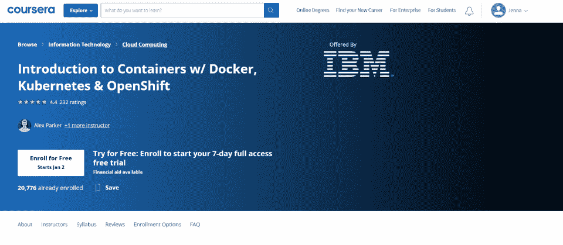**](https://coursera.pxf.io/Kev06a)

IBM 通过 Coursera 提供了这一全面的介绍，包括 Docker、Kubernetes 和 OpenShift 技术——非常适合希望学习新技能并提高其市场竞争力的开发人员。这个灵活的课程是初级入门，也是多个计划的一部分:IBM 全栈云开发人员专业证书和 DevOps 和软件工程专业证书。虽然它比 Kubernetes 和 Docker 要宽泛一些，但它也是开发 DevOps 技能的良好开端。

**课程规格:**

*   级别:初学者
*   费用:39 美元/月(Coursera 图书馆)
*   包含:

*   12 小时的材料
*   4 周的课程

*   Certificate of Completion: Yes

    [参加课程](https://coursera.pxf.io/Kev06a)

## 【Kubernetes 入门

Kubernetes 是一种先进的 DevOps 技术。如今，开发运维市场瞬息万变，越来越多的应用程序正在向云迁移，并且一直在部署更大规模、更大型的企业解决方案。

如果你想更多地了解 Kubernetes，在课程方面你有很多选择。但是你可能还需要学习其他与 Kubernetes 相关的技术: [Docker、](https://hackr.io/blog/what-is-docker) Istio、OpenShift、YAML 等等。

为了更好地了解所涉及的技术，你可能想去参加一个 DevOps 训练营或者通过 T2 的 Kubernetes 认证途径。除了在线的 Kubernetes 课程，你还可以看看一些[简单的 Kubernetes 教程](https://hackr.io/tutorials/learn-kubernetes)。

**人也在读:**