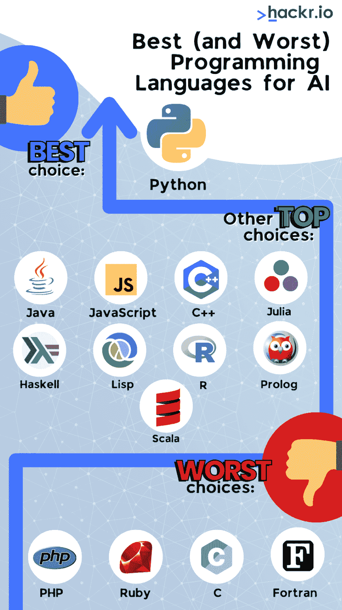

# 2023 年人工智能发展最佳编程语言[更新]

> 原文：<https://hackr.io/blog/best-language-for-ai>

关于 AI 开发的思考？这是一个很好的职业转变。不仅与人工智能相关的工作在突飞猛进地增长，而且许多技术工作现在也要求人工智能知识。

第一步？学习一门[编程语言](https://hackr.io/blog/best-programming-languages-to-learn)。但是 AI 最好的编程语言是哪一种呢？

有许多流行的人工智能编程语言，包括 Python、Java、Julia、Haskell 和 Lisp。好的人工智能编程语言应该易于学习、阅读和部署。

你学习的语言将决定:

*   编写人工智能应用程序有多简单。
*   您可以使用的工具、库和框架。
*   您需要支持的文档和社区。

让我们看看最适合人工智能的语言，其他流行的人工智能编码语言，以及你今天可以如何开始。

## **AI 最好的编程语言是什么？**

对于大多数程序员来说，Python 是 AI 最好的编程语言。其他顶级竞争者包括 Java、C++和 JavaScript——但 Python 可能是人工智能开发的最佳全面选择。

让我们比较一下这四种语言的一些主要特征:

| **参数** | **Python** | **Java** | **JavaScript** | **C++** |
| **代码长度** | 短的 | 长的 | 温和的 | 长的 |
| **性能** | 慢的 | 快的 | 慢的 | 快的 |
| **打字** | 动态的 | 静态 | 动态的 | 静态 |
| **难度** | 容易的 | 温和的 | 温和的 | 困难的 |
| **人工智能代码库** | 丰富的 | 一些 | 一些 | 一些 |

为什么 Python 是人工智能最好的编程语言？

*   **易学**。Python 的语法非常灵活，并且这种语言具有许多高质量和易于使用的特性。即使是非程序员也会觉得 Python 很直观。这种低门槛很重要，因为许多从事人工智能工作的[数据科学家](https://hackr.io/blog/how-to-become-a-data-scientist)和分析师没有编程背景。
*   **整合良好**。程序员不需要重新发明轮子。许多人工智能框架、库和平台已经用 Python 开发出来，并作为开源项目提供。
*   **有据可查**。学习 Python 甚至更容易，因为网上有如此多的教程、项目和训练营。不太流行的语言可能没有那么多可用的例子。
*   **简单易读**。易读的代码更容易开发。Python 产生了可读性极强的简短代码，尤其是与 Java 这样的语言相比。
*   **平台无关**。Python 可以在几乎任何平台上运行，从 Windows 到 Unix。它不需要编译，因为它是一种解释型语言。
*   **优秀的可视化工具**。Python 有大量的数据可视化库可供选择——这对人工智能开发至关重要。数据科学家可以利用像 [Matplotlib](https://matplotlib.org/) 这样的库创建吸引人的、人类可读的图表。

**AI 产业**。很多雇主都在招聘 Python AI 开发者。根据 Payscale 的数据，截至 2022 年，拥有 Python 技能的机器学习工程师在[的平均工资为 112178 美元。](https://www.payscale.com/research/US/Job=Machine_Learning_Engineer/Salary/4512ac36/Python)

Python 最显著的缺点是它的速度——Python 是一种解释型语言。但对于 AI 和机器学习应用来说，快速开发往往比原始性能更重要。

## **AI 编程的其他流行编程语言**

当然也可以用其他语言进行 AI。从技术上来说，你可以使用任何语言进行人工智能编程——有些语言只是让它比其他语言更容易。让我们来看看其他一些最好的人工智能语言。

### **1。Java**

*   优点: Java 是一种流行的通用语言，拥有大量的开发人员。它是静态类型的，这意味着您可以及早发现错误并更快地运行程序。
*   **缺点:** Java 可能比较冗长，学习曲线也比较陡。它的生活质量特征很少；程序员将需要手动做大量的工作。

[参加 Java 课程](https://hackr.io/blog/best-java-courses)

### **2。朱莉娅**

*   **优点:** Julia 专为高性能数值计算而设计，对机器学习有坚实的支持。
*   反对意见: Julia 是一门年轻的语言，因此没有太多的社区支持。学习这门语言可能很有挑战性。

[参加茱莉亚课程](https://imp.i384100.net/6b5DNr)

### **3。哈斯克尔**

*   **优点:** Haskell 是一种强调代码正确性的函数式编程语言。它可以用于人工智能开发，尽管它更常用于教学和研究。
*   缺点:哈斯克尔很难学。它也可能非常令人困惑，因为这种语言非常小众。

[参加哈斯克尔课程](https://hackr.io/tutorials/learn-haskell)

### **4。Lisp**

*   **优点:** Lisp 用于 AI 已经很多年了。它以其灵活性和符号化、面向逻辑的方法而闻名。
*   缺点: Lisp 可能很难读写。它还有一个小的开发者社区。

参加 Lisp 课程

### **5。R**

*   优点: R 是数据科学家中流行的统计编程语言。它可以很好地与其他语言集成，并且有许多可用的软件包。它非常适合具有强大数据处理需求的人工智能。
*   缺点: R 可以很慢，学习曲线很陡。它也没有得到很好的支持。

[参加 R 课程](https://click.linksynergy.com/deeplink?id=jU79Zysihs4&mid=39197&murl=https%3A%2F%2Fwww.udemy.com%2Fcourse%2Fr-for-beginners-learn-r-programming-from-scratch%2F%3Futm_source%3Dadwords%26utm_medium%3Dudemyads%26utm_campaign%3DWebindex_Catchall_la.EN_cc.CA%26utm_term%3D_._ag_119831896715_._ad_533102824797_._kw__._de_c_._dm__._pl__._ti_dsa-391160528281_._li_9061009_._pd__._%26matchtype%3D%26gclid%3DCj0KCQjwm6KUBhC3ARIsACIwxBj1mNuwSt0R2bA2mXz43Qc-APtFXy0e7CW43X_aUezpy_g24ALsitwaAh25EALw_wcB)

### **6。JavaScript**

*   优点: JavaScript 是一种流行的 web 开发语言。开发者在 TensorFlow.js 这样的机器学习库中使用 JavaScript。
*   缺点: JavaScript 比 Python 更复杂，更难学。它很健壮，有如此多的选项，可能会让非开发人员感到困惑。

[参加 JavaScript 课程](https://hackr.io/blog/best-javascript-courses)

### **7。C++**

*   优点: C++是一种在游戏开发者中流行的快速、强大的语言。它被很好地假设和很好地记录——并且可以用于许多不同的事情。也是高效的。
*   缺点: C++可能很难学，而且没有很多生活质量的特性——很多事情必须由程序员手动处理。

[参加 C++课程](https://hackr.io/blog/cpp-course)

### **8。序言**

*   Prolog 是一种声明式编程语言，非常适合人工智能开发。它主要用于基于逻辑的编程——人工智能开发的基础。
*   缺点: Prolog 可能很难学，并且有一个小的开发人员社区。

[参加 Prolog 课程](https://click.linksynergy.com/deeplink?id=jU79Zysihs4&mid=39197&murl=https%3A%2F%2Fwww.udemy.com%2Fcourse%2Flearn-prolog-programming-from-zero-to-hero%2F%23%3A%7E%3Atext%3DThis%2520course%2520is%2520designed%2520to%2Ccomputer%2520scientist%2520and%2520software%2520developer.)

### **9。Scala**

*   **优点:** Scala 是一种通用语言，有很多适合 AI 开发的特性。它与 Java 集成得很好，并且有一个庞大的开发人员社区。
*   缺点: Scala 可能很复杂，很难学。Scala 主要用于高级开发，如数据处理和分布式计算。

[参加 Scala 课程](https://imp.i384100.net/dojEdK)

假设你知道以上任何一种 AI 的编码语言。在这种情况下，用其中一种语言开发人工智能应用程序可能比学习一种新语言更容易。最终，对你来说最好的人工智能语言是最容易学的。

## **AI 用什么编程语言** **不应该用** **？**

有些语言不太适合人工智能开发。这些一般都是小众语言或者太低级的语言。

*   **PHP** 。PHP 是一种流行于 web 开发的脚本语言。然而，对于人工智能开发来说，它不够灵活或健壮。
*   **红宝石**。Ruby 是另一种流行的 web 开发脚本语言。但与 Python 不同，Ruby 并不擅长快速原型制作——创建一个有效的人工智能系统需要更长的时间。
*   **C** 。c 是系统管理员和嵌入式系统开发人员中流行的低级语言。然而，它不太适合人工智能开发，因为它没有很多高级功能。
*   **Fortran** 。Fortran 主要受科学家和工程师的欢迎。然而，它很难学习，并且不提供许多生活质量的功能，这使得开发很困难。

一个好的程序员可以用几乎任何编程语言编写人工智能。这只是一个过程有多复杂的问题。

## **结论**

Python 是 AI 最好的编程语言。它很容易学习，并且有一个很大的开发者社区。Java 也是不错的选择，但是学起来更有挑战性。其他流行的人工智能编程语言包括 Julia，Haskell，Lisp，R，JavaScript，C++，Prolog 和 Scala。

如果你现在刚开始学习人工智能编程，从 Python 开始有很多好处。你可以立即投入工作并开始发展。

另一方面，如果你已经知道 Java 或 C++，用这些语言创建优秀的人工智能应用程序是完全可能的——只是会稍微复杂一点。

准备好开始了吗？课程是提高你的 Python 技能和推进你的人工智能职业生涯的好方法。

## **常见问题解答**

#### **1。哪种语言最适合 AI？**

Python 是 AI 最好的语言。它很容易学习，有一个庞大的开发人员社区，并且有大量的框架、库和代码库。然而，Python 有一些批评——它可能很慢，而且它松散的语法可能会教程序员一些坏习惯。

#### **2。C++对 AI 好吗？**

你可以使用 C++进行人工智能开发，但它不像 Python 或 Java 那样适合。C++是一门复杂的语言，有着陡峭的学习曲线。然而，C++是一种伟大的全能语言，如果程序员知道的话，它可以有效地用于人工智能开发。

#### **3。Python 可以用于 AI 吗？**

是的，Python 是最好的 AI 语言之一。事实上，在过去十年中，Python 已经成为“人工智能开发的语言”——现在大多数人工智能系统都是用 Python 开发的。

#### **4。AI，Java，Python 哪个好？**

在真空中，Python 比 Java 更适合 AI。学习、写作和阅读更容易。然而，Java 是一种健壮的语言，确实提供了更好的性能。如果你已经懂 Java，你可能会发现用 Java 编写 AI 比学一门新语言更容易。

#### **5。Python 和 C++哪个更适合 AI？**

Python 比 C++更适合 AI。C++很难用，入门门槛非常高。很少有代码库和集成可供 C++使用，因为开发人员不像 Python 那样频繁地使用 C++进行人工智能开发。

#### **6。人工智能编程为什么首选 Python？**

Python 是 [AI 编程](https://imp.i115008.net/QOJQdo?subId3=tutorials%2Flearn-artifi_amcid-Q6ZNOlUqeI6IVgM6QiEZl)的首选，因为它简单易学，拥有庞大的开发者社区。相当多的人工智能平台是用 Python 开发的——这对于非程序员和科学家来说更容易理解。

**人也在读:**