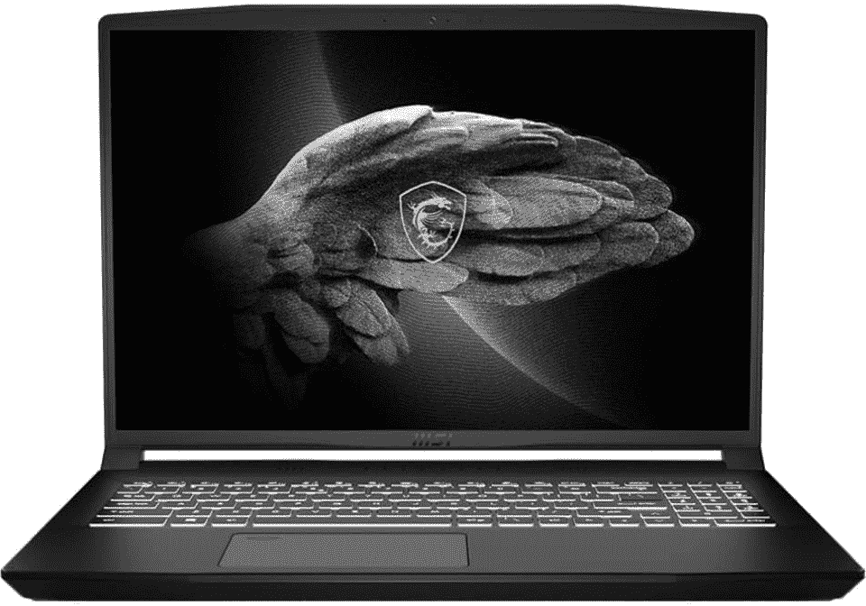
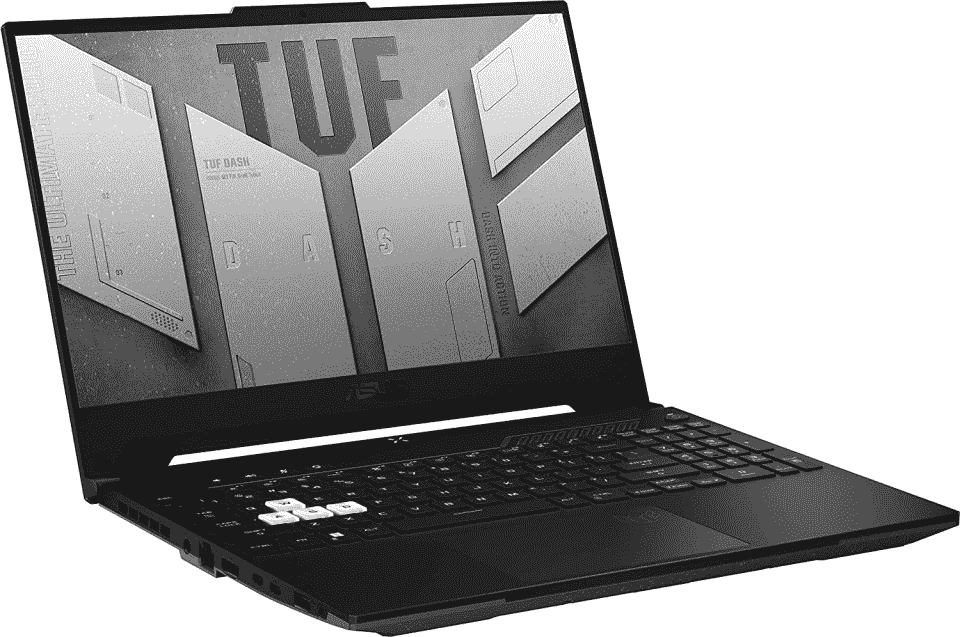
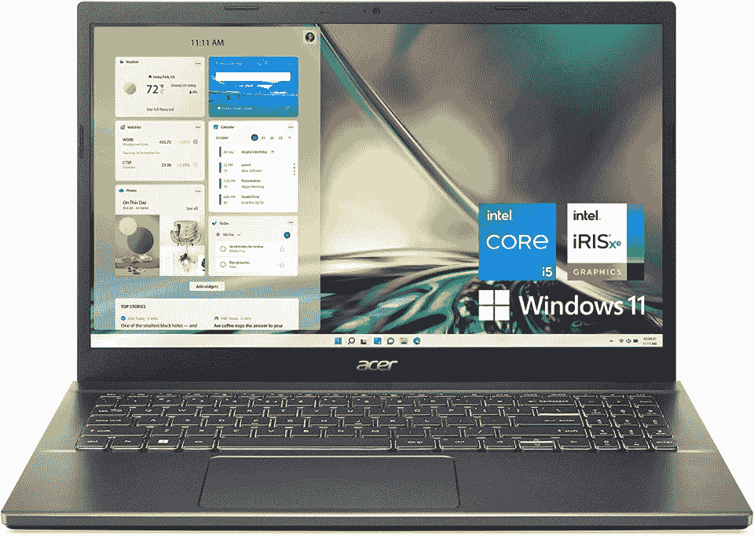
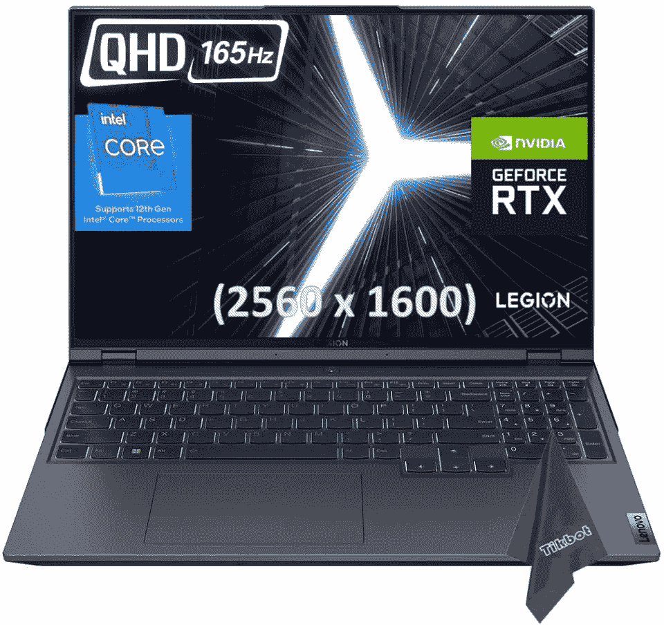
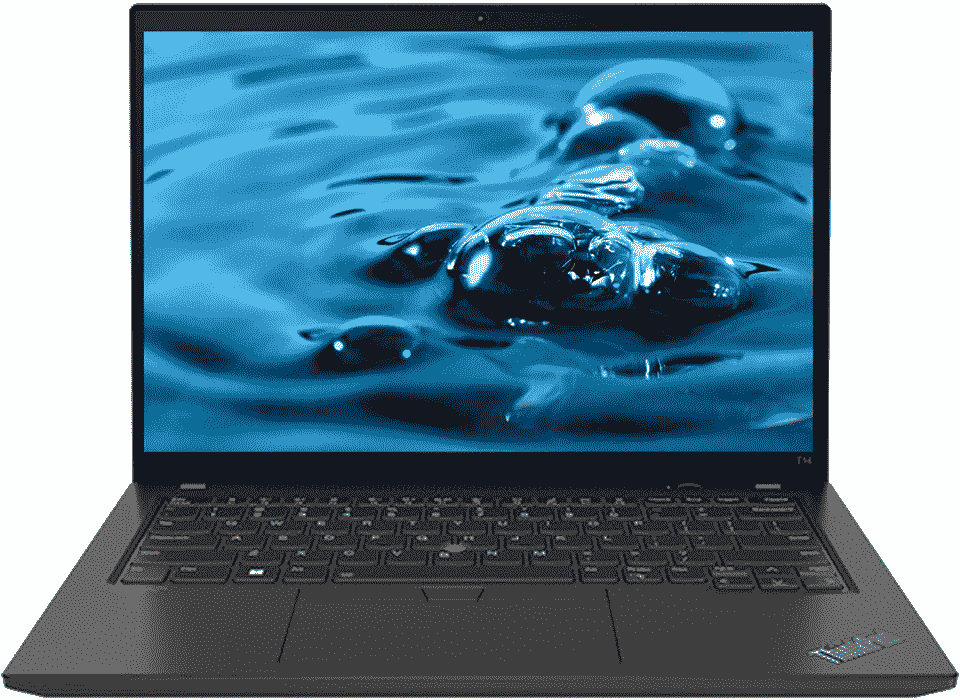
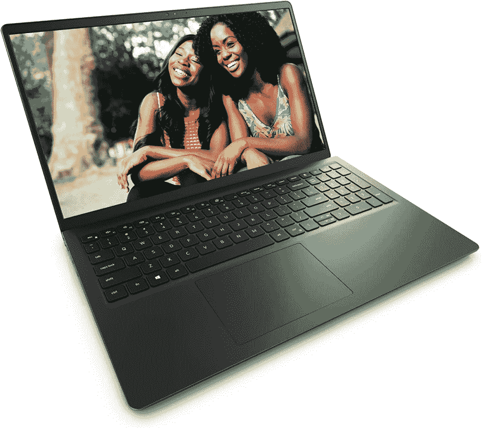
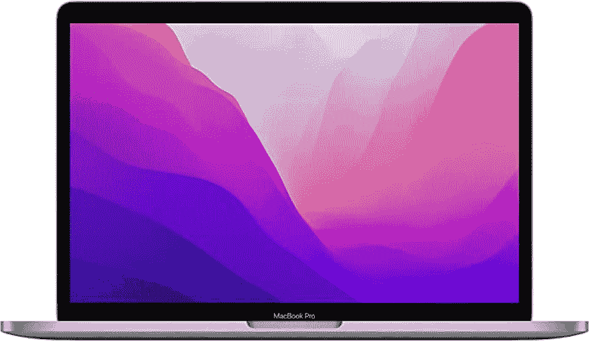

# 最佳黑客笔记本电脑:2023 年前 7 名

> 原文：<https://hackr.io/blog/best-laptop-for-hacking>

随着科技的进步，黑客的工具和方法变得越来越复杂和先进。随着硬件变得越来越强大，黑客也越来越有能力找到几乎任何系统的漏洞。

你不会在市场上找到任何特殊的“黑客笔记本电脑”——它们根本不存在。事实上，所有黑客和非黑客使用相同的硬件。更不用说，所有类型的黑客都使用相同类型的机器，不管他们是白帽子还是黑帽子，也不管他们对网络安全的看法如何。

当谈到黑客的笔记本电脑时，最重要的是计算机必须足够强大，能够运行虚拟机、渗透测试器和密码破解程序等工具。计算机还必须能够处理大量的数据和管理繁重的多任务处理。

但是你到底如何选择最好的笔记本电脑来进行黑客攻击呢？

在本文中，我们整理了一份方便的购买指南来帮助你开始购买。我们还列出了 2022 年最佳黑客笔记本电脑的顶级推荐。我们开始吧！

## **最佳黑客电脑比较**

《黑客 2022》提供的最佳笔记本电脑对你和对其他人来说可能是不同的。我们将下面的对照表放在一起，帮助您决定哪一个最适合您的需求。

| **笔记本电脑** | **描述** | **主要规格** | **链接** |
| [****](https://amzn.to/3uAdKGx)[**微星创造者 M16**](https://amzn.to/3uAdKGx) | 最适合黑客和内容创作 | 

*   16 英寸 QHD+显示屏，2560x1600，60Hz 刷新率，DCI-P3 100%彩色配置文件(经卡尔曼认证)
*   14.13 英寸 x10.20 英寸 x0.94 英寸；6.06 磅
*   Windows 11 主页
*   英特尔酷睿 i7-12650H CPU
*   英伟达 GeForce RTX 3060 GPU
*   32GB RAM, 1TB SSD
*   Wi-Fi 6，蓝牙 5.2

 | [检查价格](https://amzn.to/3uAdKGx) |
| [****](https://amzn.to/3VWHpoX)[**华硕 TUF Dash F15**](https://amzn.to/3VWHpoX) | 最适合黑客攻击的电脑 | 

*   15.6 英寸 FHD 1080p，防眩光，144Hz 刷新率
*   13.94 英寸 x 9.88 英寸 x 0.78 英寸+；4.41 磅
*   Windows 11 家庭版或专业版
*   英特尔酷睿 i7-12650H (10 核)或酷睿 i5-12450H (8 核)
*   英伟达 GeForce RTX 3050、3050Ti、3060、3070
*   16GB、32GB 或 64 GB 内存
*   512GB、1TB 或 2TB 固态硬盘
*   Wi-Fi 6，蓝牙 5.2

 | [检查价格](https://amzn.to/3VWHpoX) |
| [****](https://amzn.to/3P875g1)[**宏基 Aspire 5**](https://amzn.to/3P875g1) | 黑客的最佳经济笔记本电脑 | 

*   15.6 英寸 FHD 1080p IPS 显示屏
*   14.29 英寸 x 9.36 英寸 x 0.7 英寸；3.88 磅

*   Windows 11 主页
*   第 12 代英特尔酷睿 i5-1235U CPU
*   英特尔 Iris Xe 集成显卡
*   8GB RAM
*   512GB SSD
*   Wi-Fi 6，蓝牙 5.1

 | [检查价格](https://amzn.to/3P875g1) |
| [****](https://amzn.to/3FyRMtF)[**联想军团 5 Pro**](https://amzn.to/3FyRMtF) | 最适合玩游戏的黑客 | 16 英寸 WQXGA 2560x1600，165 赫兹刷新率

*   14.01 英寸 x 10.4 英寸 x 0.86-1.1 英寸；5.57 磅
*   Windows 11 主页
*   第 12 代英特尔酷睿 i7-12700H(可升级到 i9)
*   NVIDIA GeForce RTX 3060(可升级至 3070 或 3080)
*   16GB, 32GB RAM
*   512GB, 1TB SSD
*   Wi-Fi 6E，蓝牙 5.2
*   [检查价格](https://amzn.to/3FyRMtF)

 | [****](https://amzn.to/3FdH9ei) |
| [**MacBook Pro 13 M2**](https://amzn.to/3FdH9ei)黑客的最佳价值苹果笔记本电脑 | 13.3 英寸视网膜显示屏 | 11.97 英寸 x 8.36 英寸 x 0.61 英寸；3 磅

*   马科斯
*   苹果 M2 (8 核)CPU
*   集成 10 核 GPU
*   从 8GB 内存开始；升级到 16GB 或 24GB
*   256GB 或 512GB SSD 起步；升级到 1TB 或 2TB
*   无线网络 6，蓝牙 5
*   [检查价格](https://amzn.to/3FdH9ei)
*   [****](https://amzn.to/3BFeoXl)

 | [**联想 ThinkPad T14 Gen 3**](https://amzn.to/3BFeoXl) |
| 黑客的另一款可靠的 Windows 笔记本电脑14 英寸 FHD 1080p | 12.5 英寸 x 8.9 英寸 x 0.7 英寸；2.91 磅 | 

*   Windows 11 专业版+ 11 专业版许可证
*   第 12 代英特尔酷睿 i5-1235U(十核)CPU
*   英特尔 Iris Xe 集成显卡
*   16GB, 32GB, 40GB RAM

256GB, 512GB, 1TB, 2TB SSD

*   Wi-Fi 6E，蓝牙 5.1+
*   [检查价格](https://amzn.to/3BFeoXl)
*   [****](https://amzn.to/3hbby5i)

 | [**Dell Inspiron 15**](https://amzn.to/3hbby5i) |
| 黑客的最佳可靠笔记本电脑 | 15.6 英寸 FHD 1080p 触摸屏 | 14.11 英寸 x 9.27 英寸 x 0.83 英寸；近似的 3.65 磅

*   64 位 Windows 11 家庭版
*   英特尔酷睿 i7-1255U 第 12 代十核(10 核)CPU

*   英特尔 Iris Xe 集成显卡
*   16GB 或 32GB 内存
*   512GB 或 1TB m.2 固态硬盘
*   Wi-Fi 6，蓝牙 5.2
*   [检查价格](https://amzn.to/3hbby5i)

 | **用于黑客攻击的笔记本电脑与普通笔记本电脑有何不同？** |

## 黑客笔记本电脑和其他笔记本电脑完全一样。黑客的笔记本电脑和普通的笔记本电脑没有什么特别的区别。唯一重要的是，笔记本电脑必须能够运行黑客需要的工具和流程，并且能够轻松做到这一点。

## 用于黑客攻击的笔记本电脑可以从低端、低规格的机器到具有额外计算能力的顶级配置型号。这完全取决于黑客打算用他们的电脑做什么。

正如你需要在电脑上做的任何其他事情一样，一些黑客程序比其他程序需要更多的处理能力。例如，密码破解程序可能需要更好的 CPU 和独立的 GPU 来合理有效地运行。另一方面，运行虚拟机可能需要比通常预期更多的内存。如果您打算运行多个密集型虚拟机，则每个实例至少需要 2 到 3GB 的 RAM，这是低端水平。

这听起来可能很混乱，但并没有你想象的那么复杂。请继续阅读我们选择笔记本电脑的终极指南。

**最佳黑客笔记本电脑:2022 年最佳选择**

**1。** [**MSI 创作者 M16**](https://amzn.to/3uAdKGx)**——最适合黑客攻击和内容创作**

## [****](https://amzn.to/3uAdKGx)

### **规格**:

**显示屏:** 16 英寸 QHD+显示屏 2560x1600，60Hz 刷新率，DCI-P3 100%色彩配置文件(卡尔曼认证)

**尺寸和重量** : 14.13 英寸 x10.20 英寸 x0.94 英寸；6.06 磅

*   **操作系统** : Windows 11 Home

*   **CPU** :英特尔酷睿 i7-12650H
*   **GPU** :英伟达 GeForce RTX 3060
*   **内存** : 32GB (2 个 16GB)
*   **存储** : 1TB 固态硬盘
*   **港口&连通性**:
*   2 个 USB-A 3.2 第一代
*   1 个 USB-A 2.0

*   1 个 USB-C 3.2 第一代
*   1 个 HDMI 接口
*   1x RJ45
*   1 个 3.5 毫米组合插孔
*   Wi-Fi 6，蓝牙 5.2
*   如果你想在不从事黑客工作的时候用笔记本电脑玩游戏或创作内容，M16 肯定值得一看。微星 Creator M16 (2022)是一款功能强大的机器，这要归功于它强大的第 12 代酷睿 i7 CPU 和英伟达 RTX 3060 GPU。此外，它有 32GB 的内存和 1TB 的存储空间。M16 还有一个 RJ45 端口，方便您通过以太网连接。
*   **优点**

拥有独立的 GPU

32GB 内存和 1TB 固态硬盘

*   漂亮的展示
*   大量端口，包括一个以太网端口
*   **缺点**
*   [在这里买](https://amzn.to/3uAdKGx)

**2。** [**华硕 TUF Dash F15**](https://amzn.to/3VWHpoX) **-黑客整体最佳电脑**

[****](https://amzn.to/3VWHpoX)

### **规格**:

**显示屏:15.6 英寸 FHD 1080p，防眩光，144Hz 刷新率**

**尺寸和重量** : 13.94 英寸 x 9.88 英寸 x 0.78 英寸+；4.41 磅

*   **操作系统** : Windows 11 Home 或 Pro

*   **CPU** :英特尔酷睿 i7-12650H(十核)或酷睿 i5-12450H(八核)
*   **GPU** :英伟达 GeForce RTX
*   **内存** : 16GB、32GB 或 64 GB
*   **存储** : 512GB、1TB 或 2TB
*   **港口&连通性**:
*   2 个 USB-A 3.2 第 1 代
*   1x RJ45

*   1 个 HDMI 接口
*   1 个 3.5 毫米组合插孔
*   1x 雷电 4
*   1 个 USB-C 3.2 第二代
*   Wi-Fi 6，蓝牙 5.2
*   在我们的书中，华硕 TUF Dash F15 是道德黑客攻击的最佳笔记本电脑之一。事实上，它赢得了最佳整体的称号！如果你是一个喜欢游戏的黑客，这款笔记本电脑将会很好地为你服务。
*   我们选择这款笔记本电脑作为我们的首选，因为它的显示屏很大，很漂亮，而且您可以配置强大的内部功能。它有许多端口，包括雷电 4 和 RJ45，给你完全的灵活性和多功能性。

**优点**

强大且可配置

独立 GPU 选项使笔记本电脑非常适合游戏

*   仍然很大，但没有 MSI Creator M16 那么笨重
*   有成吨的港口！
*   **Cons**
*   不是最便宜的

键盘上的白色 WASD 键可能不会吸引所有人

*   [在这里买](https://amzn.to/3VWHpoX)
*   **3。** [**宏碁 Aspire 5**](https://amzn.to/3P875g1) **-黑客们最实惠的笔记本电脑**

[****](https://amzn.to/3P875g1)

### **规格**:

**显示屏:** 15.6 英寸 FHD 1080p IPS 显示屏

**尺寸和重量** : 14.29 英寸 x 9.36 英寸 x 0.7 英寸；3.88 磅

*   **操作系统** : Windows 11 Home

*   **CPU** :第 12 代英特尔酷睿 i5-1235U
*   **GPU** :集成英特尔 Iris Xe
*   **内存** : 8GB
*   **存储** : 512GB 固态硬盘
*   **港口&连通性**:
*   1x Thunderbolt 4 USB-C
*   3 个 USB-A 3.2 第 1 代

*   1 个 HDMI 接口
*   1x RJ45
*   1 个 3.5 毫米组合插孔
*   Wi-Fi 6，蓝牙 5.1
*   如果你正在寻找一台低端机器来帮助你学习如何成为一名黑客，宏碁 Aspire 5 可能足以满足你的需求。这款经济实惠的笔记本电脑可以完成大多数任务，但您将无法高效地破解密码或舒适地运行两个以上的虚拟机。
*   **优点**

非常实惠

对某些类型的黑客攻击来说已经足够了

*   大量的端口，包括雷电 4
*   大型显示器
*   **缺点**
*   无独立 GPU

只有 8GB 内存

*   电池寿命不是最好的
*   **[在这里买](https://amzn.to/3P875g1)**
*   [****](https://amzn.to/3FyRMtF)

**规格**:

**显示器:** 16 寸 WQXGA 2560x1600，165Hz 刷新率

**尺寸和重量**:14.01”x 10.4”x 0.86-1.1”；5.57 磅

*   **操作系统** : Windows 11 Home

*   **CPU** :第 12 代英特尔酷睿 i7-12700H(可升级到 i9)
*   **GPU**:NVIDIA GeForce RTX 3060(可升级至 3070 或 3080)}
*   **内存** : 16GB，32GB
*   **存储** : 512GB，1TB 固态硬盘
*   **港口&连通性**:
*   2 个 USB-A 3.2 第 1 代
*   1 个 USB 3.2 第 1 代(始终开启)

*   1 个 USB-C 3.2 第二代
*   1 个 USB-C 3.2 第二代(带电源)
*   1x 雷电 4
*   1 个 HDMI 接口
*   1x RJ45
*   1 个 3.5 毫米组合插孔
*   Wi-Fi 6E，蓝牙 5.2
*   联想的 Legion 5 Pro 是该品牌专注于游戏的笔记本电脑之一。由于其可配置性和独立的 GPU，这款坚固的机器是我们为喜欢游戏的黑客选择的最佳计算机。Legion 5 Pro 采用 165Hz 刷新率的大尺寸漂亮显示屏，使其更适合游戏。
*   **优点**

使用最新的无线协议

漂亮的展示

*   非常适合游戏
*   独立 GPU
*   可配置的
*   **缺点**
*   **[在这里买](https://amzn.to/3FyRMtF)**

**5。[MacBook Pro 13“M2](https://amzn.to/3FdH9ei)——黑客眼中最超值的苹果笔记本电脑**

[****](https://amzn.to/3FdH9ei)

### **规格**:

**显示屏:** 13.3 英寸视网膜 2560x1600，227 PPI，P3 宽彩色

**尺寸和重量** : 11.97 英寸 x 8.36 英寸 x 0.61 英寸；3 磅

*   **操作系统** : macOS

*   **CPU** :苹果硅 M2 (8 核)
*   **GPU** :集成 10 核
*   **RAM**:8GB；升级到 16GB 或 24GB
*   **存储** : 256GB 或 512GB SSD 升级到 1TB 或 2TB
*   **港口&连通性**:
*   Wi-Fi 6，蓝牙 5.0
*   2x Thunderbolt 4(支持充电和显示端口)

*   1 个 3.5 毫米组合插孔
*   如果你能克服 macOS 带来的一些黑客限制，或者如果你不介意不时地寻找一些变通办法，MacBook Pro M2 是一台强大而便携的机器。它还有让人或爱或恨的 touch bar！
*   苹果的 MacBook Pro 13 M2 完美地平衡了便携性和功率。虽然它的内部结构与 MacBook Air M2 几乎相同，但 Pro 的优势在于它有冷却风扇。这些风扇有助于防止热节流，确保您的机器尽可能以最佳状态运行。

如果你想要一台苹果笔记本电脑，但不太喜欢 pro，你也可以考虑以下产品之一:

**优点**

便携性和强大功能的完美融合

顶级电池续航时间

*   小巧轻便
*   **缺点**
*   昂贵的

不适合运行其他操作系统

*   **[在这里买](https://amzn.to/3FdH9ei)**
*   [****](https://amzn.to/3BFeoXl)

**规格**:

**尺寸和重量** : 12.5 英寸 x 8.9 英寸 x 0.7 英寸；2.91 磅

**操作系统** : Windows 11 Pro + 11 Pro 许可证

*   **CPU** :第 12 代英特尔酷睿 i5-1235U(十核)
*   **GPU** :集成英特尔 Iris Xe
*   **RAM** : 16GB、32GB、40GB
*   **存储** : 256GB、512GB、1TB、2TB 固态硬盘
*   **港口&连通性**:
*   2x 雷电 4
*   2 个 USB-A 3.2 第 1 代，

*   1 个 microSD 读卡器
*   1 个 HDMI 2.0 接口
*   1 个 3.5 毫米组合插孔
*   Wi-Fi 6E，蓝牙 5.1+
*   联想 ThinkPad T14 Gen 3 是另一款出色的机器，非常适合一般生产力和某些类型的黑客攻击。如果没有专用的 GPU，你将无法非常高效地破解大量密码，但对于其他一切，这台笔记本电脑都绰绰有余。如果你在寻找可靠性，你会很高兴知道 ThinkPad 系列笔记本电脑在这方面是众所周知的。
*   **优点**

众所周知耐用可靠

很多港口

*   使用最新的 Wi-Fi 协议
*   **缺点**
*   **[在这里买](https://amzn.to/3BFeoXl)**

**7。** [**戴尔 Inspiron 灵越 15**](https://amzn.to/3hbby5i) **-黑客最佳可靠笔记本电脑**

[****](https://amzn.to/3hbby5i)

### **规格**:

**显示屏:** 15.6 英寸 FHD 1080p 防眩光触摸屏

尺寸和重量:14.11 英寸 x 9.27 英寸 x 0.83 英寸；近似的 3.65 磅

*   **OpeWe 整理了下面这张搭载系统**的对比表:Windows 11 Home 64 位

*   **CPU** : I (10 核)

*   **GPU** :英特尔 Iris Xe 集成显卡
*   **内存** : 16GB 或 32GB
*   **存储** : 512GB 或 1TB m.2 SSD
*   **港口&连通性**:
*   Wi-Fi 6，蓝牙 5.2
*   1 个 USB-A 2.0

*   2 个 USB-A 3.2 接口(第 1 代)
*   1 个 SD 读卡器
*   1 个 3.5 毫米组合插孔
*   1 个 HDMI 接口
*   戴尔的 Inspiron 系列笔记本电脑是市场上运行时间最长的产品之一，第一款产品早在 1997 年就问世了。从那以后，Inspiron 系列(以及戴尔)被证明是构建良好、可靠且价格适中的产品。
*   戴尔 Inspiron 灵越 15 最大的优点之一是，它为那些离不开它的人提供了一个完整的数字小键盘。当然，15 英寸的屏幕也使其成为那些寻求更多屏幕空间的人的绝佳选择-当然，这款机器不需要你眯着眼睛或斜着身子。此外，戴尔还包括 ExpressCharge 功能，可让您在 60 分钟内充满 80%的电池电量。

对于黑客来说，Dell Inspiron 灵越 15 是一款不错的笔记本电脑，但是如果您计划运行需要独立 GPU 的工具和流程，您可能需要选择不同的机器。否则，英特尔 Iris Xe 集成显卡足以满足您的需求。

**优点**

价格适中

可用 32GB 内存

*   很多港口
*   快速充电和体面的电池寿命
*   **缺点**
*   无独立 GPU

有点笨重

*   **[在这里买](https://amzn.to/3hbby5i)**
*   **最佳黑客笔记本电脑:终极购买指南**

当你在寻找最好的黑客电脑时，你怎么知道你到底需要什么？市场上有如此多的笔记本电脑，人们很容易被决策麻痹所征服——尤其是当它们看起来如此相似的时候。

## 选择您的新笔记本电脑就像购买任何其他物品一样，需要考虑所有可能的因素。购物时，请考虑以下标准。

**CPU**

CPU 或中央处理器是笔记本电脑的大脑。它负责你的计算机需要做的所有计算和处理。没有它，你实际上就有一块昂贵的砖头。

### 如果您打算进行大量渗透测试并同时运行多个(5 个以上)虚拟机，您将需要一个更高端的多核 CPU。想想 6-8 核的英特尔 i5 或 i7(或 AMD 的同类产品)。然而，如果你不认为你会做这么紧张的工作，你可以用任何现代的两到四核处理器(如英特尔 i3 或锐龙 3)。

这是一个好主意，保持在当前的一代，因为这可能会让你在更换之前使用你的笔记本电脑更长时间。然而，你也可以尝试购买一台使用过去 1-2 代处理器的电脑，以帮助你节省一些现金。

值得注意的是，AMD 最新的锐龙 6000 系列处理器大约在 2022 年 2 月问世，所以你很可能会看到搭载最新一代 AMD 处理器的笔记本电脑现在出售。不幸的是，寻找采用最新第 13 代[英特尔芯片](https://www.tomshardware.com/news/intel-13th-gen-raptor-lake-release-date-specifications-pricing-benchmarks-all-we-know-specs)的笔记本电脑将更具挑战性，因为 Raptor Lake 芯片在 2022 年 10 月才问世。制造商可能已经在研制搭载这些新芯片的机器，但你还得等几个月，它们才能开始投放市场。

**苹果硅呢？**

考虑到苹果硅只有两代，在它们之间挑选就简单多了。M1 芯片现在已经是过去的一代了，但仍然非常强大，特别是如果你购买了 MacBook Pro 14 英寸和 16 英寸的 M1 Pro 或 M1 Max。苹果尚未发布其 M2 Pro/Max 变种，如果你宁愿选择这些，你可能会等到 2023 年的某个时候。

#### 也就是说，作为一名黑客，你可能需要能够使用其他操作系统。如果您只需要 Windows 10 或 11，这不是太大的问题，因为您可以在通过 Parallels 运行的虚拟机上安装任何一个。然而，你的老版本就没那么幸运了，因为它们与苹果芯片不兼容。

因此，如果你知道你需要运行其他操作系统，在你决定购买 Mac 电脑之前，最好仔细检查一下它们是否与苹果的 M1 或 M2 兼容。

**GPU**

你是否需要一个独立的 GPU 取决于你打算做的黑客攻击的类型。如果你的工作稍微轻松一点(例如，没有繁重的密码破解)，你可能不需要担心有一个独立的 GPU。

### 然而，如果您的黑客工作或渗透测试涉及大量的密码破解活动，一个具有多个 GPU 核心的专用 GPU 将显著加快这一过程。

那么需要什么样的 GPU 呢？

最好还是坚持使用 NVIDIA GeForce RTX 20XX 或 30XX 系列(或其 AMD 同类产品)。NVIDIA 和 AMD 最近也发布了他们的最新一代，但由于 40XX 系列是如此新鲜，它还没有进入笔记本电脑。

如果你想等最新的卡，你现在可以推迟购买笔记本电脑，这些卡应该在几个月内开始出现在笔记本电脑上。然而，请记住，30XX 卡也完全有能力和足够强大的游戏，如果这是你喜欢在你的空闲时间做的事情！

**RAM**

对于大多数人来说，我们建议最少 8GB 的内存。8GB 对于大多数一般的工作需求来说绰绰有余。在某些情况下，例如，如果您不需要运行两个以上的虚拟机，您可能只需要 8 个即可。

### 老实说，我们仍然认为 16GB 是黑客笔记本电脑的最低建议容量。毕竟，即使您现在不需要运行两个以上的虚拟机，这并不意味着您以后也不会。如果您需要运行一个拥有更多虚拟机的虚拟渗透测试实验室，8GB 不会满足您的需求。此外，您还需要额外的内存空间来进行多任务处理。

需要 16GB 以上吗？如果您需要同时运行五个或更多虚拟机，那么可以考虑 32GB 内存。64GB 对大多数人来说可能有点大材小用，但是如果你有多余的钱，你永远也不会有足够的内存！

**操作系统**

我们下面的推荐列表中的绝大多数笔记本电脑都使用微软 Windows (10 或 11)操作系统。

### 您为您的机器选择的操作系统并不重要，因为您总是可以设置一个运行 Kali Linux 的虚拟机。使用 Windows 机器要方便得多，因为你不需要太担心软件兼容性之类的问题，尽管如果你愿意偶尔寻找一些变通办法，你可以选择你喜欢的操作系统！

**存储**

这一次，你不必太担心存储空间。黑客的笔记本电脑规格并不真的需要那么大的存储空间。事实上，你可能只需要 128GB 的内存就可以了——尽管这只能让你有足够的空间进行黑客活动。如果你还打算将你的黑客笔记本电脑用作个人电脑，我们建议至少 512GB 到 1TB。如果存储空间不足，您可以随时投资云存储或外部驱动器。

### **硬盘与固态硬盘相比如何？**

如今，任何电脑的最佳选择都是固态硬盘。固态硬盘的速度更快，更安静，而且远没有机械硬盘精致。它们过去要贵得多，这就是为什么硬盘还会存在一段时间的原因。如今，固态硬盘更加实惠，所以真的没有理由购买硬盘。现在的笔记本电脑大多使用固态硬盘。

**显示器和屏幕尺寸**

显示器是另一个对黑客来说不太重要的东西。因此，除了推荐最低的 FHD 1080p (1920 x 1080 像素)，我们把剩下的留给你自己决定。选择您是喜欢触摸屏还是想要更高分辨率的显示器。

### 至于屏幕尺寸，我们建议您选择一个能够平衡屏幕空间和便携性的尺寸。最受欢迎的尺码是 13 英寸、14 英寸、15 英寸和 17 英寸。

**连通性**

在黑客入侵笔记本电脑的过程中，*很重要的一点是连接性。你会想要一个最新的无线(Wi-Fi)卡，使用最新的无线协议，AC 802.11 或 AX 802.11。AC 802.11 是 Wi-Fi 5，AX 802.11 是 Wi-Fi 6。这是因为最新的协议更有可能与旧协议兼容，因此您可以在任何协议中运行 pen 和漏洞测试。*

### **端口**

对于任何一款笔记本电脑，我们总是建议选择带有您需要的端口的型号。多亏了云存储和无线技术，它们不再是至关重要的东西了。但是在你需要连接第二个屏幕或者手边没有无线解决方案的时候，你会需要这些端口。端口少的笔记本电脑并不坏，但你必须做出一些妥协——换句话说，你需要加密狗和 USB 集线器。

### **电池**

如果你知道你将随身携带笔记本电脑，那么你肯定需要选择一款电池续航时间足够长的笔记本电脑来完成你每天需要做的事情。然而，值得注意的是，你可能需要随身携带笔记本充电器。黑客活动可能很耗电，所以即使有最好的电池寿命估计，你可能仍然需要比最初想象的更快地接通电源。如果您的笔记本电脑有独立的 GPU，您将更快地耗尽电池！

### **为什么要信任 Hackr.io？**

我们的目标是始终为我们的读者提供有价值的信息，无论主题是什么。我们理解准确信息的重要性，特别是当它能够影响重大购买决策时，如选择一台好的笔记本电脑进行黑客攻击。

## 我们了解硬件和软件，包括它们与黑客攻击和渗透测试的关系。我们也知道拥有合适的工作工具是多么重要。

因此，无论您是刚刚开始并报名参加[道德黑客课程](https://hackr.io/blog/best-ethical-hacking-courses)还是经验丰富并希望更换老化的机器，我们都会尽最大努力为您提供有用的信息和建议。

**我们如何为黑客选择最佳笔记本电脑**

为了列出我们的推荐清单，我们首先列出了一个最适合黑客攻击的大型电脑清单。我们开始通过检查规格、制造商声誉、功能等来缩小列表，包括我们在上面的购买指南中列出的因素。

## 我们采取了额外的措施来确保上述笔记本电脑达到标准。除了我们自己对列表中的一些机器的体验，我们还做了大量的研究，看看哪些黑客笔记本电脑我们应该包括在内，哪些应该跳过。

我们询问了几位渗透测试人员和道德黑客，他们认为哪些黑客笔记本电脑是最好的。我们调查了许多专业人士，看看哪些笔记本电脑最常出现。最后，我们看了评论，加入了论坛，看看人们的想法，然后我们最终编制了我们的最终名单。

**结论**

黑客的硬件需求根据他们的预期用途而有所不同。例如，如果您不需要运行任何虚拟机，您可以使用一台基本的笔记本电脑——它甚至不需要很强大！但是如果你需要运行几个虚拟机，你会想要一个更强大的笔记本电脑。

## 不管你黑客的理由是什么，你都需要合适的硬件来确保你可以轻松地做你需要的一切。最适合黑客的笔记本电脑是一款符合你预算的电脑。

我们希望我们的建议(和购买指南)能够帮助您找到最适合您需求的电脑。如果你认为我们遗漏了一台应该在这个列表中的笔记本电脑，请在下面的评论中告诉我们！

不确定你想在你的机器上运行哪个操作系统？

查看我们的 Windows 与 Linux 对比，帮助您做出决定。

**常见问题解答**

**MacBook 对黑客有好处吗？**

## 是也不是。基于英特尔的 MacBooks(现在开始老化)可以更容易地运行其他操作系统，如 Windows 和 Linux。如果你想要一台更新的 M1/M2 苹果硅 MacBooks，你仍然可以使用 Parallels 运行不同的操作系统，尽管你需要 99 美元/年的订阅费。即使有了 Parallels，你的 M1/M2 芯片也会限制你可以使用的操作系统版本(所以你很可能会被 Windows 10/11 等等卡住)。如果你不需要旧版本的操作系统，我们会说买 MacBook 吧！

#### 黑客攻击 Mac 电脑还是 Windows 电脑更难？

人们有一种误解，认为 MAC 电脑比 Windows 电脑更难被入侵或更不容易受到攻击。然而，这两种操作系统都是“可攻击的”你不会听到太多关于 MAC 被黑的消息，因为恶意黑客从黑 Windows 系统中获得更多价值，因为它占据了近 90%的计算机用户市场份额。在某种程度上，MAC 电脑更安全，因为它们不像以前那样经常成为攻击目标，但从技术上讲，MAC 电脑及其用户同样容易受到攻击。

#### **黑客需要一台强大的 PC 吗？**

如果你打算运行密码破解工具和虚拟机，你将需要更多的计算能力。你甚至可能需要一个独立的 GPU 来帮助加快速度。如果你在做不太密集的活动，比如学习[如何成为一名道德黑客](https://hackr.io/blog/how-to-become-an-ethical-hacker)或者[学习如何黑网站](https://hackr.io/blog/how-to-hack-a-website)以便你可以报告漏洞，你可能可以用一台中低端的机器。

#### **黑客攻击需要多少 RAM？**

一些黑客可以用低至 8GB 的内存来应付，这是目前笔记本电脑和计算机的最低内存。您甚至可以运行几个只有 8GB 的基本虚拟机。但是，如果您打算运行多个资源密集型虚拟机，我们建议最少 16GB。您可以合理地使用 32GB 来获得更多的空间，或者如果您想要更多的空间，可以使用 64GB(尽管这对许多人来说都是多余的)。

#### **How much RAM do you need for hacking?**

Some hackers can get by with as low as 8GB RAM, the bare minimum for laptops and computers these days. You can even run a few basic virtual machines with as little as 8GB. However, if you intend to run multiple resource-hungry VMs, we’d suggest a minimum of 16GB. You can reasonably go to 32GB for more headroom or 64GB if you want more headroom (though this is overkill for many).