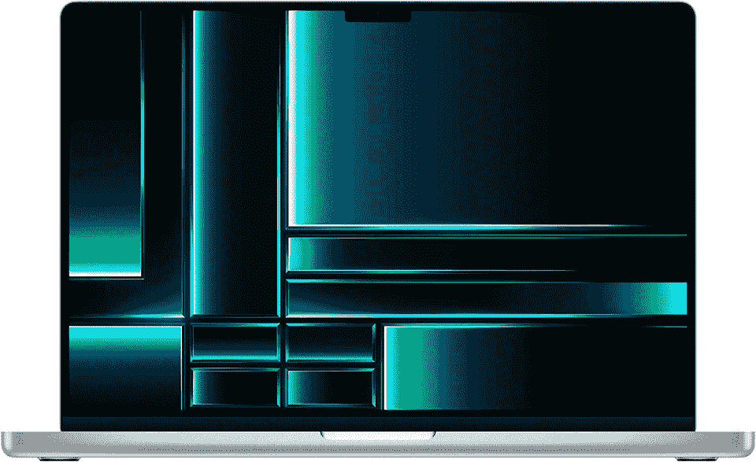
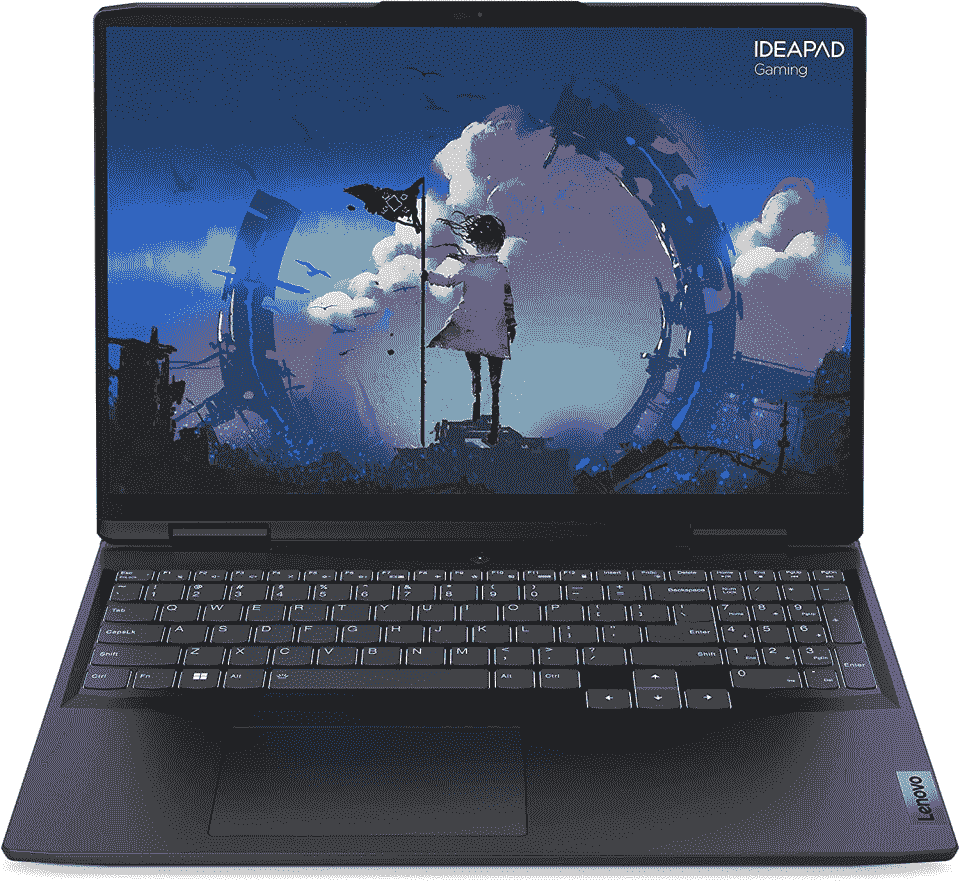
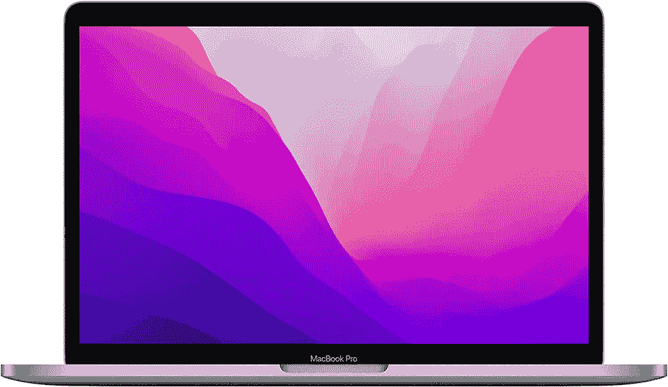
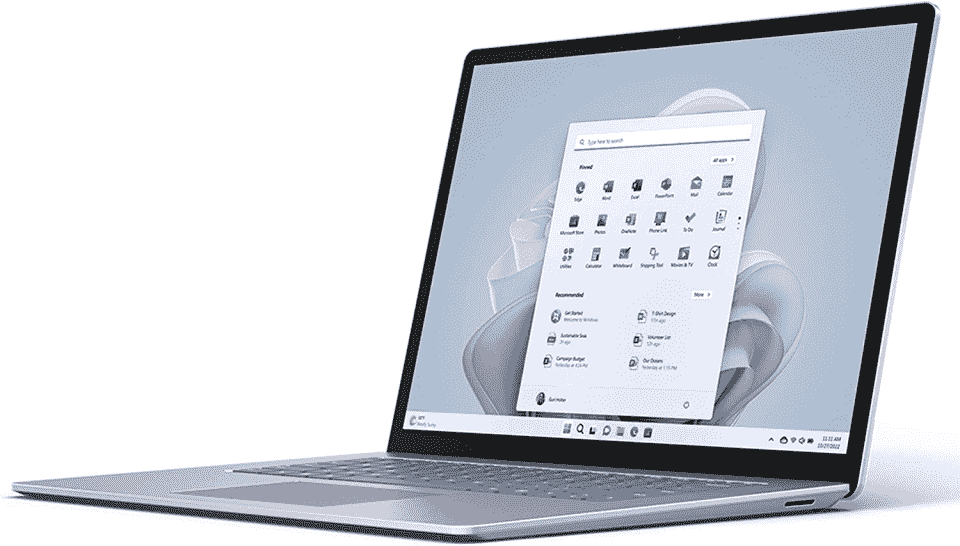
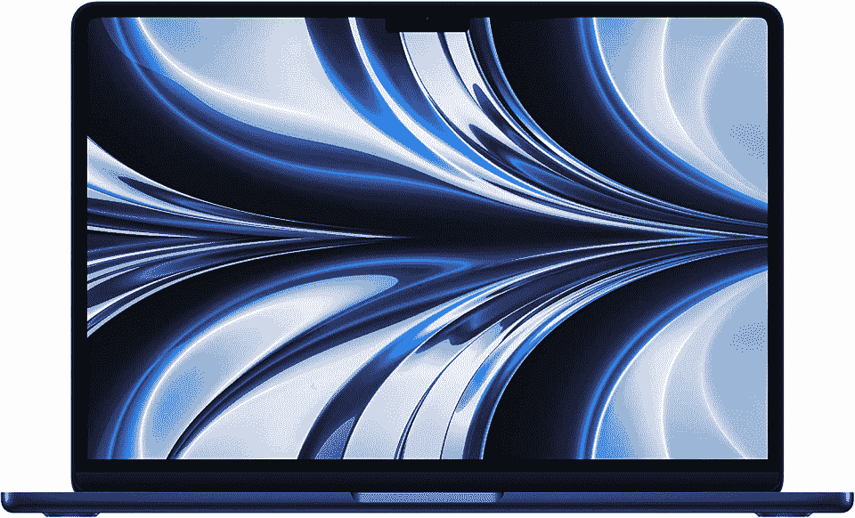
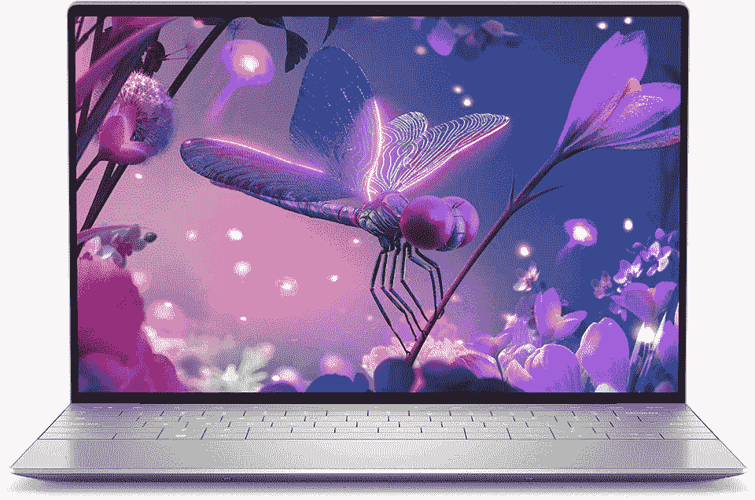
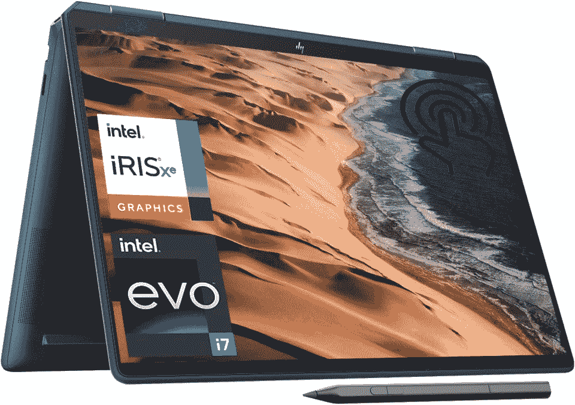
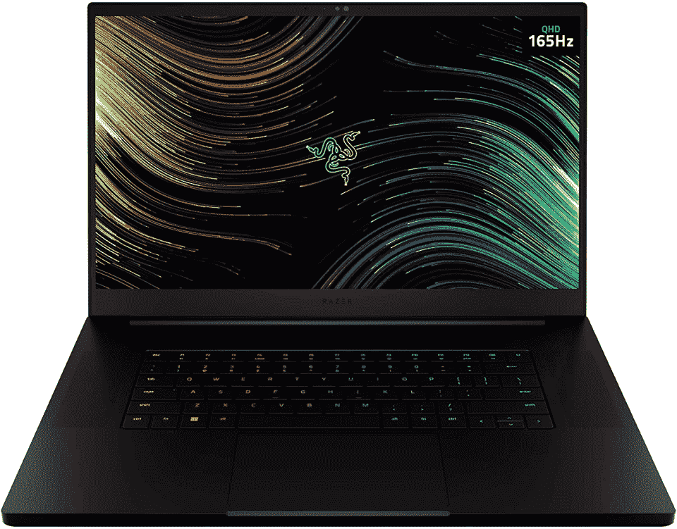
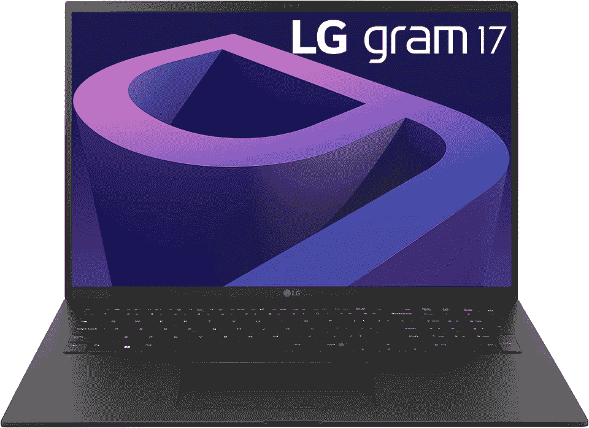

# 2023 年 10 款最佳编程笔记本电脑[专家推荐]

> 原文：<https://hackr.io/blog/best-laptops-for-programming>

用于编程的笔记本电脑非常方便。有了合适的工具，你几乎可以在任何时间、任何地点编写代码，甚至是在你最喜欢的咖啡馆或者飞机上！有了正确的规范，你就可以编译和测试你的代码，即使你是在玩视频游戏。

但是有这么多的选择，选择一个正确的是很有挑战性的。我们已经找到了 2023 年 10 款最适合编程的笔记本电脑，包括运行苹果硅芯片的最新 MacBooks 和运行第 12 代英特尔芯片(或 AMD 等效芯片)的 Windows 机器。

下面，你会找到一个方便的购买指南，帮助你选择合适的机器。作为奖励，我们列出了最佳编码计算机的最佳竞争者，包括各种用例、偏好和预算的建议。

让我们开始吧！

**用于编程的特色笔记本电脑【编辑推荐】**

## **一台好的笔记本电脑对编程的重要性**

虽然可以使用[老式笔记本电脑](https://inventwithpython.com/blog/2022/02/03/what-kind-of-computer-do-i-need-to-learn-programming/#:~:text=You%20don't%20need%20to,you%20in%20the%20right%20direction.)进行编程，但假设它们有足够的 RAM 和体面的整体规格，大多数程序员希望编码计算机有足够的处理能力来有效地编译和测试他们的代码。

对于一些程序员来说，用于编码的好的笔记本电脑需要非常强大，以处理像游戏开发这样的密集型项目。

## **选择笔记本电脑进行编程的关键因素**

### **处理器**

瞄准第 10 代及以上的英特尔处理器(或 AMD 的同类产品)，寻找多核处理器，因为更多的内核意味着更强的处理能力。如果你想用 MacBook 作为笔记本电脑来编码，M1 和 M2 的芯片提供的处理能力绰绰有余，甚至在基本型号上也是如此。

### **RAM**

我们不建议 Windows 低于 8GB，但 16GB 是最佳选择。您还可以升级到更高，以处理更繁重的工作负载和多任务处理。在大多数情况下，运行苹果芯片的 MacBooks 可以使用 8GB 的默认内存。

### **显卡**

程序员不会总是需要一个独立的显卡/显卡/GPU。像英特尔 UHD 显卡、英特尔 Iris Xe 显卡或 AMD 镭龙显卡这样的集成 GPU 足以进行一般编码。图形核心集成到 M1/M2 芯片的 MAC 电脑也是如此。

如果您处理图形密集型项目，您可能需要一个独立的 GPU。至少，我们推荐 NVIDIA GeForce RTX 30XX 系列(或 AMD 的同等产品)。

### **显示**

如果你重视便携性，选择 11-13 英寸屏幕的笔记本电脑(尽管我们不建议小于 13 英寸)。为避免眼睛疲劳并获得更多屏幕空间，请选择 15 英寸及以上的屏幕。你还应该瞄准最低全高清(FHD) 1080p，或 1920 x 1080 像素。

### **存储**

我们不建议低于 512GB。如果您需要更多存储，您可以随时扩展到云或外部存储解决方案。

### **电池寿命**

如果你知道你会在移动中，那么最好的笔记本电脑应该为你提供足够的能量支持你一整天。如果你不想长时间离开电源插座，这对你来说可能没那么重要。

### **选择编码笔记本电脑时的其他考虑事项**

*   **制造质量和耐用性:**选择足够耐用的机器来满足您的需求！

*   价格和物有所值:花更多的钱可能很诱人，但只有在你能承受得起的情况下才这么做。

*   **便携性和重量:**如果你想带着笔记本电脑去旅行，就选择小巧轻便的机型。

*   **键盘和触摸板:**最好的软件开发笔记本电脑会提供舒适的触摸板和键盘。劣质的键盘和触摸板会让人感觉很廉价，可能会破坏你的体验，同时导致人体工程学方面的问题。

## **2023 年 10 款最佳编程笔记本电脑:我们的重点推荐**

| **笔记本电脑** | **描述** | **规格** |
| [****](https://geni.us/u29X69)[**MacBook Pro 16“M2**](https://geni.us/u29X69) | **总体编码的最佳笔记本电脑** | 

*   **屏幕尺寸** : 16.2 英寸
*   **处理器**:苹果 M2 Pro 或者 M2 Max
*   **GPU** :集成 GPU 核心
*   **RAM** : 16GB 或 32GB，最高 96GB
*   **电池续航时间**:最长 22 小时
*   **重量**:约 4.7 磅

 |
| [****](https://geni.us/8tPv7)[**联想 idea pad Gaming 3i Gen 7**](https://geni.us/8tPv7) | **最佳中档编码笔记本电脑** | 

*   **屏幕尺寸** : 15.6 英寸
*   **处理器**:

*   英特尔酷睿 i5-12500 处理器
*   英特尔酷睿 i7-12700 处理器
*   AMD R5-5600H
*   AMD R5-6600H 处理器

*   **GPU**:NVIDIA GeForce RTX 3050 或者 3050Ti
*   **RAM** : 8GB 可升级至 16GB
*   **电池寿命**:最长约 3 小时
*   **重量**:5.1 磅

 |
| [****](https://geni.us/U5o45)[**MacBook Pro 13“M2**](https://geni.us/U5o45) | **功率和便携性的最佳平衡** | 

*   **屏幕尺寸** : 13.3 英寸
*   处理器:苹果 M2
*   **GPU** :集成 GPU 核心
*   **RAM** : 8GB，最高 24GB
*   **电池寿命**:长达 17 小时
*   **重量**:3 磅

 |
| [****](https://geni.us/K2H7Fr)[**微软 Surface 笔记本电脑 5**](https://geni.us/K2H7Fr) | **最适合 Windows 用户** | 

*   **屏幕尺寸** : 13.5 寸或 15 寸
*   **处理器**:

*   Intel Core i5-1235U Evo
*   Intel i7-1255U Evo

*   **GPU** :英特尔 Iris Xe 显卡
*   **RAM** : 8GB 或 16GB，最高 32GB
*   **电池寿命**:长达 17 小时
*   **重量**:

*   13.5 英寸:约 2.8 磅
*   15 英寸:3.44 磅

 |
| [****](https://geni.us/mYmU)[**【HP 频谱 x 360 16】**](https://geni.us/mYmU) | **最佳二合一敞篷车** | 

*   **屏幕尺寸** : 16 英寸触摸屏
*   **处理器**:英特尔酷睿 i7-12700H Evo
*   **GPU** :英特尔 Iris Xe 显卡
*   **内存** : 16GB
*   **电池寿命**:长达 17 小时
*   **重量**:4.45 磅

 |
| [****](https://geni.us/b5GIg)[**MacBook Air 13“M2**](https://geni.us/b5GIg) | **最佳便携性** | 

*   **屏幕尺寸** : 13.6 英寸
*   处理器:苹果 M2
*   **GPU** :集成 GPU 核心
*   **RAM** : 8GB 至 24GB
*   **电池寿命**:长达 15 小时

 |
| [****](https://geni.us/ehuy)[**Dell XPS 13 9320**](https://geni.us/ehuy) | **最佳超便携 Windows】** | 

*   **屏幕尺寸** : 13.4 英寸
*   **处理器**:
*   Intel Core i5-1230U

*   **GPU** :英特尔 Iris Xe 显卡
*   **内存** : 8GB、16GB、32GB
*   **电池寿命**:约 7 小时
*   **重量**:2.59 磅以上

 |
| [****](https://geni.us/xrCLS)[**雷蛇之刃 17**](https://geni.us/xrCLS) | **最适合游戏玩家+最佳大型显示器** | 

*   **屏幕尺寸** : 17.3 英寸
*   **处理器**:英特尔酷睿 i7-12800H
*   **GPU**:NVIDIA GeForce RTX 3060，3070Ti，3080Ti
*   **RAM** : 16GB DDR5，用户可升级至 64GB
*   **电池寿命**:长达 2.5-3 小时
*   **重量**:5.50 磅

 |
| [****](https://geni.us/MKTH)[**MacBook Pro 14“M2**](https://geni.us/MKTH) | **运行 M2 Pro/Max 的更便携的 MacBook Pro** | 

*   **屏幕尺寸** : 14.2 英寸
*   **处理器**:苹果 M2 Pro 或者 M2 Max
*   **GPU** :集成 GPU 核心
*   **RAM** : 16GB，32GB，最高 96GB
*   **电池寿命**:长达 12 小时
*   **重量**:约 3.5 磅

 |
| [****](https://geni.us/jmhXUfu)[**LG 克 17**](https://geni.us/jmhXUfu) | **超大显示屏的超便携笔记本电脑** | 

*   **屏幕尺寸** : 17 英寸
*   **处理器**:英特尔酷睿 i7-1260P
*   **GPU** :英特尔 Iris Xe 显卡
*   **RAM** : 16GB DDR5
*   **电池寿命**:长达 17 小时
*   **重量**:2.98 磅

 |

### **1。**[**MacBook Pro 16【M2】**](https://geni.us/u29X69)**-编码整体最佳笔记本电脑**

[检查价格](https://geni.us/u29X69)

| **关键规格** |
| **尺寸** : 14.01 x 9.77 x 0.66 英寸 | **显示:**

*   16.2 英寸液态视网膜 XDR
*   254 PPI(每英寸像素)时为 3456x2234 像素
*   P3 宽颜色
*   自适应刷新率(高达 120Hz)

 |
| **操作系统:** macOS Ventura | **处理器:**苹果 M2 Pro 或者 M2 Max |
| **显卡:**集成；19 个 GPU 核心(可升级至 30 个)或 38 个 GPU 核心 | **RAM/内存:** 16GB 或 32GB，M2 Max 可升级至 64GB，M2 Max 可升级至 96GB，带 38 个 GPU 内核 |
| **存储:** 512GB 或 1TB SSD 可配置为 1TB、2TB、4TB、8TB | num pad:无 |
| **电池续航时间:**据报道，长达 15 小时的无线网络和 22 小时的苹果电视应用播放 | **重量:**4.7-4.8 磅 |

**我们选择这款笔记本电脑的原因:**

最近发布的 16 英寸 M2 Pro 和 M2 Max MacBook Pro 是我们选择的最佳编码笔记本电脑。

这台机器在价格上肯定很高，但它的功能强大得令人难以置信，有一个辉煌的显示屏，并有两个强大的型号。它还可以升级到令人疯狂的 96GB 内存和 8TB 存储，但除非你要做一些极其繁重的工作，否则基本的 M2 Pro 型号已经足够了。

我们最喜欢的一点是它装载了端口，包括 HDMI 和 SDXC。如果你担心能否运行 Windows，你会很高兴知道在 Parallels 上运行 Windows 11 现在得到了官方支持。

**优点**

*   惊人的电池寿命
*   高度可配置(成本更高)
*   漂亮的展示
*   成吨的屏幕空间
*   无比强大
*   很多港口
*   支持多个外部显示器

**缺点**

*   昂贵的
*   没有数字小键盘
*   由于其尺寸可能会感觉笨重

[检查价格](https://geni.us/8tPv7)

| **关键规格** |
| **尺寸:** 14.13 x 9.83 x 0.98 英寸 | **显示屏:**120 赫兹的 15.6 英寸 FHD IPS |
| **操作系统:** Windows 11 Home | **处理器:**

*   英特尔酷睿 i5-12500H
*   英特尔酷睿 i7-12700H
*   AMD R5-5600H
*   AMD R5-6600H 处理器

 |
| **显卡:**集成+ NVIDIA GeForce RTX 3050 或 3050Ti | **RAM/内存:**8GB；用户可升级至最高 16GB DDR4-3200MHz |
| **存储:** 512GB 固态硬盘 | **num pad:t1】是** |
| **电池续航时间:**报告称，不玩游戏时，电池续航时间可达约 3 小时 | **体重:**5.1 磅 |

**我们选择这款笔记本电脑的原因:**

联想 IdeaPad Gaming 3i 是 IT 专业人士的最佳笔记本电脑之一。它相对便宜，可配置，RAM 可由用户升级，这很好，因为它只有 8GB 内置。

这款笔记本电脑还配有独立 GPU，可用于游戏和其他图形密集型任务。它甚至有一个数字小键盘，使编码更容易，尽管联想在电池寿命和便携性上做出了妥协。

**优点**

*   相对实惠
*   有数字小键盘
*   大量的屏幕空间
*   可配置的
*   独立 GPU

**缺点**

*   默认情况下只有 8GB 内存
*   电池寿命低于标准
*   有点偏胖

### **3。**[**MacBook Pro 13“M2**](https://geni.us/U5o45)**——功率与便携性的最佳平衡**

[检查价格](https://geni.us/U5o45)

| **关键规格** |
| **尺寸:** 11.97 x 8.36 x 11.97 英寸 | **显示:**

*   13.3 英寸视网膜显示屏
*   227 PPI 时为 2560x1600
*   P3 宽颜色

 |
| 操作系统: macOS | 处理器:苹果 M2 |
| **显卡:** 10 个集成 GPU 核心 | **RAM/内存:** 8GB 可配置为 16GB 或 24GB |
| **存储:** 256GB 或 512GB 固态硬盘，可配置为 1TB 或 2TB | num pad:无 |
| **电池寿命:**报告长达 17 小时的无线网络和 20 小时的苹果电视应用播放 | **体重:**3.0 磅 |

**我们选择这款笔记本电脑的原因:**

寻求便携性和功能完美结合的用户可能会喜欢 13 英寸的 MacBook Pro M2。该型号重量轻，电池续航时间长，并提供足够的电量来满足您的需求。如果需要，它还可以配置更多的内存和存储空间。

与 M2 MacBook Air 相比，这款机型的显示屏略小，但它确实内置了冷却风扇，以确保您的机器在任何工作负载下都能以最佳状态运行。

**优点**

*   强大的
*   可配置的
*   轻便的
*   出色的电池寿命
*   内置的散热风扇让这款机型比 MacBook Air 更具优势

**缺点**

*   几个港口
*   没有数字小键盘
*   720 像素网络摄像头
*   仅支持 1 个额外的外部显示器

[检查价格](https://geni.us/K2H7Fr)

| **关键规格** |
| **大小:**

*   13.5 英寸:12.1 x 8.8 x .57 英寸
*   15 英寸:13.4 x 9.6 x .58 英寸

 | **显示**

*   13.5 英寸 PixelSense 2256x1504 像素，201PPI，触摸屏，sRGB 色彩校准显示屏
*   15 英寸 PixelSense 2496x1664 像素，201PPI，触摸屏，sRGB 色彩校准显示屏

 |
| **操作系统:** Windows 11 Home | **处理器:**

*   13.5 英寸型号:第 12 代英特尔酷睿 i5-1235U Evo 或 i7-1255U Evo
*   15 英寸型号:第 12 代英特尔 i7-1255U Evo

 |
| **显卡:**集成英特尔 Iris Xe 显卡 | **RAM/内存:**

*   13.5 英寸型号:8GB 或 16GB
*   15 英寸型号:8GB 或 16GB，可升级至 32GB

 |
| **存储:**可移动固态硬盘

*   13.5 英寸:256GB 或 512GB
*   15”: 256GB, 512GB, 1TB

 | num pad:无 |
| **电池寿命:**根据使用情况，报告为 17-18 小时 | **重量:**

*   13.5 英寸:2.80-2.86 磅
*   15 英寸:3.44 磅

 |

**我们选择这款笔记本电脑的原因:**

微软 Surface 笔记本电脑的最新版本有两种尺寸:13.5 英寸和 15 英寸。两者都具有漂亮的触摸屏显示器和集成的英特尔 Iris Xe 显卡，并且您还将拥有强大的第 12 代英特尔 Evo 芯片。

我们将这款笔记本电脑包括在内，因为它非常便携，电池寿命也非常长。如果不需要独立 GPU，这是一个很好的选择。

**优点**

*   惊人的电池寿命
*   2 种尺寸可供选择
*   强大的第 12 代英特尔 CPU
*   轻巧便携

**缺点**

*   几个港口
*   仅 720p 摄像机
*   无独立 GPU

[检查价格](https://geni.us/mYmU)

| **关键规格** |
| **尺寸:** 14.09 x 9.66 x 0.78 英寸 | **显示:**

*   16 英寸触摸屏 IPS
*   3072 x 1920 像素(3K+)

 |
| **操作系统:** Windows 11 Home | **处理器:**英特尔酷睿 i7-12700H Evo |
| **显卡:**集成英特尔 Iris Xe 显卡 | **内存/内存:** 16GB |
| **存储:** 512GB 固态硬盘可升级至 2TB | num pad:无 |
| **电池寿命:**根据使用情况，最高可达 17 小时 | **体重:**4.45 磅 |

**我们选择这款笔记本电脑的原因:**

HP Spectre x360 16 英寸笔记本电脑凭借其强大的规格成为最佳软件开发笔记本电脑的竞争对手。这款机器在我们的列表中脱颖而出，这要归功于它的触摸屏和附带的手写笔。如果您正在寻找多功能性，这款笔记本电脑是一个值得考虑的选择。

如果你重视电池续航时间，惠普 Spectre x360 也是赢家，根据使用情况，它的续航时间可达 17 小时。您还可以获得强大的第 12 代 i7 CPU 和 16GB 内存。这款笔记本电脑唯一的缺点是缺乏独立的 GPU，但这只是在你需要的时候才有用。

**优点**

*   很多港口
*   配有手写笔
*   可改变的
*   漂亮的展示
*   强大的
*   超长电池寿命

**缺点**

*   无独立 GPU
*   没有数字小键盘

[检查价格](https://geni.us/b5GIg)

| **关键规格** |
| **尺寸:** 11.97 x 8.46 x 0.44 英寸 | **显示:**

*   13.6 英寸液晶视网膜显示屏
*   224 PPI 时为 2560 x 1664 像素
*   P3 宽颜色

 |
| 操作系统: macOS | 处理器:苹果 M2 |
| **显卡:** 8 核或 10 核集成 GPU | **RAM/内存:** 8GB 可配置为 16GB 或 24GB |
| **存储:** 256GB 或 512GB 固态硬盘，可配置为 512GB、1TB 或 2TB | num pad:无 |
| **电池寿命:**报告长达 15 小时的无线网络和 18 小时的苹果电视应用播放 | **重量:**2.7 磅 |

**我们选择这款笔记本电脑的原因:**

MacBook Air M2 采用了更新的设计，取消了 Air clamshells 过去的锥形设计。

这款机型的显示屏略大，网络摄像头更好，甚至比之前的 M1 机型更强大。它是终极的超便携设备，这要归功于它惊人的电池续航时间和轻巧的设计。

**优点**

*   极其轻巧便携
*   惊人的电池寿命
*   可配置的
*   强大的
*   漂亮的展示
*   MagSafe 3 充电端口
*   1080p 网络摄像头

**缺点**

*   没有数字小键盘
*   午夜配色是指纹磁铁
*   几个港口
*   没有内置冷却风扇来防止热节流
*   仅支持一个外部显示器

[检查价格](https://geni.us/ehuy)

| **关键规格** |
| **尺寸:** 11.63 x 7.86 x 0.55 英寸 | **显示:**

*   13.4 寸 FHD+ 1920x1200 像素 60Hz 非触控
*   13.4 英寸 FHD+ 1920x1200 像素 60Hz 触摸屏
*   13.4 英寸 4K 3456x2160 像素触摸屏

 |
| **操作系统:** Windows 11 Home 或 Pro 你可能会找到一个装有 Ubuntu Linux 20.04 LTS 的型号 | **处理器:**第十二代英特尔酷睿 i5 1230U 第 12 代英特尔酷睿 i7 1250U |
| **显卡:**英特尔 Iris Xe 显卡 | **RAM/内存:** 8GB、16GB、32GB |
| **存储:** 512GB、1TB、2TB 固态硬盘 | num pad:无 |
| **电池寿命:**约 7 小时 | **重量:**2.59 磅起 |

**我们选择这款笔记本电脑的原因:**

对于与 MacBook Air 处于同一细分市场的笔记本电脑来说，戴尔 XPS 13 做得非常好。这是一款漂亮的 Windows ultraportable，尽管它的电池寿命没有 MacBook Air 长。然而，这款笔记本电脑值得一看，尤其是它漂亮的显示屏选项。

**优点**

*   轻巧、小巧、便携
*   接触式或非接触式
*   强大的
*   可配置的

**缺点**

*   电池寿命一般
*   几个港口
*   720 像素网络摄像头
*   无独立 GPU

### **8。** [**雷蛇之刃 17**](https://geni.us/xrCLS) **-最适合游戏玩家+最佳大型显示器**

[检查价格](https://geni.us/xrCLS)

| **关键规格** |
| **尺寸:** 15.55 x 10.24 x 0.78 英寸 | **显示屏:** 17.3 英寸 QHD (2K) 2560x1440 像素

*   160 赫兹，sRGB 100%，IPS，3 毫秒
*   240 赫兹，DC-P3 100%，6 毫秒

 |
| **操作系统:** Windows 11 Home | **处理器:**第 12 代英特尔酷睿 i7-12800H |
| **显卡:**集成+ NVIDIA GeForce RTX 3060，3070Ti，或 3080Ti | **RAM/内存:** 16GB DDR5，用户可升级至 64GB |
| **存储:** 1TB，最高 2TB | num pad:无 |
| **电池寿命:**2.5-3 小时 | **体重:**5.50 磅 |

**我们选择这款笔记本电脑的原因:**

如果你想要一个更大的显示器，Razer Blade 17 正在争夺软件开发最佳笔记本电脑。你不仅会得到 17.3 英寸的屏幕，还会得到 QHD (2K)分辨率。

您还可以在 NVIDIA GeForce RTX 3060、3070ti 和 3080ti 之间进行选择，为您提供所需的全部图形处理能力。这么大的功率，你应该预计这台机器是电池饥饿，所以计划靠近电源插座长时间使用。

**优点**

*   极其强大
*   成吨的港口
*   漂亮的展示
*   非常适合游戏和游戏开发人员
*   DDR5 RAM

**缺点**

*   电池寿命很短，大约 3 小时
*   DDR5 RAM 升级成本高昂
*   这种尺寸的笔记本电脑没有数字小键盘

### **9。**[**MacBook Pro 14“M2**](https://geni.us/MKTH)**——更便携的 MacBook Pro 运行 M2 Pro/Max**

[检查价格](https://geni.us/MKTH)

| **关键规格** |
| **尺寸:** 12.31 x 8.71 x 0.61 英寸 | **显示:**

*   14.2 英寸液态视网膜 XDR
*   254 PPI 时 3024x1964 像素
*   P3 宽颜色
*   自适应刷新率(高达 120Hz)

 |
| **操作系统:** macOS Ventura | **处理器:**苹果 M2 Pro 或者 M2 Max |
| **显卡:**集成；16 核、19 核或 30 核；可配置为 38 核 | **RAM/内存:** 16GB 或 32GB，M2 Max 可升级至 64GB，M2 Max 可升级至 96GB，带 38 个 GPU 内核 |
| **存储:** 512GB 或 1TB SSD 可配置为 1TB、2TB、4TB、8TB | num pad:无 |
| **电池寿命:**报告长达 12 小时的无线网络和 18 小时的苹果电视应用播放 | **体重:**3.5-3.6 磅 |

**我们选择这款笔记本电脑的原因:**

更新的 14 英寸 MacBook Pro 本质上是 16 英寸机型的缩小版。它仍然非常强大，提供了许多与它的大兄弟相同的规格和配置，同时保持了更好的便携性和轻便性。

如果我们不把这台机器包括在这个列表中，那将是我们的失职，因为它肯定会在最佳编码计算机的竞争中胜出。

**优点**

*   更小、更便携的 16 英寸型号
*   比 16 英寸机型更实惠
*   惊人的展示
*   无比强大
*   很多港口
*   支持多个外部显示器

**缺点**

*   还是贵
*   没有数字小键盘

### 10。[**LG Gram 17**](https://geni.us/jmhXUfu)**-超大显示屏的超便携笔记本电脑**

[检查价格](https://geni.us/jmhXUfu)

| **关键规格** |
| **尺寸** : 14.91 x 10.9 x 0.7 英寸 | **显示屏:** 17 英寸 WQXGA 2560 x 1600 IPS，99% DCI-P3 |
| **操作系统:** Windows 11 Home | **处理器:**第 12 代英特尔酷睿 i7-1260 处理器 |
| **显卡:**英特尔 Iris Xe 显卡 | **RAM/内存:** 16GB DDR5 |
| **存储:** 1TB | **num pad:t1】是** |
| **电池寿命:**报告长达 17~小时 | **重量:**2.98 磅 |

**我们选择这款笔记本电脑的原因:**

LG Gram 17 是一台庞大的机器。在 17 英寸，它的屏幕面积可以与 Razer Blade 17 相媲美，但没有与之匹配的巨额价格。

对于不做大量图形密集型任务的程序员来说，LG Gram 17 是一台非常棒的机器，尤其是考虑到它只有 3 磅重！

**优点**

*   惊人的电池寿命
*   漂亮的展示
*   有数字小键盘
*   相对于它的尺寸来说超级轻便！
*   考虑到规格和显示屏尺寸，价格实惠

**缺点**

## **你应该选择哪种编码笔记本电脑？**

适合您的编码笔记本电脑取决于您的具体需求。然而，我们确实有一些建议:

**想找到最适合网络安全的笔记本电脑吗？结账:**

**[黑客攻击的最佳笔记本电脑](https://hackr.io/blog/best-laptop-for-hacking)**

## **结论**

最适合编程的笔记本电脑是那些最能满足您需求的电脑。请记住，您不必购买最昂贵或最强大的机器来进行编程，除非您确实需要增强的规格。

但是如果你想要最好中的最好，那么 [MacBook Pro 16"](https://geni.us/oUFJCY) 是你的不二之选——如果你想在更大的屏幕上编码和游戏，我们推荐 [Razer Blade 17](https://geni.us/xrCLS) 。

如果你仍然不确定买哪个型号，决定你最需要你的机器什么，然后再看看我们上面的购买指南！

**想学习如何编码？结账:**

**[2023 年最佳编码应用](https://hackr.io/blog/best-coding-apps)**

## **常见问题解答**

### **1。编程用什么笔记本电脑最好？**

有些人可能只需要一台中档笔记本电脑，而其他人则需要具有顶级规格和独立 GPU 的极其强大的机器。如果你想要最好的整体编程笔记本电脑，请查看 [MacBook Pro 16 英寸 M2 (Pro/Max)](https://geni.us/Z14BaB) 。

### **2。编程需要功能强大的笔记本电脑吗？**

不一定。大多数中档笔记本电脑都能够高效地编程和编译代码。如果你打算从事游戏开发或者需要编译大量代码，你可能需要一台更强大的机器。

### **3。哪款笔记本电脑处理器最适合编程？**

程序员从最新的高端处理器中获益最大。任何多核英特尔处理器第八代+(或 AMD 同等产品)都将为那些希望节省开支的人服务。苹果粉丝可以高兴了，因为苹果芯片(M2 M1)也非常适合编码。

### **4。什么尺寸的笔记本电脑屏幕最适合编程？**

这个很大程度上取决于个人喜好。更大的显示屏意味着更多的屏幕空间，让您在显示更多内容的同时减轻眼睛的负担。然而，如果便携性很重要，配备 11-13 英寸显示屏的笔记本电脑也能很好地工作。

### **5。我需要多少内存来编程？**

4GB 对于基本的编程来说已经足够了，但是如果您想要高效地进行多任务处理，我们不建议使用低于 16GB 的内存。8GB 是我们向 Windows 用户推荐的最低容量。对于苹果芯片上的 Mac 用户来说，由于 macOS 优化的 M1/M2 芯片，8GB 是不错的，但更多不会有坏处！

### **6。哪款编程用笔记本电脑最适合你？**

当你根据自己的具体情况选择最好的计算机进行编程时，一定要记住考虑你打算用你的笔记本电脑做什么。不要只考虑你将从事什么样的编码项目，还要考虑诸如通用、多任务和其他用例。如果你更喜欢最新最棒的，那就试试 [MacBook Pro 16" M2 (Pro/Max)](https://geni.us/Z14BaB) 。