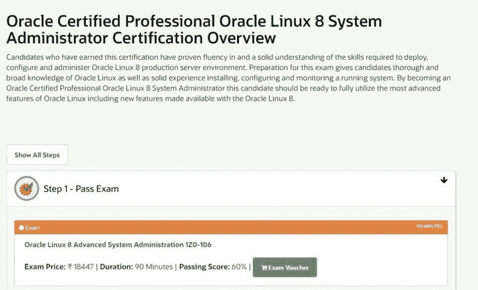
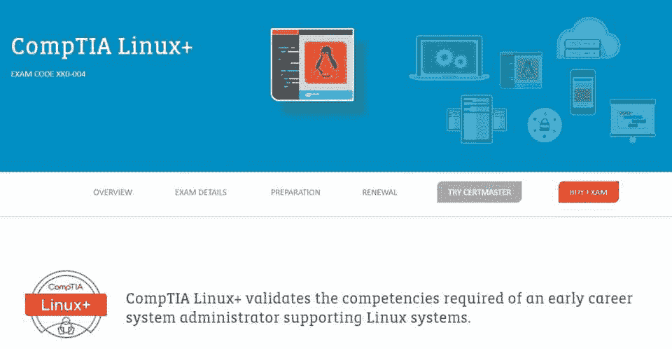
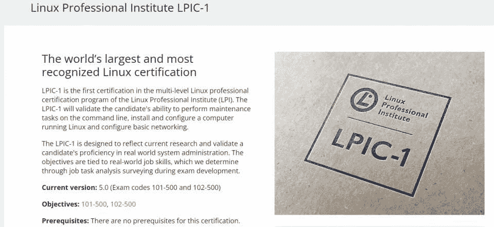
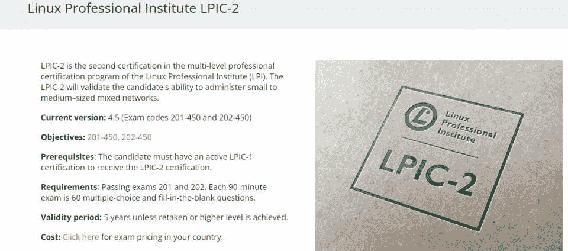
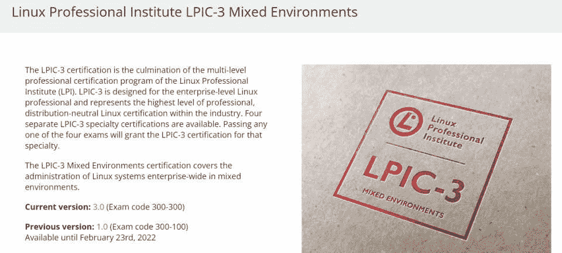
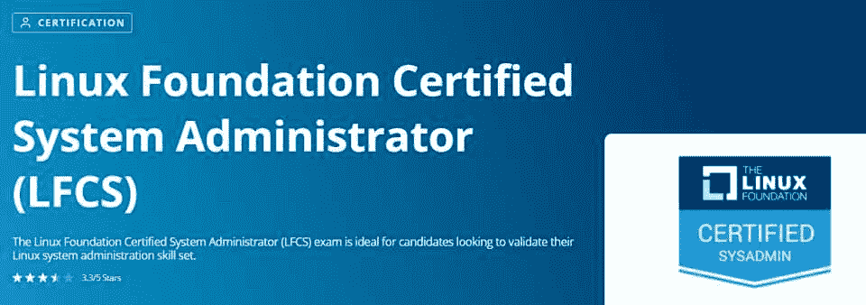
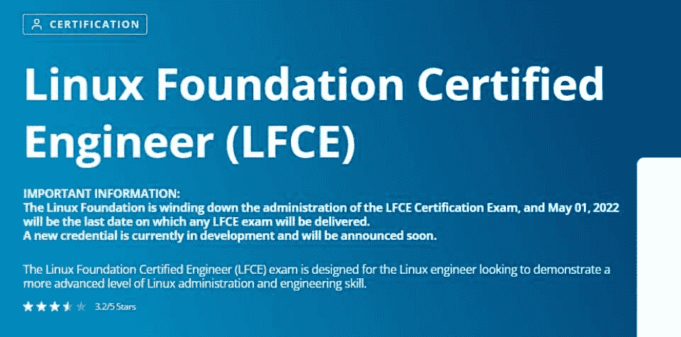
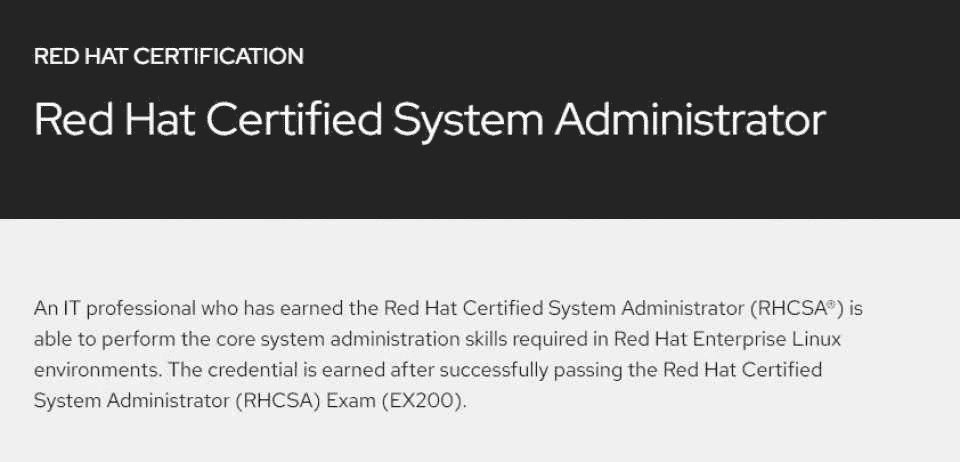
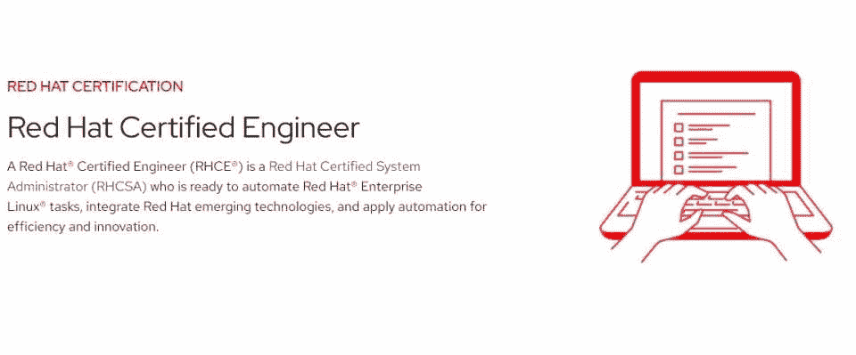
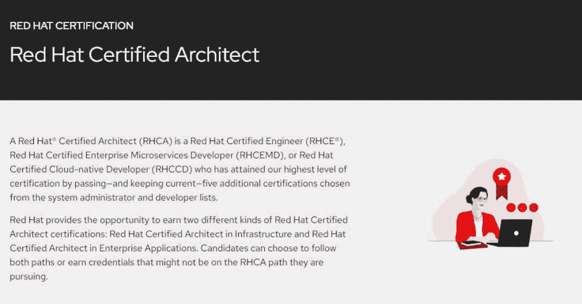

# 2023 年 10 大最佳 Linux 认证[更新]

> 原文：<https://hackr.io/blog/best-linux-certifications>

Linux 出现在我们日常生活的几乎所有设备中，是世界上最常用的操作系统之一。随着如此广泛的使用，对于那些愿意花时间和精力学习 Linux 如何工作的人来说，有几个机会可以利用。

在这里，我们将回顾 10 个最好的 Linux 认证供您考虑。但是首先，让我们回顾一些关于获得 Linux 认证的一般性问题。如果你想快速总结，你可以简单地看看下面的汇总表。

## **Linux 认证**

| **费用** | **及格分数** | **持续时间** | **总提问数** | **语言** | [**Oracle 认证专家 Oracle Linux 8 系统管理员认证**](https://education.oracle.com/oracle-certified-professional-oracle-linux-8-system-administrator/trackp_LIN8OCP) |
| $245 | 60% | 90 分钟 | 60 | 英语 | [**CompTIA Linux+**](https://www.comptia.org/certifications/linux) |
| $348 | 720/900 | 90 分钟 | 90 | 英语、日语、葡萄牙语、西班牙语 | [**LPIC 1–Linux 管理员**](https://www.lpi.org/our-certifications/lpic-1-overview) |
| $120 | 500/800 | 每次考试 90 分钟 | 两次考试，每次 60 题 | 英语、日语、葡萄牙语(巴西)、西班牙语 | [**LPIC 2–Linux 工程师**](https://www.lpi.org/our-certifications/lpic-2-overview) |
| $120 | 500/800 | 每次考试 90 分钟 | 两次考试，每次 60 题 | 英语 | [**LPIC 3–300–Linux 企业专业认证**](https://www.lpi.org/our-certifications/lpic-3-300-overview) |
| $120 | 500/800 | 90 分钟 | 60 个问题 | 英语 | [**LFCS (Linux 基金会认证系统管理员)认证**](https://training.linuxfoundation.org/certification/linux-foundation-certified-sysadmin-lfcs/) |
| 375 美元(仅考试)或 575 美元(课程和考试) | 66% | 2 小时 | 基于绩效 | 英语、西班牙语、葡萄牙语、日语、德语 | [**LFCE (Linux 基金会注册工程师)认证**](https://training.linuxfoundation.org/certification/linux-foundation-certified-engineer-lfce/) |
| $375 | 57% | 2 小时 | 基于绩效 | 英语、西班牙语、葡萄牙语、日语、德语 | [**RHCSA(红帽认证系统管理员)认证**](https://www.redhat.com/en/services/certification/rhcsa) |
| $450 | 210/300 | 3 小时 | 基于绩效 | 英语 | [**RHCE(红帽认证工程师)认证**](https://www.redhat.com/en/services/certification/rhce) |
| $450 | 210/300 | 3 小时 | 基于绩效 | 英语 | [**RHCA(红帽注册建筑师)认证**](https://www.redhat.com/en/services/certification/rhca) |
| 取决于参加的考试 | 每次考试 210/300 | 取决于参加的考试 | 要求通过至少 5 门其他红帽考试 | 英语 | **十大** **最佳 Linux 认证** |

## [****](https://education.oracle.com/oracle-certified-professional-oracle-linux-8-system-administrator/trackp_LIN8OCP)

**课程信息**

| **课程大纲** |  |
| **问题数量:** 60

*   考试时间: 90 分钟
*   **及格分数:** 60%
*   语言:英语
*   费用:245 美元
*   部署、配置和管理 Oracle Linux 8 生产服务器环境

 | 安装、配置和监控正在运行的系统

*   熟悉 Oracle Linux
*   Oracle 认证专家 Oracle Linux 8 系统管理员认证考试旨在了解如何部署、配置和管理 Oracle Linux 8 生产服务器环境。
*   它为学习如何使用 Oracle Linux 以及安装、配置和监控正在运行的系统奠定了坚实的基础。您将了解如何使用 Oracle Linux 及其最新版本的所有新特性。

 |

[查看认证](https://education.oracle.com/oracle-certified-professional-oracle-linux-8-system-administrator/trackp_LIN8OCP)

[****](https://www.comptia.org/certifications/linux)

**课程信息**

**课程大纲**

|  | **问题数量:** 90 |
| 考试时间: 90 分钟

*   **及格分数:** 720/900
*   语言:英语、日语、葡萄牙语和西班牙语
*   费用:348 美元
*   安全性、存储和可视化，
*   内核模块

 | 企业级设备管理

*   Git 和自动化
*   服务器端和命令行的使用
*   建立工作关系网
*   防火墙
*   解决纷争
*   SELinux
*   CompTIA Linux+认证涵盖了最新的基础技能，是一项以工作为中心的 Linux 认证。您将了解在 Linux 发行版中执行的任务、Linux 命令行、维护、安装、配置和联网。实践经验包括配置、支持和监控运行 Linux 操作系统的服务器。
*   [查看认证](https://www.comptia.org/certifications/linux)
*   [****](https://www.lpi.org/our-certifications/lpic-1-overview)

 |

课程信息

课程大纲

问题数量:两次考试，每次 60 个问题

| 

考试时间:每次考试 90 分钟

 | 

及格分数:500/800

 |
| --- | --- |
| 语言:英语、日语、葡萄牙语(巴西)、西班牙语

*   费用:120 美元
*   系统结构
*   Linux 安装
*   包装管理
*   GNU 和 Unix 命令

 | Linux 文件系统、文件系统层次标准和设备

*   外壳和外壳脚本
*   桌面和界面。
*   管理
*   系统服务
*   LPIC 1-Linux 管理员认证教授候选人执行命令行维护任务，安装和配置 Linux 系统，以及基本的网络。它验证候选人管理现实世界系统管理和基本 Linux 命令的能力。
*   该认证不需要任何先决条件，有效期为 5 年。候选人需要通过 101 和 102 考试才有资格获得认证。这可以说是对初学者最好的 Linux 认证。
*   [查看认证](https://www.lpi.org/our-certifications/lpic-1-overview)
*   [****](https://www.lpi.org/our-certifications/lpic-2-overview)
*   **课程信息**

 |
| --- | --- |

**课程大纲**

**题数:**两次考试，每次 60 题

**考试时间:**每次考试 90 分钟

| **及格分数:** 500/800 | 语言:英语 |
| **费用:**120 美元

*   系统启动
*   Linux 内核
*   文件系统和设备
*   容量规划
*   高级存储设备管理

 | 网络配置和系统维护

*   文件共享和网络客户端管理
*   域名服务器
*   网络和电子邮件
*   系统安全
*   LPIC 2-Linux 工程师认证是 LPI 多层次专业认证的第二个。它使候选人能够管理中小型网络。要获得该认证，候选人需要拥有有效的 LPIC -1 认证。然而，LPIC-1 和 LPIC-2 考试可以以任何顺序进行。该证书的有效期为 5 年。
*   [查看认证](https://www.lpi.org/our-certifications/lpic-2-overview)
*   [****](https://www.lpi.org/our-certifications/lpic-3-300-overview)
*   **课程信息**
*   **课程大纲**

 |

**问题数量:** 60 个问题

考试时间: 90 分钟

**及格分数:** 500/800

| **语言:**英语、日语 | **费用:**120 美元 |
| OpenLDAP 配置和认证后端

*   samba–基础知识、共享基础知识、用户和群组管理
*   samba–名称服务和域集成
*   使用 Windows 和 Linux 客户端。
*   LPIC 3–300–Linux 企业专业认证是一项企业级专业认证计划，代表了分布式神经 Linux 的最高水平。它要求候选人拥有有效的新 LPIC 协议认证。该证书的有效期为 5 年。
*   除了 LPIC-3300，这个级别还有两个专业化认证。通过这三项中的任何一项都可以获得该专业的认证。其前提条件和有效期与 LPIC 协议 3 相同。

 | [查看认证](https://www.lpi.org/our-certifications/lpic-3-300-overview)

*   [****](https://training.linuxfoundation.org/certification/linux-foundation-certified-sysadmin-lfcs/)
*   **课程信息**
*   **课程大纲**

 |

**问题数量:**基于表现的考试

考试时间: 2 小时

**及格分数:** 66%

**语言:** 英语、西班牙语、葡萄牙语、日语和德语

| **费用:** $375(仅考试)或$575(课程和考试) |  |
| 基本命令、文件系统和功能。

*   用户和组管理以及系统范围的环境
*   运行系统的操作、引导、重启、安装、配置和故障排除。
*   服务配置、DNS、SSH、HTTP 和虚拟机维护。
*   网络、IP 路由和同步
*   存储管理、LVM 存储、RAID 设备和配置的文件系统。

 | LFCS (Linux 基金会认证系统管理员)认证是 Linux 系统管理初学者的理想选择。它根据在职任务模拟和真实场景来评估候选人。这相当于未来雇主的实践经验。该认证在线进行，有效期为 3 年。这种认证不需要事先了解主题。

*   [查看认证](https://training.linuxfoundation.org/certification/linux-foundation-certified-sysadmin-lfcs/)
*   [****](https://training.linuxfoundation.org/certification/linux-foundation-certified-engineer-lfce/)
*   **课程信息**
*   **课程大纲**

*   **问题数量:**基于绩效

 |

考试时间: 2 小时

**及格分数:** 57%

语言:英语、西班牙语、葡萄牙语、日语和德语

| 费用:375 美元 | 基本命令、文件系统和功能。 |
| 用户和组管理以及系统范围的环境

*   运行系统的操作、引导、重启、安装、配置和故障排除。
*   服务配置、DNS、SSH、HTTP 和虚拟机维护。
*   网络、IP 路由和同步
*   存储管理、LVM 存储、RAID 设备和配置的文件系统。
*   LFCE (Linux 基金会认证工程师)认证是为有 3-5 年 Linux 经验的候选人准备的。它向候选人传授更高技能工作角色的高级概念。这是一种基于表现的考试，更侧重于在职情况。但是，该认证没有先决条件。该认证有效期为 3 年。

 | [查看认证](https://training.linuxfoundation.org/certification/linux-foundation-certified-engineer-lfce/)

*   [****](https://www.redhat.com/en/services/certification/rhcsa)
*   **课程信息**
*   **课程大纲**

*   **问题数量:**基于绩效
*   考试时间: 3 小时

 |

**及格分数:** 210/300

语言:英语

费用:450 美元

| 处理文件和目录、命令行环境和文档。 | 操作正在运行的系统、识别流程、运行虚拟机和控制服务 |
| 存储配置

*   文件系统配置
*   管理核心服务
*   管理用户和组。
*   管理安全性和 SELinux 配置
*   RHCSA(Red Hat Certified System Administrator)认证使您能够在 Red Hat Linux 环境中执行核心系统管理任务。这是一个核心考试，作为其他红帽认证的基础。

 | [查看认证](https://www.redhat.com/en/services/certification/rhcsa)

*   [****](https://www.redhat.com/en/services/certification/rhce)
*   **课程信息**
*   **课程大纲**

*   **问题数量:**基于绩效
*   考试时间: 3 小时
*   **及格分数:** 210/300

 |

语言:英语

费用:450 美元

自动化多系统环境的部署、管理和支持

| Ansible 自动化和 shell 脚本 | 系统管理员 |
| RHCE(红帽认证工程师)认证首先需要 RHCSA 认证。RHCE 可以自动化红帽企业 Linux 任务，集成和自动化新兴的红帽技术。新的 RHCE 认证基于 Linux 8，重点关注使用 Ansible 和 Shell 脚本的 Linux 系统管理任务自动化。该认证需要每 3 年更新一次。

*   [查看认证](https://www.redhat.com/en/services/certification/rhce)
*   [****](https://www.redhat.com/en/services/certification/rhca)
*   **课程信息**
*   **课程大纲**

 | 要求通过至少 5 门其他考试

*   多个选项，取决于所选的轨道
*   RHCA(红帽认证建筑师)认证教你适应各种要求。它涉及 RHCE、RHCEMD(红帽认证企业微服务开发者)或 RHCJD(红帽认证 JBoss 开发者)认证。

 |

可以获得两个 RHCA 认证。它们是 RHCA 基础设施和 RHCA 企业应用。考生可以选择任何一种或两种学习方式。

鉴于有许多认证和学习途径与不同的专业知识和主题相关，请访问 [Red Hat Linux 认证](https://www.redhat.com/en/services/all-certifications-exams)了解更多信息。

[查看认证](https://www.redhat.com/en/services/certification/rhca)

| **选择最适合您的 Linux 认证** | Linux 对于程序员来说是完美的，因为它支持大多数主流编程语言，比如 C、C++、Java、Perl、Python 等等。随着开放云平台的出现，对 Linux 专业人员的需求越来越大。因此，Linux 证书受到组织的高度重视。你也应该通过彻底准备 [Linux 面试问题](https://hackr.io/blog/linux-interview-questions)来为一个角色做准备。 |
| 在 Linux 中获得认证可以让你接触到现实世界中的场景和模拟任务，而这些都被招聘公司视为实践经验。在获得第一份 Linux 证书之前，评估您的所有选择，根据您感兴趣的领域勾画您的学习道路，并确保它符合您的职业目标。

*   **常见问题解答**

 | **1。为什么要获得 Linux 认证？**

*   Linux 认证证明了你有能力完成一系列任务，雇主会关注你的能力。在专业环境中使用 Linux 需要一定的技能，获得认证既能教会你这一技能，也能向雇主展示你有能力处理好一份工作。

 |

**2。哪个 Linux 认证最好？**

这个问题没有明确的答案，因为你选择的认证将取决于你想走的职业道路。初学者应该学习基础课程，然后是专业课程或更高级的课程。这个列表中的认证提供了一个全面的认证范围，侧重于各种利基，所以你应该得到一个很好的选项概述。如果你想要一个快速的推荐，LPIC 1-Linux 管理员是一个很好的起点。

**3。Linux 认证值得吗？**

如果你有 Linux 认证，你总是有极好的职业机会。组织更感兴趣的是雇佣能够管理服务器、调度批处理、cron 作业、应用负载平衡以及完全在 shell 脚本上工作的资源。认证让你走在人群的前面，增加你的竞争优势。

## 通过 Linux 认证课程，您可以更好地获得成为系统管理员/系统工程师、软件程序员、Linux 管理员/Linux 工程师、DevOps 工程师、Python 开发人员和网络工程师的机会。

**4。新手用哪个 Linux 认证好？**

良好的基础 [Linux 课程](https://hackr.io/blog/best-linux-courses)最适合初学者，你可以在这个列表中找到。他们将指导您如何使用基于 Linux 的系统，并为您准备更高级的任务。如果你想要一个特定的认证，那么 Linux 基金会、Linux 专业协会和 Red Hat 提供的认证是不错的首选。

## **5。Linux 考试要多少钱？**

#### Linux 考试的费用会因考试而异。预计支付的大部分费用在 200 到 500 美元之间。这是针对每门单独课程的，所以如果你计划参加多项认证，预计这个数字会有相当大的增长。

#### [Linux 管理:2023 年完整的 Linux 训练营](https://click.linksynergy.com/deeplink?id=jU79Zysihs4&mid=39197&murl=https%3A%2F%2Fwww.udemy.com%2Fcourse%2Fmaster-linux-administration%2F)

**人也在读:**

#### **3\. Are Linux certifications worth it?**

If you have a Linux certification, you always have excellent career opportunities. Organizations are more interested in hiring resources who are capable of managing servers, scheduling batches, cron jobs, applying load balances, and working entirely on shell scripts. Certifications keep you ahead of the crowd and increase your competitive advantage.

With Linux certification courses, you’ll be better equipped to obtain opportunities as a systems administrator/system engineer, software programmer, Linux administrator/Linux engineer, DevOps engineer, Python developer, and network engineer.

#### **4\. Which Linux certification is good for beginners?**

A good foundation [Linux course](https://hackr.io/blog/best-linux-courses) is best for beginners, and you’ll find those on this list. They’ll guide you through how to use a Linux-based system, and prepare you for more advanced tasks. If you want a specific certification, then those offered by the Linux Foundation, Linux Professional Institute, and Red Hat are good first choices.

#### **5\. How much does the Linux exam cost?**

The cost of a Linux exam will vary according to the exam. Expect to pay in the range of $200 to $500 for the most part. This is for each individual course, so if you plan to take multiple certifications, expect that number to go up by a considerable amount.

[Linux Administration: The Complete Linux Bootcamp for 2023](https://click.linksynergy.com/deeplink?id=jU79Zysihs4&mid=39197&murl=https%3A%2F%2Fwww.udemy.com%2Fcourse%2Fmaster-linux-administration%2F)

**People are also reading:**