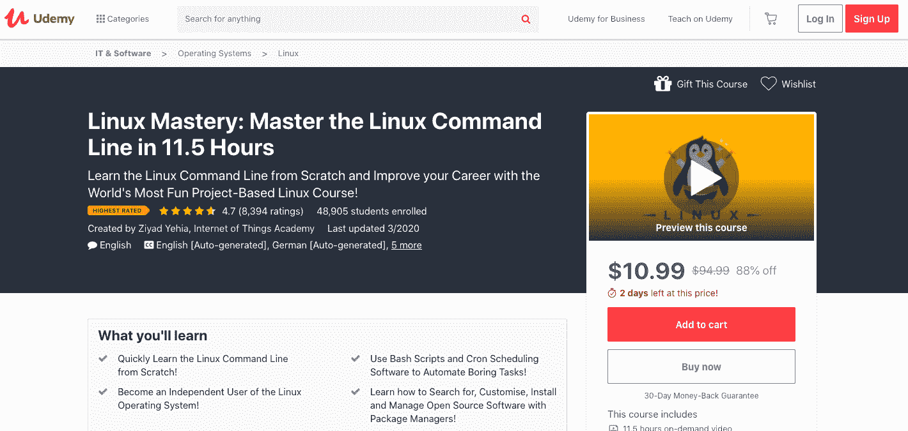
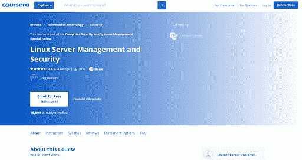
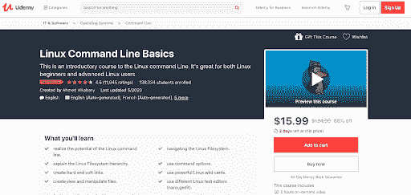
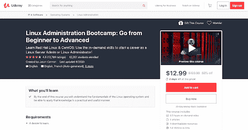
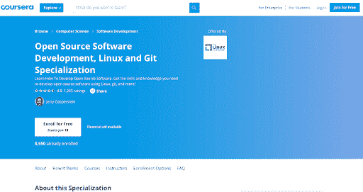
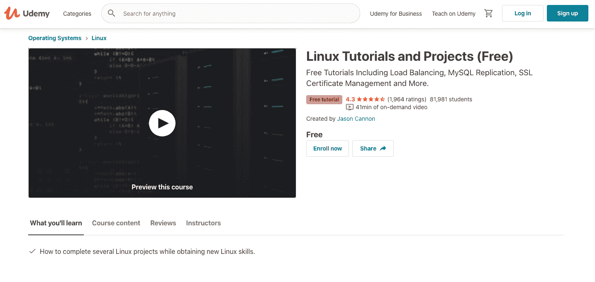
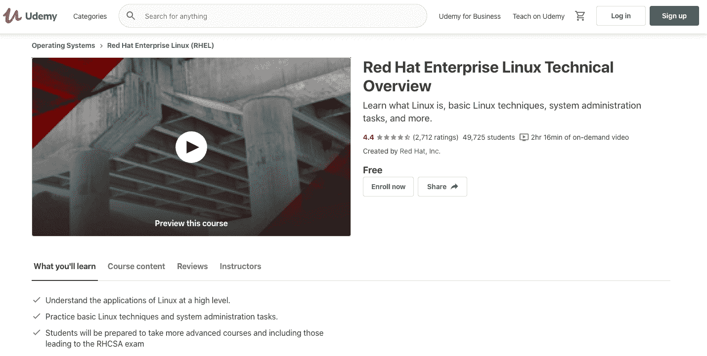
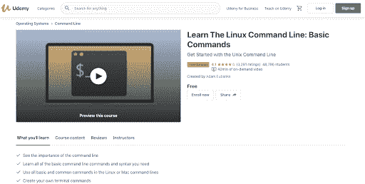
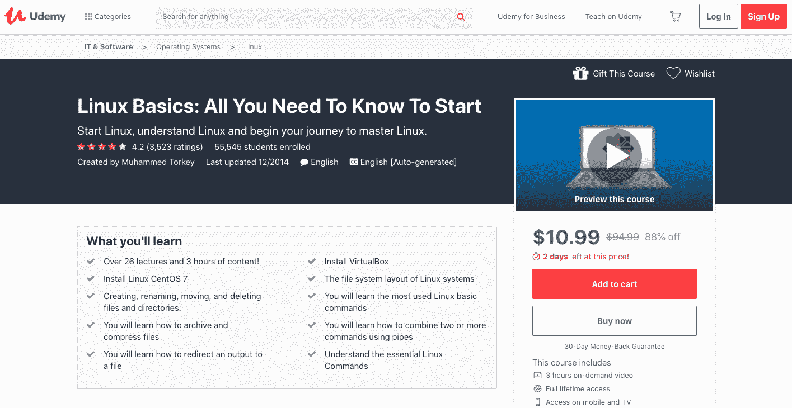

# 2023 年十大 Linux 初学者课程[更新]

> 原文：<https://hackr.io/blog/best-linux-courses>

什么风把你吹来了？你是一个想学习 Linux 基础知识的 Linux 新用户，还是一个想成为 Linux 系统管理员的人？无论你的最终目标是什么，学习 Linux 都是旅程的一部分。这里有最好的 Linux 课程，可以帮助你开始你的旅程。

## **顶级 Linux 课程**

[****](https://click.linksynergy.com/deeplink?id=jU79Zysihs4&mid=39197&murl=https://www.udemy.com/course/linux-mastery/)

这是一门非常棒的课程，它将会给你 Linux 操作的实践知识和经验。通过这个学习计划，您将获得成为该操作系统专家所需的技能。

本学习计划涵盖的主题集有助于学习者获得处理命令行的专业知识。此外，您还将学习用于任务自动化的 Cron Job 和 bash 脚本。

课程结构涵盖以下主题:

*   Linux 终端
*   Linux 文件系统
*   任务调度和自动化
*   软件仓库和包管理器
*   开源软件的安装和管理

这个程序中有许多测验、讲座摘要和备忘单，包含了掌握 Linux 所需的一切。它着重于通过例子、可下载资源和讲座帮助学生获得对 Linux 概念的坚实理解。

**先决条件:**不需要该学科的先验知识或经验。
**等级:**初级
**等级:** 4.7
**时长:** 11.5 小时(大概)

你可以在这里注册。

该认证是了解文件系统管理和安全系统的理想选择。求职者、专业人士和学生应该参加这门课程，以了解 Linux 操作系统的行业垂直领域。

课程大纲涵盖的主题:

*   Linux 系统管理-简介
*   在企业中配置 Linux
*   Linux 环境中的用户、授权和认证
*   在企业中保护 Linux

除了上述主题，本课程还提供了探索 Linux 认证和机器机制的机会。本课程增加的练习、讲座、测验、视频和其他补充材料使概念学习变得更加容易。在本课程结束时，学生将处理一个真实世界的项目，以测试他们通过学习项目获得的知识和技能。

**先决条件:**需要基本的 Linux 概念知识。
**等级:**中级
**等级:** 4.6
**时长:** 12 小时(大约)

你可以在这里注册。

这个入门课程是为初学者和高级 Linux 学习者设计的，是学习 Linux 命令行技术的绝佳机会。从 Linux 命令控制台到像创建 Linux 命令这样的高级概念，教学大纲中增加了很多东西。

通过该计划教授的广泛主题包括:

*   Linux 文件系统导航
*   Linux 文件系统层次结构
*   命令选项使用
*   创建软链接和硬链接
*   Linux 通配符使用
*   操作、查看和创建文件
*   Linux 文本编辑器使用
*   Linux 命令行的使用

这个课程是为任何想提高他们的 Linux 命令行知识的人准备的。期待转换到 Linux 的 Mac 或 Windows 用户可以从这个项目中获得一些好处。它有几个可供下载的资源和文章，便于学习。

**先决条件:**在你的 PC 上安装 Linux 发行版。另外，学习者应该对学习这个操作系统充满热情。

**等级:**初级-高级
**等级:** 4.5
**时长:** 5 小时(约)

你可以在这里注册。

[****](https://click.linksynergy.com/deeplink?id=jU79Zysihs4&mid=39197&murl=https://www.udemy.com/course/learn-linux-in-5-days/)

本教程旨在帮助学生获得使用 Linux 平台所需的专业知识和技能。Jason Cannon 的想法最适合学习与主题相关的概念和命令。

它涵盖了现实生活和实际的例子，使学习者可以快速掌握教学大纲。所有的技术都用简单的语言解释。这个程序提供了在 Linux 系统上安装 WordPress 的一步一步的指导和点播视频。另外，你将获得在 Linux 上运行 WordPress 所需软件的知识。

本课程主要涵盖以下主题:

*   Linux 发行版
*   SSH 简介
*   Linux 文件系统布局
*   基本 Linux 命令
*   列出、编辑、复制和删除文件
*   数据传输和文件压缩过程
*   Shell 提示定制
*   使用 Cron 来调度和自动化任务
*   切换用户

学习这门课程后，学习者可以使用 WordPress 和软件安装所需的命令。此外，您将通过分步指南了解重要的 Linux 操作。有几个练习可以帮助学生巩固和检验他们在这个学科中的知识。

每个话题都有例子。此外，本课程详细的指南和精心制作的学习资源是获得 web 服务器安装、数据库服务器安装、Word press 配置技能等的最佳途径。本课程的讲座、文章和可下载资源允许学生在有限的时间内学习概念。

**先决条件:**对之前的学科知识没有要求。
**等级:**初学者
**等级:** 4.5
**时长:** 5.5 小时(大概)

你可以在这里注册。

[****](https://click.linksynergy.com/deeplink?id=jU79Zysihs4&mid=39197&murl=https://www.udemy.com/course/learn-linux-in-5-days/)

这个流行的 Udemy 课程最适合学习 CentOS 和红帽 Linux。梦想担当 Linux 管理员和 Linux 服务器管理员角色的个人应该去做。通过这个学习项目，您将理解 Linux 服务器管理。

最好的部分是你将着手解决问题并获得这方面的实践经验。本课程将帮助您学习配置和维护不同 Linux 系统的技术。当个人担任 Linux 系统管理员或 Linux 系统工程师时，这些技能就派上了用场。

该计划有助于学习:

*   Linux 发行版
*   SSH 的使用
*   Linux 系统文件系统布局
*   [基本 Linux 命令](https://hackr.io/blog/basic-linux-commands)
*   创建、移动和重命名目录
*   emacs、vi 和 nano 编辑器的使用
*   压缩文件
*   切换用户
*   Linux 服务器引导过程
*   逻辑卷管理器
*   Sudo 配置
*   Linux shell 脚本

从基础课程到复杂的系统和命令，这个完整的课程设计得很好，有不同的部分。大学生、研究人员、教授和其他类似角色的个人可以参加这个课程来丰富他们在 Linux 服务器方面的知识。学习计划中的文章和点播视频功能将使您成为一个专业的 Linux 系统。

**先决条件:**不需要任何 Linux 命令行方面的知识或经验。
**等级:**初级-高级
**等级:** 4.5
**时长:** 8.5 小时(大概)

你可以在这里注册。

[****](https://click.linksynergy.com/deeplink?id=jU79Zysihs4&mid=40328&murl=https://www.coursera.org/specializations/oss-development-linux-git)

这是一个令人难以置信的 Linux 认证培训项目，帮助开发人员巩固他们的 Linux 基础。这个免费的 Coursera 教程允许个人获得开源开发方面的专业知识，以及对 Linux 系统的良好解释和知识。本课程分为四个部分。

通过该计划，参与者将了解:

*   开源开发
*   分布式开发
*   标准 Linux 工具
*   饭桶

课程材料旨在让新手牢记在心。他们可以很快地学习概念并巩固他们在 Linux 系统中的基础。然而，该课程具有免费注册的优势，但学习者必须支付象征性的认证费用。完美布置的测验、视频教程、编程练习和作业让参与者受益匪浅。

**必备条件:**学习者必须具备计算机基础知识。常用命令和 Linux 外壳将是一个加号。
**等级:**初级
**等级:** 4.5
**时长:** 4 个月(大概)

你可以在这里注册。

[****](https://click.linksynergy.com/deeplink?id=jU79Zysihs4&mid=39197&murl=https://www.udemy.com/course/linux-tutorials/)

这是 Jason Cannon 教授的另一门顶级免费 Linux 课程，Jason Cannon 是一名 It 专业人员，拥有超过 25 年的 Linux 和 Unix 系统工程师工作经验。这个奇妙的学习项目将让你接触到这个主题的真实世界。

本课程涵盖以下领域:

*   负载平衡
*   SSL 证书管理
*   MySQL 复制

教程还附带了与 Linux 相关的实践练习，比如 Apache 和 CentOS Linux 上的 SSL 证书安装方法，HTTP 负载均衡，Ubuntu Linux 上的 MySQL 主从复制配置等等。这个程序的 l 练习是为了帮助个人建立一个坚实的 Linux 基础而创建的。

**先决条件:** Linux 系统访问是强制性的
**等级:**中级
**等级:** 4.4
**时长:** 41 分钟(大约)

你可以在这里注册。

[****](https://click.linksynergy.com/deeplink?id=jU79Zysihs4&mid=39197&murl=https://www.udemy.com/course/red-hat-enterprise-linux-technical-overview/)

这个由 Red Hat Enterprises 推出的 Linux 课程可以让学习者获得 Linux 基础的技术知识。这是一个免费的培训课程，它还将帮助您演示 Linux 系统管理中使用的主要技术。架构师、IT 专家、工程师、管理员和希望深入了解该操作系统的学生可以从本课程中受益匪浅。

本学习计划的演示和简短讲座包括:

*   开源开发模式
*   Linux 发行版
*   Linux 内核
*   壳
*   文件层次结构
*   用户空间
*   编辑文本文件
*   命令行网络配置
*   控制系统启动过程

学完这个免费的 Linux 课程后，你会对 Linux 操作系统有很好的理解。借助 Red Hat Enterprise Linux，您可以轻松访问所需的工具，以实现企业基础设施的现代化，并通过虚拟化和标准化增强工作能力。

**先决条件**没有正式的教育要求，但之前的操作系统管理经验将有助于自然学习。
**等级:**初学者
**等级:** 4.3
**时长:** 2 小时(大约)

你可以在这里注册。

[****](https://click.linksynergy.com/deeplink?id=jU79Zysihs4&mid=39197&murl=https://www.udemy.com/course/command-line/)

希望获得 UNIX、Ruby on Rails、Django 等定制技能的 Linux/Mac 用户和开发人员应该参加这个课程。这是一个快速学习指南，它将为您提供系统管理、文件管理和进程管理中使用的必要 Linux 命令的详细概述。

该计划主要涵盖以下主题:

*   命令行的重要性
*   命令行的语法
*   Mac 或 Linux 命令行中的基本命令
*   创建终端命令

其易于理解的内容使初学者可以毫无困难地学习复杂的命令行概念。添加到此学习计划中的分步指南向学生传授了使用命令行的技巧。

最好的部分是你不必处理不必要的，枯燥的东西，否则会添加到 Linux 课程中。综上所述，你可以快速学会创建你的命令行，夯实你在学科上的基础。

**先决条件:**通过该程序学习概念时，命令行的基本知识将会受益。
**等级:**初级-中级
**等级:** 4.2
**时长:** 40 分钟(大约)

你可以在这里注册。

[****](https://click.linksynergy.com/deeplink?id=jU79Zysihs4&mid=39197&murl=https://www.udemy.com/course/introduction-to-linux-centos-7/)

它是最好的入门课程之一，涵盖了基础知识、历史和其他与 Linux 相关的主题。该程序还将向您介绍一组 Linux 命令和 Linux 发行版，如 Ubuntu、CentOS、Fedora 和 RedHat。此外，您还将了解设置测试实验室的技巧和诀窍，以便使用 CentOS 和 VirtualBox 运行 Linux 命令。

下面列出了本课程涉及的主要主题:

*   Linux 简介
*   Linux 历史
*   Linux 发行版——详细概述
*   安装 Virtualbox
*   Linux 文件系统层次结构
*   Linux 基本命令
*   安装 Linux

这个 Udemy 认证课程提供了 Linux 命令的实践经验。您将学习创建和移动目录和文件的方法、文件压缩和实现技术。另外，它还讲述了组合不同命令的方法。

**先决条件:**无，除了一台 PC 和优质耳机。
**等级:**初学者
**等级:** 4.1
**时长:** 3 小时(大约)

你可以在这里注册。

## **结论**

这就是最流行的在线 Linux 培训项目。然而，值得注意的是，由于其多样化的应用，有大量的最佳 Linux 课程可供选择。上面的列表可能不是包罗万象的，但是获得上面提到的任何一个专业都会提升你在这个领域的成功水平。这个列表中包括的付费和免费的 Linux 学习项目将帮助你获得行业标准的 Linux 证书。

如果你正在找工作或在你目前的职位上成长，获得一个 Linux 认证会很有价值。

**人也在读:**