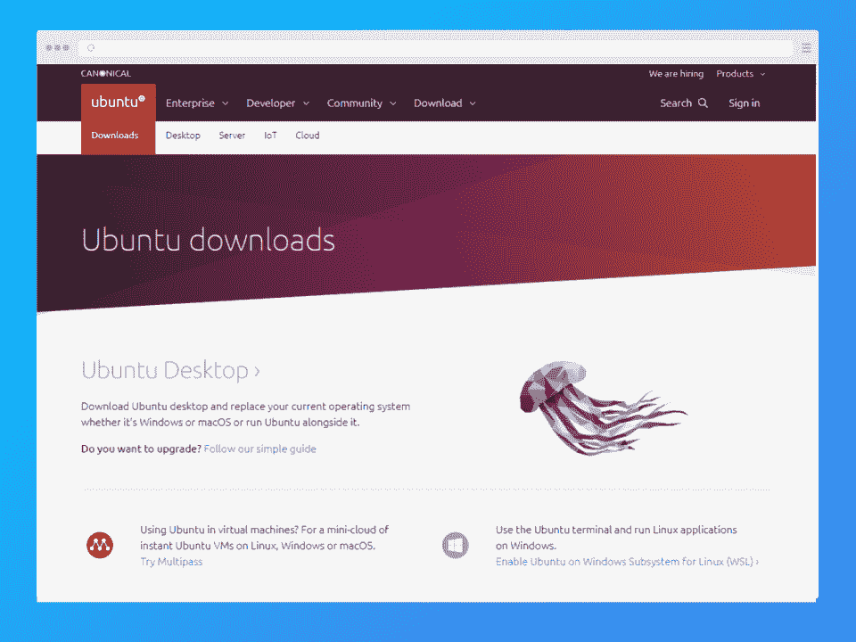
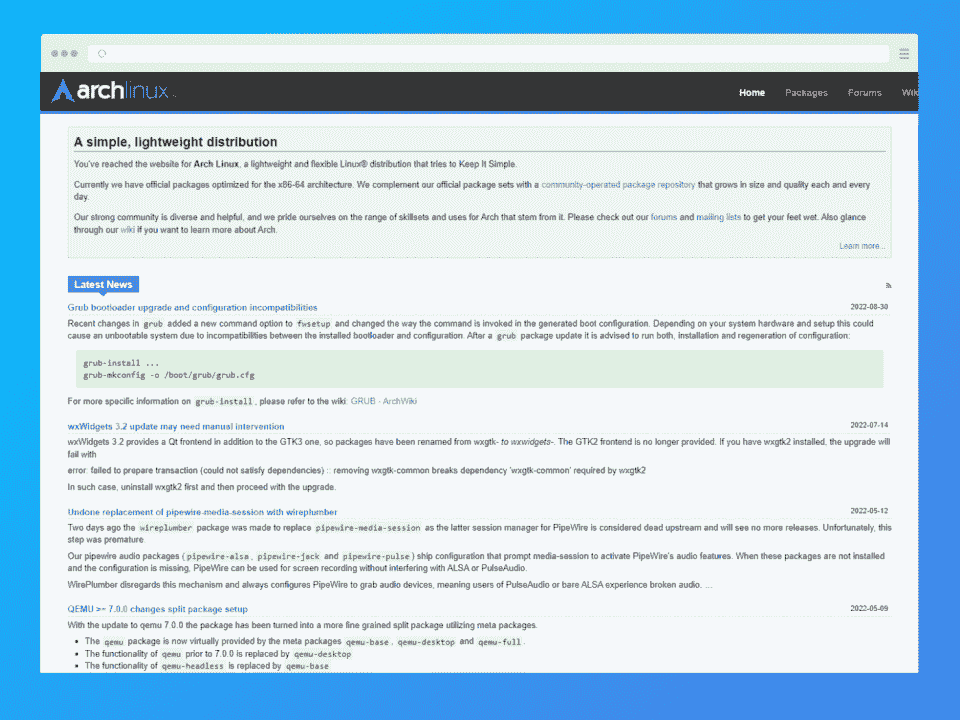
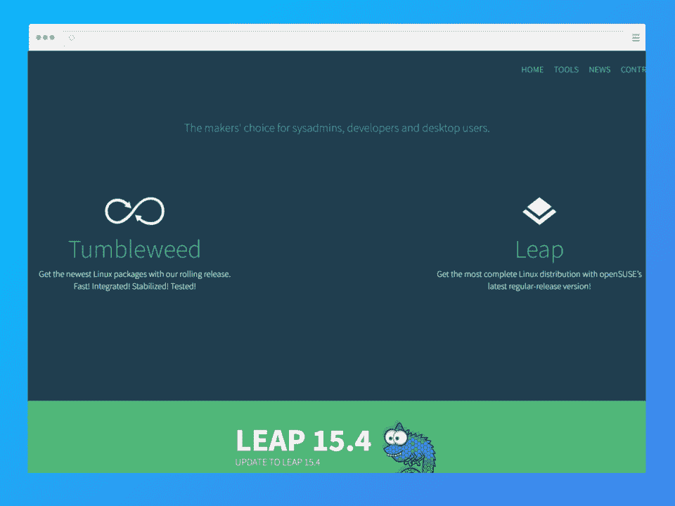
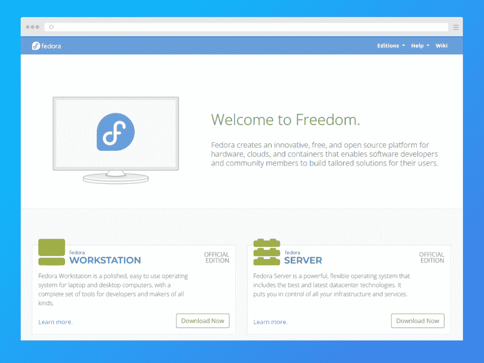
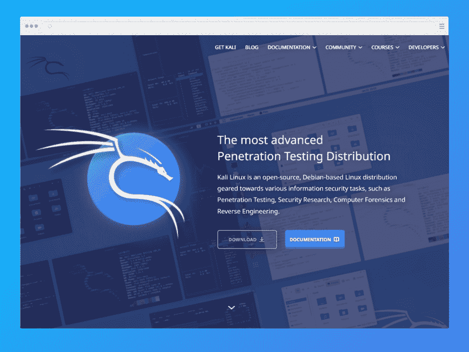

# 最佳编程 Linux 发行版:排名前 6[2023]

> 原文：<https://hackr.io/blog/best-linux-distro-for-programming>

Linux 内核是许多其他操作系统的开源基础，因为任何人都可以使用、修改或出售它的衍生物。

Linux *发行版*由 Linux 内核和运行于其上的各种工具组成，为用户提供了广泛的功能。也就是说，Linux 发行版通过将代码编译到一个操作系统中来简化安装，从而帮助您节省时间。

许多雇主仍然需要知道如何使用 Linux 的有才华的程序员——难怪组织不断发布关于 Linux 的认证项目！但是对于编程来说哪个是最好的 Linux 发行版呢？

今天，我们将深入探讨 Linux 发行版如何帮助程序员，利弊，以及选择最适合您需求的发行版的技巧。

这里有一个我们将比较的 Linux 发行版的快速列表:

*   人的本质
*   曼哈罗
*   Arch Linux
*   openSUSE
*   一种男式软呢帽
*   卡利林克斯

## **什么是 Linux？**

和 Windows、macOS 一样，Linux 也是一个操作系统。意思？它有助于平衡系统的硬件和软件交互和连接。许多程序员和公司喜欢使用 Linux，因为它是开源的。

例如，纽约证券交易所运行的是 Liunx 操作系统。

每个 Linux 内核都涉及来自至少 100 个不同组织的 1000 多人的工作。内核是 Linux 发行版的一个很小的组件，仅在过去的两年里，就有来自 200 家公司的 3200 多人做出了贡献。

## **什么是 Linux 发行版？**

Linux 发行版是一个操作系统，由来自不同程序员和项目的各种组件组成。每个 Linux 发行版都包含以下内容:

*   Linux 内核
*   界面(基于图形或文本)和 [Linux 命令](https://hackr.io/blog/basic-linux-commands)
*   包装管理系统
*   安装程序
*   x 服务器
*   升级型号
*   补充软件
*   预装应用程序

当然，尽管共享相同的 Linux 内核，不同的发行版有不同的外观、行为和性能水平。

## 对于编程来说，什么是好的 Linux 发行版？

下面是一些使 Linux 发行版适合编程的一般特性:

*   流行:用于编程的最好的 Linux 发行版应该被广泛使用——这使得开发者和程序员更容易快速地识别和纠正问题。

*   稳定和安全:用于编程的可靠的 Linux 发行版必须允许程序员协作，而不会因为未经授权的访问而危及安全性。此外，他们应该有足够的能力来控制各种服务器实例，而不会牺牲性能。

*   定期更新:一个可编程的 Linux 发行版应该提供频繁的更新，让用户了解最新的特性

### **如何选择最好的 Linux OS 进行编程？**

尽管如此，您可能需要更具体的标准来确定在您独特的场景中用于编程的最佳 Linux 发行版。让我们根据用例来看看一些顶级发行版。

*   **软件工程:**如果你想创建服务器，选择 Debian，Ubuntu，或者 RedHat/CentOS。这些发行版的稳定性和功能使它们成为软件工程的热门选择。

*   **硬件工具:** Gentoo、Slackware 和从零开始的 Linux 是硬件工具的理想选择，包括驱动程序构建和嵌入发行版。

*   初学者: Ubuntu 拥有用户友好的界面和定期更新，非常适合初学者。Linux Mint 也适合。

*   **Raspberry Pi:** 专用的 Linux 发行版 Rasbian 非常适合使用 Raspberry Pi 的程序员。

还需要更多细节吗？不要担心，我们将帮助您确定最适合编程的 Linux。请继续阅读，深入了解每个发行版。

## **最佳编程 Linux 发行版:回顾**

我们将探究每个发行版的历史、用途、优缺点和系统需求。

### **1。[Ubuntu](https://ubuntu.com/download)——最适合初学者**

[****](https://ubuntu.com/download)

南非和英国企业家马克·舒托沃尔斯在 2004 年创建了 Canonical，并发布了初学者友好的 Ubuntu，其 Linux 内核只有一个命令行界面，没有应用程序。

Ubuntu 增加了一个存储库，一个存储可下载和可安装软件的网站。

在 [Linux](https://hackr.io/blog/unix-vs-linux) 上，你可以获得同样的程序，但是你必须下载源代码，自己组装，然后安装。其他基地也有，包括 fedora 和 arch。Ubuntu 和 Linux mint，一个基于 Ubuntu 的发行版，被认为是几个可用的 Linux 变种中最简单和最用户友好的版本。

可用的桌面环境包括 GNOME、Xfce、LXQT、LXDE、KDE、budgie、mate、cinnamon 和 deepin。除了 Gnome 的修改版自带的 Ubuntu，还可以获得 Kubuntu 或者 Lubuntu。Kubunti 使用 KDE 桌面环境，而 lubuntu 使用 LXQT 桌面。最后，你也可以使用 XFCE 的 Xubuntu。

#### **优点**

*   兼容性方面有很多变化，包括 Ubuntu 服务器添加、Ubuntu Studio、Edubuntu、Kubuntu、Xubuntu 和 JeOS。

*   左侧启动器允许轻松启动程序

*   键盘快捷键可以轻松定位应用程序和文件

*   桌面上出色的音频、视频和摄影镜头集成

#### **缺点**

*   传统的老技术

*   不如其他操作系统稳定，对硬件缺陷敏感。

*   与现代视频游戏不兼容(需要降低图形质量的模拟器)

*   与 MP3 文件不兼容

*   需要自行安装

*   对于习惯 Windows 或 macOS 的用户来说是一个挑战

#### **系统要求**

*   CPU: 1 千兆赫或更高
*   RAM:1gb 或更多
*   磁盘:最少 2.5 千兆字节

**评级:** 8/10

[拿到这里。](https://ubuntu.com/download)

[****](https://manjaro.org/)

Manjaro 本质上是一个更加用户友好的 Arch Linux 版本。它易于操作，只需有限的安装工作。

这个发行版在 Manjaro 中默认包含了 Pamac 和 Octopi，允许用图形用户界面安装软件。我们的份额？Manjaro 是开发人员最好的 Linux 发行版，因为它有许多可定制的工具。有些人还说，特别是对于中级程序员来说，它是最好的 Linux。

用 Manjaro 安装专有驱动程序并不太难，因为它可以快速检测硬件。Manjaro 面向所有人，包括希望完成工作的普通用户或寻找高效环境的开发人员。

#### **优点**

*   基于 Arch Linux，这是最古老、最受欢迎的 Linux 发行版之一

*   具有滚动更新的简单单一安装

*   兼容英伟达 Optimus 技术。

*   有 GUI 来管理内核。

*   提供额外构建的包的存储库

#### **缺点**

*   不是面向服务器的操作系统
*   不是像卡莉或 RHEL 那样的专业操作系统

#### **系统要求**

*   2GB 内存
*   30 GB 的硬盘空间
*   最低 2 GHz 处理器
*   高清显卡和显示器
*   稳定的互联网连接

**评级:** 9/10

[拿到这里。](https://manjaro.org/)

[完成 Linux 培训课程，获得梦想中的 2023 年 IT 工作](https://click.linksynergy.com/deeplink?id=jU79Zysihs4&mid=39197&murl=https%3A%2F%2Fwww.udemy.com%2Fcourse%2Fcomplete-linux-training-course-to-get-your-dream-it-job%2F)

### **3。[Arch Linux](https://archlinux.org/)——最适合高级程序员**

[****](https://archlinux.org/)

大多数知名的 Linux 发行版都提供了一个图形化或基于 curse 的安装程序，而 Arch 只是提供了以下脚本集合:

*   wifi-用于连接 wifi 的菜单命令
*   (c)fdisk
*   (c)用于分区的 gdisk
*   用于远程安装的 SSH 守护进程(非常适合在 ArchWiki 打开的情况下从另一台计算机安装)
*   arch-install-scripts 包的内容

它的安装程序光盘包含帮助系统安装的工具，如 pacstrap、genfstab 和 arch-chroot。

Pacstrap 向指定的挂载点和已安装的软件包添加一个基本的系统层次结构。Genfstab 基于指定根挂载下当前挂载的卷创建一个 fstab(负责在新系统上挂载 proc、dev 和其他卷，以便您可以继续配置)。

#### **优点**

*   滚动发布保证了最新的稳定软件。

*   易于维护和出色的稳定性

*   针对每个应用程序的全面说明，包括摘要、安装、配置和故障排除

*   简单的配置，没有任何导致系统故障的奇怪向导

*   可访问的第三方用户包存储库

#### **缺点**

*   安装速度慢，步骤多

*   不包括附件，尽管手册建议使用软件

#### **系统要求**

*   至少 1GB 内存和 20GB 可用硬盘空间
*   互联网连接
*   一张空白 DVD 和刻录它所需的硬件和软件
*   或者，一个至少有 2GB 可用空间的 USB 驱动器

**评级:** 8.5/10

[拿到这里。](https://archlinux.org/)

### **4。 [openSUSE](https://www.opensuse.org/) -最适合系统管理员**

[****](https://www.opensuse.org/)

Novell 在 2003 年收购 SuSE Linux AG 后开发了 openSUSE。OpenSUSE 支持 GNOME 和 KDE 桌面环境，为系统管理员和开发者提供可靠的支持。

#### **优点:**

*   用户决定他们自己的服务器或桌面外观

*   每个版本都有大量的可用代码)

*   对于不关心版本交付计划的系统管理员的自主权

*   易于从上游下载最新版本

*   在线建设服务有许多针对各种利基主题的“附加服务”

*   易于修改和分发修改，无需大量带宽

*   能够使用 SUSE 的 OBS 为任何发行版构建任何硬件

#### **缺点:**

*   如今有限的文件

*   有些人遵守非常严格的欧盟和非 GPL 法规。

#### **系统要求**

*   奔腾 4 2.4 GHz 或更高，或者推荐任何 AMD64 或 Intel64 处理器
*   主内存:建议 2 GB
*   硬盘:建议 40 GB 或更大

**评级:** 9.5/10

[拿到这里。](https://www.opensuse.org/)

### **5。[Fedora](https://getfedora.org/)——最适合服务器程序员**

[****](https://getfedora.org/)

Fedora 是一个广受欢迎的发行版，有许多版本，包括桌面工作站版、物联网版，当然还有服务器版。Fedora 是对希望尝试基于 Debian 和 Ubuntu 发行版之外的东西的新手的一个常见建议。

它类似于 RHEL 和 CentOS，两个最广泛使用的服务器发行版。人们经常使用 Fedora 作为他们的主要操作系统，并作为连接 RHEL 和 CentOS 的桥梁。

**评级:** 8/10

#### **优点**

*   较新的内核版本提供了更好的硬件支持

*   最新的 Gnome 3 外壳

*   令人惊讶的百胜依赖管理

*   类似 Windows' Yum 的后台更新。

*   提供了一瞥红帽的过程

#### **缺点**

*   依赖其他存储库，如 rpm fusion，以获得最基本的软件(Skype、flash 等)。)

*   可用性不如其他发行版令人印象深刻

*   多媒体播放和 flash 如果不进行一些修补是无法工作的

*   F20 中的软件中心不稳定且运行缓慢

#### **系统要求**

*   2GHz 双核处理器或更快。
*   2GB 系统内存。
*   15GB 未分配的驱动器空间。

**评级:** 8/10

[拿到这里。](https://getfedora.org/)

### **6。[Kali Linux](https://www.kali.org/)——最适合安全程序员**

[****](https://www.kali.org/)

Kali Linux(以前的 BackTrack Linux)建立在 Debian 操作系统上，设计用于复杂的渗透测试和安全审计——对网络安全程序员来说是完美的组合。它的许多工具都面向信息安全活动，包括逆向工程、计算机取证、渗透测试和安全研究。

#### **优点**

*   包括 600 多种穿刺器械

*   遵循传统的文件系统结构

*   支持多种语言

*   兼容各种无线设备

*   对那些具有基本 Linux 背景的用户友好

*   导航、下载文件和运行程序的单一位置

#### **缺点**

*   不允许您将任何内容保存到硬盘

*   面向渗透，对初学者来说很难

#### **系统要求**

*   2 GB 内存
*   20 GB 的磁盘空间
*   速度为 2 GHz 或更快的 32 位或 64 位 CPU(单核)
*   高清显卡和显示器
*   宽带互联网连接

**评级:** 7.5/10

[拿到这里](https://www.kali.org/)

## **结论**

底线？用于编程的最佳 Linux 发行版取决于您独特的项目和经验水平。

Arch Linux、Debian、Kali Linux 和 Fedora 是用于编程的流行发行版。

有些更加用户友好，而有些在使用前需要丰富的经验。在做出选择之前，仔细考虑每个发行版的优缺点。

有兴趣学习更多关于 Linux 发行版的知识吗？

**[上 Linux 课程](https://hackr.io/blog/best-linux-courses)**

## **常见问题解答**

#### **1。哪个 Linux 最适合编程？**

Ubuntu 最适合初学程序员，Debian、Kali Linux、Fedora 最适合有经验的程序员。

#### **2。哪个 Linux 最适合 Python 编程？**

所有的 Linux 发行版都同样适用于 Python 编程。不过，如果你是程序员新手，可以选择 Ubuntu。

#### **3。初学编程用哪个 Linux 发行版最好？**

Ubuntu 简单的界面使它成为初学者最好的 Linux 发行版。

#### **4。哪个 Linux 最适合 C++？**

所有的 Linux 发行版都同样适用于 C++编程。但是，Ubuntu 最适合初学程序员。

#### **5。哪种 Linux 操作系统最快？**

Puppy OS 是最快的 Linux 发行版。