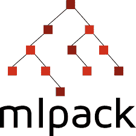
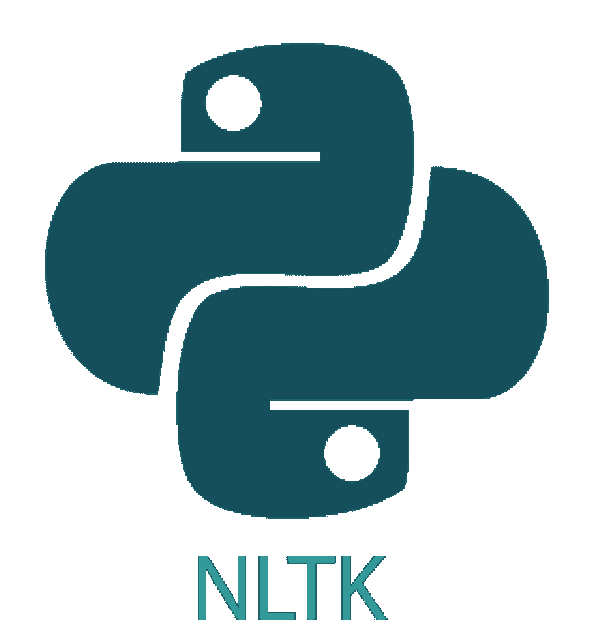
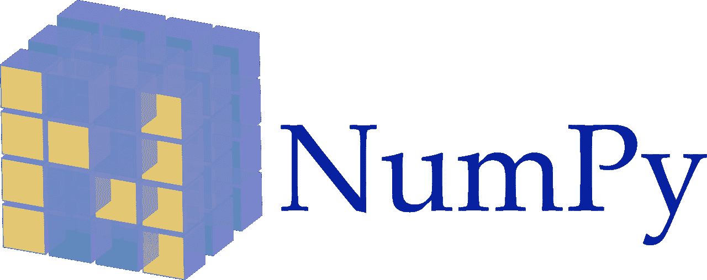
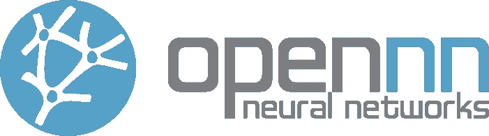
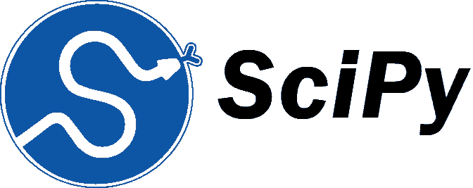

# 2023 年你应该知道的 15 个最好的机器学习库

> 原文：<https://hackr.io/blog/best-machine-learning-libraries>

机器学习或 ML 是人工智能的一部分，它赋予机器学习的能力，并使它们能够自我改进，这是阿瑟·塞缪尔(Arthur Samuel)在 1959 年首先创造的。

有了 ML，开发者可以训练机器从他们自己的经验中学习，而不需要显式地编程来做上述的事情。为了使用机器学习完成这么多，我们有一系列的框架、工具(套件)、模块、库等等。我们将在这里集中讨论 ML 库。

## **机器学习库**

典型地，ML 库是随时可用的函数和例程的汇编。一套健壮的库是开发人员研究和编写复杂程序时不可或缺的一部分，同时也避免了编写大量代码。

库让开发人员不必一遍又一遍地编写多余的代码。此外，还有各种各样的库来处理不同的事情。例如，我们有文本处理库、图形库、数据处理和科学计算。

随着机器学习不断赋予人类新的可能性，拉拢新人，数百个 ML 库也有了积极的发展。不过，并不是所有的都很棒。然而，好消息是他们中的几个是。

接下来，我们将讨论全球机器学习爱好者和专业人士首选的 15 个最佳机器学习库。

附:这篇文章严格限制于解释 ML 库！因此，没有模块和包。例如， [statsmodels](https://www.statsmodels.org/stable/index.html) 是实现统计学习算法和时间序列建模的极其有效的 ML 选项；但是，它是一个包，而不是一个库。

### **1。犰狳**

写于:C++
自:不适用
开发者:澳大利亚 NICTA 研究中心和独立贡献者
用于:线性代数和科学计算

Armadillo 使用 C++编程语言实现，是一个线性代数库，用于实现科学计算的目的。除了机器学习，犰狳还在以下领域找到了用途:

*   生物信息学，
*   计算机视觉，
*   计量经济学，
*   模式识别，
*   信号处理，以及
*   统计学。

Armadillo 的特点是延迟评估方法，这是通过模板元编程实现的，用于将许多操作组合成一个统一的操作。这减少甚至消除了对临时人员的需求。

Armadillo 库提供了类似 MATLAB 的功能和高级语法。该库适合用 C++开发 [ML 算法](https://hackr.io/blog/machine-learning-algorithms)。它还能够将研究代码快速实施到生产就绪环境中。

#### **亮点**

*   自动使用 OpenMP 多线程加速计算密集型操作。
*   平衡易用性和速度。
*   附带一个简单易用的界面。
*   为以下各项提供支持:

*   统计学和三角函数的子集，
*   复数，
*   浮点数(单精度和双精度)，
*   整数，和
*   稀疏矩阵和密集矩阵。

*   通过与 ARPACK、ATLAS 和 LAPACK 集成，支持多种矩阵分解。

### **2。发现**

写于:C
自:2003 年 11 月 开发者:Steffen Nissen(原创)，几位合作者(现)
用于:开发多层前馈人工神经网络

FANN 是人工神经网络的首字母缩写。顾名思义，开源的机器学习库有助于开发神经网络，具体来说就是多层前馈人工神经网络。

用 C 编程语言编写，FANN 提供了对完全连接和稀疏连接神经网络的支持。自 2003 年问世以来，机器学习库已被广泛用于以下领域的研究:

*   航空航天工程，
*   AI，
*   生物学，
*   环境科学，
*   遗传学，
*   图像识别，以及
*   机器学习。

FANN 是一个非常易于使用的库，并附有全面、深入的文档。它适用于反向传播训练以及进化拓扑训练。

#### **亮点**

*   提供多种图形用户界面，例如:

*   敏捷神经网络，
*   FANNTool，以及
*   神经观。

*   能够使用定点数和浮点数。
*   可用于 20 多种编程语言和技术的绑定，包括:

*   C#，
*   二郎，
*   去吧，
*   草，
*   Java，
*   Lua，
*   MATLAB，
*   NodeJS，
*   PHP，
*   Python，
*   r 和
*   铁锈。

*   具有将训练好的人工神经网络存储为。net 文件。这允许更快地保存和加载人工神经网络以备将来使用。
*   支持单层和多层网络的跨平台执行。

**推荐课程**

[机器学习 A-Z:数据科学中的 Python&R](https://click.linksynergy.com/deeplink?id=jU79Zysihs4&mid=39197&murl=https%3A%2F%2Fwww.udemy.com%2Fcourse%2Fmachinelearning%2F)

### **3\. Keras**

写于:Python
自:2015 年 3 月
开发者:Franç ois Chollet(原创)、各种(现)
用于: 深度学习

Keras 是一个开源库，可以在 CPU 和 GPU 上高效运行。它用于深度学习，特别是神经网络。流行的 ML 库与神经网络的构建块一起工作，例如:

*   激活功能，
*   层，
*   目标，以及
*   优化者。

除了标准的神经网络，Keras 还支持卷积和递归神经网络。ML 库还打包了大量处理图像和文本图像的特性。

#### **亮点**

*   可以在以下基础上运行:

*   微软认知工具包(CNTK)，
*   PlaidML，
*   r，
*   张量流，以及
*   提亚诺。

*   支持深度神经网络的快速实验。
*   它为简化深度学习模型的开发提供了一套高级、直观的抽象。
*   极好的社区支持。
*   TensorFlow 核心库中提供的支持。

### **4。Matplotlib**

写于:Python
自:2003
开发者:John D. Hunter(原创)、Michael Droettboom 等人(现)
用于:[数据可视化](https://hackr.io/blog/what-is-data-visualization)和绘图

Matplotlib 是一个 ML 库，用于通过 2D 绘图产生一系列格式的出版就绪的图形、图像和绘图。仅使用几行代码，Matplotlib 库就可以生成详细、高质量的:

*   条形图，
*   误差图表，
*   直方图，
*   散点图等。

虽然 Matplotlib 相当用户友好，但是习惯于 MATLAB 界面的用户会发现它甚至更容易上手，尤其是使用 pyplot 模块。ml 库提供了一个面向对象的 API，使用 GTK+、Qt 和 wxPython 等标准 GUI 工具包在应用程序中嵌入图形和绘图。

#### **亮点**

*   大量的文件。
*   出色的社区支持。
*   使用许多工具包进行功能扩展，包括:

*   卡通，
*   Excel 工具，
*   GTK 工具，以及
*   Qt 接口。

*   定制程度越高。
*   SciPy 使用 Matplotlib。

### **5。mlpack**

写于:C++
自:2008 年 2 月
开发者:佐治亚理工学院和 mlpack 社区
用作:软件库

mlpack 建立在流行的线性代数库 Armadillo 之上，是一个强调易用性、可伸缩性和速度的 ML 库。mplack 库的主要目的是提供一种可扩展的、快速的、灵活的方法来实现 ML 算法。

虽然是针对 C++的，但 mlpack 的绑定也适用于 Go、Julia、Python 和 R 编程语言。它还具有简单的命令行程序和 C++类，可以集成到大规模的 ML 解决方案中。

#### **亮点**

*   适合初学者。
*   高质量的文档。
*   通过利用 C++功能，为高级用户提供最大的灵活性和性能。
*   为广泛的 ML 算法和模型提供支持，包括:

*   协同过滤，
*   密度估计树，
*   欧几里德最小生成树，
*   高斯混合模型(GMM)，
*   k-均值聚类，
*   逻辑回归，
*   朴素贝叶斯分类器，
*   稀疏编码和稀疏字典学习和
*   基于树的范围搜索。

*   通过为 GRU 和 LSTM 结构提供模板类来支持递归神经网络。
*   该绑定系统可扩展到其他编程语言。

### **6 号。NLTK**

编写于:Python
自:2001
开发者:Steven Bird、Edward Loper、Ewan Klein(原创)、团队 NLTK(现) 用于:文本处理

NLTK 代表 **N** 自然 **L** 语言 **T** 工具 **k** it。顾名思义，它是一个用于 NLP 任务的 Python 库，比如语言建模、命名实体识别和神经机器翻译。机器学习库满足所有文本处理需求，包括:

*   分块，
*   依存解析，
*   词汇化，
*   词干，和
*   单词标记化。

有趣的是，NLTK 不仅仅是一个单独的 ML 库，而是库(和程序)的集合。

#### **亮点**

*   附带一本详细介绍基本概念的书和一本食谱。
*   非常适合教育和研究。
*   N-gram 和搭配是可用的。
*   提供了一个名为 wordnet 的同义词库。
*   支持命名实体识别。

### **7。NumPy**

写于:Python
自:2006 开发者:Travis Oliphant(原创)，NumPy 社区(现)
用于:科学计算

NumPy 是数字 T2 的缩写。这个名字清楚地表明它是一个用于计算的库。使用基于 Python 的库允许开发者在涉及繁重的[矩阵运算](https://hackr.io/blog/numpy-matrix-multiplication)的科学计算中节省大量时间。

Numpy 库利用了一类特殊的数组，称为 NumPy 数组，可以在几毫秒内执行大量基于矩阵的计算。这之所以成为可能，是因为在 C 编程语言中实现了 Numpy 数组。

由于上述原因，NumPy 已经成为机器学习，尤其是自然语言处理领域最受欢迎的库/包之一。

#### **亮点**

*   能够充当任何数据类型的任何通用数据的高效多维容器。
*   具有一套详尽的高复杂性数学函数，用于处理巨大的多维数组和矩阵。
*   理想的处理傅立叶变换线性代数和随机数。
*   极好的社区支持。
*   由 TensorFlow 用于在后端操作张量。
*   集成 C、C++和 Fortran 代码的现成工具。

### **8。OpenNN**

写于:C++
自:2003 开发者:国际工程数值方法中心(原创)，Artelnics(现) 用于:高级分析和神经网络实现

OpenNN 是一个开源的机器学习库，它利用 ML 技术来解决各个领域的数据挖掘和预测分析问题。这个图书馆已经被用来处理化学、能源和工程方面的问题。

使用 OpenNN 的主要优势是它的高性能。这归功于用 C++编程语言开发的库。ML 库具有复杂的算法和实用程序来完成分类、预测、回归等等。

#### **亮点**

*   能够实现用于监督学习的任意层数的非线性处理单元。
*   使用 OpenMP 启用多处理编程。
*   它将数据挖掘算法作为一个功能包，通过 API 集成到其他软件工具中。
*   不仅仅是一个库，一个通用的 AI 软件包。

### **9。熊猫**

用 C、Cython 和 Python 编写
自:2008 年 1 月
开发者:Wes McKinney(原创)、熊猫社区(现) 用于:管理表格数据

当涉及到处理大量表格数据时，pandas 是首选的机器学习库。熊猫对于 Python 就像微软 Excel 对于 Windows 一样。ML 库将大型复杂计算所需的工作减少到仅仅几行代码。

此外，pandas 还提供了一长串预先存在的命令，这将使 ML 开发人员不必为各种数学运算添加代码。除了数据操作，Pandas 库也有助于数据的转换和可视化。pandas 库利用两种主要类型的数据结构:

*   系列(一维)，以及
*   数据帧(二维)。

使用这两者可以让开发人员处理属于工程、金融、科学、统计等领域的各种数据需求和场景。

数据科学家依靠 pandas 来减少编写样板代码的混乱，并更多地关注与手头的表格数据相关的实际问题解决方案。

#### **亮点**

*   能够有效处理:

*   任何形式的统计或观察数据集。
*   具有同质或异质数据的任意矩阵数据。
*   有序和无序时序数据。
*   具有异构数据列的表格数据。

*   出色的社区支持。
*   处理不均匀时间序列数据的卓越性能。
*   Python 中解决现实世界数据分析的首选库。
*   支持表达性、快速和灵活的数据结构，可以处理带标签的数据和关系数据。

### **10 个。小行星 T1**

写于:C++、CUDA、Python
自:2016 年 9 月
开发者:Adam Paszke、Sam Gross、Soumith Chintala、Gregory(原创)、FAIR【脸书的 AI 研究实验室】(现)
用于:深度学习

现已停业的 Torch 是 Lua 编程语言的深度学习库。脸书把它建成了一个库，这个库已经成为领先的 Python 机器学习库之一，PyTorch。这里 Py 代表 Python。

PyTorch 不像 TensorFlow 那样受欢迎，但在动态图形的执行方面胜过后者。在研究时，尤其是在使用低级 API 时，动态建模组件的能力是可取的。ML 库允许这样做。

与其他流行的机器学习库相比，PyTorch 的学习曲线比较平缓。因此，它是机器学习和数据科学初学者的合适选择。此外，该库还提供了一系列用于计算机视觉、机器学习和 NLP 的工具。

#### **亮点**

*   初学者友好的。
*   它可以对张量进行计算。
*   自定义数据加载器。
*   由脸书开发。
*   良好的社区支持。
*   多 GPU 支持。
*   一个健壮的框架，用于在移动中开发计算图，并在运行时进行更改。
*   简化的预处理器。
*   与 Python 数据科学堆栈的集成更加顺畅。

### **11\. Scikit-Learn**

用 C、C++、Cython、Python
编写自:2007 年 6 月 开发者:David Cournapeau(原创)，Inria 用于:数据预处理和建模

无论是决策树，线性回归，逻辑回归，还是支持向量机，你说得出的，Scikit-Learn 都会有。它是最流行的用于构建机器学习算法的机器学习库之一。Scikit-Learn 还展示了以下能力:

*   预处理数据，以及
*   使用 BOW、哈希矢量化、TF-IDF 等对文本进行矢量化。

Scikit-Learn 用 C 和 Python 编写，拥有一个不断增长的忠实社区，其中包括全世界的程序员、机器学习爱好者和 it 专业人员。它建立在 NumPy 和 SciPy 之上，这两个库是用于科学计算的最流行的 ML 库。

Scikit-learn 库的唯一问题是，它没有为针对大规模生产环境应用程序的分布式计算提供良好的支持。希望它能在流行的 ML 库的未来版本中得到修复。

#### **亮点**

*   它还可以用于数据分析和数据挖掘。
*   具有广泛的监督和非监督学习算法。
*   迅速增长的社区支持。
*   除了模型处理和预处理之外，ML 库还可以处理以下函数:

*   分类，
*   聚类，
*   降维，以及
*   回归。

### **12 号。SciPy** 的研究

用 C、C++、Fortran 和 Python
编写自:2001 年 开发者:Travis Oliphant、Pearu Peterson 和 Eric Jones(原文)，SciPy 社区(现在) 用于:科学计算和技术计算

2001 年，三位数据科学家和工程师，即 Travis Oliphant、Eric Jones 和 Pearu Peterson，将几个用于分析和科学计算的有用的 Python 库合并为一个统一的标准化库。它被称为 SciPy。

目前，SciPy 是完成科学计算的主要机库之一。它利用 NumPy 模块提供的多维数组 NumPy 数组。除了 NumPy 模块之外，SciPy 还具有独立的模块来实现:

*   快速傅立叶变换，
*   图像优化，
*   积分插值，
*   线性代数，
*   常微分方程求解，
*   信号和图像处理，
*   特殊功能等。

除了使用 NumPy 数组之外，SciPy 还设计为提供高效、用户直观的数字函数。该库依赖 NumPy 模块进行数组操作子程序。

#### **亮点**

*   此外，欧洲、美国和印度的开发人员和工具的会议系列。
*   迅速发展的社区。
*   它提供了广泛的子程序包，如集群，fft，插值和 ndimage。
*   NumPy 堆栈的一部分。

### 13。幕府将军

写于:C++
自:1999 年
开发者:贡纳尔·勒施和苏伦·索南伯格(原创)、苏伦·索南伯格、谢尔盖·利西岑、海科·斯特拉赫曼、费尔南多·伊格莱西亚斯、维克多·加尔(现) 用于:软件库

幕府将军是一个免费的开源机器学习库，提供了广泛的机器学习算法和数据结构。与其他流行的 ML 库不同，幕府专注于分类和回归问题的内核机器。ML 库支持:

*   聚类算法: [k-means](https://hackr.io/blog/k-means-clustering) 和 GMM，
*   维度缩减算法，
*   k-最近邻居，
*   核心感知器，
*   线性判别分析等。

用 C++实现的幕府将军提供了一个单一的平台，用于组合几个算法类、数据表示和通用工具，以快速建立数据管道的原型。该图书馆标榜自己是一个可靠的社区，包括来自世界各地的专业人士。

#### **亮点**

*   快速原型制作和在工作流程中的灵活嵌入。
*   具有隐马尔可夫模型的完整实现。
*   接口可用于(使用 SWIG ):

*   C#，
*   Java，
*   Lua，
*   八度音阶，
*   Python，
*   r 和
*   露比。

*   适用于教育和研究目的。
*   自 1999 年以来发展不足。

### **14\. TensorFlow**

写于:C++、CUDA、Python
自:2015 年 11 月
开发者:谷歌大脑团队 用于:深度学习

TensorFlow 是实现深度学习的最佳库之一。ML library 由 Google 开发，是基于产品的公司的一个立即开始的选择，因为它提供了优秀的模型原型制作、生产以及两者之间的一切。

TensorFlow 库提供了一个名为 Tensorboard 的基于 web 的可视化工具，允许开发人员可视化模型参数、梯度和性能。DL 库提供了像 TensorFlow Lite 和 TensorFlow 这样的框架，用于方便地部署 ML 模型。

尽管有这么多好处，机器学习库还是因其糟糕的图形实现而受到批评。这是因为库要求首先编译图形。希望随着未来的推出，我们将见证它变得更好。

#### **亮点**

*   由谷歌支持。
*   公开高度稳定的 C++和 Python APIs。它还可以为其他编程语言公开向后兼容的 API。(然而，这些可能是不稳定的。)
*   大量文档。
*   标榜灵活的架构，允许在各种 CPU、GPU 和 TPU(张量处理单元)上运行。
*   不仅仅是一个库，一个用于开发健壮的机器学习模型的流行计算框架。
*   为开发不同抽象层次的 ML 模型提供了一系列的工具包支持。
*   可靠，庞大的社区。

### 15。theno

写于:CUDA，Python
自:2007
开发者:MILA(蒙特利尔学习算法研究所)，蒙特利尔大学
用于:科学计算

建立在 NumPy 之上的 Theano 是速度最快的机器学习库之一。它提供了与 NumPy 的紧密集成和与前面提到的非常相似的接口。Theano 是一个优化编译器，用于评估和操作:

*   数学表达式，以及
*   矩阵计算。

虽然 Theano 可以在 CPU 和 GPU 架构上工作，但在后者上工作会产生更快的结果。当执行数据密集型计算时，GPU 的机器学习库在 CPU 上可以快 140 倍。

#### **亮点**

*   使用指数和对数函数时自动避免错误和误差。
*   高效的符号分化。
*   使用动态 C 代码生成更快地计算表达式。
*   提供单元测试和验证的内置工具。
*   更快的执行。

## **其他荣誉奖**

如前所述，有成千上万的机器学习库。这意味着我们列出的条目并不是唯一的最佳条目。然而，解释所有这些问题超出了本文的范围。

因此，本节致力于简要介绍一些更好的机器学习库。列表如下:

*   DyNet 是一个神经网络库，DyNet 可以随时构建它的计算图。这简化并增强了可变输入和可变输出模型的实现。
    DyNet 被设计用于具有动态结构的网络，这种结构随着每个训练实例而变化。虽然是用 C++编写的，但是 ML 库的绑定也可以用于 Python。
*   jblas 是一个用于 Java 编程语言的跨平台线性代数库。它建立在布拉斯和拉普卡之上。自从 2009 年 3 月发布以来，ML 库在完成科学计算方面越来越受欢迎。
    jblas 以预编译的二进制文件为特色，旨在通过 JNI (Java 本地接口)与本地代码一起使用。它通常被用作像 JLabGroovy 和 UJMP(通用 Java 矩阵库)这样的软件包的一部分。
*   NetworkX 是一个为研究图形和网络而开发的 Python 库。它被设计为在真实世界中操作，即大型图表。
    NetworkX 依赖于纯 Python 的“字典中的字典”数据结构。这使得机器学习库成为分析网络和社交网络的高效、可移植和可扩展的选项。
*   **SHARK**——用 C++写的，SHARK，是一个快速模块化的机器学习库。它提供了几种 ML 技术，最著名的是基于核的学习算法，线性和非线性优化，以及神经网络。SHARK 不仅是一个用于研究目的的优秀 ML 库，也是一个用于构建真实世界的基于 ML 的应用程序的强大工具箱。

## **结论**

15 个最佳机器学习库的文章到此结束。不管是哪种编程语言或开发人员工作的领域，学习使用库都是很重要的。这样做有助于将事情去复杂化，减少繁琐的工作。

图书馆来来去去；然而，知识留下来了。一旦您熟悉了库的基本概念，您就可以轻松地切换或扩展到其他可用选项。万事如意！

你同意我们的列表吗？哪些库应该或不应该在列表中？通过评论让我们知道。想变得更擅长机器学习吗？试试这些[最好的机器学习教程](https://hackr.io/tutorials/learn-machine-learning-ml?ref=blog-post)。

**人也在读:**