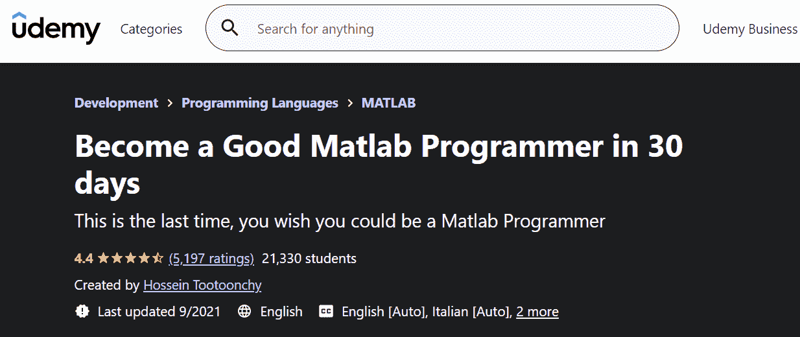
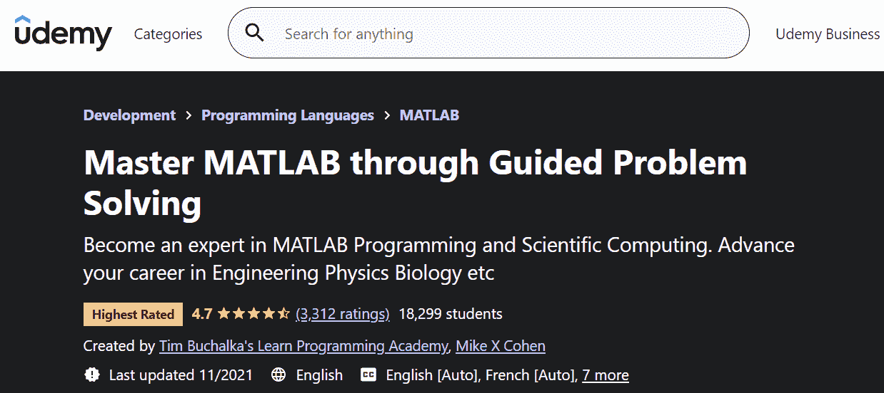
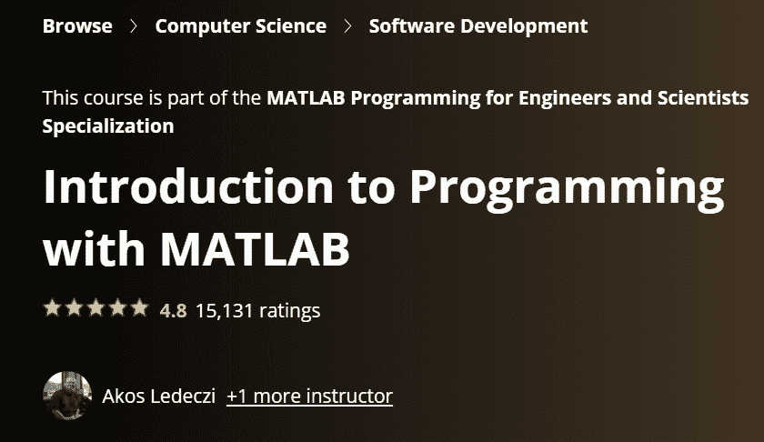
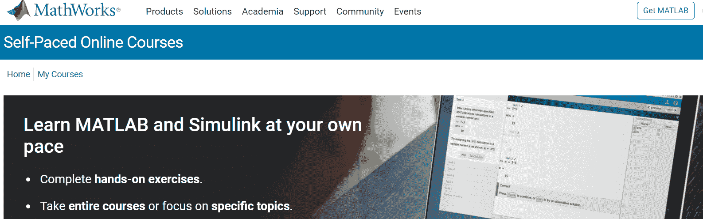
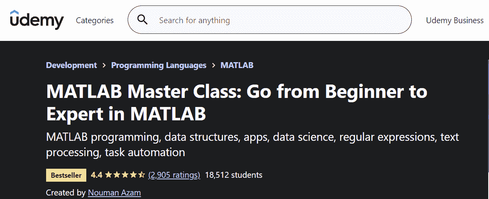
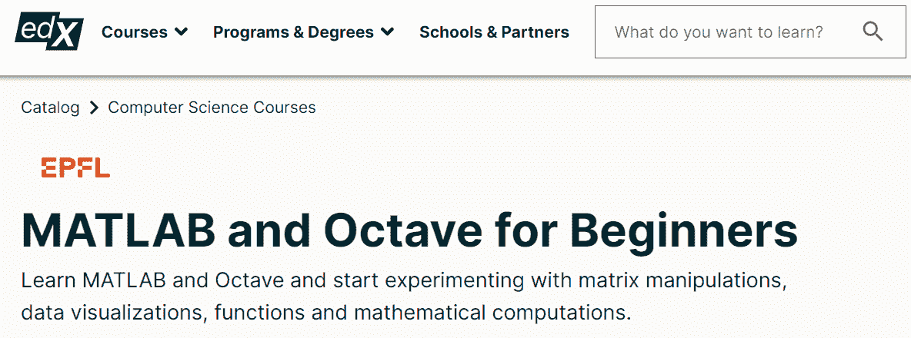
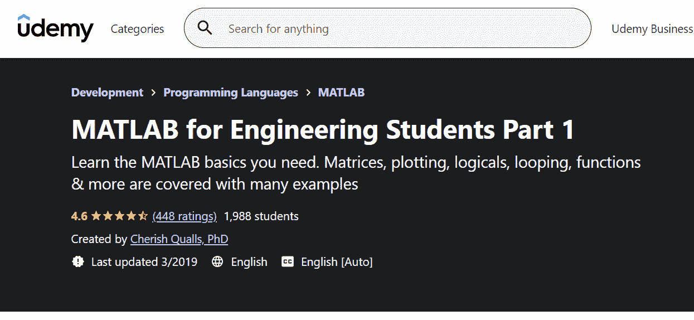
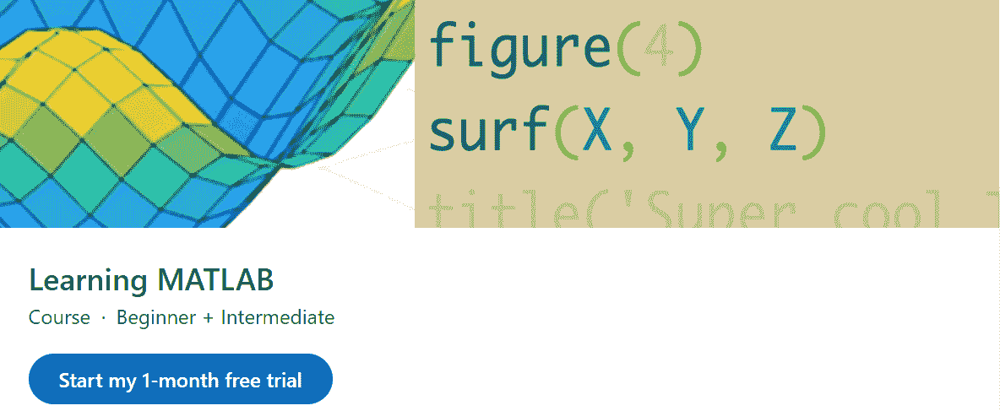
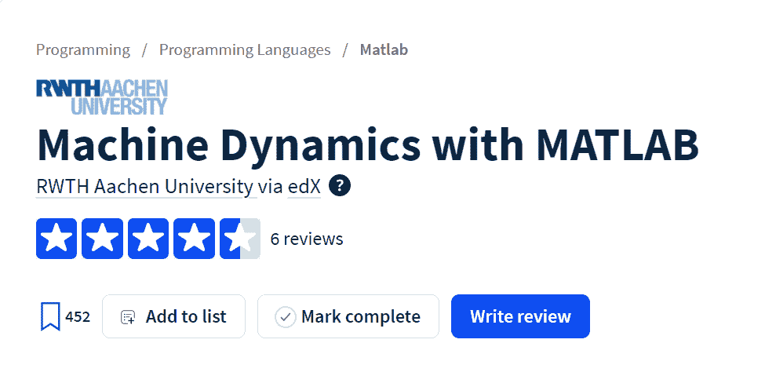

# 2023 年 10 门最佳 MATLAB 课程[排名]

> 原文：<https://hackr.io/blog/best-matlab-courses>

术语 MATLAB 代表矩阵实验室。它是用于计算机科学任务和项目的现代高性能编程语言。MATLAB 是研究和教学的杰出工具，这可以从其:

*   复杂的数据结构
*   内置编辑功能
*   调试工具
*   与面向对象编程的兼容性

MATLAB 还带有强大的内置例程，允许各种各样的计算。您可以使用图形命令并立即看到结果。

此外，您可以访问特定应用程序的集合，这被称为工具箱。这些工具箱是可以触发处理和控制理论的符号计算。

通过[学习 MATLAB 的基础知识](https://www.mathworks.com/matlabcentral/answers/1148-how-to-learn-matlab)，你可以开始使用高级数学函数并构建令人兴奋的矩阵可视化。对 MATLAB 的理解也将使你有资格获得数据分析、数据科学、Python、Java、计算机科学等许多领域的工作机会。

本文比较了 10 门 MATLAB 课程、[教程](https://hackr.io/tutorial/matlab-fundamentals)、一些培训和在线认证程序，这些都是付费或免费的。这些课程适合每个人——初学者、中级者和专家。

## 最佳 MATLAB 课程

亚马逊的一位名叫 Hossein Tootoonchy 的系统控制工程师创建了这个课程。这对初学者来说是一个很好的选择，因为你不需要以前的编程经验来完成它。你需要做的就是在你的系统中安装一个 MATLAB 软件，然后你就可以开始了！

虽然类似的课程都是空头支票，但是这门课程可以帮助你在 30 天内成为一名优秀的 MATLAB 程序员。完成后，你将有使用 M 文件、函数、脚本和模拟文件的经验。而且，你将能够解决大学水平的任何工程问题。

### 谁将从本课程中受益？

*   教师
*   企业家
*   研究人员
*   技术领域工程师
*   大学生
*   程序员

### 基本学习

*   算术函数和数据可视化
*   MATLAB 中的变量、三角函数和向量
*   矩阵及其函数
*   绘图、循环和文件类型

### 要求

*   不需要预先的编程知识
*   MATLAB 软件
*   求知欲！

**评分:** 4.4 分(满分 5 分)

**持续时间:** 14 小时

**课程内容:** 24 节 122 讲

[在这里报名](https://www.google.com/url?q=https://click.linksynergy.com/deeplink?id%3DjU79Zysihs4%26mid%3D39197%26murl%3Dhttps%253A%252F%252Fwww.udemy.com%252Fcourse%252Fmatlab-programming-fundamentals%252F&sa=D&source=editors&ust=1638379980307000&usg=AOvVaw2pH8sPteCBi1cU1oswj9fB)

Tim Buchalka 和 Mike X Cohen 是著名的 MATLAB 专家，在业界拥有超过 35 年的经验。他们提供这门 MATLAB 课程，帮助你毫不费力地解决 MATLAB 问题，并使你成为科学计算和 MATLAB 编程方面的专家。

这门 Udemy 课程将帮助你在生物学、工程学和物理学方面推进你的职业生涯。为了优化这个程序，你需要有一点编程经验，并在你的系统中安装 MATLAB 或 Octave。这门课程从基础开始，但很快就能达到中级和高级编程水平。

### 谁将从本课程中受益？

*   任何想在物理、工程、生物和金融领域建立职业生涯的人
*   任何想成为科学计算专家的人

### 基本学习

*   专业人员和研究人员使用 MATLAB 编程的应用
*   统计学、光谱分析、非线性模型拟合、信号处理以及使用 MATLAB 代码创建 HTML 表格
*   图像和时间序列分割
*   微积分和微分方程

### 要求

*   一台计算机和一个 MATLAB 或 Octave 软件
*   一些编程的先验知识

**评分:** 4.6 分，满分 5 分(2697 分)

**持续时间**T2:38 小时 1 分钟

**课程内容** **:** 25 节 169 讲。

[在这里报名](https://click.linksynergy.com/deeplink?id%3DjU79Zysihs4%26mid%3D39197%26murl%3Dhttps%253A%252F%252Fwww.udemy.com%252Fcourse%252Fmaster-matlab-through-guided-problem-solving%252F&sa=D&source=editors&ust=1638379980314000&usg=AOvVaw166BeDN2R13p7TE0NzNga7)

Akos Ledeczi 和 Mike Fitzpatrick 都是范德比尔特大学的计算机科学和工程教授。他们在 Coursera 上为没有计算机编程经验的学生提供 MATLAB 课程。

完成本课程后，学生将对编程的一般概念有一个清晰的理解，对 MATLAB 有一个坚实的基础，并有一个免费的 MATLAB 在线许可证。

教师在课程说明中指出，本课程不是 MATLAB 教程。相反，这是一门使用 MATLAB 提供编程和计算机科学概念介绍的课程。

### 谁将从本课程中受益？

*   没有编程知识的初学者
*   想要复习基础知识的中级和专家级程序员

### 基本学习

*   熟悉 MATLAB 环境
*   矩阵和算子
*   数据类型
*   文件输入/输出

**评分** **:** 4.8 分满分 5 分(11614 分)

**持续时间**:35 小时

**课程内容:** 9 课

[在这里报名](https://coursera.pxf.io/e45QGg)

MathWorks 提供了一个很好的学习资源来免费分享 MATLAB 的基础知识！为了您的方便，本课程提供了现场演示和现场练习。

讲师是有多年编码经验的专业程序员。任何具有基础或中级编程知识的人都可以学习本教程。你也可以在 MathWorks 上选择核心的 MATLAB 课程，但这些课程不是免费的。

### 谁将从本课程中受益？

*   学生

*   程序员

*   研究人员

### 基本学习

*   提供英语、日语、西班牙语和韩语版本。
*   带有评估和反馈的实践练习。
*   用多个元素在 MATLAB 中传递命令和创建变量
*   执行计算
*   修改元素的技巧，如行和 Matlab 的其他数组
*   扩展的工具集和 MATLAB 库以及编写将执行条件代码的程序的知识。

**评分:** 4.5 分(满分 5 分)

[在这里报名](https://matlabacademy.mathworks.com/&sa=D&source=editors&ust=1638379980327000&usg=AOvVaw37-jnIcvUf5tPktX8L8bwm)

## 

计算机科学副教授 Nouman Azam 教授这个 MATLAB 大师班。本课程适合初学者、中级者，甚至是寻找复习课程的专家。它提供了无数的应用程序，从数据科学到数据预处理，也包括高级数据类型。MATLAB 的先验知识不是强制性的，因为课程从入门水平开始向上。

你需要做的就是在你的电脑上安装 MATLAB 软件。

### 谁将从本课程中受益？

*   任何对科学或工程职业感兴趣的人
*   初学者寻找 MATLAB 入门

### 基本学习

*   如何在日常生活中使用 MATLAB
*   MATLAB 编程
*   数据分析和可视化
*   使用 MATLAB 的机器学习

### 要求

*   不需要事先了解 MATLAB
*   MATLAB 软件。

**评分:** 4.5 分，满分 5 分(1892 次评分)

**时长****:**36 小时 15 分钟

**课程内容** **:** 57 节 318 讲

[在这里报名](https://click.linksynergy.com/deeplink?id%3DjU79Zysihs4%26mid%3D39197%26murl%3Dhttps%253A%252F%252Fwww.udemy.com%252Fcourse%252Fmatlab-essentials-for-engineering-and-science-students%252F&sa=D&source=editors&ust=1638379980332000&usg=AOvVaw10iP22DWsfcXFOPdj1MLRF)

edX 为 MATLAB 编程初学者提供了一个关于 MATLAB 和 Octave 的综合入门课程。它需要大约四周的时间来完成，并帮助学生熟悉高级数学函数和矩阵可视化。

你不需要有广泛的编程背景来学习 MATLAB 这个伟大的入门课程。然而，你应该有数学背景，对变量函数、过程图、向量操作和矩阵有基本的了解。除了 MATLAB 的基础知识，您还将了解 Simulink。

### 谁将从本课程中受益？

*   初学者寻找 MATLAB 入门
*   具有简单数学背景，渴望从事计算机科学、生物学或工程学职业的人

### 基本知识

*   JPG 和 PDF 格式的绘图图形
*   MATLAB 的脚本和函数
*   矩阵、向量和不同类型的数据
*   课程以德语、英语和法语提供

### 要求

*   不需要以前的编程经验
*   推荐数学背景，包括变量函数，函数图形，向量和矩阵操作的知识

**评分** **:** 4.5 分满分 5 分

**持续时间** **:** 30 天

**课程内容:**详情请联系课程创建者

[在这里报名](https://edx.sjv.io/c/2890636/1598007/17728?u=https%3A%2F%2Fwww.edx.org%2Fcourse%2Fmatlab-and-octave-for-beginners)

Cherish Qualls 拥有强大的航空航天工程学术背景，并拥有 18 年教授有抱负的工程师的经验。她的 Udemy 课程涵盖了所有的 MATLAB 基础知识，包括矩阵、逻辑运算(也称为[布尔](https://hackr.io/blog/programming-terms-definitions-for-beginners)运算)、循环和绘图。

Qualls 的课程给你编程的实践经验，有 13 个测验帮助你练习。

### 谁将从本课程中受益？

*   注册专上工程项目的学生
*   任何具有计算机科学和数学中级背景的人

### 基本学习

*   向量和矩阵
*   数据可视化
*   创建和解释二维图
*   循环任务

### 要求

*   不需要编程经验
*   MATLAB 软件
*   对微积分和物理有基本的了解，包括向量、积分和导数

**评分:** 4.6 分(满分 5 分)

**持续时间:**各不相同

[在这里报名](https://click.linksynergy.com/deeplink?id%3DjU79Zysihs4%26mid%3D39197%26murl%3Dhttps%253A%252F%252Fwww.udemy.com%252Fcourse%252Fmatlab-the-need-to-know-basics%252F&sa=D&source=editors&ust=1638379980343000&usg=AOvVaw3hmNQKE51SAxLVptGVvXY0)

Steven Moser 是一位经验丰富的工程专业博士，他教授 LinkedIn 关于 MATLAB 的学习课程。本课程帮助你使用 MATLAB 工具处理各种形式的数据。您还将学习 MATLAB 语法，这是一种与众不同的编程语言。额外的奖励？本课程的最后一课是 Simulink 简介！

### 谁将从本课程中受益？

*   工程和数学专业的学生
*   任何具有计算机科学和数学中级背景的人

### 基本学习

*   一般概念、变量和单元格数组
*   脚本和矩阵
*   排除故障
*   创建和编辑二维和三维图

### 要求

*   计算机科学、数学或工程的中级背景
*   MATLAB 软件

**评分** **:** 4.5 分满分 5 分

**持续时间** **:** 约 30 天

[在这里报名](https://linkedin-learning.pxf.io/qnO6vg)

布尔夏德·科沃斯和马丁·湖人都是机械和机器领域的教师和学者。这门课程将教你基本的力学知识，并教你如何制作汽车模型。

完成本课程后，设计优化将变得轻而易举，因为您将学会如何理解和分析计算结果。

### 谁将从本课程中受益？

*   工程和数学专业的学生
*   任何具有计算机科学和数学中级背景的人

### 基本学习

*   振荡基础
*   求解运动方程
*   离散系统

### 要求

*   机械概念、计算机科学、数学或工程的中级背景
*   MATLAB 软件

**评分** **:** 4.7 分满分 5 分

**持续时间** : 6 周

**课程内容** **:** 6 课

[在这里报名](https://edx.sjv.io/c/2890636/1598007/17728?u=https%3A%2F%2Fwww.edx.org%2Fcourse%2Fmachine-dynamics-with-matlab)

行业专家迈克·科恩(Mike X Cohen)提供了一些课程，包括这个 MATLAB Onramp 2023 课程。Mike 将教你区分专家和新手的关键 MATLAB 编程技巧，包括调试、函数和可视化等主题。

要想在这门课程中取得成功，你不需要有丰富的 MATLAB 经验或数学背景。然而，任何语言中的一些编程知识都会大有帮助。

### 谁将从本课程中受益？

*   经验丰富的程序员
*   任何对编程有浓厚兴趣的人

### 基本学习

*   MATLAB 编程基础
*   用 MATLAB 图形引擎实现数据可视化。

### 要求

*   不需要事先了解 MATLAB
*   不需要数学背景
*   任何语言的一些编程知识
*   MATLAB 或 Octave 软件

**评分:** 4.6 分(满分 5 分)

[在这里报名](https://click.linksynergy.com/deeplink?id%3DjU79Zysihs4%26mid%3D39197%26murl%3Dhttps%253A%252F%252Fwww.udemy.com%252Fcourse%252Fmatlab-programming-mxc%252F&sa=D&source=editors&ust=1638379980364000&usg=AOvVaw3t-PdNDDYLM967F2cAsjXE)

## 结论

MATLAB 是一个伟大的、多功能的软件，适合从事数据可视化、数据分析和模拟的程序员。你可以在各种领域使用 MATLAB，比如生物、工程或金融。在当今的就业市场上，扎实的 MATLAB 知识是一项不可或缺的技能。

参加上面的 MATLAB 顶级课程之一，你很快就会成为一名非常受欢迎的潜在员工！