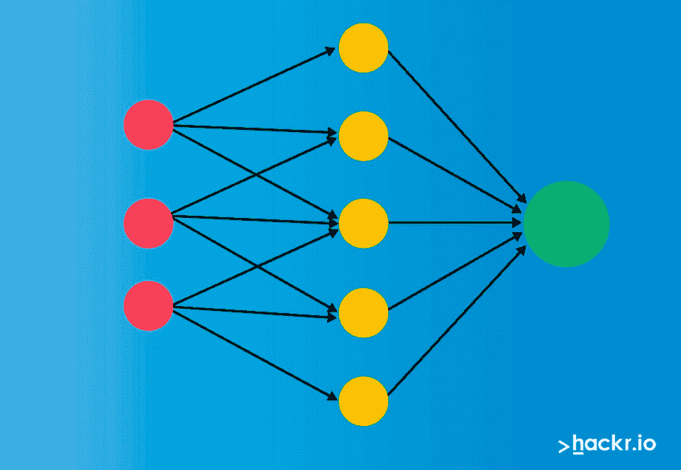
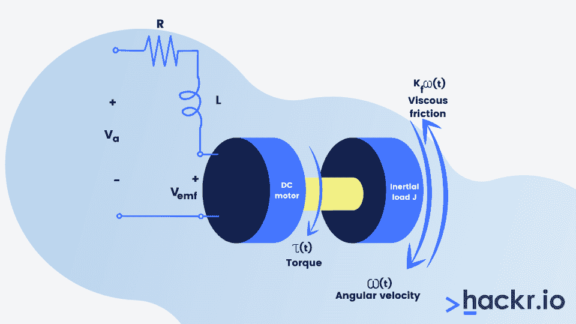

# 促进职业发展的 10 个最佳 MATLAB 项目

> 原文：<https://hackr.io/blog/best-matlab-projects-to-grow-career>

MATLAB 是统计编程的首选，统计编程是指用于完成数据分析的计算技术。R 也是一个很好的选择，这就是为什么你会经常遇到无休止的[R vs MATLAB](https://hackr.io/blog/r-vs-matlab)辩论。

我们将把 R 的讨论留到以后，因为我们将在本文中讨论 MATLAB。MATLAB 是一种流行的数据分析编程语言。

无论是训练人工神经网络来识别和分组不同的活动，还是利用消毒机器人来抵御新冠肺炎，MATLAB 正在改变人机交互的方式。因此，它是 21 世纪研究最多的工具之一。

为了帮助你学习和提高 MATLAB，我们编辑了十个最好的 MATLAB 项目供你试用。这些项目中的每一个都允许您在开发特定的应用程序时理解并使用 MATLAB 的各个方面。

## **十大最佳 MATLAB 项目**

### **项目 1 -图像中的文本检测和识别**

**预计完成** - 1 至 2 小时

**级**——初级

**目标**

*   开发一个可以检测和识别图像中文本的 MATLAB 程序。

如果你是 MATLAB 新手，这是一个令人兴奋且容易开发的项目。这个项目旨在创建一个 MATLAB 算法，使分析图像和搜索其中的任何文本成为可能。

这样的算法将使设计一个可以从图像(以及视频)中检索文本的系统成为可能。该系统还可以被编程为如果在图像/视频中检测到特定的文本模式，则执行定义的动作。然而，这超出了本文详细介绍的项目的范围，但是如果您愿意，您可以继续研究。

为了完成这个 MATLAB 项目，你需要首先检测图像中包含文本的区域，并丢弃没有检测到文本的区域。检测非文本区域的一个好方法是检查整个图像中笔画宽度的变化。最后，您需要组合所有包含文本的区域，并使用 [OCR](https://en.wikipedia.org/wiki/Optical_character_recognition) 识别文本。

总的来说，这个初级项目将帮助你了解 MATLAB 的真实用法。此外，您将熟悉光学字符识别(OCR)的概念，因为您将利用它来识别图像中的文本。

**参考 GitHub 上的免费项目:**

### **项目 2 -视频监控系统**

**预计完成** - 1 至 2 小时

**级**——初级

**目标**

*   开发一个基于 MATLAB 的视频监控系统。

视频监控系统非常受欢迎，可以确保人们在私人和公共场所的安全。借助 MATLAB 的强大功能，您可以创建一个能够执行人体检测和运动检测的基本视频监控系统。

在这个项目中，你的主要动机是分析通过闭路电视摄像头获得的镜头。您将开发的视频监控系统应该能够识别视频中的人，并跟踪任何移动对象的运动。

这个项目最直接的流程是:

*   使用摄像机拍摄视频
*   从视频中提取帧
*   对帧应用相关增强功能
*   比较并消除静止场景
*   比较帧以检测运动中人和物体的存在

**参考 GitHub 上的免费项目:**

推荐课程

### **项目 3 -人脸识别系统**

****

**预计完成时间**——8 至 10 小时

**级** -高级

**目标**

*   开发基于图像处理和神经网络的人脸识别系统。

人脸检测被认为是计算机实现的最具挑战性的任务之一。然而，在 MATLAB 中使用基于图像的人脸检测和识别方法可以创建自己的人脸识别系统。

然而，在你决定从事这个项目之前，你必须了解人脸识别系统是复杂的。所以，在开始这个项目之前，你需要至少有 *一些* 使用 MATLAB 的经验。

在这个项目中，你将需要使用基于图像的方法和一个 [人工神经网络(ANN)](https://hackr.io/blog/what-is-neural-networks) 来创建人脸识别系统。

系统需要使用 DCT(离散余弦变换)分析人脸图像。此外，人工神经网络将帮助系统训练和识别识别人脸所需的各种特征。

总之，如果你对人工智能(AI)感兴趣，这是一个很棒的 MATLAB 项目。

**参考 GitHub 上的免费项目:**

### **项目 4 -基于语音的生物识别系统**

****

**预计完成** - 3 至 5 小时

**级**——中级

**目标**

*   使用语音处理创建基于语音的门禁系统。

如果你对开发基于 MATLAB 的安全系统感兴趣，你一定不想错过这个项目。基于语音的生物识别系统项目使用语音识别，并为其他系统提供额外的安全层。

你将开发的基于语音的系统应该能够将人类的声音或语音作为输入，将其与数据库中已经可用的声音样本进行比较，如果输入的声音与任何现有的样本匹配，则授予访问权限。

此外，只要输入语音无法识别，并且与数据库中存储的任何语音样本都不匹配，系统就应该拒绝访问。基于语音的访问控制系统的好处在于，它可以用在只需要某些用户访问的其他系统之上。

在进行这个 MATLAB 项目时，你需要设计语音接入系统的算法，以便它能够从输入语音中检测和识别字母和单词。此外，系统应该检测输入语音是否在人类语音的频率范围内。

**参考 GitHub 上的免费项目:**

### **项目 5 -两级安全系统**

****

**预计完成** - 6 至 8 小时

**级**——中级

**目标**

*   创建一个基于 MATLAB 的两级安全系统:密码认证和指纹识别。

这是又一个伟大的安全相关的 MATLAB 项目，你可能会感兴趣。在这个项目中，您必须实现两层用户身份验证—密码身份验证和指纹识别—以确保更强的安全措施。

有了双因素安全系统，用户首先必须输入有效的密码，并通过提供指纹来证明自己的身份。通过这两个安全级别的用户将被授予访问系统或数据库的权限。

这个强大的安全系统对于保护敏感和机密信息免受黑客攻击和未经授权的访问非常有用。

实现这一点的一种可能方式是在数据库中创建多个用户，每个用户拥有不同的密码和指纹数据集。当用户想要访问这个双重安全系统之上的系统时，他们必须指定他们的用户名并输入密码。

如果密码与数据库中存储的密码相匹配，系统将提示用户在指纹扫描仪的帮助下提供指纹数据。如果用户提供的数据与数据库中存储的数据不匹配，访问将被拒绝。

**参考 GitHub 上的免费项目:**

### **项目 6 -模拟人工神经网络**

**预计完成时间-** 8 至 10 小时

**级** -高级

**目标**

*   模拟人工神经网络(ANN)并了解其工作原理。

用最简单的话来说，人工神经网络倾向于模拟人脑的功能。正如你可能意识到的，大脑模拟是最复杂的工程任务之一，在这个项目中你会遇到各种各样的挑战。

这个项目的主要目的是创建一个神经网络，并使用 MATLAB 和 LabVIEW 对其进行模拟。你的主要重点是理解人工神经网络是如何创建和训练的，以提供有意义的输出。

你可能还需要研究一种最简单的人工神经网络——感知器。这样做将有助于你更好地理解神经网络理论。此外，你可能需要理解并在你的项目中应用感知器的学习算法。

在开始开发这个项目之前，建议先学习和熟悉神经网络的基本概念，并清楚地了解 MATLAB 在开发神经网络方面的作用。

**参考 GitHub 上的免费项目:**

### **项目 7 -自动证书生成器**

**预计完成** - 3 至 5 小时

**级**——中级

**目标**

*   用 MATLAB 构建一个能够自动生成证书的系统。

使用 MATLAB 构建证书生成器是探索编写代码和创建 MATLAB 函数的好方法。您需要在这个项目中创建的证书生成器应该自动从数据库中获取个人数据，并相应地生成证书。您还可以设计证书生成器来从 Excel 表中获取个人数据。

自动证书生成器在教育机构中得到应用。这些机构必须向大量学生颁发证书。

为了开发该项目，您需要编写 MATLAB 代码，使自动证书生成器能够从数据库或 Excel 表中访问所需的数据。然后，需要将数据放入标准证书格式的适当部分，该格式以图像的形式提供。

通常，您需要添加到证书中的数据包括个人姓名、课程名称和课程完成日期。

您还必须确保所有生成的证书都存储在一个特定的文件夹中。这将使访问证书变得更加容易，并使它们保持有序。

**参考 GitHub 上的免费项目:**

### **项目 8 -助听器系统**

****

**预计完成** - 4 至 6 小时

**级**——中级

**目标**

*   开发具有噪声消除功能的现代数字助听器系统。

开发数字助听器系统需要使用降噪滤波器、频率和振幅滤波器。您需要设计一个 MATLAB 算法，能够处理输入声音，并在执行一组功能后将修改后的音频作为输出。

您可以直接从麦克风或以音频文件的形式向助听器系统提供输入。一旦音频作为输入被接收，系统将首先抑制或去除音频中的噪声，优选地通过使用自适应滤波器。

自适应滤波器将赋予系统削减噪声和增强音频质量的能力。此外，您可以添加一个带通滤波器来提高过滤后音频的频率，以增强输出端接收到的整体音频质量。

您必须事先决定将由助听器系统传送的音频的特征。这将使你更容易设计系统和创建相关的 MATLAB 算法。

**参考 GitHub 上的免费项目:**

### **项目 9 - JPEG 图像压缩器**

****

**预计完成** - 2 至 4 小时

**级-** 中级

**目标**

*   开发一个能够减少 JPEG 图像存储空间的图像压缩器。

我们的十大最佳 MATLAB 项目列表中的下一个项目是 JPEG 图像压缩器，作为一名 MATLAB 开发人员，你可以通过开发它来提高自己的技能。

这个项目将帮助你理解 MATLAB 图像可视化、处理和分析的基础知识。在您开始这个项目之前，您应该了解 JPEG 压缩器的必要性。

大多数数码相机拍摄的照片都是 JPEG 格式，而且尺寸相当大。存储大尺寸图像变得困难，因为它们需要更高容量的存储设备。

你需要开发的 JPEG 压缩程序应该可以减小 JPEG 格式的图像的整体尺寸。此外，压缩应该是无损的，这意味着原始图像可以从其压缩版本中重建。

在开发 JPEG 压缩器的 MATLAB 算法时，你将不得不使用离散余弦变换(DCT)和小波变换方法。

**参考 GitHub 上的免费项目:**

### **项目 10 -电枢控制 DC 电机建模与仿真**

****

**预计完成** - 5 至 6 小时

**级**——中级

**目标**

*   在 MATLAB Simulink 中设计并仿真电枢控制的 DC 电机。

最佳 MATLAB 项目列表中的最后一个项目是电枢控制 DC 电机的建模和仿真。如果你对电气和电子工程领域感兴趣，这个项目会激起你的好奇心。

一般来说，DC 电机的速度可以通过改变提供给它的输入电压来改变。在这个 MATLAB 项目中，您的目标是评估不同输入电压下 DC 电机的负载转矩和速度之间的关系。

该项目需要分两个不同阶段进行:

1.  项目的第一阶段需要你准备系统的数学模型。
2.  第二阶段，你需要模拟系统。

在基于 MATLAB 的图形编程环境 Simulink 中，您可以轻松完成这个项目的两个阶段。

**参考 GitHub 上的免费项目:**

[MATLAB 大师班:从 MATLAB 初学者到专家](https://click.linksynergy.com/deeplink?id=jU79Zysihs4&mid=39197&murl=https%3A%2F%2Fwww.udemy.com%2Fcourse%2Fmatlab-essentials-for-engineering-and-science-students%2F)

### **结论**

从事 MATLAB 项目将帮助你学习数值计算平台，并增强你对数据分析和统计编程的理解。

参与 MATLAB 项目并支持它需要付出大量的努力。你需要不断学习。查看这些 [最佳 MATLAB 教程](https://hackr.io/tutorials/learn-matlab) 来提高你在统计编程和 MATLAB 方面的水平。