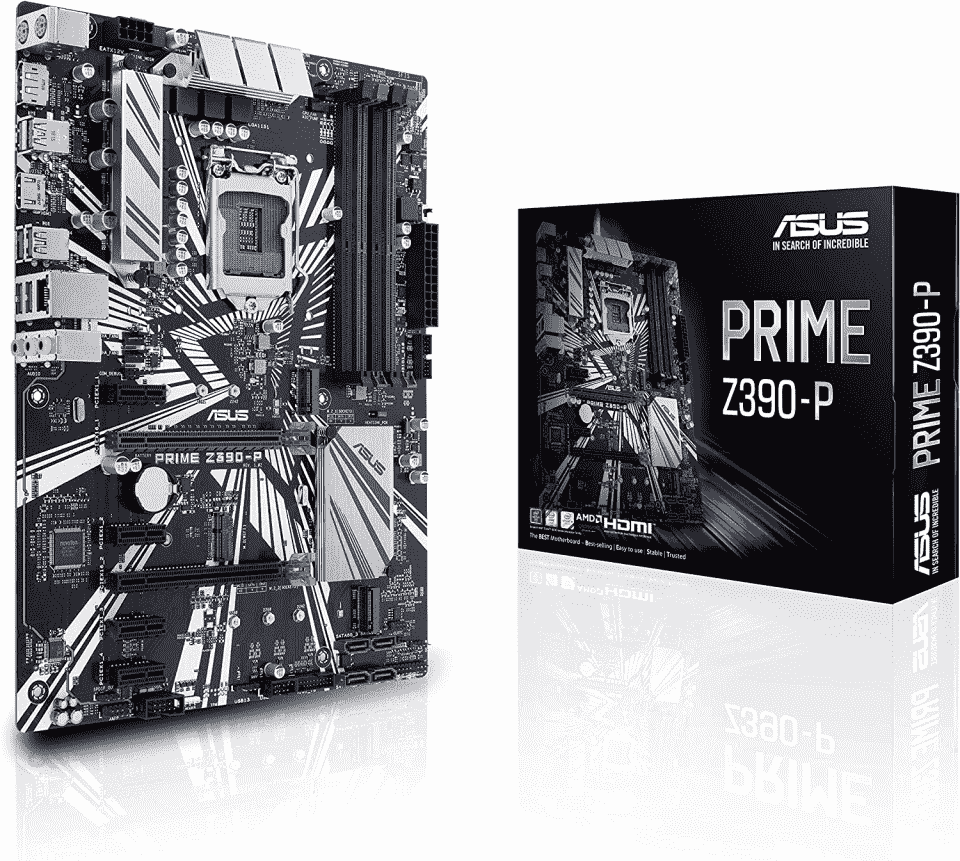
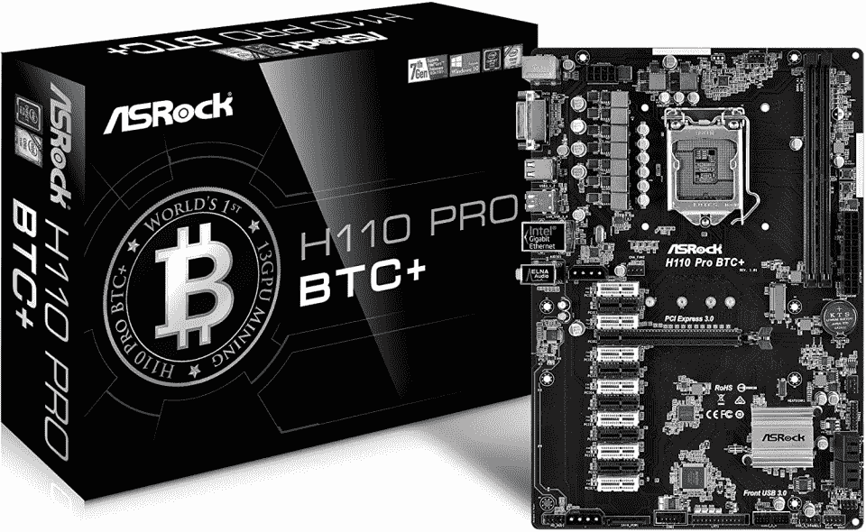
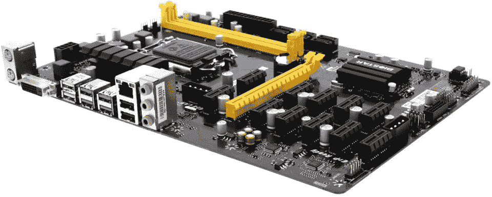
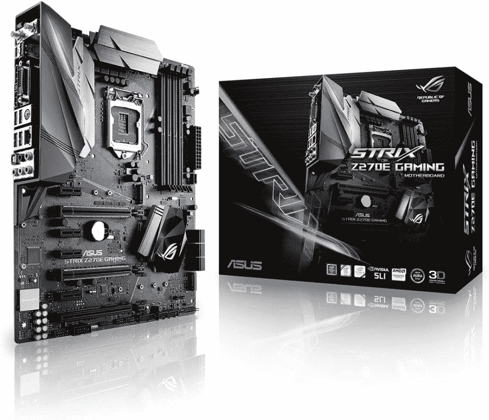
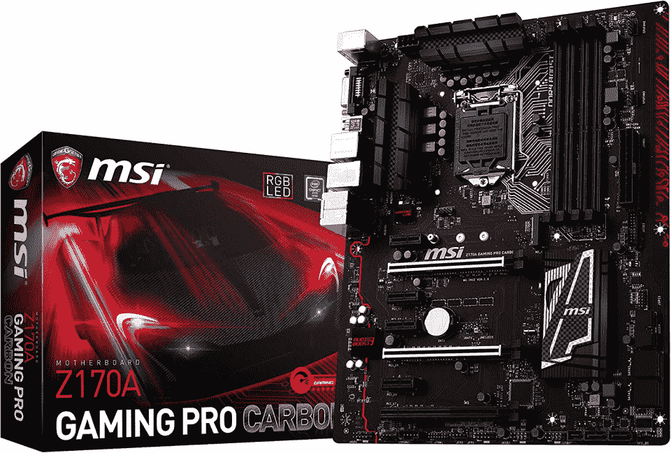
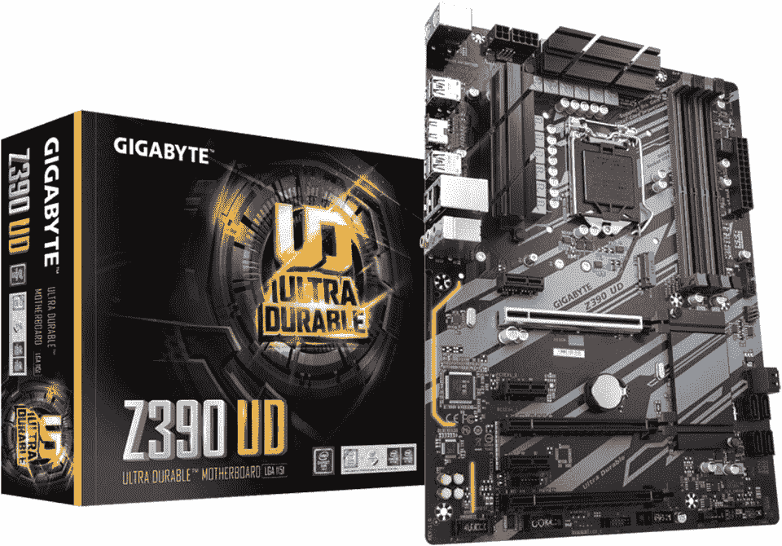
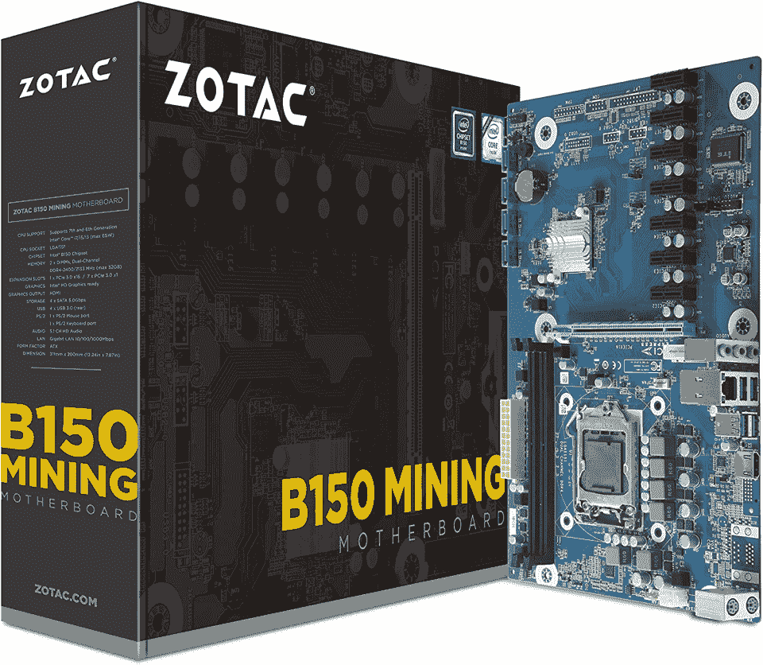
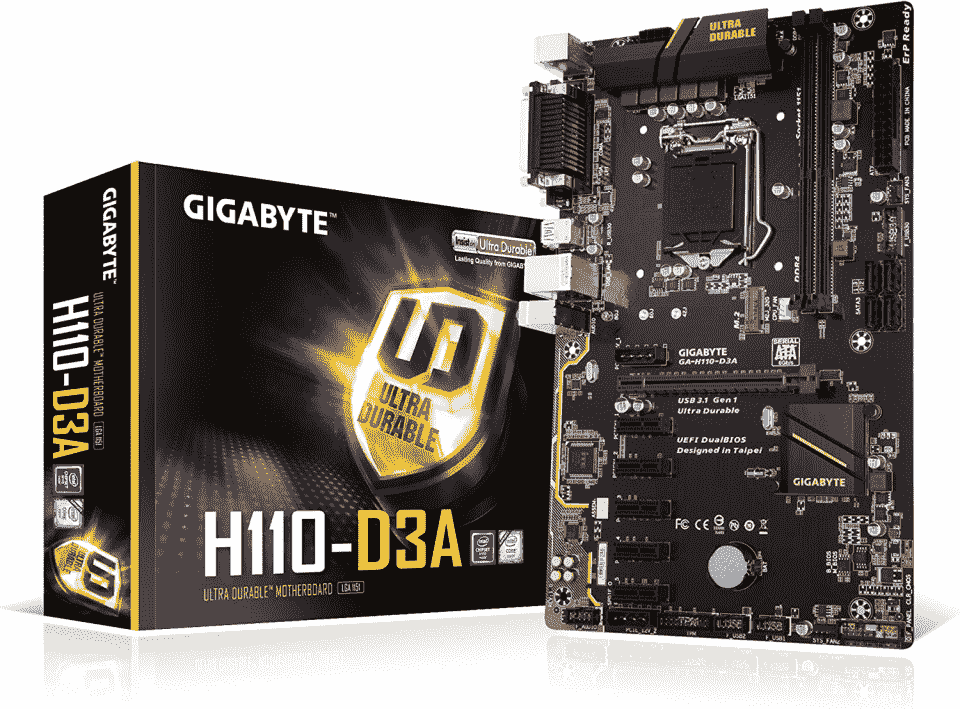

# 9 款最佳加密采矿主板[2023]

> 原文：<https://hackr.io/blog/best-mining-motherboard>

尽管 GPU 采矿正面临一些黑暗的日子，但如果你做研究并仔细选择要开采的加密货币，你仍然可以盈利。再加上你所在地区的运气和低电费，你仍然可以在这个复苏的空间里找到利润。

为此，你需要最好的采矿主板。下面，我们整理了 2023 年的一些最佳名单。

## **最佳矿用主板:我们的顶级推荐**

## **什么是矿主板？**

前阵子，当 CPU 挖矿不再能带来足够的利润时，GPU 成为了采矿钻机最关键的组件。因此，通过连接，加密采矿主板也成为采矿钻机的重要组成部分，因为它们可以支持多个图形卡同时运行。

选择正确的主板对你的钻机的盈利能力很重要。毕竟，它的 GPU 插槽越多，理论上你就能拥有越多的处理能力。

但是到底什么是矿主板呢？

挖矿主板(挖矿 mobos)是专门为加密货币挖矿的明示目的而设计的。它们被设计成能够处理繁重的工作负载和近乎恒定的正常运行时间。

采矿 mobos 通常有更多的 PCIe 插槽，能够支持多个图形卡同时运行，以解决复杂的数学问题，并在采矿过程中运行数百万次计算。这些计算一旦被验证，可以返回一些加密货币，然后你可以持有或出售获利。

采矿主板可以在我们知道的标准形式，如 ATX，迷你 ATX，电子 ATX，等等。然而，ATX 似乎是最常见的形式因素。

使用矿用主板有很多好处，例如能够同时运行多个 GPU，以排除常规 mobo 中的一些“标准”功能为代价的更好的经济性，良好的冷却解决方案等等。但当然，也有不利的一面，比如能源消耗和大多数最适合用于采矿的事实，尽管它们也可以用于常规工作/游戏装备(但你会受到你可以使用的 CPU 的限制)。

**相关:**

[最好学的区块链课程](https://hackr.io/blog/best-blockchain-courses)

### **矿用主板和普通主板有什么区别？**

对于外行人来说，矿用主板和普通主板看起来完全一样。但是，确实存在一些差异，例如:

*   普通或标准的 mobos 在挖掘数字货币方面的效率低得令人难以置信，你也不太可能完成你的计算
*   采矿 mobo 可以有多个 GPU，而标准 mobo 可能会受到 PCIe 插槽数量少的限制
*   一个采矿 mobo 可以作为一个标准的主板(即使你可能在兼容的 CPU 和内存方面受到限制)，但反过来就不正确了

## **如何选择最好的矿用钻机主板**

选择合适的 mobo 对钻机的效率和盈利能力至关重要。但是，当你为加密挖掘购买最好的主板时，你应该考虑哪些因素呢？考虑下面这些:

*   **质量** -您选择的主板应该是高质量的，并且必须制造精良，能够经受住严酷的采矿环境。它还应该能够帮助您最大限度地发挥显卡的潜力。

*   **PCIe/GPU 插槽** -没有 GPU 做计算，开矿主板什么都不是。考虑你想要在你的装备中有多少个图形卡，以及你是否想要更多的插槽，以防你以后想要添加更多的 GPU。

*   **处理器插座类型和兼容性**-Mining mobo 不会与所有 CPU 兼容。有些甚至与后来的英特尔和 AMD 芯片不兼容。确保您为要使用的 CPU 选择了正确的 mobo。

*   **价格和可用性** -如今，矿用移动机器人和钻机部件的需求更少，也更容易获得。然而，您仍然需要考虑价格，以确保 mobo 符合您的预算。
*   **条件** -如果您购买的是二手主板，请考虑在完成交易前检查其状况。

## **最佳采矿主板:2023 年最佳选择**

### 1. [**华硕 B250 矿用专家**](https://www.amazon.com/B250-MINING-EXPERT-Motherboard-Cryptocurrency/dp/B075KFPJ6M)**——矿用最佳顶级主板**

[****](https://www.amazon.com/B250-MINING-EXPERT-Motherboard-Cryptocurrency/dp/B075KFPJ6M)

**规格**:

*   **内存容量:**最高 32GB DDR4，2133 MHz

*   **操作系统支持:** Windows 7 或 10 (x64)

华硕 B250 采矿专家是当今采矿可用的最佳 mobos 之一。作为顶级选项之一，该主板可支持多达 19 个 GPU，并兼容第六代和第七代英特尔处理器(赛扬、奔腾、酷睿 i3/i5/i7)及其 LGA 1151 插槽。

如果你想建立一个非常强大的采矿钻机或只是想要一个有更多插槽的 mobo，你可以填充线，华硕 B250 采矿专家是一个可以考虑的。

**优点**

*   支持多达 19 个 GPU
*   有助于稳定供电的特性
*   不需要额外的 BIOS 设置

**缺点**

*   价格
*   有时候很难找到

[点击此处查看更多。](https://www.amazon.com/B250-MINING-EXPERT-Motherboard-Cryptocurrency/dp/B075KFPJ6M)

### 2. [**华硕 Prime Z390-P**](https://www.amazon.com/Prime-Z390-P-LGA1151-Intel-Motherboard/dp/B07HCT5GBD) **-最好的矿用廉价主板**

[****](https://www.amazon.com/Prime-Z390-P-LGA1151-Intel-Motherboard/dp/B07HCT5GBD)

**规格**:

*   **内存容量:**高达 64 GB DDR4，2400MHz

*   **操作系统支持:** Windows 10 64 位

采矿设备不一定要贵得离谱。以华硕 Prime Z390-P 为例，这是最实惠的加密挖掘 mobos 之一。虽然它只能支持六个 GPU，但它的价格更实惠，并且由于其 LGA 1151 插槽，可以支持多达第 8 代和第 9 代英特尔 CPU。我们会说，如果你想要一个多任务移动设备，也可以合理地为工作/游戏装备供电，华硕 Prime Z390-P 是一个很好的选择。

**优点**

*   负担得起的
*   m.2 存储支持
*   良好的构建质量

**缺点**

[点击此处查看更多。](https://www.amazon.com/Prime-Z390-P-LGA1151-Intel-Motherboard/dp/B07HCT5GBD)

[****](https://www.amazon.com/ASRock-H110-Mining-Motherboard-Cryptocurrency/dp/B073BX57M1/)

**规格**:

*   **内存容量:** DDR4，2400 MHz

*   **操作系统支持:**

*   **第七代英特尔处理器:** Windows 10 64 位

*   **第六代英特尔处理器:** Windows 10 64 位、Windows 8.1 64 位、Windows 7 32 位或 7 64 位

由于功能和价格的平衡，华硕 H110 Pro BTC+是另一个很好的选择，也是我们选择的最佳采矿主板。这款 mobo 具有坚实的构建质量，最多可容纳 13 个显卡，允许您根据需要扩展装备。值得注意的是，Windows 目前只支持最多 8 个 GPU，所以你可能需要做一些额外的设置(或者尝试使用 Linux)。

**优点**

*   最多支持 13 个 GPU
*   板上有电源/复位开关
*   可以运行 Windows 10

**缺点**

*   可能很难设置

[点击此处查看更多。](https://www.amazon.com/ASRock-H110-Mining-Motherboard-Cryptocurrency/dp/B073BX57M1/)

### 4.[**BIOS tar TB 250-BTC Pro**](https://www.amazon.com/Biostar-Motherboard-TB250-BTC-PRO-Supports/dp/B0736PV196)**-超值加密开矿主板**

[****](https://www.amazon.com/Biostar-Motherboard-TB250-BTC-PRO-Supports/dp/B0736PV196)

**规格**:

*   **内存容量:**最高 32 GB DDR4，2400 MHz

*   **操作系统支持:** Windows 7、Windows 8、Linux

*   **GPU 支持:** 12 个(对于 Linux)、8 个 Nvidia GPUs 或 6 个用于 Windows 的 AMD GPUs

如果你正在寻找最便宜的主板，你可以找到你的采矿钻机，Biostar TB250-BTC 专业是一个很好的考虑。它能够在 Linux 上同时运行多达 12 个 GPU，在 Windows 上运行 8 个 Nvidia 或 6 个 AMD GPUs。

**优点**

*   非常实惠
*   多达 12 个 GPU 支持 Linux (8 个 Nvidia 支持 Windows)

**缺点**

[点击此处查看更多。](https://www.amazon.com/Biostar-Motherboard-TB250-BTC-PRO-Supports/dp/B0736PV196)

### 5. [**华硕 ROG Strix Z270E**](https://www.amazon.com/ROG-STRIX-Z270E-GAMING-Motherboard/dp/B01NGTJNSZ) **-适合挖矿的游戏主板**

[****](https://www.amazon.com/ROG-STRIX-Z270E-GAMING-Motherboard/dp/B01NGTJNSZ)

**规格**:

*   **内存容量:最高 64 GB，DDR4 3866 MHz**

*   操作系统支持:Windows 7 32 位/64 位、Windows 8.1 64 位、Windows 10 64 位

华硕 ROG Strix Z270E 是一款游戏主板，也可以用于采矿，因为它有七个 PCIe 插槽。然而，值得注意的是，它只能同时运行六个 GPU。

这款 mobo 来自华硕的玩家国度产品线，可以通过其 LGA 1151 插座支持第 6 代或第 7 代英特尔 CPU。这款主板还可以配备高达 64 GB 的内存，是工作/游戏和采矿两用设备的绝佳选择。

**优点**

*   你也可以用这款 mobo 来玩游戏

**缺点**

[点击此处查看更多。](https://www.amazon.com/ROG-STRIX-Z270E-GAMING-Motherboard/dp/B01NGTJNSZ)

[****](https://www.amazon.com/MSI-Performance-Gaming-Z170A-Motherboard/dp/B01BIUW9PO/)

**规格**:

*   **内存容量:最高 64 GB，DDR4 2133 MHz**

MSI Z170A Gaming Pro Carbon 是一款稳定可靠的游戏主板。你当然可以通过它的美学来判断它是为游戏而生的，但这并不能减少这样一个事实，即它也是一个有能力的采矿移动设备，可以支持多达 7 个显卡。

像上面的 ROG Strix Z270E 一样，该主板中的 LGA 1151 插槽使其与第 6 代和第 7 代英特尔 CPU 兼容。

**优点**

*   也适用于游戏
*   支持多达 7 个 GPU

**缺点**

*   有一些游戏功能，并有一个游戏美学，这可能并不适合所有人 YMMV

[点击此处查看更多。](https://www.amazon.com/MSI-Performance-Gaming-Z170A-Motherboard/dp/B01BIUW9PO/)

### 7. [**技嘉 Z390**](https://www.amazon.com/GIGABYTE-Z390-UD-LGA1151-Motherboard/dp/B07HS59X7P)**——又一款廉价矿主板**

[****](https://www.amazon.com/GIGABYTE-Z390-UD-LGA1151-Motherboard/dp/B07HS59X7P)

**规格**:

*   **内存容量:最高 128 GB，DDR4 2666 MHz**

*   操作系统支持:支持 64 位 Windows 10

千兆字节 Z390 UD 是一个标准的主板，但不要被愚弄-它是少数几个也可以处理支持 GPU 采矿钻机的主板之一。它运行 Windows 10，支持高达第 8 代和第 9 代英特尔 CPU，并可处理高达 128 GB 的 DDR4 RAM。最重要的是，这个标准的 mobo 有六个 PCIe 插槽，这意味着你可以同时运行六个 GPU。

**优点**

*   负担得起的
*   m.2 存储支持
*   RGB 照明支持

**缺点**

*   不是专门为采矿制造的

[点击此处查看更多。](https://www.amazon.com/GIGABYTE-Z390-UD-LGA1151-Motherboard/dp/B07HS59X7P)

[****](https://www.amazon.com/ZOTAC-Mining-Motherboard-Cryptocurrency-B150ATX/dp/B078CJZYHW)

**规格**:

*   **内存容量:最高 32 GB DDR4，2400 MHz**

*   操作系统支持:Windows 10 就绪

Zotac 的显卡比其他组件更出名。不过 Zotac B150 绝对是一款可以考虑的矿用 mobo。这款主板最多可以支持八个 GPU，并且可以运行 Windows 10，这使得它比其他只能运行 Windows 7 或 8 的价格更高的主板更好。

**优点**

*   价格合理
*   容易找到
*   支持多达 8 个 GPU

**缺点**

*   只能支持高达 64W 的 CPU
*   略大于同样采用 ATX 外形的其他移动设备

[点击此处查看更多。](https://www.amazon.com/ZOTAC-Mining-Motherboard-Cryptocurrency-B150ATX/dp/B078CJZYHW)

### 9.[**-技嘉 H110-**](https://www.amazon.com/GIGABYTE-GA-H110-D3A-LGA1151-Cryptocurrency-Motherboard/dp/B073ZMZV6K)**-稳定可靠的矿用主板**

[****](https://www.amazon.com/GIGABYTE-GA-H110-D3A-LGA1151-Cryptocurrency-Motherboard/dp/B073ZMZV6K)

**规格**:

*   **内存容量:最高 32 GB DDR4，2400/2133 MHz**

*   操作系统支持:Windows 7 32 位、Windows 7 64 位、Windows 8.1 64 位、Windows 10 64 位

技嘉 H110-D3A 是一款采矿主板，无论您是将它用于采矿还是日常工作/游戏，都能为您的钻机提供稳定可靠的体验。该主板最多可支持七个 GPU，并可支持 SSD 存储。

**优点**

**缺点**

*   没有 HDMI 接口
*   与其他类似的采矿活动相比，价格略高

[点击此处查看更多。](https://www.amazon.com/GIGABYTE-GA-H110-D3A-LGA1151-Cryptocurrency-Motherboard/dp/B073ZMZV6K)

## **我们如何选择最好的矿用主板**

我们在上面列出了一些最好的 Nvidia 和 AMD 矿业主板的建议，但是你为什么要相信我们的意见呢？

知道了加密货币采矿需要什么，我们在选择最佳采矿移动业务名单的竞争者时考虑了这些因素:

*   PCIe 插槽/GPU 支持
*   价格
*   膨胀性
*   CPU 兼容性
*   有效性

为了编制这份名单，进行了大量的研究。我们问有经验的 GPU 矿工他们最喜欢的 mobos 是什么。我们进入论坛，花时间在 Reddit 上，在热情的社区中找到了普遍的共识。我们还密切关注产品评论，以确保名单上的每个 mobo 都是高质量的。

## **以太坊合并后的采矿**

继以太坊合并之后，许多人都有一个问题:一个 GPU 采矿主板仍然值得吗？在经历了这一切之后，你还能盈利开采加密货币吗？

[不幸的是](https://www.pcmag.com/news/no-one-is-profitable-gpu-mining-faces-dark-days-after-ethereum-merge)，在这方面我们没有太多好消息给你。

今年 9 月 15 日，以太坊合并终于发生了。这意味着最大、也可以说是最赚钱的加密货币之一 ETH 淘汰了 GPU 挖掘。虽然这对地球有显著的好处，主要是大大减轻了对资源和电网的压力，但这对全世界的加密矿工来说是一个主要的负面影响。基于 GPU 的 ETH mining 的淘汰夺走了该领域最有利可图的收入流。

这是否意味着你*不能*开矿或盈利了？不要！

你完全可以继续采矿，但你必须开采那些有朝一日可能会或不会“去月球”的小硬币或代用硬币。风险要大得多，而且在某些情况下，没有足够的投资回报。

许多人已经看到，这可能是我们所知道的 GPU 挖掘的“死亡”。出于这个原因，你会看到许多人关闭他们的采矿设备，甚至出售他们的设备，以收回他们的初始费用。

也就是说，现在可能是购买一些已经并将继续充斥市场的许多废弃的 GPU 和钻机的好时机——只是要确保你检查并反复检查它们的状况！

为了降低风险，增加成功和盈利的机会，请访问 [WhatToMine](https://whattomine.com/) ，它会帮助您计算哪些硬币对您最有利。

## **结论**

尽管基于 ETH GPU 的挖掘不可行，但你仍然可以继续挖掘其他更小的加密货币，希望找到一种能带你去月球的货币。为此，你需要最好的采矿主板为您的预算和需求。

我们希望这份最好的加密挖掘 mobos 列表能帮助你找到一个符合你需求的！如果你认为我们错过了这个列表中的一个，请在下面的评论中告诉我们。

想了解更多关于区块链和加密？查看我们对[最佳加密货币和区块链教程](https://hackr.io/blog/best-cryptocurrency-blockchain-tutorials)的推荐。你也可以看看我们的[区块链](https://hackr.io/blog/blockchain-programming-beginners-guide)循序渐进初学者指南。

## **常见问题解答**

#### **1。哪款主板最好挖矿？**

最好的挖矿主板看你的需求和预算。只要记得考虑一个主板支持多少 GPU，你可以使用哪些操作系统，主板的能耗，你愿意花多少钱等因素就可以了。此外，考虑主板的条件，如果你是购买二手或翻新。

#### **2。挖矿主板值得吗？**

挖掘主板是非常值得的，尤其是如果你能在可接受的时间内获得投资回报。

#### **3。主板对于密码挖掘有多重要？**

如果你的主要意图是用 GPU 挖掘加密货币，那么你最好的选择是购买一个用于挖掘的主板。请记住，挖掘主板可以用作工作或游戏计算机的标准板，但标准板很可能无法挖掘加密货币。因此，采矿车对你的采矿设备来说是 100%重要的。

#### **4。主板开采多久？**

主板设计得耐用可靠。在采矿钻机中，主板比你的 GPU 承受的压力小得多，GPU 承担计算工作的主要部分。因此，虽然您可以预期您的 GPU 具有较短的寿命(想想三年左右而不是五年或更长时间)，但您的主板可以轻松地使用五年或更长时间——即使全天候使用。当然，这是假设你很好地维护了你的设备。

#### **5。一块主板可以支持多少个 GPU 挖矿？**

一块主板可以支持的 GPU 数量通常取决于它有多少个 [PCIe 插槽](https://motherboardfor.com/solutions/how-many-gpus-can-a-motherboard-support/)。因此，看到一些主板只能支持两到三个 GPU 并不罕见。然而，现在有许多主板甚至有更多的 PCIe 插槽，这意味着你会发现许多 mobos 支持 6，8，12，甚至多达 19 个显卡。

#### **6。GPU 挖矿可以用任何主板吗？**

技术上来说，是的。但如果你想盈利，并在合理的时间内获得投资回报，你会想投资采矿主板。幸运的是，有许多负担得起的选择，比如上面我们的建议中列出的那些。

#### 7 .**。有没有可能把挖矿主板放在 PC 机箱里面？**

是的，但前提是你打算只用一两块显卡。采矿钻机通常使用许多 GPU，每个 GPU 都需要冷却才能有效工作(并且不会损坏)。因此，您需要将采矿设备放在电脑机箱之外，以确保所有组件都得到足够的冷却，从而帮助它们更好地运行并持续更长时间。