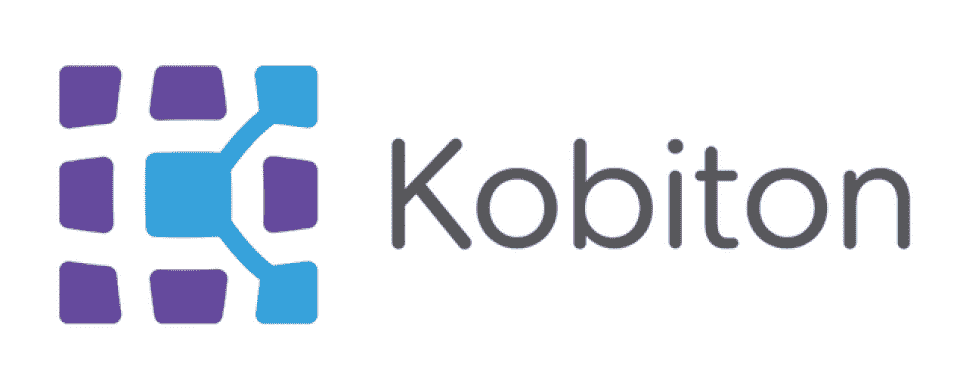
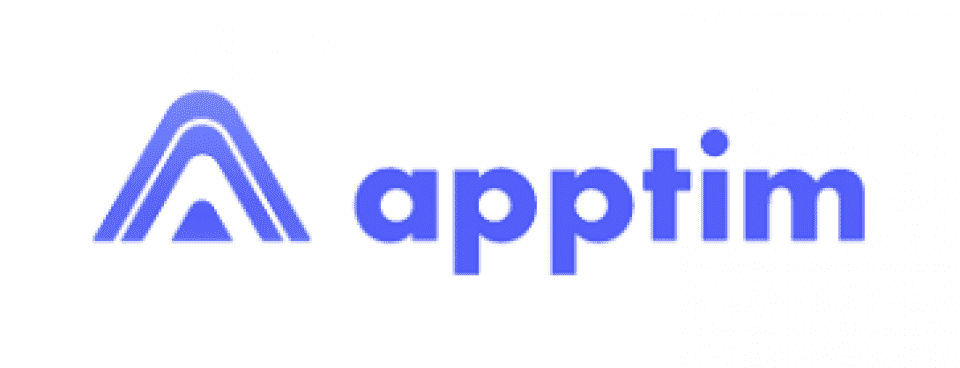

# 2023 年 9 款最佳移动测试工具[免费和付费]

> 原文：<https://hackr.io/blog/best-mobile-testing-tools>

在过去的几十年里，移动电话的使用呈指数增长。Statista 甚至表示，到 2023 年，这一使用率可能会上升，达到 72.6 亿。

虽然“哑”手机仍然存在，但今天的大多数手机都是智能手机。

智能手机只需要自带的应用程序就可以完美地作为通信设备。但是说实话:智能手机意味着应用程序的多样化。大量的应用程序让你的生活更加轻松有趣。

但是没有人喜欢漏洞百出、不可靠的移动应用。由于性能不佳、电池耗尽问题和崩溃，许多移动应用程序得到的评价很差。

解决办法？公司已经投资于移动应用测试，为最终用户提供完美的、跨平台的、可靠的应用。

在本文中，我们将讨论移动应用程序测试，并推荐当今最流行的移动测试工具。准备好了吗？我们开始吧！

## **什么是移动应用测试？**

移动应用程序测试对特定的移动应用程序执行多项测试，以评估其功能和性能。它减少了性能差、加载问题和无响应元素等问题，以防止谷歌或苹果商店的差评。

## **移动应用测试的类型**

QA 测试人员经常使用移动应用测试工具来完成各种评估。这里列出了每个应用程序在发布前必须经历的移动应用程序测试类型。

### **功能测试**

功能测试确保移动应用程序的功能符合用户的要求。

### **性能测试**

性能测试可确保应用程序在特定条件下正常运行，如内存可用性低、电池电量低和网络覆盖差。

### **实验室测试**

网络运营商提供所有无线通信服务。它拥有必要的组件，如无线网络基础设施、无线电频谱分配、回程基础设施、供应计算机系统和计费客户服务。网络运营商执行实验室测试来检测数据连接和语音缺陷。

### **中断测试**

移动应用在运行时会面临许多中断，从电池移除、接收短信到网络中断和其他通知。

中断测试确保移动应用程序可以在工作时通过进入挂起状态来处理中断。然后，在处理完所有的中断后，它继续。

**推荐课程**

[移动测试大师课从头开始](https://click.linksynergy.com/deeplink?id=jU79Zysihs4&mid=39197&murl=http%3A%2F%2Fhttps%3A%2F%2Fwww.udemy.com%2Fcourse%2Fmobile-testing-masterclass-from-the-beginning%2F)

### **可用性测试**

公司进行可用性测试，以确保特定应用程序的用户体验或 UX 在所有设备上都是一致积极的。移动应用程序测试工具使用可用性测试来确保应用程序在跨平台和跨设备环境中的预期功能。

### **内存泄漏测试**

内存泄漏测试确保应用程序在给定的内存限制内正常运行。

当应用程序或计算机程序无法处理或管理分配的内存时，性能会受到影响。内存泄漏会导致应用程序冻结和手机崩溃。

### **认证测试**

认证测试有助于开发人员获得合规证书。QA 测试人员必须根据不同移动平台定义的规则测试每台移动设备。

### **负载测试**

负载测试是 QA 测试人员进行的最重要的类型之一，以确保应用程序可以在不同类型的负载下运行，如多任务处理或高峰时间。

### **安全测试**

安全测试检查应用程序是否有任何漏洞。许多针对移动应用的测试工具帮助 QA 测试人员发现使应用容易受到黑客攻击、数据窃取等的问题。

## **移动应用测试的优势**

以下是执行移动应用程序的一些显著优势:

### 正常运行

测试人员检查一个应用程序在特定的需求下是否正常工作，比如改变网络、负载条件等。

### **用户界面/UX 可用性**

移动应用程序测试帮助测试人员从最终用户的角度思考，以创造一个良好的体验。此外，他们检查用于创建应用程序的逻辑，并验证它是否便于遵循。测试人员必须在整个应用程序开发过程中运行 UI 和 UX 测试，以提供令人印象深刻的结果。

### **提高客户忠诚度**

无缝运行？检查。令人印象深刻的用户界面和 UX？检查。瞧，你有一个客户忠诚度的秘诀。这有助于你获得人气，接触到更多的用户。

如今有这么多可用的工具，找到最适合您需求的工具是一项挑战。有些工具不适合您的项目规模或其他要求。虽然测试人员仍然可以用次优的测试工具执行测试，但是错误的工具仍然会导致低效、错误和浪费时间。

总有一款“合适”的工具适合移动应用测试工作。有了完美的工具，您可以简化您的工作流程——甚至可以加速项目的开发过程。

移动应用测试工具在质量、功能、价格等方面各不相同。当然，您仍然可以进行[手动测试](https://hackr.io/blog/manual-testing-interview-questions)——但是这最终会变得低效。选择正确的工具是自动化整个测试过程的第一步。

但是现在市场上有这么多移动自动化测试工具，你如何挑选一个合适的呢？

考虑下面一些优秀移动测试工具的标准:

### **支持多种编程语言**

尽管 JavaScript 很容易成为今天领先的编程语言，开发者仍然可以用各种编程语言创建移动应用。他们可能会根据需求、成本、预期的应用程序功能、目标受众等选择特定的语言。因此，选择能够用几种不同语言编写测试用例的自动化移动测试工具是一个好主意。

### 您需要无代码选项吗？

尽管大多数软件测试和移动测试都涉及到某种形式的代码，但是有时候你可能希望能够创建一个没有任何代码的测试。无代码测试是可能的，对于不懂任何编程语言的用户来说，这是一个福音。如果您认为您可能在某个时候需要一个无代码的选项，那么寻找包含无代码测试创建和执行的移动应用程序的自动化测试工具。

### **录制和播放**

一个好的移动测试工具通常可以记录并播放(或自动化)每个测试场景动作。这个特性可以使测试过程更加顺畅、高效。

### **举报处理&日志**

QA 工具，无论是软件还是移动应用，都应该能够记录你的测试报告。这些日志显示了测试计划的详细描述，包括关于实际测试的信息，以及截图和其他发现。

### **集成**

您的测试工具可能不需要包含第三方集成。然而，与流行的 CI/CD 平台和工具的集成将节省您的时间。

### **操作系统兼容性**

如果你已经知道你的应用只会在一个平台上运行，不会扩展到其他平台，你就不需要太担心操作系统的兼容性。然而，如果你有机会以后进入其他市场，你可能会想要寻找支持你需要的操作系统(如 iOS 和 Android)的移动应用测试工具。

开发人员测试应用程序，以确保一流的用户体验。以下是一些流行的移动测试工具供您考虑:

****

**定价**:科比顿有四个等级:

*   那么，免费试用 14 天

*   只有每月 75 美元的月费才能启动

*   加速费用每月支付 390 美元，或每年支付 3，960 美元

*   规模仅在年度计划中提供，每年花费 9，000 美元

*   对企业计划感兴趣的人可以[请求演示](https://www.kobiton.com/demo-request)并收到定制报价

**主要优势**:

*   允许您选择手动、自动或无脚本的应用程序测试
*   免费试用
*   与列表中的其他工具相比，低层计划相对便宜
*   提供与 CI/CD 平台的无缝集成，因此您可以创建高效的工作流
*   提供数据日志和集中式报告历史记录

Kobiton 是使用最多的基于云的移动应用测试平台之一。它使用户能够在各种混合、本地和 web Android 和 iOS 应用程序上执行手动和自动测试。此外，Kobiton 允许用户在真实设备上执行测试，并且不使用仿真器。

Kobiton 的设备实验室管理(DLM)功能允许用户开发一个完美的移动测试云。这个 DML 特性允许测试人员创建他们的本地测试云，并将桌面、内部和本地设备连接到他们的私有云。此外，Kobiton 使测试自动化变得无缝且更易于管理。

Kobiton 曾经是唯一提供无脚本自动化的工具。尽管新工具提供了同样的功能，但 Kobiton 的无脚本自动化功能可以帮助用户生成自动化测试脚本，并同时在几个设备上运行它们。使用 Kobiton 的另一个优点是它可以高效准确地解决所有测试失败。

****

**定价:** TestComplete 有两层，每层都是固定或浮动的。固定允许一个用户执行测试，但只能在物理设备上。浮动允许多个用户在物理和虚拟设备上进行测试。

*   那么，免费试用 14 天
*   **TestComplete Base(加上移动模块)**:每份固定许可证 1，665 美元；每个浮动许可证 3，695 美元

*   TestComplete Pro(包括 web、桌面和移动模块):每个固定许可证 2540 美元；每个浮动许可证 5075 美元

**主要优势**:

*   兼容多种移动平台，支持多种编程语言，包括 [C#](https://hackr.io/blog/how-to-learn-c-as-a-beginner) 、C++、VBScript、DelphiScript、Python、JScript 和 JavaScript
*   具有记录/重放功能，允许您创建测试并运行它们，而无需编写新代码
*   允许在真实的(物理的)Android 和 iOS 设备上进行自动化测试
*   提供与最流行的 CI/CD 平台的集成，包括 JIRA 和 Git

TestComplete 是一个全面的移动测试自动化平台，使用户能够在任何移动电话上创建和执行 UI 测试。此外，它支持在真实的 iOS 和 Android 设备上进行 UI 测试，以及在不同设备上进行移动测试，每个设备的分辨率和大小都不同。

此外，TestComplete 帮助用户加快跨平台移动测试。它支持 Flutter、React Native、Xamarin 和 SwiftUI 等框架。使用 TestComplete，您可以从头开始生成测试脚本，并为其他目的记录它们。

当您使用 TestComplete 进行移动应用程序测试时，您将不必越狱您的平板电脑或手机。它还内置了缺陷管理工具、源代码控制系统和管理解决方案的集成。

TestComplete 与 API 测试工具无缝集成，如 ReadyAPI 和 SoapAPI，允许测试人员检查用于不同操作系统和设备的 API 是否按照预期工作。此外，TestComplete 提供对移动设备的传感器数据(如加速度计、GPS 和陀螺仪)的完整访问。

****

**定价:**

*   测试 IO 有三层。这些是启动版、专业版和企业版。不幸的是，该公司没有显示其定价。相反，你需要[询问](https://test.io/crowdtesting/pricing)你是否想知道你将支付多少费用来使用这个平台。
*   在请求定价之前，您也可以尝试一次[免费演示](https://try.test.io/test-io-platform/)。

**主要优势**:

*   非常适合人群测试
*   熟练的测试人员在物理设备上持续测试 web 和移动应用
*   测试人员符合 NDA 标准，确保您的应用程序和知识产权的安全
*   还提供其他形式的移动测试

Test IO 是一个令人惊叹的软件即服务(SaaS)平台，用于人群测试和移动应用测试。

该工具允许用户在真实的物理设备上执行测试，并将其测试覆盖范围扩展到许多真实世界的平台、设备和人员。唯一的条件？您的应用程序应该兼容 Android 和 iOS 操作系统的每个版本。

由于 Test IO 是一个人工驱动的测试平台，这里所有的测试人员都是 NDA 兼容的。他们测试您的应用程序并找出您的开发团队可能没有发现的错误。Test IO 还支持其他测试类型，如黑盒测试、探索性测试、可用性测试、功能测试、回归测试、网站测试、可穿戴设备测试和 beta 测试。

****

**定价** : Appium 开源，100%免费使用。

**主要优势**:

*   免费和开源
*   支持许多编程语言，包括 Perl、C#、JavaScript、Java、Python 等等
*   基于最好和最流行的软件测试工具之一，Selenium
*   自动化测试的代码是跨平台的，可以在 iOS 和 Android 上运行
*   具有记录/回放功能

Appium 是一个广泛使用的测试自动化开源框架。它支持对 Android 和 iOS 上的混合和本地移动和 web 应用进行自动化测试。它使用 WebDriver 协议来驱动 Windows、iOS 和 Android 等不同操作系统上的应用程序。

Appium 的主要理念是，测试任何移动应用程序都不需要重新编译或修改来实现自动化。相反，人们应该在测试时选择期望的框架、实践、测试和工具。

此外，Appium 不允许用户坚持使用特定的编程语言或框架来开发和运行测试。相反，它使用户能够用不同的编程语言开发测试代码，如 Java、Python、PHP、JavaScript、Ruby 等。此外，您可以在 Windows、iOS 和 Android 测试套件之间重用测试代码。

最精彩的部分？Appium 让你从使用*任何*语言的*任何*测试框架中自动化*任何*移动应用。最后，它允许测试人员或用户访问测试代码的数据库和后端 API。

****

**定价**:

*   **Live(手动测试):**每个并行测试/月 99 美元起，按月支付；每年支付每个并行测试/月 83 美元起

*   Automate(手动+自动测试):每个并行测试每月 149 美元起，按月支付；从每年支付的每个并行测试/月 125 美元开始

*   无脚本(无代码)计划需要自定义报价；联系销售[这里](https://www.perfecto.io/pricing/subscription-plans#request-a-quote)

*   企业计划需要自定义报价；联系销售[这里](https://www.perfecto.io/pricing/enterprise-licenses)

**主要优势**:

*   提供许多第三方和 CI/CD 集成，以增加功能和简化工作流程
*   借助企业级安全解决方案，确保您的知识产权的安全
*   提供智能分析，允许改进反馈和更快地修复错误
*   允许用户访问各种测试场景和云平台

编者按:在这个推荐列表的前一个版本中，我们有十个工具。然而，因为 [*Perfecto 在 2021 年 5 月获得了 21 个 lab*](https://www.perforce.com/press-releases/perforce-acquires-21-labs-ai-based-scriptless-mobile-testing-provider)*，我们已经修改了我们的列表，删除了 21 个 lab。*

Perfecto 是当今最优秀、最知名的移动应用和网络测试平台之一。其一半的客户群包括财富 500 强公司，如 IBM、威瑞森、福特、劳埃德银行、ULTA 等等。

Perfecto 在该领域拥有超过 15 年的经验，提供了无与伦比的技术解决方案，可以解决测试移动和网络应用时出现的最棘手的挑战。它支持跨虚拟和真实设备的并行测试执行。Perfecto 还支持测试分析、持续测试、功能测试、性能测试、回归测试等等。

21Labs 是一个 SaaS 测试自动化平台，它在测试过程中也使用了人工智能。它允许用户在模拟器或物理设备上测试他们的 Android 或 iOS 应用程序。

自从 Perfecto 收购了 21Labs，它开始提供一个 [21Labs 和 Perfecto integration](https://www.perfecto.io/integrations/21labs) ，结合了两个世界的精华。

****

**定价:** Android Bug Hunter 免费下载使用。

**主要优势**:

*   100%免费使用
*   适用于测试 Android 应用，提供更快的测试，同时保持准确性和灵活性
*   非常适合 UI 测试
*   人工测试

Bug Hunter 是测试移动应用程序的另一个强大的手动工具。它是专门设计来使 Android 应用程序测试更快更准确，同时保持灵活性。Bug Hunter 是质量保证工程师、设计师和开发人员的理想选择。

QA 工程师可以使用 Bug Hunter 在 Android 平台上更有效地测试 UI。设计师可以使用这个手动移动测试工具来确保应用程序的 UI 和设计模型完美匹配。最后，开发人员可以自己测试他们的代码，并立即做出所需的更改，以减少频繁的多次修改。

Bug Hunter 涉及到网格的概念，使用户能够精确计算所有 UI 元素的大小。此外，您可以使用 Bug Hunter 的标尺和指南来检查 UI 元素的水平和垂直对齐。最后，一个颜色选择器允许你立即选择想要的颜色，并把它放到屏幕上想要的位置。错误猎人支持 RGBA 和十六进制格式。

Bug Hunter 可以毫不费力地生成截图、录制视频和捕获长记录，而无需离开当前界面。您可以捕获 JPEG 和 PNG 格式的屏幕截图。使用 longshot 模式，用户可以通过手动编辑来捕捉长页面的截图。

****

**定价**:

*   与列表中的其他付费工具不同，Apptim 有一个免费层
*   那么，保费计划的 14 天试用期

*   **专业版:每位用户每月 99 美元**

*   企业版:起价每月 1499 美元；为了获得更准确的报价，最好[向 Apptim 预订一个演示](https://www.apptim.com/pricing)

**主要优势**:

*   测试移动应用性能的绝佳选择
*   提供一个全面的仪表板，显示测试和调查结果的比较
*   用户友好的界面甚至允许初学者浏览平台
*   与 JIRA 无缝集成

测试移动应用程序的性能通常非常具有挑战性。幸运的是，Apptim 使它变得更加容易和易于管理，使用户能够快速发现移动应用程序中的性能问题。

Apptim 的综合性能仪表板显示不同测试会话的性能比较。它支持测试运行在 Android 和 iOS 系统上的本地应用，并使用户能够在本地运行性能测试，并与他们的团队共享或保存生成的报告。

Apptim 涉及左移移动性能测试。它使您能够测试每个新代码、应用程序的每个新版本以及每个部署的性能。任何人都可以使用 Apptim，因为它有一个用户友好的界面。最后，它支持无缝的 JIRA 集成，允许您发布和跟踪错误。

**定价**:

*   Ranorex Studio 提供 30 天免费试用
*   要使用此工具，您需要购买许可证。有两种类型的许可证，即 Studio 和 Enterprise

*   Studio 是最适合单人用户的许可证，价格为 3590 美元

**主要优势**:

*   移动应用测试的最佳一体化测试套件之一
*   由数千家公司选择
*   支持在仿真器或物理设备上进行各种类型的测试
*   还支持跨浏览器测试
*   与各种项目管理和 CI/CD 工具无缝集成

Ranorex Studio 是移动应用测试的一站式目的地。超过 4，000 家知名公司使用这一强大的测试平台来交付顶级应用。此外，Ranorex Studio 是最适合初学者和专家的测试平台，使他们能够为移动、web 和桌面应用程序开发测试。

Ranorex Studio 支持测试移动 web 应用程序、原生移动应用程序以及 Android 和 iOS 应用程序。它支持跨浏览器测试、数据驱动测试、回归测试和关键字驱动测试。测试人员通过一个许可证就可以获得测试 web、移动和桌面应用程序的完整工具集。

此外，Ranorex Studio 在 Windows 桌面上自动进行测试，然后在模拟器或物理 Android 和 iOS 移动设备上本地运行这些测试。Ranorex 还支持对 Firefox、Microsoft Edge、Chrome 等进行跨浏览器测试。

使用 Ranorex Studio 进行测试时，无需对移动设备进行越狱。Ranorex Studio 与 JIRA 和许多其他自动化 bug 跟踪的 DevOps 工具无缝集成。此外，它与 Travis CI、testRail、Jenkins 等轻松集成。

**定价**:

*   你可以要求免费试用茄子
*   你必须购买许可证才能使用茄子

*   **单个测试流许可证费用为 3400 美元**

*   你可以花 1700 美元添加第二个流，花 80 美元添加第三个流
*   或者，您可以尝试已经有三个测试流(针对单个系统)的**综合包**，花费 8950 美元

是德科技的茄子是 TestPlant 开发的另一个 GUI 自动化测试工具。它涉及机器学习和人工智能，以从人工测试转向自动化测试，确保移动应用程序的快速发布。它可以有效地测试运行在 Android 和 iOS 系统上的移动应用程序。

茄子支持以用户为中心的移动应用测试方法，确保响应式设计、高性能和一致的体验。除了移动测试之外，它还支持基于图像的测试、跨浏览器测试、网络测试、自动化和功能测试以及 web 测试。茄子还确保所有的缺陷、错误和性能问题在投入使用之前得到解决。

用户可以在 Windows、Linux、macOS 操作系统上安装茄子。它不需要为不同的平台和设备创建不同的测试；所有平台或设备的一个脚本将支持它。

茄子的人工智能驱动方法利用无脚本模型，并支持整个测试过程，从测试用例生成到结果分析。茄子可以测试任何浏览器、设备、技术、操作系统。因此，它是一个多合一的测试平台。

## **结论**

测试在软件或应用程序开发过程中至关重要。每个移动应用程序都必须经过特定的测试以确保功能。移动测试工具满足了这一需求。

我们希望这篇关于最佳移动测试工具的文章已经帮助你为你的下一个项目选择了一个可靠的选择。如果你认为我们遗漏了一个应该在这个列表中的工具，请在下面的评论中告诉我们！

*寻找帮助你学习软件测试的课程？*

**查看** [**10 门最佳软件测试课程学习**](https://hackr.io/blog/software-testing-course) **。**

## **常见问题解答**

#### **1。什么是移动测试，举个例子？**

移动测试包括测试应用程序，以确保它们按照预期和规范运行。移动应用程序测试的一个例子是负载测试，测试人员检查应用程序在重负载或峰值负载下是否能够运行，而不会冻结或崩溃。另一个例子是 UI 测试，测试人员确保所有的用户界面元素与设计者想要的布局完全匹配。

#### **2。我们可以使用 Selenium 进行移动测试吗？**

Selenium 不直接提供测试移动应用的能力。然而，它确实有一些框架可以让你根据需要测试你的应用程序。一个例子是 Appium，它是一个基于 Selenium 的开源框架。Appium 是我们上面列出的建议之一。

#### **3。为什么移动测试很重要？**

通常情况下，移动应用程序的代码会出现错误或意想不到的结果。如果不进行测试，在应用程序到达最终用户手中之前，这些错误不会被发现和修复。毫无疑问，任何 app store 上一个漏洞百出、未经测试的应用都会收集一系列负面评论，立即抹杀产品的声誉，影响用户的信任。

**人也在读:**