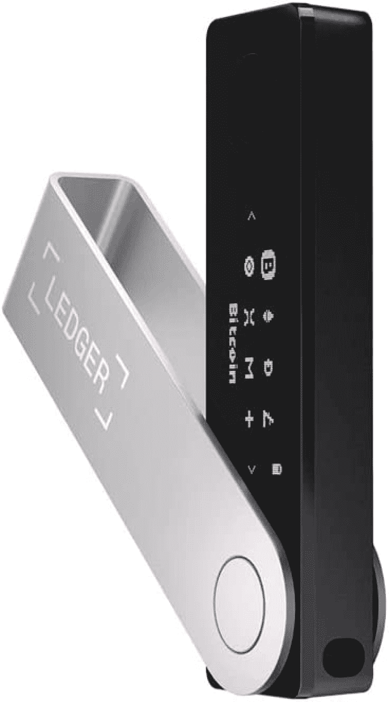
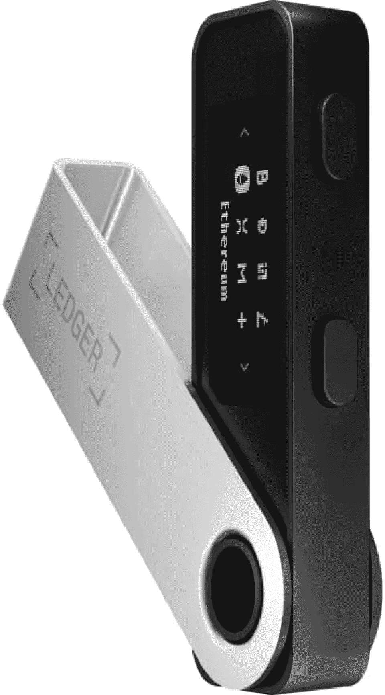
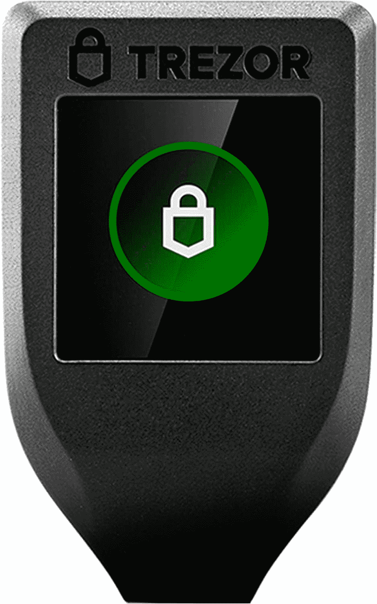
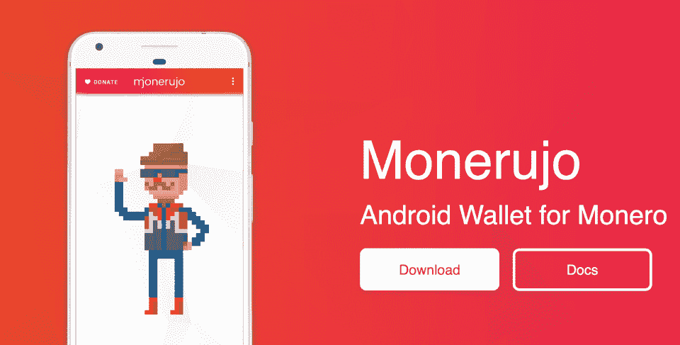
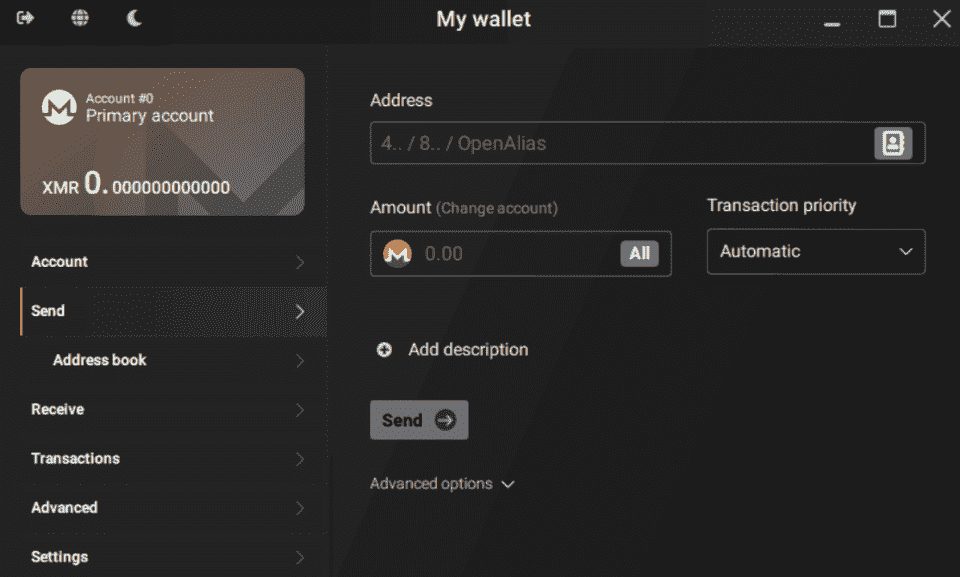
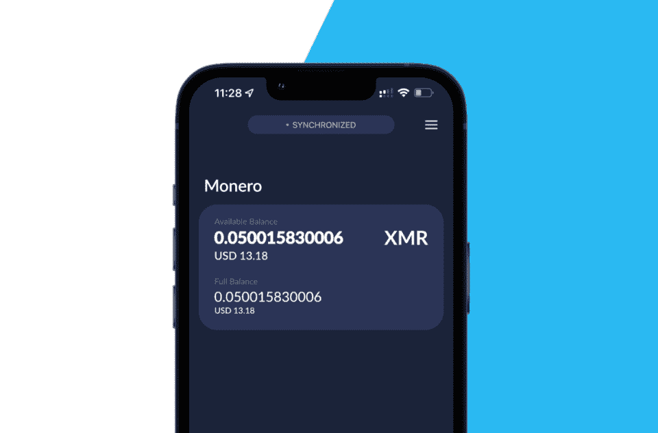
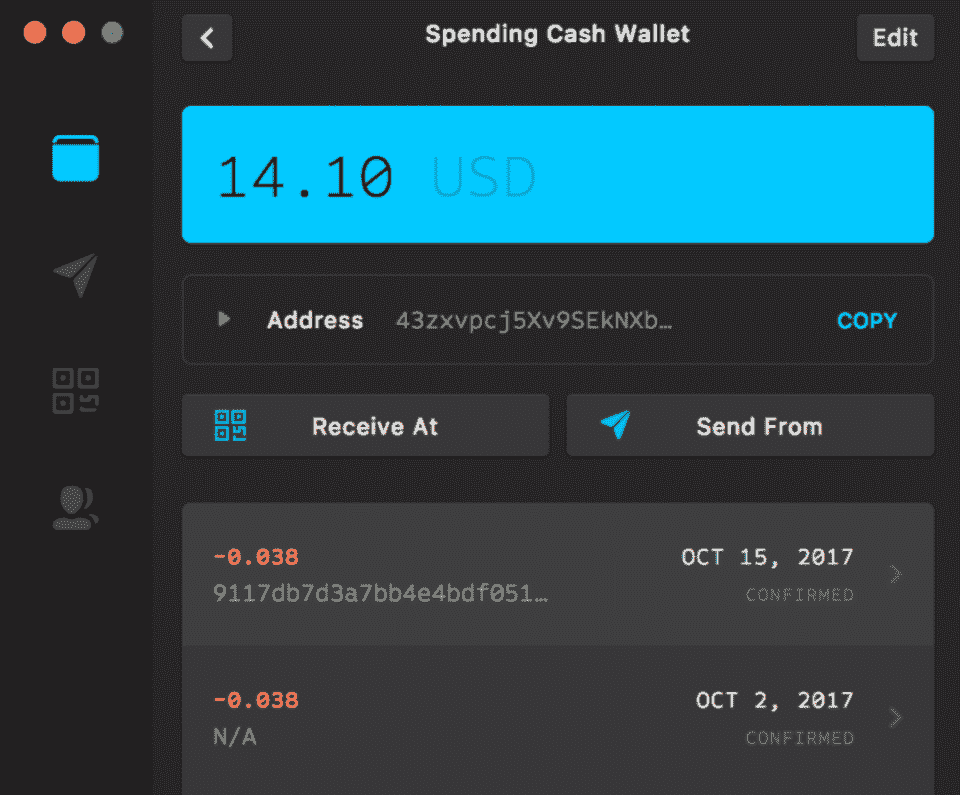
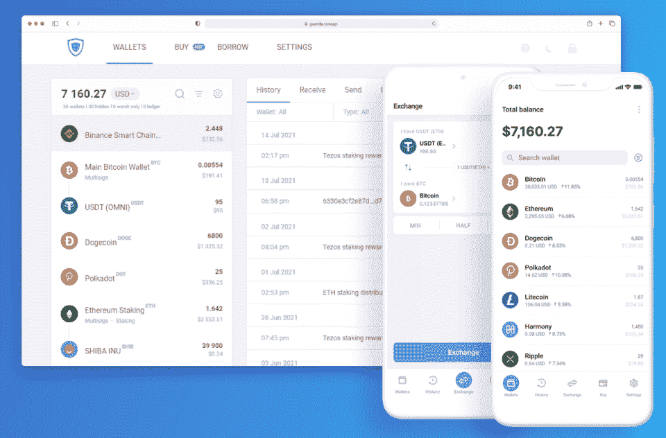

# 2023 年 8 大最佳 Monero 钱包[热+冷]

> 原文：<https://hackr.io/blog/best-monero-wallet>

自 2009 年推出比特币以来，加密货币已经走过了漫长的道路。随着去中心化和注重隐私的硬币的兴起，Monero (XMR)迅速成为最受欢迎和使用最广泛的加密货币之一。

如果你想加入 Monero 的世界，想找到最适合你的钱包，你来对地方了。我测试了 14 个最受欢迎的 XMR 钱包，以找出哪一个提供了最好的隐私、安全和加密货币支持。根据这个排名标准，我将结果缩小到这八个 Monero 钱包的列表中。

准备好您的硬币，因为您将了解到 2023 年存放 Monero 的所有信息。

### **什么是 Monero？**

许多个人选择加密货币是因为它的简单性和分散性，也是因为它强调隐私。Monero (XMR) 是加密世界中的隐私之王。它利用先进的加密技术向公众隐藏交易细节和钱包余额，确保用户的匿名性。

虽然比特币和以太坊用户在技术上可以在不泄露个人信息的情况下建立 Monero 钱包，但他们的身份可能与他们的钱包相关联的风险始终存在，这使得他们的交易历史容易受到公众的审查。对于重视隐私并寻求保护其数字身份的个人而言，Monero 是理想的解决方案。

### 什么是 Monero 钱包？

加密货币钱包是一种数字工具，使用户能够与安全的区块链互动，特别是在 Monero 钱包的情况下与 Monero 区块链互动。这些钱包的基本功能是在区块链的不同钱包之间发送和接收加密货币。

许多加密货币钱包提供多区块链支持，允许用户持有和兑换多种加密货币。有的还提供直接用法币购买加密货币的便捷选项。

需要注意的是，加密货币钱包有三种类型:热、冷、保管。我们来讨论一下两者的区别。

1.  **热门钱包**通过网络、手机或桌面应用程序直接连接到互联网。它们允许钱包的主人完全控制他们的密码。然而，这些是最不安全的选择，因为它们很容易被黑客攻击，因为私钥可以全天候在线获得，这意味着黑客可以更容易地跟踪和访问私钥，从而导致资金被盗。
2.  **冷钱包**，也称为冷存储，是不与互联网连接的数字钱包，意味着它们可以存储在硬件设备或一张纸上。硬件钱包被认为比热钱包更安全，因为私钥存储在一个隔离的环境中。纸质钱包也可用于接收和存储密码，但必须转换为热钱包才能发送密码。缺点是价格昂贵，通常在 59 美元到 189 美元之间。
3.  保管钱包提供了一个交换或平台，持有用户的密码，这意味着用户对资金有索赔权，但对私钥没有控制权。这种类型的钱包通常是用户友好的，并提供额外的安全性，包括 KYC 验证。如果用户忘记了他们的登录信息，他们可以联系交易所重新获得他们的资金，这是最安全的选择。

### **如何找到最好的 Monero 钱包？【排名标准】**

由于提供了多区块链支持选项，因此有数百种可能的钱包可供选择——然而，并非所有钱包都是同等创建的。因此，在寻找最好的 Monero 钱包时，最重要的考虑因素包括:

*   **隐私**:使用保护用户身份的 Monero 钱包势在必行。使用通过“开放远程节点”连接到区块链的钱包，意味着您的身份可能会暴露——我们希望不惜一切代价避免这些钱包。Monero 建议建立个人节点以加强隐私和分散化，但这并不总是可行的，尤其是对那些缺乏技术专长的人来说。
*   **安全性**:最好的 XMR 钱包提供有效的安全功能来保护您的加密资产不被窃取，例如双因素身份验证、可调整的交易费用和响应迅速的客户支持。
*   **加密货币支持**:某些钱包提供使用或交换多种加密货币的能力，以及从法定货币到加密货币的购买选项，无需兑换账户。

其他值得期待的功能包括储蓄账户、高级交易工具、借贷工具和 DeFi 收益率生成选项——但这些功能会因个人用户的需求而异，拥有这些功能很好，但不是强制性的。考虑到所有这些特性，我能够简化我的测试过程，以确定当今市场上最好的 XMR 钱包。

时间紧迫？看看这张对比表，快速了解 2023 年最好的 Monero 钱包。

| **最佳货币 wallet** |
| **名称** | **描述** | **钱包类型** | **成本** |
| [莱杰纳米 S 加](https://geni.us/h6A6) | 面向普通加密用户的经济型硬件钱包。 | 冷钱包 | [检查价格](https://geni.us/h6A6) |
| [Trezor T 型](https://geni.us/t4TgnD) | 面向高级加密用户的强大硬件钱包。 | 冷钱包 | [检查价格](https://geni.us/t4TgnD) |
| 蛋糕钱包 | 这是一款面向普通加密用户的用户友好型应用，最适合在 iOS 上使用。 | 热门钱包 | 自由的 |
| 瓜尔达 | 一个高功能的应用程序，为高级加密用户带来收入机会。 | 热门钱包 | 自由的 |

## **2023 年 8 款最佳 Monero 钱包**

### **1。** [**莱杰纳米 X**](https://geni.us/mG1xHaz) **【新手最佳 Monero 钱包】**

[了解更多信息](https://geni.us/mG1xHaz)

**钱包类型:**冷钱包(硬件)

**货币数量:**5500(包括比特币、以太坊、XRP)

**支持的平台:**安卓、iOS、MacOS、Windows(不兼容 Chromebooks)

**价格:** [检查价格](https://geni.us/mG1xHaz)

Ledger Nano X 是一款多功能的蓝牙硬件钱包，非常适合存储 Monero 和其他加密货币。它具有高安全性和用户友好的特点，使其成为新的和有经验的加密用户的最佳选择。Ledger Nano X 的一些主要功能包括:

*   **安全性:**Ledger Nano X 使用最先进的加密技术来保护您的私人密钥，包括密码、离线交易确认和安全芯片。
*   **存储:**拥有所有分类账冷钱包中最大的容量，1TB 的存储空间和下载 100 多个应用的能力。
*   **初学者友好:**Ledger Nano X 非常适合初学者，因为它的快速设置和强大的功能，包括与 DeFi 应用程序和 NFT 的连接。

**优点:**

*   支持铸造和交易 NFT 和交易菲亚特加密。
*   提供已发送交易的离线确认。
*   包括蓝牙连接和 1TB 的存储空间。

**缺点:**

*   价格偏贵(但在我看来仍然物有所值)。

**按照以下步骤开始使用 Ledger Nano X:**

1.  将设备连接到您的计算机，并下载 [Ledger Live 应用程序](https://support.ledger.com/hc/en-us/articles/4404389606417-Download-and-install-Ledger-Live?docs=true)。
2.  按照屏幕上的说明在应用程序中创建一个新的钱包，创建一个密码并将您的恢复短语存储在安全的地方。
3.  打开应用程序以访问购买/出售、交换、管理、发送和接收选项卡。使用“帐户”选项卡来“添加加密帐户”若要添加 Monero 帐户，请打开管理器，找到并安装 Monero 应用程序。

[了解更多信息](https://geni.us/h6A6)

**钱包类型:**冷钱包(硬件)

**货币数量:**5500(包括比特币、以太坊、XRP)

**支持的平台:** Android、Linux、macOS 和 Windows

**价格:** [检查价格](https://geni.us/h6A6)

Ledger Nano S Plus 是一个预算友好的冷钱包解决方案，它可以安全地持有、购买和交易加密货币和 NFT。这是莱杰 Nano S 的升级版，莱杰已不再支持。以下是一些关键特性:

*   **升级功能:**Nano S Plus 是 Nano S 的继任者，包含额外的功能，包括连接到 DeFi 和 NFTs。
*   **经济实惠:**与 Nano X 相比，它的经济实惠得多，同时提供了许多相同的特性和功能。
*   **紧凑的设计:**Nano S Plus 非常小，仅重 20 多克。

**优点:**

*   支持铸造和交易 NFTs 铸造和交易，加密贷款，与法定货币交易。
*   使用双因素身份验证，比热门钱包更安全。
*   附带一个 24 字的恢复短语，用于在设备损坏或丢失时恢复设备。
*   Monero 最实惠的冷钱包之一。

**缺点:**

*   不兼容蓝牙—只能通过 USB 连接。

**要开始使用 Ledger Nano S Plus，请遵循以下步骤:**

1.  通过 USB 将设备连接到您的计算机，并下载 [Ledger Live 应用程序](https://support.ledger.com/hc/en-us/articles/4404389606417-Download-and-install-Ledger-Live?docs=true)。
2.  按照屏幕上的说明，在应用程序中创建新钱包。创建一个 PIN 并将您的密码保存在安全的地方。
3.  要访问仪表板，同时按下两个按钮。您可以访问购买/销售、交换、管理、发送和接收选项卡。使用“帐户”选项卡来“添加加密帐户”若要添加 Monero 帐户，请打开管理器，找到并安装 Monero 应用程序。

### **3。**[**Trezor Model T**](https://geni.us/t4TgnD)**【高级加密用户最佳钱包】**

[了解更多信息](https://geni.us/t4TgnD)

**钱包类型:**冷钱包(硬件)

**货币数量:** 1000 以上

**支持的平台:** Windows、Linux 和 MacOS

**价格:** [检查价格](https://geni.us/t4TgnD)

Trezor Model T 是 Ledger Nano X 的强劲竞争对手，由于其存储加密货币的高安全性，它是一种受欢迎的存储 Monero 的硬件钱包。以下是一些关键特性:

*   **界面:**Trezor 套件拥有 Monero 钱包最友好的用户界面之一。它是为每个级别的用户设计的，尤其是初学者。
*   设计:tre zor T 型钱包是唯一一款配有彩色触摸屏的冷钱包。总的来说，设计很圆滑，感觉很贵(可能因为是吧)。
*   **安全性:** Trezor 有四种不同的安全措施来保护加密资产，包括固件验证、密码恢复、仅 PIN 认证和受保护的密钥操作，确保完全安全的 Trezor 钱包。

**优点:**

*   大量安全功能，包括身份管理、动手验证密码管理和备份功能。
*   彩色触摸屏使它的外观和感觉优于其他硬件钱包。
*   支持用法定货币进行交易。

**缺点:**

*   Monero 最贵的硬件钱包之一。
*   没有蓝牙连接。

**下面是如何安装、设置和使用 Trezor 型的快速概述:**

1.  通过 USB 将设备连接到您的电脑，在您的设备上进入[trezor.io/start](http://trezor.io/start)，选择“Trezor T 型”，安装 Trezor 桥。
2.  按照屏幕上的说明，在应用程序中创建新钱包。为您的设备创建备份，设置个人 PIN，并将您的 12 个恢复种子词存储在安全的位置。
3.  打开应用程序“访问您的交易选项”要购买或接收，请选择左侧的“Monero”并输入您的钱包地址。要发送或交换，请查看“交易”选项卡并选择您的选项。

[了解更多信息](https://www.monerujo.io/)

**钱包类型:**热门钱包

**货币数量:**莫内罗、BTC、LETC、达什、多格

**支持的平台:** Android

**价格:**免费

Monerujo 是一个简单而通用的基于 Android 的 Monero 钱包，允许您通过二维码发送加密。以下是一些关键特性:

*   **移动访问:** Monerujo 允许您在移动中从 Android 智能手机访问您的 Monero。
*   **用户友好:** Monerujo 有一个简单直观的界面，可以轻松访问您的加密货币和不同硬币之间的兑换。
*   **隐私:** Monerujo 允许您控制您的私人钥匙，确保您的 Monero 始终处于您的控制之下。文件也用 CrAZyPASS 加密以增加安全性。

**优点:**

*   免费使用 Monero 的移动钱包，非常适合初学者。
*   支持更多的买卖加密。
*   通过应用程序轻松恢复现有钱包。

**缺点:**

*   不支持使用法定货币进行交易。

**下面是如何安装、设置和使用 Monerujo 的快速概述:**

1.  通过谷歌 Play 商店下载并安装 [Monerujo app](https://play.google.com/store/apps/details?id=com.m2049r.xmrwallet&hl=en&gl=US) 。
2.  按照屏幕上的说明设置您的 Monerujo 钱包或恢复现有的钱包。将你的助记种子短语存放在一个安全的地方。为了更安全，我强烈建议设置指纹登录。
3.  在仪表板上，轻按“给予以发送 Monero”若要接收，请与发件人共享您的公共地址。

[了解更多信息](https://www.getmonero.org/downloads/)

**钱包类型:**热门钱包

**货币数量:** Monero

**支持的平台:** Windows、MacOS 和 Linux

**价格:**免费

Monero GUI 钱包是 Monero 的官方桌面钱包。它允许你使用你的 CPU 下载并运行一部分 Monero 区块链节点和 solo mine XMR 你可以在我们的[初学者指南中了解如何建造采矿钻机](https://hackr.io/blog/how-to-build-mining-rig)。以下是 Monero GUI 的一些主要特性:

*   **轻松接收 Monero 付款:**Monero GUI 钱包允许您向客户显示二维码，发送带有自定义消息的付款，并生成付款凭证。
*   **无限钱包地址:**Monero GUI 钱包允许您创建无限数量的 Monero 钱包地址来接收加密。

**优点:**

*   支持许多高级功能，包括挖掘、签名/验证、连接到远程节点、本地运行节点以及提高环签名的保密性。
*   提供使用法定货币进行交易的能力(通过第三方平台)。
*   高度安全的平台，私钥保存在您的设备上。

**缺点:**

*   不支持除 Monero 以外的任何其他加密。

**下面是安装、设置和使用 Monero GUI 钱包的快速概述:**

1.  从[getmonero.org](https://www.getmonero.org/)的“下载”页面下载钱包。
2.  选择语言，选择钱包模式(高级允许远程节点连接)，然后选择“创建新钱包”选项您也可以从这里恢复现有的钱包。记下助记符种子以备备份。
3.  要发送 Monero，请输入收件人的地址和您要发送的金额。要接收 Monero，请与发件人共享您的公共地址。

### **6。** [**蛋糕钱包**](https://cakewallet.com/)**【iOS 最佳钱包】**

[了解更多信息](https://cakewallet.com/)

**钱包类型:**热门钱包

**货币数量:** Monero、比特币、莱特币、海文

**支持的平台:** Android 和 iOS

**价格:**免费

蛋糕钱包是一款移动 Monero 钱包，允许您通过购买、出售和持有其他加密货币来分散您的加密投资组合。以下是一些关键特性:

*   **直观的设计:**蛋糕应用程序易于导航，提供多语言支持，并具有一些内置功能，使其比其他钱包更加人性化，例如能够查看您的硬币在菲亚特的价值。
*   **安全:**您可以完全控制您的私人钥匙，并可以从设置中设置指纹和面部 ID。
*   **可访问性:**扫描二维码即可发送 Monero。

**优点:**

*   包括“蛋糕支付”，你可以用你的硬币购买礼品卡。
*   支持多种加密货币和法币兑换。
*   能够创建多个钱包账户。

**缺点:**

*   有限的法定购买方式。
*   最多只能交换 20 BTC。

**下面是如何安装、设置和使用 Cake Wallet 的快速概述:**

1.  从[应用商店](https://apps.apple.com/us/app/cake-wallet/id1334702542) (iOS)或[谷歌 Play 商店](https://play.google.com/store/apps/details?id=com.cakewallet.cake_wallet&hl=en&gl=US) (Android)下载并安装蛋糕钱包应用。按照屏幕上的说明设置您的蛋糕钱包。我建议启用 Face ID 作为额外的安全层。
2.  创建新的钱包或恢复现有的钱包。设置一个助记短语并把它存放在安全的地方。
3.  访问控制面板以访问您的“交换和设置”选项。从可用加密货币列表中选择“Monero”来创建 Monero 钱包。

### 7 .**。** [**【莫内罗】**](https://mymonero.com/) **【最佳莫内罗专用钱包】**

[了解更多信息](https://mymonero.com/)

**钱包类型:**热门钱包

**货币数量:** Monero

**支持的平台:** Windows、Linux、Mac、Android 和 iOS

**价格:**免费

MyMonero 是一款专为 Monero 设计的高效在线钱包，可通过任何联网设备访问。以下是一些关键特性:

*   轻量级: MyMonero 允许您访问您的 Monero，而无需同步整个钱包(这是全节点钱包所要求的)。)
*   **集成:**该应用程序可以通过 API 轻松集成到企业中，使您能够一次向多个帐户发送 Monero。
*   **可访问性:**您可以扫描二维码开始支付或向他人索取 Monero，前提是您有支付 ID。

**优点:**

*   支持近 20 种法定货币，包括美元和欧元。
*   你不需要下载整个区块链来使用钱包。
*   对初学者来说很容易。

**缺点:**

*   需要第三方应用程序来交易其他密码。
*   没有为新交易自动创建钱包。

**这里有一个使用 MyMonero 的快速概述:**

1.  从[MyMonero.com](http://mymonero.com)下载钱包，解压存档，安装 bitmonerod.exe，打开应用程序。
2.  在主页上单击“创建新钱包”。保存您的密码，并将其存储在安全的地方。创建一个强密码并完成安装。
3.  访问交换页面发送或接收 Monero。

### **8。** [**瓜尔达**](https://guarda.com/) **【收入机会最佳钱包】**

[了解更多信息](https://guarda.com/)

**钱包类型:**热门钱包

**货币数量:** 400 以上

**支持的平台:** Android、Chrome 扩展、iOS、Linux、MacOS 和 Windows

**价格:**免费

Guarda 是 Monero 的一款轻量级多平台钱包，可用于购买、交换和存放。它与 Ledger 链接，并允许您本地交换 XMR。我向高级加密用户推荐它。以下是一些关键特性:

*   **多加密支持:** Guarda 可用于购买、存储和兑换 400 多种加密货币(其中超过 300 种可用信用卡购买)。
*   **收入机会:**您可以从加密货币赌注中赚取高达 40%的 APY。
*   **开发者工具:**高级用户可以从内置的支付深度链接、助记符转换器、扩展 APO、备份解码器和助记符代码转换器中受益。

**优点:**

*   你可以从 Guarda 获得一张预付 Visa 卡，在任何地方用你的密码支付。
*   可以从桌面和移动设备上访问。
*   交易者和加密用户的在线支持和学习学院。
*   支持数百种加密货币、法定货币和主要信用卡。

**缺点:**

*   应用内购买费用相当高，为 5.5%。
*   不与硬件钱包同步。

**这里有一个如何使用 Guarda 的快速概述:**

1.  转到 [Guarda 网站](https://guarda.com/)并点击您设备的下载链接。
2.  启动应用程序并点击“创建新钱包”(或导入/恢复现有钱包。)输入密码，并将密码保存在安全的地方。
3.  所有的交易、交换和历史功能都可以在仪表板上找到。在每个选项卡中选择 Monero，仅交易或监控 Monero 交易。

## **常见问题解答**

### **1。有哪些最好的 XMR 钱包？**

对于那些想要长期存储 XMR 令牌的人来说，硬件钱包是最安全的选择。选择硬件钱包时，重要的是要考虑功能和价格，以确定哪种钱包最符合您的需求。因此，你可以用这个指南来总结 2023 年最好的 Monero 硬件钱包。

对于那些计划定期使用 XMR 令牌进行交易的人来说，热钱包是更方便的选择。对于那些既想交易又想持有 XMR 的人来说，冷钱包(比如 Ledger Nano X)可能是最好的解决方案。

### **2。Monero GUI 钱包安全吗？**

Monero GUI 是由 Monero 区块链团队开发和维护的“官方”钱包。虽然它是一个设计良好的钱包，具有许多有用的功能，但由于缺乏监管合规性，它可能不是最安全的选择。然而，与电子钱包相比，它被利用的风险较低，用户可以访问完整的代码来检查问题。我们的建议？确保您的操作系统是干净的，没有恶意软件，并考虑使用单独的计算机进行加密交易，以最大限度地降低风险。

### **3。如何安全存放您的 Monero？**

有多种选择可以安全存放您的 Monero。最安全和最方便的方法之一是通过钱包。然而，备份你的私人消费密钥总是一个好主意。一些流行的备份选项包括一个纸钱包，一个外部硬盘驱动器，甚至将你的种子短语印在一系列防火标签上。实施这些选择将让您安心，因为您知道您的 Monero 存储安全可靠。

### **4。你能在交易所持有 XMR 硬币吗？**

是的。归根结底，Monero 是一种可以交换商品、服务和其他货币的货币。你可以在 Monero 的[官方商户页面](https://www.getmonero.org/community/merchants/)上找到一个将 Monero 兑换成其他货币的商户、商店和交易所的列表。目前，XMR 硬币可以通过对等交换、原子互换、集中交换和互换者进行交换。

### **5。你能同时把你的加密货币放在两个或更多的钱包里吗？**

是的。您可以持有多个不同货币或同一货币的倍数的加密货币钱包。出于安全考虑，建议使用多个钱包，尤其是那些进行高级交易或使用[云采矿网站](https://hackr.io/blog/best-cloud-mining-sites)的人。虽然 Monero 阻止用户查看他们的交易细节或钱包余额，但其他加密货币不会。此外，钱包是通过一个私钥码访问的，一旦丢失就无法恢复。因此，将代币分散到多个钱包中是一个好主意，以确保您不会失去获得财富的机会。