# 最佳 MongoDB 在线课程

> 原文：<https://hackr.io/blog/best-mongodb-courses>

作为一个非常受欢迎的 NoSQL 非关系数据库系统， [MongoDB](https://hackr.io/blog/what-is-mongodb-applications-advantages-examples) 是一个强大的数据库工具，它使用文档通过键值对来存储、检索和管理数据(很像 JSON)。

MongoDB 以其灵活的模式方法和最流行的编程语言的驱动程序而闻名，它已经成为敏捷开发团队的首选，这些团队希望专注于立即构建应用程序，而不必配置传统的 SQL 数据库。

这篇文章涵盖了 2023 年 11 个最好的 MongoDB 在线课程，所以无论你是一个完全的初学者还是一个有经验的开发人员，如果你想将 MongoDB 技能添加到你的工具箱中，我们都会涵盖你！

**特色 MongoDB 课程【编辑推荐】**

## **选择最佳 MongoDB 课程**

无论您是在寻找 MongoDB 基础知识还是更高级的课程，我们在整理列表时都考虑了几个要点。

*   **内容:**是否结构良好，是否是最新的？
*   **指导老师:**他们在专业和当老师方面都有经验吗？
*   **支持:**您能获得讲师或社区支持吗？
*   **认证:**有没有可以添加到简历中的认证？

**想了解更多关于 NoSQL 和 SQL 的区别吗？结账:**

**[MongoDB&MySQL](https://hackr.io/blog/mongodb-vs-mysql)的区别**

## **11 门最佳 MongoDB 在线课程**

[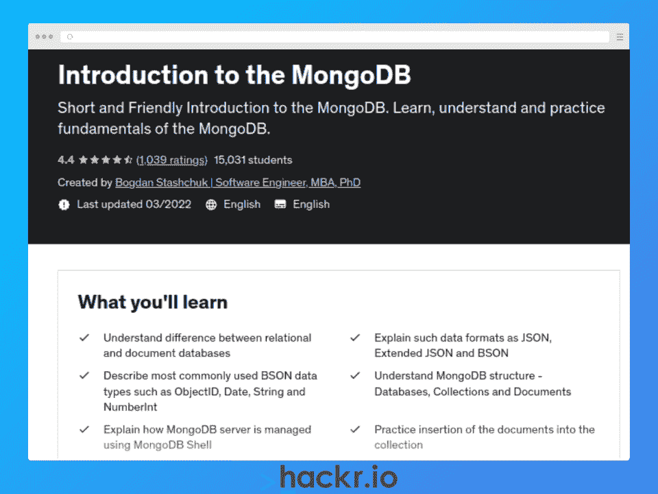](https://click.linksynergy.com/deeplink?id=jU79Zysihs4&mid=39197&murl=https%3A%2F%2Fwww.udemy.com%2Fcourse%2Fintroduction-to-the-mongodb%2F)

[了解更多信息](https://click.linksynergy.com/deeplink?id=jU79Zysihs4&mid=39197&murl=https%3A%2F%2Fwww.udemy.com%2Fcourse%2Fintroduction-to-the-mongodb%2F)

**我们为什么选择本课程**

这个 MongoDB 在线课程是一个全面的介绍，让初学者在深入了解 MongoDB 的基本知识(如 BSON 数据、MongoDB server & shell、查询和数据库结构)之前，先了解关系数据库和文档数据库之间的区别。

该课程设计在 2 小时内完成，您将学习如何使用 MongoDB，甚至涵盖聚合和索引等高级主题。

**优点**

*   易于学习的课程和练习
*   初学者综合入门
*   还涵盖了聚合、索引和外部驱动因素等高级主题

**缺点**

*   快速入门，所以可能需要补充额外的学习

**关键信息**

**先决条件:**无

教练:波格丹一世·斯塔什丘克

**等级:**初学者

**免费或付费:**付费

**证书:**是

**时长:** 1.5 小时(视频内容)

[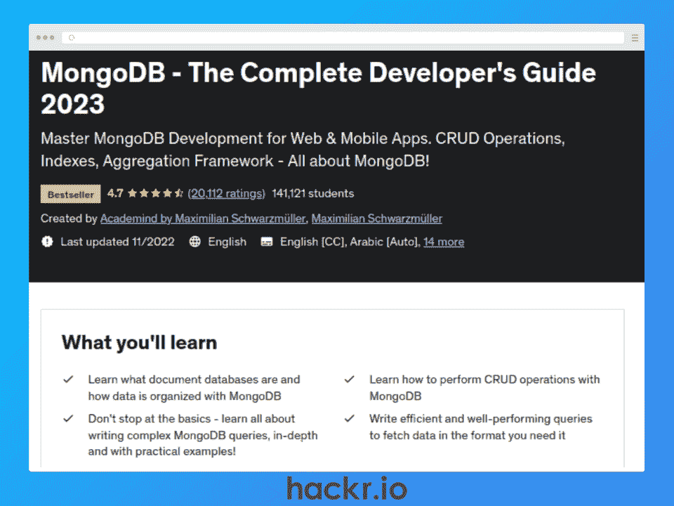](https://click.linksynergy.com/deeplink?id=jU79Zysihs4&mid=39197&murl=https%3A%2F%2Fwww.udemy.com%2Fcourse%2Fmongodb-the-complete-developers-guide%2F)

[了解更多信息](https://click.linksynergy.com/deeplink?id=jU79Zysihs4&mid=39197&murl=https%3A%2F%2Fwww.udemy.com%2Fcourse%2Fmongodb-the-complete-developers-guide%2F)

**我们为什么选择本课程**

这个 MongoDB 培训是一个全面的方法，适合所有初学者学习 NoSQL、文档数据库，当然还有 MongoDB 的基础知识。

您将了解 MongoDB 如何组织数据、基本的 CRUD 操作、模式、Mongo Shell、MongoDB Compass、复杂查询、数据获取效率、聚合框架等等。你还将编写代码，这意味着你将获得大量的实践机会。

**优点**

*   完全初学者的全面介绍
*   动手编码练习
*   涵盖高级主题和查询

**缺点**

*   一些内容需要在 2023 年更新

**关键信息**

**先决条件:**无

**讲师:**maximilin black fill er

**等级:**初学者

**免费或付费:**付费

**证书:**是

**时长:** 17.5 小时(视频内容)

[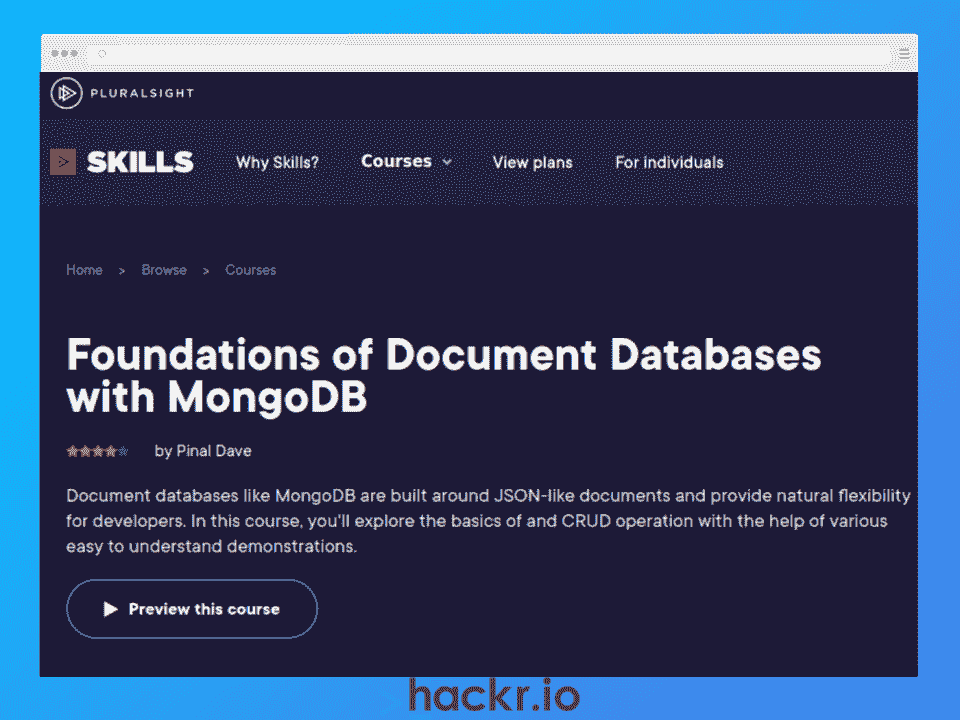](https://pluralsight.pxf.io/NK53rv)

[了解更多信息](https://pluralsight.pxf.io/NK53rv)

**我们为什么选择本课程**

这是完全初学者的理想选择，本课程将教你使用 MongoDB 的 NoSQL 的基础。您将了解什么是文档数据库，它与 SQL 关系数据库有何不同，为什么以及何时使用 MongoDB，以及如何执行基本的 CRUD 操作。

这本书只有 2.5 个小时，包括示例代码，是一个很好的选择，可以激起你学习 MongoDB 和 NoSQL 的兴趣，同时获得你现在可以应用的真正技能。

**优点**

*   完全初学者的基础知识
*   了解 NoSQL 数据库和 SQL 数据库的区别
*   为动手实践提供代码

**缺点**

*   设计为初级课程，因此不需要额外的学习

**关键信息**

**先决条件:**无

教练:皮纳尔·戴夫

**等级:**初学者

**免费或付费:**付费

**证书:**否

**时长:** 2.5 小时(视频内容)

[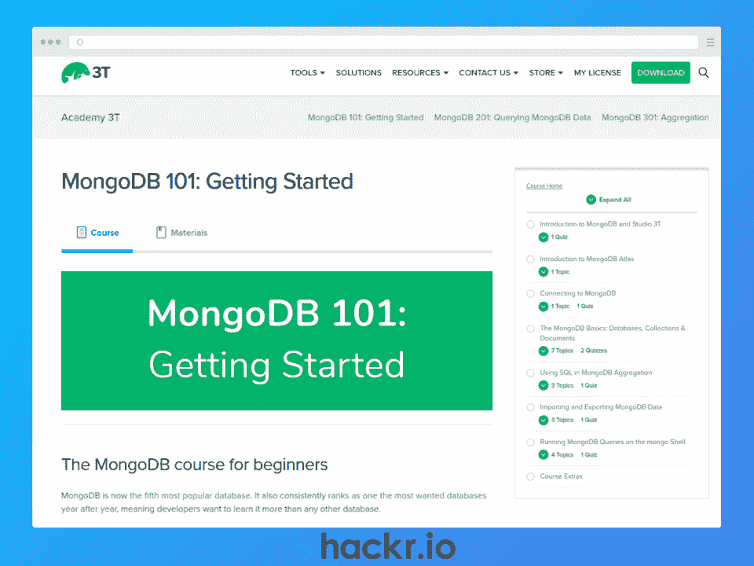](https://studio3t.com/academy/courses/mongodb-101-getting-started/)

[了解更多信息](https://studio3t.com/academy/courses/mongodb-101-getting-started/)

**我们为什么选择本课程**

就像任何 101 类一样，这个 MongoDB 类是为学习 NoSQL 基础的绝对初学者设计的。与列表中的其他课程不同，这里使用基于文本的课程，而不是视频。因此，如果你有点守旧，喜欢通过阅读来学习，这是一个很好的选择。

通过 7 个简短的 MongoDB 在线课程和每个部分之后的测验，您将快速学会在云上设置 MongoDB 数据库、创建集合、添加和删除数据库、查看数据、导入和导出提供的数据集、运行聚合查询，以及使用 Mongo shell。

**优点**

*   专为初学者快速学习而设计
*   每课后的测验和关键术语
*   为动手实践提供代码和数据集

**缺点**

*   基于文本，所以可能不适合喜欢视频的人

**关键信息**

**先决条件:**无

**指导老师:** 3T 学院

**等级:**初学者

**免费或付费:**免费

**证书:**否

**持续时间:**自定进度&基于文本的课程

[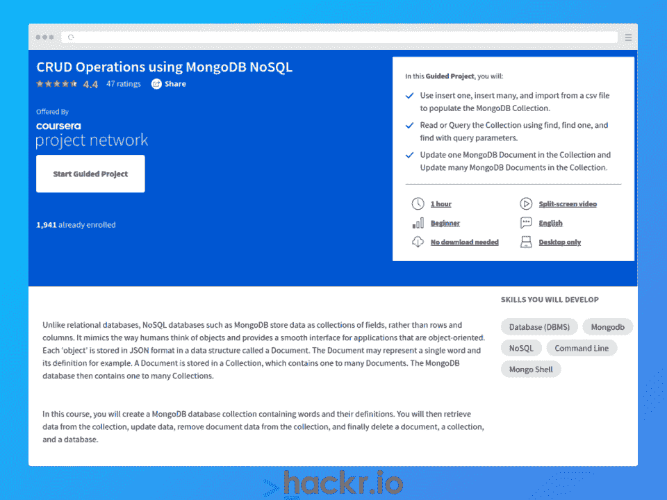](https://imp.i384100.net/YgX3Jm)

[了解更多信息](https://imp.i384100.net/YgX3Jm)

**我们为什么选择本课程**

如果你喜欢边做边学，这个指导项目是学习 MongoDB 的一步一步的迷你课程。您将学习在检索、更新、移除和删除文档数据之前创建一个 MongoDB 数据库集合，帮助您学习 NoSQL 和 MongoDB 的 CRUD 基础知识。因为只需要 1 个小时就可以完成，所以这是学习基础知识的好方法。

**优点**

*   学习 MongoDB 基础知识的实用方法
*   分屏视频有助于加快学习速度

**缺点**

*   简介，所以可能需要补充学习

**关键信息**

**先决条件:**无

教练:大卫·达尔斯温

**等级:**初学者

**免费或付费:**付费

**证书:**否

**时长:** 1 小时(引导式项目)

[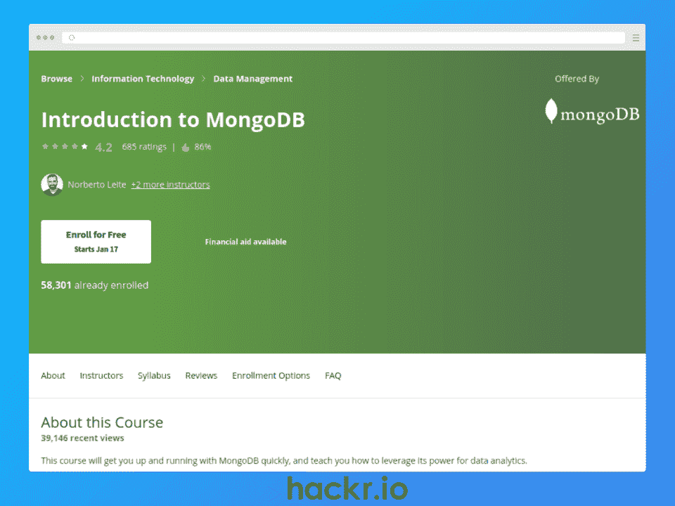](https://imp.i384100.net/vn5q7O)

[了解更多信息](https://imp.i384100.net/vn5q7O)

**我们为什么选择本课程**

如果你想学习 MongoDB 的基础知识并更深入一点，这是 Coursera 的一个很好的选择。

您将了解 MongoDB 的核心特性，包括文档数据模型、CRUD API 和聚合框架。您还将通过动手实验和互动测验获得实践经验，从而巩固您的知识。

*请注意，该课程将于 2023 年 4 月停止招收新生。*

**优点**

*   针对 Atlas、Compass 和命令行实用程序的深入学习
*   动手实践和演示应用
*   来自经验丰富的讲师的专家指导

**缺点**

*   不涵盖分布式系统或数据库性能等高级主题

**关键信息**

**先决条件:**无

导师:诺贝托·莱特，香农·布拉德肖，&科比·科尔摩根

**等级:**中级

**免费或付费:**付费

**证书:**是

**时长:** 17 小时(视频内容)

[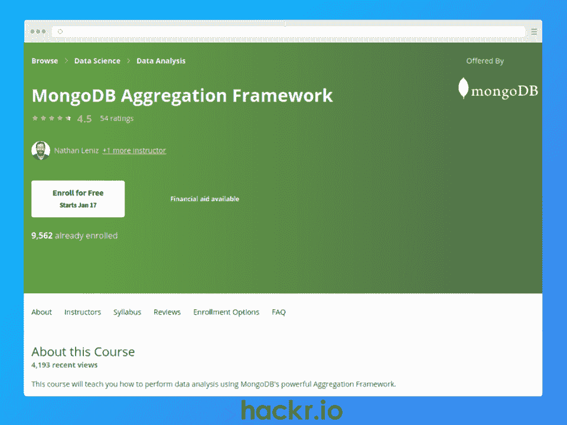](https://imp.i384100.net/MXP393)

[了解更多信息](https://imp.i384100.net/MXP393)

**我们为什么选择本课程**

如果您了解 MongoDB 的基础知识，并准备好利用聚合框架的强大功能，那么这就是开始的地方。

您将学习使用聚合框架来询问关于数据的复杂问题，同时深入研究模式设计、关系数据迁移和机器学习。

**优点**

*   使用聚合框架进行数据处理和分析
*   通过指导练习和代码演练进行实践
*   在生产中使用 MongoDB 的技巧

**缺点**

*   假设 MongoDB 知识，所以可能在某些方面是简短的

**关键信息**

**先决条件:**无

教练:内森·勒尼兹&科比·科尔摩根

**等级:**中级

**免费或付费:**付费

**证书:**是

**时长:** 19 小时(视频内容)

[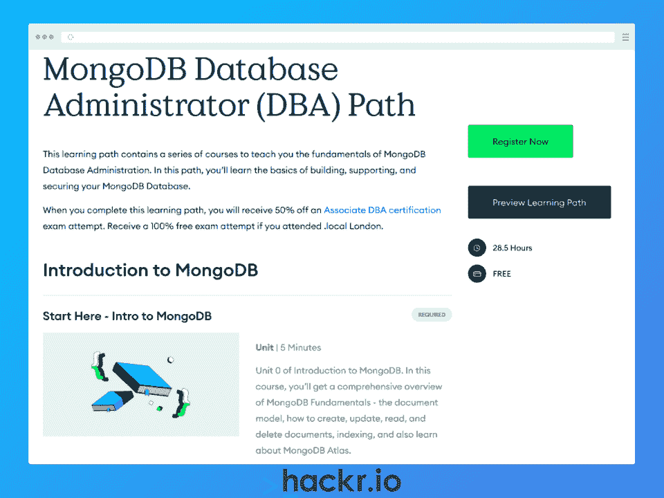](https://learn.mongodb.com/learning-paths/mongodb-associate-database-administrator-path)

[了解更多信息](https://learn.mongodb.com/learning-paths/mongodb-associate-database-administrator-path)

**我们为什么选择本课程**

如果你的目标是成为一名 MongoDB 数据库管理员(DBA ),那么这条学习道路非常适合你。

您将遵循 MongoDB 创建者的深入学习路径，包括 MongoDB 基础知识的一套全面的 Mongo 类，包括 CRUD 操作、聚合、索引、Atlas 搜索、数据建模和事务。然后，您就可以开始进行集群管理、身份验证、身份验证、优化和调试了。

**优点**

*   完全免费！
*   MongoDB 基础知识的综合实践课程
*   了解数据库管理细节，如集群管理、调试等

**缺点**

*   大量的时间投入，但是如果您计划成为一名 DBA，这是值得的

**关键信息**

**先决条件:**无

**指导老师:** MongoDB 大学

**等级:**初级到中级

**免费或付费:**免费

**证书:**否

**时长:** 28.5 小时(视频内容)

[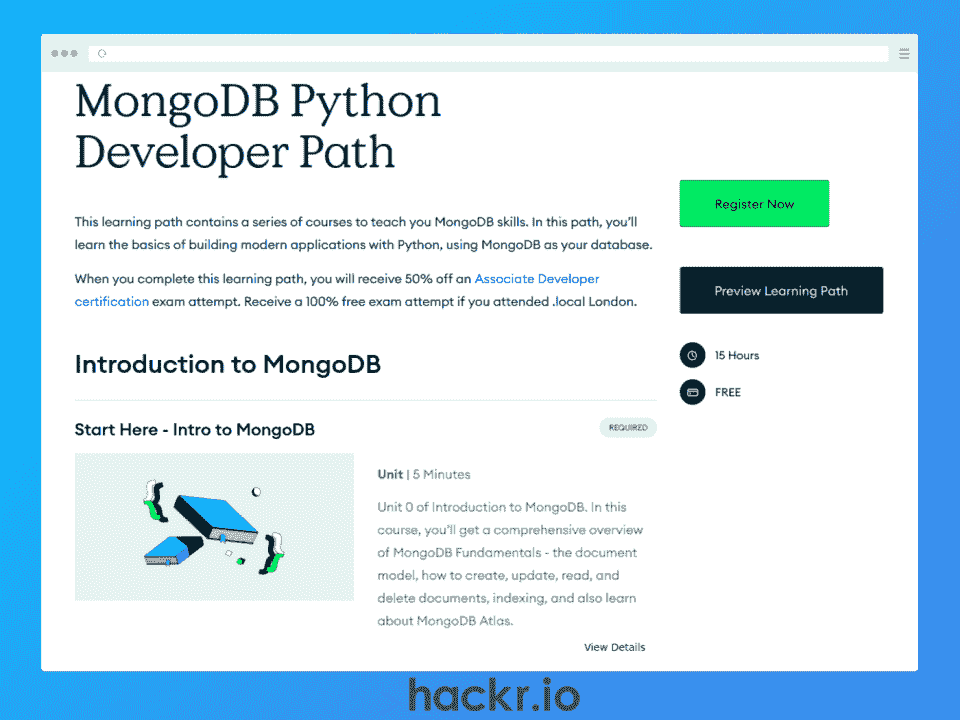](https://learn.mongodb.com/learning-paths/mongodb-python-developer-path)

[了解更多信息](https://learn.mongodb.com/learning-paths/mongodb-python-developer-path)

**我们为什么选择本课程**

如果您有 Python 经验，并且希望在您的应用程序中使用 MongoDB，那么 MongoDB 大学的这条学习路径是一个可靠的选择。

首先，您将获得 MongoDB 基础方面的深入知识和技能，包括 CRUD 操作、聚合和索引、数据建模、事务等方面的实践。

一旦掌握了 MongoDB，就该连接 Python 了。然后，您将学习使用 MongoDB Python 客户机执行 CRUD 操作和聚合。

**优点**

*   完全免费！
*   深入的课程涵盖 MongoDB 基础知识
*   学习连接 Python 应用程序进行 CRUD 和聚合

**缺点**

*   假设 Python 技能，所以可能很难跟随没有

**关键信息**

**先决条件:** Python 知识

**指导老师:** MongoDB 大学

**等级:**中级

**免费或付费:**免费

**证书:**否

**时长:** 15 小时(视频内容)

[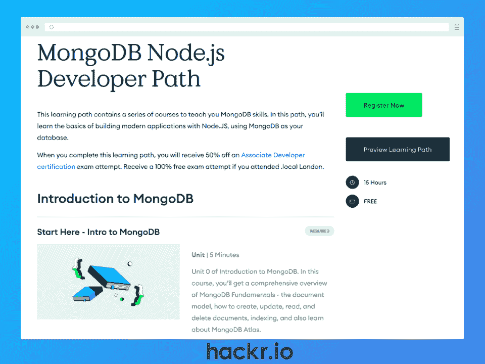](https://learn.mongodb.com/learning-paths/mongodb-nodejs-developer-path)

[了解更多信息](https://learn.mongodb.com/learning-paths/mongodb-nodejs-developer-path)

**我们为什么选择本课程**

如果您想在 Node.js 和 JavaScript 应用程序中使用 MongoDB 数据库，这是一个很好的选择。

虽然本课程假设您已经掌握了节点和 JavaScript 技能，但它仍然不遗余力地提供了一组详细的课程来涵盖 MongoDB 基础知识，包括基本的 CRUD 操作、聚合、索引、数据建模等等。

然后，您将收到关于使用驱动程序将 MongoDB 数据库连接到 Node.js 的详细说明，让您了解 BSON 文档、CRUD 操作以及 MongoDB 和 Node.js 的聚合

**优点**

*   完全免费的内容！
*   MongoDB 基础知识的实践和深入课程
*   学习连接 Node.js 应用程序进行 CRUD 和聚合

**缺点**

*   假设您已经知道 JavaScript & Node.js

**关键信息**

**必备:** Node.js & JavaScript 知识

**指导老师:** MongoDB 大学

**等级:**中级

**免费或付费:**免费

**证书:**否

**时长:** 15 小时(视频内容)

[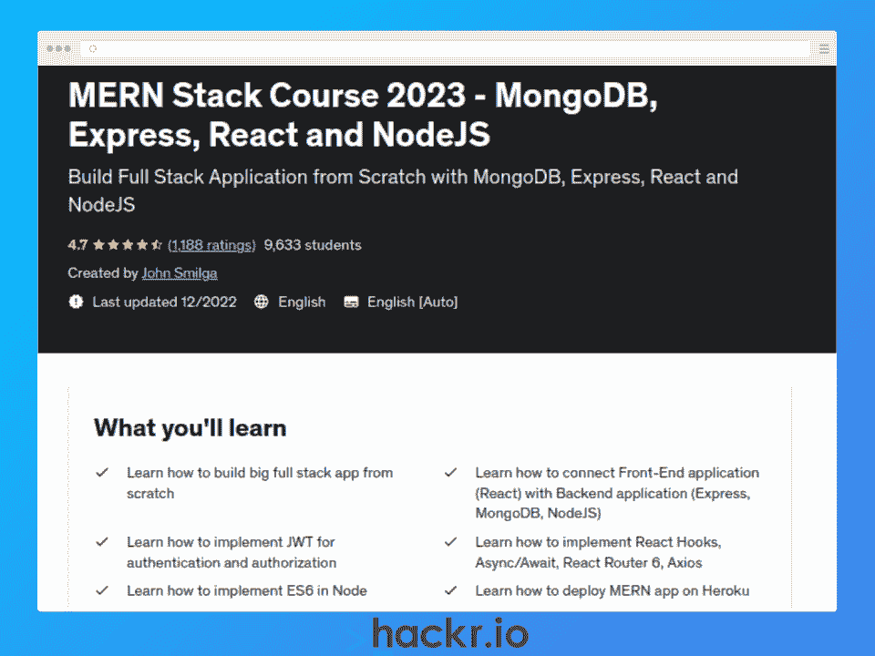](https://click.linksynergy.com/deeplink?id=jU79Zysihs4&mid=39197&murl=https%3A%2F%2Fwww.udemy.com%2Fcourse%2Fmern-stack-course-mongodb-express-react-and-nodejs%2F)

[了解更多信息](https://click.linksynergy.com/deeplink?id=jU79Zysihs4&mid=39197&murl=https%3A%2F%2Fwww.udemy.com%2Fcourse%2Fmern-stack-course-mongodb-express-react-and-nodejs%2F)

**我们为什么选择本课程**

作为我们列表中最高级的课程，这是针对希望在 MERN 堆栈(MongoDB、Express、React 和 Node.js)中使用 MongoDB 的有抱负的全堆栈开发人员的。

如果这听起来很有趣，并且您已经有了 JavaScript、Express、Node 和 React 方面的经验，那么这是学习如何使用 MongoDB 从头开始构建全栈应用程序的绝佳方式。

您将涉及的一些主题包括使用 React 从头创建一个前端应用程序，使用 Node.js 从头创建一个服务器应用程序，在云中设置一个 MongoDB 数据库，连接一个 MERN 应用程序&部署到 Heroku，实现错误处理，等等。

**优点**

*   最新内容
*   创建 MERN 应用程序的综合分步材料
*   免费的 YouTube 补充视频

**缺点**

*   高级主题假设现有知识处于中级水平

**关键信息**

**先决条件:** JavaScript、Express、Node、& React 基础知识

教练:约翰·斯米尔加

**等级:**高级

**免费或付费:**付费

**证书:**是

**时长:** 20.5 小时(视频内容)

## **结论**

对于开发人员来说，MongoDB NoSQL 数据库是一种存储数据和实现灵活模式的革命性方法，无需关系 SQL 数据库。MongoDB 为每一种流行的编码语言都提供了驱动程序，因此它通常是希望专注于构建应用程序的敏捷开发团队的首选。

我们已经涵盖了 2023 年 11 个最好的 MongoDB 在线课程，为完全初学者提供了高级课程，为有经验的开发人员提供了高级课程。因此，在 2023 年，无论你在哪里，都有一门课程可供你学习 MongoDB！

**想申请 MongoDB 的工作？结账:**

**[MongoDB 面试问题&答案](https://hackr.io/blog/mongodb-interview-questions)**

## **常见问题解答**

#### **1。MongoDB 课程免费吗？**

在我们的列表中有一系列学习 MongoDB 的免费课程，包括 3T 学院和 MongoDB 大学提供的课程。

#### **2。MongoDB 难学吗？**

这取决于您当前的技能水平，但是如果您熟悉 JSON，您应该不会觉得学习 MongoDB 和 NoSQL 的数据库方法太难。

#### **3。MongoDB 有需求吗？**

对 MongoDB 技能的需求非常大，像[福布斯和丰田](https://www.mongodb.com/who-uses-mongodb)这样的知名公司采用 MongoDB 就凸显了这一点。

**人也在读:**