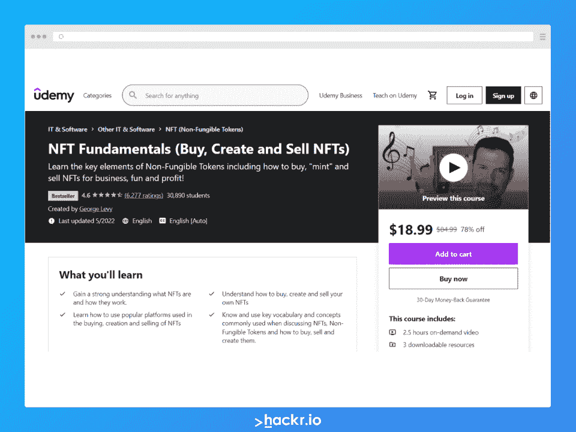
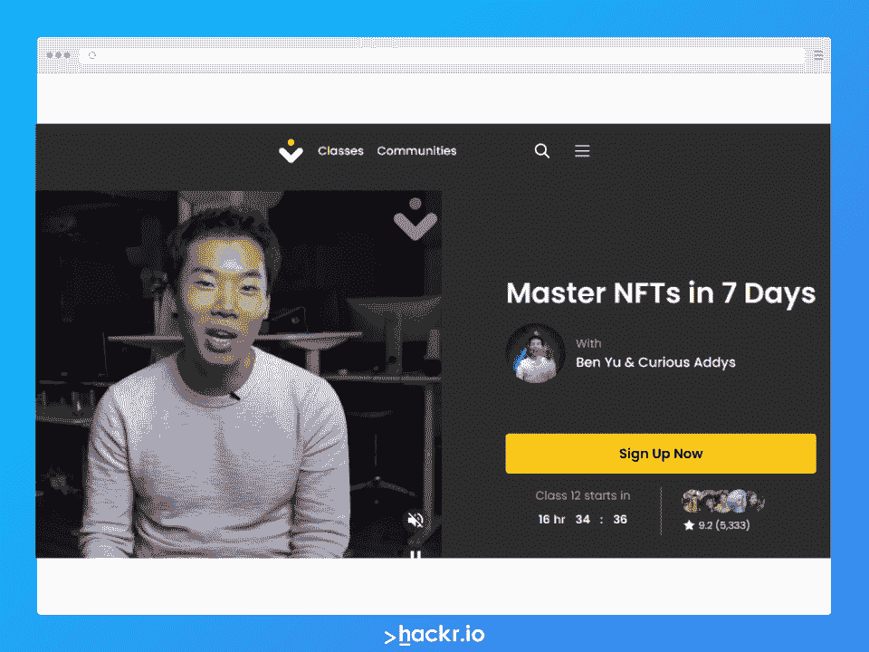
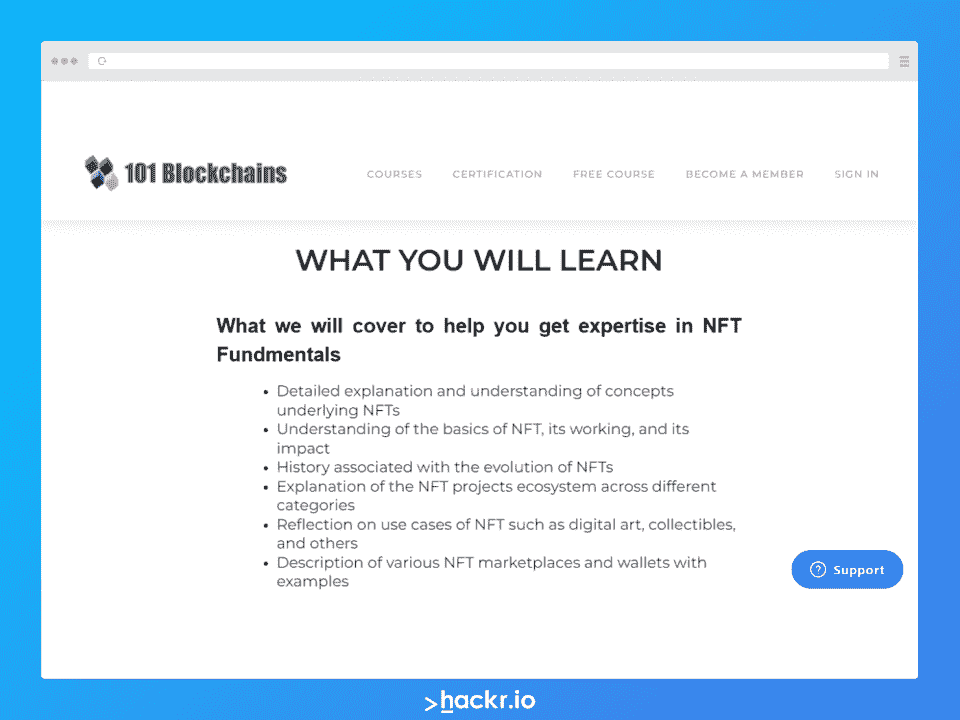
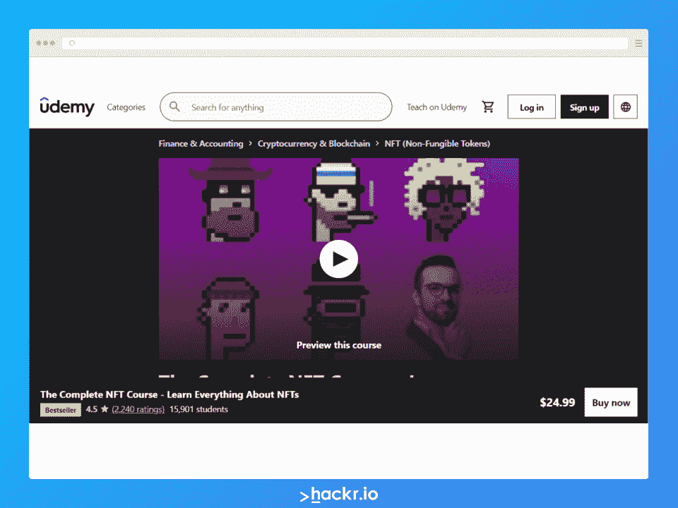
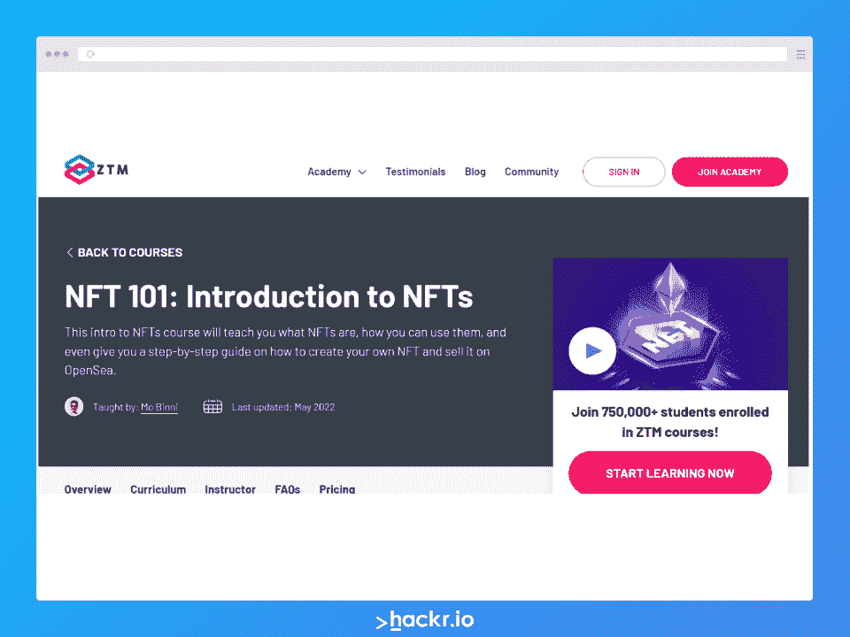
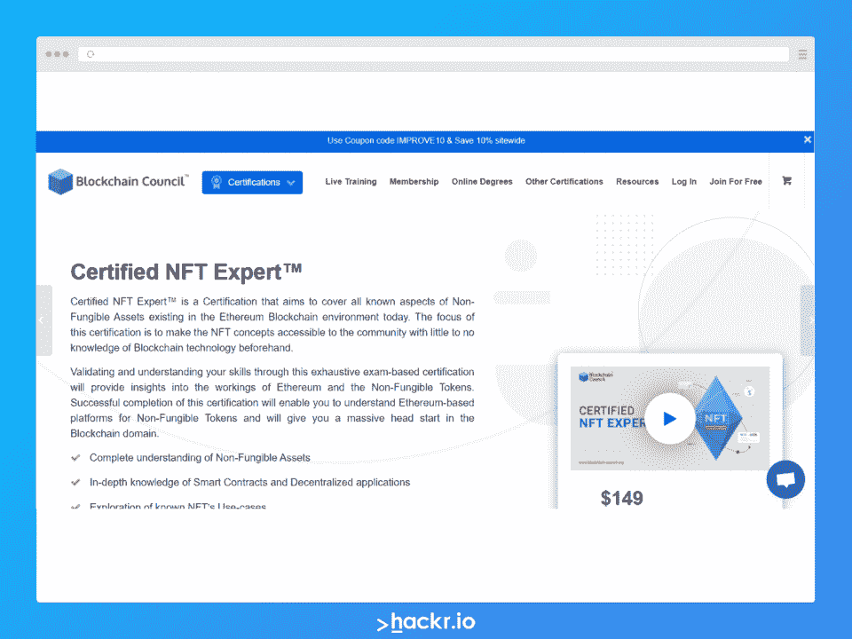
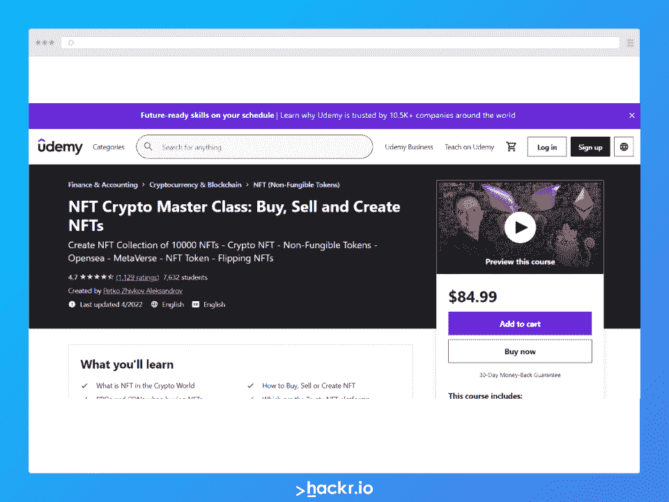
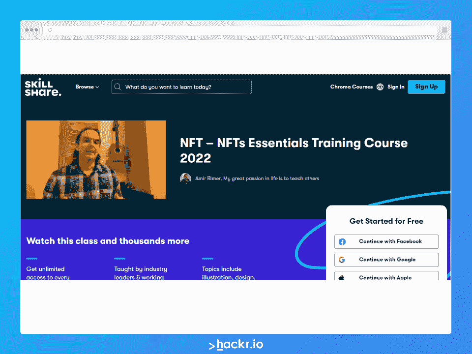
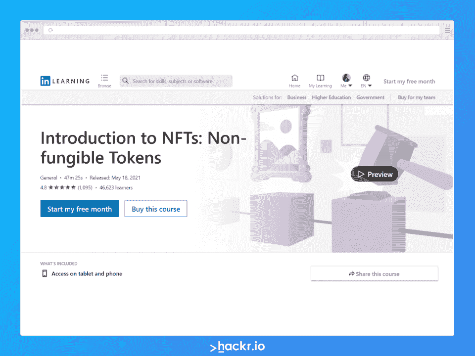
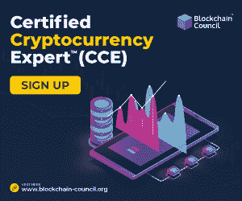

# 你应该在 2023 年查看的 NFT 顶级在线课程

> 原文：<https://hackr.io/blog/best-nft-courses>

随着不可替代代币(NFT)的世界继续增长和发展，对 NFT 专家的需求也在增长和发展。对一些人来说，NFTs 的整个概念可能很难理解。但是，就其核心而言，这是一项易于使用的技术。幸运的是，许多 [NFT 课程](https://click.linksynergy.com/deeplink?id=jU79Zysihs4&mid=39197&murl=https%3A%2F%2Fwww.udemy.com%2Ftopic%2Fnft-non-fungible-tokens%2F)可以在网上找到，帮助你学习 NFT 编程，开发你自己的 NFT，甚至只是投资 NFT 市场。

如果你想了解 NFT 技术的一切，它是如何工作的，为什么它有价值，你只需要从我们的列表中选择一门 NFT 课程！我们已经创建了 2023 年最佳 NFT 课程的完整列表，无论你是想成为专家还是只想了解最具颠覆性的全球技术之一。

## 什么是 NFT？

任何针对初学者学习 NFT 的课程都必须以对什么是 NFT 的透彻解释开始。简而言之，NFT 是一种不可替代的令牌，它代表了某种独特的东西，因此不能被另一个项目所替代，即使是完全相同的项目。最好的 NFT 课程不仅会解释底层技术，还会解释其使用案例。

将 NFT 视为交易收据。NFT 可以记录你购买一件物品的时间和金额。这种交易的影响非常广泛。今天，你可以用 NFT 来转让艺术品、房地产和汽车，甚至持有合同。明天，谁知道未来会怎样？

## **2023 年 NFT 最佳球场**

从有经验的 NFT 开发者到完全的初学者，再到 NFT 编程，一个 NFT 课程可以成为一个职业生涯的起点。我们相信最好的 NFT 课程是全面的、直观的和相关的。虽然 NFT 技术最初可能会感到困惑，但你可以在一个小时内学会基本知识。

考虑到这一点，我们对 NFT 课程的首选是:

这些平易近人的课程提供了可操作的信息，帮助你在快速发展的 NFT 行业中迅速起步。

让我们深入了解一下。

[****](https://click.linksynergy.com/deeplink?id=jU79Zysihs4&mid=39197&murl=https%3A%2F%2Fwww.udemy.com%2Fcourse%2Fnft-fundamentals)

在一个简短的视频课程中，学习你需要知道的关于如何购买、创建和销售 NFT 的一切。

在这门课上，初学者将学习什么是 NFT，如何使用流行的 NFT 平台，如何创建 NFT，以及如何销售 NFT。本课程包括 2.5 小时的视频教学、三个可下载的资源和一个结业证书。学生将通过实践 NFT 练习，区块链的基础，以及一个六步，易于遵循的公式来建立，创造和销售 NFT。

**体验**:初级| **评分** : 4.6/5.0 | **时长** : 2.5 小时| **价格**:18.99 美元

[在此注册](https://click.linksynergy.com/deeplink?id=jU79Zysihs4&mid=39197&murl=https%3A%2F%2Fwww.udemy.com%2Fcourse%2Fnft-fundamentals)

[****](https://nasacademy.com/BenYuNFT) 

这个为期 7 天的课程将带您了解 NFT 技术的基本知识，包括如何购买、销售和铸造 NFT。

本宇的硕士非母语教学 7 天课程是一个节奏良好的 20 小时的非母语教学基础课程。学生将学习为什么 NFT 有价值，如何开始，如何交易 NFT，如何购买正确的 NFT，如何铸造 NFT，以及不同类型的 NFT。在本课程结束时，学生将全面了解如何使用和创建 NFT。

**体验**:初学| **评分** : 9.2/10.0 | **时长** : 7 天|价格:$249

[在此注册](https://nasacademy.com/BenYuNFT)

向 101 区块链的成员提供全面的 NFT 基础课程，非常适合那些想要全面了解 NFT 如何工作以及如何使用它们的人。

101 区块链提供这种只对会员开放的 NFT 基础课程，共有八个模块。学生将学习 NFT 的基础和历史，使用案例，NFT 市场，等等。完成本课程后，学生应该能够创建、购买和销售 NFT，并轻松浏览用于交易的市场。

**体验**:初级| **时长** : 3 小时| **价格**:25 美元/月

[在此注册](https://academy.101blockchains.com/courses/nft-fundamentals?sscid=51k6_6qomq&)

*在一个 4.5 小时的课程中，了解 NFT 用例、智能合同、铸造、存储、投资等一切。*

作为一门特别强大的一体化课程，这门课程广泛涵盖了许多其他 NFT 基础课程仅涉及的主题。您将学习如何:

*   避免 NFT 骗局
*   如何投资 NFTs
*   如何管理加密钱包
*   如何开发智能合同
*   如何将您的 NFT 连接到 IPFS 存储以获得更好的安全性。

**体验**:中级| **评分** : 4.5/5.0| **时长** : 4.5 小时| **价格**:24.99 美元

[在此注册](https://click.linksynergy.com/deeplink?id=jU79Zysihs4&mid=39197&murl=https%3A%2F%2Fwww.udemy.com%2Fcourse%2Fthe-complete-nft-course-learn-everything-about-nfts%2F)

通过这个循序渐进的指南，学习如何开发自己的 NFT 并在 OpenSea 上出售。

莫宾尼在这个全面的介绍中向学生讲授什么是 NFT，[区块链技术](https://hackr.io/blog/blockchain-programming-beginners-guide)和以太坊的基础知识，什么是智能合约，如何使用区块链钱包，以及如何保护 NFT。ZTM 的 NFT 101 课程对于那些刚刚开始学习非功能性语言的人来说是一个理想的课程。不仅只有一个小时左右，还包括结业证书。

**体验**:初级| **时长** : 1 小时| **价格**:39 美元/月

[在此注册](https://zerotomastery.io/courses/introduction-to-nfts/#Instructor)

*通过本专家级 NFT 课程获得 NFT 技术终身认证。*

通过这 5 个小时的课程，学生将学习并展示对 NFT 技术、智能合同和分散应用的全面理解。课程结束时，学生将知道如何将 NFT 技术应用于行业用例，市场如何运作，以及如何个人开发 NFT。这个认证过程对于初学者(他们将在整个附加课程中学习 NFTs 如何工作)和专家(他们想证明他们的知识)来说都是完美的。

**体验**:专家| **时长** : 5 小时| **价格**:149 美元

[在此注册](https://www.blockchain-council.org/certifications/certified-nft-expert/)

了解更多关于 NFT 市场在现实世界中如何运作以及如何从 NFT 技术中获利的信息。

本课程主要关注 NFT 技术的实际应用。学生将学习什么是 NFT，如何创建 10，000 个 NFT，如何用 NFT 赚钱，以及哪些 NFT 平台是最值得信赖的。对于希望从 NFT 商业模式中赚钱的企业家和初创企业主来说，这是一门理想的加密课程。

**体验**:中级| **评分** : 4.7/5.0 | **时长** : 7 小时| **价格**:84.99 美元

[在此注册](https://click.linksynergy.com/deeplink?id=jU79Zysihs4&mid=39197&murl=https%3A%2F%2Fwww.udemy.com%2Fcourse%2Fnft-crypto-buy-sell-create%2F)

这个高度详细的 60 节课的课程将教你关于 NFT 和区块链技术的所有知识。

Amir Rimer 带领学生创建和交易 NFT，发展 NFT 艺术，在数字市场上销售 NFT，等等。这个综合课程包括 11 个小时的材料，巧妙地涵盖了学术和实践经验的范围。学完这门课程后，学生将知道如何在各种流行的平台上创作和销售 NFT 艺术品。

**体验**:初级| **时长** : 11 小时| **价格**:32 美元/月

[在此注册](https://skillshare.eqcm.net/DVdEnd)

由一位获奖的技术领导者主持(并提供结业证书)，这一一体化的 NFT 课程是初学者的理想选择。

了解什么是可替代和不可替代的令牌，NFT 与比特币和区块链的关系，如何创建 NFT，以及 NFT 在未来的技术中可能扮演的角色。这篇 NFTs 介绍非常适合希望更好地理解该技术的初学者；完整的初级读本不到一个小时，涵盖了初学者需要知道的基础知识。

**体验**:初学| **评分** : 4.8/5.0 | **时长** : 47 分钟| **价格**:29.99 美元

[在此注册](https://linkedin-learning.pxf.io/rnNvO3)

## **如何在线选择最好的 NFT 课程**

网上有这么多 NFT 课程，你如何选择合适的呢？当你浏览我们的最佳 NFT 课程列表时，请记住几个因素。

*   经验:如果你是 NFTs 领域的新手，一门涵盖 NFT 技术基础的课程是一个很好的起点。另一方面，如果你以前从未接触过 NFTs，你可能需要先免费学习一门基本的 NFT 课程。
*   预算:不同价位的课程都有。你可以在网上免费找到一个基本的 NFT 课程，或者支付数百元进行全面的 NFT 培训。
*   **学习风格**:有些人通过观看视频或阅读 NFT 教程来学习 NFT 技术，而另一些人则更喜欢互动练习。

NFT 技术很难理解，主要是因为第一个障碍。通过找到最适合你的课程和教训，你可以更快地开始使用和开发 NFTs。

## **其他伟大的 NFT 球场**

我们列出了各种各样的课程，涵盖了购买、销售和创建 NFT 的基础知识。但是 NFT 技术是一个广阔且不断增长的市场。有些 NFT 课程很棒，但是很专业——这些课程对你是否有用取决于你的侧重点。

荣誉奖:

## **结论**

在加密货币领域和更广泛的金融领域，NFT 是一个热门话题。如果你想领先一步，可以考虑 NFT 课程，甚至是 NFT 认证。您不仅将学习如何创建和销售 NFT，还将更好地理解如何将 NFT 应用于各种行业和 NFT 编码。

无论经验水平或预算如何，总有一门 NFT 课程适合你。

有兴趣了解更多关于区块链技术的信息吗？探索[最佳区块链课程](https://hackr.io/blog/best-blockchain-courses)或学习这些[区块链教程](https://hackr.io/tutorials/learn-blockchain)。

## **常见问题解答**

#### **1。NFT 需要编码吗？**

不，但是有帮助。你不需要成为一个程序员或者有任何编码经验来创建一个 NFT。然而，如果你想创建更复杂的 NFT，或者如果你想使用智能合约，那么你将需要一些编程技巧，也许还需要一门 NFT 编码课程。

#### **2。NFT 好学吗？**

是的，NFT 很容易学。网上有很多很棒的课程和教程可以帮助你开始使用 NFTs。

#### **3。我怎样才能学会 NFT？**

学习 NFT 的最好方法是参加在线课程、辅导或训练营。一旦你对自己的 NFT 知识有信心，你就可以获得 NFTs 认证。自学 NFTs 是可能的——但是你不想犯任何代价高昂的错误！

#### **4。哪里可以交易 NFT？**

NFT 可以在许多不同的平台上交易，包括 OpenSea、Rarible 和 SuperRare。你也可以在 Uniswap 这样的分散式交换机上找到 NFT。从技术上来说，非金融交易可以在任何地方由任何人进行交易，但平台和交易所使得这一过程对用户友好。

**人也在读:**