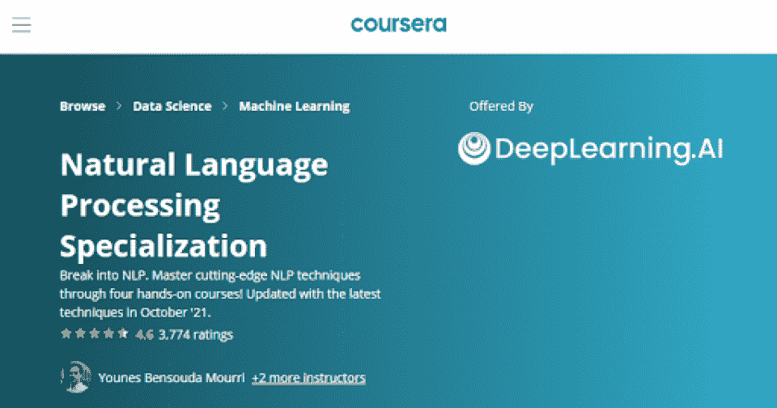
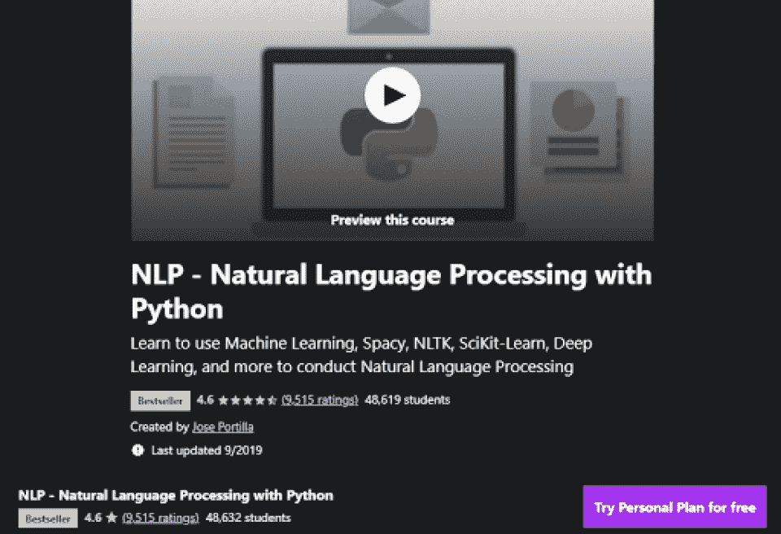
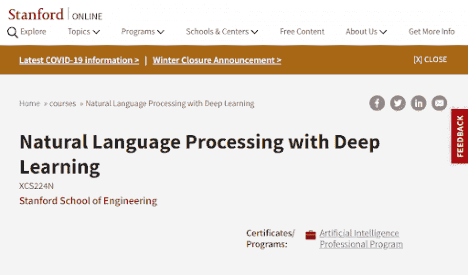
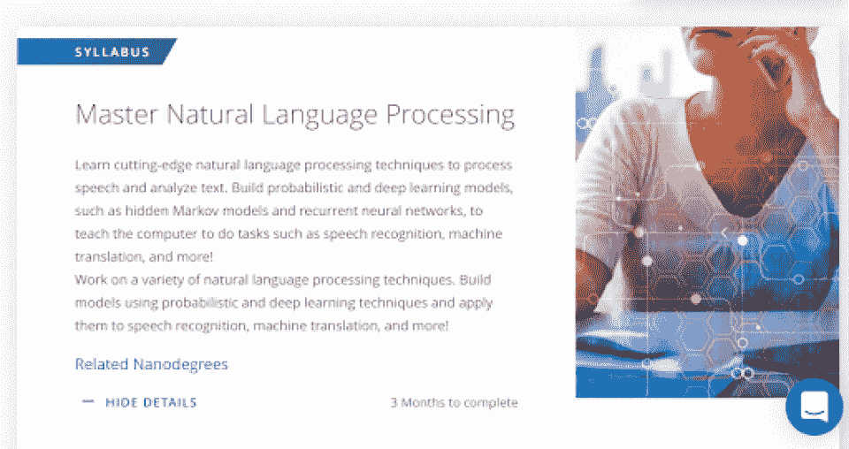
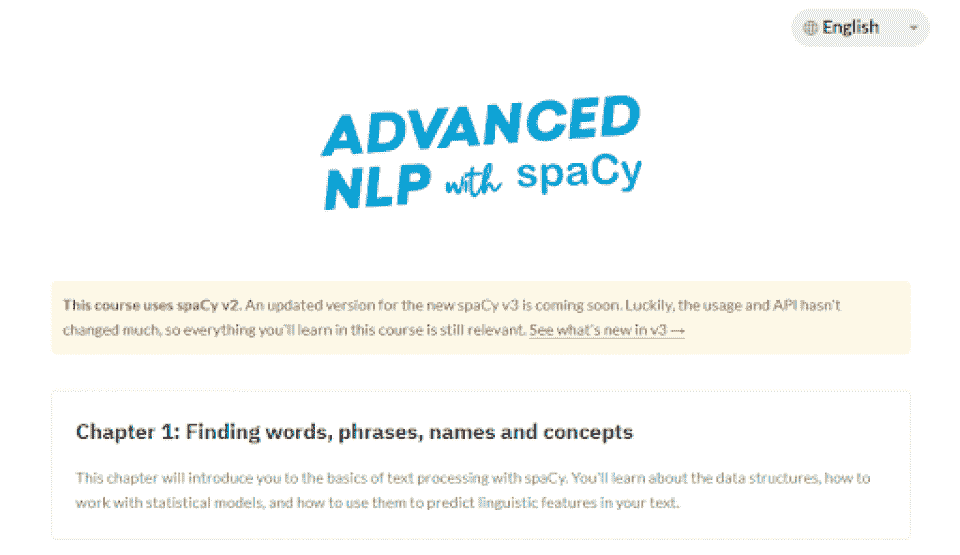
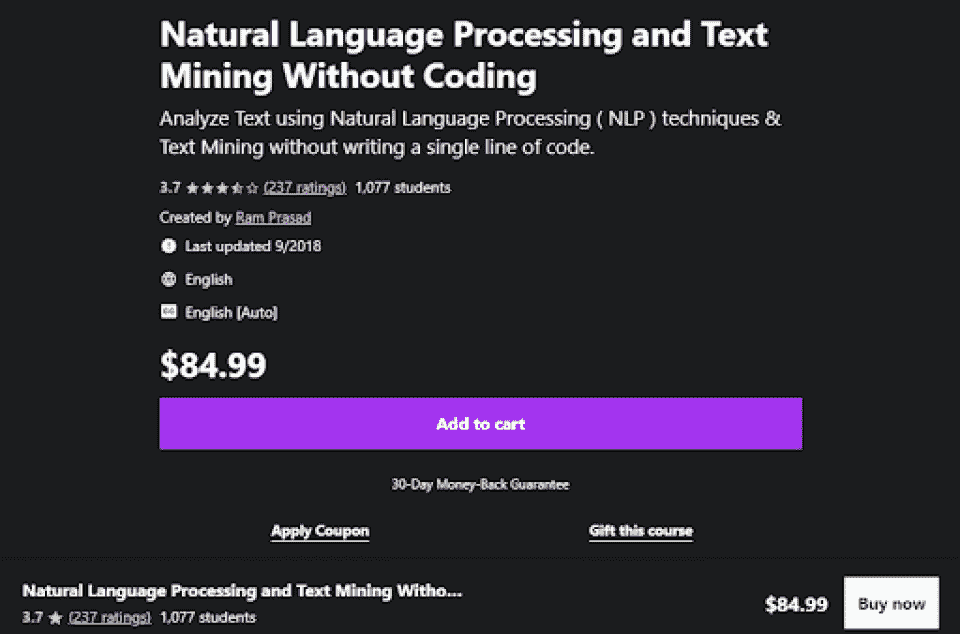
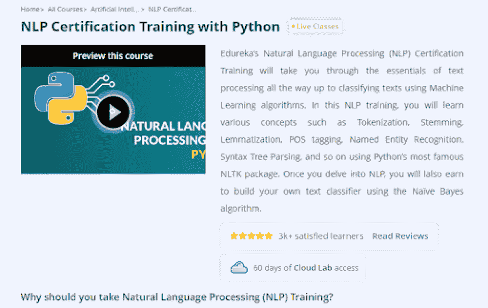
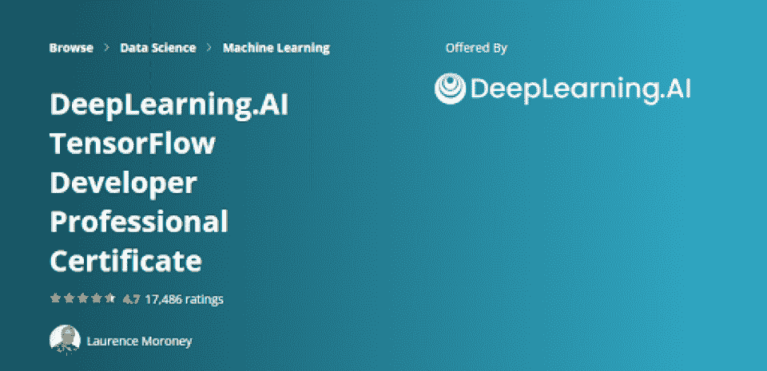
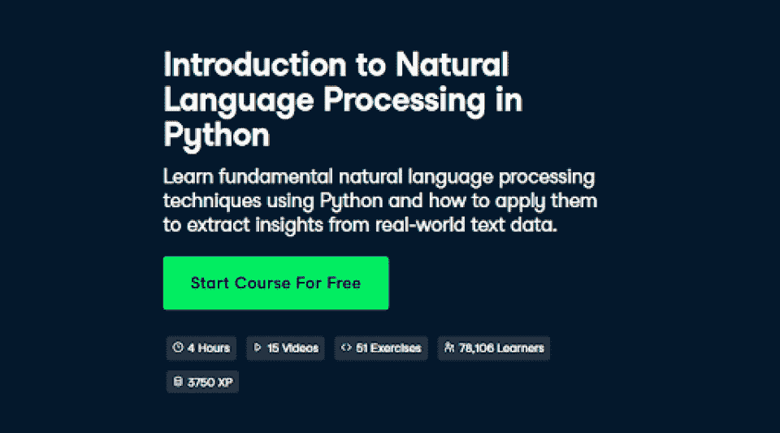
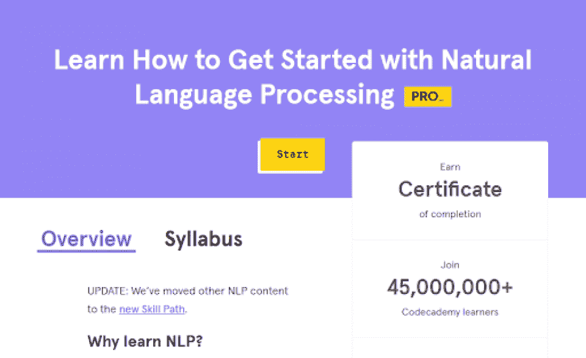

# 学习自然语言处理的 10 门最佳自然语言处理课程

> 原文：<https://hackr.io/blog/best-nlp-courses>

如果你想学习自然语言处理，上几门初级的 NLP 课程是最好的入门方式。NLP 程序将带你通过自然语言处理的基础，甚至可以导致 NLP 认证。

根据 GlassDoor 的数据， [NLP 的平均工资是 124，000 美元](https://www.glassdoor.com/Salaries/nlp-salary-SRCH_KO0,3.htm)——这并不奇怪。自然语言处理是计算机科学中一个特殊而复杂的学科。这也是计算机科学、数据科学，甚至市场营销领域非常抢手的技能。

今天，我们将看看目前最好的 10 门 NLP 课程。

## **为什么要学习自然语言处理？**

处理自然语言具有独特的挑战性。人们说话的方式是计算机无法自然理解的。

今天，NLP 用于用户界面、人工智能算法和大数据挖掘。如果计算机能够处理自然语言，就可以从数据中收集更多的见解和模式。

例如，法律机器学习算法可以梳理大量电子邮件，以标记可能与诉讼相关的数据。或者，营销算法可以梳理评论和评论，以分析情绪和意图。

**Python** 是自然处理语言最流行的方法。通过正确的 NLP 培训，你可以推进你作为程序员、营销人员或数据科学家的职业生涯。

## 在自然语言处理课程中，你应该寻找什么？

当我们查看“最佳中的最佳”自然语言处理课程时，我们提出了几个问题:

*   多长时间？有些人想要速成课程(少于几周)，而有些人想要深入课程(接近几个月)。
*   它包括什么？自然语言处理可以从非常初级的材料到非常高级的材料。
*   它是用什么语言写的？有些课程涵盖自然语言处理的基本原理，有些则专门涵盖 Python 等语言。
*   它提供认证吗？如果你对自然语言领域感兴趣，证书可以帮你找到工作。
*   它有现场指导吗？ 有些人更喜欢自己学习，而有些人则更喜欢一点帮助。

考虑到这一点，我们现在可以深入了解自然语言处理的一些最佳认证和课程。这些课程分布在初级、中级和高级课程中，有的课程短至一小时，有的课程长达三个月。

## **学习自然语言处理的 10 门最佳自然语言处理课程**

**持续时间:** 4 个月

**难度:**中级

就数据而言，Coursera 的自然语言处理专业涵盖了 NLP 的复杂性。这包括逻辑回归、朴素贝叶斯、词向量、情感分析、完全类比和神经网络。对于那些想了解更多的人来说，Coursera 有一系列广泛的自然语言处理课程，这些课程也由 DeepLearning.AI 提供。

深度学习。AI 是一家致力于教授程序员更多关于人工智能、神经网络和 NLP 的公司。那些对机器学习或人工智能感兴趣的人可以[查看他们的课程](https://www.deeplearning.ai/programs/)以确定他们喜欢的学科。

| **优点****✔** 弹性作息。✔ 可分享证书。**✔** 100%在线。 | **CONS**✘高层，富有挑战性。✘不针对程序员。 |

[****](https://click.linksynergy.com/deeplink?id=jU79Zysihs4&mid=39197&murl=https%3A%2F%2Fwww.udemy.com%2Fcourse%2Fnlp-natural-language-processing-with-python%2F)

**持续时间:** 9 节，自定进度

**难度:**中级

Udemy 的 NLP 课程用 [Python 编程](https://hackr.io/blog/python-programming-language)语言向程序员介绍自然语言处理。课程包括正则表达式、词干、词汇化、可视化、Word2Vec 等等。本课程面向苹果、网飞和 Eventbrite 的员工。

Python 是自然语言处理中最流行的编程语言。专注于 Python 和 NLP 的课程将能够更快地提供更多真实世界的知识，因为许多 NLP 产品都是用 Python 编程的。

| **优点**✔自定进度的课程。✔专注于 Python。 | **CONS**✘学生资助有限公司。 |

****

**持续时间:** 2 个月

**难度:**进阶

斯坦福大学提供了一个完全在线的深度学习自然语言处理入门课程，这是一个针对那些已经精通 Python 和一些 NLP 基础知识的人的高级课程。学生将了解更多关于机器学习的知识，并将获得斯坦福大学的结业证书。对于那些想改善简历的人来说，这是最好的 NLP 在线课程，仅仅是因为斯坦福大学提供的名字识别。

当然，你也需要为这种认可付出代价。斯坦福大学的 NLP 课程是这份名单上费用较高的课程之一。

| **优点****✔** 深度学习聚焦。**✔** 基于群组的互动项目。**✔** 由斯坦福在线提供。 | **CONS**✘是一个相当昂贵的阶级✘需要先进的知识。 |

[报名参加课程](https://online.stanford.edu/courses/xcs224n-natural-language-processing-deep-learning)

[****](https://imp.i115008.net/5bqJ6o)

**持续时间:** 3 个月

**难度:**进阶

已经对自然语言处理略知一二的同学可以通过 Udacity 为期 3 个月的在线课程来掌握。学生将学习用自然语言计算和用自然语言交流。项目包括现实世界的项目和灵活的学习系统。

这是一门相当严格的课程，包括指导和职业服务。当你掌握了语言处理，一个职业顾问会和你谈论你的简历和你正在寻找的工作类型，为你提供你所在领域的指导。对于那些想转行的人来说，这是一个很好的课程。

| **优点**✔提供指导和职业服务。**✔** 适合高年级学生。 | **CONS**✘大约 399 美元一个月。✘需要 Python、统计学和机器学习方面的经验。 |

[****](https://course.spacy.io/en/)

**持续时间:**自定进度

**难度:**初学者

SpaCy 是用于 NLP 的现代 Python 库。学生可以通过一系列免费课程了解更多关于 NLP 和 SpaCy 的知识。这些课程教授 NLP、数据分析、处理管道和训练神经网络模型的基础知识。

SpaCy 是一个流行的 Python 库，所以这类似于某人学习 JavaScript 和 React。虽然不是每个人都会使用 Python 或 SpaCy，但通过高级 NLP 课程提供的材料对于只想了解更多 NLP 知识的人也很有用。

| **优点**想学空间的学生可以免费去✔。**✔** 完全自定进度且易于接近。 | **CONS**✘专门负责空间。 |

[****](https://click.linksynergy.com/deeplink?id=jU79Zysihs4&mid=39197&murl=https%3A%2F%2Fwww.udemy.com%2Fcourse%2Fmaster-natural-language-processing-nlp-text-mining-without-coding%2F%3FLSNPUBID%3DKYddkQJZ4c4%26ranEAID%3DKYddkQJZ4c4%26ranMID%3D39197%26ranSiteID%3DKYddkQJZ4c4-MMttkOzYqC7q60.9IIie9A%26utm_medium%3Dudemyads%26utm_source%3Daff-campaign)

**持续时间:**自定进度

**难度:**初学者

对于那些有兴趣学习更多 NLP 知识而不需要学习代码的人来说，这是一个非常好的初学者课程，这个自定进度的课程将教你基本的文本挖掘技能。对于那些想为非程序员学习自然语言处理课程的人来说，这是最好的在线 NLP 课程。对于营销人员和其他可能对了解更多数据背后的科学感兴趣的人来说，这是理想的选择。

也就是说，对于那些真正想用 NLP 编程的人来说，这并不是理想的课程，因为它可能看起来太高级了。本课程将更多地解释 NLP 背后的基础和理论，而不是编程或使用 NLP 算法。

| **优点****✔** 少数面向非程序员的 NLP 培训课程之一。**✔** 完全在线且灵活。**✔** 非常实惠。 | **CONS**✘不包括编程。 |

[****](https://www.edureka.co/python-natural-language-processing-course)

**持续时间:** 3 周

**难度:**中级

一个中级到高级的 NLP 认证培训课程，有现场教学。本课程包括文本挖掘概述、自然语言处理、动手编程、提取和预处理文本、分析句子结构等。这一切都以一个课堂项目结束。

一个课堂项目对那些 NLP 新手来说特别有用，因为它在学生从认证培训毕业时提供了一个文件夹。Edureka 班级的学生将获得一个证书和一个项目，然后他们可以将它们放在 Github 上。

| **优点****✔** 中级到高级 NLP 认证。**✔** 包括直播课在内的综合训练。✔一个负担得起的课程(349 美元)。 | **CONS**✘加速，现场出席。 |

[****](https://coursera.pxf.io/P0vANe)

**持续时间:**自定进度

**难度:**进阶

该课程通过 Coursera 提供，专注于深度学习。AI 的 TensorFlow。它为 TensorFlower 开发人员提供了一个专业证书，希望他们了解一些基本的神经语言处理。通过本课程，学生将学习更多关于为神经语言处理创建神经网络的知识。

本课程与 Coursera 早期的自然语言处理与 Python 课程相关。深度学习有很多。与 NLP 相关的人工智能课程。如果您想了解更多的相邻技术，如神经网络，您可以更深入地研究它们。

| **优点****✔**tensor flow 高级证书。**✔** 神经网络以及 NLP。✔灵活的时间表。 | **CONS**张量流特有的✘。 |

[报名参加课程](https://coursera.pxf.io/P0vANe)

[****](https://www.datacamp.com/courses/introduction-to-natural-language-processing-in-python?tap_a=5644-dce66f&tap_s=950491-315da1&utm_medium=affiliate&utm_source=aqsazafar)

**持续时间:**自定进度

**难度:**中级

DataCamp 的 NLP 课程是为 Python 程序员设计的，涵盖了正则表达式、主题识别、命名实体识别等等。这个项目包括开发一个“假新闻”识别器，作为课程的最终项目。这是一门自定进度的课程，包括 4 个小时的视频和 51 个练习。

因为这是一门自定进度的课程，所以没有导师或现场支持。但是有一个项目的优势，你将在结束时完成它，它可以改善你的作品集，并表明你在自然语言处理方面的一般能力。

| **优点****✔** 专为 Python 程序员设计。✔涵盖了基础知识。 | **CONS**✘没有导师或生活支持。✘只涵盖 Python。 |

[****](https://www.pntrac.com/t/TUJGR0lLR0JHRklKSkdCR0ZISk1N?url=https%3A%2F%2Fwww.codecademy.com%2Flearn%2Fnatural-language-processing%3Futm_source%3Dpepperjam%26utm_medium%3Daffiliate%26utm_term%3D226320%26clickId%3D3796358140%26pj_creativeid%3D8-12462%26pj_publisherid%3D226320)

**持续时间:** 1 小时

**难度:**初学者

如果你甚至不知道从哪里开始，这是一个很好的地方。Codecademy 的初学者 NLP 课程涵盖了什么是自然语言处理的基础知识，它是如何工作的，为什么你可能想学习它，以及如何学习更多。这将直接进入他们的自然语言处理认证课程，这是一个非常长的课程，涵盖的不仅仅是基础知识。

Codecademy 免费提供更简单的课程，而 Codecademy PRO 订阅则提供更高级课程的月订阅。如果您注册了每月 Codecademy PRO 订阅(其价格取决于您支付的月数)，您就可以访问本课程及更多内容。

| **优点**✔为初学者提供了关于自然语言处理的重要见解。**✔** 直接进入更深入的课程。✔ 可以免费乘坐。 | **CONS**✘只适合初学者。 |

## **自然语言处理常见问题解答**

### 哪种语言最适合 NLP？

虽然对于什么是 NLP 的“最佳”语言还有一些争论，但是 Python 是最流行的语言。Java 和 R 是另外两个流行的竞争者。Python 不是专门为自然语言处理而设计的，但它已经被证明是一种非常健壮、设计良好的语言。

### **学习 NLP 值得吗？**

学习自然语言处理值得吗？自然语言处理是一个快速发展的领域，因为人们渴望与他们的技术进行更容易、更流畅的交互。因此，NLP 的需求越来越大，在就业市场上可以成为一个很好的优势。

有几个领域可以利用 NLP:数据科学、普通科学、Python 编程和市场营销。营销是一个越来越数据驱动的领域，能够挖掘数据的个人格外受追捧。

### 自然语言处理有需求吗？

自然语言处理非常受欢迎。今天，它不仅用于用户界面，而且自然语言处理也用于数据挖掘。如今，几乎每个行业都在使用数据挖掘来收集关于客户、工作和行业的重要信息。

如果你想扩大你目前的职业生涯，你可以在网上学习 NLP 课程，或者在业余时间参加 NLP 项目。认证可以打开实质性的大门。

### NLP 是认可的资格吗？

学习自然语言处理可以参加一些认证。NLP 本身没有特定的资格或认证，因为它是一个更广泛的计算机科学和编程概念。最好的 NLP 课程会有一个证书，你可以用在你的简历上。

你可以获得的一些 NLP 认证包括斯坦福的深度学习自然语言处理和 Coursera 的自然语言处理专业。这些都会给你一个可以被雇主认可的证书。

## **结论**

从初学者到更高级的学习者，每个人都有 NLP 课程。NLP 不仅是一个快速发展的领域，而且是一个充满多样性的令人兴奋的领域。通过掌握自然语言处理，你可以提高你在就业市场中的招聘能力，同时还可以探索人们与周围技术互动的新方式。

今天可以从这本入门书开始: [**什么是自然语言处理？**](https://hackr.io/blog/what-is-natural-language-processing)

想学习一些其他非常受欢迎的技能吗？结账: