# 15 个最佳 Node.js 在线课程[2023]

> 原文：<https://hackr.io/blog/best-nodejs-courses-online>

Node.js 是一个免费的开源服务器环境，可以跨许多平台工作，包括 Windows、Linux、Unix 和 Mac OS。它运行在谷歌的 V8 引擎上，在服务器而不是浏览器上运行 JavaScript 代码。

最精彩的部分？它允许你使用 [JavaScript](https://hackr.io/blog/how-to-learn-javascript) 创建全栈应用。因此，您现在可以使用 JavaScript 作为后端*和前端*语言。

有兴趣从事全栈开发职业？平均年薪 10 万美元，我们不怪你！但是首先，你需要至少上一门 Node.js 课程或者一些教程。

但是从哪里开始呢？不用担心；在开始 node.js 培训之前，我们将介绍您需要的所有内容。然后，我们将浏览可供选择的最佳 node.js 课程。

## **在参加任何 Node.js 课程之前，你应该知道什么？**

事情是这样的:在学习 Node.js 类之前，您需要满足一些先决条件。具体要求各不相同，但您将受益于以下方面的一些基本知识:

*   现代 JavaScript
*   JavaScript 编程
*   命令行(终端)

该浏览 Node.js 课程了。您会注意到大量的选项，但是请考虑以下选项来缩小范围:

*   具有多年网页开发经验的教师
*   综合课程材料
*   用户友好的学习平台
*   正面评价
*   等值

准备好[学习 Node.js](https://hackr.io/tutorials/learn-nodejs) ？让我们来看看我们的课程表。

## **2023 年最佳 Node.js 课程**

我们编制了一份包含 15 个 Node.js 在线培训课程的列表，供您参考:

[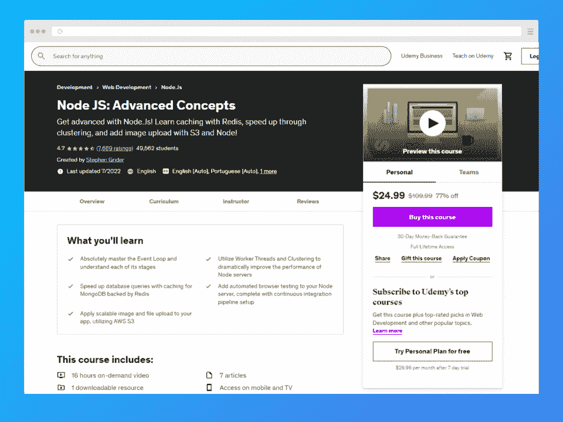](https://click.linksynergy.com/deeplink?id=jU79Zysihs4&mid=39197&murl=https%3A%2F%2Fwww.udemy.com%2Fcourse%2Fadvanced-node-for-developers%2F%3FranMID%3D39197%26ranEAID%3DJVFxdTr9V80%26ranSiteID%3DJVFxdTr9V80-bxnz5HpVs_GIhtbG.IKZLQ%26LSNPUBID%3DJVFxdTr9V80%26utm_source%3Daff-campaign%26utm_medium%3Dudemyads)

这个高级 Node.js 课程关注的主题包括 Redis 缓存、工作线程和集群，以及使用 Node 和 S3 集成图像上传！学生还将了解事件循环步骤以及如何使用 AWS S3 实现可伸缩上传。

*“课程主旨切题，实用性强(Redis 缓存服务器，nodejs 性能优化。事件循环、线程池等底层抽象概念都得到了很好的解释，并用工作示例进行了演示。”*

*——小 l，学生*

*   **提供者:** Udemy
*   **持续时间:** 16 小时
*   **难度:**进阶
*   **完工证书:**是
*   讲师:斯蒂芬·格里德
*   **先决条件:** JavaScript 产品知识，扎实了解 Express.js、Node.js、MongoDB
*   **课程内容:**

*   增强节点性能
*   数据缓存
*   自动化无头浏览器测试
*   可缩放图像/文件上传

[在此注册](https://click.linksynergy.com/deeplink?id=jU79Zysihs4&mid=39197&murl=https%3A%2F%2Fwww.udemy.com%2Fcourse%2Fadvanced-node-for-developers%2F%3FranMID%3D39197%26ranEAID%3DJVFxdTr9V80%26ranSiteID%3DJVFxdTr9V80-bxnz5HpVs_GIhtbG.IKZLQ%26LSNPUBID%3DJVFxdTr9V80%26utm_source%3Daff-campaign%26utm_medium%3Dudemyads)

[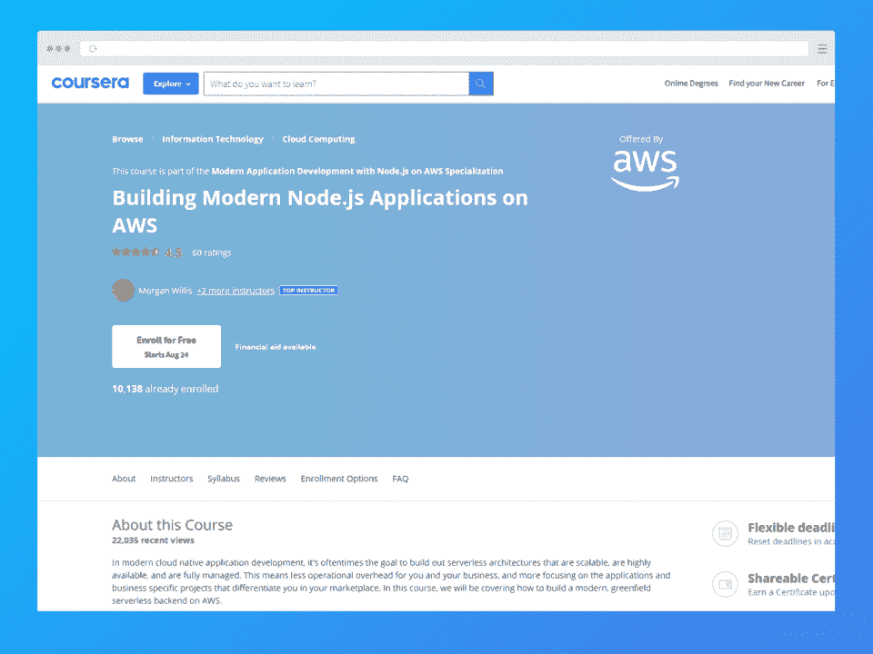](https://imp.i384100.net/YgaZZe) 
主要由云技术专家带领，这是 Coursera 上最优秀的 Node.js 课程之一。凭借最新的亚马逊行业知识，讲师带领学生通过各种概念在 AWS 上构建尖端的全新无服务器后端应用。

学生将学习如何使用以下工具创建 API 驱动的 Node.js 应用程序:

*   使用 Amazon API Gateway 托管无服务器 API
*   使用 AWS Lambda 的无服务器计算
*   Amazon Cognito 的无服务器认证

课程结束时，学生将掌握使用 AWS、Amazon 的 EC2 虚拟机和 Docker 容器来创建全新的应用程序。

*“很棒的课程。视频中提供的信息简洁明了，非常有助于完成实验，也是了解新的 AWS 服务的好方法。”*

*- AA，学生*

*   **提供:** Coursera
*   **持续时间:** 17 小时
*   **难度:**中级
*   **完工证书:**是
*   指导老师:摩根·威尔斯，乔纳森·迪翁，塞弗·罗宾逊
*   **先决条件:**基本 AWS 知识
*   **课程内容:**

*   AWS Cloud9 简介和工具包
*   龙 API
*   API 网关和认证
*   模型、映射、请求验证注释

[在此注册](https://imp.i384100.net/YgaZZe)

[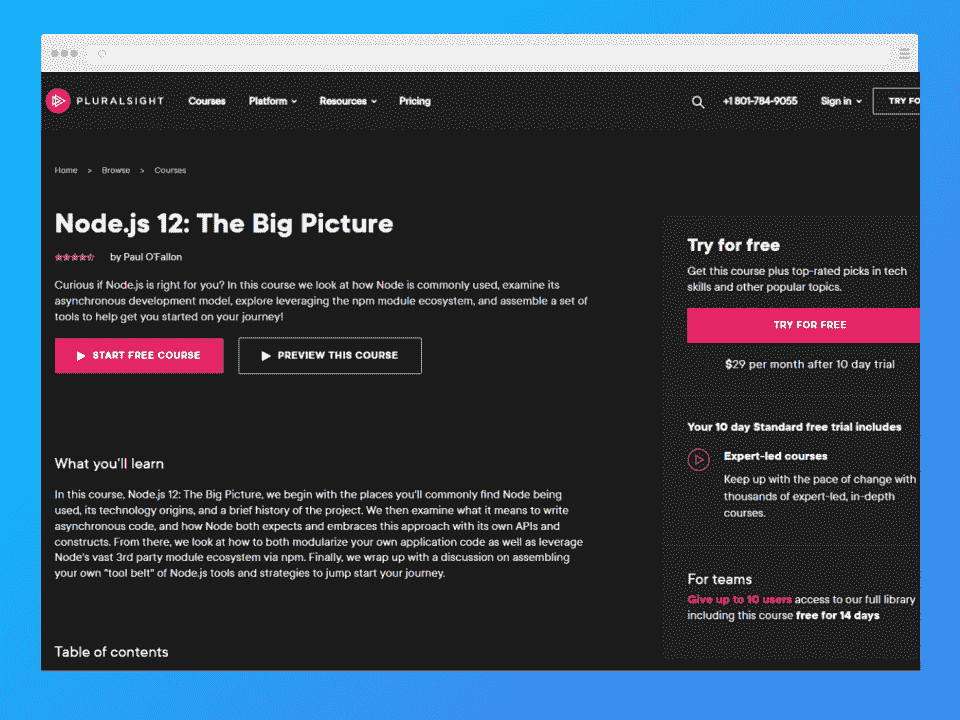](https://pluralsight.pxf.io/7mNYYY)

凭借 28 年的 IT 经验，讲师 Paul O'Fallon 将 Java API 和 Node.js 知识带到了这个全面的 Node.js 课程中。学生将了解 Node.js 的历史和起源，然后学习开发 API 和异步代码。

除此之外，该课程还涵盖了应用程序代码模块化和其他 Node.js 方法。

*   **提供者:** Pluralsight
*   **时长:** 55 分钟
*   **难度:**初学者
*   **完工证书:**是
*   教练:保罗·奥法伦
*   **先决条件:**无
*   **课程内容:**

*   Node.js 的历史和起源
*   管理依赖关系
*   组装开发工具集

[在此注册](https://pluralsight.pxf.io/7mNYYY)

[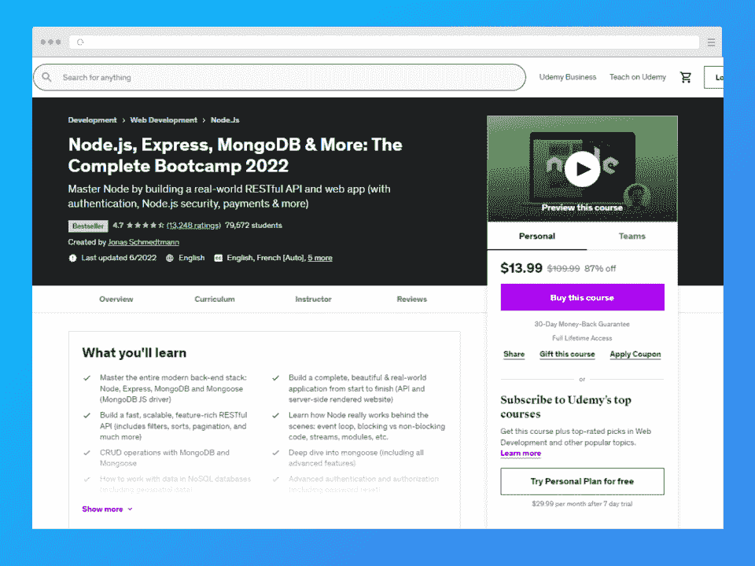](https://click.linksynergy.com/deeplink?id=jU79Zysihs4&mid=39197&murl=https%3A%2F%2Fwww.udemy.com%2Fcourse%2Fnodejs-express-mongodb-bootcamp%2F%3FranMID%3D39197%26ranEAID%3DJVFxdTr9V80%26ranSiteID%3DJVFxdTr9V80-ydHiiV3iZxw9O07y1VvmwA%26LSNPUBID%3DJVFxdTr9V80%26utm_source%3Daff-campaign%26utm_medium%3Dudemyads)

本课程通过真实的项目涵盖了许多 Node.js 开发领域，非常适合添加到您的投资组合中。您将构建真实世界的 API、安全系统和支付网关，并了解 Node.js 的所有内部工作原理。

*   **提供者:** Udemy
*   **持续时间:** 42 小时
*   **难度:**中级
*   **完工证书:**是
*   教练:乔纳斯·施梅特曼
*   **先决条件:** JavaScript 和 HTML 基础
*   **课程内容:**

*   后端 web 开发
*   异步 JavaScript
*   错误处理
*   证明
*   Node.js 和 NPM

[在此注册](https://click.linksynergy.com/deeplink?id=jU79Zysihs4&mid=39197&murl=https%3A%2F%2Fwww.udemy.com%2Fcourse%2Fnodejs-express-mongodb-bootcamp%2F%3FranMID%3D39197%26ranEAID%3DJVFxdTr9V80%26ranSiteID%3DJVFxdTr9V80-ydHiiV3iZxw9O07y1VvmwA%26LSNPUBID%3DJVFxdTr9V80%26utm_source%3Daff-campaign%26utm_medium%3Dudemyads)

[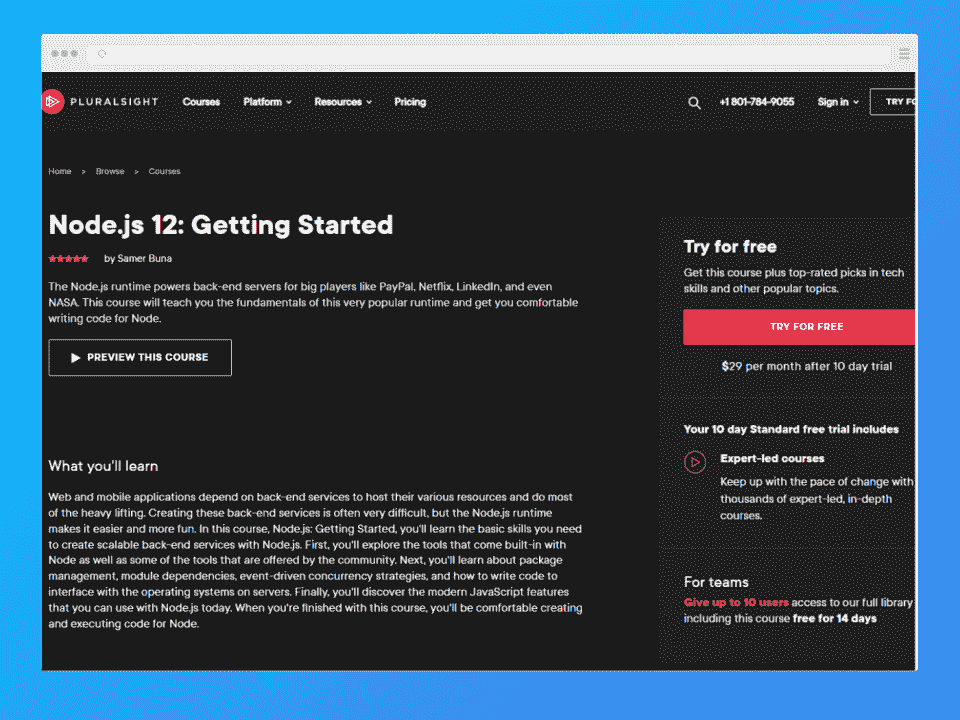](https://pluralsight.pxf.io/DVN445)

讲师萨梅尔布纳有多年的经验，创造网络和移动应用程序。他对 JavaScript 的热情激发了他对 Node.js、React.js 等的写作和教学兴趣。

本初学者 Node.js 在线课程旨在让您轻松编写和执行节点代码。它教你如何创建后端服务和导航模块依赖、事件驱动的并发策略和社区工具。

*   **时长:** 3 小时 29 分钟

*   **完工证书:**是

*   **先决条件:** JavaScript 基础

*   Node.js 历史和基础
*   使用回调和流
*   内置 API

[在此注册](https://pluralsight.pxf.io/DVN445)

[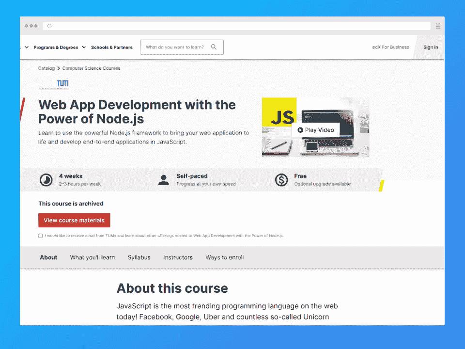](https://edx.sjv.io/c/2890636/1598007/17728?u=https%3A%2F%2Fwww.edx.org%2Fcourse%2Fweb-app-development-with-the-power-of-nodejs)

慕尼黑工业大学通过流行的技术平台 edX 提供这门课程。学生将学习利用 Node.js 库和其他函数和对象来开发 web 应用程序。

尽管是为初学者开设的，但这门课程相当深入。到第 3 周，您已经深入了解了 web 应用程序的基本架构和通过 API 共享数据。此外，本课程还讲述了 Node.js 服务器和几个数据库集之间的交互。课程结束时，毕业生应该知道如何开发具有强大可视化功能的数据驱动应用程序。

*   **持续时间:** 4 周；每周 2-3 小时

*   **完工证书:**是

*   讲师:布尔夏德·罗斯特、盖伊·雅克达夫、塔亚娜·戈德堡等人

*   **先决条件:**网络浏览器和命令行知识

*   JavaScript 编程
*   服务器端 JavaScript
*   用 D3.js 库实现数据可视化

“这是我上过的最好的课程，尤其是因为在这个课程中我学到了很多关于 web 开发的知识。从 Node 到 D3.js 到 Pug 等等。”

*-匿名学生*

[在此注册](https://edx.sjv.io/c/2890636/1598007/17728?u=https%3A%2F%2Fwww.edx.org%2Fcourse%2Fweb-app-development-with-the-power-of-nodejs)

[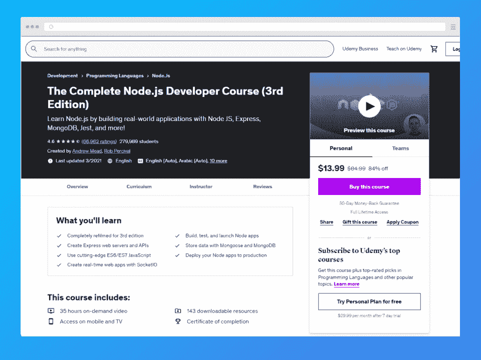](https://click.linksynergy.com/deeplink?id=jU79Zysihs4&mid=39197&murl=https%3A%2F%2Fwww.udemy.com%2Fcourse%2Fthe-complete-nodejs-developer-course-2%2F)

这是帮助您学习 Node.js 的最佳课程之一。在深入研究 Express JS、Mongoose 和 MongoDB 等神奇工具之前，它涵盖了节点基础。本课程的主要目标是将您转变为能够创建、测试和部署真实生产应用程序的专业 Node.js 开发人员。

希望将您的工作扩展到自由节点开发？或者也许你渴望换个职业？这门课程对你来说是一个极好的机会。

*   **提供者:** Udemy
*   **持续时间:** 35 小时
*   **难度:**初学者
*   **完工证书:**是
*   讲师:安德鲁·米德和罗布·帕西瓦尔
*   **先决条件:【JavaScript 基础知识，包括变量、数组、对象、if 语句**
*   **课程内容:**

*   Node.js 模块
*   排除故障
*   应用程序部署
*   MongoDB

[在此注册](https://click.linksynergy.com/deeplink?id=jU79Zysihs4&mid=39197&murl=https%3A%2F%2Fwww.udemy.com%2Fcourse%2Fthe-complete-nodejs-developer-course-2%2F)

**8。 [NodeJS -完整指南(MVC、REST APIs、GraphQL、Deno)【Udemy】](https://click.linksynergy.com/deeplink?id=jU79Zysihs4&mid=39197&murl=https%3A%2F%2Fwww.udemy.com%2Fcourse%2Fnodejs-the-complete-guide%2F)**

[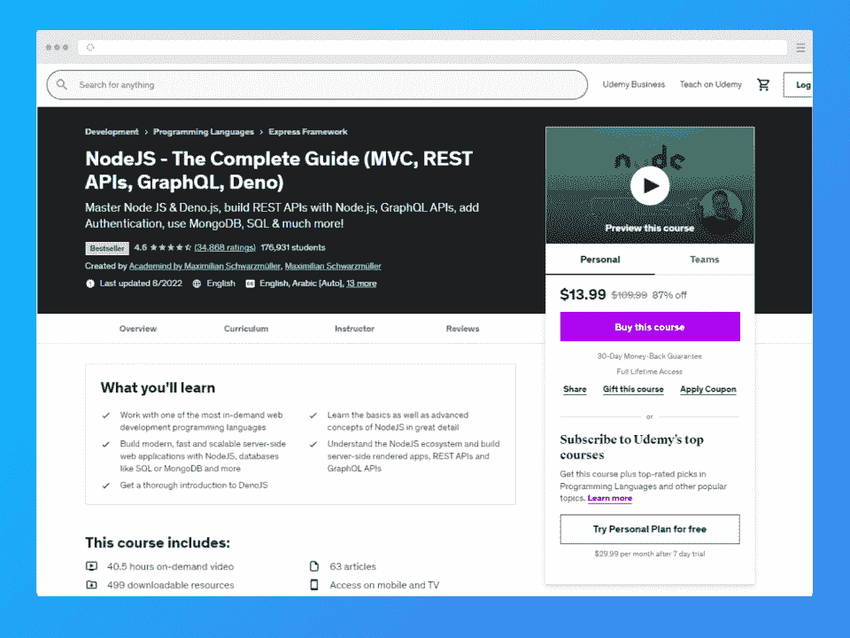](https://click.linksynergy.com/deeplink?id=jU79Zysihs4&mid=39197&murl=https%3A%2F%2Fwww.udemy.com%2Fcourse%2Fnodejs-the-complete-guide%2F)

你是 Node.js 的完全初学者吗？这可能是你第一次使用它，你仍然会在这个初学者课程中茁壮成长。讲师 Maximilian Schwarzüller 带领没有 Node.js 经验的学生，教他们如何在结束时构建可伸缩的服务器端 web 应用程序。

该课程涵盖了 Node.js 安装和使用等基础知识，甚至包括面向真正初学者的 JavaScript 复习课程。在整个学习过程中，您将了解 Deno.js、带有 Node.js 的 REST APIs、身份验证、SQL 等等。

即使你是一个初学者或经验丰富的 web 开发人员，你也会在这里收集到关于后端开发的有价值的见解。本课程非常适合所有希望构建可伸缩的高性能 web 应用程序的人。

我最喜欢的老师教授的又一门优秀课程，他让学习过程变得有趣而有吸引力。强烈推荐！”

*-马丁·s，学生*

*   **提供者:** Udemy
*   **持续时间:** 40.5 小时
*   **难度:**初学者
*   **完工证书:**是
*   **讲师:**maximilin black fill er
*   **先决条件:** JavaScript 基础
*   **课程内容:**

*   SQL 简介
*   Node.js 基础知识
*   排除故障
*   开发工作流程
*   快递. js

[在此注册](https://click.linksynergy.com/deeplink?id=jU79Zysihs4&mid=39197&murl=https%3A%2F%2Fwww.udemy.com%2Fcourse%2Fnodejs-the-complete-guide%2F)

[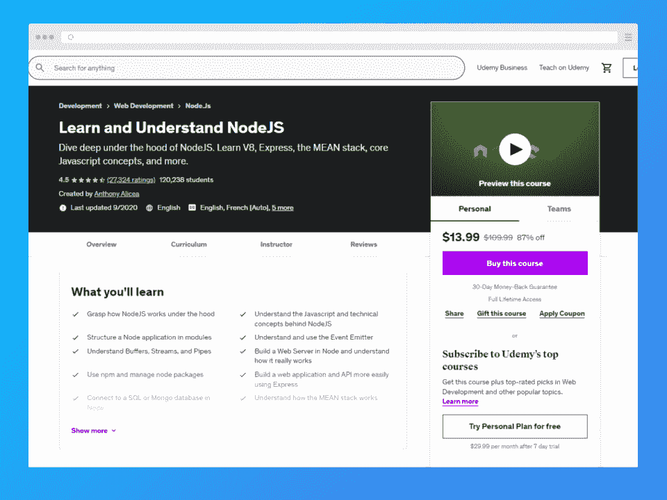](https://click.linksynergy.com/deeplink?id=jU79Zysihs4&mid=39197&murl=https%3A%2F%2Fwww.udemy.com%2Fcourse%2Funderstand-nodejs%2F)

本课程将教你 Node.js 的内部工作原理，以及缓冲区、流和管道等基本概念。此外，您将发现如何构建 Node Web 服务器，并探索 Node 异步编程模型的功能。

*   **提供者:** Udemy
*   **持续时间:** 13 小时
*   **难度:**初学者
*   **完工证书:**是
*   教练:安东尼·阿里西亚
*   **先决条件:** JavaScript 和 HTML 基础
*   **课程内容:**

*   V8 JavaScript 引擎
*   节点核心
*   JavaScript、JSON 和数据库
*   平均堆栈
*   快递. js

[在此注册](https://click.linksynergy.com/deeplink?id=jU79Zysihs4&mid=39197&murl=https%3A%2F%2Fwww.udemy.com%2Fcourse%2Funderstand-nodejs%2F)

[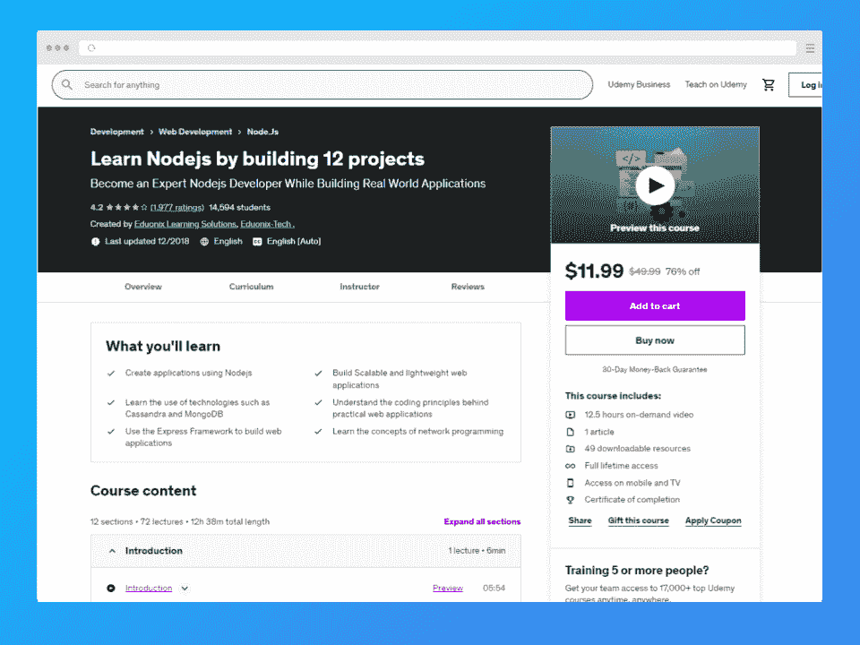](https://click.linksynergy.com/deeplink?id=jU79Zysihs4&mid=39197&murl=https%3A%2F%2Fwww.udemy.com%2Fcourse%2Flearn-nodejs-by-building-10-projects%2F)

你有一些服务器端编程语言的知识吗？也许您有兴趣利用这些知识，用服务器端 JavaScript 开发 web 应用程序。这是最适合你的 node.js 课程！

Eduonix Learning Solutions 是一家总部位于孟买的受人尊敬的技术教育集团。他们将带您完成构建 12 个独特的 Node.js 项目的过程，同时帮助您发展关于 NPM 模块的知识。

*   **提供者:** Udemy
*   **持续时间:** 12.5 小时
*   **难度:**初学者
*   **完工证书:**是
*   **讲师:** Eduonix 学习解决方案
*   **先决条件:** Express.js 熟悉度
*   **项目:**

*   快递网站
*   夏蒂奥
*   书店
*   节点博客系统
*   作品集应用
*   食谱书

[在此注册](https://click.linksynergy.com/deeplink?id=jU79Zysihs4&mid=39197&murl=https%3A%2F%2Fwww.udemy.com%2Fcourse%2Flearn-nodejs-by-building-10-projects%2F)

## **Bonus Node.js 课程**

[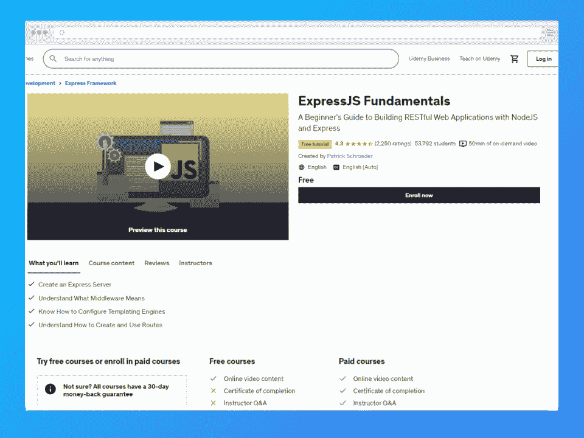](https://click.linksynergy.com/deeplink?id=jU79Zysihs4&mid=39197&murl=https%3A%2F%2Fwww.udemy.com%2Fcourse%2Fexpressjs-fundamentals%2F)

这是 Udemy 上提供的免费 Node.js 课程。您可以学习使用 [NodeJS](https://hackr.io/blog/what-is-node-js) 和 ExpressJS 框架创建 RESTful web 应用程序，并探索 Node 和 Express 如何协同工作。

*“初入 Node.js 世界的初学者的好课程。”*

学生穆罕默德·贾米勒

*   **提供者:** Udemy
*   **持续时间:** 50 分钟
*   **难度:**初学者
*   **完工证书:**否
*   导师:帕特里克·施罗德
*   **先决条件:**无
*   **课程内容:**

*   Node.js 和 Express
*   Rest APIs
*   路由和模板

[在此注册](https://click.linksynergy.com/deeplink?id=jU79Zysihs4&mid=39197&murl=https%3A%2F%2Fwww.udemy.com%2Fcourse%2Fexpressjs-fundamentals%2F)

[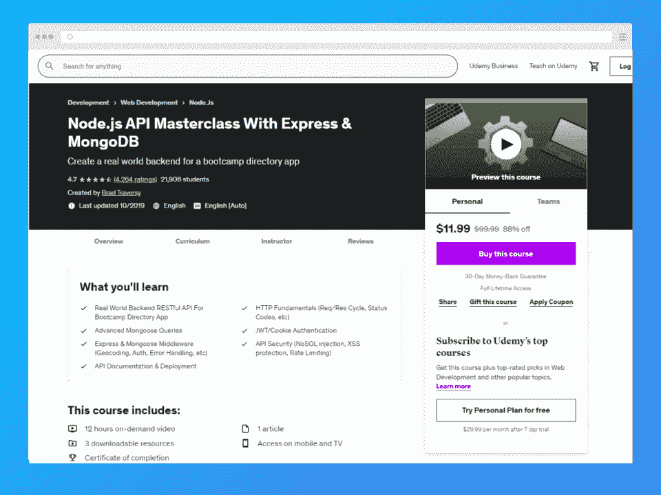](https://click.linksynergy.com/deeplink?id=jU79Zysihs4&mid=39197&murl=https%3A%2F%2Fwww.udemy.com%2Fcourse%2Fnodejs-api-masterclass%2F)

Udemy 为学习 Node.js、Express 和 MongoDB 提供了另一个极好的课程。讲师设计本课程是为了帮助您构建一个实用的 Bootcamp 目录应用程序后端。

如果您对 Node.js 的后端开发感兴趣，这是适合您的课程。

*   **提供者:** Udemy
*   **持续时间:** 12 小时
*   **难度:**中级
*   **完工证书:**是
*   讲师:布拉德·特拉弗斯
*   **前提:**现代 JavaScript 编程原理，Node.js 基础
*   **课程内容:**

*   HTTP 基础知识
*   猫鼬高级查询
*   API 安全、开发和部署
*   JWT 认证

[在此注册](https://click.linksynergy.com/deeplink?id=jU79Zysihs4&mid=39197&murl=https%3A%2F%2Fwww.udemy.com%2Fcourse%2Fnodejs-api-masterclass%2F)

[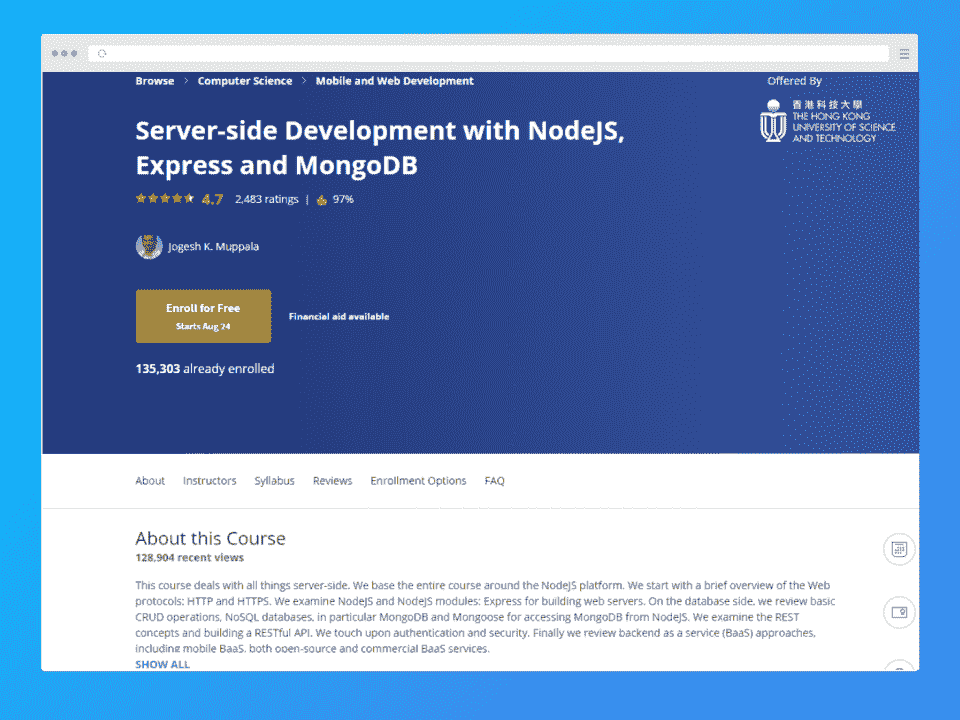](https://imp.i384100.net/15N4mz)

这个 Node.js 类完全构建在 Node.js 平台上，涵盖了 web 协议、Node.js 和 Node.js 模块等基本概念。它涵盖了各种数据库主题，包括 CRUD 操作、NoSQL 数据库、Mongoose 和 MongoDB。

最后，本课程还探讨了 RESTful API、身份验证和安全性以及后端即服务(BaaS)策略的概念。

“Jogesh Muppala 先生在准备课程及其内容方面做得非常出色，带领学员从幼稚走向先进。”

*- PA，学生*

*   **提供者:** Coursera
*   **持续时间:** 48 小时
*   **难度:**中级
*   **完工证书:**是
*   教练:乔格什·k·穆帕拉
*   **必备:**现代 JavaScript 和 Node.js 基础
*   **课程内容:**

*   服务器端开发简介
*   Rest API，MongoDB，Express
*   Cookies 和会话
*   后端即服务(BaaS)

[在此注册](https://imp.i384100.net/15N4mz)

[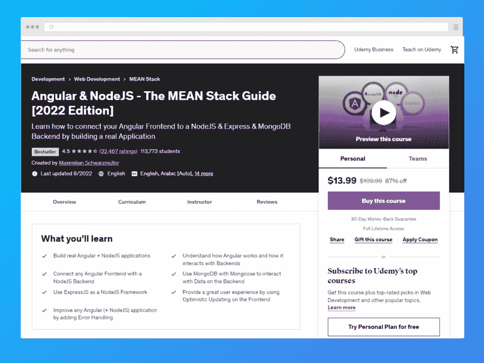](https://click.linksynergy.com/deeplink?id=jU79Zysihs4&mid=39197&murl=https%3A%2F%2Fwww.udemy.com%2Fcourse%2Fangular-2-and-nodejs-the-practical-guide%2F)

对于有兴趣了解 Angular 和 Node.js 如何交互来构建应用程序的人来说，这是最好的 Node.js 类之一。学生还将学习如何用 MongoDB 和 Mongoose 连接后端数据。

*   **提供者:** Udemy
*   **持续时间:** 12.5 小时
*   **难度:**中级
*   **完工证书:**是
*   **讲师:**maximilin black fill er
*   **先决条件:** Node.js、Express、Angular 和 MongoDB 基础
*   **课程内容:**

*   授权和认证
*   MongoDB
*   节点. js
*   有角的

[在此注册](https://click.linksynergy.com/deeplink?id=jU79Zysihs4&mid=39197&murl=https%3A%2F%2Fwww.udemy.com%2Fcourse%2Fangular-2-and-nodejs-the-practical-guide%2F)

[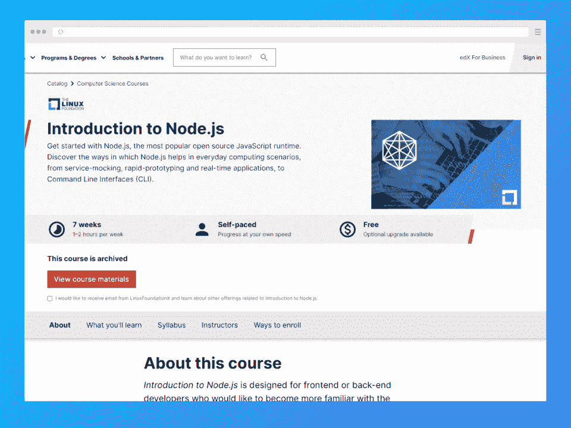](https://edx.sjv.io/c/2890636/1598007/17728?u=https%3A%2F%2Fwww.edx.org%2Fcourse%2Fintroduction-to-nodejs-2)

本课程面向希望了解 Node.js 基础知识的前端和后端开发人员。学生将调查用例，创建命令行工具，一个假的 RESTful JSON API 和一个实时服务原型。本课程演示了如何使用 Node.js 处理常见的计算场景。

*   **提供者:** edX
*   **持续时间:** 7 周；每周 1-2 小时
*   **难度:**初学者
*   **完工证书:**是
*   导师:大卫·马克·克莱门茨
*   **先决条件:**基本 JavaScript 和命令行
*   **课程内容:**

*   构建 CLI 工具
*   服务模仿

[在此注册](https://edx.sjv.io/c/2890636/1598007/17728?u=https%3A%2F%2Fwww.edx.org%2Fcourse%2Fintroduction-to-nodejs-2)

## **结论**

课程是获得行业经验和增加投资组合的好方法。我们相信，即使只学习我们列表中的一门 Node.js 课程，也会让你在全栈开发领域获得更丰厚的职业回报。

但你不必止步于课程。用网上大量的 [Node.js 教程](https://hackr.io/tutorials/learn-node-js)来补充你的学习。一旦你获得面试机会。

**[练习 Node.js 面试题](https://hackr.io/blog/node-js-interview-questions)**

## **常见问题解答**

#### **1。Node JS 课程哪个最好？**

最好的 Node JS 课程看你的经验。如果你是一个完全的初学者，试试 Udemy 的 Node JS 完全指南。如果你在寻找更高级的学习，试试 Udemy 的[高级概念课程](https://www.udemy.com/course/advanced-node-for-developers/?ranMID=39197&ranEAID=JVFxdTr9V80&ranSiteID=JVFxdTr9V80-bxnz5HpVs_GIhtbG.IKZLQ&LSNPUBID=JVFxdTr9V80&utm_source=aff-campaign&utm_medium=udemyads)。

#### **2。3 个月能学会 Node JS 吗？**

你当然可以在三个月内掌握 Node.js 的工作知识。事实上，你可以在一个月内完成我们清单上的大部分课程。

#### **3。Node JS 好学吗？**

通过大量的练习，任何事情都会变得容易。Node JS 需要一些时间来掌握，但是我们建议尽可能多地学习后端开发概念，以加快这个过程。

#### **4。学习 Node JS 需要多长时间？**

我们清单上的大多数课程需要大约一个月的时间来完成。然而，学习更高级的概念可能需要更多的时间。

#### **5。Node JS 有前途吗？**

Node JS 框架一直在发展，新的版本会定期发布。其频繁的新功能使 Node JS 成为未来发展和职业潜力的强势领域。

**人也在读:**