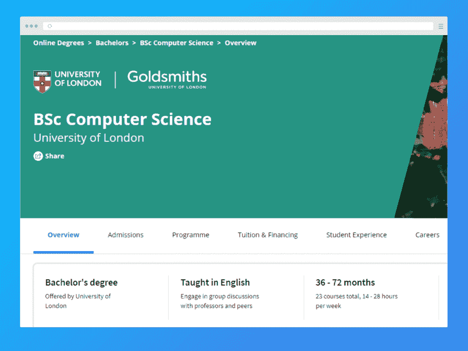
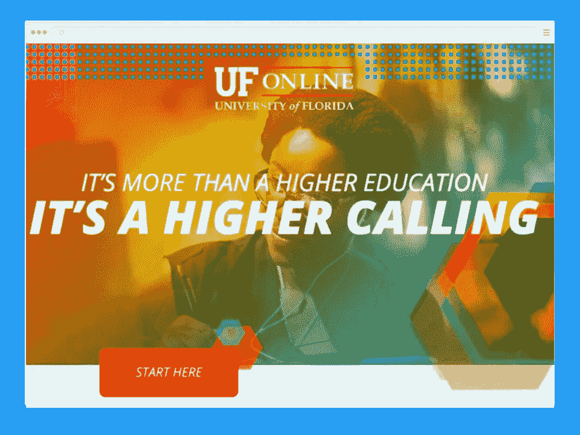
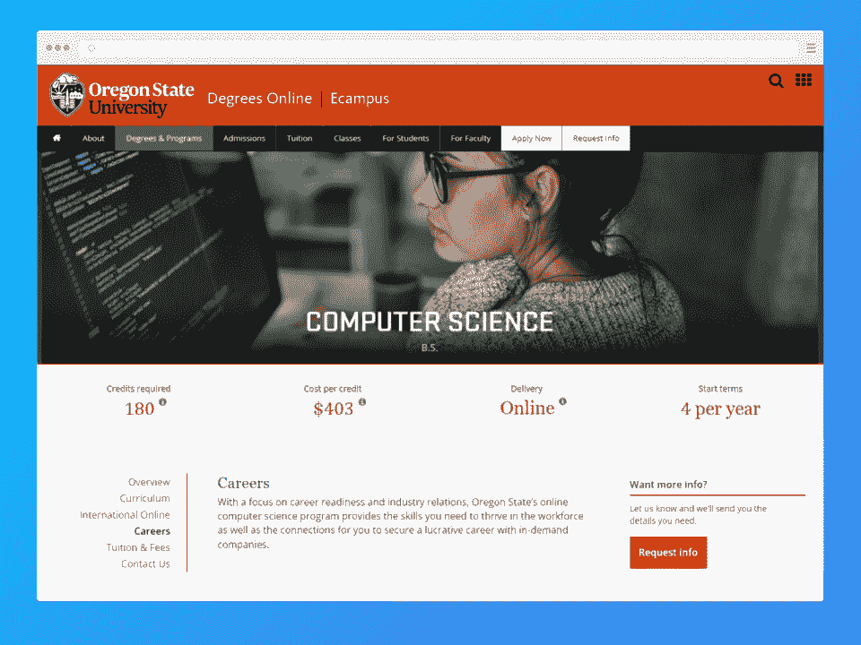
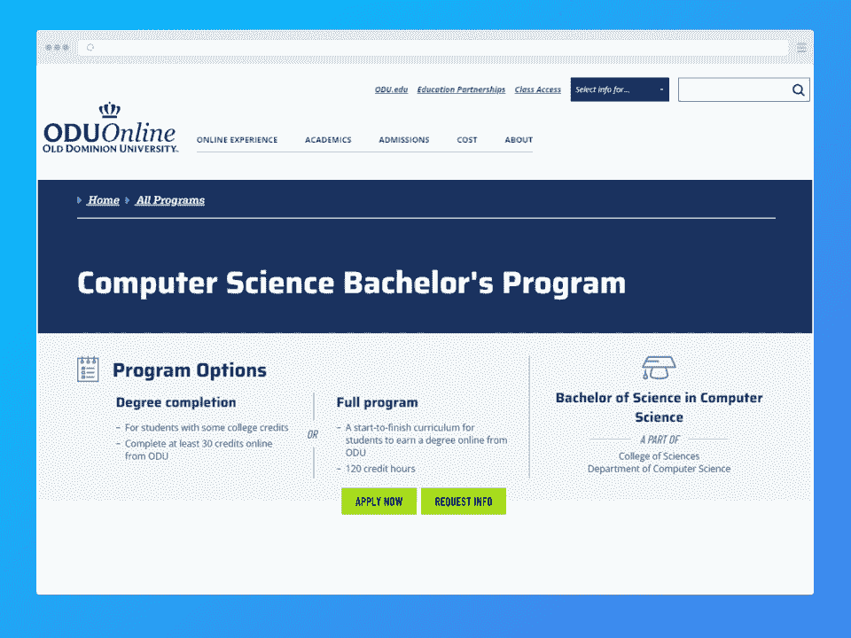
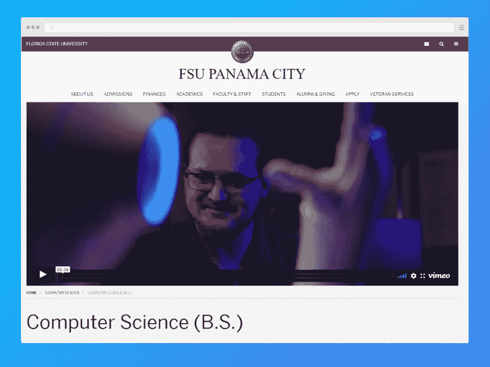
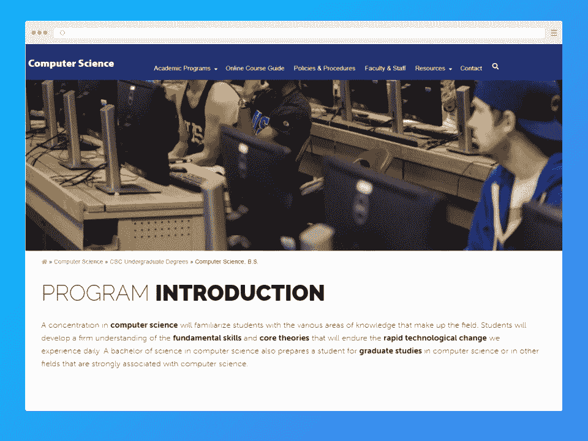
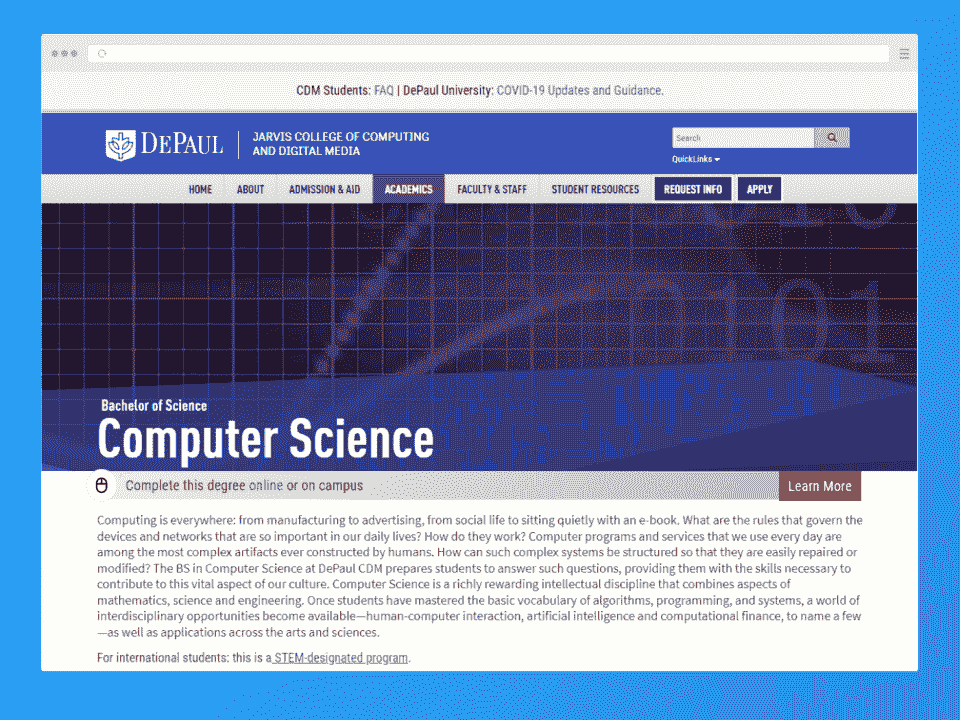
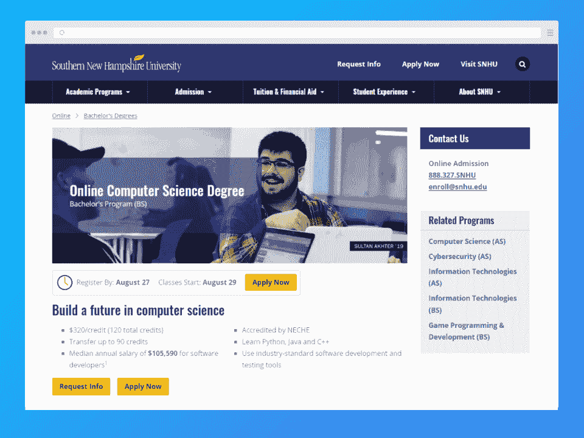
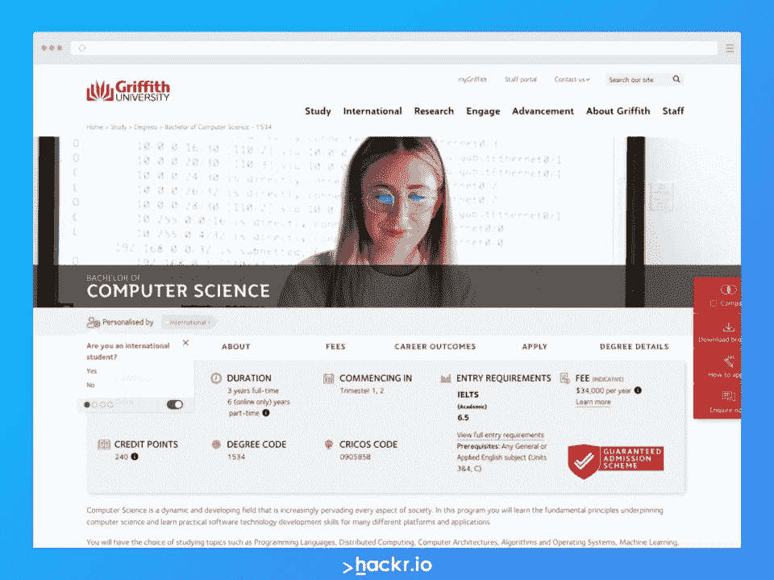

# 2023 年 9 个最佳在线计算机科学学位项目

> 原文：<https://hackr.io/blog/best-online-computer-science-degree>

甚至在在线学习平台出现之前，大学就已经开始通过提供在线学位来建立在线学习。Coursera、edX 和 Udemy 等在线学习平台的出现彻底改变了学生获得教育证书和学位的方式。跟随这一趋势，几所知名大学也在网上提供课程。然而，疫情加快了这一进程，鼓励世界各地的许多教育机构提供在线版本的学位课程。

计算机科学学位为毕业生开辟了广阔的职业道路。计算机科学学位持有者可以在商业、创意产业、教育、工程、医学、科学等领域找到工作。

如果你想获得文凭，这份 2023 年十大最佳在线计算机科学学位课程清单可以帮到你。在本指南中，我们还将涵盖从选择最佳项目到毕业后能找到什么样的工作等所有内容！

## 一瞥:你能在网上获得的最好的计算机科学学位

| **机构** | **节目信息** | **成本** |
| [伦敦大学(与 Coursera 合作)](https://coursera.pxf.io/x9jmD1?subId3=blog%2Fbest-online-compu_amcid-igZBOEbbiAOzOpAIJOg6q) | 

*   完全在 Coursera 的学习平台内处理
*   数据科学、游戏开发、机器学习和人工智能、物理计算和物联网、用户体验、虚拟现实以及网络和移动开发
*   总共需要 360 个学分的模块，课程需要三到六年的时间来完成

 | 总费用 11，229 - 16，790 美元或 13，780-20，604 美元；根据您的地理位置，您的费率可能会有所不同(发展中国家的费率较低) |
| [佛罗里达大学(用友在线)](http://info.ufonline.ufl.edu/lp/general) | 

*   以计算机科学的基础教育为特色，但也给予学生人文、社会和行为科学以及外语方面的教育
*   在线学生和在校学生获得同样的教育和机会
*   该项目平均需要四年时间才能完成

 | 

*   佛罗里达州居民每信用点 129.18 美元
*   非佛罗里达居民每信用点 552.62 美元

 |
| [俄勒冈州立大学](https://ecampus.oregonstate.edu/online-degrees/undergraduate/computer-science/careers.htm) | 

*   OSU 大学被卡耐基基金会归类为社区参与型大学，这意味着它获得了大量外部研究基金(这对研究人员来说是好事
*   OSU 大学的计算机科学学士学位有四种加速等级，选择适合你的
*   需要 180 个学分，课程需要一至四年完成

 | 

*   根据目前的学费，每学分 403 美元

 |
| [老自治领大学](https://online.odu.edu/programs/computer-science-degree-online) | 

*   在线课程和计划遵循老自治领大学的定期学术日历
*   ODU 为现役军人提供大学学费折扣
*   私人机构提供的最实惠的在线 BSCS 项目之一
*   需要 120 个学分，平均需要四年才能完成

 | 

*   弗吉尼亚居民每信用 356 美元
*   非弗吉尼亚州居民每学分 407 美元

 |
| 佛罗里达州立大学 | 

*   完全在线课程与校园版完全相同
*   由于有指定的导师，学生可以得到持续的支持
*   有一个远程学习办公室来帮助在线学生
*   FSU 大学的 BSCS 项目包括嵌入的数学辅修课程
*   需要 120 个学分，课程需要两到四年才能完成

 | 

*   佛罗里达居民每积分 180 美元*
*   非佛罗里达居民每学分 686 美元*

* *可能包括远程学习费用，详情请联系 FSU* |
| 伊利诺伊大学斯普林菲尔德分校 | 

*   对 UIS·BSCS 项目感兴趣的学生必须拥有至少 30 小时的可转让大学学分，在 4.0 分制中累计 GPA 为 2.0
*   需要 120 个学分，平均需要四年才能完成

 | 

*   每信用点 312.25 美元起

UIS 对在线学位课程的定价有规定/指导方针。更多信息请点击[这里](https://www.uis.edu/cost-aid/cost-attendance/tuition-fees/fall-2022-tuition) |
| 德保罗大学 | 

*   美国最大的天主教大学
*   100% BSCS 课程采用同步形式(非自定进度)，但学生可以在方便时自由复习课程
*   BSCS 项目需要两个顶点项目，一个在大二，一个在大四
*   需要 120 个学分，平均需要四年才能完成

 | 更多信息请点击[这里](https://www.cdm.depaul.edu/Admission-and-Aid/Pages/TuitionandFinancialAid.aspx) |
| [摄政大学](https://www.regent.edu/program/bs-in-computer-science/) | 

*   摄政大学是一所私立基督教学校，它将以基督教世界观教授其 BSCS 项目
*   需要 120+学分，平均需要四年才能完成

 | 

*   全日制学生每学分 395 美元
*   非全日制学生每学分 450 美元

 |
| [南新罕布什尔大学](https://www.snhu.edu/online-degrees/bachelors/bs-in-computer-science) | 

*   数据分析、信息安全、STEM 项目管理、软件工程
*   需要 120 个学分，平均需要四年才能完成

 |  |
| [格里菲斯大学](https://www.griffith.edu.au/study/degrees/bachelor-of-computer-science-1534#about) | 

*   位于澳大利亚布里斯班，并获得国际高等商学院协会的认证
*   计算机科学学士课程每三个月进行一次。3 年全日制在校学习或 6 年非全日制在线学习
*   在最后一年，学生必须完成 20 学分的 WIL(工作整合学习)课程
*   国际学生必须提交至少 6.5 分的雅思成绩和其他要求，具体取决于国家

 | 

*   每信用点 480 美元(澳元)

 |

## 最佳在线计算机科学学位课程

**认证**——英国枢密院

接受率–63%

**毕业率**–[98.42%](https://www.umultirank.org/study-at/university-college-london-rankings/#:~:text=It%20was%20founded%20in%201826,for%20masters%20(B%20score).)

**所需学分**–360

**费用**–总费用 11229-16790 美元或 13780-20604 美元；根据您的地理位置，您的费率可能会有所不同(发展中国家的费率较低)

**浓度:**

*   数据科学
*   游戏开发
*   机器学习和人工智能
*   物理计算和物联网
*   用户体验
*   虚拟现实
*   网络和移动开发

**持续时间**–3 至 6 年

伦敦大学与 Coursera 合作，为来自全球各地的有志之士提供计算机科学学士学位。该机构长期以来一直在 180 多个国家提供远程教育。根据你的地理位置，在线学位的持续时间从 3 年到 6 年不等。

伦敦大学提供的计算机科学学位有助于学生掌握所需的计算机技能，培养解决复杂现实问题的能力，并完善他们与生俱来的创新和创造力。

这个学位遵循一个基于实践项目的方法，帮助学生发展所需的技术技能，他们需要进入一个理想的工作岗位的选择领域。学生通过 Coursera 平台注册在线学位访问讲师，由 UoL 大学的教师和助教提供持续的评估和支持。

我们相信这是最好的在线计算机科学学位之一，因为它可以通过 Coursera 在线学习平台获得。

**亮点**

*   创建一个课程文件夹，展示给当前或潜在的雇主
*   了解最新的行业应用和实践
*   众多专业
*   一年两次，分别在四月和十月
*   未能达到直接入学的学术标准的候选人可以根据成绩入学
*   一系列严格的作业和项目
*   各种课程材料，从初级科目到专业的深入科目

你可以在这里注册。

**认证**–南方学院和学校协会(SACS)

接受率–31.1%

毕业率–88.5%

**所需学分**–70

**每信用成本**

*   佛罗里达州居民每信用点 129.18 美元
*   非佛罗里达居民每信用点 552.62 美元

**浓度:**无

**持续时间**–4 年

用友在线提供的计算机科学学士学位为计算机科学提供了坚实的基础。它也提供了一个强大的人文学科，外语，社会和行为科学的文科教育。

BSCS 的课程为学生作为计算机专业人员的就业做准备，同时提供选择其他非计算机领域课程的自由。

佛罗里达大学的计算机科学学士学位是专门为无法参加传统校园课程的学习者设计的。注册在线学位的学生与离线注册的学生获得相同的学术选择。因此，与在校学习的学生相比，网上注册的学生没有任何劣势。

UF 在线提供的计算机科学学士课程可以灵活地修改课程，以满足注册考生的学术优势、兴趣和技能。由于为有需要的学生提供了灵活性，用友在线仍然是最好的计算机科学在线学校之一。

UF Online 的计算机科学学士学位非常适合希望获得计算机科学技术教育的学生，他们可以灵活地以证书或辅修的形式学习非技术课程，同时花费更少的钱来获得学位。

**亮点**

*   获得用友独有的职业服务
*   专职学术顾问
*   灵活的学术选择
*   最实惠的机构之一，提供大量的财政援助和奖学金计划
*   要求基础课程至少 29 学分，核心课程至少 35 学分，主要选修课至少 6 学分
*   支持课程等效性请求
*   世界级的教员

你可以在这里注册。

**认证**–西北大学委员会(NWCCU)

接受率–82.2%

毕业率–66%

**所需学分**–180

**每学分成本**——基于 OSU 大学目前的学费为 403 美元

**浓度:**无

**持续时间**–1 至 4 年

俄勒冈州立大学位于科瓦利斯，是西海岸顶尖的研究型大学之一。[卡耐基基金会](https://www.carnegiefoundation.org/)将其归类为[社区参与大学](https://carnegieelectiveclassifications.org/the-2024-elective-classification-for-community-engagement/)，这意味着 OSU 与公共和私营部门合作，提供并丰富奖学金、创造性活动和研究方面的机会。因此，OSU 获得了可观的研究经费，成为研究人员的理想选择。

发明了电脑鼠标的道格拉斯·恩格尔巴特和斯蒂芬·o·莱斯是俄勒冈州立大学的校友，莱斯分布和莱斯公式就是以他们的名字命名的。

OSU 大学的计算机科学学士课程由电气工程和计算机科学学院提供。该学位要求你完成 60 个学分，这是计算机科学学士学位通常要求的一半。因此，你可以在一至四年内完成 OSU 大学的灵活课程，这取决于你是全日制还是非全日制学习。

**亮点**

*   所有俄勒冈州立大学的教师都是计算机科学行业的专家
*   在美国和其他 40 个国家提供在线课程
*   计算机科学的学士学位有四个不同的加速级别
*   你可以在一年内完成学位
*   作为电子校园课程的一部分，该大学提供了 900 多门课程
*   可用的传输选项

你可以在这里注册。

**认证**——南方学院和学校委员会协会(SACSCOC)

接受率–95.4%

毕业率–50.9%

**所需学分**–120

**每信用成本**

*   356 美元(弗吉尼亚州居民)
*   407 美元(外州学生)

**浓度:**无

**持续时间**–4 年

老自治领大学是弗吉尼亚州最大的大学之一。仅在 2019 年，顶级研究机构的注册人数就超过了 24，000 名学生。旧自治领其实是英国国王查理二世给弗吉尼亚起的绰号。

ODU 是美国最大的在线/远程学习提供商之一，提供 168 个学位课程。在这 168 个项目中，有 70 个是在本科和研究生阶段在线提供的。Old Dominion 大学的计算机科学学士学位是由科学学院(计算机科学系)维护和管理的顶级本科项目。如果你想不用踏入校园就能在线获得计算机科学学位，ODU 的 BSCS 是一个很好的选择。

尽管是一所私立大学，老自治领大学的 BSCS 项目是最便宜的在线计算机科学学位项目之一。

除了详细介绍计算机科学的基础知识，ODU 大学的计算机科学学士学位课程还包括数据科学、计算机网络、信息安全、[编程范例](https://hackr.io/blog/programming-paradigms)以及计算机科学的其他姐妹领域。这个 BSCS 也包括工程方法论和实验技术。

**亮点**

*   负担得起的计划
*   所有在线课程都遵循 ODU 大学的常规教学日程
*   已在 60 多个国家上市
*   可从任何地点获取课程材料
*   现役军校学生的大学学费折扣
*   许多 ODU 的教授是他们各自领域的国家协会和专业组织的研究员

你可以在这里注册。

**认证**——南方学院和学校委员会协会(SACSCOC)

接受率–32.5%

毕业率–82.5%

**所需学分**–120

**每信用成本**

*   180 美元(州内)
*   686 美元(州外)

**浓度:**无

**持续时间**–2 至 4 年

佛罗里达州立大学是美国排名前 50 的研究型大学之一。公共空间和赠地大学的主校区位于佛罗里达州的塔拉哈西，为全球有志之士提供在线计算机科学学士学位。

FSU 提供的计算机科学学位是一个完全在线的课程，相当于它的离线课程。它要求学生拥有相当于 AA 的学位。全日制学生可以在两年内完成 BSCS 项目，而非全日制学生可能需要长达四年才能完成。

计算机科学学士学位的课程包括:

*   分布式系统和网络
*   主要接触 C、C++和汇编语言编程，较少接触其他编程语言，包括 C#、Java、Lisp、Scheme、Prolog、Perl 和 HTML
*   计算的系统观
*   面向对象
*   系统设计
*   计算机组织
*   操作系统

FSU 在 1989 年创建了第一台 ETA10-G/8 超级计算机，这是计算机科学领域的其他显著成就之一。它是佛罗里达州唯一一所拥有国家实验室的大学。该大学的目标是在未来几年内成为排名前 25 的国家公立研究型大学。

**亮点**

*   美国排名前 50 的研究型大学
*   通过指定的导师提供持续支持
*   灵活的课程期限
*   ODL(远程学习办公室)为在线学生提供支持，评估和测试服务，并管理课程评估
*   BSCS 项目包括嵌入的数学辅修课程

你可以在这里注册。

**认证**–高等教育委员会(HLC)

接受率–77.3%

毕业率–61.8%

**所需学分**–120

**每信用成本**

*   每学分小时 312.25 美元起
*   UIS 对在线学位课程的定价有规定/指导方针。更多信息请点击[这里](https://www.uis.edu/cost-aid/cost-attendance/tuition-fees/fall-2022-tuition)

**浓度:**无

**持续时间**–4 年

伊利诺伊大学春田分校是一所公立文科大学，由高等教育委员会(HLC)认证。它是伊利诺伊大学系统的一部分，遵循开放路径，这是一个 10 年的周期，专注于质量保证和持续改进。

伊利诺伊大学被公认为中西部顶尖的公立学校之一。除了 27 个本科学位和 20 个研究生学位，UIS 还提供公共管理博士学位。UIS 于 1999 年开始提供在线学位，这可以被视为在线学习的先驱。

UIS 的计算机科学学士学位要求考生有两个学期的 Java 编程和一个学期的微积分、离散或有限数学和统计。你可以通过伊利诺伊大学斯普林菲尔德分校的普通教育要求获得这些先决条件。

美国国土安全部和国家安全局承认 UIS 是信息保障/网络防御教育的国家学术卓越中心。因此，伊利诺伊大学斯普林菲尔德分校也提供信息系统安全学位。学生可以通过选修课同时获得该学位和 BSCS 学位。

**亮点**

*   伊利诺伊大学系统的最新校园
*   它提供最实惠的计算机科学学位课程之一
*   最早采用在线学习模式的人之一
*   获得国家安全局和美国国土安全部的认可
*   学习信息保障(IA)相关课程的学生可能有资格获得国防部的额外资助和奖学金
*   UIS 大学曾经是两所高年级和研究生院之一，现在接受新生、转学生和研究生

你可以在这里注册。

**认证**–高等教育委员会(HLC)

接受率–70.2%

毕业率–72%

**所需学分**–120

**每积分成本**-655 美元

**浓度:**游戏系统、软件开发

**持续时间**–4 年

德保罗大学是美国最大的天主教大学，因其专注于基于服务和体验学习的高质量教学而受到认可和欢迎。它是提供在线计算机科学学位的顶级机构之一，在这种情况下，他们的计算机科学学士学位。

杜被认为是最懂技术的教育机构之一。它为学生提供了大量的跟踪和组织工具以及在线支持服务。

当然，德保罗大学是获得 BSCS 奖费用较高的学院之一。尽管如此，这是值得的，因为该大学作为顶级研究所的声誉，在掌握计算机科学的基础和先进方面的同时，获得和访问最先进的技术，以及其备受赞誉的计算机科学系。

德保罗大学的计算机科学学士学位是在线提供的，不是自定进度的。尽管如此，学生可以在方便的时候自由观看和评论在校园里拍摄的讲师。

除了普通学位，德保罗大学在 BSCS 还有两个专业。完成 BSCS 学位需要两个顶点项目，一个在大二，一个在大四。

**亮点**

*   促进学生合作项目的计算机科学学会
*   标榜一个备受推崇的计算机科学系
*   许多计算机科学系的研究项目——属于人工智能、科学计算、软件工程、视觉计算、人机交互等等——都是由国家科学基金会资助的
*   全球 100 家最具创新性的信息技术组织之一
*   美国最多样化的学生团体之一
*   属于 Studio X 的讲座和活动对公众免费开放，Studio X 是一个支持计算机和人文学科协同研究的教师发展中心
*   两个顶点项目

你可以在这里注册。

**认证**——南方学院和学校委员会协会(SACSCOC)

接受率–50.4%

毕业率–31%

**所需学分**–120+

**每信用成本**

*   395 美元(全日制)
*   450 美元(兼职)

**浓度:**无

**持续时间**–4 年

另一所获得在线计算机科学学位的合适大学是摄政大学。私立基督教研究大学位于弗吉尼亚州，提供副教授和博士学位，并提供大量在线课程，包括 BSCS 课程。

这所大学有著名的电影、法律和政治校友。它一再被牛津英语词典和美国新闻杂志评为获得学士学位的 20 大机构之一。

摄政大学提供的计算机科学学士学位让您可以灵活地扩展您的学位，以适应您的职业目标和个人兴趣。该项目的学费是美国前 15 名中最实惠的。

在 BSCS 的常规课程中，学生还学习探索与计算机科学和技术职业相关的伦理和社会挑战，提高处理效率，解决复杂的计算问题，所有这些都来自基督教的世界观。

**亮点**

*   负担得起的学费
*   用基督教的世界观学习计算机科学
*   提供学生转学政策
*   一流的教员
*   各领域知名校友

你可以在这里注册。

你可以在这里注册。

**认证**–新英格兰高等教育委员会(NECHE)

接受率–93.5%

毕业率–32.7%

**所需学分**–120

**每笔信用成本**-320 美元

**浓度:**

*   数据分析
*   信息安全
*   STEM 项目管理
*   软件工程

**持续时间**–4 年

在获得南新罕布什尔大学计算机科学学士学位课程的专业学位的同时，尽可能以最好的方式学习 C++、Java 和 Python。

SNHU 大学的在线计算机科学学位课程强调计算机软件的设计和开发，为学生量化和解决现实世界的问题做准备。您将学习如何:

*   应用协作策略
*   创建投资组合
*   使用[敏捷软件方法学](https://hackr.io/blog/rapid-application-development-model)设计和开发软件
*   进行全栈开发
*   保护信息系统的安全

SNHU 大学的计算机科学学士学位包括使用行业首选的软件开发和测试工具，总共 120 学分。该机构得到了新英格兰高等教育委员会的认可。

SNHU 大学的在线计算机科学学位很适合学习用户体验原则和全栈开发人员的最佳编码实践。有了这个学位，你可以进入自己选择的职业，比如网络分析师、[数据工程师](https://hackr.io/blog/how-to-become-a-data-engineer)、数据库管理员、多语种程序员等等。

**亮点**

*   遵循行业标准，采用顶级的开发和测试工具，如 Cucumber with Maven、Eclipse、Junit Testing、Python 和 OpenGL。
*   学位课程
*   基础、探索和整合课程的普通教育班
*   获取您的 IT 认证和证书的转移积分
*   提供数学学分
*   提供基于云的虚拟环境，以展示最先进的技术

你可以在这里注册。

**认证**——国际高等商学院协会

**录取率**–约 50%

**毕业率**–约 60%

**所需信用点**–240 信用点

**每信用成本**——480 美元(澳元)

**浓度:**

**持续时间**–3 年亲身体验；6 年非全日制(仅在线)

格里菲斯大学位于澳大利亚布里斯班，是一所获得 AACSB 国际认证的大学。然而，这并不意味着如果你不是来自澳大利亚，你就不能参加！格里菲斯接受国际学生，尽管你需要满足额外的要求——例如，你必须有至少 6.5 分的雅思成绩。除了你的英语水平测试成绩，你还必须满足不同国家的不同要求。要查看您所在位置的要求，您可以访问此 链接 。

格里菲斯大学的计算机科学学士课程为期三个月，这意味着你需要在校园里学习三年的全日制课程。你也可以选择一个更灵活的选项，进行非全日制学习，尽管选择这个选项需要长达六年的时间——而且你只能在网上完成。

参加这个项目意味着你将学到在计算机科学领域取得成功所需的一切。学生学习编程原理和基础、基础数学、工程数学、编程、软件工程基础、安全开发操作等课程。在最后一年，学生必须完成一门价值 20 学分的 WIL 课程。这个项目既可以作为一个基于团队的项目，也可以作为一个工作安排。

**亮点**

*   格里菲斯大学位于澳大利亚布里斯班，并获得国际商业高等学院协会的认证
*   计算机科学学士课程为期三个月。在校内完成需要三年，在网上完成需要六年
*   在最后一年，学生必须完成 20 学分的 WIL(工作综合学习)课程
*   这个顶点 WIL 课程可以是一个基于团队的项目或工作安排
*   国际学生(非澳大利亚或新西兰学生或非澳大利亚永久居民学生)必须提交至少 6.5 分的雅思成绩

你可以在这里注册。

**推荐课程**

[计算机科学 101:掌握编程背后的理论](https://click.linksynergy.com/deeplink?id=jU79Zysihs4&mid=39197&murl=https%3A%2F%2Fwww.udemy.com%2Fcourse%2Fcomputer-science-101-master-the-theory-behind-programming%2F)

## 对计算机科学在线学位有什么期望

参加在线计算机科学学位课程的学生可以期待一种灵活的教育体验，比校园同等课程更实惠，并且通常与传统的面对面课程质量相同。但是，您的具体经历可能会因您选择的学校、您参加的项目形式以及课程要求而有所不同。

计算机科学专业学习如何进行逻辑思考和分析，帮助他们评估和寻找复杂问题的解决方案(如设计算法)。学生学习理论和发展，然后通过课程应用他们的知识。你可以期望学习计算机科学的基础知识，接下来是涵盖更多专业知识的高级课程。计算机科学的学生也可以学习他们在这个领域工作时可能遇到的法律和伦理问题。

许多拥有计算机科学在线学士学位的毕业生可以找到工作，而不必继续深造，如研究生学位。

**学生经常会遇到的课程包括:**

*   **编程语言，**学生在这里学习各种编程语言的编程基础，并获得编码的实践经验
*   **软件安全，**该课程教授学生如何保护他们编写的代码，以及如何开发出符合行业安全标准的优秀软件
*   **项目管理是一门向学生传授管理和商业原则基础的课程，学生通常还会学到未来职业所需的软技能，如沟通、协作和领导力**
***   **全栈开发，**学生学习成为处理前端和后端开发的全栈开发人员(很可能使用编程语言框架)*   **移动架构，**学生在其中学习如何开发、测试、然后启动用户友好且直观的移动应用**

 **## 如何选择最好的计算机科学在线学位

有这么多程序可供选择，很难选择一个适合你的。我们列出了一些需要考虑的事情，来帮助你做出这个重要的决定。让我们来看看:

*   预算和费用- 当你开始计划你的教育时，你可能首先决定的事情之一就是你的预算。考虑现有项目的成本，并将其与你愿意为完成学业而花费或借贷的金额进行比较。你甚至可以创建一个从最贵到最便宜排列的学校名单(反之亦然)。

*   位置——谈到在线学位，你的位置并不总是那么重要。然而，值得注意的是，一些机构对州内学生的费率较低。如果你能从你所在州的学校获得学位，你可能会节省很多钱。

*   经济资助的可获得性-许多学校将为寻求完成其中一个项目的学生提供经济资助。看看现有的经济资助，看看是否有适合你的。这种简单的东西可以帮助你在两个几乎相同的项目之间做出最终的决定。如果一个人有更多的经济援助，为什么不选择一个能帮你省钱的呢？

*   程序格式-因为你想在网上获得学位，你可能需要决定你喜欢哪种格式。根据你的具体情况，在同步(遵循学校为项目、课程等制定的时间表)和异步(完全自定进度)之间选择。许多需要平衡其他责任(比如工作或家庭)的人通常更喜欢异步格式。

*   课程要求和可用的专业——看一看学校的课程，看看它是否适合你，这总是一个好主意。你也可以考虑一所学校是否有你可能感兴趣的某些专业或专业。

*   在线学生支持-许多拥有在线学位项目的学校提供学生支持服务，如职业咨询、辅导和指导。根据你作为学生将获得的支持类型来评估你的入围学校和项目可能是值得的。

最后，在申请或注册之前，考虑学校的认证状况是至关重要的。认证表明一个教育机构达到了认证机构规定的学术和专业标准。有两种类型的认证:国家和地区。

## 有了在线计算机科学学位，你能找到什么样的工作？

计算机科学专业的毕业生就业前景非常好。美国劳工统计局显示，从 2020 年到 2023 年，计算机和信息技术相关的职业将以 [13%](https://www.bls.gov/ooh/computer-and-information-technology/home.htm) 的速度高于平均水平增长，在此期间增加约 66.76 万个新工作岗位。对工人的需求将更多地来自信息安全、云计算和大数据等领域。

2021 年 5 月，这个领域的年平均工资是 97430 美元，几乎是所有职业平均工资的两倍。当然，你的经历可能会因你所在的位置、你得到的职位以及你的专业(如果有的话)而有所不同。值得一提的是，如果人们所在的地区更强调技术是一个行业，他们往往会赚得更多。

如果你获得了计算机科学学位，你可以在各种行业工作，考虑到几乎所有行业在某个时候都需要计算机/技术专家。然而，还有一些更常见的职业，如:

截至 2020 年 5 月的平均年薪::110，140 美元

2020-2030 年的工作前景: 22%，远高于平均水平！

如果你想做软件，就做这个职位。这个领域的专业人员经历了软件程序开发过程中的每一步，从设计到编码，最后是测试。软件开发人员还负责更新和维护他们创建的程序(尽管他们也可以在他们自己没有开发的其他软件上工作)。

截至 2021 年 5 月的平均年薪:$ 77200

2020-2030 年的就业前景: 13%，高于平均水平

Web 开发人员创建、编码、维护和更新网站和 web 应用。网站开发人员也要测试网站，确保它直观、用户友好(尽管这主要是 UX 设计师的责任)。BLS 把网页开发者和数字设计师混为一谈，很可能是因为这两类专业人士经常在项目上合作。然而，许多 web 开发人员也可能精通设计，能够独立完成所有工作。

截至 2021 年 5 月的平均年薪::102，600 美元

2020-2030 年的就业前景: 33%，高于平均水平

信息安全分析师专门从事规划和实施有助于保护计算机网络和系统的安全措施。他们通常为咨询公司、计算机公司、金融公司和其他类型的企业工作。虽然也有一些学校提供信息安全方面的专业，但你通常可以凭借计算机科学学位成为一名信息安全分析师。

截至 2020 年 5 月的平均年薪::98860 美元

2020-2030 年的工作前景: 8%，约为平均水平

数据库管理员和架构师是负责创建和组织安全数据存储系统的专业人员。这些专业人员中有许多在拥有大量数据库的公司工作，如医疗公司、保险公司、教育机构等等。

## 结论

这总结了我们的十大最佳在线计算机科学学位课程。我们希望这个列表能帮助你了解目前可用的程序类型。

不要忘记，除了你的课程之外，你还可以用额外的材料来强化你的计算机科学学习。你可以从 YouTube 上的[数据科学](https://hackr.io/tutorials/learn-data-science?ref=blog-post)最佳教程、互联网安全、web 开发或任何其他感兴趣的计算机科学领域中学习。你甚至可以参加单独的在线课程，参加研讨会，等等！

祝你的计算机科学学习一切顺利！

**人也在读:**

## 常见问题

#### 1.拿到什么计算机科学学位最好？

最好的计算机科学学位是最适合你的情况的。考虑成本、在线/离线、格式(同步或异步)、所需学分和持续时间等因素。你也可以考虑这些项目是否有你感兴趣的专业。

#### 2.一个在线计算机科学学位值得吗？

当然有可能，尤其是如果你能找到一份工作，以你的学位为代价获得相对快速的投资回报。BLS 表示，到 2030 年，计算机和信息技术领域的工作预计将增长 13%，这意味着你找到工作的机会相对较好。此外，计算机科学中的一些专业领域比其他领域更受欢迎(如信息安全分析师，一个到 2030 年预计增长率为 33%的工作)。

#### 3.计算机科学学位能保证找到工作吗？

一般来说，教育并不能保证你会找到工作。如果你获得了计算机科学的学士学位，这同样适用(无论是在线还是校内)。然而，你在这个领域找到工作的机会更高，尤其是考虑到计算机科学的持续发展。

#### 4.有了计算机科学学位你能做什么？

获得计算机科学学位打开了进入各行各业的大门。你可以在信息技术、政府、医疗保健、商业、法律等领域工作。计算机专业的毕业生可以做程序员/开发者，或者做顾问，等等。

#### 5.计算机科学学位多少钱？

获得计算机科学学位的相关费用差异很大。各个学校的价格各不相同，有些费用低至每学分 130 美元。这份顶级在线计算机科学课程清单上的价格从 130 美元开始，到整个学位课程 120 个学分时每学分 650 美元以上。请注意，大多数机构还会在你的学费之外收取额外的费用。

#### 6.获得计算机科学学位需要多长时间？

获得在线学位所需的时间可能会有所不同，这取决于所需的学分以及该项目是否有任何加速课程。BSCS 项目通常需要 120 个学分，学生可能会在四年内或多或少地获得这些学分(除非是兼职学习，用以前的大学学分转学，或者参加速成课程)。

#### 7.拥有计算机科学学位能挣多少钱？

BLS 表示，2021 年 5 月，在计算机和信息技术领域工作的人的平均年薪约为 97，000 美元。然而，你的实际收入可能会有所不同，这取决于你的具体情况、你的专长(如果有的话)、你的所在地、你是选择为公司工作还是作为一名自由职业者等等。

#### 8.你能兼职获得在线计算机科学学位吗？

是啊！许多在线计算机科学学位课程允许兼职学习。为了帮助你更好地管理和平衡你的责任，寻找那些遵循异步模式(自定进度学习)的课程，它允许你在方便的时候完全学习。请注意，非全日制学习确实意味着你可能需要比平均水平更长的时间来完成你的学位。

#### 9.公司重视在线学位吗？

或许十多年前，公司不太可能尊重和认真对待在线学位。如今，各行各业的许多潜在雇主都认为在线学位和传统文凭一样有效。不过，一定要确保你是从一所被认可的大学获得的 BSCS 学位，以向未来的雇主展示你的教育水平。**