# 2023 年 14 门最佳在线深度学习课程

> 原文：<https://hackr.io/blog/best-online-deep-learning-course>

你想进一步了解人工智能以及如何使用它吗？深度学习课程是你深入挖掘人工智能、机器学习和深度学习算法所需要的。

[人工智能](https://www.britannica.com/technology/artificial-intelligence) 深度学习等技术正在迅速改变我们与世界的互动方式。这也导致了许多行业的大范围混乱。科学家、营销人员、商业人士、企业家，以及(当然)开发人员和 [程序员](https://hackr.io/blog/what-is-programming) 都可以从更多地了解人工智能中受益。

学习人工智能看似简单。今天，我们将着眼于所有经验范围的最佳深度学习课程。

## **什么是深度学习课程？**

深度学习指的是一个比较新的领域 *人工智能* 。深度学习是一种特定类型的 [机器学习分析](https://hackr.io/blog/machine-learning-vs-deep-learning)虽然机器学习和深度学习的基础理论仍然从根本上纠缠在一起。

深度学习与神经网络和广泛、直观的分析有关。深度学习应用包括图像识别、推荐系统和自然语言处理。

或许最重要的是，深度学习不仅仅是程序员和开发人员的专利。从科学家到市场研究员，许多职业现在都涉及深度学习过程。正因为如此，那些不是来自计算背景的人也可能有兴趣找到最适合他们的深度学习课程。

你会发现网上有许多专注于深度学习专业化的课程。但是因为它既新颖又具有颠覆性，所以确保你参加的是根据你的背景和经验水平量身定制的深度学习课程是很重要的。

下面，我们根据技能水平和受众对最佳深度学习课程进行了在线评级。

[**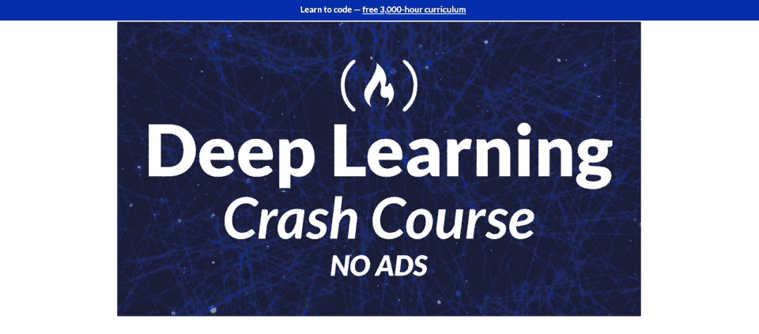**](https://www.freecodecamp.org/news/deep-learning-crash-course-learn-the-key-concepts-and-terms/)

这个免费的深度学习课程涵盖了当你深入研究机器学习和人工智能时你需要知道的基本概念和术语。涵盖的核心概念包括神经网络、激活函数、损失函数、优化器、正则化、递归神经网络和卷积神经网络。对于那些想要了解更多关于深度学习、它如何工作以及它在整个计算机科学领域的影响的人来说，这本入门书是完美的第一步。

**课程规格:**

*   **等级:** 初级
*   **费用:** 免费

*   1.5 小时的 YouTube 视频

[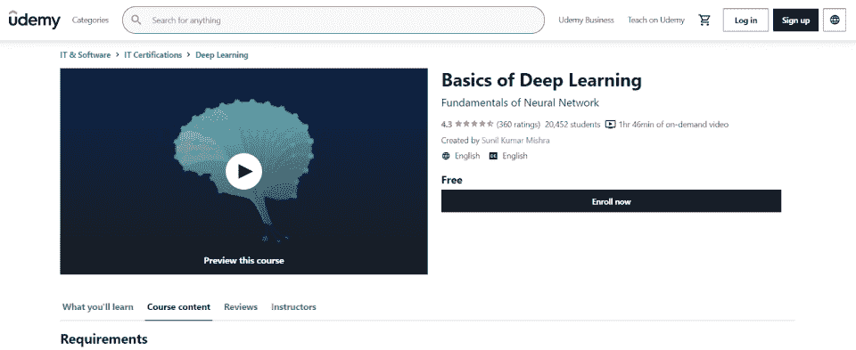](https://click.linksynergy.com/deeplink?id=SeYHzlfZEmI&mid=39197&murl=https%3A%2F%2Fwww.udemy.com%2Fcourse%2Fbasics-of-deep-learning%2F)

作为一门介绍性的深度学习课程，这个 Udemy 课程包括在线视频内容、讲师 Q & A 和直接消息。课程内容包括深度学习的灵感、关键的深度学习概念、改进模型、卷积网络、递归网络和单词表示。这门课程不仅面向开发人员，也面向业务经理、人工智能爱好者和代表人工智能业务的人——比如为机器学习公司工作的营销人员。

**课程规格:**

*   **等级:** 初级
*   **费用:** 免费

*   第七节
*   7 讲
*   1 小时 45 分钟的内容

[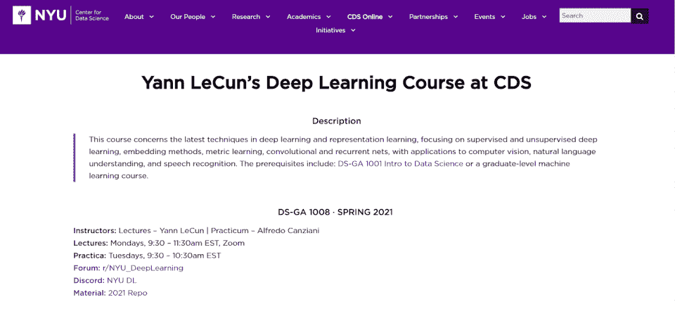](https://cds.nyu.edu/deep-learning/)

*Yann le Cun 深度学习课程* 对于那些研究 *最新* 机器学习和人工智能技术和策略的人来说，许多人都知道这是最好的深度学习在线课程。本课程涵盖了监督和非监督学习、度量学习、嵌入方法、自然语言处理、语音识别以及计算行业内的应用。

整个课程由讲座和实践考试组成。这是一个高水平的课程，是为那些已经有很强背景的人设计的，但是资料是免费在线提供的。学生可以通过 Reddit 和 Discord 直接与讲师交谈，以便于访问。

也就是说，那些通过免费课程材料在线学习的人不会像通过大学(NYU)学习的人那样获得学分。

**课程规格:**

*   **等级:** 高级
*   **费用:** 免费

*   15 周的讲座
*   讲师指导实习

[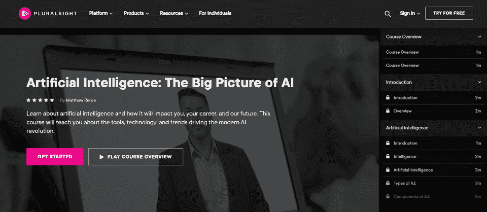](https://pluralsight.pxf.io/9WxyAj)

人工智能会对普通人产生怎样的影响？在这门多元视觉课程中，人工智能被视为经济和社会变革的一种机制。数据驱动的人工智能技术将如何影响就业？它们将如何影响 IT 行业？这门课程非常适合非程序员和非开发人员，他们希望更多地了解人工智能，它是如何工作的，以及它对社会的影响。

**课程规格:**

*   **等级:** 初级
*   **费用:**【299 美元(PluralSight 库)

*   第七节
*   1 小时 15 分钟的内容

[**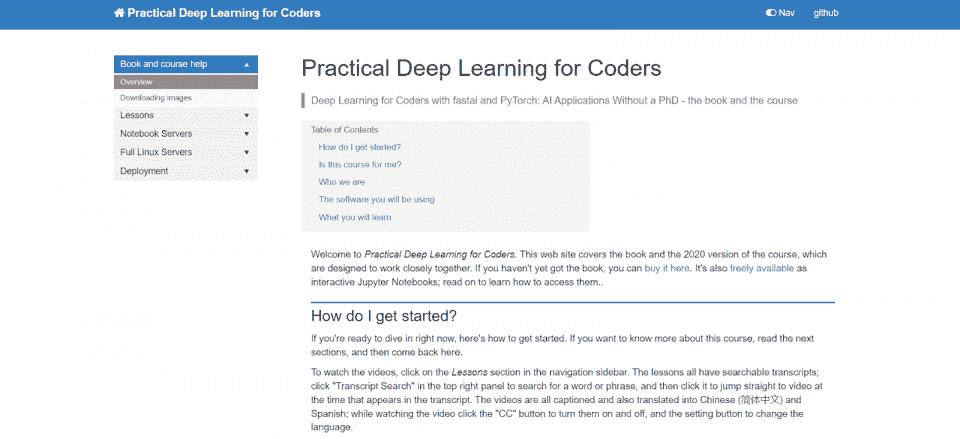**](https://course.fast.ai/)

本课程旨在为程序员提供实用的深度学习知识。它不包括大量的数学或数据，但它涵盖了基础知识。自然语言处理、计算机图像处理、医学、生物学、图像生成等都涵盖在这门免费的课程中。学生可以购买这本书或通过 Jupyter 笔记本与它互动。对于那些想要按照自己的节奏了解更多关于深度学习的人来说，这是一个非常好的系列课程。

**课程规格:**

*   **等级:** 初级
*   **费用:** 免费

*   8 课
*   互动 Jupyter 笔记本

[**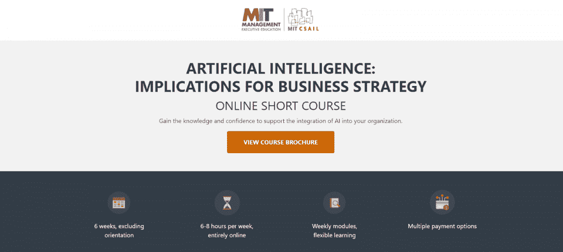**](https://mit-online.getsmarter.com/presentations/lp/mit-artificial-intelligence-online-short-course/)

这门麻省理工学院深度学习课程是一门简短的在线课程，旨在为专业人士提供人工智能如何改善商业战略的见解。它旨在帮助专业人士收集关于人工智能如何改善他们的运营的关键见解。虽然该课程比大多数课程稍贵，但它很灵活，有多种支付方式可供选择。对于非程序员和非开发人员来说，这是一个完美的深度学习速成班。

**课程规格:**

*   **等级:** 初级
*   **费用:**3200 美元

*   6 个模块
*   6 周的学习
*   个性化在线学习体验

[****](https://coursera.pxf.io/Eagxd2)

作为云计算专业人士，想了解更多关于云计算的知识？如果你已经是云专家和机器学习工程师，这个谷歌深度学习课程将帮助你在职业生涯中前进。这一深入的课程涵盖了机器学习工程师的角色，如何设计和构建机器学习模型，以及如何获得专业的机器学习工程师认证。这是一门中级课程，大约需要八个月完成；完美的深度强化学习课程，适合那些寻找另一条职业道路的人。

**课程规格:**

*   **等级:** 中级
*   **费用:**【39 美元/月(Coursera 库)

*   9 道材料
*   8 个月的课程学习

*   **Certificate of Completion:** Yes

    [查看课程](https://coursera.pxf.io/Eagxd2)

[**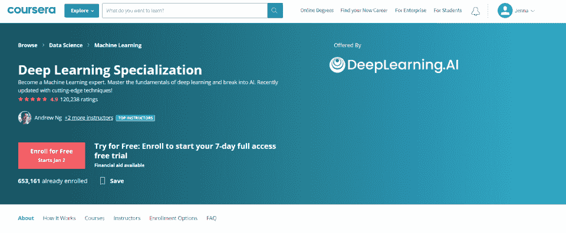**](https://coursera.pxf.io/ORvadW)

由 DeepLearning 提供。Ai，这门 Coursera 深度学习课程帮助学生成为机器学习专家。学生建立和训练神经网络，确定关键的架构参数，建立神经网络，使用神经传输，评估和分析方差，并与自然语言处理。这种灵活的课程需要大约五个月的时间来完成，并深入研究机器学习和数据科学，需要中级 [Python](https://hackr.io/blog/how-to-learn-python) 技能和基本的编程知识。

**课程规格:**

*   **等级:** 中级
*   **费用:**【39 美元/月(带 Coursera 库)

*   5 段

*   神经网络和深度学习
*   改进深度神经网络
*   构建机器学习项目
*   卷积神经网络
*   序列模型

*   5 个月完成

[**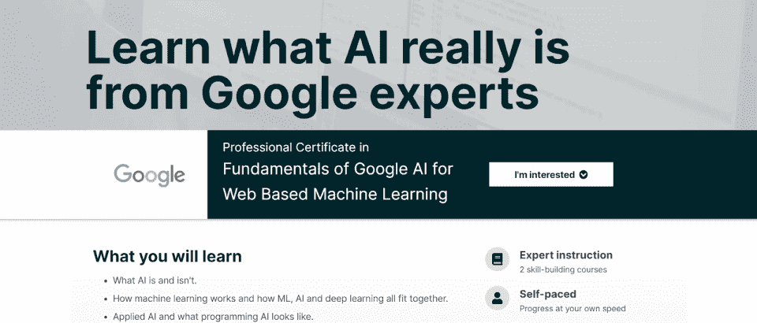**](https://www.awin1.com/cread.php?awinmid=6798&awinaffid=428263&ued=https%3A%2F%2Fwww.edx.org%2Fprofessional-certificate%2Fgoogle-fundamentals-of-google-ai-for-web-based-machine-learning)

在这个激动人心的课堂上，学生们将从谷歌专家那里了解人工智能、机器学习和应用人工智能的基础知识。学生将了解 TensorFlow.js 库、JavaScript 中的机器学习、现有的机器学习模型以及如何创建自己的模型。在课程结束时，学生将创建 Python 或 TensorFlow.js 人工智能模型，并通过网络浏览器运行它们。这个卓越的计划主要面向全栈开发人员。

**课程规格:**

*   **等级:** 中级
*   **费用:**【398 美元
*   **包含:**

*   2 门技能培养课程

*   任何人的谷歌人工智能
*   使用 TensorFlow.js 面向 JavaScript 开发者的 Google AI

*   2 个月的材料

[**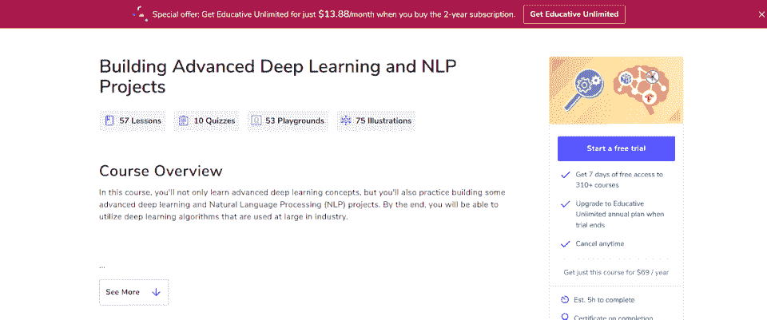**](https://www.educative.io/courses/building-advanced-deep-learning-nlp-projects)

对人工智能、深度学习和机器学习有基本了解的开发人员可以学习与自然语言处理(NLP)相关的高级概念。学生将通过动手的编码环境和项目进行学习，这些环境和项目将引导他们完成开发自己的深度学习机器的过程。有趣的项目包括口袋妖怪分类器、马尔可夫链文本生成和使用 IMDB 的情感分析。学生将意识到人工智能和 NLP 的现实世界应用。

**课程规格:**

*   **等级:** 高级
*   **费用:**【59 美元/月(教育性图书馆)

*   第 57 课
*   10 次测验
*   53 个游乐场
*   75 幅插图

[**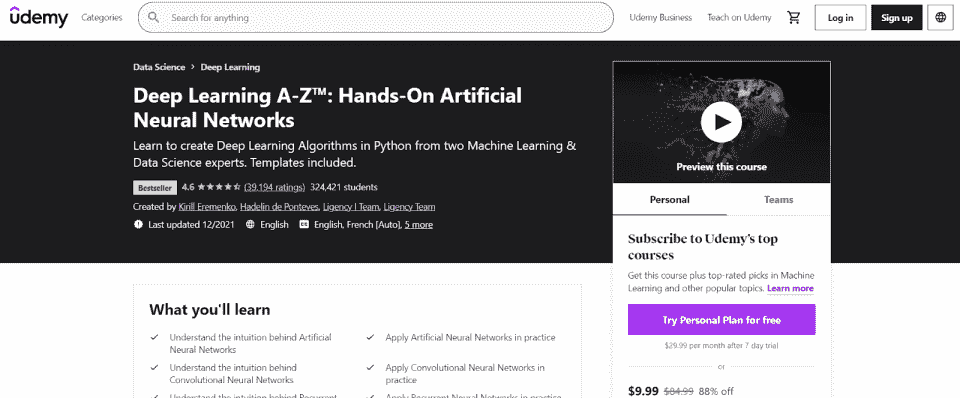**](https://click.linksynergy.com/deeplink?id=SeYHzlfZEmI&mid=39197&murl=https%3A%2F%2Fwww.udemy.com%2Fcourse%2Fdeeplearning%2F)

*深度学习 A-Z* 是为那些想要更深入了解人工神经网络、它们如何工作以及它们背后的实践的人而建立的。通过本课程，学生将学习递归神经网络、自组织映射、玻尔兹曼机器和自动编码器。该课程由纳斯达克、大众汽车、Box、网飞和 Eventbrite 等公司提供，包括深度学习的介绍和一系列可下载的资源。

**课程规格:**

*   **等级:** 中级
*   **费用:**【84.99 美元

*   225 小时的视频
*   5 个可下载资源
*   37 篇文章

[**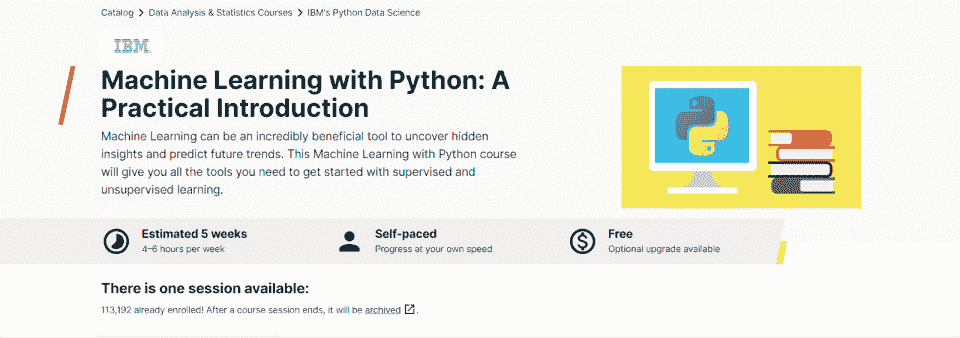**](https://www.awin1.com/cread.php?awinmid=6798&awinaffid=428263&ued=https%3A%2F%2Fwww.edx.org%2Fcourse%2Fmachine-learning-with-python-a-practical-introduct)

由 IBM 通过 edX 提供， *使用 Python 的机器学习* 是那些想要立即开始开发深度学习、机器学习技术的人的理想课程。如果你已经是一名 Python 专家，那么上几堂课之后，你就可以开始构建机器学习应用程序了。在本课程中，您将了解监督方法和非监督方法之间的区别，以及分类、回归、聚类和维度等策略。

**课程规格:**

**等级:** 中级

*   **费用:** 免费
*   **包含:**
*   5 周课程

*   自定进度设计
*   [查看课程](https://www.awin1.com/cread.php?awinmid=6798&awinaffid=428263&ued=https%3A%2F%2Fwww.edx.org%2Fcourse%2Fmachine-learning-with-python-a-practical-introduct)

*   **Certificate of Completion:** Additional Fee ($99)

    [**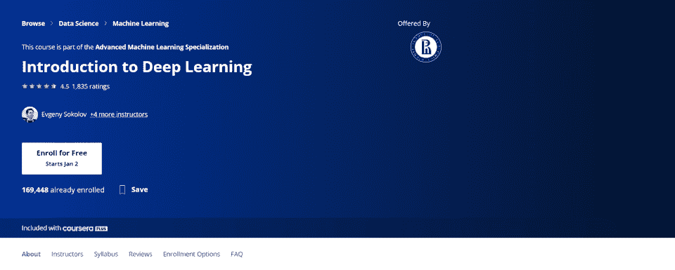**](https://coursera.pxf.io/4exLnn)

作为更广泛的高级机器学习专业的一部分，这门课程对于那些希望对深度学习、机器学习和神经网络有基本了解的人来说是一门极好的课程。通过本课程，学生将了解深度神经网络如何工作，它们是如何构建的，以及这个框架如何提供机械“智能”TensorFlow 和 Keras 框架都包括在内。需要深入的编程和开发知识，包括 Python。

**课程规格:**

**等级:** 高级

*   **费用:**【39 美元/月(Coursera 库)
*   34 小时的内容

*   6 周的材料
*   最终项目
*   [查看课程](https://coursera.pxf.io/4exLnn)

*   **Certificate of Completion:** Yes

    [**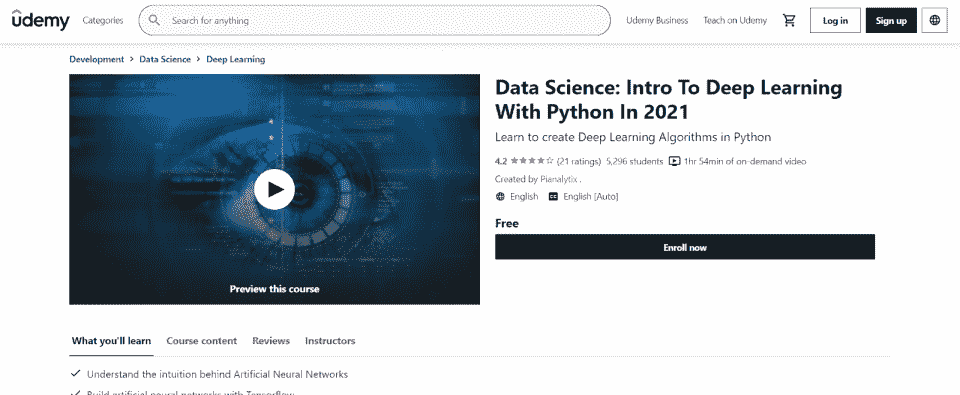**](https://click.linksynergy.com/deeplink?id=SeYHzlfZEmI&mid=39197&murl=https%3A%2F%2Fwww.udemy.com%2Fcourse%2Fcomplete-deep-learning-course-with-python)

    Python 驱动的深度学习实用介绍，本 [数据科学](https://hackr.io/blog/what-is-data-science) 课程涵盖深度学习算法、人工神经网络、TensorFlow.js、图像分类、数据分析、卷积神经网络。本课程旨在让学生立即开始学习免费或付费版本的课程。使用付费版本，学生可以访问讲师 Q & As，并直接向讲师发送消息。课程本身包括所有的代码文件，所以程序员可以浏览它们来学习更多。

**课程规格:**

**等级:** 高级

**费用:** 免费

*   1 小时 54 分钟的内容
*   11 次讲座

*   文件编码
*   [查看课程](https://click.linksynergy.com/deeplink?id=SeYHzlfZEmI&mid=39197&murl=https%3A%2F%2Fwww.udemy.com%2Fcourse%2Fcomplete-deep-learning-course-with-python)

*   **Certificate of Completion:** Yes

    **了解更多关于深度学习和人工智能的信息**

    深度学习、机器学习、神经网络——它们各自都是一门学科。一些学生可能想通过他们的大学参加新兵训练营或参加在线深度学习课程。通过相关学位路径的深度学习斯坦福课程将涵盖你需要了解的关于这个新行业的一切，其实际影响和更广泛的影响。但是许多深度学习专家已经能够单独通过在线材料进行学习。

## 对于深度学习专家来说，这是一个激动人心的时刻。深度学习领域发展速度相当快，深度学习正在应用于各种行业。

**要了解更多关于深度学习的信息，请考虑:**

参加 [机器学习](https://hackr.io/blog/machine-learning-courses) 的课程。

**To learn more about deep learning, consider:**

Taking a course in [machine learning](https://hackr.io/blog/machine-learning-courses).