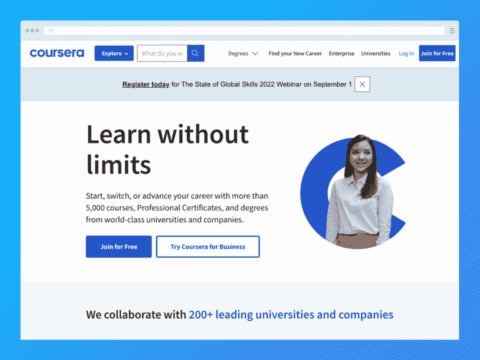
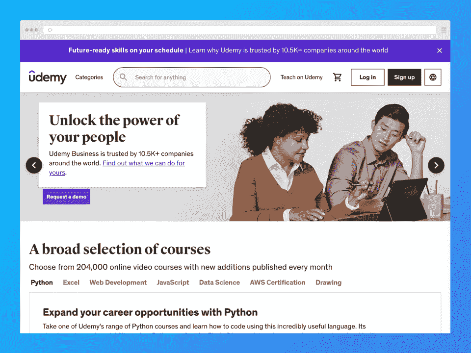
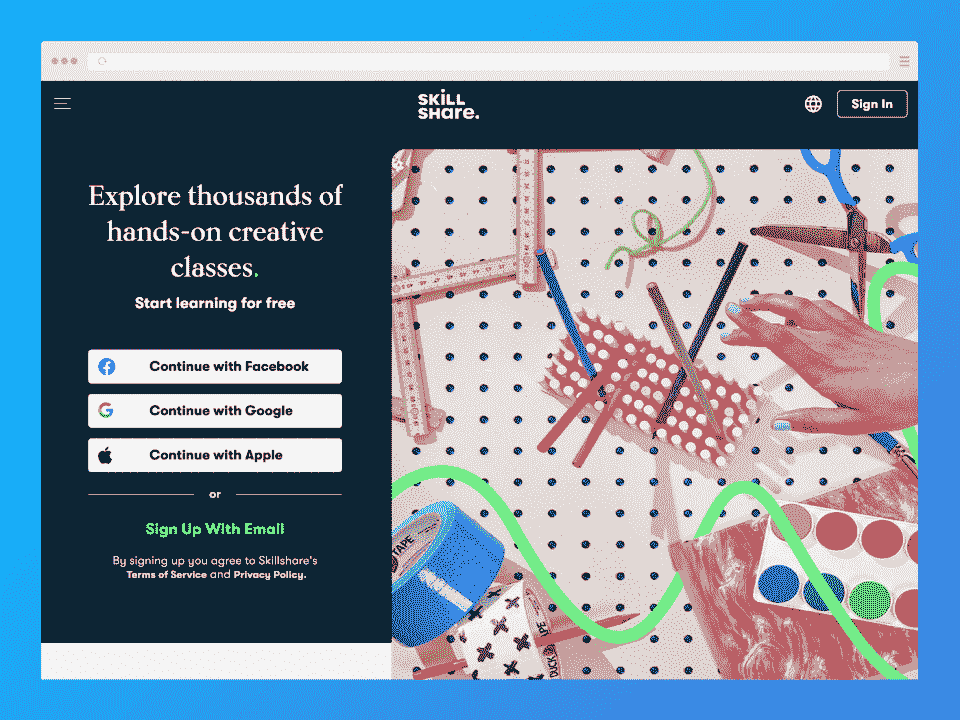
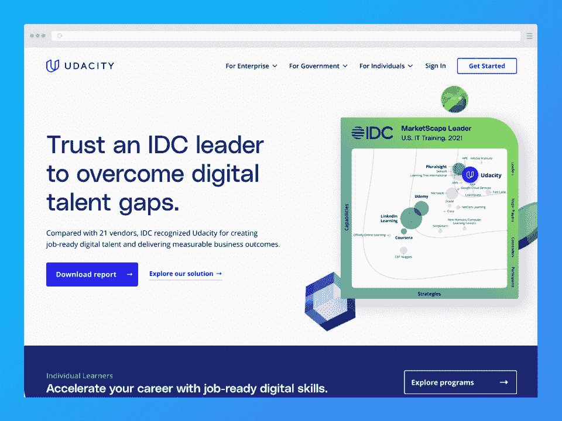
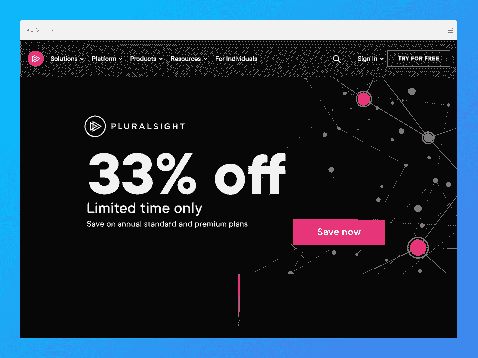
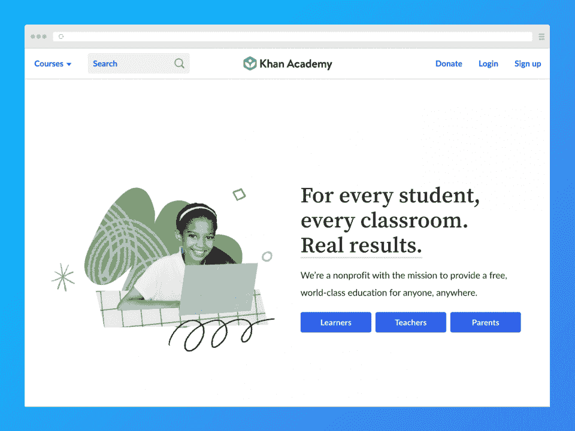
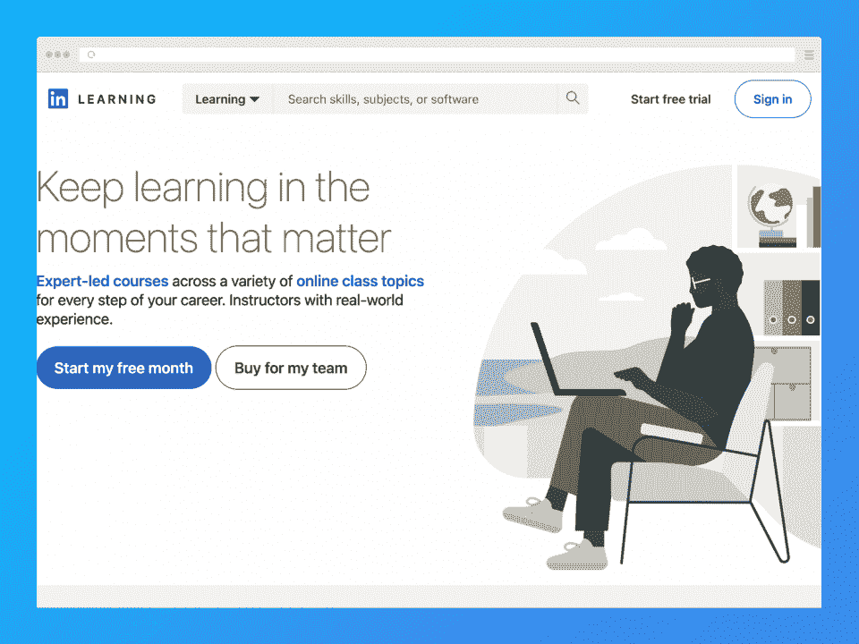
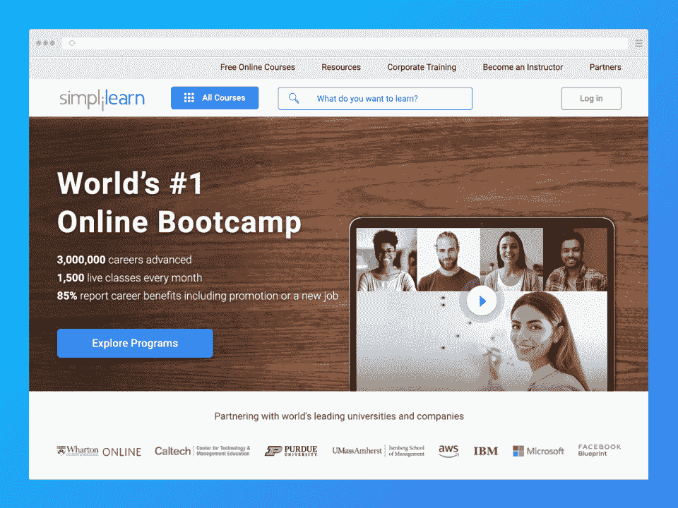
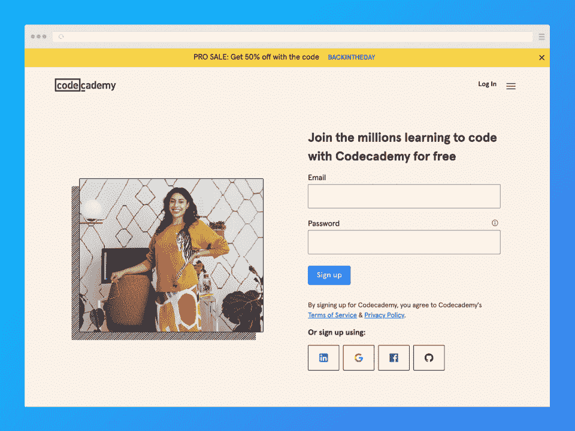

# 2023 年 11 个最佳在线学习平台[排名]

> 原文：<https://hackr.io/blog/best-online-learning-platforms>

如今，越来越多的在线学习平台已经成为主流。很容易理解为什么人们蜂拥而至——顶尖的电子学习平台以这样或那样的方式提供了巨大的价值。一些学校提供的课程可能更实惠，而另一些则更贵。无论哪种方式，你都会学到一项新技能，在课程结束时可能会帮助你提升职业生涯。大多数课程会奖励你一张结业证书，而有些甚至会帮助你获得或保持你的专业认证。

当然，你有 Coursera、Udemy 和 LinkedIn Learning(以前的 Lynda.com)等主流平台，但现在有这么多平台，很难跟踪所有平台。如果你对所有这些训练平台感到困惑，这个指南列出了其中最好的。

请继续阅读，了解最好的学习平台，并了解更多！

## **最佳在线学习平台【2023】**

*   Coursera -最佳在线课程订阅平台
*   Udemy -最适合休闲学习和小众话题
*   Skillshare -最适合创意技能课程
*   [Udacity](https://imp.i115008.net/2rzJk7) -最有利于职业发展
*   edX -最佳免费在线学习平台
*   [PluralSight](https://pluralsight.pxf.io/BXMzx1) -职场人士的最佳学习平台
*   [可汗学院](https://www.khanacademy.org/) -学习数学的最佳免费平台
*   [LinkedIn Learning](https://linkedin-learning.pxf.io/jW0Z2M) -最适合准备认证和获得 ceu
*   最适合新兵训练营
*   [Simplilearn](https://www.simplilearn.com/) -最适合灵活学习
*   CodeAcademy -学习编程的最佳在线平台

## 在线学习平台的基本特征是什么？

当你考虑你的选择和浏览每个在线学习平台时，有几件事需要留意。考虑以下这些基本特征:

*   **符合你的预算** -大多数人选择在线学习平台是因为他们倾向于比传统学校教育(如学院和大学)更实惠。然而，并不是所有的平台都是平等的——有些免费提供课程，有些非常实惠，还有一些会在你的钱包里烧一个洞。确保您选择的平台符合您的预算！

*   **优质课程**——不言而喻，一个好的平台应该提供给学习者提供价值的课程。在每门课程结束时，他们应该已经学到了新的东西。同样，并非所有的平台都是一样的——有些平台提供的课程更适合个人消费，而另一些平台则提供真正有潜力帮助你推进职业发展的课程。不管怎样，课程应该制作精良，易于理解，内容丰富，准确无误。

*   高质量的讲师——一门课程的好坏往往取决于它的讲师。有些平台对导师的标准比其他平台高。

*   **用户友好界面**——无论平台只有一个网站，还是也提供一个 app，都应该一直有一个设计良好、用户友好的界面。直观的体验可以走很长的路。

*   **便利性** -一些平台提供应用程序和离线学习以获得最大的便利。有些甚至允许你下载课程资料并无限期保存。

*   **良好的支持** -你选择的任何平台都应该有良好的客户支持。你最不希望的事情就是在为一个不适合你的课程付了很多钱后被冷落。

*   **可访问性选项** -可访问性是每个平台都应该具备的。不幸的是，并非所有平台都提供不同语言的字幕内容、文字记录或课程。

大多数电子学习平台还应该提供免费试用或永久免费层，让你在付费前更近距离地了解一切是如何工作的。如果两者都没有，检查他们的退款政策，确保你可以在一定程度上尝试一门课程，如果你不太满意，可以退回。也可以找退款保证。

## **2023 年最佳电子学习平台**

### 1.[**Coursera**](https://imp.i384100.net/AoD4WK)**——最佳在线课程订阅平台**

#### [****](https://imp.i384100.net/AoD4WK)

#### **关键信息:**

*   Coursera 提供一些免费内容，如指导项目或个人课程
*   Coursera Plus 订阅:59 美元/月或 399 美元/年(14 天退款保证)
*   指导项目:9.99 美元以上
*   专业证书和专业:39.99 美元以上
*   mastartrack 证书:2000 美元以上
*   9000 美元以上的学位

*   **课程数量:**5000+门
*   涵盖的主题: Coursera 提供 IT、计算机科学和数据科学方面的课程。你也可以在这样的领域找到全学位。该平台还提供其他主题的内容，如商业、健康、艺术和人文、社会科学等。

查看我们完整的 Coursera 评论，了解更多信息。

#### **这个平台是给谁的？**

很难明确指出 Coursera 是为谁服务的，因为该平台面向各种市场。Coursera 是为那些想学习平台上提供的任何科目的人准备的。它也面向那些在线寻求学位的人，尽管 Coursera 的学位目录目前仍然有限。Coursera 的目标是寻求提升员工技能的个人和企业。

#### **优点**

*   提供一些雇主认可的认证证书
*   课程通常由知名公司和大学建造
*   大量免费课程
*   可访问性—课程以多种语言提供
*   网站非常用户友好

#### **缺点**

*   课程在质量或提供的价值方面有时会不一致
*   有些课程不是那么自定进度的
*   注册学位课程需要遵循额外的申请流程

### 2.[**Udemy**](https://click.linksynergy.com/deeplink?id=jU79Zysihs4&mid=39197&murl=https%3A%2F%2Fwww.udemy.com%2F)**——最适合休闲学习和小众话题**

#### [****](https://click.linksynergy.com/deeplink?id=jU79Zysihs4&mid=39197&murl=https%3A%2F%2Fwww.udemy.com%2F)

#### **关键信息:**

*   教师为他们的课程选择价格
*   有免费课程，但你不能获得证书
*   课程起价不到 10 美元，最高可达 300 美元以上，但 Udemy 经常提供高达 70-90%的折扣
*   Udemy 个人计划:29.99 美元/月，可访问 6000 多门精选课程

*   **课程数量:** 20 万以上
*   涵盖的主题: Udemy 提供几乎任何你能想到的主题的课程。在这里，您还可以找到大量与计算机科学、web 开发、软件开发、数据科学、数据可视化、机器学习等相关的课程。

#### **这个平台是给谁的？**

因为任何人都可以在 Udemy 上创建课程，所以似乎有一种感觉，Udemy 更适合临时学习者和想要学习一两项新技能的人。虽然这些技能通常很有用，可以帮助你找到工作，但 Udemy 的证书往往不被雇主认可。

#### **优点**

*   个人购买课程的 30 天退款保证
*   完全自定进度
*   永远保留您购买的课程
*   多媒体讲座、测验、项目等等
*   200，000 多门课程
*   负担得起的
*   许多课程都有其他语言版本

#### **缺点**

*   雇主通常不承认 Udemy 颁发的证书
*   课程的问答部分并不总是活跃的；许多教师不参加
*   课程质量差异很大

### 3.****-最适合创意技能课程****

 **#### [****](https://skillshare.eqcm.net/e4Md96)

#### **关键信息:**

*   有一些免费内容，虽然不多
*   那么，一个月的免费试用
*   每月支付 32 美元；每年支付 168 美元/月
*   使用有效帐户创建的帐户。edu 电子邮件地址获得 50%的折扣

*   **课程数量:** 40，000+门
*   涵盖的主题:虽然 Skillshare 主要提供与创造性技能相关的课程，但也有关于网络开发、商业和企业家精神、生产力等方面的课程。

#### **这个平台是给谁的？**

Skillshare 最适合那些希望学习与创新领域相关的新技能的人。在这个平台上，你可以学习从动画到摄影甚至平面设计的一切。然而，那些想学习 web 开发的人也可以在这里找到一些有用的东西。

#### **优点**

*   有多种课程主题可供选择
*   指导老师一般都很熟练；有些人甚至是名人
*   寻求提升技能的创意人员的绝佳平台

#### **缺点**

*   免费内容相当有限
*   课程只有英语
*   除非你付费订阅，否则就有广告

### 4.[**uda city**](https://imp.i115008.net/2rzJk7)**——最适合职业成长**

#### [****](https://imp.i115008.net/2rzJk7)

#### **关键信息:**

*   单科课程和纳米学位每月 399 美元
*   注册一个纳米学位并选择超值套餐(提前支付几个月的费用)可以让你享受 15%的折扣

*   **课程数量:** 200+免费课程，70+纳米学位
*   覆盖的主题: Udacity 提供各种主题的课程和纳米学位，包括云计算、人工智能和机器学习、网络安全、数据科学、编程、项目管理等。

#### **这个平台是给谁的？**

Udacity 最适合那些认真想把从平台中学到的东西变成职业的学习者。业余爱好者和业余学习者仍然可以从这个平台学到很多东西，但价格可能会成为一个障碍。

#### **优点**

*   纳米学位是高强度的项目，最终可以帮助你做好职业准备
*   由于 Udacity 课程的质量，证书得到了雇主的广泛认可
*   课程通常是与受尊敬的公司和教师共同创建的
*   纳米学位的学生得到一些简历和作品集的支持
*   符合条件的学生可以获得一些奖学金

#### **缺点**

*   与其他平台相比，价格昂贵
*   有些课程有报名截止日期
*   纳米学位需要更多的时间投入

### 5.[**edX**](https://edx.sjv.io/c/2890636/1598007/17728?u=https%3A%2F%2Fwww.edx.org%2F)**——最佳免费在线学习平台**

#### [****](https://edx.sjv.io/c/2890636/1598007/17728?u=https%3A%2F%2Fwww.edx.org%2F)

#### **关键信息:**

*   你可以免费旁听所有常规课程，但你不能获得证书
*   获取作业和证书的价格从 50 美元到 300 美元不等
*   训练营、微观硕士课程、学士学位、硕士学位和专业证书课程的费用各不相同，可能高达数千英镑(这些课程不能免费旁听)

*   **课程数量:**5100 门以上
*   涵盖的主题: edX 提供各种主题的课程，包括编码和开发、数据科学、计算机科学等。edX 也是 STEM 相关学科最好的在线培训平台。

#### **这个平台是给谁的？**

edX 适合几乎任何年龄的各种学习者。edX 拥有 4000 万用户，几乎可以为任何人提供课程，无论他们是业余爱好者还是在职专业人士。目前，edX 正在发布更多的学士和硕士学位课程，这意味着该平台将在未来更多地面向大学层次的受众。

#### **优点**

*   您可以免费参加任何常规课程，但不能获得证书
*   该平台提供各种认证课程、学士学位课程、微硕士课程等
*   符合条件的学生可以获得经济资助，有时高达 90%的折扣
*   14 天退款保证

#### **缺点**

*   并非所有计划都提供经济援助
*   随着 edX 的货币化，定价模式可能会改变

### 6.****-职场人士最佳学习平台****

 **#### [****](https://pluralsight.pxf.io/BXMzx1)

#### **关键信息:**

*   **定价:**(针对个人)

*   标准:$29/mo 按月支付；每年支付 299 美元
*   亲:每月支付 45 美元/月；每年支付 449 美元
*   五门免费课程，每周轮换

*   **课程数量:**7500 多门课程和几百条路径
*   **涵盖的主题:** PluralSight 提供与软件开发、信息技术、网络安全、数据科学等主题相关的课程和途径。

#### **这个平台是给谁的？**

PluralSight 肯定有望获得职业人士最佳电子学习平台的称号。它也是那些寻求扩展其数据科学相关知识的人的最佳选择。作为授权的 CEU(继续教育单位)提供商，在该平台上获得的许多证书都被视为专业证书持有者的 CEU 或 CPE(继续专业教育)。

#### **优点**

*   有超过 7，500 个高质量的课程和数百条路径，并且每个月都在增加
*   所有课程都有完整的文字记录，隐藏式字幕，并翻译成 50 多种语言
*   讲师和课程创建者都是经过审查的专家
*   与 Udacity 等其他平台相比，价格相当实惠

#### **缺点**

*   没有退款意味着如果您对您的订阅不满意，您无法获得退款
*   初学者课程可能更容易
*   所有课程都与技术相关(不一定是坏事)

### 7. [**可汗学院**](https://www.khanacademy.org/)**——学习数学的最佳免费平台**

#### [****](https://www.khanacademy.org/)

#### **关键信息:**

*   **定价:**永远免费！
*   **涵盖的主题:**可汗学院最近转向提供免费的 K-14 级教育，因此该网站上的大多数主题都涵盖了此类主题。但是，也有一些大学水平的课程，生活技能课程，以及所有关于计算和计算机编程的课程。

#### **这个平台是给谁的？**

虽然这个平台更适合 K-14 学习者，但任何人都可以访问这里的课程。可汗学院以其完全免费和全面的数学课而闻名。Khan Academy 是那些想要数学基础知识的人的最佳学习平台之一，这些知识可以帮助他们以后进行计算机科学和数据相关的研究。

可汗学院是独一无二的，因为它免费提供所有的课程，并把永远免费作为自己的使命。这个平台得到了慷慨捐助者的全力支持，无论他们是像你这样的个人还是像谷歌这样的科技巨头，谷歌迄今为止已经捐赠了数百万美元。

#### **优点**

*   课程质量很高，由知识渊博的专家创建
*   用户友好、直观且易于使用
*   卓越的声誉

#### **缺点**

*   内容已经转移到更多的 K-14 相关，因此，该网站将不再对很多人有用
*   技术相关科目的有限课程
*   没有证书

### 8. [**LinkedIn 学习**](https://linkedin-learning.pxf.io/jW0Z2M)**——最适合认证准备和获得 CEUs**

#### [****](https://linkedin-learning.pxf.io/jW0Z2M)

#### **关键信息:**

*   那么，一个月的免费试用
*   个别课程价格从 20 美元到 40 美元不等
*   包月:39.99 美元/月；每年支付 323.88 美元

*   **课程数量:** 17，000+门
*   涵盖的主题: LinkedIn Learning，前身为 Lynda.com，提供各种主题的课程，其中大多数都与职业发展有关。在这里，你可以找到三个主题的课程:商业、技术和创意。与计算机科学相关的主题在技术下面，在那里你可以找到编程之类的课程。LinkedIn Learning 还提供各种课程，旨在帮助准备认证或为学习者提供保持现有认证所需的继续教育单元(ceu)。

#### **这个平台是给谁的？**

LinkedIn Learning 是那些寻求获得专业认证(或保持现有认证)的人的最佳学习平台之一。LinkedIn Learning 隶属于无数认证机构，这意味着你在这个平台上学习的课程可以帮助你准备认证评估。如果您想了解该平台涵盖哪些认证，请查看此[链接](https://linkedin-learning.pxf.io/4e7mXM)。

#### **优点**

*   与其他平台相比价格合理
*   提供 ceu 和认证准备
*   一个月的免费试用可以让你接触到所有的课程
*   课程质量高，制作精良
*   结业证书可在您的 LinkedIn 个人资料上共享

#### **缺点**

*   证书不被认可
*   话题有些局限
*   用户界面需要更新
*   有些课程需要更新

### 9.****-最适合训练营****

 **#### [****](https://www.thinkful.com/)

#### **关键信息:**

*   没有免费试用
*   一些部分时间制课程为 4500 美元，全日制课程最高可达 16000 美元
*   由于参加 Thinkful 训练营的相关费用很高，该平台提供了各种支付方式，包括不需要预付的延期支付
*   Thinkful 还为符合条件的毕业生提供学费退款保证，如果符合某些条件，可以全额退款

*   **课程数量:** 6 个高强度训练营
*   涵盖的主题: Thinkful 提供几个主题的完整训练营，即软件工程、数据科学、数据分析、UX / UI(用户体验/用户界面)设计、数字营销和技术项目管理。

#### **这个平台是给谁的？**

Thinkful 是提供技术相关主题训练营的最佳平台之一。训练营通常是紧张的项目，通常是全职的，但 Thinkful 也为那些有其他责任的人提供兼职项目。花大价钱报名参加其中一个项目，你还可以得到一对一的指导，获得职业服务和指导。Thinkful 的职业服务专注于帮助学生在毕业后尽快找到工作，所以我们也可以说 Thinkful 是那些寻求开始新的职业生涯或在现有职业中前进的人的最佳平台之一。

#### **优点**

*   因为 Thinkful 只有六个训练营，所以你可以放心，每个训练营的质量都非常高
*   一对一辅导提供了一种独特的新学习方式
*   社区全力支持
*   全日制项目有预备课程来帮助你做好准备
*   感恩提供了许多支付训练营费用的方法
*   如果您符合资格要求，学费退款保证可以帮助您收回所有学费

#### **缺点**

*   一些评论指出导师的质量是不一致的
*   你需要通过预科课程才有资格注册全日制课程
*   贵！
*   可以使用更多主题的程序

### 10.****——最适合灵活学习****

 **#### [****](https://www.simplilearn.com/)

#### **关键信息:**

*   自定进度学习起价 400 美元
*   在线训练营选项起价 700 美元
*   所有课程都是一次性购买的
*   Simplilearn 通过 [SkillUp](https://www.simplilearn.com/skillup-free-online-courses) 提供免费课程

*   **课程数量:** 400+门课程
*   **涵盖的主题:** Simplilearn 提供技术和商业相关主题的课程，如数据科学、人工智能/机器学习、网络安全、项目管理、软件开发、商业和领导力等。

#### **这个平台是给谁的？**

对于那些想要以独特的方式学习技术和商业相关技能的人来说，Simplilearn 无疑是最好的电子学习平台。这个平台承认人们都以自己的方式学习，这就是为什么它提供选项供学生选择。例如，如果你喜欢完全自定进度的课程，不需要你与他人互动或在任何特定时间出现，你可以选择自定进度的课程。另一方面，在线训练营更适合喜欢现场讲座的人。

#### **优点**

*   选择自定进度或在线训练营学习方式
*   课程由行业专家创建和指导
*   在这个平台上获得的一些证书被认为是 ceu 和 CPE
*   卓越的客户服务
*   七天免费试用

#### **缺点**

*   有限的支付选项
*   课程只有英文版，没有字幕
*   一些评论表达了对课程质量的不满

### 11.[**Code academy**](https://www.pjtra.com/t/TUJGR0lLR0JHRklKSkdCR0ZISk1N?url=https%3A%2F%2Fwww.codecademy.com%2F)**——学习编码的最佳在线平台**

#### [****](https://www.pjtra.com/t/TUJGR0lLR0JHRklKSkdCR0ZISk1N?url=https%3A%2F%2Fwww.codecademy.com%2F)

#### **关键信息:**

*   CodeAcademy 提供了一个永远免费的“基础”层，允许访问日常实践和交互式课程
*   pro Lite:14.99 美元/mo 按月付费；每年支付 11.99 美元/月
*   Pro: $19.99/mo 按月支付；每年支付 15.99 美元/月

*   **课程数量:** 60 门以上
*   覆盖的主题: CodeAcademy 提供数据科学、web 开发、计算机科学、机器学习、web 设计、游戏开发、移动开发、网络安全、数据可视化、人工智能等主题的课程。它提供了数据科学、编程和开发以及信息技术的各个方面。

#### **这个平台是给谁的？**

CodeAcademy 是最好的在线教育平台之一，适合那些想学习如何编码的人，无论他们的技能水平如何。即使你是一个绝对的初学者，CodeAcademy 也会有内容帮助你入门。

#### **优点**

*   初学者友好的平台；即使是完全的新手也会发现有益的教训
*   你可以通过 CodeAcademy 学习 15 种编程语言
*   免费的永久基础层对任何需要学习而不需要花里胡哨的人来说都是很棒的
*   社区支持随时可用
*   非常实惠

#### **缺点**

*   导航有时可能是一个挑战
*   付费计划不提供付费试用，所以在提交之前你看不到付费墙后面的内容
*   你不能逃课

## **我们如何选择最佳在线学习平台**

由于在线学习的突然繁荣，现在的平台比人们所能追踪的还要多。可用平台的数量可能会非常多，所以我们考虑了一些因素来帮助我们决定将哪些放在这个列表中。

以下是我们看到的内容:

*   **谁的平台适合** -我们确保只包括可以帮助您了解更多编程、IT、数据科学等知识的平台。从这些平台上，你可以找到针对初学者的[编码课程](https://hackr.io/blog/coding-for-beginners)，甚至是数据科学中复杂的高级程序。

*   **定价** -我们确保列出了每个价位的各种课程。

*   **评论** -我们已经选择了包括我们已经深入研究和评论过的平台，因为我们可以保证它们的质量。此外，我们对公众对这些平台的普遍共识做了大量研究。我们淘汰了任何不符合我们高标准的东西。

*   **学习风格** -尽管这个列表中的大多数平台都提供自定进度的学习，但有些平台提供的学习体验与其他平台不同。我们选择包括不同的学习选项，因为每个人都以自己的方式学习。

*   **课程和讲师质量** -我们消除了任何不符合我们质量标准的平台。

我们还确保包括提供更休闲体验的平台以及旨在为你提供专业帮助的平台。

## **开源、免费、付费平台有什么区别？**

你可能遇到过三种不同类型的在线学习平台:免费、开源和付费。

付费平台正是它们听起来的样子。他们会要求你付费购买课程或订阅他们的服务来访问他们的目录。值得一提的是，这些付费平台中的大多数确实提供了一个“永远免费”的限制访问层。否则，他们可能会每周(或每月)从目录中提供一次免费试用或一些免费的轮流课程。

另一方面，免费平台免费提供所有内容。一个很好的例子是汗学院，这是一个非营利组织，致力于为所有人提供免费教育——永远免费！免费在线学习平台永远不会要求你支付任何费用，尽管如果你愿意，可能会有捐赠链接让你支持他们的网站。

开源学习平台是另一个免费的选择。然而，与通常由个人或组织运营的免费平台不同，开源平台对每个人的贡献开放。这方面最好的例子之一是维基百科，它是在一种你可以称之为开源的管理风格下运行的。毕竟，维基百科允许任何人在网站上撰写或编辑文章。

## **结论**

如今有如此多的在线学习平台，要找到一个最适合你的平台是很有挑战性的。幸运的是，有很多方法可以检验一个平台是否适合你，比如通过阅读评论。大多数平台也有免费试用或免费课程，可以让你一窥一切是如何工作的——所以在你承诺之前试一试吧！

我们希望这个指南已经帮助你弄清楚你想先看看哪个平台。如果你还没准备好参加付费在线课程，你可以看看我们关于最佳免费编码训练营的文章。

## **常见问题解答**

#### **1。哪个在线学习平台最好？**

在线培训的最佳平台将是最适合您需求的平台。考虑一些因素，比如你的预算，你想学的主题，你愿意投入学习的时间长度，以及你是否想要最终获得一个证书。此外，如果你参加课程是为了准备或保持专业认证，确保你选择的平台得到相应认证委员会的认可是很重要的。

#### **2。什么是数字化学习平台？**

在线学习平台是允许任何人按照自己的进度在互联网上学习的网站或应用程序。这些平台很多都是 MOOC(海量开放在线课程)提供商。

#### **3。最大的在线学习平台是哪个？**

在我们看来，如果从课程数量来看，Udemy 是最大的在线学习平台。Udemy 目前在其平台上拥有超过 20 万门课程。然而，许多其他平台(如 edX)的用户数以千万计。

#### **4。在线学习平台要花多少钱？**

在线学习平台可以以各种不同的价格提供课程——一些免费提供一切，而另一些收费超过 10，000 美元。不过，有一点是肯定的:这些平台的课程几乎总是比传统学院和大学提供的类似课程更实惠。请注意，在线学习平台通常按月收费，或者要求你为你想学习的每门课程付费。

**人也在读:**********