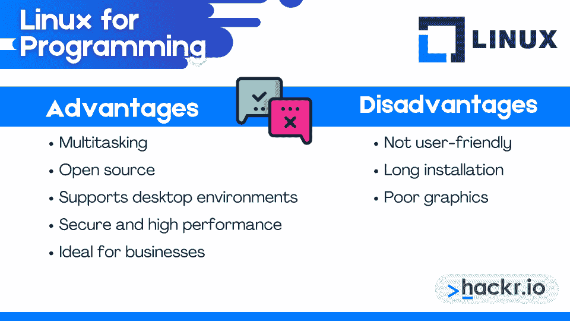
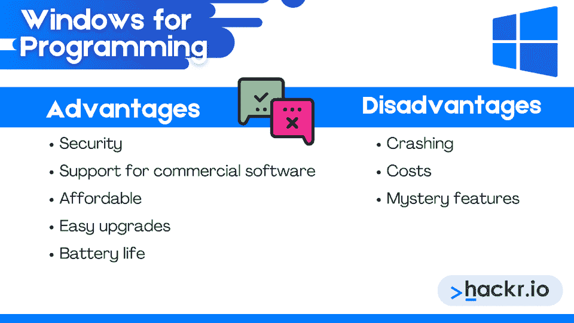
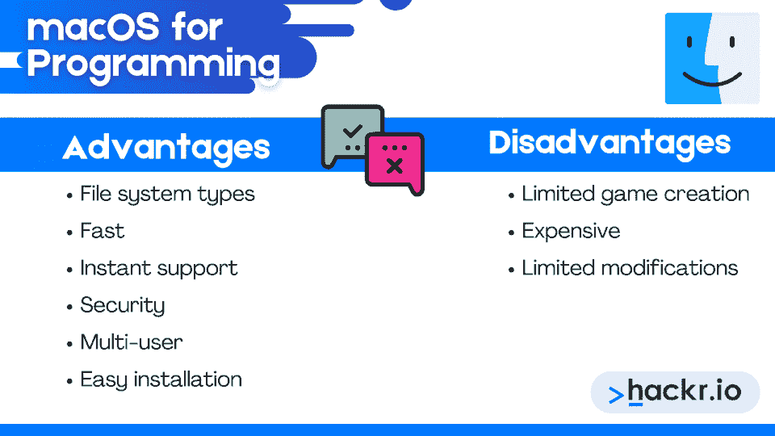

# 2023 年最佳编程操作系统[推荐]

> 原文：<https://hackr.io/blog/best-os-for-programming>

每台笔记本电脑、手机和视频游戏机都有一个操作系统。你可能熟悉最流行的两个:macOS 和 Windows。但是对于编程来说，什么是最好的操作系统呢？它们之间有什么不同呢？

我们将带您了解三款最适合编程的操作系统，并帮助您了解每款操作系统的独特功能。

请继续阅读，了解最适合编程的操作系统。

## **什么是操作系统？【定义】**

操作系统是一个管理计算机内存和进程的软件程序。它充当计算机硬件和软件程序之间的管道。你会在笔记本电脑、手机和台式机等设备上找到操作系统。

从笔记本电脑、手机到台式机和游戏机，每台电脑设备都需要一个操作系统来运行。一些操作系统的例子包括 Windows、macOS、Linux、 [Unix](https://hackr.io/blog/unix-vs-linux) 、Kali 和 Chrome OS。

### **操作系统的特性和功能**

所以我们知道操作系统管理计算机程序，但那究竟意味着什么呢？让我们来看看操作系统编码实现的功能:

*   **启动:**这意味着打开电脑，准备使用。
*   **内存管理:**管理内存需求将内存块分配给软件程序和应用程序，确保主内存有足够的空间来保持程序运行，并跟踪已用完的内存空间。

*   **加载和执行:**这意味着在执行或运行程序之前，将程序加载到系统内存中。
*   **数据安全:**操作系统保护计算机数据免受不必要的访问、修改和破坏。
*   **磁盘空间管理:**一个操作系统有效地维护保存在磁盘上的目录和文件。
*   **流程管理:**操作系统对流程进行优先级排序、调度和跟踪，以便执行。
*   **设备管理:**这需要通过各自的驱动程序管理系统连接的设备。
*   界面:操作系统为用户提供了一个界面来导航和与计算机组件通信。图形线界面用于可视组件(图标、菜单等)。)，而命令行界面使用户能够向计算机中键入命令以与之交互。

## **最佳编程操作系统**

今天的技术专家有几个操作系统可供选择。以下是我们的操作系统综述，帮助您确定最适合程序员的操作系统:

### **1。Linux**

Linux 是一个内核，是许多其他操作系统的基础。因为 Linux 内核是开源的，任何人都可以使用或修改它。

Linux 内核甚至是 Android 操作系统的基础。Linux 操作系统的一些常见任务包括文件共享、在线浏览、办公、打印和视频编辑。

#### **Linux 的发行版**

Linux 发行版也称为发行版，是一种操作系统，它具有一个软件包管理系统和一个构建在 Linux 内核上的软件集合。Linux 用户通常下载一个 Linux 发行版，如 CentOS、Ubuntu 或 Debian，来安装他们的操作系统。Ubuntu、CentOS 和 Debian 是最常用的三个 Linux 发行版。

#### **Linux 的优势**

*   **多任务处理:**Linux CPU 可以在不进入待机模式的情况下进行多任务处理，同时管理几个任务。当中断时，操作系统只是在活动之间切换，包括向 GPU 发送新信息或刷新图形。即使一个进程没有完成，CPU 也可以暂停，稍后再返回。

*   **开源:**任何人都可以使用 Linux OS，并利用其源代码来修改规范。此外，开源操作系统促进了问题的快速解决，并确保每个人都有平等的机会为项目做出贡献。

*   支持桌面环境: Linux 操作系统支持 Gnome、Mate、Cinnamon 和 KDE 等离子，以及其他桌面环境。

*   **安全和高性能:** Linux 是一个快速和安全的操作系统，允许您加密您的驱动器并快速运行源代码和脚本。许多人认为这些特性使 Linux 成为编码的最佳操作系统。

*   **商业的理想选择:** Linux 允许几个用户在它的操作系统上协作，而不会互相干扰。当然，他们不能查看或重写其他用户的数据。

#### **Linux 的缺点**

*   不便于用户使用: Linux 适合有经验的程序员，因为常见的任务都是在命令行执行的。

*   **长时间安装:**大多数电脑都不包含预装的 Linux 操作系统。

*   **显卡差:** Linux 不适合显卡优秀和 AAA 称号的游戏。

### **2。窗户**

Windows 是一个带有图形用户界面(GUI)的操作系统。微软在 1983 年发布了第一个版本——Windows 1.0。正如今天的 11.0 版本所示，该操作系统继续接受更新和改进。

Windows 操作系统为用户提供了玩游戏、存储文件、访问数据库、创建桌面应用程序和运行各种应用程序包的界面。用户可以在互联网上创建、上传、下载、编辑、更新或删除任何类型的文件。它的多功能性使许多专业人士认为它是开发人员的最佳操作系统。

#### **Windows 的优势**

*   **安全性:** Windows 拥有一项新的安全特性 UEFI 系统上的“安全引导”功能，可防止恶意软件感染引导过程。该系统还启用 pin 和图像密码作为安全的触摸屏优化认证技术。

*   **对商业软件的支持:**如果你有钱，你可以在 Windows 上运行昂贵的商业软件。这不是其他操作系统的通用功能。

*   经济实惠: Windows 是一款更便宜的操作系统，具有巨大的价值，尤其是与 macOS 相比。

*   **轻松升级:** Windows 每六个月接受一次重大更新，使系统更加健壮、快速和安全。

*   **电池寿命:**Windows OS 的电池寿命比 macOS 长。

#### **Windows 的缺点**

*   **崩溃**:损坏的文件使得 Windows 操作系统经常崩溃。

*   **费用:** Windows 用户必须支付年度许可费才能使用该操作系统，微软继续提高订阅价格。

*   **神秘功能:**众所周知，微软会在没有通知的情况下添加和删除功能。

### **3。苹果电脑**

macOS 是一种允许你玩视频游戏、检查电子邮件、编辑照片、浏览网页等等的操作系统。它目前支持 39 种语言，包括 C、Objective-C、C++和 Swift。

macOS 平台采用 Aqua 用户界面，围绕混合内核构建。该系统与工作站、计算机和嵌入式设备兼容。

#### **MAC OS 的优势**

*   **文件系统类型:** macOS 支持 NTFS 和 FAT 两种文件系统类型，和 Windows 一样。

*   **快速:**与 Windows 不同，macOS 的安装中包含强大的应用程序，不会影响系统性能。

*   **即时支持:**与其他操作系统相比，macOS 拥有一支由知识渊博的工程师组成的技术支持团队，可以帮助用户解决任何问题。

*   **安全性:**MAC OS 系统安全性很高，病毒攻击的病毒率很低。这可能是因为它是 UNIX 操作系统家族的一员。

*   **多用户:**多个用户可以在 macOS 上协作，而不会影响彼此的资源。

*   **轻松安装:**你可以毫不费力地在 macOS 上安装任何软件包、模块和应用程序。

#### **MAC OS 的缺点**

*   有限的游戏创作:由于 Windows 操作系统的用户比例更高，游戏创作者更倾向于 Windows 而不是 macOS。

*   **贵:**现在的 MacBook 差不多要 2000 美元。

*   **有限修改:**大多数 macOS 机器不允许你修改硬件组件，比如它们的处理器或者显卡。

**推荐课程**

Mac OS X 超级用户——像专业人士一样使用 Mac OS X

## **编程的最佳操作系统**

程序员的职业特长应该会影响你对操作系统的选择。

以下是一些常见的与编程相关的职业，以及我们为每个职业挑选的最佳操作系统。

### **1。软件开发商**

软件开发人员负责从头开始编写源代码。仅仅写代码是不足以开发应用的。除此之外，他们还需要测试、修复错误、部署和维护编写的源代码。所有这些活动都属于软件开发过程。

软件开发人员喜欢在 macOS、Windows 和 Linux 平台上开发软件，而个人选择也有很大影响。有些开发人员甚至运行双引导或管理两个系统。他们大多更喜欢将 Windows 用于个人用途，如视频或游戏，而使用 Ubuntu 或 macOS 进行开发。此外，很大一部分软件开发人员喜欢 Linux (Unix)用于专业用途。

### **2。网站开发者**

Web 开发人员专门开发在现代浏览器中运行的数字软件，如 Google Chrome、Safari、Firefox 等。同样，操作系统的选择最终取决于个人偏好。

然而，Windows 还有一个额外的好处，就是可以同时使用 Windows 和 Linux。通过使用这两个操作系统，网站设计者可以利用所需的应用程序，如 Node JS、Ubuntu 和 GIT。

### **3。软件工程师**

软件工程师是负责参与整个软件开发过程的专业人员，从概念的提出到软件产品的部署和维护。

软件工程师更喜欢 Mac 操作系统，因为它的终端比 Windows 的终端提供更多的功能。软件工程师的另一个选择是使用 Windows 10 和 Linux。

### **4。机器学习**

机器学习是人工智能的一个子集，致力于为机器提供根据经验独立思考和做出预测的能力。对于 ML，操作系统之间的选择取决于需求。

一般来说，如果您计划使用行业标准软件程序(如 JMP 和 RapidMiner)来完成基本任务(如分析和模型构建)，请使用 Windows。但是排名前三的机器学习编程语言——Python、R 和 Octave——在基于 Linux 的操作系统上表现最好。

### **5。数据科学**

如今，数据科学是一个越来越重要的职业领域。分析师、程序员和工程师通常更喜欢 Linux，因为它的计算速度和与 Docker 容器的兼容性。

## **结论**

编程的最佳操作系统取决于你的偏好和目标，通过 Windows 是一个受欢迎的选择。总的来说，macOS、Windows 和 Linux 是三种最流行的编程操作系统。

苹果因其 macOS 而闻名，但该公司也创造了 iOS——一种越来越受当今编程工作欢迎的操作系统。

## **常见问题解答**

#### **1。编程用哪个 OS 比较好？**

程序员通常喜欢使用 Linux 操作系统进行编程，因为它有强大的社区和技术支持。

#### **2。编码用的是哪个 OS？**

像 Windows、Linux 和 macOS 这样的操作系统用于编码。

#### **3。哪个 OS 最适合 Python？**

Linux 和 macOS 对 [Python 编程有很好的支持。](https://hackr.io/blog/python-projects)

#### **4。哪个 Windows OS 最适合编程？**

Windows 10 是编程最稳定、应用最广泛的 OS 版本。

#### **5。哪个 OS 最适合 AI？**

与任何其他操作系统不同，Ubuntu 的特点，如可靠性、速度、安全性和开源特性，极大地帮助了人工智能、人工智能和深度学习。此外，Ubuntu 为最新发布的平台和免费开源应用程序提供了可观的支持。因此，几个知名的框架，如 Keras、OpenCV、PyTorch、TensorFlow 和 Theano，都选择了 Ubuntu。

#### **6。为什么程序员更喜欢 Linux？**

程序员更喜欢 Linux，因为它的开源特性、大型社区、隐私和针对程序员的丰富特性。

#### **7。Mac 适合编码吗？**

是的，macOS 属于 UNIX 操作系统家族，提供丰富的编码特性。

**人也在读:**