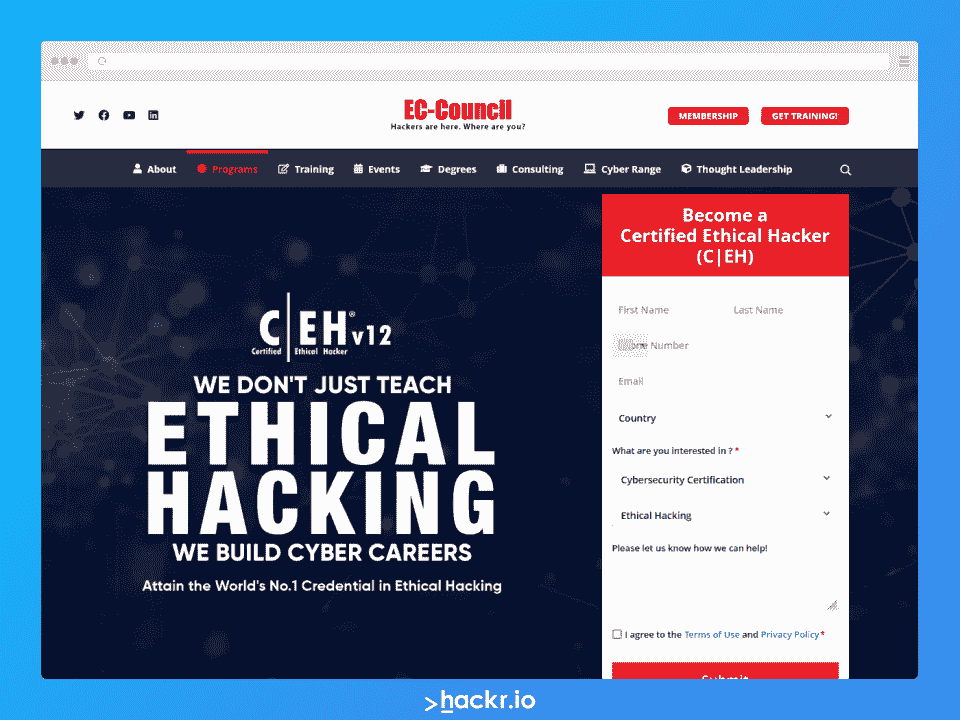
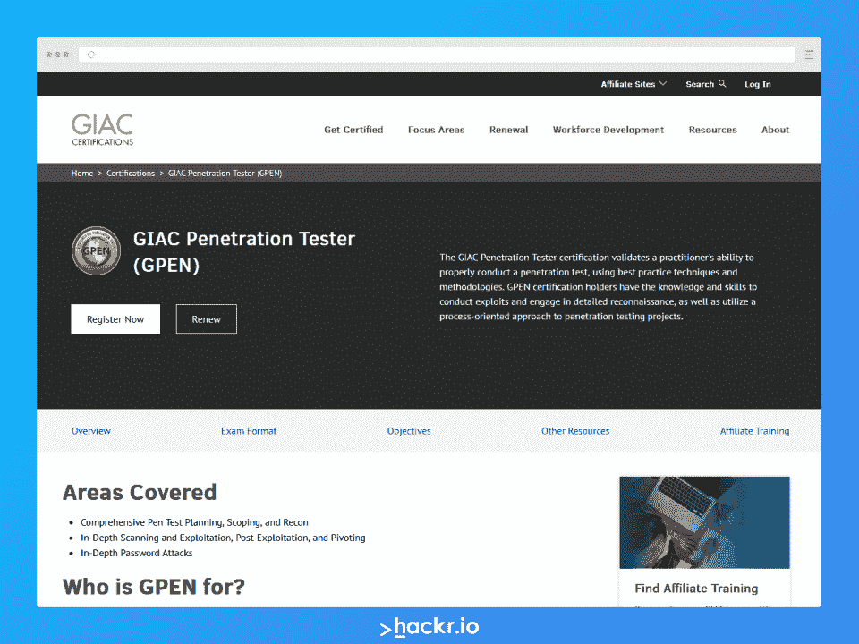
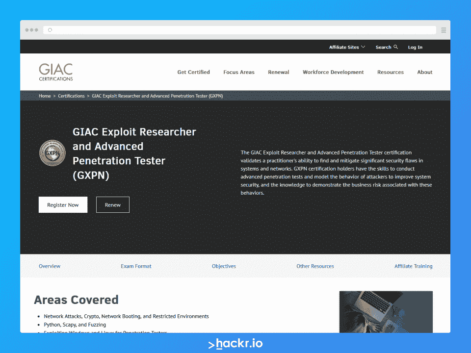
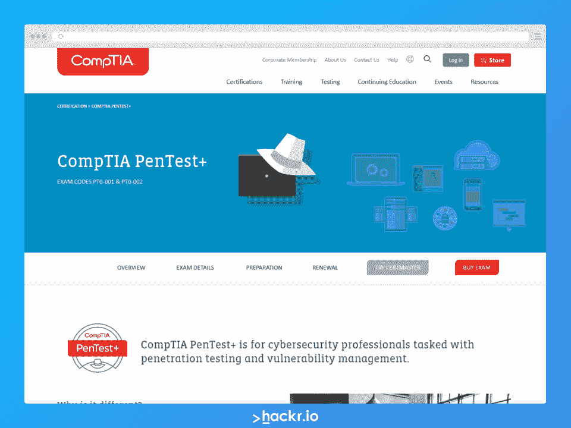
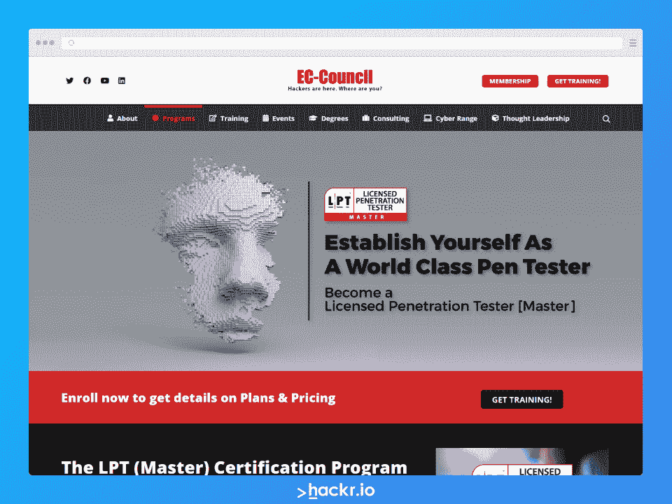
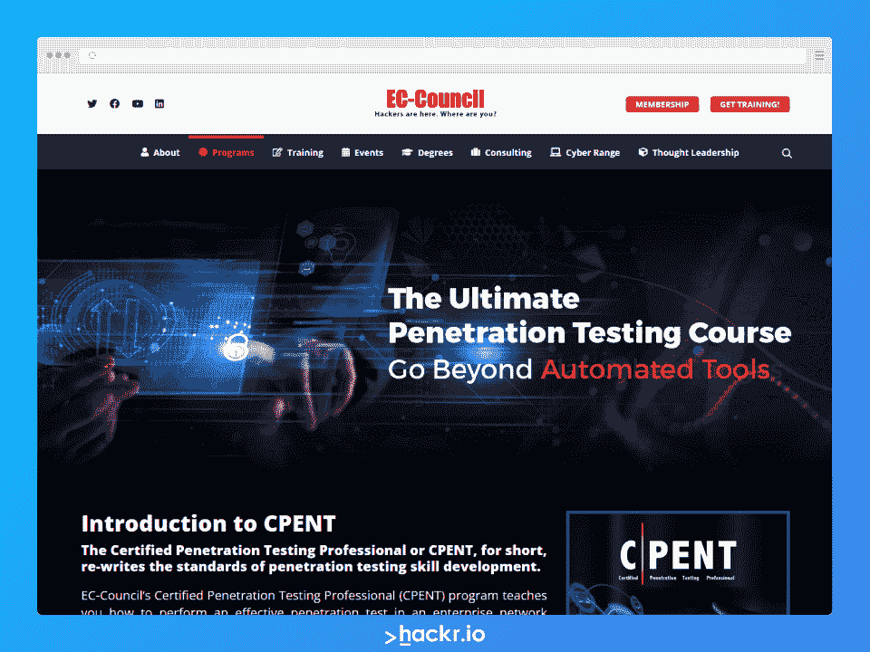
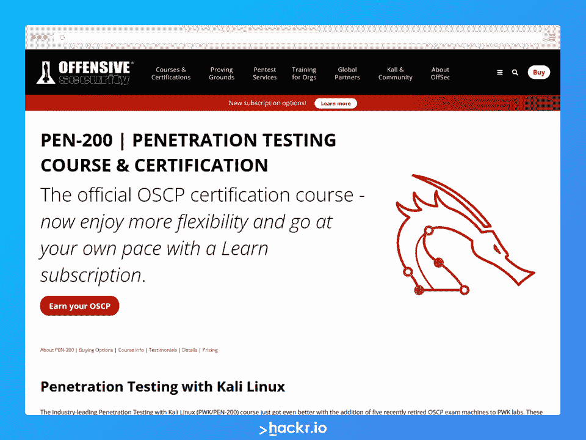
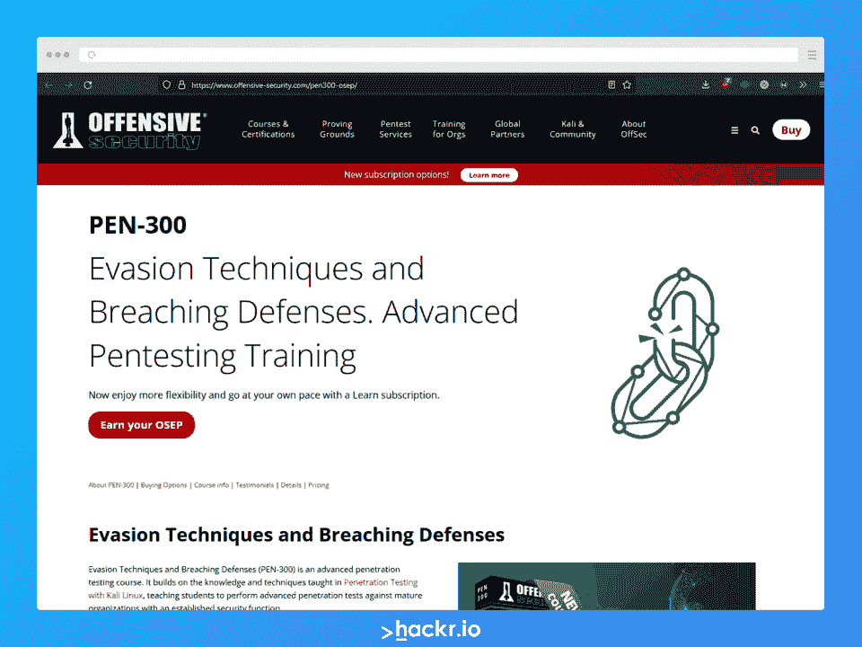

# 渗透测试认证:2023 年前 8 名

> 原文：<https://hackr.io/blog/best-penetration-testing-certification>

渗透测试包括测试计算机系统、网络或 web 应用程序的潜在漏洞。渗透测试通常被称为 pen testing，可以手动执行，也可以借助一些工具自动执行，例如 [Selenium](https://hackr.io/blog/what-is-selenium) 。一些渗透测试仪更喜欢手动和自动方法的结合。

参与渗透测试的专业人员通常被称为**笔测试员**。笔测试人员可以负责评估系统的整体安全性，并确保产品具有强大的安全级别。他们还可能承担执行红队评估等任务。然而，pen 测试人员的角色和职责可能因组织而异。

随着越来越多的公司开始认识到安全性的重要性，对渗透测试人员的需求持续增长。据[Indeed.com](https://www.indeed.com/career/penetration-tester/salaries)报道，截至 2022 年 10 月，美国钢笔测试员的平均年薪徘徊在 121215 美元。然而，如果你想成为一名验笔师，首先你需要具备一些资格。

雇主会在你的简历中寻找的第一件事就是你是否有渗透测试证书。证书有助于展示你在这方面的知识，并能让潜在雇主了解你的能力。

但是有这么多的认证，你怎么知道先获得哪一个呢？

这篇文章将向你展示最好的 pentesting 认证，以及如何选择适合你的认证。我们还将介绍如何获得和保持认证。准备好了吗？我们开始吧！

## **笔测试仪认证的类型**

最好的 pentesting 认证通常具有重叠的特征，这使得很难找到一个清晰的分类。你可以很容易地找到涵盖大多数必需主题的证书，尽管一些更适合的选项允许你获得移动应用程序笔测试或网络应用程序笔测试的证书。即使有了这种区别，定义“类型”仍然非常困难因此，区分证书的最佳方式是技能水平。

认证通常有三种技能水平。每个技能等级都有证书，提供适当的主题和挑战。这些级别如下所示:

*   入门级或初学者
*   中间的
*   高级或专家

由于 pen 测试认证重叠，并且每个技能级别都有不同的选项，因此安全专业人员获得多个认证并不罕见。事实上，拥有多个证书来显示你在相关领域的知识和技能通常是更好的选择。

**推荐课程**

[从头开始学习道德黑客](https://click.linksynergy.com/deeplink?id=jU79Zysihs4&mid=39197&murl=https%3A%2F%2Fwww.udemy.com%2Fcourse%2Flearn-ethical-hacking-from-scratch%2F)

## **测笔员如何获得认证？**

获得钢笔测试员证书通常需要参加评估考试。有时候，你可以在自学一段时间后这样做。然而，大多数认证可能要求你也完成一门课程，为你的考试做准备。

专业人士可以从少数认证机构获得认证。一些组织在世界范围内都很有名，也很受尊重，而另一些组织在大陆或国内更有名。一些最好的认证机构包括 CompTIA、GIAC(全球信息保证认证)、EC-Council 和进攻性安全。

然而，你也可以参加一个课程，从提供该课程的公司获得证书。并不是所有的公司都有高质量的课程和值得信赖的商业实践，所以一般建议在选择证书时要谨慎。

## **最佳渗透测试认证**

许多组织提供笔测试认证。然而，并不是所有这些组织和认证都很棒。如果你决定获得渗透测试认证，这里是我们为你挑选的最好的钢笔测试认证。

****

**级别:**专家

**提供者:**欧盟委员会

**有效期:** 3 年

**费用:**每个选项包含不限次数的重考。然而，每次尝试要交 100 美元的管理费。你每年只能尝试 4 次，每次尝试之间有 14 天的冷静期。

*   无限制点播:1499 美元

*   更多信息请点击[这里](https://iclass.eccouncil.org/our-courses/certified-ethical-hacker-ceh/)

终极[道德黑客](https://hackr.io/blog/best-ethical-hacking-courses)认证非常适合那些想要进入职业白帽黑客的人。对于想要证明自己技能的渗透测试人员来说，该认证涵盖以下内容:

*   动手黑客挑战
*   新兴攻击媒介
*   现代利用技术
*   现代案例研究和时事
*   恶意软件分析
*   云和物联网黑客
*   以及其他技术、技巧和工具

EC-Council 设计了该评估来模拟和测试真实世界的场景和知识。认证考试包括 125 个问题，历时 4 小时。测试采用多项选择的形式，问题从不同的题库中抽取。通过后，你将获得认证道德黑客(CEH)认证。

[**了解更多 CEH**](https://www.eccouncil.org/programs/certified-ethical-hacker-ceh/)

****

**等级:**中级

**提供者:** GIAC

**有效期:** 4 年

**费用:** $949 仅用于评估

全球信息安全认证或 GIAC 设计了 GPEN 证书，以验证个人在真实世界场景中执行全面渗透测试的能力。渗透测试人员将在以下领域证明他们的技能:

*   全面渗透测试
*   规划、范围界定和侦察
*   深度扫描和利用
*   后开发和旋转
*   高级密码攻击
*   攻击密码哈希
*   Azure 应用程序和攻击策略
*   域名升级和持续性攻击
*   升级和剥削

GIAC 认证考试通过 PearsonVUE 的在线监考系统在网上进行。考试形式是一场监考考试，包括 82 个问题，历时 3 小时。最低及格分数为 75%。

[**了解更多 GPEN**](https://www.giac.org/certifications/penetration-tester-gpen/)

****

**级别:**专家

**提供者:** GIAC

**有效期:** 4 年

**费用:** $949 仅用于评估

GIAC 漏洞研究员和高级渗透测试员(GXPN)认证是一项高级认证，旨在验证个人执行复杂水平的渗透测试和漏洞研究的能力，即使是在复杂且防御良好的网络中。渗透测试人员将在以下领域证明他们的技能:

*   访问网络
*   先进的模糊技术
*   高级堆栈粉碎
*   客户剥削和逃脱
*   钢笔测试员用密码
*   利用网络
*   模糊化介绍和操作
*   内存和动态 Linux 内存简介
*   Windows 开发简介
*   操纵网络

考试形式是由 60 道题组成的监考考试。考试时间 3 小时，最低及格分数 67%。您在 CyberLive 系统中进行评估，这是一个旨在复制真实世界系统和真实世界应用程序的动手操作系统。该系统创建了一个具有真实程序、代码和虚拟机的实验室环境。

[**了解更多 GXPN**](https://www.giac.org/certifications/exploit-researcher-advanced-penetration-tester-gxpn/)

****

**等级:**中级

**提供者:** CompTIA

**有效期:** 3 年

**成本:**

*   基础套装:565 美元(包括重考和官方学习指南电子书)

*   考试准备套装:720 美元(包括 PenTest+的基础课程和 CompTIA CertMaster 实践课程的所有内容)

*   电子学习捆绑包:977 美元(包括重考+comp TIA 集成 CertMaster Learn 和 CompTIA Labs for PenTest+)

CompTIA 是一家著名的 IT 安全认证提供商。其渗透测试的重要认证之一是 PenTest+认证。

该证书的评估涉及 85 个问题，包括选择题和基于表现的实践题。CompTIA PenTest+考试涵盖以下五个领域:

*   攻击和利用
*   信息收集和漏洞识别
*   测试工具
*   规划和范围界定
*   报告和交流

CompTIA PenTest+认证除了评估基本渗透测试技能之外，还评估候选人的基本管理技能。除了桌面和服务器环境之外，它还展示了在基于云的环境和基于移动的环境中执行笔测试的知识。

考生可以选择在皮尔逊 VUE 考试中心或在线监考中心进行线下考试。参加 CompTIA PenTest+认证考试的总时长为 165 分钟，最低及格分数为 750 分(满分为 900 分)。

[**了解更多 CompTIA PenTest+**](https://www.comptia.org/certifications/pentest)

****

**级别:**专家

**提供者:**欧盟委员会

有效期:最初 2 年，之后每年一次

**费用:**250 美元

LPT 或特许渗透测试仪是欧盟委员会颁发的专家级渗透测试认证。LPT 认证的考试长达 18 个小时。分为三个部分，称为水平，每个包含三个基于现实生活场景的挑战。

考生有六个小时的时间来完成每个级别。您需要在具有纵深防御控制的多层网络架构中工作。

在网络和网络应用程序中搜索数据时，候选人需要快速决定选择使用的方法和漏洞。该认证评估候选人在以下方面的能力:

*   多级旋转
*   操作系统漏洞利用
*   SSH 隧道
*   Web 服务器和 web 应用程序利用，包括任意本地和远程文件上传、参数操作和 SQL 注入

LPT 是一个独特的认证。要通过考试，你必须至少得 90 分——这是一个很高的标准。但是，即使你没有通过 LPT 认证，拿到 70%也会让你获得 CPENT 证书。认证渗透测试人员会告诉你，这是目前最好的证书之一。

[**了解更多 LPT**](https://www.eccouncil.org/programs/licensed-penetration-tester-lpt-master/)

**级别:**专家

**提供者:**欧盟委员会

**有效期:** 3 年

**成本:**

CPENT 评估非常累人，需要 24 小时才能完成。这种基于表现的考试是实践性的，您可以选择参加一次 24 小时的考试或两次 12 小时的考试。获得该认证证明您具备在企业网络环境中进行 pen 测试的知识和技能。

该证书将测试您在以下科目中的知识，包括但不限于:

*   高级 Windows 攻击
*   绕过过滤网络
*   逃避防御机制
*   将你的功绩武器化
*   测试操作技术
*   通过旋转访问隐藏网络
*   攻击物联网系统

CPENT 是独一无二的认证。要通过考试，你必须至少得 70 分。然而，如果你超越并获得了 90%的分数，你也将获得久负盛名的 LPT 认证！

[**了解更多关于 CPENT**](https://www.eccouncil.org/programs/certified-penetration-testing-professional-cpent/#is-ceh-a-pen-test-program-)

****

**等级:**初级到中级

**提供者:**攻击性安全

**有效期:** OSCP 是独一无二的，因为一旦您获得了它，您就可以无限期地保留您的认证——无需重新认证

**成本:**

*   **个人课程-1，499 美元(自学、90 天实验室访问、一次考试机会)**

*   学习一项——2499 美元(自学、一年的实验室使用权、两次考试机会和独家内容)

*   无限学习——5499 美元(所有在线课程、一年的实验室使用权、无限制的评估尝试和独家内容)

*如果你是 pen 测试新手，还需要学习基础知识，可以考虑进攻安全的* [*基础知识捆绑*](https://www.offensive-security.com/fundamentals/) *。该软件包包括各种在线网络安全基础课程，包括 PEN-100 测试基础知识。*

PEN-200 课程和在线实验室旨在帮助个人准备 OSCP 认证考试。OSCP 认证确保个人拥有正确保护网络的技能。本课程面向信息安全专业人员、笔测试人员、安全专业人员、网络管理员和其他技术专业人员，包括:

*   渗透测试
*   命令行控制
*   实用工具
*   Bash 脚本
*   被动信息收集
*   Web 应用程序攻击
*   缓冲区溢出
*   Linux 缓冲区溢出
*   客户端攻击
*   公共事业
*   文件传输
*   防病毒规避
*   密码攻击

进攻型安全公司设计了 OSCB 认证考试来模拟私有 VPN 上的真实网络。考生总共有 23 小时 45 分钟完成考试。建议个人在参加 OSCP 认证考试之前先参加一个月或两个月的实验室。PEN-200 课程提供了这个实验。

[**了解更多 OSCP**](https://www.offensive-security.com/pwk-oscp/)

****

**级别:**专家

**提供者:**攻击性安全

**有效期:** OSEP 是独一无二的，因为一旦您获得了它，您就可以无限期地保留您的认证——无需重新认证

**成本:**

*   **个人课程-1，499 美元(自学、90 天实验室访问、一次考试机会)**

*   学习一项——2499 美元(自学、一年的实验室使用权、两次考试机会和独家内容)

*   无限学习——5499 美元(所有在线课程、一年的实验室使用权、无限制的评估尝试和独家内容)

PEN-300 进攻性安全规避技术和突破防御，或 OSEP，是一个高级认证。这是一个紧张的监考评估，需要 48 小时才能完成，这就是为什么事先尽可能做好准备是有意义的。

本课程和评估专为 OSCP 级别的专业人员设计，将测试您穿透具有强化防御的系统的能力。在本课程中，您将深入探讨以下主题，包括但不限于:

*   操作系统和编程理论
*   绕过网络过滤器
*   Linux 和 Windows 横向移动
*   微软 SQL 攻击
*   防病毒软件简介及高级规避
*   使用 Office 和 JScript 执行客户端代码
*   应用程序白名单

[**了解更多 OSEP**](https://www.offensive-security.com/pen300-osep/)

## 认证必须多久更新一次？

绝大多数网络安全认证的有效期约为两到三年。有效期过后，你需要重新认证。这种频繁的重新认证背后的原因是网络安全领域的发展速度。你两年前学到的信息在今天可能已经过时了，这就是为什么大多数认证机构建议你更新你的证书。

由于频繁的重新认证，大多数证书都有“版本”一个很好的例子是 CEH，现在已经是第 11 版了。获得 CEH 认证是不够的，你还必须合理地更新。带着 CEH v5 认证去参加工作面试不太可能让你得到回电，因为你的知识和技能在今天已经过时了。

并非所有认证都遵循相同的有效期周期。检查你需要重新认证的频率是一个好主意，因为这意味着你需要准备时间来学习和参加考试。此外，还需要考虑重新认证的成本。

## **如何选择最好的笔考认证**

无论你是网络安全的新手，还是打算转向渗透测试的经验丰富的专业人士，不可否认，今天有许多 pen 测试认证可用。选择一个适合你具体情况的方法是很有挑战性的，尤其是当你不确定从哪里开始的时候。幸运的是，在选择笔测试仪认证时，有几个因素需要考虑，例如:

1.  费用 -认证有不同的价格区间，有些比其他的更实惠。有些证书会允许你自学，然后在你觉得准备好的时候让你参加评估考试。这些认证通常费用较低，因为您通常只需支付评估费用。另一方面，一些认证可能要求你也支付一个预备课程，教你考试需要知道的东西。
2.  **你的技能水平** -无论你是新手还是经验丰富的 IT 专业人士，选择适合你技能水平的 pentest 认证是至关重要的。超出你的能力范围去获得认证可能只会让你浪费时间和金钱。从你力所能及的证书开始，然后当你达到这一点时，开始赚取更高技能水平的证书。
3.  **认证要求**——每个证书都有其要求。如果你不符合标准，你几乎不能尝试参加评估。消除那些你还不具备资格的证书，为自己节省一些时间。
4.  **重新认证要求** -当您获得安全测试认证时，您可能会注意到该证书仅在一定时间内有效。虽然有些证书可能永远有效，但这种情况很少。由于网络安全领域的快速发展，您更有可能需要每年(或每隔几年)重新认证。因此，当你考虑申请哪一个 pen 考试证书时，你可能要考虑重新认证的要求和相关的费用。
5.  质量 -不是所有的证书都是一样的。有的比有的强，在行业内更受尊重。它可能会让你了解一个认证的声誉，看看它是否是该领域的需求。这是一个好主意，赚取业内积极看待的证书，避免任何可疑或不存在的声誉。
6.  **认证机构**——最后但同样重要的是，你应该一直关注认证机构。就像你想知道一个证书是否在行业中受到尊重一样，你也想了解认证机构，以确保他们是高质量的，光明正大的。避免认证机构或程序供应商的可疑交易，以避免浪费你的时间和血汗钱。

## **结论**

我们希望这份 2023 年你能获得的最佳渗透测试认证清单能帮助你找到职业生涯的起点。如果你仍然不确定从哪里开始，或者如果你是一个绝对的初学者，仍然需要学习基础知识，你可以考虑从进攻性安全的 [PEN-100](https://www.offensive-security.com/fundamentals/) 开始，这是一个涵盖基础知识的程序。

就是这样！这就是我们 2023 年可以获得的 11 个最佳渗透测试证书的完整列表。结合经验，证书可以帮助你给潜在雇主留下更好的印象。为你的面试做好准备，你可以进一步增加在这个领域找到工作的机会。

那么，你想从这个列表中获得哪一个认证呢？请在下面的评论中告诉我们！

**有兴趣学习** [**软件测试**](https://hackr.io/blog/what-is-software-testing) **？尝试一些由 Hackr.io 社区策划的** [**最佳软件测试教程**](https://hackr.io/tutorials/learn-software-testing?ref=blog-post) **。**

## **常见问题解答**

#### 1.渗透测试哪个认证最好？

最好的渗透测试认证将是那些适合你的预算和技能水平。他们还必须来自业内公认的声誉良好的公司。你可以从攻击性安全和 EC-Council 检查笔测试认证。或者，你也可以试试 GIAC。

#### 2.成为渗透测试员需要什么资格？

你需要操作系统、编程、脚本等方面的技术技能和工作知识。您还需要了解它以及安全系统是如何工作的，以便能够成功地测试漏洞和攻击点。知道如何使用 Kali Linux 等笔测试工具也是有益的。

#### 3.认证够不够雇渗透测试员？

Pen 测试认证可以帮助你在这个行业找到工作，但这不是你需要的唯一资格。潜在的雇主可能会寻求经验*和*证书的组合，因为没有可验证的经验，确定你的知识和技能水平会很有挑战性。雇主还会寻找所需的技术技能，但你也必须值得信任，尤其是因为钢笔测试人员经常接触到敏感数据。

#### 4.CEH 和 OSCP 哪个更好？

CEH 和 OSCP 都是高质量的钢笔测试认证机构。然而，CEH 似乎更适合那些希望扩大网络安全知识，而不一定以道德黑客和渗透测试为职业的 it 专业人士。另一方面，OSCP 更适合想以测试笔为职业的 IT 专业人士。

**人也在读:**