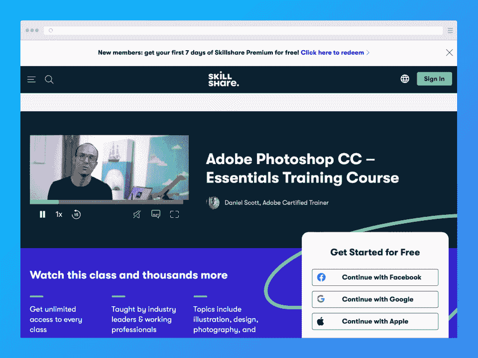
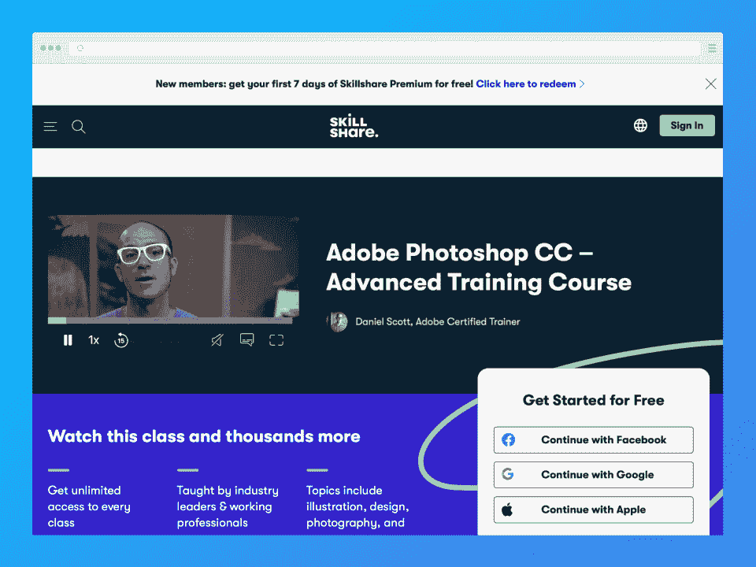
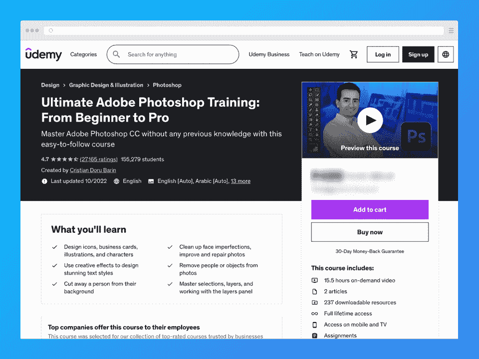
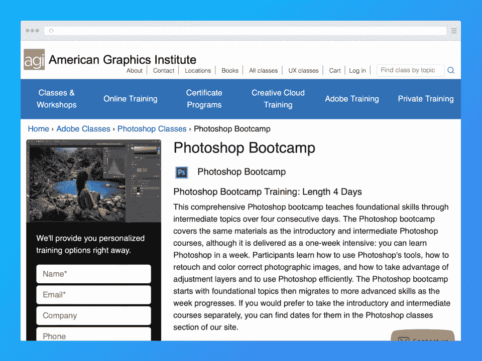
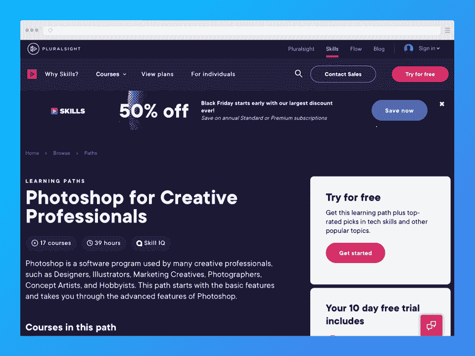
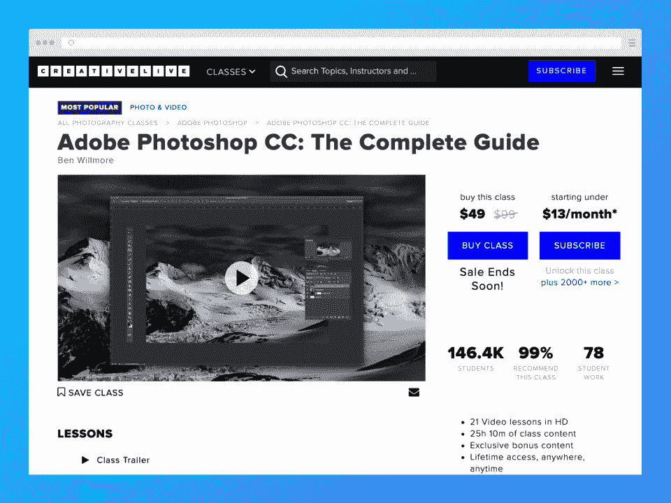

# 2023 年 6 门最佳在线 Photoshop 课程

> 原文：<https://hackr.io/blog/best-photoshop-courses>

如果你正在考虑成为一名平面设计师或者有某种平面设计需求，你可能听说过 Adobe Photoshop。毕竟 Photoshop 是行业标准。

Photoshop 无处不在，不仅仅是在设计行业。

即使你从未做过任何与平面设计相关的工作，你也可能听说过 Photoshop。“Photoshop”这个词已经成为图形和照片编辑的同义词。这个 Adobe 产品如此受欢迎，以至于我们把它的名字用作动词和形容词。

如果有人怀疑一张照片被修改过，他们可能会说这是“PS 过的”如果有人想编辑他们的照片，他们可能会说这样的话，“哦，我待会儿再用 Photoshop 处理。”

只有当你试图学习平面设计时，你才可能想先学习 Photoshop。如果你想快速学习 Photoshop，你最好的选择是参加一些 Photoshop 课程。

在本文中，我们将向您展示一些最好的在线 Photoshop 课程。如果你觉得 Photoshop 不适合你，我们也列出了一些你可以尝试的选择。我们开始吧！

## **特色课程:我们的精选课程**

## **提高技能的最佳 Photoshop 课程**

*   **最适合初学者:**(Skillshare)Adobe Photoshop CC-Essentials 培训课程

*   **最适合高级学习者:**(Skillshare)Adobe Photoshop CC-高级培训课程

*   **最佳一体化 Photoshop 课程:**(Udemy)Adobe Photoshop 终极培训:从初学者到专业人员

*   **boot camp 格式最佳班级:**(美国图形学院)Photoshop Bootcamp

*   **最适合有抱负的平面设计师:** (Pluralsight)面向创意专业人士的 Photoshop
*   **另一个优秀的 A-Z 程序:**(creative live)Adobe Photoshop CC:完全指南

[****](https://skillshare.eqcm.net/5b9AA3)

*   价格:一个月免费试用，然后每月 32 美元或每年 168 美元(每月 14 美元)
*   **作者**:丹尼尔·斯科特
*   **等级**:初学者
*   **证书**:否

**我们为什么选择本课程**

我们将这门课程列入最佳 Photoshop 在线课程名单，因为它是最适合初学者的 Photoshop 课程之一。Skillshare 是一个众所周知的为寻求提升技能的创意人员提供的平台，Adobe 认证培训师 Daniel Scott 开设的这门课程无疑是一个很好的起点。

**优点**

*   由 Adobe 认证培训师创建的课程
*   非常适合学习基础知识
*   Skillshare 是一个众所周知的创意平台

**缺点**

*   Skillshare 遵循订阅模式
*   没有证书

[了解本课程的更多信息](https://skillshare.eqcm.net/5b9AA3)

[****](https://skillshare.eqcm.net/e4VqqX)

*   价格:一个月免费试用，然后每月 32 美元或每年 168 美元(每月 14 美元)
*   **作者**:丹尼尔·斯科特
*   **等级**:中级到高级
*   **证书**:否

**我们为什么选择本课程**

作为基础课程的延续，这个高级培训课程是最好的 Photoshop 在线课程之一。它也是由 Adobe 认证培训师 Daniel Scott 创建的。无论你是否完成了第一门课程，你都会在里面找到有价值的内容。

**优点**

*   由 Adobe 认证培训师创建的课程
*   非常适合希望学习更高级概念的中级用户
*   Skillshare 是一个众所周知的创意平台

**缺点**

*   Skillshare 遵循订阅模式
*   没有证书

[了解本课程的更多信息](https://skillshare.eqcm.net/e4VqqX)

[****](https://click.linksynergy.com/deeplink?id=jU79Zysihs4&mid=39197&murl=https%3A%2F%2Fwww.udemy.com%2Fcourse%2Fultimate-photoshop-training-from-beginner-to-pro%2F)

*   **价格**:全价 149.99 美元，特价时 17.99 美元

*   **作者:克里斯蒂安·多鲁·巴林**

*   **等级**:初学者+
*   **证书**:是，完成

**我们为什么选择本课程**

Udemy 有无数不同主题的课程，包括 Photoshop。这门终极课程将带你从零开始熟悉使用 Adobe Photoshop 进行设计和照片编辑的细节。我们选择包括这门课程，因为它的评价很高，价格实惠(出售)，并带你了解开始你的设计生涯所需的一切。

**优点**

*   Udemy 是一个负担得起且可访问的平台
*   竣工证明
*   高质量的

**缺点**

*   Udemy 的证书没有其他平台的那么受尊重

[了解本课程的更多信息](https://click.linksynergy.com/deeplink?id=jU79Zysihs4&mid=39197&murl=https%3A%2F%2Fwww.udemy.com%2Fcourse%2Fultimate-photoshop-training-from-beginner-to-pro%2F)

[****](https://www.agitraining.com/adobe/photoshop/classes/photoshop-bootcamp)

*   **价格【1,290 美元**
*   **作者**:美国图形学会
*   **等级**:初学者
*   **证书**:我们无法确定这门课程是否提供证书，但它是 [AGI 认证项目的一部分](https://www.agitraining.com/adobe/photoshop/classes/photoshop-certification-training-classes)

**我们为什么选择本课程**

不要让他们的基本网站欺骗了你——AGI(美国图形学院)提供一些最好的设计、UX 等方面的培训。本课程是我们 bootcamp 格式的最佳 Adobe Photoshop 课程的首选之一。你可以在四天内学到你需要的东西，尽管这将是一个高压的环境。

值得注意的是，AGI 的教师负责为 Photoshop 创建许多 Adobe 的官方培训指南。AGI 也提供 Photoshop 认证项目。

**优点**

*   强化，让你在几天内学会 Photoshop 的基础和中级概念
*   AGI 的教师为 Adobe 制作了一些官方书籍和培训指南

**缺点**

*   昂贵的
*   挤进一周的学习中

[了解本课程的更多信息](https://www.agitraining.com/adobe/photoshop/classes/photoshop-bootcamp)

[****](https://pluralsight.pxf.io/P03KKN)

*   **标准:每月 29 美元或每年 149 美元**

*   保险费:每月 45 美元或每年 224 美元

*   免费试用是可用的

*   **作者** : Pluralsight 及其高素质的专家团队
*   **等级**:初学者++级
*   **证书**:是，完成

**我们为什么选择本课程**

这个 39 小时的课程是为了帮助有抱负的(和当前的)创意专业人士学习所有关于 Photoshop 的知识。该课程将带您从工具的基础到更高级的功能，同时为您在该领域的职业生涯做好准备。它是由经验丰富的合格教师讲授的。

**优点**

*   课程由 Pluralsight 的专家团队创建和策划，其中包括一名 Adobe 认证的 Photoshop 专家
*   从基础到高级主题
*   Pluralsight 是一个比其他平台更实惠的平台

**缺点**

[了解本课程的更多信息](https://pluralsight.pxf.io/P03KKN)

[****](https://www.creativelive.com/class/adobe-photoshop-cc-the-complete-guide-ben-willmore)

*   **价格**:全价 99 美元，特价 49 美元；免费订阅 CreativeLive，每月 13 美元起
*   作者:本·威尔莫
*   **等级**:初学者
*   **证书**:否

**我们为什么选择本课程**

CreativeLive 的 Photoshop 指南对每个人都有帮助——无论你是初学者还是已经非常熟悉图形程序的人。我们包括这门课程是因为它是一个高质量的项目，有近 150，000 名过去的学生(其中 99%的人推荐这门课，至少根据 CreativeLive 的数据)。虽然这声称是一个完整的指南，但这门课程稍微面向那些希望为他们的摄影工作学习 Photoshop 的摄影师。

**优点**

*   从基本面开始
*   近 15 万往届学生强烈推荐
*   高质量

**缺点**

*   没有证书
*   有点适合摄影师(不总是一个骗局)

[了解本课程的更多信息](https://www.creativelive.com/class/adobe-photoshop-cc-the-complete-guide-ben-willmore)

## **在线 Photoshop 课程:对比一览**

## **查看一些 Photoshop 的替代品**

无论你是在制作一个品牌套件、一个标志、一件 t 恤、一张海报还是一个社交媒体帖子，拥有一个强大的设计工具可以帮助简化这个过程。但是，如果出于某种原因，你决定 Photoshop 根本不适合你(我们也讨厌订阅模式)，这里有一些替代方案可供你考虑:

*   **[结缘照](https://affinity.serif.com/en-us/)**——结缘到现在已经有几年了。它们不像 Adobe 那样大，也不像 Adobe 那样受欢迎，但它们提供了三种工具，可以与 Adobe 自己的一些工具针锋相对。亲和照片是他们的 Photoshop 等价物。你很幸运——Affinity 刚刚发布了完整套件的第二版！Affinity 的软件最好的一点就是它们都是一次性购买的。无需订阅！

*   GIMP - GIMP 或 Gnu 图像处理程序是一个免费的开源图像编辑器，可以做许多 Photoshop 可以做的事情。它不是很完美，所以看起来或感觉起来都不如 Photoshop，但你不能打败免费的价格！
*   如果你发现自己想要一个可以在各种平台上使用的快速解决方案，Canva 是一个很好的选择。他们有一个网络工具，但你也可以为你的设备下载应用程序。Canva 有一个免费选项，但您需要订阅 pro 计划才能获得更多功能和专有资产。

## **我们如何选择最好的 Adobe Photoshop 课程**

这份榜单上的课程没有特别的排名顺序，所以我们没有排名方法论可以分享。但是，我们可以分享一下我们是如何在这个列表中选择最好的在线 Photoshop 课程的。

我们的目的是让像您这样的用户更容易、更方便地在线学习 Photoshop。为了实现这一目标，我们首先做了一些研究，整理出我们最初的课程列表，然后通过考虑各种因素，如价格、性价比、质量、课程提供商、课程持续时间等，缩小了列表范围。我们还花了几个小时研究每个选项，阅读评论，查看课程设置，并尽可能尝试任何课程。

我们还借鉴了自己几十年来使用 Adobe Photoshop 的经验，这些经验可以追溯到 2000 年发布的第 6 版。从那以后，我们使用了各种版本的 Photoshop，目前有最新的版本，Adobe Photoshop CC 2023。综上所述，我们相信我们有必要的洞察力来自主选择一些课程。

## **结论**

在过去的几十年里，Adobe Photoshop 一直是图形设计行业的黄金标准，至少在光栅设计方面是如此。毫无疑问，在可预见的未来，它将继续称王，尽管现在有更多的挑战者。

因为 Photoshop 在世界各地是如此普遍和受欢迎，所以对于像你这样的设计师来说，学习 Photoshop 是一个很好的主意，即使你打算在实践中使用其他工具。学习这个强大工具的最好和最快的方法之一就是加入 Photoshop 课程。

我们希望我们的建议对您有所帮助。如果你认为我们错过了这个列表中应该有的课程，请在下面的评论中告诉我们！

**准备好补充你的设计知识了吗？结账:**

**[每个设计师都应该看的顶级平面设计书籍。](https://hackr.io/blog/graphic-design-books)**

## **常见问题解答**

#### **1。Photoshop 哪个课程最好？**

最好的在线 Photoshop 课程取决于几个因素，比如你的预算和技能水平。你也可以考虑其他因素，比如你想学习的主题，你喜欢的平台等等。最后，只有你能决定哪门课程是最好的，但我们已经尽了最大努力提供了一份今天顶级 Adobe Photoshop 课程的列表。

#### **2。学 Photoshop 需要多长时间？**

这个问题很难回答，因为每个人都按照自己的速度学习。此外，Photoshop 在其存在的几十年中已经发展成为一个令人难以置信的复杂工具——事实上，即使是“精通”Photoshop 的平面设计专家也会时不时地学习一些新东西。你也许可以在几周到几个月内学会这个工具的基本原理，但是你需要在几年内继续学习。

#### **3。Photoshop 课值得上吗？**

Photoshop 研讨会和课程提供的结构化学习过程可以使学习设计工具变得更加容易。课程将带您一个接一个地了解重要的功能，同时解释它们是如何工作的，以及何时以及为什么您可能想要使用它们。在我们看来，如果你想要一个快速线性的在线学习路径，Photoshop 课程是值得的。

#### **4。Photoshop 课程多少钱？**

如果你有兴趣在网上注册一些 Photoshop 课程，价格自然是你最关心的问题之一。没有单一的答案，因为价格可能会有很大差异——有些课程是 100%免费的，而其他课程可能要花费一千多美元。价格取决于几个因素，比如课程的形式、课程提供商，以及你是否能在销售过程中达成交易。